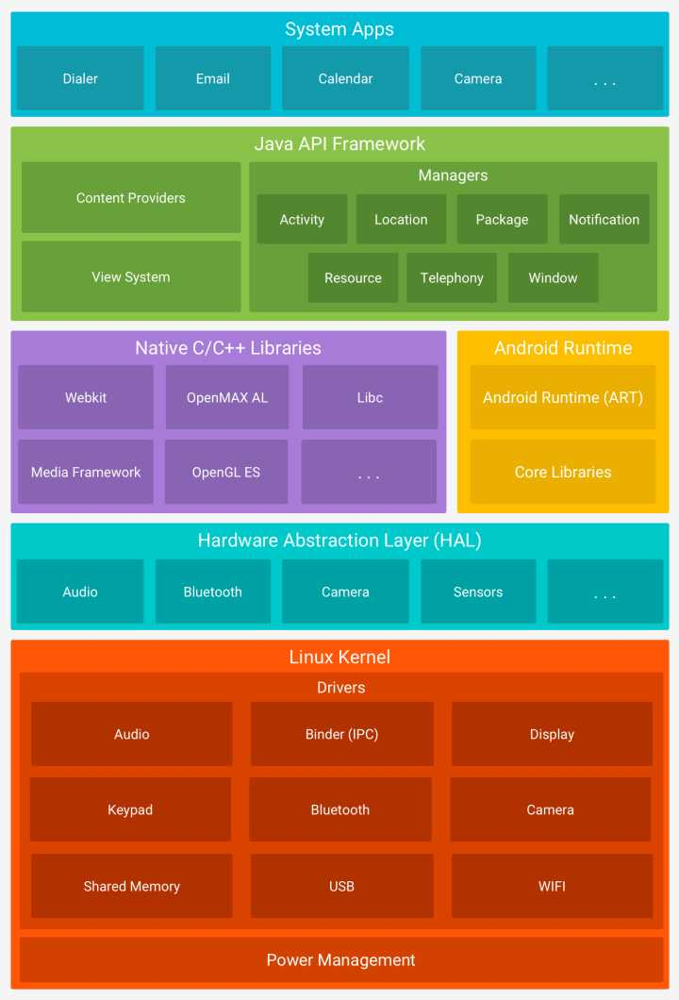

Linux使用GPL协议，AOSP使用Apache协议。

> GPL：Copyleft，是一种英语的调侃，Copyright（版权声明）中的right指权利。left表示相反。
>
> 实际上GPL也是一种Copyright，是软件作者对软件的授权。

Android为了规避GPL的传染性，在Linux Kernel的基础上搭建了HAL，把用户层和Kernel层分开，这样只有Kernel部分需要遵循GPL，用户层不需要，例如硬件驱动可以放在HAL层，不需要遵循GPL。

Binder是通过Linux内核的动态模块加载

# 结语

参考资料：

1. [科普一下GPL和开源软件](https://zhuanlan.zhihu.com/p/36091228)
2. [Linux的IPC机制（三）：Binder](https://www.jianshu.com/p/15c6167cc666)

[音视频开发资料](https://www.jianshu.com/p/addfc333c8a2)

https://www.jianshu.com/u/eed7e92234bf