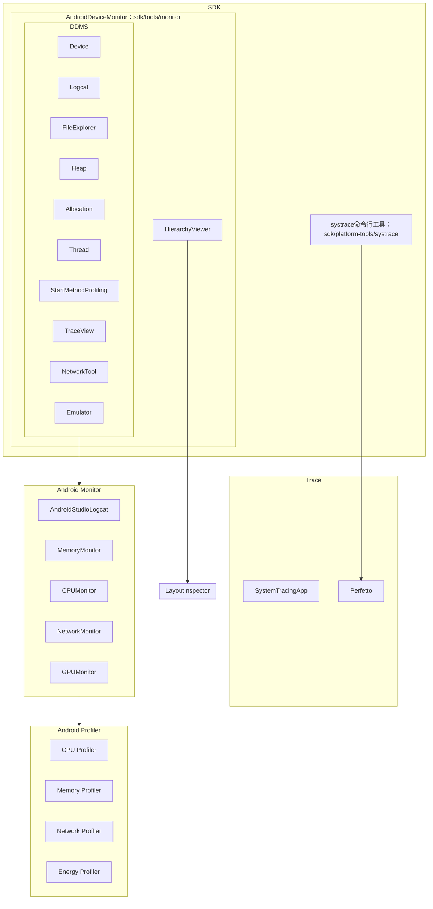
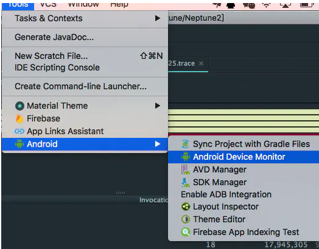
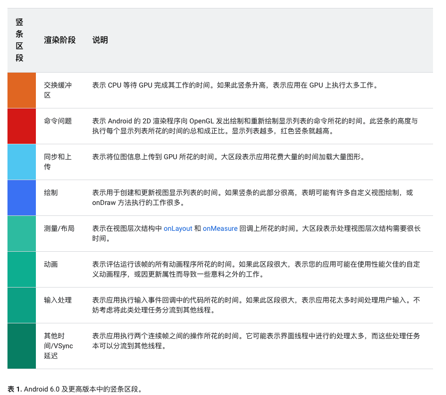

# 工具




## MAT（Memory Analyzer Tool）

Java堆分析工具，和Eclipse一起使用。用于分析hprof文件。也有独立运行的MAT

[MAT使用入门](https://www.jianshu.com/p/d8e247b1e7b2)

## DDMS（Dalvik Debug Monitor Server）

包含多个工具：

* Device：用于查看连接设备
* Logcat：查看日志
* File Explorer：浏览设备文件
* Heap：用于查看进程堆使用情况
* Allocation Tracker：查看虚拟机内存分配情况
* Thread：查看所有线程信息
* Start/Stop Method Profiling：开始/停止跟踪，采集数据，并自动使用TraceView显示图形化界面，可以导出`.trace`文件
* TraceView：分析跟踪日志
* Network Traffic tool：监测网络使用情况
* Emulator Contr：仿真控制、模拟器控制，如模拟电话、短信、位置、通知等

## TraceView

集成在DDMS和monitor工具中，图形界面分析`.trace`文件。只能分析数据，不具备采集数据功能

需要生成`.trace文件`：见[生成跟踪日志](#生成跟踪日志)

界面如下图：

TraceView界面：


TraceView时间轴窗格：


TraceView分析窗格：


TraceView和systrace：

> TraceView：捕获某个时间段内所有信息再全部分析，影响性能。（一个人犯罪了，把全国人民抓起来审问），5.0以上可以设置采样间隔，避免影响性能
>
> systrace：在系统关键流程中插桩Tag，收集开始和结束时间。掌握基本信息->假设->分析->缩小范围验证
>
> systrace缩小范围，traceview对具体函数调用进行分析

## dmtracedump

SDK工具：`Android/sdk/platform-tools/dmtracedump`，将`.trace`文件生成图形化的方法调用堆栈图

`dmtracedump [-ho] [-s sortable] [-d trace-file-name] [-g outfile] trace-file-name`


## Android Device Monitor

### 工具介绍

```
Android Device Monitor = DDMS + HierarchyViewer
```

通过`Tools-->Android-->DeviceMonitor`打开。




### 按钮介绍

1. Debug：开启调试，需要有源代码
2. Update Heap：更新堆使用情况，选中时右侧面板显示堆栈信息
3. Dump hprof file：生成堆使用情况文档
4. Cause GC：触发垃圾回收
5. Update Thread：更新线程运行状态，选中时右侧面板显示线程运行状态
6. Start Method Profiling：开启方法跟踪
7. Stop：结束进程
8. Screen Capture：截屏
9. HierarchyViewer：查看View树


### 迁移说明

Android Studio3.1中废弃，AndroidStudio3.2中移除。替换为Android Profiler。[AndroidDeviceMonitor迁移](https://developer.android.com/studio/profile/monitor)

可以运行`Android/sdk/tools/monitor`打开

- DDMS--->Android Profiler、ADB、Android Emulator、Device File Explorer、Debugger Window等
- TraceView--->CPU Profiler
- systrace--->systrace命令工具、CPU Profiler
- Tracer for OpenGL ES--->Android GPU Inspector
- Hierarchy Viewer--->Layout Inspector
- Pixel Perfect--->Layout Inspector
- Network Traffic tool--->Network Profiler

## Android Monitor


包含Logcat、Memory、Network、CPU、GPU

## Android Profiler

包含CPU、内存、网络、能耗分析器


# 分析CPU

[系统跟踪](https://developer.android.google.cn/topic/performance/tracing)

## 生成跟踪日志

* 使用CPU Profiler工具开始、停止跟踪
* 通过应用Debug插桩生成跟踪日志

[官方文档](https://developer.android.com/studio/profile/generate-trace-logs?hl=zh-cn)

生成`.trace`文件，包含二进制方法跟踪数据，以及一个包含线程和方法名称的映射表

生成文件存储在`getExternalFilesDir()`路径下`/sdcard/Android/data/$packagename/files`

```kotlin
//开启跟踪，可以指定文件名称
Debug.startMethodTracing()
//停止跟踪
Debug.stopMethodTracing()
```

注：

* 启用剖析功能后，应用的运行速度会减慢，因此应该对比相对时间，而不是绝对时间
*  Android 5.0（API 级别 21）以上，新增`Debug.startMethodTracingSampling(String tracePath, int bufferSize, int intervalUs)`方法，可以基于采样的方法跟踪，定期采样，减少对性能的影响，需要设置采样间隔。
* 未指定新的文件名称，调用多次跟踪方法，旧文件会被覆盖。可以动态的重命名文件，如下

```kotlin
val dateFormat: DateFormat = SimpleDateFormat("dd_MM_yyyy_hh_mm_ss", Locale.getDefault())
val logDate: String = dateFormat.format(Date())
Debug.startMethodTracing("sample-$logDate")
```

## Systrace命令行工具

原理：在系统关键流程中插桩Tag，收集开始和结束时间。源码中有大量插桩代码，如ActivityThread

应用也可以自定义Tag插桩，代码中调用`Trace.traceBegin`、`Trace.traceEnd`、`Trace.beginSection`、`Trace.endSection`

使用：

1. `cd Android/sdk/platform-tools/systrace``
2. 收集报告：`systrace.py [options] [category1 [category2 ...]]`
   1. option为选项：可用`2021-12-12-Android性能分析/systrace.py -h`查看
      1. `-t N`：捕获时间
      2. `-a <package_name>`：开启指定报名中自定义Tag的Trace功能
      3. `-l`：列举常用category
      4. `-o`：输出文件，默认输出`trace.html`
   2. category为要捕获的信息：可用`2021-12-12-Android性能分析/systrace.py -l`查看
      1. `gfx`：Graphics信息，分析卡顿
      2. `input`：输入事件
      3. `sched`：cpu调度、线程信息
      4. `view`：View绘制
      5. `am`：ActivityManager调用信息，分析启动过程
      6. `dalvik`：虚拟机信息，分析GC
      7. `binder_driver`：分析Binder IPC
      8. `core_services`：SystemServer信息
3. [分析报告](https://developer.android.google.cn/topic/performance/tracing/navigate-report)：可以使用[perfetto工具打开](https://ui.perfetto.dev/#!/viewer)

注：

1. systrace要求app是debuggable的，但是debug版本apk和release有差距，结果不准确

> 可以通过反射调用`Trace.setTracingEnabled`开启

2. `Trace.beginSection`和`Trace.endSection`调用一一对应
3. begin和end必须在同一个

## System Tracing App

Android 9.0以上包含一个Sytem Tracing的系统应用。类似于`systrace.py`命令行工具，可以直接从设备获取，无需通过adb连接到电脑

[System Tracing App介绍](https://developer.android.google.cn/topic/performance/tracing/on-device)

1. 录制系统跟踪记录
2. 共享跟踪记录
3. Perfetto中打开报告分析

## Perfetto命令行工具

Android10引入的新一代分析工具，用于替代systrace工具。兼容systrace报告查看：系统跟踪、APP跟踪、跟踪报告分析

大文件打开比systrace快，能长时间跟踪，systrace记录短时间设备活动

[官方文档](https://perfetto.dev/docs/)

[使用介绍](https://developer.android.google.cn/studio/command-line/perfetto)

[Perfetto UI](https://ui.perfetto.dev/)

# 分析内存占用

1. Memory Profiler
2. dumpsys meminfo [package_name]
3. MAT：Memory Analyzer Tool，用于查看hprof文件

对于内存泄漏，主要是指该释放的内存（没有gc引用）没有被释放掉，我们使用这个工具主要可以手动触发gc，那么如何检测是否内存泄漏呢？Heap Viewer中的数值会自动在每次发生GC时会自动更新，那么我们是等着他自己GC么？既然我们是来看内存泄漏，那么我们在需要检测内存泄漏的用例执行过后，手动GC下，然后观察data object一栏的total size(也可以观察Heap Size/Allocated内存的情况)，看看内存是不是会回到一个稳定值，多次操作后，只要内存是稳定在某个值，那么说明没有内存溢出的，如果发现内存在每次GC后，都在增长，不管是慢增长还是快速增长，都说明有内存泄漏的可能性。


- 常驻内存大小 (RSS)：应用使用的共享和非共享页面的数量
- 按比例分摊的内存大小 (PSS)：应用使用的非共享页面的数量加上共享页面的均匀分摊数量（例如，如果三个进程共享 3MB，则每个进程的 PSS 为 1MB）
- 独占内存大小 (USS)：应用使用的非共享页面数量（不包括共享页面）

# 分析网络活动

`Network Profiler`

# 分析能耗

`Energy Profiler`

1. 重置电池数据收集：`adb shell dumpsys batterystats --reset`
2. 断开USB线：充电状态下不会使用电池电量
3. 执行操作
4. 连接手机
5. 输出电池使用情况：`adb shell dumpsys batterystats <package_name>`
6. 生成报告：
   1. 7.0及以上设备：`adb bugreport > [path/]bugreport.zip`
   2. 6.0及以下设备：`adb bugreport > [path/]bugreport.txt`
7. 使用`Battery Historian`分析报告


# GPU渲染速度

查看GPU绘制信息：`dumpsys gfxinfo <packageName`>`

打开GPU呈现模式：`setprop debug.hwui.profile [true/visual_bars/false]`



# GPU过度绘制

开启过度绘制：`setprop debug.hwui.overdraw [false/show/show_deuteranomaly]` 

> 原色-->蓝色-->绿色-->粉色-->红色

1. 去除无用背景
2. 减少层级
   1. 使用TextView+CompoundDrawable
   2. merge：减少布局层级
   3. viewstub：懒加载
   4. include：布局复用
3. 避免嵌套使用weight：计算复杂，影响性能

# 启动速度

1. 冷启动：后台无进程
2. 热启动：后台有进程，如home键回首页
3. 温启动：后台有进程，但Activity需要重建，如am force-stop退出activity之后，进程不会马上被杀

分析方式：

1. `am start -W -n package/activity`
2. 启动应用后查看logcat：Displayd time，低版本在ActivityManager打印，高版本在ActivityTaskManager打印
