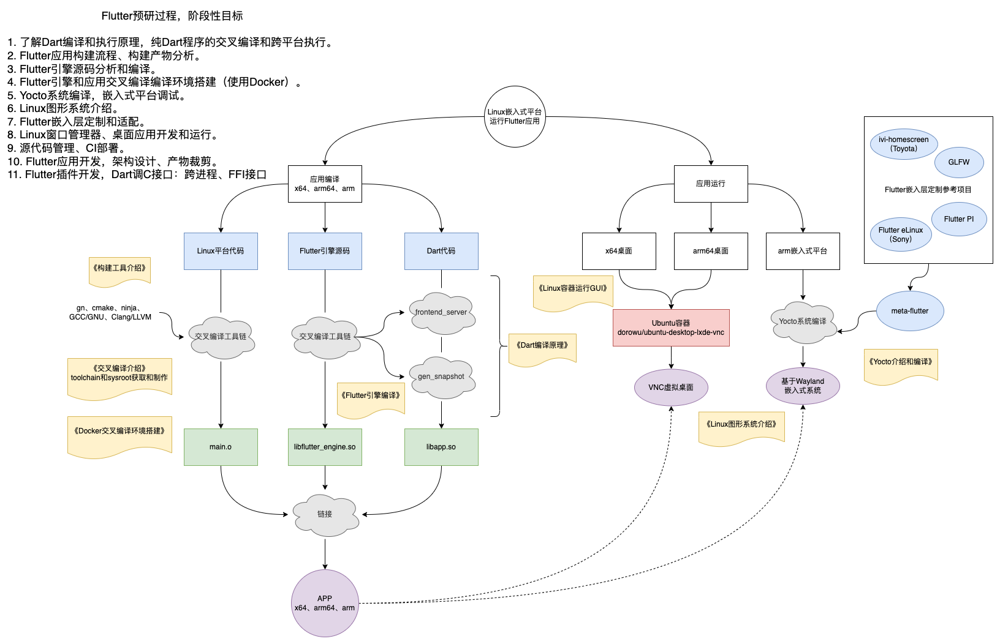

# Flutter简介

Flutter是一个跨平台的UI框架，设计初衷是在各种操作系统上复用UI代码，提供一致的交互体验，同时让应用程序能过与底层平台服务进行交互。

* 支持移动平台（Android、iOS），桌面平台（Windows、Linux、MacOS），Web平台（浏览器），其他嵌入式平台（如车载、IoT设备、树莓派等，需要自行扩展适配）
* 支持多屏幕设备、折叠设备等

## Flutter架构

Flutter SDK包含框架代码、脚手架、编译工具、调试工具和各种脚本等。

Flutter只是一个框架，不是一门语言，Flutter使用了Dart语言，Flutter引擎中的嵌入层（UI渲染、输入输出、以及PlatformChannel等）使用了平台原生语言（如C++，Java等）。

Flutter和Dart类比Android和Java的关系：

|              | Flutter         | Android                 |
| ------------ | --------------- | ----------------------- |
| 编程语言     | Dart            | Java、Kotlin            |
| 编译器       | dart compile    | javac、dx               |
| 应用构建工具 | flutter命令     | gradle命令              |
| Framework    | Flutter SDK     | Android SDK             |
| 底层源码     | Flutter引擎源码 | AOSP系统源码            |
| 源码管理工具 | gclient         | repo                    |
| 源码编译配置 | gn文件          | 低版本mk、高版本bp文件  |
| 源码编译工具 | ninja           | 低版本make，高版本ninja |

# 使用方式

* 统一管理：将原生工程作为Flutter工程的子工程。
* 模块集成：Flutter工程作为原生工程的一个子模块，使用aar或者pod库的方式依赖。

# 结语

单纯学会写Flutter应用很简单，事实上我也是这么入门的：2021年5月份用了一周左右看了[Flutter实战](https://book.flutterchina.club/)，并且实战开发了WanAndroid的Demo。后续就直接上手开发项目，架构设计也不难，一套GetX框架用到底，大部分时候是在学GetX框架，然后自定义组件，写页面和业务等。

学习的过程中也粗略的看了Flutter渲染流程、加载和运行原理、源码架构等文章，感觉一知半解，缺少系统性的学习和总结。刚好有需求做Flutter嵌入式平台的定制开发，涉及到一些进阶的知识，因此做一些整理，虽然对应用开发可能没什么帮助，但是也会有其他的收获和感悟。

研究过程和思路如下：

1. Flutter介绍和跨平台方案对比。
2. Dart编译和执行原理，Dart源码编译：编译前端、编译后端。
3. Flutter应用构建流程、构建产物分析。
4. Flutter引擎源码分析和编译。
5. Flutter引擎和应用交叉编译编译环境搭建（使用Docker）。
6. Yocto系统编译，嵌入式平台调试。
7. Linux图形系统介绍。
8. Flutter嵌入层定制和适配。
9. Linux窗口管理器、桌面应用开发和运行。
10. 源代码管理、CI搭建和部署。
11. Flutter应用加载流程、渲染原理。
12. Flutter应用开发，架构设计、产物裁剪。
13. Flutter插件开发，Dart调C接口：跨进程、FFI接口

参考资料：

* [Flutter中文网](https://flutterchina.club/)
* [Flutter实战](https://book.flutterchina.club/)
* [Flutter架构概览](https://flutter.cn/docs/resources/architectural-overview)

https://zhuanlan.zhihu.com/p/394560540

https://segmentfault.com/a/1190000037683839?utm_source=tag-newest

https://www.jianshu.com/p/3e5d181ddf79

https://www.jianshu.com/p/07bd34831f92

https://www.jianshu.com/p/9536ffd7bbbc

https://www.cnblogs.com/xl2432/p/11596695.html