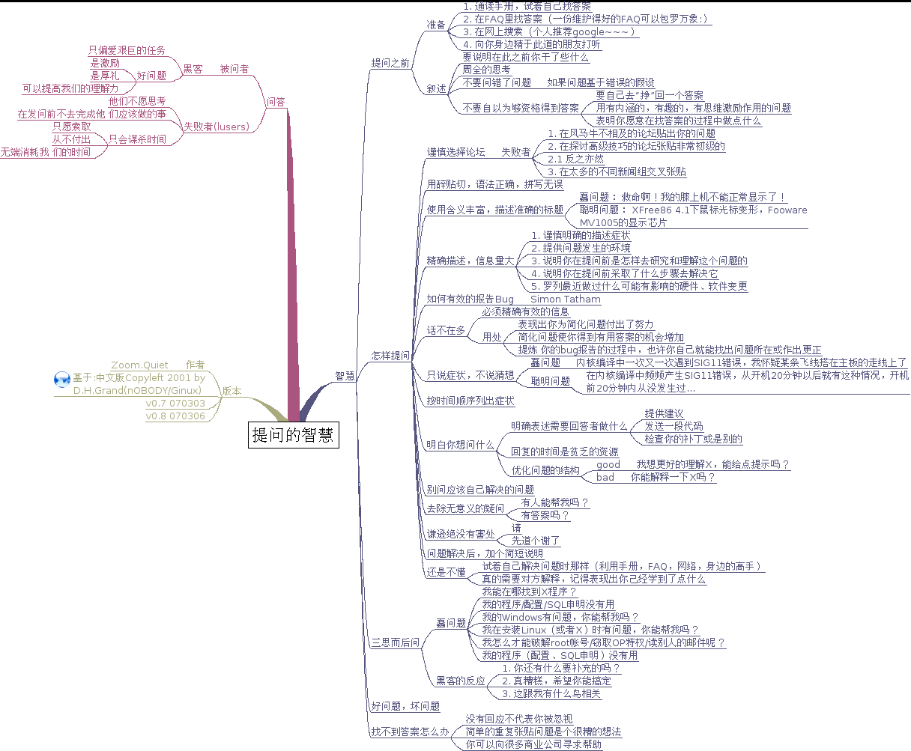
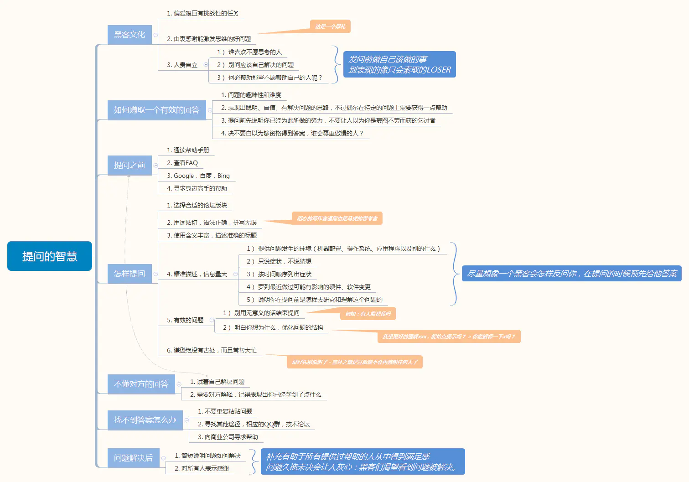

//todo

1. 

X-Y问题

## XY问题是啥

- 1）有人想解决问题X

  2）他觉得Y可能是解决X问题的方法

  3）但是他不知道Y应该怎么做

  4）于是他去问别人Y应该怎么做？

  简而言之，**没有去问怎么解决问题X，而是去问解决方案Y应该怎么去实现和操作**。于是乎：

  1）热心的人们帮助并告诉这个人Y应该怎么搞，但是大家都觉得Y这个方案有点怪异。

  2）在经过大量地讨论和浪费了大量的时间后，热心的人终于明白了原始的问题X是怎么一回事。

  3）于是大家都发现，Y根本就不是用来解决X的合适的方案。

  X-Y Problem最大的严重的问题就是：**在一个根本错误的方向上浪费他人大量的时间和精力**！

  

## 咋解决

- 无论尝试任何解决方案，都要给出初始问题的大背景
- 向别人寻求帮助时，一定给出大背景，尽量给出细节

## 例子

- Q) 我怎么用Shell取得一个字符串的后3位字符？
- A1) 如果这个字符的变量是$foo，你可以这样来 echo ${foo:-3}
- A2) 为什么你要取后3位？你想干什么？
- Q) 其实我就想取文件的扩展名
- A1) 我靠，原来你要干这事，那我的方法不对，文件的扩展名并不保证一定有3位啊。
- A1) 如果你的文件必然有扩展名的话，你可以这来样来：echo ${foo##*.}

## 工作中的启示

- 这是**学会提问**的一个点，就是提问时一定给出最原始的需求；不要把你认为的手段当成目的；
- **接需求**：leader或者产品经理提需求时，往往屏蔽了一些信息。这时候一定多问几个为什么？问问背景，问问真实的用户需求是啥？
- **个人发展**，X可能是提升竞争力的技术，但是因为不会或者不好做，我们去做提升KPI的Y。这个需要避免，一个人的成长是应该放眼于整个行业来评估的，而不是仅仅得到一个好的绩效或者一次好的晋升就是成长。

所以，如果你要提问，你必须要确保你问的是真正问题的解决方案，而不是你以为的问题的解决方案。如果你不知道真正要解决的问题是什么，为了避免出现误解，你需要先把自己的业务场景描述清楚，你期望的结果是什么，实际的结果是什么。然后给出一段脱敏后的，能复现问题的最小代码Demo，这样别人在分析问题的时候，才能帮你找到根本原因，而不是被你自以为是问题的Y牵着鼻子走。

在公众号粉丝群里面，有不少同学提问题不讲科学，毫无逻辑，上来就说：`xxx报错了是什么原因？`。然后就没有然后了。

报错的原因千千万，谁知道你这个报错是什么原因，你至少把具体报错信息截图发一下，再把报错位置的代码发一下啊。

问题都不会提，就不要怪别人不想回答你了。因此，再次建议大家，提问之前做一些准备，避免浪费大家的时间：

1. 这个问题的背景是什么？
2. 你期望的结果是什么？
3. 实际上运行的结果是什么？是报错了还是结果错误？
4. 如果是报错，把报错信息截图发上来
5. 准备一段能够稳定复现你的问题的代码。这一段代码需要满足：
   1. 提前单步调试你的代码，把所有不必要的环节全部省略，能写死的变量全部写死，只保留直接触发问题的关键代码
   2. 不要超过40行
   3. 使用截图发送，而不是直接把文字发送到聊天窗口，带上行号
   4. 给出能够触发问题的输入
6. 如果你做不到第5条，那就不要把一段包含几百行代码的文件发送出来了，没有人想去看这么长的代码，你又没给钱

# 结语

参考资料：

* [原文-How To Ask Questions The Smart Way](http://www.catb.org/~esr/faqs/smart-questions.html)：作者Eric S. Raymond，Rick Moen
* [中文翻译版](https://github.com/ryanhanwu/How-To-Ask-Questions-The-Smart-Way)
* [提问的智慧-精读注解版](https://blog.csdn.net/qq_34804120/article/details/89117072)
* [提问的智慧](https://ld246.com/article/1536377163156)

推荐两位大佬的站点：

* [Eric Raymond的站点](http://www.catb.org/esr/)：一位优秀的黑客和作家
* [Rick Moen的站点](http://linuxmafia.com/)

相关阅读：

* [How To Become A Hacker](http://www.catb.org/~esr/faqs/hacker-howto.html)：如何成为一名黑客
* [How To Learn Hacking](http://catb.org/~esr/faqs/hacking-howto.html)：如何学习黑客
* [A Brief History of Hackerdom](http://www.catb.org/~esr/faqs/hacker-hist.html)：黑客简史
* [Revenge of the Hackers](http://www.catb.org/~esr/writings/cathedral-bazaar/hacker-revenge/)：黑客的复仇
* https://www.ruanyifeng.com/blog/2008/02/notes_on_the_cathedral_and_the_bazaar.html

