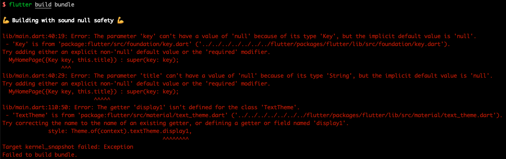
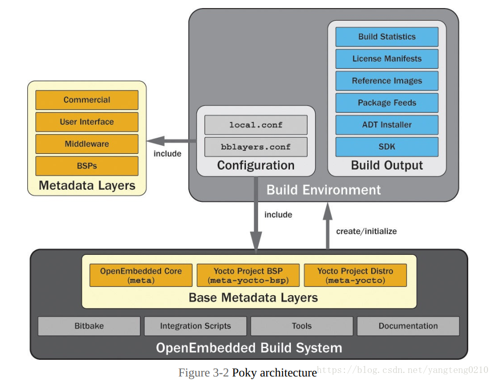

Linux入口main.cc、Android入口FlutterActivity

homescreen main.cc

# Linux

`./tools/gn --linux --linux-cpu arm --runtime-mode release`

```shell
Generating GN files in: out/linux_release_arm
ERROR Unresolved dependencies.
//:default(//build/toolchain/linux:clang_arm)
  needs //build/toolchain/linux:clang_arm()
```

`apt-get install clang cmake ninja-build pkg-config libgtk-3-dev liblzma-dev`

# GLFW Example

Flutter源码中包含一个[GLFW](https://github.com/flutter/engine/tree/master/examples/glfw)的运行案例（`flutter/examples/glfw`），演示了如何定制嵌入层，使用GLFW图形库框架渲染Flutter。

## 嵌入层定制原理

1. `FlutterEmbedderGLFW.cc`引用`shell/platform/embedder/embedder.h`头文件：Flutter提供了一套平台无关的嵌入层ABI（`shell/platform/embedder/`），包括初始化和启动引擎，发送事件，发送PlatformMessage等函数和功能。
2. main函数中初始化并启动Flutter引擎，执行Flutter程序（本例是Kernel文件`myapp/build/flutter_assets/kernel_blob.bin`）
3. 对接不同平台的图形库框架（本例是glfw）：用于创建窗口和OpenGL上下文，接收设备输入事件。
4. 调用embedder中对应的函数，将窗口、事件等发送给引擎层。
4. 引擎通过Skia将画面渲染到窗口。

## Demo运行步骤

以macOS为例：

1. 安装glfw：`brew install glfw`
2. 安装cmake：`brew install cmake`
3. 编译debug版本的引擎：`./flutter/tools/gn --unoptimized`、`ninja -C out/host_debug_unopt`
4. 运行脚本：`./run.sh`，主要做了几件事情
   1. 创建debug文件夹
   2. 执行cmake生成makefile编译配置文件：链接glfw和flutter嵌入层函数库
   3. 执行make将`FlutterEmbedderGLFW.cc`源文件编译为可执行程序`flutter_glfw`
   4. 创建Flutter模版项目，替换`main.dart`：`flutter create myapp`
   5. Flutter应用构建，生成`flutter_assets`，包含Flutter代码的Kernel快照：`flutter build bundle`
   6. 运行Flutter应用程序：`./flutter_glfw ./myapp ../../../../third_party/icu/common/icudtl.dat`

> 高版本源码example中包含`BUILD.gn`文件，ninja编译的时候`out/host_debug_unopt/`下会生成`embedder_example`可执行程序，同make构建的`flutter_glfw`

## 踩坑解决

cmake编译失败：`CMake Error in CMakeList.txt: "GLFW_INCLUDE_PATH-NOTFOUND"`

> 原因：找不到glfw路径。下载的glfw版本是3.3.2的，CMakeList.txt中配置的是3.3的版本`/usr/local/Cellar/glfw/3.3/include/GLFW/`
>
> 解决：改成对应版本即可

cmake编译失败：`CMake Error: The following variables are used in this project, but they are set to NOTFOUND. FLUTTER_LIB`

> 原因：`FLUTTER_LIB`变量找不到`host_debug_unopt`路径，查看CMakeList.txt：`find_library(FLUTTER_LIB flutter_engine PATHS ${CMAKE_SOURCE_DIR}/../../../out/host_debug_unopt)`
>
> 解决：编译一下debug版本的引擎即可
>
> ```shell
> # 生成ninja配置文件
> $ ./flutter/tools/gn --unoptimized
> # ninja编译
> $ ninja -C out/host_debug_unopt
> ```

Flutter项目编译失败，报错如下



> 原因：Flutter SDK和源码的版本问题，替换的`main.dart`没有使用空安全写法。并且该SDK版本找不到`display1`属性
>
> 解决：修改`main.dart`文件如下


# Yocto

Yocto是一个开源项目，用于构建嵌入式Linux系统。类似于BuildRoot（基于Makefile和Kconfig配置）

关键概念：

* Poky：指整个构建系统，包括BitBake工具、编译工具链、BSP，以及诸多程序包和层
* Metadata：元数据集
  * Recipes：`.bb/.bbappend`配方文件，配置源码下载路径、如何编译等
  * Class：`.bbclass`文件，配方文件之间共享的信息
  * Configuration：`.conf`配置文件，构建配置
* Layers：即各种`meta-xxx`目录，包含Metadata的存储库，可以单独发布、下载，便于项目维护，例如`meta-flutter`中包含Flutter的构建配置。[官方支持的层级包和配方文件](https://layers.openembedded.org/layerindex/branch/krogoth/layers/)
* BitBake：任务执行引擎，解析并执行Metadata



在Yocto环境中构建Flutter：依赖[meta-flutter](https://github.com/meta-flutter/meta-flutter)项目，包含devtools工具项目、Flutter引擎项目、Flutter应用案例项目，以及各种定制嵌入层（sony、toyota、树莓派等）项目等，通过BitBake统一构建

对于Yocto，个人理解是类似于AOSP项目：

* Yocto使用Bitbake工具执行构建任务，AOSP使用make或者ninja构建
* Yocto的`.bb/.bbappend`配方文件和`.conf`配置文件，类似于AOSP的`.mk/.bp`配置文件
* Yocto项目只包含构建Metadata，代码从网上下载，AOSP需要下载所有代码进行编译。

Yocto的发行版：zeus（3.0）、dunfell（3.1）、gatesgarth（3.2）、hardknott（3.3）、honister（3.4）

# 结语

查看Flutter嵌入层相关的项目介绍时，出现很多陌生的名词Wayland、X11、DRM等，越搜越懵，涉及到GLX、GLFW、KDE、GNOME等概念。结合多篇文章，反复看，终于简单理解了这些名词之间的关系，在此做个总结：[图形系统概念扫盲](/2022/02/12/tech-2022-02-12-图形系统/)

参考资料：

* [Flutter-Pi](https://github.com/ardera/flutter-pi)：Flutter适配树莓派
* 索尼的[flutter-embedded-linux](https://github.com/sony/flutter-embedded-linux)：Flutter嵌入层适配Linux嵌入式平台，支持x11、Wayland、DRM等
* [Custom Flutter Engine Embedders](https://github.com/flutter/flutter/wiki/Custom-Flutter-Engine-Embedders)
* [Custom Flutter Engine Embedding in AOT Mode](https://github.com/flutter/flutter/wiki/Custom-Flutter-Engine-Embedding-in-AOT-Mode)
* [Embedded support for Flutter](https://flutter.cn/embedded)
* [toyota-homescreen](https://github.com/toyota-connected/ivi-homescreen)
* [meta-flutter](https://github.com/meta-flutter/meta-flutter)
