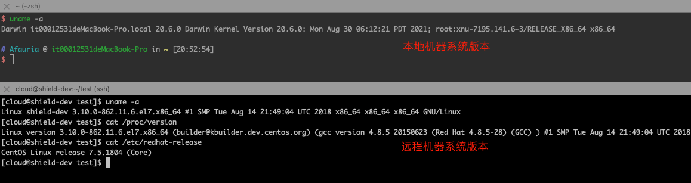
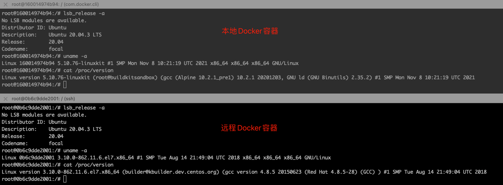
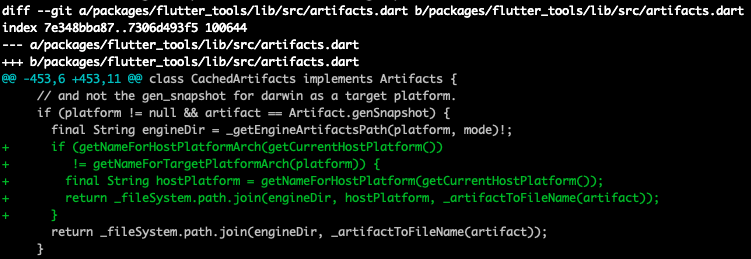
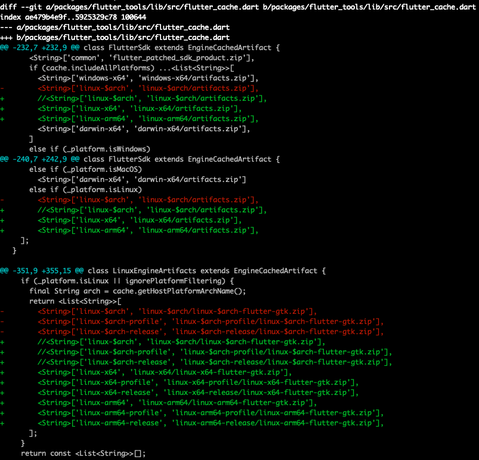
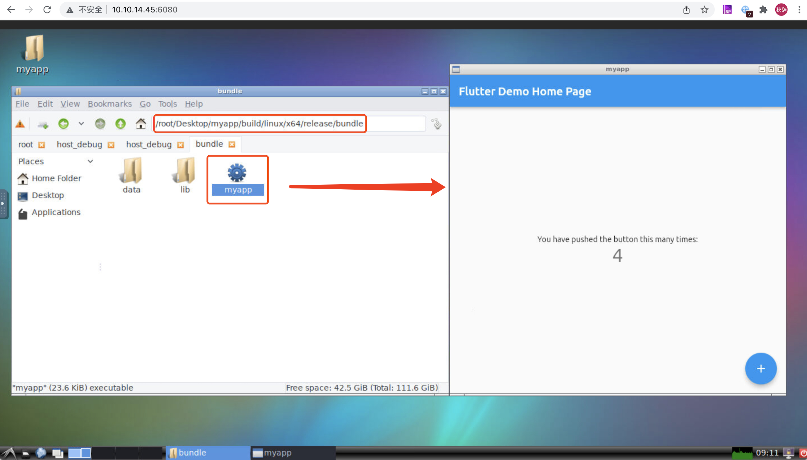

# 探索过程总结

由于环境配置较复杂，遇到的问题、涉及到的技术栈较多，导致文章内容比较零散，因此这里先放总结，记录一下探索的过程和思路。

## 背景和目标

背景：使用Flutter开发Linux TV应用，研究Flutter应用和引擎编译，以及嵌入层定制和适配。

目标：解决Flutter交叉编译Linux应用，并运行到嵌入式设备上。

如果有Linux主机，也可以不用折腾，遇到的问题可能会少一点，只要解决Linux交叉编译ARM应用即可。

## 环境介绍

环境：（下文不再赘述）

* 主机（Host）：
  * 远程服务器：Linux CentOS，没有root权限（无法安装编译环境），但是可以使用Docker（可以root）。
  * 本地机器/主机：MacOS
* 目标平台：Linux嵌入式平台（ARM架构）、Android嵌入式平台（ARM、ARMv8架构）
* 实验镜像：
  * `ubuntu`（x86_64架构）：默认不带图形界面，需要自行安装X11桌面环境，无法运行Flutter GUI界面
  * `ubuntu`（arm和arm64架构）：主要用于生成arm和arm64架构的sysroot平台库
  * `dorowu/ubuntu-desktop-lxde-vnc`：默认带图形界面和VNC，可以运行Flutter GUI界面
* 容器：本地机器和远程服务器都可以运行Docker容器。
  * 本地Docker容器：通过QEMU可以运行ARM Ubuntu镜像和x86_64镜像
  * 远程Docker容器：没有QEMU，只能运行x86_64 Ubuntu镜像

分别对比主机和容器系统版本差异，如下：





**注意这里有个坑，下文会提到**：本地和远程Docker容器使用相同的Ubuntu官方镜像，但是查看版本有一定差异。本地Docker容器应该是QEMU模拟器运行Linux环境。

**不同系统的主机上即使使用相同的镜像，容器环境也存在差异**

## 探索过程

总结一下几个主要的探索过程：

问题1：Flutter桌面应用编译只能在对应的平台上（Linux应用只能在Linux平台上编译），由于没有Linux电脑，无法编译和运行Linux程序（x86、x86_64、arm、arm64）。

> 解决思路：利用Docker Ubuntu容器环境。
>
> 1. 容器内本地编译Flutter Linux桌面应用，并尝试在容器内运行显示界面。[Docker容器本地编译Flutter Linux应用](#Docker容器本地编译Flutter Linux应用)
> 2. 容器内交叉编译arm/arm64平台应用，并安装到嵌入式Linux设备运行。
>
> 使用Docker有几个明显的好处：
>
> * 尝试过程中需要装各种乱七八糟的环境，不知道真正缺少的是哪些环境，使用Docker可以随时删除容器重来。
> * 准备好环境之后可以方便的进行打包和移植

问题2：下载的Ubuntu镜像没有界面，无法运行GUI程序。

> 解决思路：安装图形界面，使用X11服务，将容器内GUI界面输出到Mac显示器上：[Mac上运行Docker Linux GUI程序](#Mac上运行Docker Linux GUI程序)
>
> 普通的`gnome-calculator`、`gnome-help`、`firefox`应用能正常运行。但是桌面应用、Flutter应用无法运行。
>
> 尝试了很多方式无法解决，因此放弃自己安装图形界面，直接用现成的Ubuntu桌面镜像：`dorowu/ubuntu-desktop-lxde-vnc`，利用x11vnc，可以通过vnc访问Linux图形界面。

问题3：使用Flutter官方提供的ARM 64位引擎和编译器后端（gen_snapshot），在Linux x86_64容器交叉编译ARM64应用。

> 同样的gen_snapshot可以在本地Docker容器（x86_64）上执行，但是无法在远程Docker容器（x86_64）上执行。
>
> 目标平台不正确。需要自己在远程Docker容器上**交叉编译**ARM 64位引擎。

问题4：sysroot制作。

> 由于远程Linux主机没有权限使用apt，无法安装QEMU，因此在本地Mac主机上运行ARM64容器，下载平台库制作sysroot，再上传到Linux X86_64的容器中进行编译。
>
> 如果可能的话也可以直接在ARM64容器中直接本地编译ARM64的Flutter应用。

问题4：Flutter Linux嵌入式应用编译和运行（arm）。

## 完整搭建流程

//todo


# 通用问题

关于交叉编译、sysroot等问题参考[交叉编译](/2021/11/07/basic-2021-11-07-交叉编译)

进入容器后首次使用`apt-get`安装软件报错：`"E: Unable to locate package"`

> Linux的发行版维护了一个软件仓库，存储常用的软件，仓库地址存储在`/etc/apt/sources.list`文件中，使用`apt-get`工具会从该文件中读取仓库地址，下载并安装软件。
>
> 解决：执行下`apt update`，更新软件源地址列表
>
> `apt`命令是对`apt-get`、`apt-cache`等命令的封装，提供了统一的入口。

使用apt安装的交叉编译工具链可能有多个版本，可以搜索，例如：`apt-cache search gcc | grep -E "arm|aarch64"`

Docker容器中配置`.bash_profile`环境变量，退出容器再进入失效。

> 可以通过DockerFile配置镜像环境变量，或者执行`docker run`和`docker exec`时使用-e参数。

Git clone仓库提示Permission denied：需要配置Git SSH Key。

查看IP地址：`ifconfig en0 | grep inet | awk '$1=="inet" {print $2}`

查看Docker镜像和容器大小：`docker system df -v`

主机和Docker容器间文件拷贝：`docker cp 主机路径 容器名:容器内路径`

# 编译本地Flutter Linux桌面应用

容器内安装Flutter SDK，参考[官方文档](https://flutter.cn/docs/get-started/install/linux)：

1. 下载Flutter SDK：`git clone https://github.com/flutter/flutter.git`
2. 配置环境变量
3. 安装Linux编译环境：`apt install git curl clang cmake ninja-build pkg-config libgtk-3-dev liblzma-dev`
4. 启用Linux编译：`flutter config --enable-linux-desktop`
5. 检查Flutter编译工具链：`flutter doctor`

注：Flutter SDK中内置了引擎的`artifact`，如果自己编译引擎，需要确保Engine源码和Framework源码版本对应。如下：

```shell
$ flutter --version
Flutter 2.8.1 • channel stable • https://github.com/flutter/flutter.git
Framework • revision 77d935af4d (10 weeks ago) • 2021-12-16 08:37:33 -0800
Engine • revision 890a5fca2e
Tools • Dart 2.15.1
```

编译Flutter应用：生成myapp可执行文件

```shell
# 创建Flutter模版工程
$ flutter create myapp
$ cd myapp
# 编译Flutter Linux桌面应用
$ flutter build linux
```

通过[Mac上运行Docker Linux GUI程序](#Mac上运行Docker Linux GUI程序)，可以成功运行myapp应用。

# 交叉编译Linux嵌入式平台应用

以ARM和ARM64为目标平台。主要流程如下：

1. 获取嵌入式架构的Flutter引擎：包括引擎so库和gen_snapshot编译后端程序
   1. 官方提供：自行从[Google仓库](https://storage.googleapis.com/flutter_infra_release)下载或者通过Flutter SDK下载
      1. ARM64引擎：支持
      2. ARM引擎：不支持，需要自行编译引擎
   2. 自行编译引擎
2. 配置交叉编译工具链和目标平台库（sysroot）
   1. 从包管理器（apt）下载
   2. 从网上下载
   3. 获取编译器源码自行编译
3. 编译
   1. 使用`flutter build`命令编译：需要修改`flutter_tools`源码
   2. 直接调用gen_snapshot进行编译，再手动链接so库，打包可执行程序。

## 使用官方引擎Artifact

Linux x64主机交叉编译Linux arm64目标平台应用：参考[issue](https://github.com/flutter/flutter/issues/74929)和[说明](https://docs.google.com/document/d/19tzWySgtgtTA99XQsjx5Pg0SFJeZKXyUlYavR0EXv8c/edit#)

1. 修改`flutter/packages/flutter_tools/lib/src/commands/build_linux.dart`代码，跳过交叉编译报错，如下

   

2. 修改`flutter/packages/flutter_tools/lib/src/artifacts.dart`代码，如下

   

3. 修改`flutter/packages/flutter_tools/lib/src/flutter_cache.dart`代码，如下（注意代码行数）

   

4. 删除`flutter_tools`重新构建：`rm flutter/bin/cache/flutter_tools*`

5. 执行编译命令：`flutter build linux --target-platform linux-arm64 -v`

> -v查看编译具体信息

这里build失败是正常的，但是已经成功下载了Flutter官方提供的Linux ARM64引擎的构件，放到了SDK对应路径下，例如：`flutter/bin/cache/artifacts/engine/linux-arm64-release/`。

> 也可以自行从[Google仓库](https://storage.googleapis.com/flutter_infra_release)下载

踩坑：使用上面官方的Linux ARM64引擎的构件，同样的ubuntu镜像，本地Docker容器可以执行`gen_snapshot`程序，远程Docker容器无法执行`gen_snapshot`程序，提示`cannot execute binary file: Exec format error`（二进制可执行程序格式不正确），导致编译失败。

> 前面介绍环境的时候提到不同主机上即使使用相同镜像，容器环境也存在差异。
>
> 编译器本身也是一个可执行程序，只能在目标平台运行。

既然官方提供的引擎构件无法使用，那只能自己下载引擎源码编译生成gen_snapshot编译器了。

## 自行编译Flutter引擎

参考[Flutter架构和源码编译](/2022/01/06/flutter-2022-01-06-Flutter架构和源码编译/)

```shell
ERROR Unresolved dependencies.
//:default(//build/toolchain/linux:clang_arm)
  needs //build/toolchain/linux:clang_arm()
```


将生成的关键产物拷贝到Flutter SDK路径下，替代官方Artifact。

```shell
# 拷贝gen_snapshot，目录不存在则创建
$ cp src/out/linux_release_arm64/clang_x64/gen_snapshot {flutter_sdk}/bin/cache/artifacts/engine/linux-arm64-release/linux-x64/gen_snapshot
# 拷贝引擎so
$ cp src/out/linux_release_arm64/libflutter_engine.so {flutter_sdk}/bin/cache/artifacts/engine/linux-arm64-release/libflutter_linux_gtk.so
# 拷贝头文件
$ cp src/flutter/engine/src/flutter/shell/platform/linux/public/flutter_linux {flutter_sdk}/bin/cache/artifacts/engine/linux-arm64-release/flutter_linux
```

## 交叉编译Linux ARM应用

原理和ARM64编译类似，由于Flutter官方还不支持Linux ARM应用的编译，因此需要修改`flutter_tools`源码：

1. 让`flutter build`命令支持`--target-platform=linux-arm`参数
2. 编译时查找对应路径下的引擎产物，例如：`{flutter_sdk}/bin/cache/artifacts/engine/linux-arm-release/`）

可以参考[Flutter应用构建流程分析](/2022/01/12/flutter-2022-01-12-Flutter应用构建流程分析/)，能读懂源码自然就会修改了。

这里演示下直接调用前后端编译

`apt install gcc-arm-linux-gnueabihf g++-arm-linux-gnueabihf libstdc++-8-dev-armhf-cross`

## 配置交叉编译工具链和目标平台库

1. `apt install gcc-aarch64-linux-gnu g++-aarch64-linux-gnu`
2. 制作sysroot：下载目标平台的依赖库
3. build时指定`--target-sysroot=dir`参数

https://commondatastorage.googleapis.com/chrome-linux-sysroot

`apt install gcc-aarch64-linux-gnu g++-aarch64-linux-gnu libstdc++-8-dev-arm64-cross`

### 问题记录

有了引擎之后编译还是会遇到很多问题，根据网上的办法解了一个又出现另一个，没完没了。

走了很多弯路，其实就是缺少交叉编译工具链，**不应该聚焦单个问题**，而是当作整体来看。

这里还是记录下单个问题的解决过程，后面遇到可以用来参考：正确的做法参考上面的步骤

```shell
/usr/bin/ld: unrecognised emulation mode: aarch64linux
```

> 原因：
>
> 解决：`apt install gcc-arm-linux-gnueabi gcc-aarch64-linux-gnu`

```shell
/usr/bin/aarch64-linux-gnu-ld: cannot find -lstdc++
```

apt install libstdc++-9-dev-arm64-cross

```shell
ERROR: qemu-aarch64: Could not open '/lib/ld-linux-aarch64.so.1': No such file or directory
```

cp /usr/aarch64-linux-gnu/lib/ld-linux-aarch64.so.1 /lib/ld-linux-aarch64.so.1

```shell
ERROR: /root/flutter/bin/cache/artifacts/engine/linux-arm64-release/gen_snapshot: error while loading shared libraries: libdl.so.2: cannot open shared object file: No such file or directory
ERROR: Dart snapshot generator failed with exit code 127
```

`export LD_LIBRARY_PATH=/usr/aarch64-linux-gnu/lib`：添加程序加载运行时查找链接库的路径

`LIBRARY_PATH`：添加gcc编译时查找链接库的路径。

```shell
Target unpack_linux failed: FileSystemException: Cannot open file, path = '/root/flutter/bin/cache/artifacts/engine/linux-arm64/icudtl.dat' (OS Error: No such file or directory,
errno = 2)
```

***/linux-arm64-release/linux-arm64-flutter-gtk.zip

***/linux-arm64/artifacts.zip

```shell
//usr/include/limits.h:26:10: fatal error: 'bits/libc-header-start.h' file not found
```

apt install gcc-multilib

```shell
//lib/gcc-cross/aarch64-linux-gnu/9/../../../../include/c++/9/cstdlib:41:10: fatal error: 'bits/c++config.h' file not found
```

apt install g++-multilib

```shell
//lib/gcc-cross/aarch64-linux-gnu/9/../../../../include/c++/9/bits/c++config.h:524:10: fatal error: 'bits/os_defines.h' file not found
```


cp /usr/aarch64-linux-gnu/include/c++/9/aarch64-linux-gnu/bits/ /lib/gcc-cross/aarch64-linux-gnu/9/../../../../include/c++/9/

```shell
[        ] FAILED: intermediates_do_not_run/myapp
[        ] : && /usr/bin/clang++ --target=aarch64-linux-gnu --sysroot=/ubuntu-arm64  -O3 -DNDEBUG   CMakeFiles/myapp.dir/main.cc.o CMakeFiles/myapp.dir/my_application.cc.o
CMakeFiles/myapp.dir/flutter/generated_plugin_registrant.cc.o  -o intermediates_do_not_run/myapp -L/root/Desktop/myapp/linux/flutter/ephemeral
-Wl,-rpath,/root/Desktop/myapp/linux/flutter/ephemeral:/usr/lib/aarch64-linux-gnu:  -lflutter_linux_gtk  -lgtk-3  -lgdk-3  -lpangocairo-1.0  -lpango-1.0  -lharfbuzz  -latk-1.0  -lcairo-gobject
-lcairo  -lgdk_pixbuf-2.0  /ubuntu-arm64/usr/lib/aarch64-linux-gnu/libgio-2.0.so  /ubuntu-arm64/usr/lib/aarch64-linux-gnu/libgobject-2.0.so  /ubuntu-arm64/usr/lib/aarch64-linux-gnu/libglib-2.0.so && :
[        ] /usr/bin/aarch64-linux-gnu-ld: cannot find -lgtk-3
[        ] /usr/bin/aarch64-linux-gnu-ld: cannot find -lgdk-3
[        ] /usr/bin/aarch64-linux-gnu-ld: cannot find -lpangocairo-1.0
[        ] /usr/bin/aarch64-linux-gnu-ld: cannot find -lpango-1.0
[        ] /usr/bin/aarch64-linux-gnu-ld: cannot find -lharfbuzz
[        ] /usr/bin/aarch64-linux-gnu-ld: cannot find -latk-1.0
[   +4 ms] /usr/bin/aarch64-linux-gnu-ld: cannot find -lcairo-gobject
[        ] /usr/bin/aarch64-linux-gnu-ld: cannot find -lcairo
[        ] /usr/bin/aarch64-linux-gnu-ld: cannot find -lgdk_pixbuf-2.0
[        ] clang: error: linker command failed with exit code 1 (use -v to see invocation)
```

```shell
[   +1 ms] /usr/bin/aarch64-linux-gnu-ld: CMakeFiles/myapp.dir/my_application.cc.o: in function `my_application_activate(_GApplication*)':
[        ] my_application.cc:(.text+0x36c): undefined reference to `fl_dart_project_new'
[        ] /usr/bin/aarch64-linux-gnu-ld: my_application.cc:(.text+0x378): undefined reference to `fl_dart_project_set_dart_entrypoint_arguments'
[        ] /usr/bin/aarch64-linux-gnu-ld: my_application.cc:(.text+0x380): undefined reference to `fl_view_new'
[        ] /usr/bin/aarch64-linux-gnu-ld: my_application.cc:(.text+0x3c0): undefined reference to `fl_plugin_registry_get_type'
[        ] clang: error: linker command failed with exit code 1 (use -v to see invocation)
```


# Mac上运行Docker Linux GUI程序

Linux本身不带图形界面，需要安装桌面环境。有两种方式X Window和VNC

* X Window System本身支持网络传输，本地开启X Server服务，远程X Client应用通过ssh连接到本地。
* VNC（Virtual Network Console）用于远程控制桌面，远程开启VNC服务，本地通过VNC Viewer或浏览器连接到远程。类似于Windows下的RDP（Remote Desktop Protocol）。

X Window以X Client应用为单位。VNC以桌面为单位。

> x11vnc：是一个VNC Server，通过X协议要求X Server将画面显示和控制权交给VNC Server，并且将X界面通过VNC共享给远程，默认端口为5900

## 使用X Window

原理：**Mac提供了XQuartz工具，支持在Mac上运行X11**。在主机端启动X Server，容器中启动X Client应用，建立连接，XServer将画面输出到显示器。

步骤：

1. Mac主机安装XQuartz：`brew install XQuartz`

2. 打开XQuartz：在偏好设置-安全性中，勾选"允许从网络客户端连接"，重启XQuartz

3. 运行xhost：`xhost +`

   > * `xhost +`：允许所有客户端连接，不需要认证
   > * `xhost -`：开启访问控制，只有认证的机器能够连接
   > * `xhost + IP地址`：允许某台机器连接

4. 进入Ubuntu容器，并设置DISPLAY环境变量：`docker exec -it -e DISPLAY=主机IP地址:0 ubuntu-env /bin/bash`。（或者进入容器中使用export命令设置）

5. 安装gnome桌面环境：`apt install gnome-core`

6. 打开GUI程序：`gnome-help`、`gnome-calculator`、`firefox`，此时可以显示Linux GUI程序界面

无法运行`mutter`、`gnome-shell`、`gnome-session`、`gnome-control-center`等，报错如下：

```shell
root@88f72f82f080:/# mutter
Window manager warning: Unsupported session type
root@88f72f82f080:/# gnome-shell
Window manager warning: Unsupported session type
root@88f72f82f080:/# gnome-session
libGL error: No matching fbConfigs or visuals found
libGL error: failed to load driver: swrast
libGL error: No matching fbConfigs or visuals found
libGL error: failed to load driver: swrast
gnome-session-binary[3604]: WARNING: software acceleration check failed: Child process exited with code 1
gnome-session-binary[3604]: CRITICAL: We failed, but the fail whale is dead. Sorry....
root@88f72f82f080:/# gnome-control-center
libGL error: No matching fbConfigs or visuals found
libGL error: failed to load driver: swrast

(gnome-control-center:3626): Gdk-ERROR **: 19:25:07.958: The program 'gnome-control-center' received an X Window System error.
This probably reflects a bug in the program.
The error was 'BadValue (integer parameter out of range for operation)'.
  (Details: serial 173 error_code 2 request_code 149 (GLX) minor_code 24)
  (Note to programmers: normally, X errors are reported asynchronously;
   that is, you will receive the error a while after causing it.
   To debug your program, run it with the GDK_SYNCHRONIZE environment
   variable to change this behavior. You can then get a meaningful
   backtrace from your debugger if you break on the gdk_x_error() function.)
Trace/breakpoint trap
```

## 使用VNC

Flutter应用运行同样报错，尝试了很多方法还是无法解决。因此直接使用`dorowu/ubuntu-desktop-lxde-vnc`镜像，不需要自己安装图形界面。

步骤：

1. 下载Ubuntu桌面镜像（大约500M）：`docker pull dorowu/ubuntu-desktop-lxde-vnc`
2. 创建并运行容器：`docker run -d --name ubuntu-desktop-lxde-vnc -p 6080:80 -p 5900:5900 -e VNC_PASSWORD=passwd -v /dev/shm:/dev/shm dorowu/ubuntu-desktop-lxde-vnc`
3. 浏览器访问：`{服务器ip地址}:6080/`
4. 输入密码passwd，成功连接容器桌面。
5. 在VNC桌面上点击图标可以运行Flutter应用（无法用命令直接执行）



# 使用flutter-eLinux

本节介绍索尼公司开发的`flutter-elinux`使用说明（只支持Linux主机）

* [flutter-eLinux](https://github.com/sony/flutter-elinux)：索尼公司开发的扩展Flutter SDK，用于构建和调试嵌入式Linux系统中的Flutter应用。[官方文档](https://github.com/sony/flutter-elinux/wiki)
* [Flutter-Embedded-Linux](https://github.com/sony/flutter-embedded-linux)：索尼公司定制的Flutter嵌入层，支持DRM、Wayland、X11等后端，主要用于Linux嵌入式系统。[官方文档](https://github.com/sony/flutter-embedded-linux/wiki/)

> 默认基于Wayland构建。X11不推荐用于嵌入式系统，只用于在桌面系统上调试

## 环境配置

1. 进入Ubuntu容器

2. 安装环境：`apt install curl unzip git clang cmake pkg-config `

3. 下载eLinux SDK并设置环境变量

   ```shell
   $ git clone https://github.com/sony/flutter-elinux.git
   $ sudo mv flutter-elinux /opt/
   $ export PATH=$PATH:/opt/flutter-elinux/bin
   ```

4. 检查环境：`flutter-elinux doctor`

5. 安装依赖库：

   1. 必须：`apt install libegl1-mesa libgles2-mesa libxkbcommon-dev`
   2. 用于Wayland：`apt install libwayland-dev`
   3. 用于DRM：`apt install libdrm-dev libgbm-dev libinput-dev libudev-dev libsystemd-dev`

6. 创建项目：`flutter-elinux create sample`

## 运行

下面的运行都是基于Linux PC的，由于我们只有Linux的服务器和容器环境，没有显示界面，因此只能通过X协议或者VNC显示在Mac电脑上。只有第一种方式能够成功

使用X11运行：

```shell
# 主机打开XQuartz
$ xhost +
# 容器中设置环境变量
$ export DISPLAY=主机IP地址:0
$ flutter-elinux run -d elinux-x11
```

> 运行有界面，但是不能点击，文字不能显示。
>
> 不知道缺了啥库，不过`apt install xinit`之后可以正常运行。

使用Wayland运行：（失败，容器中无法运行weston）

```shell
# 安装weston
$ apt install weston
# 启动weston服务
$ weston &
$ flutter-elinux run -d elinux-wayland
```

直接运行目标程序：`./build/<target_arch>/<build_mode>/bundle/<your_app_name>`

# 其他Docker操作

本节内容和要实现的目标没有关系，算是走了一些弯路和尝试，不过也是一些比较有用的知识点。

## 使用ssh登录Docker Linux容器环境

目标：使用ssh方式直接登录Docker容器。

* 本地Docker容器：也可以直接`docker exec`进入容器
* 远程Docker容器：也可以先使用ssh连接到服务器，再使用`docker exec`进入容器。

步骤：

1. 下载Docker官方ubuntu镜像：`docker pull ubuntu`，版本如下

   ```shell
   $ docker pull ubuntu
   Using default tag: latest
   latest: Pulling from library/ubuntu
   08c01a0ec47e: Pull complete
   Digest: sha256:669e010b58baf5beb2836b253c1fd5768333f0d1dbcb834f7c07a4dc93f474be
   Status: Downloaded newer image for ubuntu:latest
   docker.io/library/ubuntu:latest
   ```

2. 创建并运行容器，将主机8022端口映射到容器的22端口：`docker run -it --name ubuntu-env -p 8022:22 ubuntu /bin/bash`

3. 此时进入了容器终端。使用`-d`参数可以后台运行，不进入终端。之后可以通过`docker exec -it ubuntu-env /bin/bash`命令进入

4. 容器中安装ssh服务：`apt install openssh-server openssh-client vim`

5. 修改root登录权限：`vim /etc/ssh/sshd_config`，将PermitRootLogin值改为yes，取消注释

6. 修改root密码：`passwd root`

7. 生成ssh密钥，如果已有文件则可跳过

   ```shell
   $ ssh-keygen -t rsa -f /etc/ssh/ssh_host_rsa_key
   $ ssh-keygen -t ecdsa -f /etc/ssh/ssh_host_ecdsa_key
   $ ssh-keygen -t ed25519 -f /etc/ssh/ssh_host_ed25519_key
   ```

8. 启动ssh服务：`service ssh start`

9. 输入exit或者`control+D`退出容器

10. 主机通过ssh登陆容器Linux环境：`ssh -p 8022 root@localhost`（也可以连接远程机器的Docker容器）

如果连不上的话可以重启下容器`docker restart ubuntu-env`再进入容器启动ssh服务

容器创建的时候没有指定端口映射，如何修改？（挂载同理）

> 方法一：制作新镜像，重新创建容器。（推荐）
>
> ```shell
> # 停止容器
> $ docker stop ubuntu-env
> # 将容器制作为镜像
> $ docker commit ubuntu-env ubuntu-env
> # 删除容器
> $ docker rm ubuntu-env
> # 使用新镜像重新创建容器
> $ docker run -it --name ubuntu-env -p 8022:22 ubuntu-env /bin/bashs
> ```
>
> 方法二：修改容器配置，重启Docker服务。（不推荐，会导致其他容器重启）
>
> 方法三：容器运行时修改端口映射：
>
> ```shell
> iptables -t nat -A DOCKER -p tcp --dport 宿主机端口 -j DNAT --to-destination 容器ip:容器端口
> ```

## 打包服务器的Docker镜像到本地机器使用

目标：将远程Linux服务器的Docker容器打包成镜像，拷贝到本地机器（MacOS）加载，避免重新安装一遍环境（gnome、ssh、git、vim等）。

步骤：

1. 将容器制作为镜像：`docker commit [container] [image]`
2. 服务器打包镜像：`docker save -o image.tar ubuntu-env:latest`
3. 本地机器开启远程登录：系统偏好设置-共享-远程登录
4. 拷贝镜像到本地机器：`scp image.tar.tar Afauria@ip地址:/Users/Afauria/Desktop/`
5. 本地机器下载Docker，加载镜像：`docker load < image.tar`
6. 使用`docker image ls`可以看到已经成功加载镜像

# 结语

Docker中运行GUI参考资料：

* [running-gui-apps-with-docker](http://fabiorehm.com/blog/2014/09/11/running-gui-apps-with-docker/)
* [Docker Containers on the Desktop](https://blog.jessfraz.com/post/docker-containers-on-the-desktop/)：Docker中运行GUI程序
* [StackOverflow：Can-you-run-gui-applications-in-a-linux-docker-container](https://stackoverflow.com/questions/16296753/can-you-run-gui-applications-in-a-linux-docker-container/25280523#25280523)：解决方案较全
* [issue：Allow running GNOME desktop/shell within docker](https://gitlab.gnome.org/GNOME/gnome-shell/-/issues/1545)
* [x11docker](https://github.com/mviereck/x11docker)：在Linux容器中运行GUI程序（不支持MacOS）
* [X11vnc (简体中文)](https://wiki.archlinux.org/title/X11vnc_(%E7%AE%80%E4%BD%93%E4%B8%AD%E6%96%87))

交叉编译Linux arm/arm64参考资料：

* [Flutter eLinux：Cross-building from x64 to arm64](https://github.com/sony/flutter-elinux/wiki/Building-flutter-apps#case-1-use-docker--qemu)
* [flutter-engine-for-linux-arm64](https://wiki.loliot.net/docs/lang/flutter/engine/flutter-engine-for-linux-arm64/)
* [Flutter on Raspberry Pi (mostly) from scratch](https://medium.com/flutter/flutter-on-raspberry-pi-mostly-from-scratch-2824c5e7dcb1)