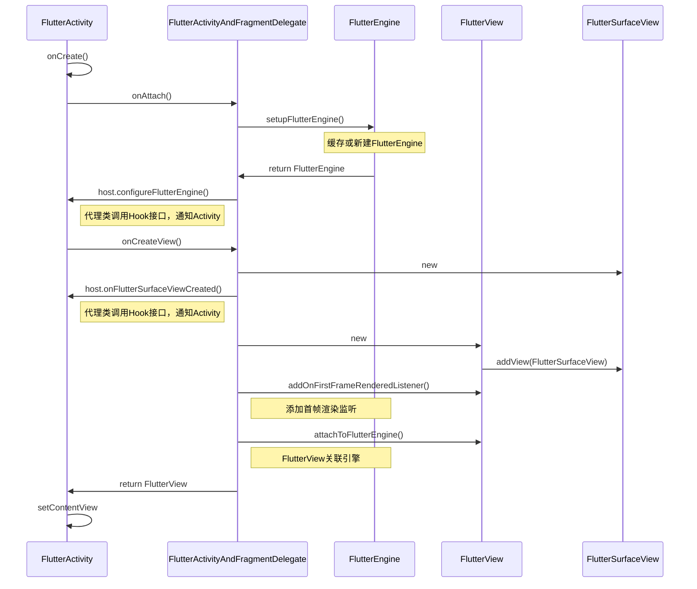
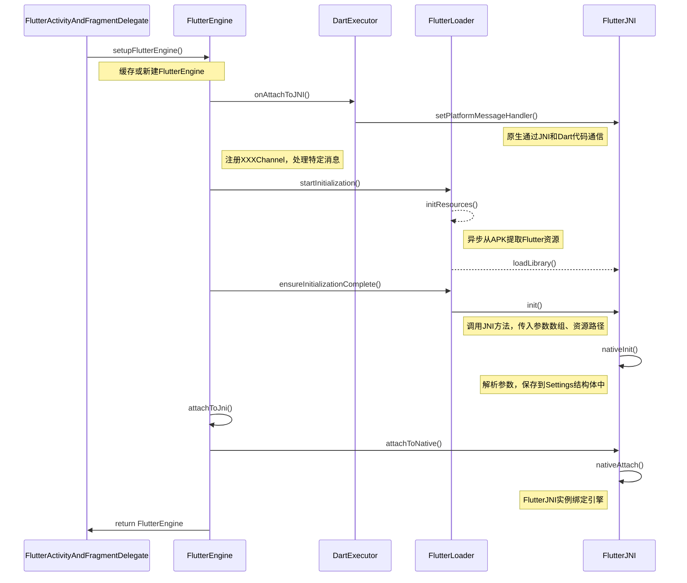
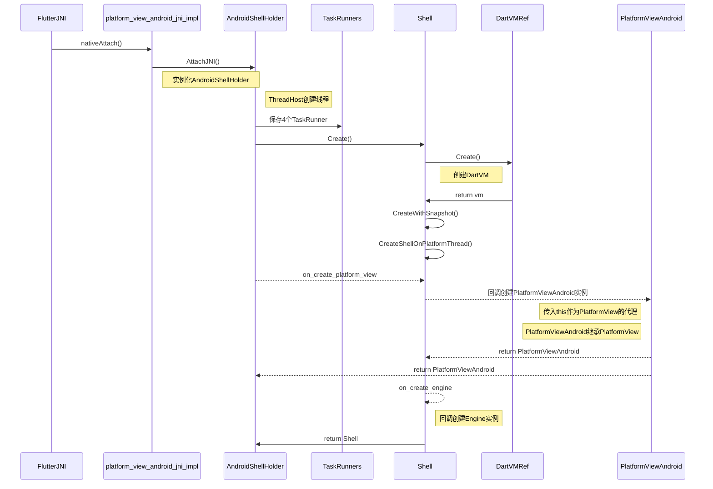
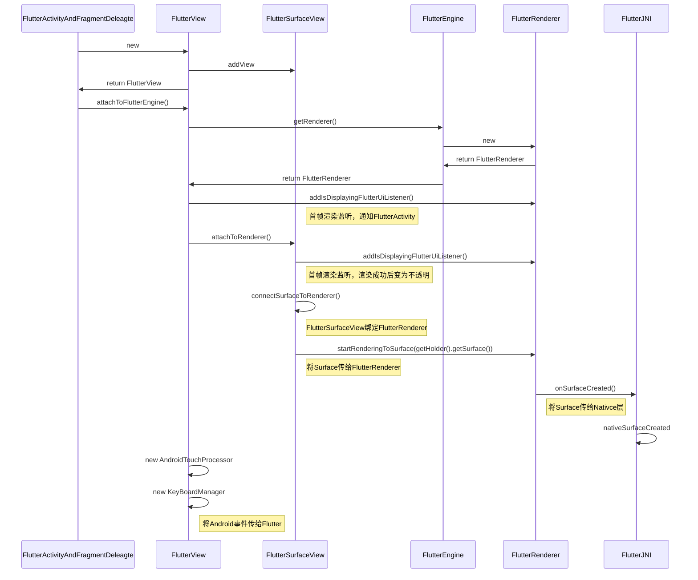
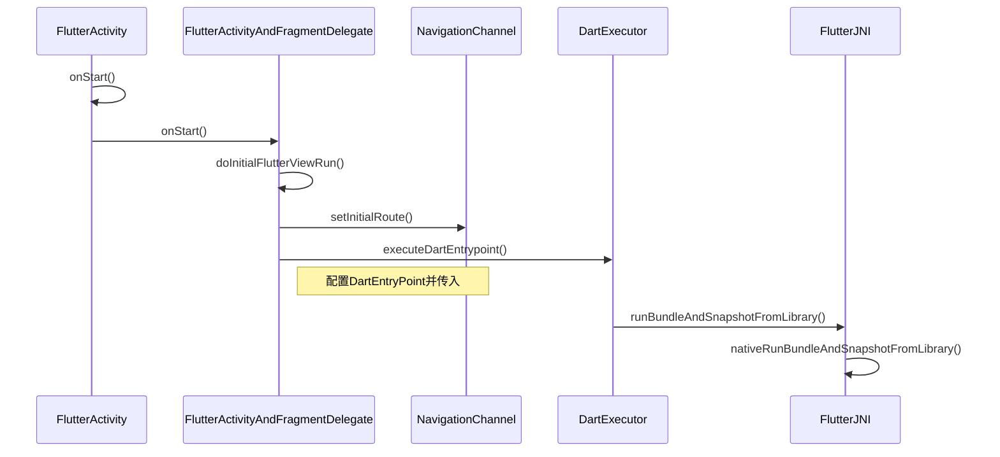
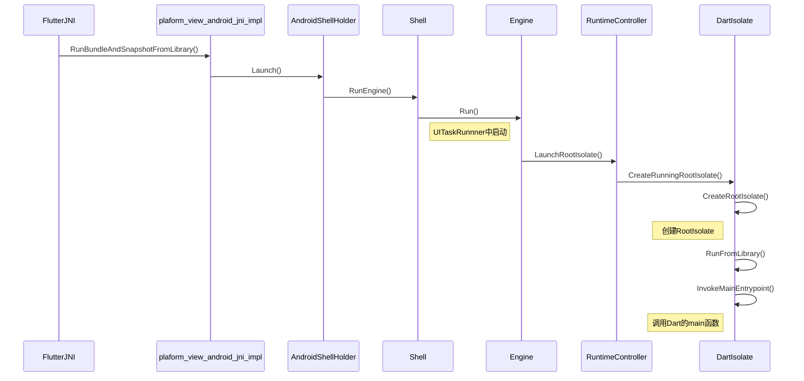

# FlutterActivity加载流程

```mermaid
sequenceDiagram
    FlutterActivity->>FlutterActivity: onCreate()
    FlutterActivity->>FlutterActivityAndFragmentDelegate: onAttach()
    FlutterActivityAndFragmentDelegate->>FlutterEngine: setupFlutterEngine()
    note over FlutterEngine: 缓存或新建FlutterEngine
    
    FlutterEngine->>FlutterActivityAndFragmentDelegate: return FlutterEngine
    FlutterActivityAndFragmentDelegate->>FlutterActivity: host.configureFlutterEngine()
    note right of FlutterActivity: 代理类调用Hook接口，通知Activity
    
    FlutterActivity->>FlutterActivityAndFragmentDelegate: onCreateView()
    participant FlutterView
    FlutterActivityAndFragmentDelegate->>FlutterSurfaceView: new 
    FlutterActivityAndFragmentDelegate->>FlutterActivity: host.onFlutterSurfaceViewCreated()
    note right of FlutterActivity: 代理类调用Hook接口，通知Activity
    FlutterActivityAndFragmentDelegate->>FlutterView: new
    FlutterView->>FlutterSurfaceView: addView(FlutterSurfaceView)
    FlutterActivityAndFragmentDelegate->>FlutterView: addOnFirstFrameRenderedListener()
    note right of FlutterActivityAndFragmentDelegate: 添加首帧渲染监听
    FlutterActivityAndFragmentDelegate->>FlutterView: attachToFlutterEngine()
    note right of FlutterActivityAndFragmentDelegate: FlutterView关联引擎
    FlutterActivityAndFragmentDelegate->>FlutterActivity: return FlutterView
    FlutterActivity->>FlutterActivity: setContentView
```

# Flutter引擎创建

## java层

```mermaid
sequenceDiagram
    FlutterActivityAndFragmentDelegate->>FlutterEngine: setupFlutterEngine()
    note right of FlutterActivityAndFragmentDelegate: 缓存或新建FlutterEngine
    
    FlutterEngine->>DartExecutor: onAttachToJNI()
    participant FlutterLoader
    DartExecutor->>FlutterJNI: setPlatformMessageHandler()
    note left of FlutterJNI: 原生通过JNI和Dart代码通信
    note right of FlutterEngine: 注册XXXChannel，处理特定消息

    FlutterEngine->>FlutterLoader: startInitialization()
    FlutterLoader-->>FlutterLoader: initResources()
    note right of FlutterLoader: 异步从APK提取Flutter资源
    FlutterLoader-->>FlutterJNI: loadLibrary()
    FlutterEngine->>FlutterLoader: ensureInitializationComplete()
    FlutterLoader->>FlutterJNI: init()
    note left of FlutterJNI: 调用JNI方法，传入参数数组、资源路径
    FlutterJNI->>FlutterJNI: nativeInit()
    note left of FlutterJNI: 解析参数，保存到Settings结构体中
    
    FlutterEngine->>FlutterEngine: attachToJni()
    FlutterEngine->>FlutterJNI: attachToNative()
    FlutterJNI->>FlutterJNI: nativeAttach()
    note left of FlutterJNI: FlutterJNI实例绑定引擎
    
    FlutterEngine->>FlutterActivityAndFragmentDelegate: return FlutterEngine
```

## native层

```mermaid
sequenceDiagram
    FlutterJNI->>platform_view_android_jni_impl: nativeAttach()
    platform_view_android_jni_impl->>AndroidShellHolder: AttachJNI()
    note right of platform_view_android_jni_impl: 实例化AndroidShellHolder
    note left of TaskRunners: ThreadHost创建线程
    AndroidShellHolder->>TaskRunners: 保存4个TaskRunner
    AndroidShellHolder->>Shell: Create()
    Shell->>DartVMRef: Create()
    note left of DartVMRef: 创建DartVM
    DartVMRef->>Shell: return vm
    Shell->>Shell: CreateWithSnapshot()

    Shell->>Shell: CreateShellOnPlatformThread()
    AndroidShellHolder-->>Shell: on_create_platform_view
    Shell-->>PlatformViewAndroid: 回调创建PlatformViewAndroid实例
    note left of PlatformViewAndroid: 传入this作为PlatformView的代理
    note left of PlatformViewAndroid: PlatformViewAndroid继承PlatformView
    PlatformViewAndroid-->>Shell: return PlatformViewAndroid
    PlatformViewAndroid-->>AndroidShellHolder: return PlatformViewAndroid
    Shell-->>Shell: on_create_engine
    note right of Shell: 回调创建Engine实例
    Shell->>AndroidShellHolder: return Shell
```

# FlutterView关联引擎

```mermaid
sequenceDiagram
  FlutterActivityAndFragmentDeleagte->>FlutterView: new
  FlutterView->>FlutterSurfaceView: addView
  FlutterView->>FlutterActivityAndFragmentDeleagte: return FlutterView
	FlutterActivityAndFragmentDeleagte->>FlutterView: attachToFlutterEngine()
	FlutterView->>FlutterEngine: getRenderer()
	FlutterEngine->>FlutterRenderer: new
	FlutterRenderer->>FlutterEngine: return FlutterRenderer
	FlutterEngine->>FlutterView: return FlutterRenderer
	
  FlutterView->>FlutterRenderer: addIsDisplayingFlutterUiListener()
	note right of FlutterSurfaceView: 首帧渲染监听，通知FlutterActivity
	FlutterView->>FlutterSurfaceView: attachToRenderer()
	FlutterSurfaceView->>FlutterRenderer: addIsDisplayingFlutterUiListener()
	note right of FlutterSurfaceView: 首帧渲染监听，渲染成功后变为不透明
	
	FlutterSurfaceView->>FlutterSurfaceView: connectSurfaceToRenderer()
	note right of FlutterSurfaceView: FlutterSurfaceView绑定FlutterRenderer
	FlutterSurfaceView->>FlutterRenderer: startRenderingToSurface(getHolder().getSurface())
  note right of FlutterSurfaceView: 将Surface传给FlutterRenderer
  FlutterRenderer->>FlutterJNI: onSurfaceCreated()
  note right of FlutterRenderer: 将Surface传给Nativce层
  FlutterJNI->>FlutterJNI: nativeSurfaceCreated
  
  FlutterView->>FlutterView: new AndroidTouchProcessor
  FlutterView->>FlutterView: new KeyBoardManager
  note right of FlutterView: 将Android事件传给Flutter
```

# Flutter代码执行

## Java层

```mermaid
sequenceDiagram
    FlutterActivity->>FlutterActivity: onStart()
    FlutterActivity->>FlutterActivityAndFragmentDelegate: onStart()
    FlutterActivityAndFragmentDelegate->>FlutterActivityAndFragmentDelegate: doInitialFlutterViewRun()
    FlutterActivityAndFragmentDelegate->>NavigationChannel: setInitialRoute()
    FlutterActivityAndFragmentDelegate->>DartExecutor: executeDartEntrypoint()
    note right of FlutterActivityAndFragmentDelegate: 配置DartEntryPoint并传入
    DartExecutor->>FlutterJNI: runBundleAndSnapshotFromLibrary()
    FlutterJNI->>FlutterJNI: nativeRunBundleAndSnapshotFromLibrary()
```

## Native层

```mermaid
sequenceDiagram
    FlutterJNI->>plaform_view_android_jni_impl: RunBundleAndSnapshotFromLibrary()
    plaform_view_android_jni_impl->>AndroidShellHolder: Launch()
    AndroidShellHolder->>Shell: RunEngine()
    Shell->>Engine: Run()
    note left of Engine: UITaskRunnner中启动
    Engine->>RuntimeController: LaunchRootIsolate()
    RuntimeController->>DartIsolate: CreateRunningRootIsolate()
    DartIsolate->>DartIsolate: CreateRootIsolate()
    note left of DartIsolate: 创建RootIsolate
    DartIsolate->>DartIsolate: RunFromLibrary()
    DartIsolate->>DartIsolate: InvokeMainEntrypoint()
    note left of DartIsolate: 调用Dart的main函数
```

