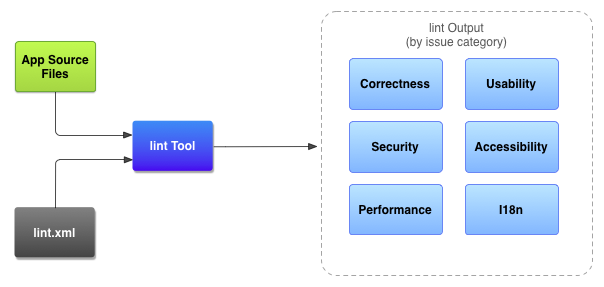
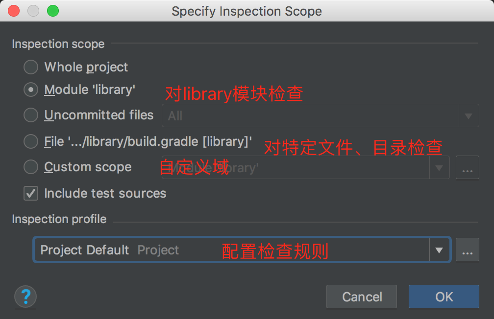
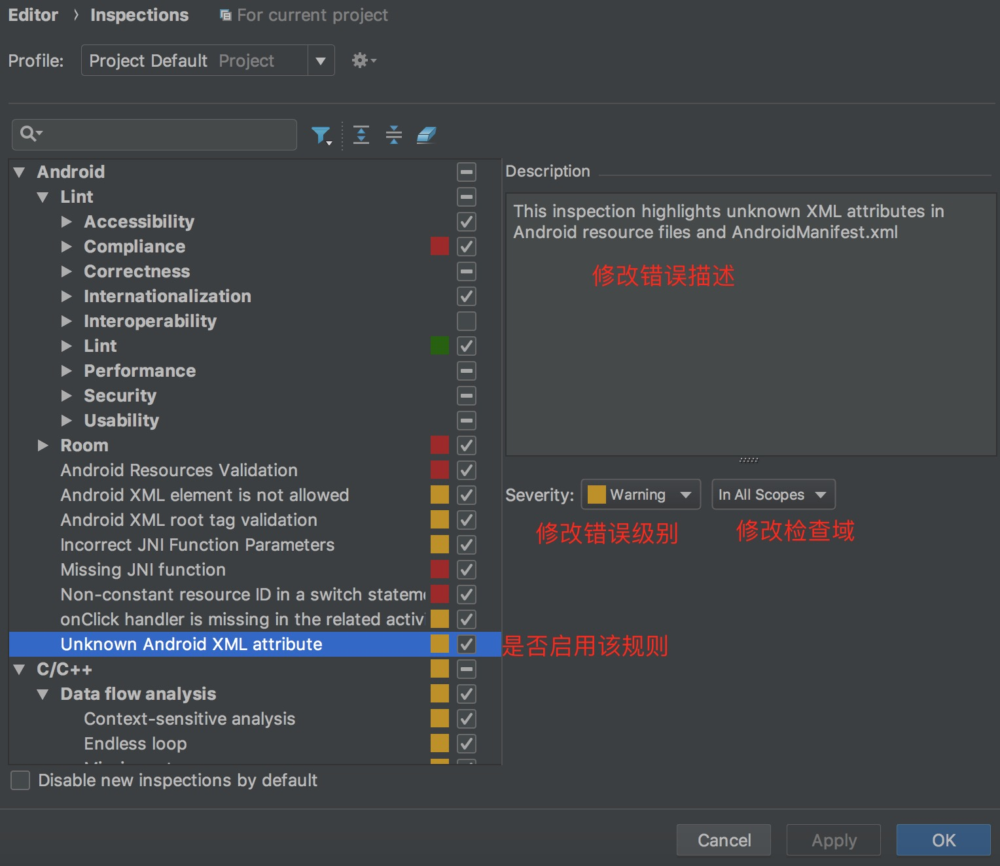
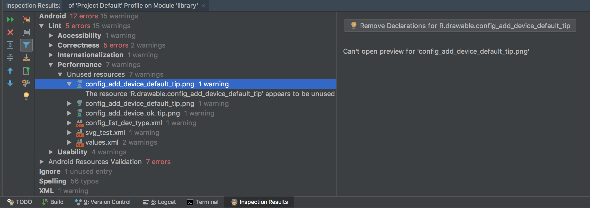
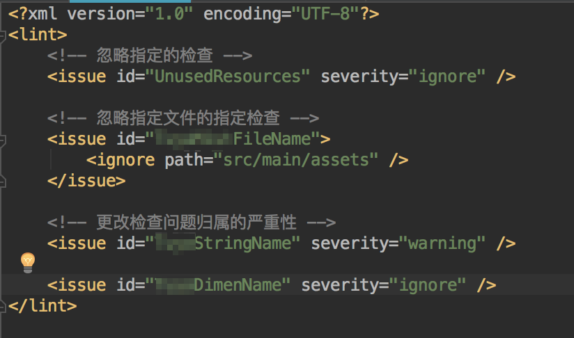
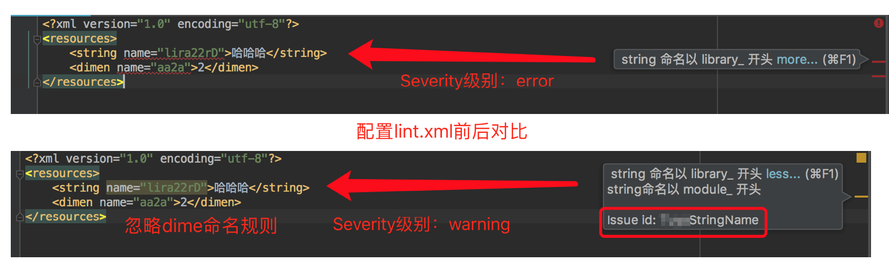
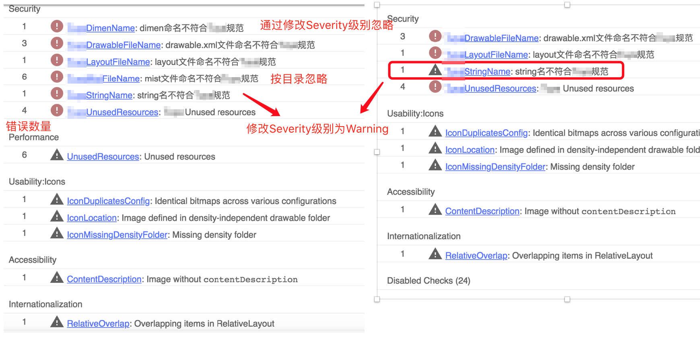
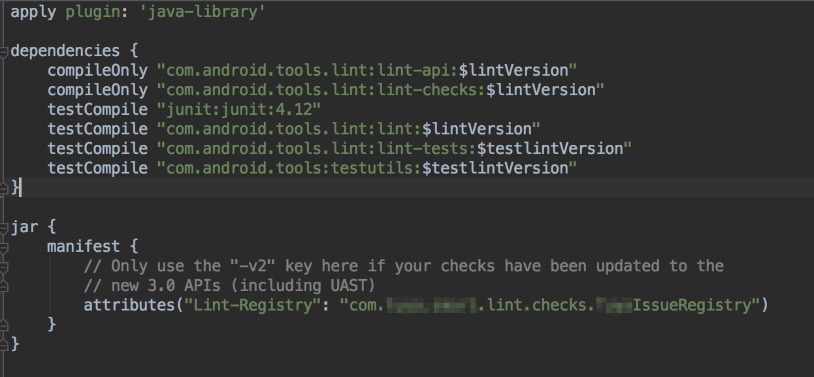
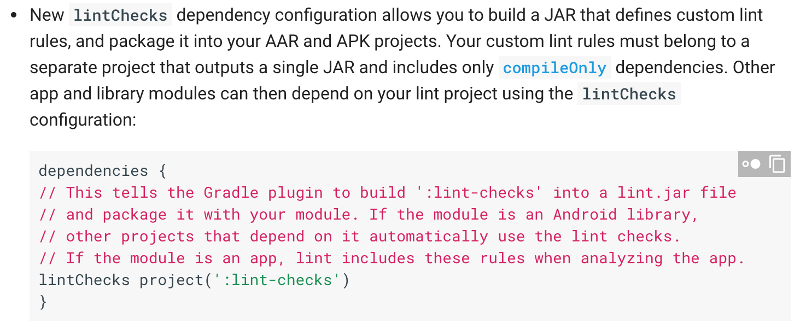

## Lint工具使用和自定义Lint

## Lint介绍

### Lint简介

静态代码质量检查（分析、扫描）工具

Android Lint 是 SDK Tools 16（ADT 16）开始引入的一个代码扫描工具（在sdk目录/tools/bin下可以找到lint工具），通过对代码进行静态分析，可以检查代码规范问题和质量问题，并提出一些改进建议。可以规范团队代码风格，提高代码质量，指导开发者正确使用sdk等。

原生lint规则已经很全面了，不过有时候在团队开发中我们得根据需求定制自己的lint规则

举例：

- 提醒使用自己的log工具，不用原生的log
- 提醒try-catch代码块后记得加finally
- 提醒资源文件，资源id命名规范，加模块名前缀
- ……

### lint原理

lint规则是在AST（抽象语法树，类似dom树）上进行解析。可以将项目里的一切视为对象，如目录、文件，java类、方法，xml元素、属性、值等，针对这些对象进行分析处理，并上报问题。

- 推荐一个Android Studio的插件：PsiViewer，可以查看语法树

### 有几种使用方式

- 使用lint命令行执行
- 使用android studio提供的可视化工具
- 结合gradle命令，如`./gradlew lint` （推荐）

### Lint过程



## Android Lint使用

### 使用Android Studio提供的工具运行lint

- 在Android Studio菜单栏Analyze>Inspect code，选择要扫描的范围（也可以在右键菜单中打开）
  
- 配置检查规则：
  
- 检查结果示例
  

除此之外，还可以通过配置lint.xml文件进行配置，参考[开发者文档](https://developer.android.google.cn/studio/write/lint)

### 推荐使用gradle命令运行lint

- 可以导出html、xml文件到模块下的build/reports目录下，使用浏览器打开，查看lint结果

`./gradlew -p 模块名 lint`或`./gradlew 模块名:lint`

### 配置

#### lint.xml配置

- 官方文档说要放到项目根目录，试了一下不行，需要放到相应的module目录下
- 更新lint.xml配置有时候应用可能不及时，需要sync一下或者重启Android Studio
- 鼠标移到问题代码处，点开more，可以看到issue id

举例

- 配置规则
  
- 前后对比
  - 编辑器里的提示对比
    
  - 导出结果对比
    

#### Java代码配置

添加 `@SuppressLint` 注解，禁止Lint 检查某个 Java 类或方法。
如：`@SuppressLint("all")` ，禁止检查所有lint问题

#### xml文件配置

- 添加命名空间

`xmlns:tools="http://schemas.android.com/tools"`

- 添加属性：配置禁止检查无用资源lint，该属性会继承到子元素

`tools:ignore="UnusedResources"`

#### gradle配置

在构建时执行

```
android { 
 lintOptions {
    // true--关闭lint报告的分析进度
    quiet true
    // true--错误发生后停止gradle构建
    abortOnError false
    // true--只报告error
    ignoreWarnings true
    // true--忽略有错误的文件的全/绝对路径(默认是true)
    absolutePaths true
    // true--检查所有问题点，包含其他默认关闭项
    checkAllWarnings true
    // true--所有warning当做error
    warningsAsErrors true
    // 关闭指定问题检查
    disable 'TypographyFractions', 'TypographyQuotes'
    // 打开指定问题检查
    enable 'RtlHardcoded', 'RtlCompat', 'RtlEnabled'
    // 仅检查指定问题 check 'NewApi', 'InlinedApi'
    // true--error输出文件不包含源码行号
    noLines true
    // true--显示错误的所有发生位置，不截取
    showAll true
    // 回退lint设置(默认规则)
    lintConfig file("default-lint.xml")
    // true--生成txt格式报告(默认false)
    textReport true
    // 重定向输出；可以是文件或'stdout'
    textOutput 'stdout'
    // true--生成XML格式报告
    xmlReport false
    // 指定xml报告文档(默认lint-results.xml)
    xmlOutput file("lint-report.xml")
    // true--生成HTML报告(带问题解释，源码位置，等)
    htmlReport true
    // html报告可选路径(构建器默认是lint-results.html )
    htmlOutput file("lint-report.html")
    // true--所有正式版构建执行规则生成崩溃的lint检查，如果有崩溃问题将停止构建
    checkReleaseBuilds true
    // 在发布版本编译时检查(即使不包含lint目标)，指定问题的规则生成崩溃
    fatal 'NewApi', 'InlineApi'
    // 指定问题的规则生成错误
    error 'Wakelock', 'TextViewEdits'
    // 指定问题的规则生成警告
    warning 'ResourceAsColor'
    // 忽略指定问题的规则(同关闭检查)
    ignore 'TypographyQuotes'
}}
```

## 自定义Lint流程

#### 自定义lint规则

- 根目录`build.gradle`中添加gradle插件

  ```
  classpath "com.android.tools.build:gradle:$gradlePluginVersion"
  ```

- 新建一个模块，如checks，用于编写自定义lint规则

- 修改build.gradle如下
  

  -- 添加java plugin

  ```
  apply plugin: 'java-library'
  ```

  -- 添加依赖，版本号根据需要填

  ```
  compile "com.android.tools.lint:lint-api:$lintVersion" //Lint Api
  compile "com.android.tools.lint:lint-checks:$lintVersion" //android lint原生规则
  testCompile "com.android.tools.lint:lint:$lintVersion" //用于运行Lint检查
  ```

  -- 配置jar打包，Lint-Registry是透露给lint工具的注册类的方法，

  ```
  jar {
      manifest {
          attributes("Lint-Registry": "com.my.smart.lint.checks.MyIssueRegistry")
      }
  }
  ```

- 编写自定义Lint规则，下面介绍

- 编译生成jar，路径为`/checks/build/libs/checks.jar`

### 应用lint规则

有以下几种方式

1. 将jar放到~/.android/lint/下，对所有本地项目生效。  
2. 将jar放到模块libs目录，使用lintChecks方式引入
   
3. 将jar打包成aar，使用implementation引入（推荐）

使用第三种方式引入

- 新建一个library模块，用于打包aar 

- 在library的dependencies中添加

  ```
  lintChecks project(':checks')
  ```

- 打包上传到maven

## 编写lint规则

可以通过看[已有的Lint规则源码](https://android.googlesource.com/platform/tools/base/+/master/lint/libs/lint-checks/src/main/java/com/android/tools/lint/checks)，[LintApi文档](https://www.javadoc.io/doc/com.android.tools.lint/lint-api/25.3.0)来学习

主要使用`lint-api`提供的接口进行开发

### 常用api如下

- Issue：表示一个Lint规则。例如调用 Toast.makeText() 方法后，没有调用 Toast.show() 方法将其显示。
- IssueRegistry：用于注册要检查的Issue列表。自定义Lint需要生成一个jar文件，其Manifest指向IssueRegistry类。
- Detector：用于检测并报告代码中的Issue。每个Issue包含一个Detector。
- Scope：声明Detector要扫描的代码范围，例如Java源文件、XML资源文件、Gradle文件等。每个Issue可包含多个Scope。
- Scanner：用于扫描并发现代码中的Issue。每个Detector可以实现一到多个Scanner。
  - JavaScanner（最早） / JavaPsiScanner / UastScanner（最新、推荐）：扫描Java源文件
  - XmlScanner：扫描XML文件
  - ClassScanner：扫描class文件
  - BinaryResourceScanner：扫描二进制资源文件
  - ResourceFolderScanner：扫描资源文件夹
  - GradleScanner：扫描Gradle脚本
  - OtherFileScanner：扫描其他类型文件
  - ……


#### 例:检查控件id命名前缀，如ImageView以iv_开头，Button以btn开头

- 实现Detector

```java
//1. 继承ResourceXmlDetector，该类实现了XmlScanner，表示检查xml文件
public class TuyaResIdDetector extends ResourceXmlDetector {

    private static final Implementation IMPLEMENTATION_RES_ONLY = new Implementation(
            TuyaResIdDetector.class,
            Scope.RESOURCE_FILE_SCOPE);

    //2. 定义Issue，包括id，描述，解释，分类，优先级，严重级别，作用域
    public static final Issue RES_ID_ISSUE = Issue.create(
            "TuyaResId",
            "Id命名不规范",
            "Id 命名以控件缩写为前缀",
            Category.SECURITY,
            5,
            Severity.ERROR,
            IMPLEMENTATION_RES_ONLY);

    //3. 过滤文件夹
    @Override
    public boolean appliesTo(ResourceFolderType folderType) {
        return ResourceFolderType.LAYOUT == folderType;
    }

    //4. 过滤tag
    @Override
    public Collection<String> getApplicableElements() {
        Collection<String> elements = new ArrayList<>();
        elements.add(LINEAR_LAYOUT);
        elements.add(RELATIVE_LAYOUT);
        elements.add(FRAME_LAYOUT);
        elements.add(CONSTRAINT_LAYOUT);
        elements.add(LIST_VIEW);
        elements.add(SCROLL_VIEW);
        elements.add(TEXT_VIEW);
        elements.add(IMAGE_VIEW);
        elements.add(CHECK_BOX);
        elements.add(RADIO_BUTTON);
        elements.add(EDIT_TEXT);
        elements.add(RECYCLER_VIEW);
        elements.add(BUTTON);

//        elements.add(PROGRESS_BAR);
//        elements.add(FQCN_DATE_PICKER);
//        elements.add(FQCN_TIME_PICKER);
//        elements.add(RADIO_GROUP);

        return elements;
    }

    //5. 过滤属性，这里有坑，下面解释
//    @Override
//    public Collection<String> getApplicableAttributes() {
//        return Collections.singletonList("id");
//    }

    //6. 已经定位到对象，对其进行解析，若不符合规则，则报错
    @Override
    public void visitElement(XmlContext context, Element element) {
        checkIdAttr(context,element);
    }

    private void checkIdAttr(XmlContext context, Element element){
    //7. 对象解析
        Attr attributeNode = element.getAttributeNode("android:id");
        String tag = element.getTagName();
        System.out.println("ResId Tag Name：" + tag);
        if (tag.equals(BUTTON)) {
            tag = "btn";
        } else {
            tag = tag.replaceAll("[a-z\\d.]", "");
            tag = tag.toLowerCase();
        }
        System.out.println("ResId Tag Prefix：" + tag);
        if (attributeNode != null) {
            String value = attributeNode.getValue();
            if (!value.startsWith(ANDROID_ID_PREFIX)
                    && !value.startsWith(ANDROID_NEW_ID_PREFIX)
                    && !value.startsWith(NEW_ID_PREFIX + tag)) {
                //8. 报告错误，参数：Issue，Node（对象节点），Location（报错位置），Message（提示信息），LintFix（解决方案）
                context.report(RES_ID_ISSUE,
                        attributeNode,
                        context.getLocation(attributeNode),
                        String.format(" id 命名以 %s_ 开头", tag));
            }
        }
    }
}

```

注：

`getApplicableElements`和`visitElement`，`getApplicableAttributes `和`visitAttribute`是成对使用的，一开始以为是链式的，先过滤元素，再过滤元素属性，最后只要实现visitAttribute。结果发现visitElement也会被调用。实现了返回反而会多执行visit方法。

- 注册规则

```
public class TuyaIssueRegistry extends IssueRegistry {
    @Override
    public List<Issue> getIssues() {
        return Arrays.asList(
                TuyaResIdDetector.RES_ID_ISSUE
        );
    }

}
```

### 名词解释

- `Issue`:Lint规则
  - `Id`: 规则标识，唯一
  - `Description`: 规则描述
  - `Explanation`: 规则说明，解决方案
  - `Severity`: 规则严重程度，由高到低
    - FATAL
    - ERROR
    - WARNING
    - INFORMATIONAL
    - IGNORE
  - `Priority`: 规则优先级，1-10，10最高
  - `Category`: 规则分类（部分），可自定义
    - Lint
    - Correctness (子分类 Messages):正确性
    - Security：安全性
    - Performance:性能
    - Usability (子分类 Typography, Icons):易用性
    - A11Y (Accessibility):无障碍
    - I18N (Internationalization，子分类 Rtl)：国际化

## 补充

- 由于缓存或者其他原因，有时候需要重启Android Studio才能应用自定义lint规则
- 推荐使用gradle命令执行lint
- 除了手动运行Lint外，大部分问题在编写代码时Android Studio就会给出提醒
- 自定义的规则使用Android Studio的Inspect检查不出来，不过在代码编写的时候会有提示，需要将规则放到`~/.android/lint/`目录下才会生效，建议用gradle命令运行导出Issue

## 参考文章

- [android lint check的学习和自定义以及lint语法](https://blog.csdn.net/u010360371/article/details/50189171)
- [使用Lint](https://www.jianshu.com/p/cbd9a643a6b7)
- [Android Studio 工具：Lint 代码扫描工具（含自定义lint）](https://www.jianshu.com/p/a0f28fbef73f)
- [【我的Android进阶之旅】Android自定义Lint实践](https://blog.csdn.net/ouyang_peng/article/details/80374867)
- [自定义 Lint 规则简介](http://www.cnblogs.com/oneapm/p/5221072.html)
- [Android Lint：自定义Lint调试与开发](https://www.colabug.com/2109876.html)

