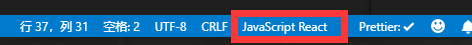

# RN介绍

Learn once, Write anywhere.z

1. 前端技术栈
2. 支持动态化
3. 支持热重载
4. 需要开发Native组件
5. 通过JavaScript Core映射成原生控件渲染

## 和传统前端的区别

|          | 传统前端                            | RN                                        |
| -------- | ----------------------------------- | ----------------------------------------- |
| 标签     | 小写（div、img）                    | 首字母大写（View、Image）                 |
| 文字     | 所有双标签都可以包裹文字            | 需要使用`<Text></Text>`包裹               |
| 背景     | style支持background                 | 需要使用`<ImageBackground>`               |
| 结构     | 支持CSS样式                         | 一切皆JS                                  |
| 加载     | 根据代码顺序自上而下加载            | 根据生命周期加载                          |
| 页面跳转 | `<a>`标签或者`window.location.href` | 路由框架`react-navigation`、`navigator`等 |
| 全局变量 | 浏览器Window对象                    | global对象                                |

## RN生命周期

* `constructor`：组件被创建之前初始化数据
* `componentWillMount`：组件已创建但是未被渲染，可以在这里面请求数据
* `render`：组件渲染，组件结构都写在这里
* `componentDidMount`：组件已渲染完,可以在这里请求数据并使用setState改变数据来触发视图自动更新
* `componentWillReceiveProps`：如果组件收到新的属性（props），就会调用此函数,并使用setState改变数据来触发视图自动更新
* `shouldComponentUpdate`：当组件接收到新的属性和状态改变的话，都会触发调用 shouldComponentUpdate来判断组件是否应该更新
* `componentWillUpdate`：如果组件状态或者属性改变，并且 `shouldComponentUpdate(...)` 返回为 true，就会开始准更新组件，并调用`componentWillUpdate()`
* `componentDidUpdate`：调用了`render()`更新完成界面之后，会调用`componentDidUpdate()`来得到通知
* `componentWillUnmount`：当组件要被从界面上移除的时候，就会调用此函数，一般在这里取消定时器，remove监听事件

# 常见问题

## React Native:Error: Cannot find module 'asap/raw'

安装`react-native-navigation`后出错

解决办法：重新安装依赖，执行`npm install`

## setting.gradle路径问题

使用react-navigation：

* `yarn add react-navigation`
* `yarn add react-native-gesture-handler`
* `react-native link react-native-gesture-handler`（会修改setting.gradle，引入`react-native-gesture-handler`作为project module）

问题：路径使用`\`分割，不正确，应该修改为`/`

```shell
Settings file 'E:\AndroidStudioProjects\Demo\android\settings.gradle' line: 3

* What went wrong:
Could not compile settings file 'E:\AndroidStudioProjects\Demo\android\settings.gradle'.
> startup failed:
  settings file 'E:\AndroidStudioProjects\Demo\android\settings.gradle': 3: unexpected char: '\' @ line 3, column 133.
     s\react-native-gesture-handler\android')
```

## VsCode格式化代码

VsCode格式化ReactNative代码的时候，标签尖括号会换行

解决办法：如果是js文件，下面不要选择JavaScript，而是JavaScript React，如图

