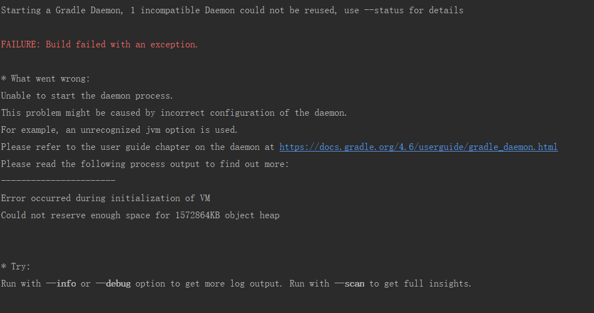
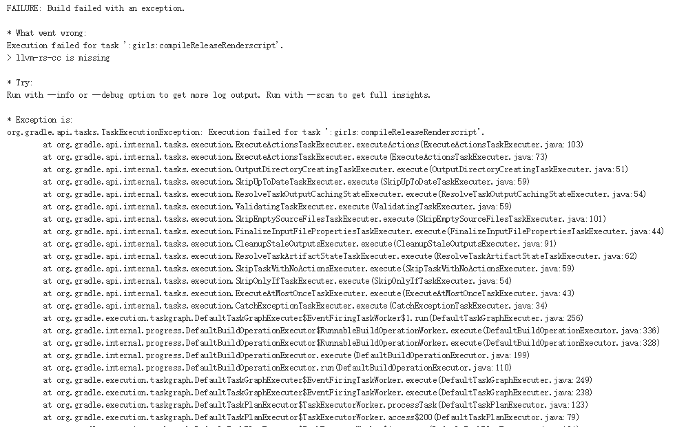

关于Java异常，可以参考[知识体系](/KnowledgeTree/)

# 常见编译错误

## 内存不足，无法启动虚拟机

```bash
Error occurred during initialization of VM
Could not reserve enough space for 1572864KB object heap
```



解决方案：

> 1. 修改`gradle.properties`文件，将虚拟机内存改小
> 2. 关掉部分无用的进程，腾出空间

附上查看系统内存方法：

> 1. 打开任务管理器->性能->内存。或者任务管理器->性能->资源监视器->内存
> 2. 使用命令行

补充：Java工程可能也会遇到类似的错误，也可以通过设置虚拟机参数解决

Java虚拟机监控命令/工具：

* [Java虚拟机--常用Java命令(一)](https://www.cnblogs.com/lemon-pomelo/p/9285840.html)
* [Java虚拟机监控命令](https://www.cnblogs.com/xmzJava/p/8524949.html)

Android查看内存、CPU、电量等信息：

* [Android 通过adb shell命令查看内存，CPU，启动时间，电量等信息](https://www.cnblogs.com/flyingcode/p/6113368.html)

## 内存溢出

`java.lang.OutOfMemoryError: Metaspace`

> 有可能是电脑内存不足，
>
> 1. 重启Android Studio
> 2. 查看内存，杀进程（活动监视器，或者命令行）
> 3. 重新开机

## sdk版本不正确



```shell
* What went wrong:
Execution failed for task ':girls:compileReleaseRenderscript'.
> llvm-rs-cc is missing
```

解决方案：修改`build.gradle`中的版本号为下载过的sdk版本

# 常见运行异常

## Dialog&AlertDialog，WindowManager不能正确使用

```shell
#20715 android.view.WindowManager$BadTokenException
Unable to add window -- token android.os.BinderProxy@caaa709 is not valid; is your activity running?
```

分析：该异常表示不能添加窗口，通常是所要依附的view已经不存在导致的。

常见场景：

> 1. 上一个页面没有destroy的时候，之前的Activity已经接收到了广播。如果此时之前的Activity进行UI层面的操作处理，就会造成crash。UI层面的刷新，一定要注意时机，建议使用set_result来代替广播的形式进行刷新操作，避免使用广播的方式，代码不直观且容易出错。
> 2. Dialog在Actitivty退出后弹出。在Dialog调用show方法进行显示时，必须要有一个Activity作为窗口的载体，如果Activity被销毁，那么导致Dialog的窗口载体找不到。建议在Dialog调用show方法之前先判断Activity是否已经被销毁。
> 3. Service&Application弹出对话框或WindowManager添加view时，没有设置window type为TYPE_SYSTEM_ALERT。需要在调用dialog.show()方法前添加dialog.getWindow().SetType(WindowManager.LayoutParams.TYPE_SYSTEM_ALERT)。
> 4. 6.0的系统上, (非定制 rom 行为)若没有给予悬浮窗权限, 会弹出该问题, 可以通过Settings.canDrawOverlays来判断是否有该权限.
> 5. 某些不稳定的MIUI系统bug引起的权限问题，系统把Toast也当成了系统级弹窗，android6.0的系统Dialog弹窗需要用户手动授权，若果app没有加入SYSTEM_ALERT_WINDOW权限就会报这个错。需要加入给app加系统Dialog弹窗权限，并动态申请权限，不满足第一条会出现没权限闪退，不满足第二条会出现没有Toast的情况。

## Context启动Activity

在 Android P 中，无法通过非 Activity 的 Context（如 Service）启动 Activity，除非在 Intent 中添加 FLAG_ACTIVITY_NEW_TASK，否则该 Activity 不会启动，并抛异常。

解决方案：启动 Activity 的地方判断Context是否`instanceof Activity`

## 参数不匹配

```shell
#50220 java.lang.IllegalArgumentException
Unknown color
```

传入了不正确的参数导致。

常见场景：

> 1. Activity、Service状态异常；
> 2. 非法URL；
> 3. UI线程操作。
> 4. Fragment中嵌套了子Fragment，Fragment被销毁，而内部Fragment未被销毁，所以导致再次加载时重复，在onDestroyView() 中将内部Fragment销毁即可
> 5. 在请求网络的回调中使用了Glide.into(view),view已经被销毁会导致该错误

## 空指针异常（NPE）

```shell
#2002 java.lang.NullPointerException
SimpleDraweeView was not initialized!
```

空指针最为常见，也最容易规避，使用的时候一定要进行`null check`或者`try-catch`，采取不信任原则。

解决方案：

> 1. 方法形参要判空后才使用；
> 2. 全局变量容易被系统回收或者更改，使用全局变量前建议判空；
> 3. 第三方接口的调用，对返回值进行判空。
> 4. 请注意线程安全

## 数组存储异常

```shell
#28916 java.lang.ArrayStoreException
source[0] of type com.google.android.gms.internal.zzcek cannot be stored in destination array of type com.google.android.gms.common.api.internal.BasePendingResult[]
```

当向数组中存放非数组声明类型对象时抛出

解决方案：

> 1. 进行类型判断
> 2. 重新声明数组类型

## Bitmap异常

```shell
#4230 java.lang.RuntimeException
Canvas: trying to use a recycled bitmap android.graphics.Bitmap@1d515bf2

android.graphics.Canvas.throwIfCannotDraw(Canvas.java:1282)
```

画布尝试去使用一个已回收的位图对象，建议解除一切与Bitmap的绑定。通常由于bitmap比较占用内存，为避免oom习惯使用bitmap.recycle()来回收，当再次使用这个被回收的bitmap时就会产生发生异常。

解决方案：

> 1. 在使用前先判断bitmap是否被回收；
> 2. 在不确定图片是否还有其他引用时，不要调用recycle()。

RuntimeException（运行时异常），是所有Java虚拟机正常操作期间可以被抛出的异常的父类。通常需要关注cause by以下部分的堆栈。

## 找不到指定方法

```shell
#13623 java.lang.NoSuchMethodError
no non-static method "Lcom/**/**/**;.<init>(Ljava/lang/String;Ljava/l
```

该异常表示找不到指定方法。主要是由于Android系统和Rom厂商定制化导致的碎片化问题，很难根治，建议做好机型适配，解决top机型问题：

> 1. 如果是机型相关问题，则看下是否添加了该崩溃机型cpu架构的so库；
> 2. 如果是系统API方法，使用时要注意API Level，如果设置的target version过高，调用低于设置版本的API方法将会报错。
> 3. setBackground方法在API >= 16才生效

## 安全异常、权限异常

```shell
#4523 java.lang.SecurityException
Client must have ACCESS_FINE_LOCATION permission to request PRIORITY_HIGH_ACCURACY locations.

com.google.android.gms.internal.zzeu.zzb(Unknown Source:10)
```

权限异常或者称为安全异常，由安全管理器抛出，用于指示违反安全情况的异常，通常由于没有获取对应的权限。

解决方案：

> 1. android6.0以下需要在manifest中声明相应的权限；
> 2. android6.0及以上，在使用时需要动态申请权限。

## 不支持的操作

```shell
#11210 java.lang.UnsupportedOperationException
Failed to resolve attribute at index 13: TypedValue{t=0x2/d=0x7f040210 a=3}
```

常见场景：xml中

> 1. Android 4.x及以下的设备使用Android 5.0 以后MaterialDesign设计引入的colorPrimary等属性造成的异常；
> 2. 有些基于Android原生系统再次开发的系统、Rom不支持Start、End，简易更改为Left、Right（例如，layout_alignParentStart和layout_alignParentEnd属性）；
>    总体来说就是，该属性在某些奇葩设备下不兼容，尽量使用兼容的属性。
> 3. 还有一种情况是build目录下的文件没有清除干净，导致失败的。

## 内存溢出

```java
#17553 java.lang.OutOfMemoryError
pthread_create (1040KB stack) failed: Out of memory
com.facebook.imagepipeline.core.PriorityThreadFactory1.run(PriorityThreadFactory.java:43)
```

该异常表示内存不足导致线程创建失败。pthread_create默认创建的线程是非detached的。如果使用不当，确实会造成内存泄漏。

预防方案：

> 1. 创建detached的线程；
> 2. 线程的start_routine结束之前detached；
> 3. 主线程中使用pthread_join。

## 迭代器异常

```shell
#7707 java.util.ConcurrentModificationException
```

该异常表示迭代器迭代过程中，迭代的对象发生了改变，如数据项增加或删除。由于迭代对象不是线程安全，在迭代的过程中，会检查modCount是否和初始modCount即expectedModCount一致，如果不一致，则认为数据有变化，迭代终止并抛出异常。

常见场景：两个线程同时对集合进行操作，线程1对集合进行遍历，而线程2对集合进行增加、删除操作。

解决方案：多线程访问时要增加同步锁，或者建议使用线程安全的集合：

> 1. 使用ConcurrentHashMap替换HashMap，CopyOnWriteArrayList替换ArrayList；
> 2. 或者使用使用Vector替换ArrayList，Vector是线程安全的。Vector的缺点：大量数据操作时，由于线程安全，性能比ArrayList低.

## 通知异常

```shell
android.app.RemoteServiceException
Context.startForegroundService() did not then call Service.startForeground()

android.app.ActivityThreadH.handleMessage(ActivityThread.java:1768)
```

该异常表示从Package发布通知时存在异常，主要出现在通知栏更新。

使用通知需要注意以下几点：

> 1. 每次更新时都需要实例化Notification；
> 2. 设置Notification的ContentView之后记得设置ContentIntent；
> 3. 如果使用了RemoteViews时，需要保证包名的正确性；
> 4. 注意各个系统版本对于Notification使用方法的差异性。

## Native方法没找到

```shell
java.lang.UnsatisfiedLinkError
Native method not found: com.tutk.IOTC.AVAPIs.avInitialize:(I)I
```

该异常表示native方法没有找到。报这个错误通常是so库加载失败，或者找不到准备执行的JNI方法，可能是因为method的signature或命名有误，建议使用javah命令行来生成JNI头文件来避免这个问题。

## 状态异常

```shell
#37812 java.lang.IllegalStateException
```

常见类型

> `IllegalStateException: Can not perform this action after onSaveInstanceState：`
>
> onSaveInstanceState方法是在该Activity即将被销毁前调用，来保存Activity数据的，如果在保存完状态后
> 再给它添加Fragment就会出错。解决办法就是把commit（）方法替换成 commitAllowingStateLoss()

>  `java.lang.IllegalStateException：Cannot   forward   a   response   that   is   already   committed 
> IllegalStateException：response already commited 
> IllegalStateException：getOutputStream() has already been called for this request`
>
> [参考java.lang.IllegalStateException异常产生的原因及解决办法](http://my.oschina.net/guhai2004/blog/187041)
>
> 该异常表示，当前对客户端的响应已经结束，不能在响应已经结束（或说消亡）后再向客户端（实际上是缓冲区）输出任何内容。
>
> 具体分析：首先解释下flush()，我们知道在使用读写流的时候数据先被读入内存这个缓冲区中， 然后再写入文件，但是当数据读完时不代表数据已经写入文件完毕，因为可能还有一部分仍未写入文件而留在内存中，这时调用flush()方法就会把缓冲区的数据强行清空输出，因此flush()的作用就是保证缓存清空输出。response是服务端对客户端请求的一个响应，其中封装了响应头、状态码、内容等，服务端在把response提交到客户端之前，会向缓冲区内写入响应头和状态码，然后将所有内容flush。这就标志着该次响应已经committed(提交)。对于当前页面中已经committed(提交)的response，就不能再使用这个response向缓冲区写任何东西（注：同一个页面中的response.XXX()是同一个response的不同方法，只要其中一个已经导致了committed，那么其它类似方式的调用都会导致 IllegalStateException异常）。
>
> 注：能够导致响应已经committed的操作包括：forward, redirect, flushBuffer。

> `java.lang.IllegalStateException: Illegal State: Row/Object is no longer valid to operate on. Was it deleted?`[参考realm](https://github.com/realm/realm-java/issues/1206)
>
> realmObject对象在其他线程已被删除，在这个线程中使用的时候抛出的异常。

> `java.lang.IllegalStateException
> Can't change tag of fragment d{e183845 #0 d{e183845}}: was d{e183845} now d{e183845 #0 d{e183845}}`
>
> 显示fragment的代码中使用了：fragment.show(getSupportFragmentManager, fragment.toString());
> 而这里是因为两次toString()结果不同，导致不同的tag指向的是同一个fragment。
> 获取fragment的tag的正确方法应该是使用其提供的fragment.getTag()方法。

> `java.lang.IllegalStateException
> Expected BEGIN_ARRAY but was BEGIN_OBJECT at line 1 column 37 path .data`
>
> 该异常是由于服务器错误返回的JSON字符串和服务器正常下时返回的JSON字符串结构不同,导致利用Gson解析的时候报了一个异常:本该去解析集合却强制去解析对象所致.
>
> 解决方案：在使用Gson解析JSON时try cash一下,不报错按照正常逻辑继续解析,报异常则处理为请求失败逻辑即可.

## Fresco图片加载

使用FrescoManager 的时候默认使用的是可轻易被回收的bitmap，如果不在当前页面使用可能会被回收报错。如果报这个错，可以使用FrescoManager.load(String url, ImageView view, boolean canBeRecycled), 传入false，或者直接使用Fresco的SimpleDraweeView,这个是官方推荐的做法。

# 版本适配问题

## Android P使用http明文传输

报错：`java.io.IOException: Cleartext HTTP traffic to  not permitted`

解决方案：

1. APP改用https请求
2. targetSdkVersion 降到27以下
3. 更改网络安全配置

方式一：

manifest文件中`<application>`标签添加：`android:usesCleartextTraffic="true"`

方式二：

1. 创建`res/xml/network_security_config.xml`文件，配置如下

```xml
<?xml version="1.0" encoding="utf-8"?>
<network-security-config>
    <base-config cleartextTrafficPermitted="true" />
</network-security-config>
```

2. 修改manifest文件，引入配置

 ```xml
 <application
 	android:networkSecurityConfig="@xml/network_security_config"
 />
 ```


