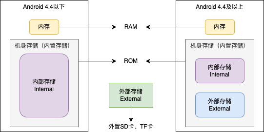

可以通过`find . -name <文件名>`在系统中查找文件，大部分文件夹需要root才能访问

# Android应用路径

## 内部存储和外部存储

* 内部存储（Internal storage）：`/data/`路径下，需要root之后才能查看
* 外部存储（External storage）：`/storage/`路径下，需要申请读写权限。包括机身存储和外部SD卡。
  * 机身存储：`/storage/emulated/0/`
  * SD卡存储：`/storage/SD卡/`

> 以前的手机都要插SD卡，机身存储就是内部存储，SD卡就是外部存储。
>
> 现在的手机基本都扩充了机身存储，不需要插SD卡，因此把机身存储从概念上划分为内部存储和外部存储。



**Android的内部存储和外部存储只是外存的两个分区。**

* ROM（Read-Only Memory，只读存储器）：断电后数据还在。也叫外存。
* RAM（Random Access Memory，随机存取存储器）：断电之后数据丢失。也叫主存、内存。

外部存储可能有多个，如何获取SD卡路径？

```java
File[] files;
if (Build.VERSION.SDK_INT >= Build.VERSION_CODES.KITKAT) {
    files = getExternalFilesDirs(Environment.MEDIA_MOUNTED);
    for(File file: files){
        Log.e(TAG, file);
    }
}
```

## 外部存储公共目录

根据type返回不同路径：`Environment.getExternalStoragePublicDirectory(type);`

* `Environment.DIRECTORY_DCIM：/storage/emulated/0/DCIM`
* `DIRECTORY_MUSIC：/storage/emulated/0/Music`
* `DIRECTORY_PODCASTS：/storage/emulated/0/Podcasts`
* `DIRECTORY_RINGTONES：/storage/emulated/0/Ringtones`
* `DIRECTORY_ALARMS：/storage/emulated/0/Alarms`
* `DIRECTORY_NOTIFICATIONS：/storage/emulated/0/Notifications`
* `DIRECTORY_PICTURES：/storage/emulated/0/Pictures`
* `DIRECTORY_MOVIES：/storage/emulated/0/Movies`
* `DIRECTORY_DOWNLOADS：/storage/emulated/0/Downloads`
* `DIRECTORY_DOCUMENTS：/storage/emulated/0/Documents`

## APP私有目录

APP私有目录（专属文件）：只有应用本身可访问，其他应用不可访问，应用卸载时会自动删除，也可以手动清除应用数据。

APP在内部存储和外部存储都有对应的私有目录：内部存储更安全，但是存储空间有限，建议大文件使用外部存储。

* `/data/data/包名/`：内部存储APP私有目录
  * `/data/data/包名/cache`：临时缓存信息，存储空间不足时会自动被清除，`context.getCacheDir()`
  * `/data/data/包名/files`：文件信息，`context.getFilesDir()`
  * `/data/data/包名/databases`：数据库信息
  * `/data/data/包名/shared_prefss`：SharedPreferences信息
* `/storage/emulated/0/Android/data/包名/`：外部存储APP私有目录
  * `/storage/emulated/0/Android/包名/cache`：临时缓存信息，存储空间不足时会自动被清除，`context.getExternalCacheDir()`
  * `/storage/emulated/0/Android/包名/files`：文件信息，`context.getExternalFilesDir()`
  * `/storage/emulated/0/Android/包名/databases`：数据库信息
  * `/storage/emulated/0/Android/包名/shared_prefss`：SharedPreferences信息

## 其他路径

* `/data/app/包名`：普通应用安装路径，存放apk和解压文件，`context.getPackageCodePath()`、`context.getPackageResourcePath()`
* `/system/app/包名`：系统应用安装路径，比`/data/app`权限更高，需要root之后才能卸载
* `/data/dalvik-cache`：存储dex优化的缓存文件，提升应用效率
* `/mnt/sdcard`、`/storage/sdcard0`、`/sdcard`、`/storage/emulated/0`、`/storage/emulated/legacy`：通过挂载和链接指向同一个路径，为了兼容不同Android版本路径名称。

| API                                         | 绝对路径                                      | 备注                                          |
| ------------------------------------------- | --------------------------------------------- | --------------------------------------------- |
| `context.getCacheDir()`                     | `/data/data/包名/cache`                       | 内部存储APP私有路径                           |
| `context.getFilesDir()`                     | `/data/data/包名/files`                       | 内部存储APP私有路径                           |
| `context.getExternalCacheDir()`             | `/storage/emulated/0/Android/data/包名/cache` | 外部存储APP私有路径                           |
| `context.getExternalFilesDir()`             | `/storage/emulated/0/Android/data/包名/files` | 外部存储APP私有路径                           |
| `Environment.getExternalStorageDirectory()` | `/storage/emulated/0`                         | 外部存储根目录                                |
| `Environment.getDataDirectory()`            | `/data`                                       | 内部存储根目录                                |
| `Environment.getRootDirectory()`            | `/system`                                     | 系统路径                                      |
| `Environment.getDownloadCacheDirectory() `  | `/cache`                                      | 公共缓存路径                                  |
| `context.getObbDir()`                       | `/storage/0/Android/obb/包名`                 | OBB（Opaque Binary Blob），一般用于安卓游戏， |

## 总结

* Context获取的路径一般都和APP有关，卸载APP会清除。Environment获取的路径和APP无关。
* 内部存储更安全，但是存储空间有限。建议大文件使用外部存储。
* APP在内部存储和外部存储都有对应的私有目录

# 常用系统路径

1. Settings provider属性：`/data/system/users/0/settings_global.xml`
1. `/system/etc/sysconfig/hiddenapi-package-whitelist.xml`：高版本无法调用hidden api，添加白名单
1. appops权限路径：`/data/system/appops.xml`
1. 所有应用权限：`/data/system/packages.xml`
2. 运行时权限：`/data/system/users/0/runtime-permissions.xml`
3. `/system/etc/permissions`、`/vendor/etc/permissions`
4. `/system/etc/default_permissions/default-permissions.xml`、`/system/etc/default_permissions/open app-permissions.xml`
8. uri访问权限：`/data/system/urigrants.xml`

```xml
<?xml version='1.0' encoding='utf-8' standalone='yes' ?>
<uri-grants>
<uri-grant sourceUserId="0" targetUserId="0" sourcePkg="com.cvte.tv.media" targetPkg="com.android.htmlviewer" uri="content://com.cvte.tv.media.fileProvider" prefix="true" modeFlags="1" />
</uri-grants>
```

# 异常文件

* 墓碑文件：`/data/tombstones`
* anr文件：`/data/anr`