# 前言

学习Android性能分析会涉及到一大堆工具。本来想将工具介绍放到性能分析过程中的，但是有的工具包含多个功能、存在功能重叠、或者被废弃了，穿插着讲会比较混乱。因此单独将工具使用拎出来，介绍工具的基本使用、不同工具间的关系、演进。

## 工具演进

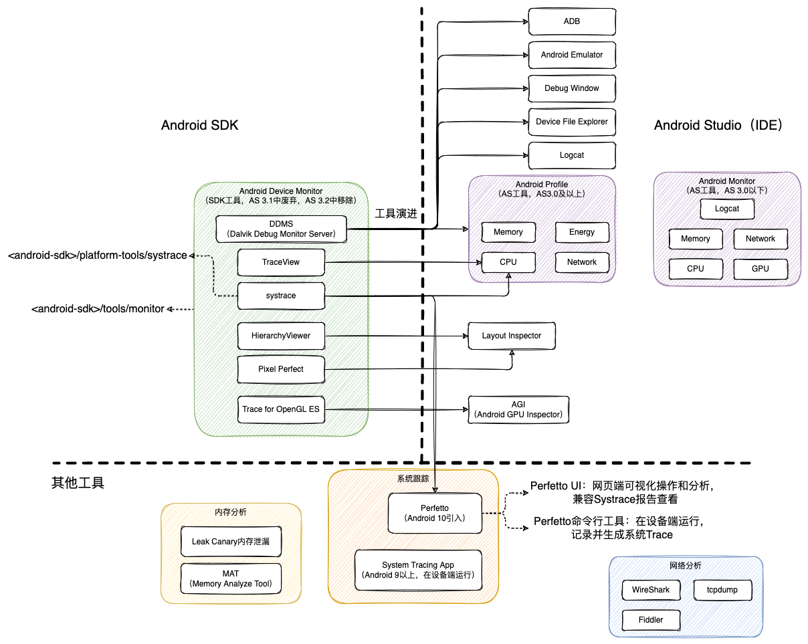

## 工具作用

按照作用对工具进行下分类。区分下调试工具和性能分析工具

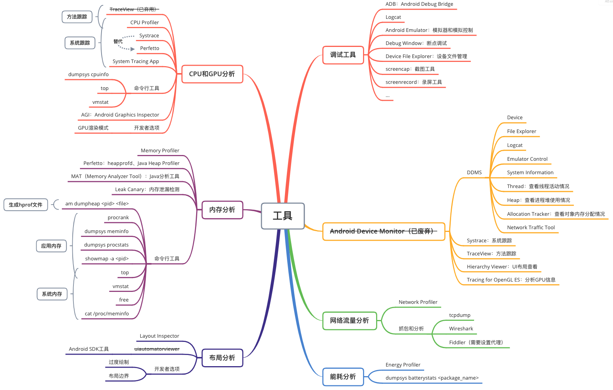

# Android Device Monitor

**大部分工具已弃用，被AS工具取代了，参考[AndroidDeviceMonitor迁移](https://developer.android.com/studio/profile/monitor)**

包含在Android SDK中，囊括调试和分析多个工具

- DDMS：包含设备文件管理，Logcat、线程信息、堆信息、网络统计等功能
- TraceView：分析`.trace`文件（已弃用，使用AS的CPU Profiler）
- systrace：收集特定Trace信息
- Tracer for OpenGL ES：分析GPU信息
- Hierarchy Viewer：布局查看
- Pixel Perfect
- Network Traffic tool：查看网络传输

## 打开方式

1. 通过`<android-sdk>/tools/monitor`命令打开。
2. 旧版本AS可以通过`Tools-->Android-->DeviceMonitor`打开。（Android Studio3.1中废弃，Android Studio3.2中移除。）


界面如下：

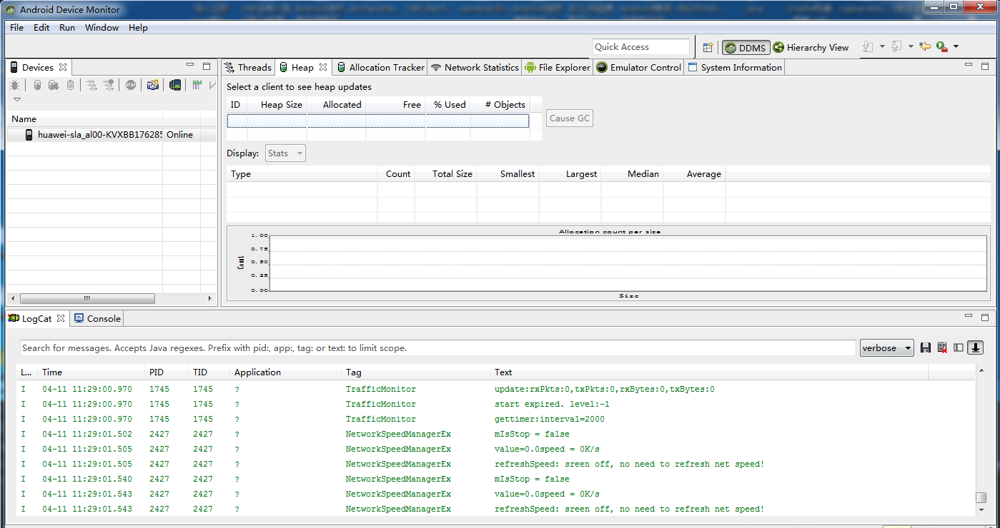

## 常用按钮介绍

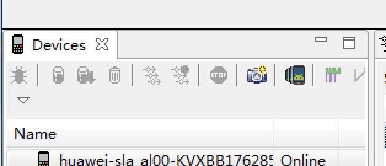

从左到右依次介绍：

1. Debug：开启调试，需要有源代码
2. Update Heap：更新堆使用情况，选中时右侧面板显示堆栈信息
3. Dump hprof file：生成堆使用情况hprof文件（Heap Profile）
4. Cause GC：触发垃圾回收
5. Update Thread：更新线程运行状态，选中时右侧面板显示线程运行状态
6. Start/Stop Method Profiling：开启或结束方法跟踪，采集数据，并自动使用TraceView显示图形化界面，可以导出`.trace`文件
7. Stop：结束进程
8. Screen Capture：截屏
9. Dump View Hierarchy for UI Automator：Dump布局信息
10. Capture system wide trace using Android systrace：打开Systrace工具

## DDMS（Dalvik Debug Monitor Server）

包含窗口和多个工具（调试和分析）：

* Device：用于查看连接的设备
* File Explorer：浏览设备文件
* Logcat：查看日志
* Emulator Control：仿真控制、模拟器控制，如模拟电话、短信、位置、通知等
* System Information：查看系统信息，CPU和内存使用情况等
* Thread：查看所有线程信息
* Heap：用于查看进程堆使用情况，例如Heap Size、Allocated、Free、Used、Objects等
* Allocation Tracker：查看对象内存分配的具体情况
* Network Traffic tool：监测网络使用情况

## TraceView

用于方法跟踪和查看，打开`.trace`文件分析具体方法调用耗时、CPU占用情况。Trace文件生成方式：

1. DDMS或者CPU Profiler中手动点击Start/Stop Method Profiling
2. 代码中调用`Debug.startMethodTracing`和`Debug.stopMethodTracing`方法

TraceView界面：


TraceView时间轴窗格：每个线程的活动信息

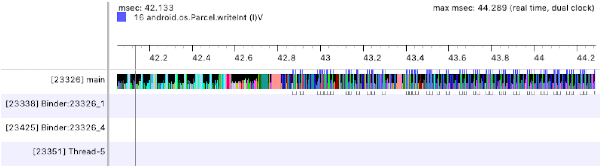

TraceView分析窗格：方法耗时和CPU使用信息

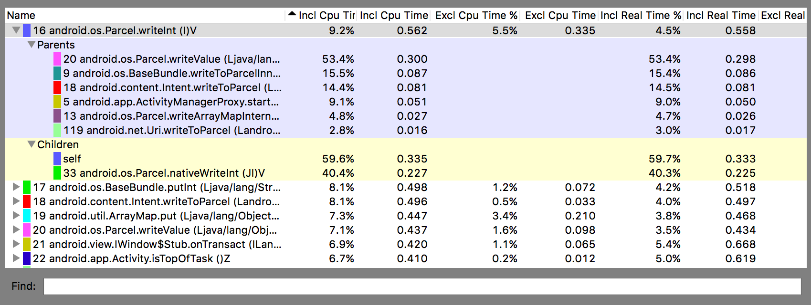

> * Incl Cpu Time：占用CPU时间，包括调用的方法
> * Excl Cpu Time：占用CPU时间，不包括调用的方法
> * Incl Real Time：方法执行真实时间，包括调用的方法
> * Excl Cpu Time：方法执行真实时间，不包括调用的方法
> * Calls+Recur Calls/Total：方法调用和递归次数占总次数的百分比
> * Cpu Time/Call：Cpu占用平均时间
> * Real Time/Call：平均执行时间

## dmtracedump

SDK工具：`Android/sdk/platform-tools/dmtracedump`，将`.trace`文件生成图形化的方法调用堆栈图

`dmtracedump [-ho] [-s sortable] [-d trace-file-name] [-g outfile] trace-file-name`

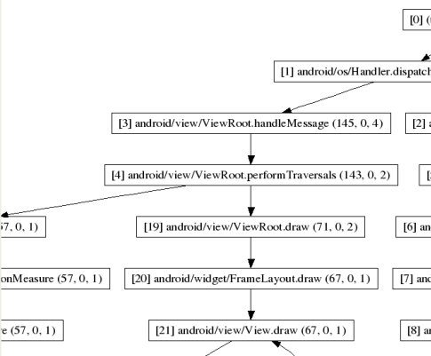

## Systrace工具

Systrace用于系统跟踪。基于Linux Kenerl的ftrace实现。在系统关键流程中插桩（如ActivityThread），通过category指定启用的Tag（高版本支持更多的Tag）。

> Java层的通过`android.os.Trace`类完成，native层通过`ATrace`宏完成

```java
public final class Trace {
    //系统使用
    @UnsupportedAppUsage
    public static void traceBegin(long traceTag, String methodName) {
        if (isTagEnabled(traceTag)) {
            nativeTraceBegin(traceTag, methodName);
        }
    }
    @UnsupportedAppUsage
    public static void traceEnd(long traceTag) {
        if (isTagEnabled(traceTag)) {
            nativeTraceEnd(traceTag);
        }
    }
    //APP使用
    public static void beginSection(@NonNull String sectionName) {
        if (isTagEnabled(TRACE_TAG_APP)) {
            if (sectionName.length() > MAX_SECTION_NAME_LEN) {
                throw new IllegalArgumentException("sectionName is too long");
            }
            nativeTraceBegin(TRACE_TAG_APP, sectionName);
        }
    }
    public static void endSection() {
        if (isTagEnabled(TRACE_TAG_APP)) {
            nativeTraceEnd(TRACE_TAG_APP);
        }
    }
}
```

**要收集应用Trace，跟踪的时候需要指定`-a`选项**

应用可以自定义插桩，参考[开发者文档-定义自定义事件](https://developer.android.com/topic/performance/tracing/custom-events)

* Java或Kotlin调用：`Trace.beginSection()`、`Trace.endSection()`
* Native调用：引入头文件`#include <android/trace.h>`，调用`ATrace_beginSection()`、`ATrace_endSection()`

注：

1. begin和end调用一一对应
2. begin和end必须在同一个线程
3. systrace要求app是debuggable的，但是debug版本apk和release有差距，会导致结果不准确。可以打包release版本，通过反射调用`Trace.setAppTracingAllowed(true)`方法开启

```shell
Class<?> trace = Class.forName("android.os.Trace");
Method setAppTracingAllowed = trace.getDeclaredMethod("setAppTracingAllowed", boolean.class);
setAppTracingAllowed.invoke(null, true);
```

### 图形界面使用

DDMS中打开Systrace工具

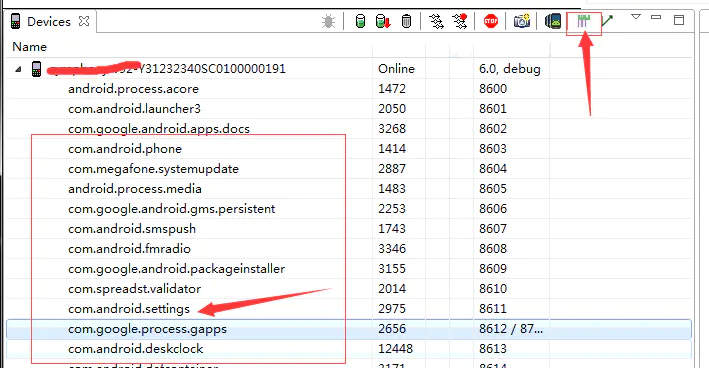

选择输出路径、跟踪时长、Buffer大小、Tag等

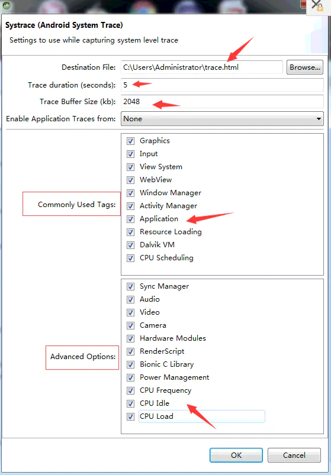

### 命令行使用

```shell
# 例如
$ cd Android/sdk/platform-tools/systrace
$ ./systrace.py --time=10 -o mynewtrace.html sched gfx view wm binder_driver hal dalvik input res

# Systrace使用说明：
$ systrace.py [options] [category1 [category2 ...]]

1. option为选项：可用`systrace.py -h`查看
   1. `-t N`或者`--time=N`：指定跟踪时长
   2. `-b N`或者`--buf-size=N`：指定跟踪缓冲区大小
   3. `-a <package-name>`或者`--app=<package-name>`：开启指定包名应用中自定义插桩的Trace
   4. `-l`或者`--list-categories`：查看设备支持的category
   5. `-o`：输出文件，默认输出`trace.html`
   6. `-j`：生成json文件
2. category为要捕获的信息：可用`systrace.py -l`查看
   1. `gfx`：Graphics信息，分析卡顿
   2. `input`：输入事件
   3. `sched`：cpu调度、线程信息
   4. `view`：View绘制
   5. `am`：ActivityManager调用信息，分析启动过程
   6. `dalvik`：虚拟机信息，分析GC
   7. `binder_driver`：分析Binder IPC
   8. `core_services`：SystemServer信息
```

### 分析报告

[分析报告](https://developer.android.google.cn/topic/performance/tracing/navigate-report)：可以使用Perfetto UI查看，选择"Open with legacy UI"。

如下图，绿色圆圈是正常的帧，红色和黄色表示存在卡顿。（无法看到具体调用栈，可以结合TraceView或CPU Profiler分析）

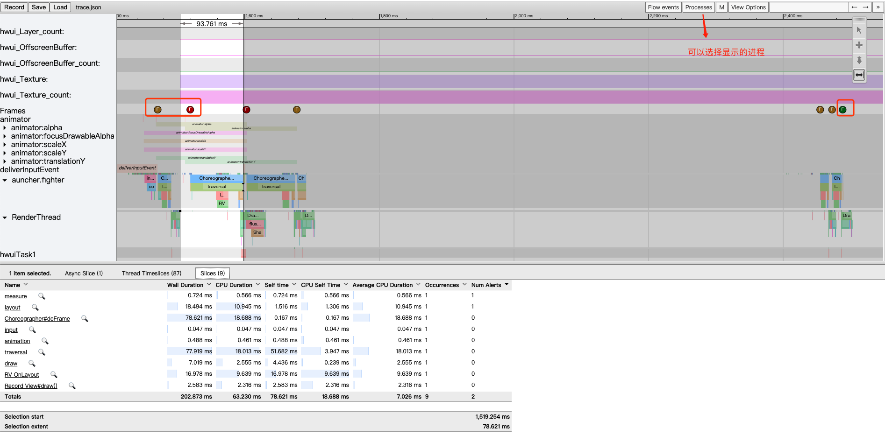

**TraceView和systrace区别：**

* TraceView：捕获某个时间段内所有方法调用再全部分析，对性能影响较大（一个人犯罪了，把全国人民抓起来审问），高版本可以设置采样间隔。
* systrace：更加精细的控制，对性能影响较小，在系统关键流程中插桩，收集特定范围内的信息，可以选择记录指定的TAG。

# Android Studio工具

包括多个工具，部分功能是集成Android SDK中的工具

* Logcat
* Android Emulator：模拟器。低版本是打开SDK的模拟器，高版本可以直接在AS中运行模拟器
* Debug Window：断点调试
* Device File Explorer：设备文件管理
* ADB
* Layout Inspector：布局查看
* 性能分析：AS 3.0以下使用Android Monitor，AS 3.0及以上使用Android Profiler
* ...

## Android Monitor

Android Studio3.0以下，包含Logcat、Memory、Network、CPU、GPU

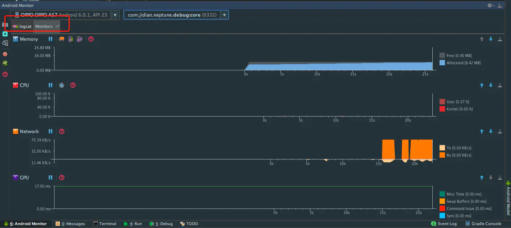

## Android Profiler

Android Studio3.0及以上，包含CPU（可以进行卡顿检测）、Memory、Network、Energy能耗分析器

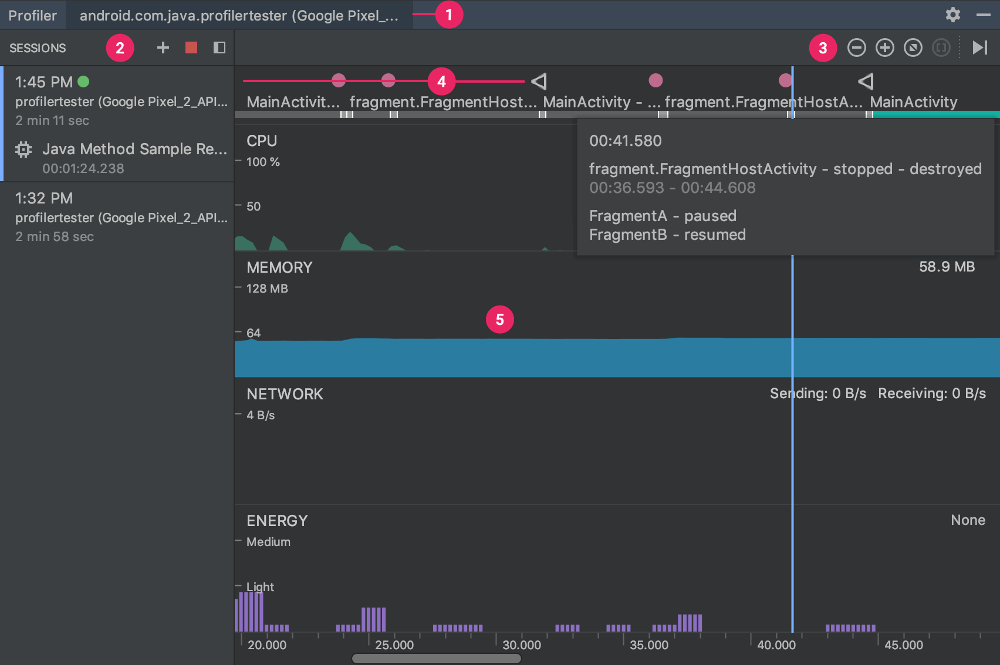

可以单独启动Profiler，而不运行Android Studio：`<studio-installation-folder>/Contents/bin/profiler.sh`

### 高级性能分析

低版本设备（Android 7.1（API 25）及以下）不支持部分高级功能，Profiler中会显示："Advanced profiling is unavailable for the selected process"。例如：

1. 不支持事件时间轴
2. Memory Profiler中不支持显示GC事件
3. Memory Profiler中不支持实时显示已分配对象数量
4. Network Profiler中不支持已传输文件的详细信息
5. ...

低版本设备要使用高级功能，需要修改配置：

1. 打开Run > Edit Configurations
2. 选择应用Module
3. 选择Profiling，打开"Enable additional support for older devices (API level < 26)"
4. 再次构建运行APP

原理：在编译时往应用内插桩，会降低编译速度。

## CPU Profiler

检查CPU使用率和线程活动，记录和查看方法调用轨迹。包括Java方法（Method Trace）、C/C++方法（Function Trace），系统方法（System Trace）。

### 主界面


1. 事件时间轴：显示Activity生命周期状态和用户交互事件等。（高级功能，低版本设备不支持）
2. CPU时间轴：实时显示应用CPU使用率（百分比）和当前应用线程总数，以及其他进程CPU使用率
3. 线程活动时间轴：列出应用所有线程和活动。
   1. 绿色：线程处于活跃状态或正准备使用CPU（就绪）。
   2. 黄色：线程处于活跃状态，正在等待I/O操作（磁盘或网络）。
   3. 灰色：线程休眠，并且没有消耗CPU。例如访问不可用资源。

采样方式：

1. 对Java方法采样：间隔一段时间捕获应用调用堆栈，比较捕获的数据集，推导应用Java方法执行时间和资源使用情况。
   1. 如果一个方法在间隔期间执行完毕，则可能不会被记录。对于这种生命周期较短的方法，应使用插桩跟踪
2. 跟踪Java方法：对每个Java方法调用开始和结束时记录时间戳。
   1. 记录每个方法，会影响运行时性能，进而影响分析数据。另外也会造成生成文件过大。
3. 对C/C++函数采样：捕获Native方法采样数据。
4. 跟踪系统调用：基于systrace，记录应用和系统方法调用情况。
5. 自定义配置

### 使用方式

1. 点击Record开始跟踪
2. 应用执行操作
3. 点击Stop停止跟踪
4. 自动打开分析窗格，也可以导出`.trace`跟踪文件

### 分析窗格


* Top Down：展开方法的被调用方
  * Self：方法本身执行时间
  * Children：子方法执行时间
  * Total：方法执行总时间
* Bottom Up：展开方法的调用方
* Call Chart：调用图。横轴是时间，纵轴是调用栈
  * 橙色：系统方法
  * 绿色：应用自身方法
  * 蓝色：三方API方法（包括Java API）
* Flame Chart：火焰图。将相同的调用栈汇总为较长的横条，横轴不代表时间轴，而是每个方法执行的相对时间
  * 橙色：系统方法
  * 黄色：三方API方法
  * 米黄色：应用自身方法

系统调用跟踪分析窗格，Display部分会显示系统图形流水线信息


* Frames：主线程和RenderThread时间，**超出16ms会显示红色**
* SurfaceFlinger：SurfaceFinger处理帧缓冲区的时间，负责将缓冲区内容送到显示器
* VSYNC：与显示流水线保持同步的信号
* BufferQueue：显示缓冲队列有多少帧在等待SurfaceFlinger使用。值为2表示处于三重缓冲状态。

## Memory Profiler

### 主界面


> 事件时间轴和实时已分配对象属于高级性能分析功能，低版本设备不支持。

Allocation Tracking采样方式：

- Full：捕获内存中的所有对象分配。低版本AS中（Android Studio 3.2及以下）的默认行为。影响运行速度。
- Sampled：定期对内存中的对象分配情况进行采样。默认选项，在进行性能剖析时对应用性能的影响较小。在短时间内分配大量对象的应用仍可能会表现出明显的速度减慢。
- Off：停止跟踪应用的内存分配。

内存计算方式：

* Java：Java或Kotlin对象大小
* Native：C或C++对象大小
* Graphics：图形BufferQueue内存大小
* Stack：原生堆栈和Java堆栈大小，与线程数有关
* Code：代码和资源（如Dex字节码、so库等）内存大小
* Allocated：分配的Java/Kotlin对象数。不包含Native对象。

### 使用方式

1. 查看内存使用量时间轴。
2. 高版本（Android 8.0及以上）默认持续跟踪内存分配。低版本（Android 8.0以下）需要点击Record memory allocations按钮开始记录和停止记录。
3. 执行操作
4. 点击强制GC按钮进行垃圾回收
5. 点击dump按钮捕获堆内存状态，生成hprof文件
6. 查看内存具体分配情况，或者导出hprof文件

### 分析窗格

1. Class Name：类分配情况
2. Instance：实例分配情况
3. Instance Detail：实例的引用链和实例的成员变量


* Allocations：分配的对象数
* Depth：GC Root到对象实例的最短跳数
* Native Size：对象在Native内存中的大小
* Shallow Size：对象本身的大小
* Retained Size：对象被释放掉后真正能够减少的大小，包括递归引用的对象。如果有多个对象引用同一个对象，则不会被计算进来。

## Energy Profiler

比较少用到

## Network Profiler

比较少用到

# 其他工具

## Perfetto命令行工具

* [官方文档](https://perfetto.dev/docs/)
* [使用介绍](https://developer.android.google.cn/studio/command-line/perfetto)
* [可视化界面-Perfetto UI](https://ui.perfetto.dev/)

**Android10引入的新一代分析工具，用于替代systrace工具**。大文件打开比systrace快，能长时间跟踪，systrace记录短时间设备活动。

1. ftrace：收集内核Trace信息
2. atrace：收集用户态Trace信息
3. Java Heap Profiler：收集Java内存分配信息，Android11及以上
4. heapprofd：收集Native内存分配信息，Android10以上

Perfetto UI界面如下，很容易找到超出16ms的块，再进一步放大检查调用栈

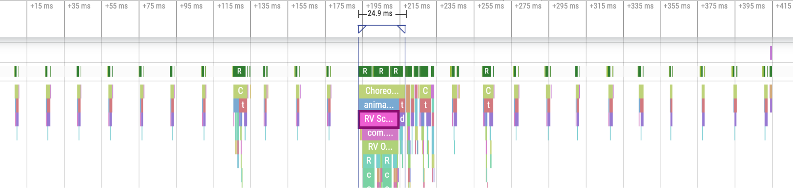

Perfetto可以兼容显示Systrace界面：选择"Legacy UI"打开

## System Tracing App

Android 9.0以上包含一个Sytem Tracing的系统应用，用于跟踪设备活动，生成Trace文件。可以直接在设备进行记录，再获取跟踪文件，无需通过adb连接到电脑。参考[System Tracing App介绍](https://developer.android.google.cn/topic/performance/tracing/on-device)

步骤如下：

1. 打开System Tracing应用：【开发者选项>System Tracing】
   
2. 开始记录：有两种方式
   1. 打开"Record Trace"开关
   2. 打开"Show Quick Settings Tile"开关，将图标添加到快捷设置面板中，点击快捷图标开启"记录系统Trace"。
3. 应用执行操作
4. 停止记录，会保存Trace文件
   1. Android10及以上版本使用`.perfetto-trace`后缀保存（Perfetto格式，可以转换成Systrace格式，参考[Trace conversion](https://perfetto.dev/docs/quickstart/traceconv)）
   2. Android9以上版本使用`.ctrace`后缀保存（Systrace格式）
5. 共享跟踪记录
   1. 使用adb：`adb pull /data/local/trace/ .`
   2. 使用Intent，通过电子邮件或其他应用共享给应用开发者

6. Perfetto UI中打开Trace文件分析

## AGI（Android GPU Inspector）

图形分析器，包括Trace跟踪，CPU、GPU、内存、电池使用、Vulkan API调用等功能。参考[Android GPU 检查器 (AGI)](https://developer.android.com/agi)

## MAT（Memory Analyzer Tool）

Java堆分析工具，和Eclipse一起使用。用于分析hprof文件。也有独立运行的MAT。参考[MAT使用入门](https://www.jianshu.com/p/d8e247b1e7b2)

## LeakCanary

Android内存泄漏检测工具，单独写一篇文章介绍和分析源码。

# 抓包工具

方法一：参考[Android端抓包方法](https://www.cnblogs.com/sgtb/p/3708566.html)

1. tcpdump抓包（需root）：`tcpdump -p -vv -s 0 -w /mnt/sdcard/capture.pcap`
2. Wire Shark中分析。

方法二：参考[使用Fiddler实现手机抓包](https://www.cnblogs.com/shoshana-kong/p/14161898.html)

1. 电脑安装Fiddler
2. 启动Fiddler代理服务
3. 手机设置网络代理为电脑IP地址，端口默认为8888
4. 手机端请求网络，请求会经过PC代理转发
5. Fiddler分析网络包

# 性能分析脚本

见[GitHub-PerformanceCheck](https://github.com/Afauria/PerformanceCheck)

# 结语

参考资料：

* [AndroidStudio指南-分析应用性能](https://developer.android.com/studio/profile)
* [Android指南-性能与功耗](https://developer.android.com/topic/performance)
* [Android指南-系统跟踪](https://developer.android.google.cn/topic/performance/tracing)
* [Android GPU 检查器 (AGI)](https://developer.android.com/agi)
* [MAT使用入门](https://www.jianshu.com/p/d8e247b1e7b2)
