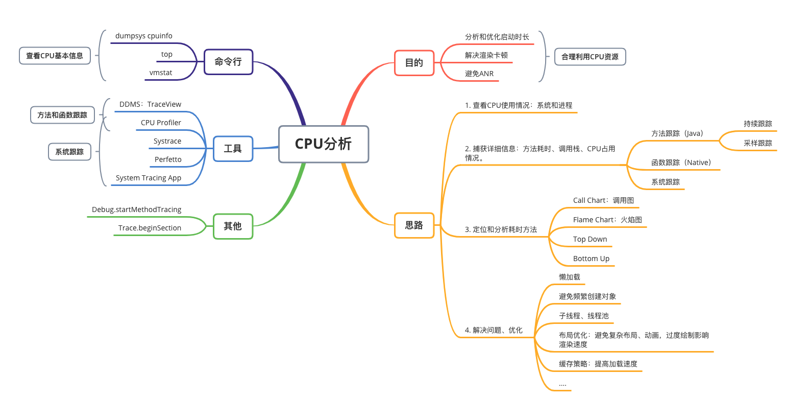
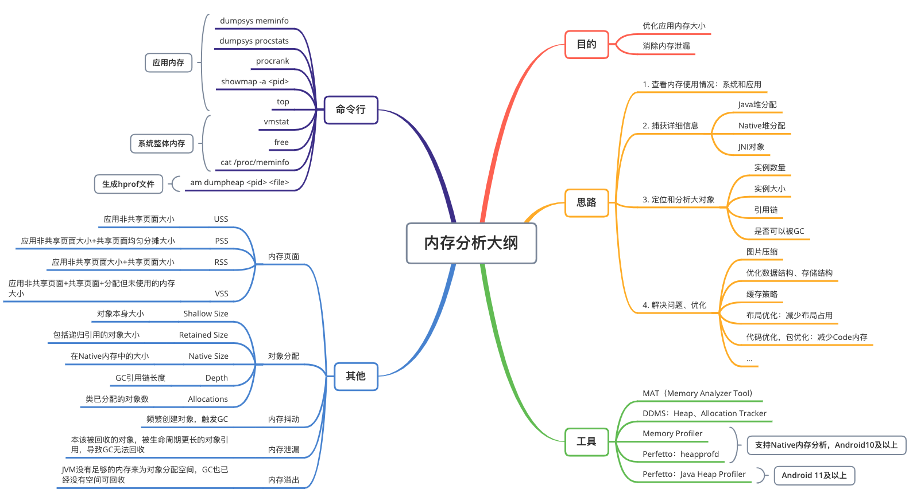
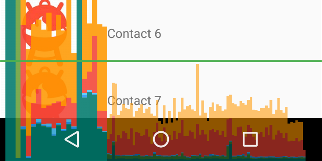
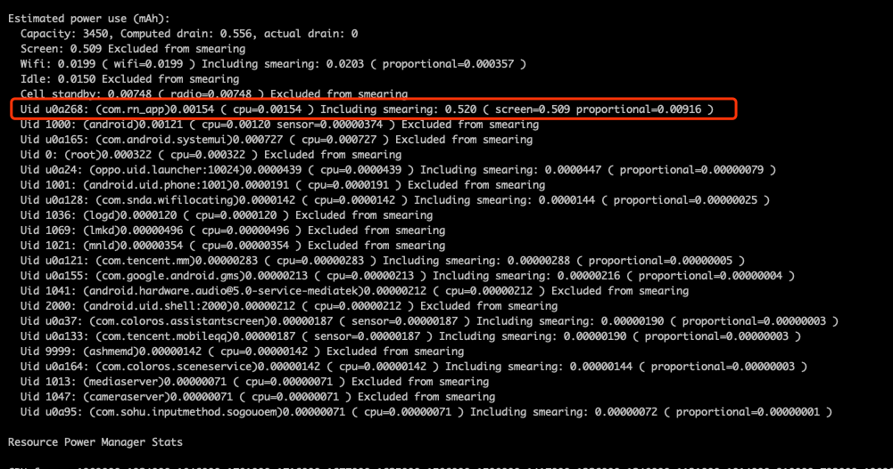

# 前言

性能分析分为很多领域，关系比较难理清，比如卡顿分析和内存、CPU、布局都有关系，对应的优化也是从这几方面入手。导致文章结构比较难组织，这里就罗列一下各种分析方法。

总体方法：

1. 查看基本信息：应用和系统整体CPU、内存等情况
2. 合理假设、缩小范围验证
3. 捕获具体信息：例如堆分配、方法调用栈、方法耗时等
4. 分析详细信息：找到具体影响因素
5. 解决、优化：**没有完美的方案，需要找到平衡点，以提升用户体验为最终目的**，例如空间换时间、时间换空间
   1. 在不影响用户体验情况下进行优化，例如LMK会根据进程优先级决定杀死顺序，ANR会根据前后台设置超时时间
   2. 对于不影响用户体验的地方可以降低优先级

性能分析不准确？

* 关闭`Instance Run`，避免影响性能
* 一般情况下只能对debuggable应用进行分析，而debuggable应用未经优化，导致性能分析不准确。Android 10（API 29）可以在应用清单文件中添加`<profileable android:shell="true"/>`，标记为profileable应用，对性能影响较小。可分析应用功能有限，只具备部分CPU和内存分析功能。
* 频繁的GC会影响性能
* 分析工具运行的时候会对App运行效率有一定影响，因此应该对比相对性能。

# CPU分析



## 跟踪

方法和函数跟踪：

1. 生成`.trace`跟踪文件：5.0以上可以设置采样间隔，避免影响性能。
   1. 手动开始/停止跟踪：DDMS或者CPU Profiler
   2. 代码中调用`Debug.startMethodTracing`和`Debug.stopMethodTracing`开始/结束跟踪
2. 查看和分析`.trace`文件：
   1. DDMS中的TraceView工具
   2. AS中的CPU Profiler

系统跟踪：

1. 生成Systrace或Perfetto文件
   1. 使用CPU Profiler，选择CPU记录配置为系统跟踪
   2. Systrace命令行工具：在PC上运行
   3. Perfetto命令行工具：在设备端运行，Android 10以上
   4. System Tracing App生成：Android 9以上
2. 查看和分析：
   1. [可视化界面-Perfetto UI](https://ui.perfetto.dev/)中查看
   2. 直接打开HTML文件

## 使用Debug类生成Trace文件

参考[通过应用插桩生成跟踪日志](https://developer.android.com/studio/profile/generate-trace-logs?hl=zh-cn)

对于间隔时间较短，或难以手动启动/停止记录的场景。可以使用Debug类进行跟踪，生成`.trace`文件导入CPU Profiler中查看。

```kotlin
//开启跟踪，可以指定文件名称
Debug.startMethodTracing(path)
//停止跟踪
Debug.stopMethodTracing()
```

注：

* 生成文件存储在`getExternalFilesDir()`路径下`/sdcard/Android/data/$packagename/files`。
* 启用剖析功能后，应用的运行速度会减慢，因此应该对比相对时间，而不是绝对时间。
* 存在8M的缓冲空间限制，对于持续较长时间的记录，需要使用CPU Profiler
* Android 5.0（API 级别 21）以上，新增`Debug.startMethodTracingSampling(String tracePath, int bufferSize, int intervalUs)`方法，可以基于采样的方法跟踪，可以设置采样间隔，减少对性能的影响。
* 未指定新的文件名称，调用多次跟踪方法，旧文件会被覆盖。可以动态的重命名文件，如下

```kotlin
val dateFormat: DateFormat = SimpleDateFormat("dd_MM_yyyy_hh_mm_ss", Locale.getDefault())
val logDate: String = dateFormat.format(Date())
Debug.startMethodTracing("sample-$logDate")
```

# 内存分析



USS<PSS<RSS<VSS：

- 独占内存大小 (USS，Unique Set Size)：应用使用的非共享页面大小（不包括共享页面）
- 按比例分摊的内存大小 (PSS，Proportional Set Size)：应用使用的非共享页面的内存+共享页面的均匀分摊大小（例如，如果三个进程共享 3MB，则每个进程的 PSS 为 1MB）。
- 常驻内存大小 (RSS，Resident Set Size)：应用使用的非共享页面+共享页面大小
- 虚拟内存大小（VSS，Virtual Set Size）：应用使用的非共享页面+共享页面+分配但未使用的内存大小

> 比较有用的是USS和PSS
>
> PSS需要确定共享的页面和共享页面的进程数量，因此计算较慢。PSS加起来即所有进程占用的实际内存。

共享内存：

1. Zygote启动并加载通用Framework代码和资源，新进程只加载和运行应用代码
2. 大部分静态数据可被其他进程共享：例如Dalvik代码（预加载的odex文件）、应用资源、so库
3. Android明确分配的共享内存区域，例如窗口Surface和屏幕合成器之间共享的内存

## 查看内存分配

1. 生成hprof文件：
   1. 手动点击dump按钮
   2. 命令行：`am dumpheap <pid> <file>`
   3. 代码中调用`Debug.dumpHprofData (String fileName)`
2. 查看内存分配
   1. Java内存分配：
      1. Memory Profiler
      2. MAT工具
      3. DDMS：Heap、Allocation Tracker
      4. Perfetto的Java Heap Profiler：Android11及以上设备
   2. Native内存分配：Android10及以上设备
      1. 使用Perfetto的heapprofd工具
      2. Memory Profiler：基于Perfetto的heapprofd实现
   3. JNI全局引用：Memory Profiler

## 内存泄漏

内存泄漏：指本该回收的对象，由于被生命周期更长的对象引用，导致GC无法回收这块内存（GC可达，被GC Root对象引用）。内存泄漏不会有直接的异常或崩溃，但是持续的泄漏最终会导致内存溢出。

> 就像水龙头漏水，漏的多了会导致池子变满溢出

检查方法：运行代码，执行操作（例如旋转设备、切换应用），尝试强制GC，检查内存和对象数是否会回到稳定值。

常见内存泄漏场景：

* Activity、Context、View、Drawable等对象被引用，导致Activity或Context无法回收
* 非静态内部类，默认持有外部类引用。例如Handler、Runnable、AysncTask、TimerTask未结束，导致Activity无法被回收
* 单例或static对象引用其他对象
* 观察者模式未解注册
* Android特殊组件：
  * 数据库Cursor未销毁
  * 数据库、网络Socket、文件连接未close
  * 自定义控件TypedArray未recycle
  * Bitmap未recycle


类型：

* 常发性内存泄漏：每次执行都会泄漏。
* 一次性内存泄漏：多次执行只泄漏一次，例如单例持有Context，每次打开新的页面都替换新的Context，原来的Context就可以被释放掉

## 内存抖动

内存抖动：频繁创建对象，触发GC。例如在循环中、或者`onDraw`、`onBindViewHolder`等频繁调用的方法中创建对象

分析：CPU Profiler或者Systrace检查是否频繁发生GC。观察内存曲线是否抖动。

## 内存溢出

OOM（Out of memory，内存溢出）：JVM没有足够的内存来为对象分配空间，GC也已经没有空间可回收，此时会抛出`java.lang.OutOfMemoryError`

原因：

1. JVM分配空间太少
2. 应用内存占用太多
3. 应用内存使用完了没释放（内存泄漏）

类型：

1. `java.lang.OutOfMemoryError: Java heap space`：Java堆内存溢出
2. `java.lang.OutOfMemoryError: PermGen space`：永久代溢出，即方法区。包括Class信息、静态变量、常量等过多
3. `java.lang.StackOverflowError`：虚拟机栈溢出，一般是由于深度递归和死循环造成。栈满时再入栈叫"上溢"，栈空时再退栈叫"下溢"

> 对应JVM内存模型，除了程序计数器之外，Java虚拟机栈、Native方法栈、Java堆、方法区都可能发生内存溢出

## APP内存限制

一般是系统配置的，通过`getprop`或者`cat /system/build.prop`命令可以查看，例如

```shell
[dalvik.vm.heapgrowthlimit]: [160m] # 默认情况下APP可以使用的Heap最大值
[dalvik.vm.heapmaxfree]: [4m] # 单次Heap调整的最大值
[dalvik.vm.heapminfree]: [512k] # 单次Heap调整的最小值
[dalvik.vm.heapsize]: [224m] # APP清单文件中指定了largeHeap属性，则以此项为最大值
[dalvik.vm.heapstartsize]: [4m] # APP启动时分配的初始大小
[dalvik.vm.heaptargetutilization]: [0.75] # 理想的堆内存利用率，已使用Heap/总Heap。GC之后会根据该值调整Heap大小
```

应用可以通过`ActivityManager`的`getMemoryClass`方法查询：返回整数，单位为M

## LMK机制

内存不足前会调用`onTrimMemory()`方法通知应用主动释放内存，否则Android系统的LMK机制（Low Memory Kill），会根据进程`oom_adj_score`值杀死进程。

- `cat /proc/进程号/oom_adj`：查看当前进程adj值
- `cat /proc/进程号/oom_score_adj`：查看真正有效的adj值

按进程重要程度分为以下级别，参考[开发者文档-进程间的内存分配](https://developer.android.com/topic/performance/memory-management)

* 系统原生进程：init、kswapd、netd、logd、adbd等
* 系统进程：系统服务system_server
* 持久性进程：设备核心服务，例如电话、WLAN
* 前台进程：用户正在交互所需要的进程
  * 这个进程拥有正在交互的Activity（前台Activity）
  * 这个进程的Service与正在交互的Activity绑定
  * 这个进程运行了前台服务（`startForegroundService`和`startForeground(id,notification)`）
  * 正在执行生命周期的Service
  * 正在执行onReceive的广播
* 可见进程：不和用户交互，但处于可见状态，用户可感知
  * Activity不处于前台，但仍可见（处于Pause状态）。例如前台activity启动一个对话框。
  * 进程的服务和可见Activity绑定
* 服务进程：运行了不属于上述两类的Service。通过`startService() `启动的进程。例如后台播放音乐、后台下载
* Launcher应用：桌面、主屏幕
* 上一个应用
* 后台进程：Activity不可见（处于Stop状态），多个后台进程被保存在一个LRU列表
* 空进程：不包含活动组件，用于缓存，缩短下次在该进程启动组件的时间。例如Activity Back退出，进程不会立马被杀。

更多细节参考[解读Android进程优先级ADJ算法](http://gityuan.com/2018/05/19/android-process-adj/)

## Kswapd

kernel swap daemon，作为一个守护进程会一直监控系统内存的使用，剩余内存达到低点(阈值)时触发回收操作，剩余内存达到高点(阈值)时停止回收操作。回收策略：

1. 删除缓存的内存：缓存本是用来以空间换时间的，现在空间不足了，就释放掉。
2. 压缩内存中的数据：这些数据删除就丢失了，于是压缩后放在内存中的特定区域，节省了空间。

# 卡顿分析

卡顿通常是因为主线程存在耗时方法调用，因此同样可以使用Cpu分析方法，使用系统跟踪，找到超出16ms的帧，分析具体方法耗时。

## GPU渲染速度

查看GPU绘制信息：`dumpsys gfxinfo <packageName`>`

打开GPU呈现模式，会显示柱状条和16ms水平线：

* 方法一：开发者选项>监控>GPU呈现模式分析
* 方法二：`setprop debug.hwui.profile [true/visual_bars/false]`




## 过度绘制

打开过度绘制调试：原色（0次，没有过度绘制）-->蓝色（1次）-->绿色（2次）-->粉色（3次）-->红色（3次以上）

* 方法一：开发者选项>调试GPU过度绘制
* 方法二：`setprop debug.hwui.overdraw [false/show/show_deuteranomaly]` 

## 捕获Binder调用

频繁的进行Binder调用会影响性能。

捕获Binder调用：

```shell
# 开始捕获
$ am trace-ipc start
# 执行操作：滚动、动画...
# 输出Binder调用堆栈
$ am trace-ipc stop --dump-file /data/local/tmp/ipc-trace.txt
```

## 检测主线程耗时

### Looper循环中添加打印

如下，loop中不断取出message处理。只要通过`Looper.getMainLooper().setMessageLogging()`设置打印类即可

```java
//Looper.java
public static void loop() {
  final Looper me = myLooper();
    for (;;) {
      Message msg = queue.next(); // might block
      final Printer logging = me.mLogging;
      if (logging != null) {
        logging.println(">>>>> Dispatching to " + msg.target + " " + msg.callback + ": " + msg.what);
      }
      msg.target.dispatchMessage(msg);
      if (logging != null) {
        logging.println("<<<<< Finished to " + msg.target + " " + msg.callback);
      }
    }
}
```

### 利用Choregorapher

Android系统每16ms发送一次VSYNC信号，触发UI绘制，并提供了相应的回调。

```java
Choreographer.getInstance().postFrameCallback(new Choreographer.FrameCallback() {
  @Override
  public void doFrame(long l) {
    //输出日志
  }
});
```

# 启动速度

1. 冷启动：后台无进程
2. 热启动：后台有进程，Activity不需要重建，如home键回首页
3. 温启动：后台有进程，但Activity需要重建或恢复状态，如back键退出Activity，内存不足回收Activity

查看启动时间：

1. `am start -W -n package/activity`
2. 启动应用后查看logcat中Displayed打印，低版本在`ActivityManager`中打印，高版本在`ActivityTaskManager`打印

```shell
# -W
$ am start -W com.afauria.sample
Starting: Intent { act=android.intent.action.MAIN cat=[android.intent.category.LAUNCHER] pkg=com.afauria.sample }
Status: ok
Activity: com.afauria.sample/.MainActivity
ThisTime: 517
TotalTime: 517
WaitTime: 672
Complete

# logcat
$ logcat -d |grep ActivityManager
03-15 15:01:07.418  3508  7142 I ActivityManager: START u0 {act=android.intent.action.MAIN cat=[android.intent.category.LAUNCHER] flg=0x10000000 pkg=com.afauria.sample cmp=com.afauria.sample/.MainActivity} from uid 0
03-15 15:01:07.569  3508  3539 I ActivityManager: Start proc 9980:com.afauria.sample/1000 for activity com.afauria.sample/.MainActivity
03-15 15:01:08.088  3508  3547 I ActivityManager: Displayed com.afauria.sample/.MainActivity: +517ms
```

分析：结合CPU分析方法，找到耗时操作。

解决：减少Application和Activity的onCreate中的工作

# 能耗分析

`Energy Profiler`，后面用过了再补充

方法：

1. 重置电池数据收集：`adb shell dumpsys batterystats --reset`

2. 断开USB线：充电状态下不会使用电池电量

3. 执行操作

4. 连接手机

5. 输出电池使用情况：`adb shell dumpsys batterystats <package_name>`，可以看到屏幕耗电和进程cpu耗电

   

6. 生成报告：
   1. 7.0及以上设备：`adb bugreport > [path/]bugreport.zip`
   2. 6.0及以下设备：`adb bugreport > [path/]bugreport.txt`
   
7. 使用`Battery Historian`分析报告

# 网络流量分析

`Network Profiler`

# 严格模式

开启严格模式，查看Log输出信息，分析I/O、网络等异常情况。

```java
// Application
public void onCreate() {
     StrictMode.setThreadPolicy(new StrictMode.ThreadPolicy.Builder()
             .detectDiskReads()
             .detectDiskWrites()
             .detectNetwork()   // or .detectAll() for all detectable problems
             .penaltyLog()
             .build());
     StrictMode.setVmPolicy(new StrictMode.VmPolicy.Builder()
             .detectLeakedSqlLiteObjects()
             .detectLeakedClosableObjects()
             .penaltyLog()
             .penaltyDeath()
             .build());
     super.onCreate();
 }
```

# 性能分析相关命令

介绍下上面没有提到的命令：

- 内存：
  - `dumpsys meminfo [package_name]`：查看某一时刻应用内存信息。
  - `dumpsys procstats`：查看进程内存、CPU信息，可以查看一段时间的内存信息
  - `procrank`：查看所有进程内存使用
  - `showmap -a <pid>`：查看进程内存信息和对应的地址区域
  - `cat /proc/meminfo`：查看设备内存
  - `free`：查看可用内存
  - `am dumpheap <pid> <file>`：捕获堆内存，生成hprof文件
- `dumpsys cpuinfo`：查看cpu信息
- `top`：查看**各个进程**信息，内存和CPU使用情况
- `vmstat`：查看**系统整体**内存和CPU使用情况
- `df -h`：查看设备存储空间
- `tcpdump`：网络抓包，结合Wire Shark分析

## dumpsys prostats

```shell
#应用运行时间百分比 (minPSS-avgPSS-maxPSS/minUSS-avgUSS-maxUSS/minRSS-avgRSS-maxRSS over 样本数)
AGGREGATED OVER LAST 3 HOURS:
  * com.android.systemui / u0a37 / v28:
           TOTAL: 100% (15MB-16MB-17MB/7.7MB-8.7MB-9.4MB/7.7MB-9.6MB-84MB over 178)
      Persistent: 100% (15MB-16MB-17MB/7.7MB-8.7MB-9.4MB/7.7MB-9.6MB-84MB over 178)
  ....
  * com.android.gallery3d / u0a62 / v40030:
           TOTAL: 0.01%
        Receiver: 0.01%
        (Cached): 54% (6.4MB-6.5MB-6.9MB/4.4MB-4.4MB-4.4MB/4.4MB-26MB-68MB over 6)
```

## top

`top`：查看**各个进程信息**，内存和CPU使用情况

- `-m <num>`：显示多少个进程
- `-n <num>`：刷新次数
- `-d <num>`：刷新间隔
- `-s <col>`：按列排序，如cpu、vss、rss、thr等
- `-t`：显示线程信息

top一般用于查看进程信息，vmstat一般用于查看系统整体信息

## vmstat

Linux命令（Virtual Memory Statistics），查看**系统整体**CPU和内存使用率，虚拟内存交换情况，IO读写情况

使用方式：`vmstat [Delay] [Count]`

```shell
$ vmstat
procs -----------memory---------- ---swap-- -----io---- -system-- ----cpu----
 r  b   swpd   free   buff  cache   si   so    bi    bo   in   cs us sy id wa
 2  0 173136  81416  14100 228904    0    0     1     0    0 1096  5  7 88  0
```

* procs进程
  * r： 等待执行的任务数。超过CPU个数，则会出现CPU瓶颈
  * B：等待IO的进程数量
* memory内存
  * swpd：正在使用的虚拟内存大小，单位KB
  * free：空闲内存大小
  * buff：已用的Buffer大小，对块设备读写进行缓冲
  * cache：已用的cache大小，文件系统的cache
  * inact：非活跃内存大小，即可回收的内存。使用-a选项显示
  * active：活跃的内存大小。使用-a选项显示
* Swap：内存交换
  * si：每秒从交换区写入内存的大小，单位KB/s
  * so：每秒从内存写入交换区的大小，单位KB/s
* IO
  * bi：每秒读取磁盘的块数，单位block，块大小一般为1024bytes
  * bo：每秒写入磁盘的块数，单位block
* System：值越大，sy就会越大
  * in：每秒中断数
  * cs：每秒上下文切换数
* CPU：
  * us（User time）：用户进程执行消耗CPU时间
  * sy（System time）：系统进程消耗CPU时间
  * id：空闲时间（包括IO等待时间），一般us+sy+id=100，us+sy参考值为80%，大于80%可能存在CPU不足
  * wa：等待IO时间

# 结语

关于优化，文中只提到了一部分，更多优化思路请参考下一篇文章

ANR是卡顿的极端情况，单独写了一篇文章介绍。

LMK是系统内存管理的一种机制，后续可能会单独写一篇文章介绍

参考资料：

* [AndroidStudio指南-分析应用性能](https://developer.android.com/studio/profile)
* [Android指南-性能与功耗](https://developer.android.com/topic/performance)
* [Android指南-系统跟踪](https://developer.android.google.cn/topic/performance/tracing)
* [开发者文档-GPU渲染分析](https://developer.android.com/topic/performance/rendering/inspect-gpu-rendering#profile_rendering)
