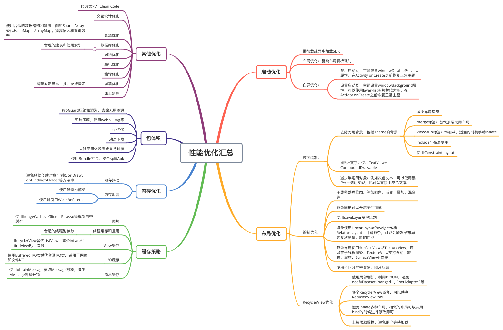

# 前言

这里只介绍思路，不介绍具体实现方法（持续补充），光一个内存泄漏就可以写一篇。针对内容较多的点，后续可能会单独写文章。

之所以不放在分析方法中，是因为很难归类，穿插到性能分析中的话会有很多重复的地方。（强迫症纠结了好久）

例如布局优化，同时包括了CPU、内存、卡顿优化方法；图片压缩能同时提高运行效率，降低内存占用。

通用思路：

1. 监控：
   1. Hook源码关键点
   2. ASM插桩修改
   3. 静态代码质量检查
2. 收集、分析、上报：自定义收集、dumpHprof等
   1. IdleHandler空闲时
   2. 开启子进程
3. 优化：
   1. ASM插桩
   2. 编码规范、静态代码质量检查
   3. Gradle编译流程插入

# 布局优化

## 过度绘制

1. 去除无用背景，包括Theme的背景
2. 减少布局层级
   1. merge标签：替代顶层无用布局
   2. ViewStub标签：懒加载，适当的时机手动inflate
   3. include：布局复用
   4. 使用ConstraintLayout
   5. 图标+文字：使用TextView+CompoundDrawable
3. 减少半透明对象：例如灰色文本，可以使用黑色+半透明实现，也可以直接用灰色文本

## 绘制优化

1. 子线程处理位图，例如圆角、渐变、叠加、混合等
2. 复杂图形可以开启硬件加速
3. 使用saveLayer离屏绘制
4. 避免使用LinearLayout的weight或者RelativeLayout：计算复杂，可能会触发子布局的多次测量，影响性能
5. 复杂布局使用SurfaceView或TextureView，可以在子线程渲染。TextureView支持移动、旋转、缩放，SurfaceView不支持
6. 使用不同分辨率资源

## RecyclerView优化

1. 使用局部刷新，利用DiffUtil，避免`notifyDatasetChanged`、`setAdapter`等
2. 多个RecyclerView嵌套，可以共享RecycledViewPool
3. 避免inflate多种布局，相似的布局可以共用，bind的时候进行修改即可
4. 上拉预取数据，避免用户等待加载

# 启动优化

1. 懒加载或异步加载SDK
2. 布局优化：复杂布局解析耗时
3. 白屏优化：
   1. 禁用启动页：主题设置windowDisablePreview属性。在Activity onCreate之前恢复正常主题
   2. 设置启动页：主题设置windowBackground属性，可以使用layer-list图片替代大图。在Activity onCreate之前恢复正常主题

# 内存优化

## 内存泄漏

基本和常见内存泄漏场景对应

1. 使用静态内部类
2. 使用弱引用WeakReference
3. Activity退出时移除Handler消息、取消AsyncTask、TimerTask任务
4. 手动释放静态对象和单例对象引用的对象
5. 观察者解注册

## 内存大小占用

1. 资源压缩
2. 释放策略：例如应用退到后台，可以释放一些屏幕外的资源、对象或者View
3. 数据结构和缓存优化
4. 代码和包体积优化

## 线程优化

1. 线程优化
   1. 使用线程池
   2. 静态代码质量检查，禁止`new Thread`
   3. ASM修改字节码，将`new Thread`改为线程池调用，或者自定义Thread类，重写start方法交给线程池
2. 线程监控：hook线程方法`pthread_create、pthread_detach、pthread_join、pthread_exit`，记录线程生命周期和堆栈，异常上报

# 包体积优化

1. ProGuard压缩和混淆，去除无用资源
2. 图片压缩，使用webp、svg等
3. so优化
4. 动态下发
5. 去除无用三方依赖库，或自行封装：有的时候三方库会包含很多用不到的功能
6. 使用Bundle打包，结合splitApk

# 缓存策略

1. 图片：ImageCache，Glide、Picasso等框架自带缓存
2. 线程缓存和复用：合适的线程池参数
3. View缓存：RecyclerView替代ListView，减少inflate和findViewById次数
4. I/O缓存：使用Buffered I/O类替代普通I/O类，适用于网络和文件I/O
5. 消息缓存：使用obtainMessage获取Message对象，减少Message创建开销

# 其他优化

代码优化（Clean Code）：之后单独开一篇Clean Code和编码规范

1. 不要提前创建变量，用到的时候再创建
2. 不常用的对象使用完之后主动释放
3. 代码可读性：
   1. 利用设计模式消除回调地狱

交互设计优化：通过交互设计来提升用户体验。

1. 一些确实耗时的操作，合理利用进度条、加载圈提示用户。
2. 页面不要放太多东西，一次性加载耗时，可以结合抽屉栏、菜单、子页面等

算法优化：使用合适的数据结构和算法，例如SparseArray替代HaspMap、ArrayMap。提高插入和查询效率

数据库和存储优化：合理的建表和使用索引

网络优化：网络请求慢也是影响用户体验的因素

1. 合并请求
2. 传输数据优化
3. 多节点部署、负载均衡

耗电优化

编译优化：

1. 使用合适版本的AGP
2. 自定义Task和Plugin，提高开发效率

崩溃优化：捕获崩溃异常上报，友好提示

线上监控

# 结语

参考资料

* [AndroidStudio指南-分析应用性能](https://developer.android.com/studio/profile)
* [Android指南-性能与功耗](https://developer.android.com/topic/performance)
