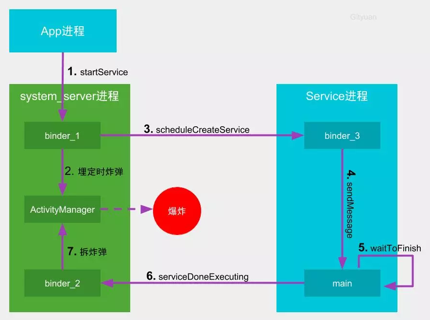
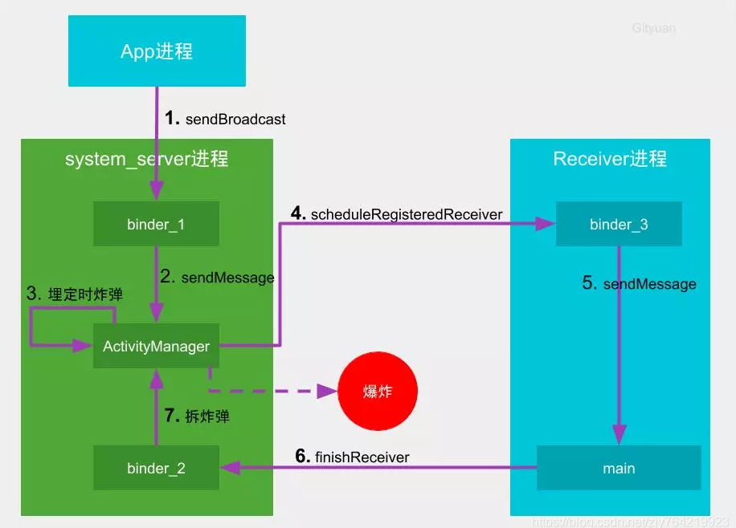
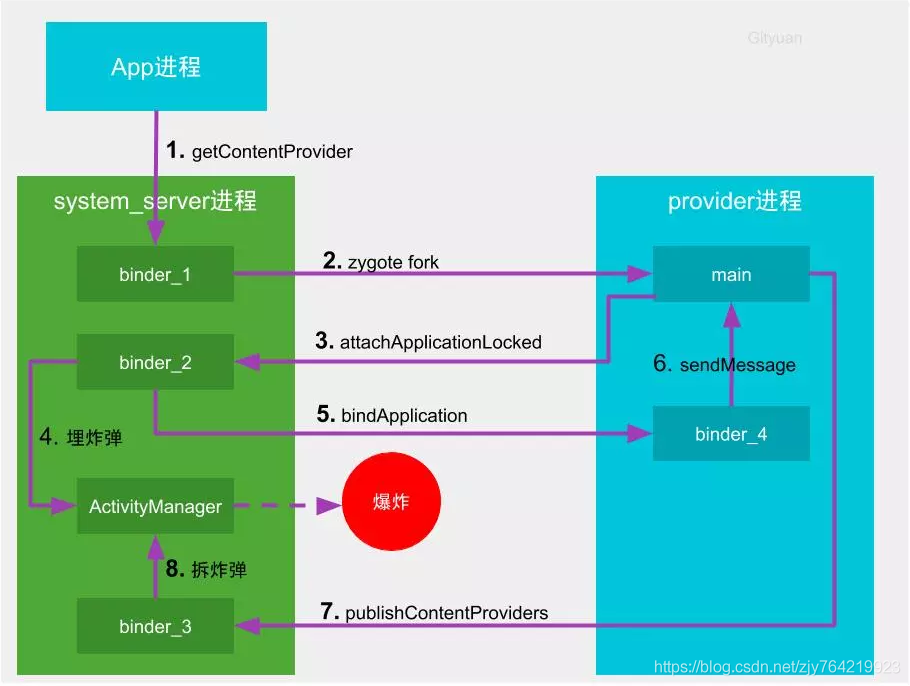
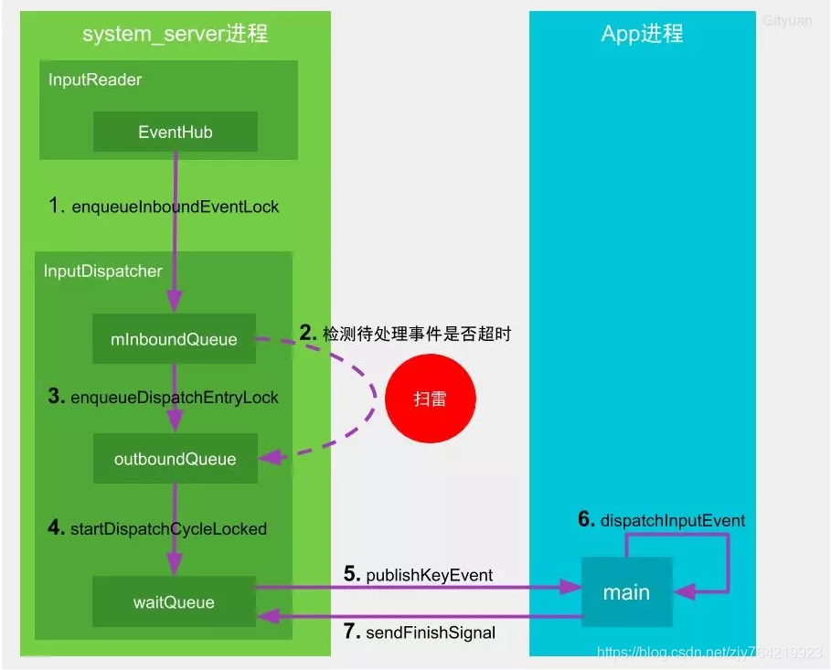

# ANR分析

ANR（Application Not Response，应用无响应）：ANR可以看作是卡顿的极端情况，系统有一套检测机制

原因：

1. **主线程**做了太多阻塞耗时操作：
   1. I/O
   2. 同步Binder调用
   3. 长时间计算
   4. 等待阻塞其他线程资源的锁：Thread的join、sleep、wait方法

2. 系统整体性能慢：CPU和内存满载、内存碎片化、GC慢等

分析：

1. 使用严格模式
2. 打开【开发者选项>显示所有ANR】：一般情况下只有前台会显示ANR对话框，但是后台广播、服务也可能发生ANR。
3. CPU分析耗时方法
4. 出现anr之后会在`/data/anr/`路径下生成anr trace文件。找到对应的进程pid，搜索`main`线程，查看anr堆栈。

解决：

1. 优化应用内存
2. 将耗时操作放到子线程
2. 避免频繁实时刷新UI
2. onReceive中耗时操作可以通过启动IntentService处理
2. 代码设计避免出现同步、死锁等异常情况

# ANR机制

先介绍大致的流程，源码分析之后再补（TODO）

主要原理：

1. 埋炸弹：向system_server埋入定时炸弹，在规定时间内没有完成任务，则引爆炸弹，炸毁目标进程。
2. 拆炸弹：在规定时间内完成任务，拆除炸弹
3. 引爆炸弹：system_server封装现场，抓取快照，收集Trace，便于后续分析。弹出ANR提示框

触发机制

* Service生命周期超时：前台20s、后台200s
  * `Reason: Executing service`
* BroadcastReceiver生命周期超时：前台10s、后台60s
  * `Reason: Broadcast of Intent { ... }`

* ContentProvider启动超时：10s
  * `Reason: ContentProvider not responding`

* 前台Activity响应输入事件超时：5s
  * `Reason: Input dispatching timed out (Waiting because the focused window has not finished processing the input events that were previously delivered to it.)`
* 窗口获取焦点超时：5s
  * `Reason: Input dispatching timed out (Waiting because no window has focus but there is a focused application that may eventually add a window when it finishes starting up.)`

注：

前台广播和后台广播？

> 广播默认是后台的，通过指定Intent的flag为`FLAG_RECEIVER_FOREGROUND`，设置为前台广播。
>
> AMS中有两个广播队列：mFgBroadcastQueue和mBgBroadcastQueue

只有有序广播才会超时，无序广播一次循环分发，不存在前一个receiver处理慢的问题

Service、BroadcastReceiver、ContentProvider原理类似，都采用"定时雷"的方式，超时会主动引爆炸弹。

输入事件超时和窗口获取焦点超时，采用的是"扫雷"的方式，超时不会主动引爆炸弹，等新的事件来了之后踩雷。

后台广播和服务ANR不会有提示框，而是Log输出异常。

LMK机制可能刚好把广播进程杀掉，导致ANR，此时pid为0。（自动化测试时可以判断pid为0时不报ANR异常）

## Service超时

1. 客户端启动服务
2. system_server接收请求，向AMS发送消息，埋"定时雷"。如果时间到了没有拆除则触发ANR。
3. system_server通知Service进程创建Service
4. Service进程接收消息，发到主线程
5. 主线程调用Service生命周期，执行任务，并等待SP持久化
6. 执行完成之后向system_server汇报
7. system_server向AMS发送消息，拆除定时炸弹

## BroadcastReceiver超时

1. 客户端发送广播
2. system_server接收广播，向AMS发送消息
3. AMS埋"定时雷"。如果时间到了没有拆除则触发ANR。
4. AMS通知注册的BroadcastReceiver进程
5. BroadcastReceiver进程接收消息，发到主线程。主线程调用BroadcastReceiver生命周期，执行任务
6. 执行完成向通知system_server汇报
7. system_server向AMS发送消息，拆除定时炸弹

## ContentProvider超时

1. 客户端请求ContentProvider数据
2. system_server接收请求，如果未启动，则先通过zygote fork新进程
3. ContentProvider进程向system_server注册
4. AMS埋"定时雷"。如果时间到了没有拆除则触发ANR。
5. system_server通知Provider进程
6. Provider进程接收消息，发到主线程执行任务
7. 执行完成向通知system_server汇报
8. system_server向AMS发送消息，拆除定时炸弹

## 输入事件无响应

1. InputReader线程通过EventHub监听`/dev/input`读取输入事件，发给InputDispatcher。InputDispatcher线程负责将事件分发给目标应用窗口
   1. mInboundQueue队列记录接收的事件
   2. outboundQueue队列记录即将分发的事件
   3. waitQueue记录已分发，且目标应用未处理完成的事件
2. InputDispatcher开始分发事件
   1. 先检测是否有正在处理的事件（mPendingEvent），如果没有则取出mInboundQueue队头的事件，赋值给mPendingEvent，并重置ANR时间。否则不会取出事件，也不会重置时间
   2. 检查窗口是否就绪（checkWindowReadyForMoreInputLocked）
   3. 满足以下条件，进入扫雷，终止本轮事件分发
      1. 对于按键事件判断outboundQueue或者waitQueue不为空
      2. 对于非按键事件，判断waitQueue不为空且等待队头时间超时5s
3. 当窗口准备就绪后，将mPendingEvent放到outboundQueue队列
4. 从outboundQueue中取出事件，放入waitQueue队列
5. InputDispatcher通过Socket发送事件给目标应用进程（APP进程初始化时就已经创建双向通信Socket）
6. 目标进程收到事件后，转发给目标窗口处理，进行View事件分发处理
7. 处理完成后向system_server汇报，从waitQueue队列中移除事件

原理：InputDispatcher运行在system_server中，接收底层传上来的设备事件，然后检测上一个事件是否已经处理完毕，如果超时，会调用WMS的notifyANR提示弹窗。应用程序主线程通过InputChannel读取输入事件，交给View处理。

如果没有新事件，即使超时了也不会主动上报。系统推测这个时候用户可能没有关注手机，过一段时间阻塞可能会自行消失，因此会"隐瞒不报"。

## 窗口获取焦点超时

属于输入事件超时：由于窗口获取不到焦点，导致应用无法接收事件，因此InputDispatcher会上报ANR。

一般发生在窗口切换时：

1. 焦点在A应用窗口
2. 切换应用B
3. A应用onPause，焦点丢失
4. B进程创建，焦点丢失
5. B应用onResume，获取焦点

其中3、4过程中焦点为null，如果超过了5s，且新事件到来，则会产生ANR。

此时报告ANR的应用可能是A或者B，但不一定是真正超时的应用，需要具体分析：

* A应用onPause慢
* B应用创建慢，onCreate、onStart、onResume耗时
* 系统整体性能慢

# 结语

参考资料：

* [理解Android ANR的触发原理](http://gityuan.com/2016/07/02/android-anr/)
* [ANR解决方法研究](https://blog.csdn.net/zjy764219923/article/details/102897066)
