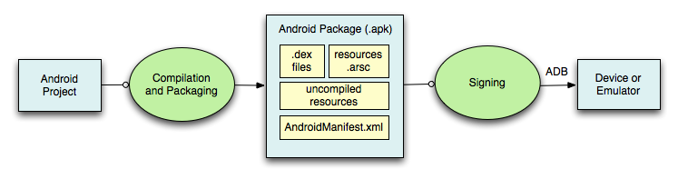
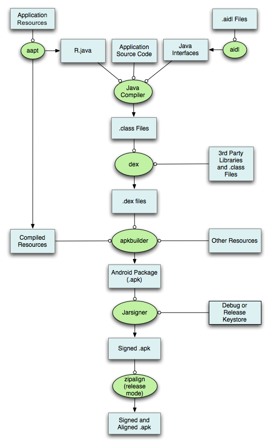
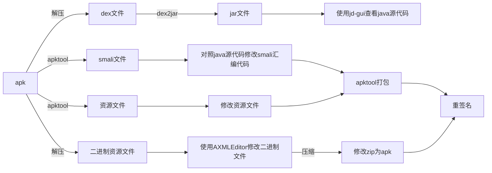
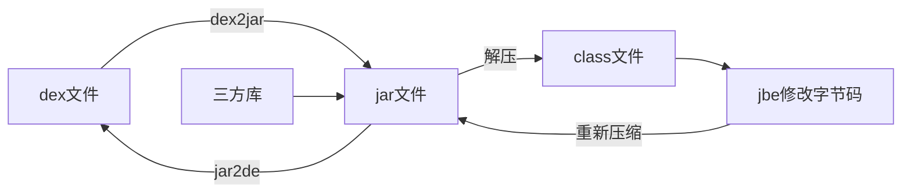
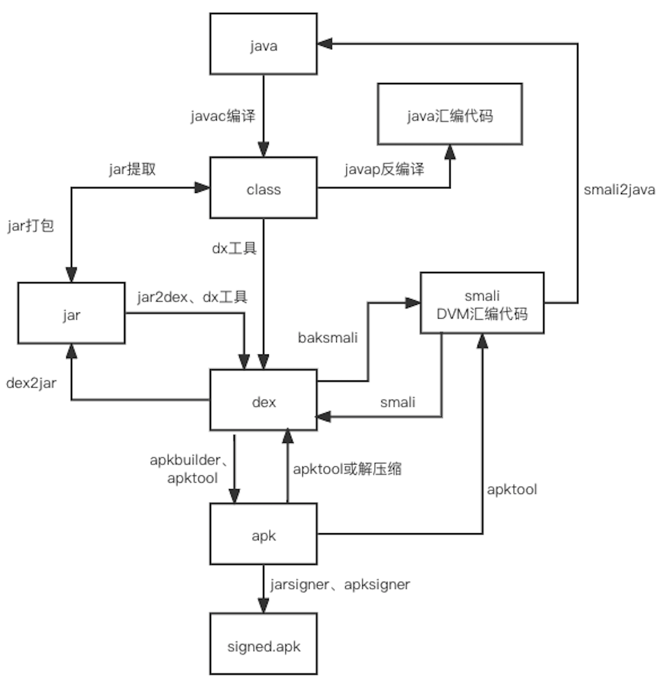
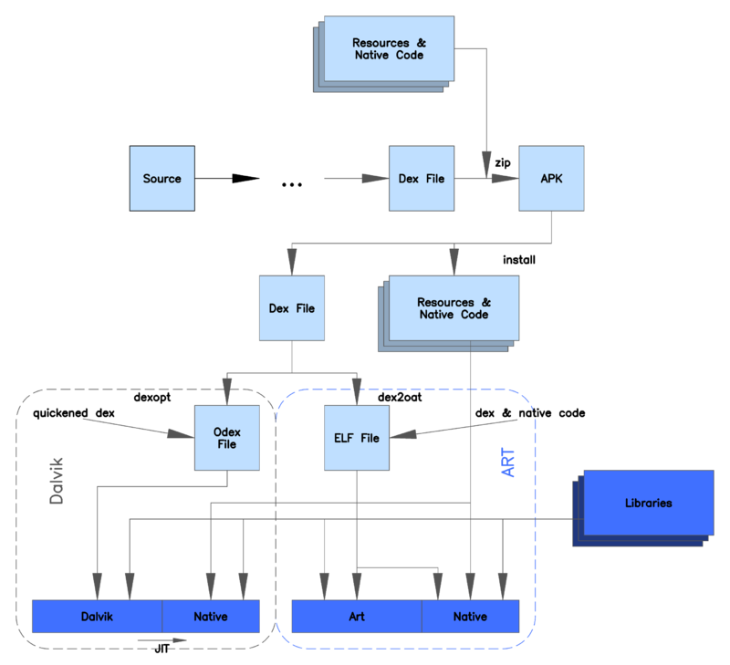
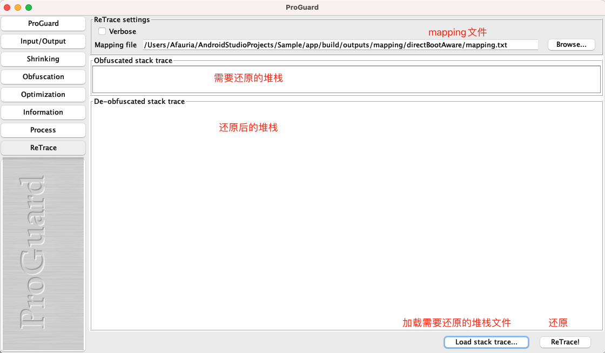
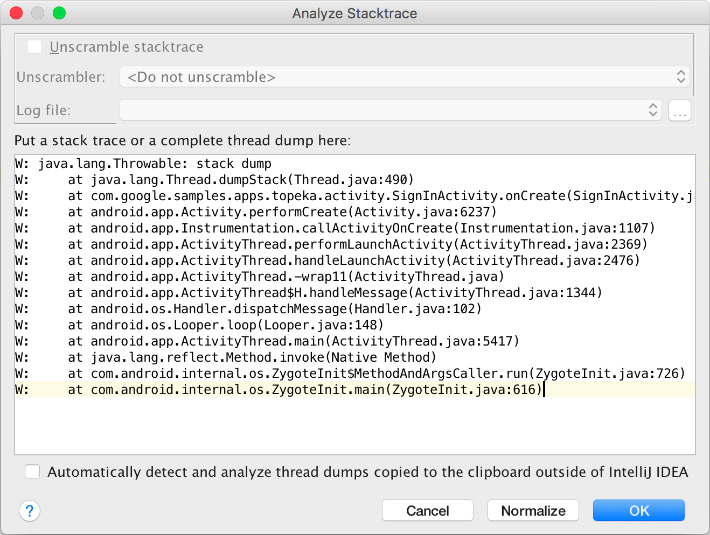
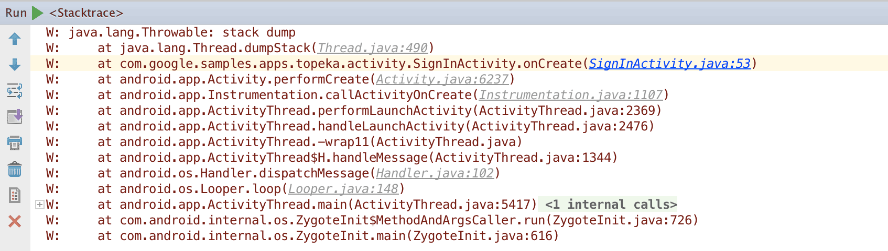

# Android打包

## APK文件结构

* **classes.dex**：Dalvik虚拟机的可执行文件，Google为Android平台定制了Dalvik虚拟机，而不是使用Java虚拟机。
* **resources.arsc**：将部分资源编译成二进制文件。记录资源名称、类型、值、ID等信息，用于快速索引找到资源。
* **AndroidManifest.xml**：声明应用信息和权限，四大组件注册等
* **lib**：存放的so动态链接库。
* **META-INF**：签名文件夹，里面存放三个文件，有两个是对资源文件做的SHA1 hash处理，一个是签名和公钥证书。
* **res**：资源文件夹。会被映射到`R.java`中，通过资源id访问
* **assets**：资源文件夹。不会被映射到`R.java`中，需要使用AssetManager访问

构建安装流程：



## 打包流程



## 工具说明

| 工具名称   | 功能介绍                                                     | Sdk路径                                   |
| :--------- | :----------------------------------------------------------- | :---------------------------------------- |
| aapt       | Android资源打包工具：生成R.java、resources.asrc和res文件夹   | ${ANDROID_SDK_HOME}/platform-tools/appt   |
| aidl       | Android接口描述语言转化为.java文件                           | ${ANDROID_SDK_HOME}/platform-tools/aidl   |
| javac      | Java Compiler：将java源代码编译为class文件                   | ${JDK_HOME}/javac或/usr/bin/javac         |
| dex        | 将.class文件转化为.dex文件                                   | ${ANDROID_SDK_HOME}/platform-tools/dx     |
| apkbuilder | 生成apk包                                                    | ${ANDROID_SDK_HOME}/tools/opkbuilder      |
| jarsigner  | .jar文件的签名工具                                           | ${JDK_HOME}/jarsigner或/usr/bin/jarsigner |
| zipalign   | 字节码对齐工具，release模式下将apk中未压缩的数据进行4字节对齐。方便使用mmap访问，减少内存占用 | ${ANDROID_SDK_HOME}/tools/zipalign        |

class转dex命令：`dx --dex output=生成的dex文件 class文件路径`

注：zipalign使用时机取决于签名工具：

> - 如果使用 `apksigner`，只能在为 APK 文件签名**之前**执行 zipalign。否则会导致签名失效
> - 如果使用 `jarsigner`，只能在为 APK 文件签名**之后**执行 zipalign。

## 签名

详情见[Android签名知识汇总](/2021/11/05/android-2021-11-05-Android签名知识汇总/)

1. 生成keystore文件：`keytool -genkey -alias <别名> -keyalg <加密算法，如RSA> -validity <有效天数> -keystore <输出文件>`
2. 生成系统签名keystore文件：系统应用需要使用系统签名，拥有更高的权限
   1. 获取Android源码签名文件：`platform.pk8 `和` platform.x509.pem`，位于`release/android/n-cn/build/target/product/security/``
   2. `openssl pkcs8 -in <platform.pk8> -inform DER -outform PEM -out shared.priv.pem -nocrypt`
   3. `openssl pkcs12 -export -in <platform.x509.pem> -inkey shared.priv.pem -out shared.pk12 -name <platform>`
   4. `keytool -importkeystore -deststorepass <password> -destkeypass <password> -destkeystore <keystore文件名称> -srckeystore shared.pk12 -srcstoretype PKCS12 -srcstorepass <password> -alias <keystore别名>`

3. `jarsigner`签名：`jarsigner [-verbose -keystore <keystore文件> -signedjar <输出文件名称> -storepass <口令>] <jar-file> <alias>`

# 混淆、压缩、优化

参考[另一篇文章](/2018/11/24/android-2018-11-24-Android混淆/)

# Android反编译和破解

## 工具

- [`apktool`](https://ibotpeaches.github.io/Apktool/)：编译和反编译apk，从apk中提取图片和布局资源
  - 反编译：`apktool d -o <output_dir> test.apk`，得到资源文件和smali文件、或者dex文件
  - 编译：`apktool b -o <output.apk> <input_dir>`
  
- [`dex2jar`](https://github.com/pxb1988/dex2jar)：将可运行文件classes.dex反编译为jar源码文件
  - `d2j-dex2jar.sh <input.dex> -o <output-jarfile>`将dex转为jar文件
  - `d2j-jar2dex.sh <input.jar> -o <output-dexfile>`将jar转为dex文件
  
- [`jd-gui`](http://java-decompiler.github.io/)：反编译jar包或class文件查看源码

## 步骤



除了通过修改smail文件之外，也可以使用jbe修改class文件，如修改本地依赖的三方库，或者修改使用dex2jar生成的jar



> targetSdk版本为30（Android 11）时，apk需要按4字节边界对齐，否则应用无法安装，报错如下：
>
> `Failure [-124: Failed parse during installPackageLI: Targeting R+ (version 30 and above) requires the resources.arsc of installed APKs to be stored uncompressed and aligned on a 4-byte boundary]`
>
> 需要用`zipalign`工具对齐之后，再使用apksigner签名

其他工具：

* [jadx](https://github.com/skylot/jadx)（强力推荐）：反编译dex、aar、aab、apk、资源等，可视化操作界面。支持导出Gradle工程。
* [CrackTool](https://github.com/Jermic/Android-Crack-Tool)：反编译、签名、可视化工具
* [jbe](http://set.ee/jbe/)：字节码编辑器，用于查看和修改class字节码文件
* [AXMLEditor](https://github.com/fourbrother/AXMLEditor)：`AndroidManifest.xml`打包之后会被编译成二进制文件，使用apktool可以反编译回来，但是使用apktool有时候无法再编译回apk。可以直接解压apk，使用该工具直接修改二进制文件，再压缩回apk
* [smali2jar](https://github.com/demitsuri/smali2java)：smali文件转jar文件
* [smali](https://github.com/JesusFreke/smali)：可以clone源码自行编译jar，也可以直接下载[构建好的jar](https://bitbucket.org/JesusFreke/smali/downloads/)。使用`java -jar baksmali.jar help`命令运行

## vdex转dex

高版本framework和system app等预编译成了vdex文件，无法通过jadx工具反编译查看源码。

可以使用[vdexExtractor](https://github.com/anestisb/vdexExtractor)和[compact\_dex\_converter](https://github.com/anestisb/vdexExtractor/issues/23)工具将vdex文件转为dex文件。

```shell
# 下载compact_dex_converter工具
# 克隆vdexExtractor仓库源码
git clone https://github.com/anestisb/vdexExtractor.git
# 编译源码，生成`bin/vdexExtractor`可执行文件
cd vdexExtractor
./make.sh
# 将vdex转化为cdex
./vdexExtractor -i ~/Desktop/services.vdex
# 将compact_dex_converter和cdex文件拷贝到设备中
adb push compact_dex_converter /data/local/tmp/
adb shell chmod 777 /data/local/tmp/bin/compact_dex_converter
adb push your.cdex /data/local/tmp/classes.cdex
# 使用compact_dex_converter将cdex转化为dex
adb shell "/data/local/tmp/compact_dex_converter /data/local/tmp/classes.cdex"
# 将生成的dex文件拷贝出来，可以使用jadx工具查看
adb pull /data/local/tmp/classes.cdex.new your.dex
```

## 各类文件说明和转换

### 安装前

1. jar文件：Java归档文件，以zip格式构建，包含java和一些元数与资源文件
2. apk文件：安卓应用安装包，本质是一个压缩包，可以将后缀名改为zip直接解压，解压缩后会得到dex文件、资源文件、so文件等
5. class文件：Java字节码文件，JVM的可执行文件，可以对照JVM字节码规范修改，可读性差
4. dex文件：Dalvik字节码文件，DVM的可执行文件，，可以对照DVM字节码规范修改，可读性差
5. smali文件：Dalvik汇编文件，dex文件反编译得到，相当于dalvik虚拟机的汇编语言，便于阅读



> javap：将class字节码文件反汇编，用于查看java字节码，了解JVM指令执行过程。常用参数`-v -l -s -c`等。JVM汇编指令参考[官方文档](https://docs.oracle.com/javase/specs/jvms/se7/html/jvms-6.html#jvms-6.5)
>
> 有助于了解原理，如
>
> * java枚举
> * java运行时栈
> * java泛型
> * 非静态内部类持有外部类的引用

### 安装后

除了上述文件外，不同版本的Android系统虚拟机会在应用安装之后进行JIT和AOT，生成另外一些文件，存在于系统中

1. odex文件(optimized dex)：针对系统和平台优化过的dex。ART上AOT编译过的机器码也保存在odex文件中。
   1. DVM中使用`dexopt`对dex字节码进行优化，保存到`/data/dalvik-cache`目录。运行的时候JIT编译成本地代码。（JIT）
   2. ART中使用`dex2oat`，将dex字节码转换为oat文件，包含原始dex和预编译生成的本地代码。（AOT）
   3. ART中Android O之后，从vdex中提取出部分代码进行编译优化，生成odex。`odex+vdex=apk源码`。
2. oat文件：本质是ELF格式文件。包含原始dex字节码(oatdata)和翻译过的本地代码(oatexec)
3. vdex文件：Android O新增，dex代码直接转化的可执行二进制文件。
4. art文件：odex优化生成的文件，主要是apk 启动的常用函数相关地址的记录，方便寻址相关；ART可以直接加载使用，避免解析耗时

> JVM上的可执行文件是class文件，DVM上的可执行文件是odex，ART上的可执行文件是oat文件(odex)。



# 反混淆

当应用出现异常崩溃时，打印的堆栈信息是混淆过的不好分析，需要还原成真实的方法名。

方法：代码混淆之后会产生`mapping.txt`文件，保存混淆前后类名和方法名的对比文件。可以通过SDK中的retrace工具解析mapping文件。

使用GUI工具：

1. 运行`<android-sdk>/tools/proguard/bin/proguardgui.sh`
2. 选择`ReTrace`菜单
3. 选择mapping文件
4. 输入要还原的堆栈代码
5. 点击ReTrace按钮



也可以使用命令行工具：

```shell
# 使用说明
$ /Users/Afauria/Library/Android/sdk/tools/proguard/bin/retrace.sh
Usage: java proguard.ReTrace [-verbose] <mapping_file> [<stacktrace_file>]
# 例子
$ /Users/Afauria/Library/Android/sdk/tools/proguard/bin/retrace.sh mapping.txt stacktrace.txt > out.txt
```

# 堆栈跳转

AS中logcat调试的时候会打印错误堆栈，可以跳转对应代码位置。如果不是在调试过程中生成的堆栈（例如Bugly、反混淆得到）。此时需要进行代码跳转，可以参考：[分析堆栈轨迹](https://developer.android.com/studio/debug/stacktraces)

步骤：

1. 在AS中打开项目（源代码版本和生成堆栈的应用版本相同）

2. 打开菜单`Analyze->Stack Trace or Thread Dump`

3. 将堆栈粘贴到输入框中，点击OK（盗一下官方的图）

   

4. 此时会打开StactTrace页面，显示堆栈轨迹。

   

# 防破解

1. 混淆
2. 加固：加密dex和so，先运行壳dex代码，通过壳dex代码自定义DexClassLoader解析加密后的dex运行
3. 敏感计算、数据、不要放客户端
3. 核心方法使用Native
4. 不要在代码中直接使用字符串，通过资源获取
5. 签名校验：运行时在代码中对应用签名进行校验
5. 插入代码花指令，使反编译工具报错：可以结合apt、asm插入，避免影响原代码阅读
6. ...


# 应用安全CheckList

引自：[Android应用加固原理](https://www.jianshu.com/p/4ff48b761ff6)

| 风险名称                                                     |                             风险                             |                                                     解决方案 |
| ------------------------------------------------------------ | :----------------------------------------------------------: | -----------------------------------------------------------: |
| App防止反编译                                                |        被反编译的暴露客户端逻辑，加密算法，密钥，等等        |                                                         加固 |
| java层代码源代码反编译风险                                   |        被反编译的暴露客户端逻辑，加密算法，密钥，等等        |                                                  加固 ，混淆 |
| so文件破解风险                                               |                      导致核心代码泄漏。                      |                                                   so文件加固 |
| 篡改和二次打包风险                                           | 修改文件资源等，二次打包的添加病毒，广告，或者窃取支付密码，拦截短信等 |                               资源文件混淆和校验签名的hash值 |
| 资源文件泄露风险                                             | 获取图片，js文件等文件，通过植入病毒，钓鱼页面获取用户敏感信息 |                                           资源混淆，加固等等 |
| 应用签名未交验风险                                           |   反编译或者二次打包，添加病毒代码，恶意代码，上传盗版App    |                                        对App进行签名证书校验 |
| 代码为混淆风险                                               |            业务逻辑暴露，加密算法，账号信息等等。            |                                             混淆（中文混淆） |
| webview明文存储密码风险                                      | 用户使用webview默认存储密码到databases/webview.db root的手机可以产看webview数据库，获取用户敏感信息 |                                      关闭webview存储密码功能 |
| 明文数字证书风险                                             | APK使用的数字证书用来校验服务器的合法性，保证数据的保密性和完成性 明文存储的证书被篡改造成数据被获取等 |                             客户端校验服务器域名和数字证书等 |
| 调试日志函数调用风险                                         |                日志信息里面含有用户敏感信息等                |                         关闭调试日志函数，删除打印的日志信息 |
| AES/DES加密方法不安全使用风险                                | 在使用AES/DES加密使用了ECB或者OFB工作模式，加密数据被选择明文攻击破解等 |                                       使用CBC和CFB工作模式等 |
| RSA加密算法不安全风险                                        |  密数据被选择明文攻击破解和中间人攻击等导致用户敏感信息泄露  |                             密码不要太短，使用正确的工作模式 |
| 密钥硬编码风险                                               |      用户使用加密算法的密钥设置成一个固定值导致密钥泄漏      |                     动态生成加密密钥或者将密钥进程分段存储等 |
| 动态调试攻击风险                                             |    攻击者使用GDB，IDA调试追踪目标程序，获取用户敏感信息等    |                             在so文件里面实现对调试进程的监听 |
| 应用数据任意备份风险                                         | AndroidMainfest中allowBackup=true 攻击者可以使用adb命令对APP应用数据进行备份造成用户数据泄露 |                                            allowBackup=false |
| 全局可读写内部文件风险。                                     | 实现不同软件之间数据共享，设置内部文件全局可读写造成其他应用也可以读取或者修改文件等 | （1）.使用MODE_PRIVATE模式创建内部存储文件（2）.加密存储敏感数据3.避免在文件中存储明文和敏感信息 |
| SharedPrefs全局可读写内部文件风险。                          |                 被其他应用读取或者修改文件等                 |                                               使用正确的权限 |
| Internal Storage数据全局可读写风险                           | 当设置MODE_WORLD_READBLE或者设置android:sharedUserId导致敏感信息被其他应用程序读取等 |                                             设置正确的模式等 |
| getDir数据全局可读写风险                                     | 当设置MODE_WORLD_READBLE或者设置android:sharedUserId导致敏感信息被其他应用程序读取等 |                                             设置正确的模式等 |
| java层动态调试风险                                           | AndroidManifest中调试的标记可以使用jdb进行调试，窃取用户敏感信息。 |                                  android：debuggable=“false” |
| 内网测试信息残留风险                                         |       通过测试的Url，测试账号等对正式服务器进行攻击等        | 讲测试内网的日志清除，或者测试服务器和生产服务器不要使用同一个 |
| 随机数不安全使用风险                                         | 在使用SecureRandom类来生成随机数，其实并不是随机，导致使用的随机数和加密算法被破解。 | （1）不使用setSeed方法（2）使用/dev/urandom或者/dev/random来初始化伪随机数生成器 |
| Http传输数据风险                                             |            未加密的数据被第三方获取，造成数据泄露            |                                                     使用Hpps |
| Htpps未校验服务器证书风险，Https未校验主机名风险，Https允许任意主机名风险 |     客户端没有对服务器进行身份完整性校验，造成中间人攻击     | （1）.在X509TrustManager中的checkServerTrusted方法对服务器进行校验（2）.判断证书是否过期（3）.使用HostnameVerifier类检查证书中的主机名与使用证书的主机名是否一致 |
| webview绕过证书校验风险                                      |  webview使用https协议加密的url没有校验服务器导致中间人攻击   |                                       校验服务器证书时候正确 |
| 界面劫持风险                                                 |     用户输入密码的时候被一个假冒的页面遮挡获取用户信息等     | （1）.使用第三方专业防界面劫持SDK（2）.校验当前是否是自己的页面 |
| 输入监听风险                                                 |   用户输入的信息被监听或者按键位置被监听造成用户信息泄露等   |                                                   自定义键盘 |
| 截屏攻击风险                                                 |       对APP运行中的界面进行截图或者录制来获取用户信息        |  添加属性getWindow().setFlags(FLAG_SECURE)不让用户截图和录屏 |
| 动态注册Receiver风险                                         | 当动态注册Receiver默认生命周期是可以导出的可以被任意应用访问 |       使用带权限检验的registerReceiver API进行动态广播的注册 |
| Content Provider数据泄露风险                                 |                   权限设置不当导致用户信息                   |                                               正确的使用权限 |
| Service ，Activity，Broadcast,content provider组件导出风险   |        Activity被第三方应用访问导致被任意应用恶意调用        |                                                   自定义权限 |
| PendingIntent错误使用Intent风险                              | 使用PendingIntent的时候，如果使用了一个空Intent，会导致恶意用户劫持修改Intent的内容 |                      禁止使用一个空Intent去构造PendingIntent |
| Intent组件隐式调用风险                                       |     使用隐式Intent没有对接收端进行限制导致敏感信息被劫持     |          1.对接收端进行限制 2.建议使用显示调用方式发送Intent |
| Intent Scheme URL攻击风险                                    |                      webview恶意调用App                      |                                           对Intent做安全限制 |
| Fragment注入攻击风险                                         | 出的PreferenceActivity的子类中，没有加入isValidFragment方法，进行fragment名的合法性校验，攻击者可能会绕过限制，访问未授权的界面 | （1）.如果应用的Activity组件不必要导出，或者组件配置了intent filter标签，建议显示设置组件的“android:exported”属性为false（2）.重写isValidFragment方法，验证fragment来源的正确性 |
| webview远程代码执行风险                                      | 风险：WebView.addJavascriptInterface方法注册可供JavaScript调用的Java对象，通过反射调用其他java类等 | 建议不使用addJavascriptInterface接口，对于Android API Level为17或者以上的Android系统，Google规定允许被调用的函数，必须在Java的远程方法上面声明一个@JavascriptInterface注解 |
| zip文件解压目录遍历风险                                      | Java代码在解压ZIP文件时，会使用到ZipEntry类的getName()方法，如果ZIP文件中包含“../”的字符串，该方法返回值里面原样返回，如果没有过滤掉getName()返回值中的“../”字符串，继续解压缩操作，就会在其他目录中创建解压的文件 | （1）. 对重要的ZIP压缩包文件进行数字签名校验，校验通过才进行解压。 （2）. 检查Zip压缩包中使用ZipEntry.getName()获取的文件名中是否包含”../”或者”..”，检查”../”的时候不必进行URI Decode（以防通过URI编码”..%2F”来进行绕过），测试发现ZipEntry.getName()对于Zip包中有“..%2F”的文件路径不会进行处理。 |
| Root设备运行风险                                             |            已经root的手机通过获取应用的敏感信息等            |                             检测是否是root的手机禁止应用启动 |
| 模拟器运行风险                                               |                     刷单，模拟虚拟位置等                     |                                           禁止在虚拟器上运行 |
| 从sdcard加载Dex和so风险                                      | 未对Dex和So文件进行安全，完整性及校验，导致被替换，造成用户敏感信息泄露 |      （1）.放在APP的私有目录    （2）.对文件进行完成性校验。 |

