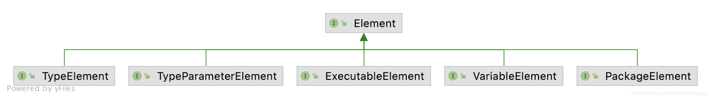
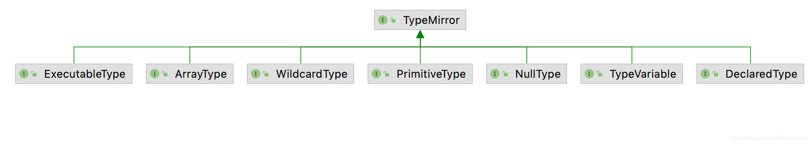

# 注解

## 分类

按运行机制分：通过@Retention注解进行分类

> - 源码注解：只在源码中存在。RetentionPolicy.SOURCE，编译为class字节码之后丢失
> - 编译时注解：在class中依然存在，RetentionPolicy.CLASS。
> - 运行时注解：运行阶段可见，RetentionPolicy.RUNTIME。

按来源分：

> - JDK自带注解
>   - 内置注解：如@Override，@Deprecated、@SurpressWarnings等
>   - 元注解：用于修饰其他注解
>     * @Retention：注解作用域（可见性、保留策略），分为SOURCE、CLASS（默认策略）、RUNTIME
>     * @Target：注解作用对象，未指定时可以作用在任何元素上。可以传入数组，如`@Target({TYPE, Field, ...})`
>     * @Document：可以使用javadoc工具生成文档
>     * @Inherited：父类使用了@Inherited修饰的注解，子类也会继承该注解。
>       * 接口使用了@Inherited修饰的注解，实现类不会继承该注解
>       * 父类方法使用了@Inherited修饰的注解，子类不会继承该注解
>     * @Repeatable：JDK1.8之后引入。表示一个注解可以在一个元素上使用多次
> - 三方注解：三方库提供的注解。如Hibernate，Struts，ButterKnife，ARouter等
> - 自定义注解

## 定义

同class、interface一样，注解也是一种类型。

使用@interface关键字定义，不支持继承其他注解或接口，会自动继承Annotation接口。示例如下

```java
@Documented //声明可被javadoc生成文档
@Retention(RetentionPolicy.RUNTIME) //声明作用域
@Target(value={CONSTRUCTOR, FIELD, LOCAL_VARIABLE, METHOD, PACKAGE, PARAMETER, TYPE}) //声明可修饰对象
public @interface MyAnnotation {
  //注解参数，支持数据类型：基本数据类型、String类型、Class类型、enum类型、Annotation类型，以及相应的数组类型
  String[] value() default {};//可以定义默认值
}
```

## 用途

1. IDE检测和提示编码错误或警告
2. 编译时处理：通过APT检测注解，生成代码、文档等（注解作用域：SOURCE、CLASS）。会增加代码量
3. 运行时处理：反射解析注解，反射修改变量、调用方法等（注解作用域：RUNTIME）。会影响性能

需要注意的是：**注解本身没有作用，只是一个标签，需要编写代码来提取和处理注解信息，简称APT（Annotation Processing Tool，注解处理器）**

## 实例

1. JUnit
2. Android Annotations：配合IDE和Lint工作
   1. 防止代码混淆：@Keep
   2. 检查资源类型：@ColorRes
   3. 参数是否可空：@Nullable、@NonNull
   4. 指定方法需要在特定线程执行：@UiThread、@MainThread、@WorkThread、@BinderThread
   5. 限定取值范围：@IntRange、@Size（数组或集合大小）
   6. 权限检查：@RequiresPermission
   7. 使用@IntDef或@StringDef替代枚举：见下例。
3. ButterKnife：高版本AGP（Android Gradle Plugin）生成的R文件不再是常量。可以添加ButterKnife提供的插件，生成R2资源id解决。
4. Dagger
5. DataBinding
6. EventBus3
7. DBFlow
8. Retrofit
9. ...

### 使用@IntDef或@StringDef替代枚举

**一般我们使用枚举来限制取值，但是枚举最终会生成对象，比常量占用更多内存**。

源码中如View的`VISIBLE/INVISIBLE/GONE、FOCUSABLE/NOT_FOCUSABLE`

```java
public class MainActivity extends Activity {
  	//1. 定义可用常量
    public static final int SUNDAY = 0;
    public static final int MONDAY = 1;
    //{...省略部分}

  	//2. 定义注解，使用@IntDef限制可用常量
    @IntDef({SUNDAY, MONDAY, TUESDAY, WEDNESDAY, THURSDAY, FRIDAY, SATURDAY})
    @Retention(RetentionPolicy.SOURCE)
    public @interface WeekDays {
    }
		//3. 限制变量、参数、返回值等为@WeekDays定义的常量。否则编译器会报错
    @WeekDays
    int currentDay = SUNDAY;

    public void setCurrentDay(@WeekDays int currentDay) {
        this.currentDay = currentDay;
    }

    @WeekDays
    public int getCurrentDay() {
        return currentDay;
    }
}
```

# 运行时注解实现findViewById功能

避免写大量的`findViewById`代码

```java
//1. 自定义注解
@Target(ElementType.FIELD)
@Retention(RetentionPolicy.RUNTIME)
@interface ViewInject {
    int value();
}
//2. 运行时注入注解
class ViewInjectUtil {
    static void injectViews(Activity activity) {
        Class<? extends Activity> activityCls = activity.getClass(); // 获取activity的Class
        Field[] fields = activityCls.getDeclaredFields(); // 通过Class获取activity的所有字段
        for (Field field : fields) { // 遍历所有字段
            // 获取字段的注解，如果没有ViewInject注解，则返回null
            ViewInject viewInject = field.getAnnotation(ViewInject.class);
            if (viewInject == null) continue;
            int viewId = viewInject.value(); // 获取字段注解的参数，这就是我们传进去控件Id
            if (viewId == -1) continue;
            try {
                // 获取类中的findViewById方法，参数为int
                Method method = activityCls.getMethod("findViewById", int.class);
                // 执行findViewById方法，返回View实例
                Object resView = method.invoke(activity, viewId);
                field.setAccessible(true);
                // 给变量赋值
                field.set(activity, resView);
            } catch (NoSuchMethodException | IllegalAccessException | InvocationTargetException e) {
                e.printStackTrace();
            }
        }
    }
}
//3. Activity中调用，解析注解给变量赋值
public class ViewInjectActivity extends AppCompatActivity {
    @ViewInject(R.id.viewInjectBtn1)
    private Button mBtn1;

    @ViewInject(R.id.viewInjectBtn2)
    private Button mBtn2;

    @Override
    protected void onCreate(Bundle savedInstanceState) {
        super.onCreate(savedInstanceState);
        setContentView(R.layout.activity_view_inject);
        //运行时反射解析注解，给变量赋值
        ViewInjectUtil.injectViews(this);
    }
}
```

# APT介绍

APT是javac的一个工具，可以在编译时扫描和处理注解，并生成java文件，参与编译。

原理：编译前端过程中javac进行词法分析和语法分析之后会生成**抽象语法树（AST）**，然后调用注解处理器（注解处理器相当于javac对外提供的插件），可以在这个阶段生成新的java文件，或者**直接修改抽象语法树**

> * 编译前端：指Java源文件编译成class文件。
> * 编译后端：class文件转为本地机器码
>
> 详情见[编程语言、编译器和Android虚拟机](/2021/11/05/basic-2021-11-05-程序语言/)

APT特点：

1. 需要自定义APT处理器
2. 需要手动拼接代理的代码：可以使用[JavaPoet](https://github.com/square/javapoet)，调用API生成java源代码。如果是Kotlin，可以使用Kotlin Poet
4. 需要使用者手动调用代理类执行，或者通过门面对象，反射找到代理类并执行。如`ButterKnife.bind(this)`
4. 会生成大量代理类，导致类和方法数增多
5. 无法直接在源文件中插入代码，而是生成代理类。

> 其实也可以通过`tools.jar`库中的API（如JCTree、TreeMaker）直接操作抽象语法树，插入代码。
>
> 需要添加依赖包：`compileOnly files(org.gradle.internal.jvm.Jvm.current().getToolsJar())`
>
> 可以参考[Java Pluginable Annotation processing](https://fanmingyi.blog.csdn.net/article/details/113766921)

代表框架：DataBinding、Dagger2、ButterKnife、EventBus3、DBFlow

KAPT：Kotlin注解处理器。kotlin代码生成Java AST，然后交给javac APT处理注解。生成Kotlin代码无法再被Kotlin编译器编译。（不同版本KAPT原理有一些差异）

**下面介绍APT涉及到的相关知识点，内容较多，可以先跳到后面看[自定义APT步骤](#自定义APT步骤)，再回过头来看细节**

## AbstractProcessor介绍

自定义注解处理器需要继承`AbstractProcessor`，有几个关键的方法，如下

1. `init`：用于初始化变量
2. `process`：最核心的方法，用于执行注解解析逻辑、生成文件。
3. `getSupportedAnnotationTypes`：返回需要被处理的注解的**完整类型名**，其他注解会被过滤掉
4. `getSupportedOptions`：返回注解处理器可以接收的参数。使用注解处理器的时候可以传入对应的参数值。
5. `getSupportedSourceVersion`：返回支持的JDK版本

其中`getSupportedAnnotationTypes`除了可以用返回值的方式指定之外，还可以用注解声明。`AbstractProcessor`中重写了该方法，反射解析对应的注解`@SupportedAnnotationTypes`，拿到注解的值然后返回。`getSupportedOptions`和`getSupportedSourceVersion`同理。

> Tips：简单的可以使用注解指定，传入完整的类型名。多个注解的时候还是通过代码返回列表，不容易出错，而且路径改变的时候可以跟着一起改。

## 注解处理器传入参数

1. 例如配置`@SupportedOptions("content")`
2. 使用注解处理器的时候，传入参数，gradle配置如下：

```groovy
android {
    defaultConfig {
        // 在gradle文件中配置选项参数值（用于APT传参接收）
        javaCompileOptions {
            annotationProcessorOptions {
                arguments = [content: 'Hello World']
            }
        }
    }
}
```

3. 在注解处理器代码中通过`processingEnvironment.getOptions().get("content");`拿到参数使用

## 常用类和API

参考[注解处理器常用类说明](https://fanmingyi.blog.csdn.net/article/details/116274271)

### `Element`

位于`javax.lang.model.element.Element`

Java文件是有规范和格式的，源代码有对应的结构体，主要包含以下几种元素（类似于XML文件中的DOM树）：



1. `PackageElement:`表示包。提供对有关包及其成员的信息的访问
2.  `TypeElement:`表示类或接口程序元素。提供对有关类型及其成员的信息的访问。
3.  `ExecutableElement:`表示某个类或接口的方法、构造方法或初始化程序
4.  `VariableElement:`表示字段、enum常量、方法或构造方法参数、局部变量或异常参数
5. `TypeParameterElement`：表示泛型

```java
package com.afauria.sample.apt; //PackageElement

public class Main { //TypeElement
  private String test = ""; //VariableElement
  
  void main() { //ExecuteableElement
  }
  // 泛型：TypeParameterElement
}
```

常用API：

| 函数名              | 作用                                                         |
| ------------------- | ------------------------------------------------------------ |
| accept              | 访问者模式，传入`ElementVisitor`。用于访问该元素下的所有元素。根据元素类型进行访问 |
| getEnclosedElements | 获取该元素的所有**直接**子元素                               |
| getEnclosingElement | 获取该元素的父元素                                           |
| getKind             | 返回ElementKind枚举，例如VariableElement可以表示字段、参数等，通过ElementKind可以判断元素具体类型 |
| getSimpleName       | 返回元素名字，如变量名，类名                                 |
| getQualifiedName    | 获取全名                                                     |
| getModifiers        | 获取修饰符集合`Set<Modifier>`，如public、native、synchronized等 |
| getParameters       | 获取方法参数列表List<? extends VariableElement>              |
| getReturnType       | 获取方法返回值                                               |
| asType              | 返回对应的TypeMirror                                         |

### `TypeMirror`

位于`javax.lang.model.type.TypeMirror`

`Element`只能表示Java文件结构，不能获取具体的Java类型，需要使用`TypeMirror`相关的类



常用API：

| 函数名  | 作用                                                |
| ------- | --------------------------------------------------- |
| accpet  | 访问者模式，传入`TypeVisitor`。根据子类类型进行访问 |
| getKind | 返回具体类型。如boolean、String等                   |

### 辅助类

1. `javax.lang.model.util.Elements`：用于操作Element，可以通过`processingEnvironment.getElementUtils();`获取
2. `javax.lang.model.util.getType`：用于操作TyoeMirror，可以通过`processingEnvironment.getTypeUtils();`获取
3. `javax.annotation.processing.Messager`：用于输出信息，可以通过`processingEnvironment.getMessager();`获取，打印error并不会中断process执行，但是会导致编译失败，无法执行下一个Task。
4. `javax.annotation.processing.Filer`：用于生成文件，可以通过`processingEnvironment.getFiler();`获取。新生成的文件分为三类，会被放到不同路径
   1. `createSourceFile`：源代码文件
   2. `createClassFile`：类文件
   3. `createResource`：资源文件

## 注册JavaSPI服务配置文件

APT是如何找到我们自定义的`Processor`注解并执行的呢？

> 使用了JavaSPI（Service Provider Interface，服务发现接口）机制。关于JavaSPI机制可以阅读[另一篇文章](/2021/12/06/architecture-2021-12-06-SPI/)

APT运行的时候加载Processor接口，通过`ServiceLoader`读取services下的服务配置文件，找到Processor接口的实现类（可以有多个），**遍历**初始化和执行多个注解处理器。（类似于`AndroidManifest`注册组件）

有两种注册方式，如下：

### 手动创建service文件

main目录下面新建`resources/META_INF/services/javax.annotation.processing.Processor`文件，在文件中写入完整的自定义注解处理器类名（配置多个注解处理器的时候需要换行）。如下

```
butterknife.compiler.ButterKnifeProcessor
```

### 使用AutoService库生成service文件

原理：通过APT解析`@AutoSerivce`自动生成文件。

1. 添加依赖包和对应的注解处理器

```groovy
dependencies {
    compileOnly "com.google.auto.service:auto-service-annotations:1.0" //添加注解依赖包
    annotationProcessor "com.google.auto.service:auto-service:1.0" //添加注解处理器，使用compileOnly可以下载AutoService源码查看
}
```

2. 使用`@AutoService(Processor.class)`，即可自动生成SPI文件，如下

```java
//使用Google提供的@AutoService注解
//自动生成/META_INF/services/javax.annotation.processing.Processor文件，并打包进jar包中
@AutoService(Processor.class)
public final class AptProcessor extends AbstractProcessor {
}
```

**【踩坑】：低版本`gradle`直接`compileOnly`依赖即可，会自动应用`annotationProcessor`，高版本`gradle`需要单独使用`annotationProcessor`配置注解处理器。**

## 增量注解处理器

具体可以参考[官方文档](https://docs.gradle.org/current/userguide/java_plugin.html#sec:incremental_compile)、[Gradle编译时注解增量教程](https://blog.csdn.net/qfanmingyiq/article/details/116300913)

* 全量编译：改动一个注解会删除之前已经生成过的文件，再重新生成新的文件，效率较低。
* 增量注解：从`Gradle 4.7`开始,`gradle`提供了增量`apt`,可以使上层开发者更快的编译。

### 增量注解处理器类型

1. isolating注解处理器：最快的增量注解处理器。一个注解处理器只处理一个注解
2. aggregationg注解处理器：可以处理多个注解。注解的Retention必须是`CLASS` or `RUNTIME`
3. dynamic注解处理器：重写`AbstractProcessor.getSupportedOptions`函数，在执行APT的时候根据自身情况决定使用哪一种增量注解处理器类型

配置方式如下：

### 手动配置

新建`resources/META-INF/gradle/incremental.annotation.processors`文件，在文件中写入注解处理器全称和增量注解处理器类型。如下：

```
com.afauria.sample.apt_processor.AptProcessor,DYNAMIC
```

### 使用`incap-processor`自动生成

原理：通过APT解析`@IncrementalAnnotationProcessor`自动生成文件，类似`AutoService`库。

1. 添加依赖包和对应的注解处理器

```groovy
dependencies {
    compileOnly "net.ltgt.gradle.incap:incap:0.2" //添加依赖包
    annotationProcessor "net.ltgt.gradle.incap:incap-processor:0.2" //添加注解处理器
}
```

2. 使用`@IncrementalAnnotationProcessor`注解配置增量类型，如下

```java
@IncrementalAnnotationProcessor(IncrementalAnnotationProcessorType.DYNAMIC)
public class AptProcessor extends AbstractProcessor {
}
```

## 应用注解处理器

定义好注解处理器之后，如何使用呢？

1. Gradle2.2之前，需要先依赖三方插件`apply plugin: 'com.neenbedankt.android-apt'`，在`dependencies`中添加`apt project(':xxx-processor')`
2. Gradle2.2之后，Gradle内置了了APT工具，直接在dependencies中添加`annotationProcessor project(':xxx-processor')`
3. kotlin中先依赖插件`apply plugin: 'kotlin-kapt'`，dependencies中添加`kapt project(':xxx-processor')`

 # 自定义APT步骤

上面介绍了APT涉及到的知识点，比较零散，简单串联一下整个过程：

1. 创建一个**Java Module**，用于定义注解，如`xxx-annotation`
1. 创建一个**Android Module**，用于封装API接口，供使用者调用，如`xxx-library`，依赖`xxx-annotation`
2. 编写注解处理器代码
   1. 创建一个**Java Module**：如`xxx-processor`、`xxx-compiler`，依赖`xxx-annotation`
   2. 定义`XXProcessor`类，继承自`AbstractProcessor`
   3. 重写`getSupportedAnnotationTypes`方法，返回要被检测的注解
   4. 重写`process`方法解析注解，生成对应的文件，有几种方式：
      1. 手动拼接源代码
      2. 定义模版java文件，通过关键字匹配替换
      3. 使用JavaPoet，调用JavaAPI生成，可以自动缩进、导入import包，不容易出错
3. 注册注解处理器：JavaSPI机制
4. 注册增量注解处理器类型
5. 应用注解处理器：`annotationProcessor "xxx-processor"`
5. 使用者依赖`xxx-library`
6. 源代码中使用注解
7. 编译时扫描注解，生成代理类
8. 调用生成的代理类方法，或者通过`xxx-library`中的门面对象，反射找到代理类并执行。

流程图就不画了，可以参考[ButterKnife解析](/2021/12/09/android-2021-12-09-ButterKnife/#工作流程)

为什么需要分三个module？

> `xxx-processor`只有编译时会用到，打包的时候不需要依赖，使用`compileOnly`即可，因此和`xxx-library`分开。
>
> `xxx-annotation`会被其他两个模块使用，因此单独抽一个module处理
>
> `xxx-library`：主要封装API供外部调用。也可以不定义该模块，使用自定义注解+注解处理器，生成代理类之后，直接调用代理类方法

# 自定义APT示例

代码上传至[仓库](https://github.com/Afauria/AOPSample)

## 确认目标功能和生成的类信息

先确认下我们的目标功能，调用方代码如下

```java
//使用@AptBindRes找到资源，使用@AptBindView找到View，使用AptOnClick设置点击事件监听
public class AptActivity extends AppCompatActivity {
    @AptBindRes(R.string.app_name)
    String text1;
    @AptBindView(R.id.aptBtn1)
    Button btn1;
    @AptOnClick
    void onBtn1Click() {
        Log.e("AptActivity", "onBtn1Click: " + text1);
    }
    @Override
    protected void onCreate(Bundle savedInstanceState) {
        super.onCreate(savedInstanceState);
        setContentView(R.layout.activity_apt);
        //方式一：调用生成的类完成视图绑定、资源查找、事件绑定等功能
        new AptActivity_ViewBinding(this);
        //方式二：封装API接口，供调用方使用
        //AptBinder.bind(this);
    }
}
```

以`AptActivity`为例，需要生成的类如下

```java
public final class AptActivity_ViewBinding {
    public void AptActivity_ViewBinding(final AptActivity target) {
        target.text1 = target.getString(R.string.app_name);
        target.btn1 = target.findViewById(R.id.aptBtn1);
        //target.btn1.setOnClickListener，这个地方想拿到变量设置监听器较麻烦，因此直接再find一次View
        target.findViewById(R.id.aptBtn1).setOnClickListener(new View.OnClickListener() {
            @Override
            public void onClick(View v) {
                target.onBtn1Click();
            }
        });
    }
}
```

## 编写代码

1. 首先创建`java-library`，名为`apt-annotation`，用于自定义注解`@AptBindRes、@AptBindView、@AptOnClick`

```java
//资源绑定注解
@Retention(RetentionPolicy.SOURCE)
@Target(ElementType.FIELD)
public @interface AptBindString {
    int value();
}
//视图绑定注解
@Retention(RetentionPolicy.SOURCE)
@Target(ElementType.FIELD)
public @interface AptBindView {
    int value();
}
//事件绑定注解
@Retention(RetentionPolicy.SOURCE)
@Target(ElementType.METHOD)
public @interface AptOnClick {
    int value();
}
```

2. 创建`java-library`，名为`apt-processor`，用于自定义注解处理器`AptProcessor`。配置依赖如下

```groovy
dependencies {
    implementation project(":apt-annotation")	//依赖自定义注解包
  	compileOnly "com.squareup:javapoet:1.12.1"	//使用JavaAPI方式生成Java代码
    compileOnly "com.google.auto.service:auto-service-annotations:1.0"	//配置服务接口实现类
    annotationProcessor "com.google.auto.service:auto-service:1.0"	//生成SPI服务接口文件
    compileOnly "net.ltgt.gradle.incap:incap:0.2"	//配置增量注解处理器类型
    annotationProcessor "net.ltgt.gradle.incap:incap-processor:0.2"	//生成增量注解处理器类型文件
}
```

3. 自定义注解处理器：

```java
//1. 配置`@AutoService`自动生成服务接口配置文件
@AutoService(Processor.class)
//2. 配置`@IncrementalAnnotationProcessor`自动生成增量编译配置文件
@IncrementalAnnotationProcessor(IncrementalAnnotationProcessorType.DYNAMIC)
public class AptProcessor extends AbstractProcessor {
    private Filer mFiler;
    private Messager mMessager;
    private Elements mElements;
    //3. 初始化辅助类
    @Override
    public synchronized void init(ProcessingEnvironment processingEnvironment) {
        super.init(processingEnvironment);
        mFiler = processingEnvironment.getFiler();
        mMessager = processingEnvironment.getMessager();
        mElements = processingEnvironment.getElementUtils();
    }
    //4. 返回需要处理的自定义注解类型名
    @Override
    public Set<String> getSupportedAnnotationTypes() {
        Set<String> types = new LinkedHashSet<>();
        types.add(AptBindView.class.getCanonicalName());
        types.add(AptBindString.class.getCanonicalName());
        types.add(AptOnClick.class.getCanonicalName());
        return types;
    }
  	//5. 封装一个error类方便打印错误信息
    private void error(Element element, String msg) {
        mMessager.printMessage(Diagnostic.Kind.ERROR, msg, element);
    }
}
```

4. 定义一个`builderMap`，用于保存需要生成的类的信息，并拼接Java源代码。每解析一个元素，放到对应的类信息中。

```java
//按类生成文件，一个类可能包含多个注解，因此新建一个Map，保存类和对应的类信息
//生成类需要的信息包括：包名、类名、资源绑定、视图绑定、事件绑定等信息
//定义一个FileBuilder类保存，等到所有注解解析完毕之后，再统一生成文件
Map<TypeElement, FileBuilder> builderMap = new HashMap<>();
//获取缓存的类信息，如果没有则新建
private FileBuilder getOrCreateBuilder(TypeElement element) {
    FileBuilder builder = builderMap.get(element);
    if (builder == null) {
        builder = new FileBuilder(element);
        builderMap.put(element, builder);
    }
    return builder;
}
class FileBuilder {
    //省略getter、setter、add代码，直接操作成员变量
    TypeElement mTypeElement;
    String mPackageName;
    String mClassName;
    //保存资源绑定的信息：如变量名、资源id
    List<BindResourceInfo> mBindingResources = new ArrayList<>();
    //保存视图绑定的信息：如变量名，viewId
    List<BindViewInfo> mBindingViews = new ArrayList<>();
    //保存事件绑定的信息：如方法名，viewId
    List<BindMethodInfo> mBindingMethods = new ArrayList<>();
    public FileBuilder(TypeElement typeElement, Elements elementsUtil) {
        mTypeElement = typeElement;
        mPackageName = elementsUtil.getPackageOf(typeElement).toString();
        mClassName = typeElement.getSimpleName() + "_ViewBinding";
    }
    //拼接Java类代码
  	public String generateJavaCode() {
        StringBuilder sb = new StringBuilder();
        //添加包名
        sb.append("package ").append(mPackageName).append(";\n");
        sb.append("\nimport android.view.View;\n");
        //添加类定义
        sb.append("\npublic class ").append(mClassName).append(" {\n");
        //添加构造方法
        sb.append("\tpublic ").append(mClassName).append("(final ").append(mTypeElement.getSimpleName()).append(" target) {\n");
        //遍历添加资源绑定代码
        for (BindResourceInfo bindResourceInfo : mBindingResources) {
            sb.append(bindResourceInfo.bindResourceCode());
        }
        //遍历添加视图绑定代码
        for (BindViewInfo bindViewInfo : mBindingViews) {
            sb.append(bindViewInfo.bindViewCode());
        }
        //遍历添加事件绑定代码
        for (BindMethodInfo bindMethodInfo : mBindingMethods) {
            sb.append(bindMethodInfo.bindMethodCode());
        }
        sb.append("\t}\n");
        sb.append("}\n");
        return sb.toString();
    }
}
//kotlin可以直接使用data class，java代码确实有点长
//省略构造方法
class BindResourceInfo {
    int resId;
    String fieldName;
    //拼接资源绑定的代码
    public String bindResourceCode() {
        return String.format("\t\ttarget.%s = target.getString(%s);\n", fieldName, resId);
    }
}
class BindViewInfo {
    int resId;
    String fieldName;
    //拼接视图绑定的代码
    public String bindViewCode() {
        return String.format("\t\ttarget.%s = target.findViewById(%s);\n", fieldName, resId);
    }
}
class BindMethodInfo {
    int resId;
    String methodName;
    //拼接设置监听器的代码
    public String bindMethodCode() {
        StringBuilder sb = new StringBuilder();
        sb.append("\t\ttarget.findViewById(").append(resId).append(").setOnClickListener(new View.OnClickListener() {\n");
        sb.append("\t\t\tpublic void onClick(View view) {\n");
        sb.append("\t\t\t\ttarget.").append(methodName).append(";\n");
        sb.append("\t\t\t}\n");
        sb.append("\t\t});\n");
        return sb.toString();
    }
}
```

5. 重写`process`方法，解析和处理注解，将需要的信息填入`Builder`中

```java
@Override
public boolean process(Set<? extends TypeElement> set, RoundEnvironment roundEnvironment) {
    //每次执行清空下buildMap，避免下个round重复创建文件
    builderMap.clear();
    if (set.isEmpty()) {
        return false;
    }
    //解析@AptBindString注解，并加入到对应的FileBuilder中
    findAndParseBindingResources(roundEnvironment);
    //解析@AptBindView注解，并加入到对应的FileBuilder中
    findAndParseBindingView(roundEnvironment);
    //解析@AptOnClick注解，并加入到对应的FileBuilder中
    findAndParseBindingMethod(roundEnvironment);
    for (FileBuilder fileBuilder : builderMap.values()) {
        try {
          	//方式一：使用拼接源代码方式生成Java文件
            generateJavaFile(fileBuilder);
            //方式二：使用JavaPoet生成Java文件
            //fileBuilder.generateJavaFileByPoet().writeTo(mFiler);
        } catch (IOException e) {
            //使用Messager打印日志，打印error并不会中断process执行，但是会导致编译失败
            error(fileBuilder.mTypeElement, String.format("Unable to write ViewBinding for type %s: %s", fileBuilder.mTypeElement, e.getMessage()));
        }
    }
    return true;
}
private void generateJavaFile(FileBuilder fileBuilder) throws IOException {
    //创建Java源文件对象，完整类名
    JavaFileObject javaFileObject = mFiler.createSourceFile(fileBuilder.mPackageName + "." + fileBuilder.mClassName);
    //根据存储的信息拼接Java代码
    String code = fileBuilder.generateJavaCode();
    Writer writer = javaFileObject.openWriter();
    //写入文件
    writer.write(code);
    writer.flush();
    writer.close();
}
```

6. 贴一下解析`@AptBindString`的代码，视图绑定和事件绑定类似

```java
private void findAndParseBindingResources(RoundEnvironment env) {
    //获取所有被@BindString注解的元素
    Set<? extends Element> s = env.getElementsAnnotatedWith(AptBindString.class);
    for (Element element : s) {
        //获取注解的值
        int resId = element.getAnnotation(AptBindString.class).value();
        //获取Field变量名称
        final String name = element.getSimpleName().toString();
        //获取父元素
        TypeElement parentElement = (TypeElement) element.getEnclosingElement();
        //获取缓存的生成类信息
        FileBuilder builder = getOrCreateBuilder(parentElement);
        //构造资源绑定信息，加入对应的FileBuilder中
        builder.mBindingResources.add(new BindResourceInfo(resId, name));
    }
}
```

## 使用JavaPoet

第4步拼接Java源代码也可以通过调用JavaPoet API来生成，上面`build.gradle`已经添加依赖包。最终生成的结果就不贴了，和上面目标一致。

直接贴代码：

```java
public JavaFile generateJavaFileByPoet() {
    //定义构造方法
    MethodSpec.Builder constructor = MethodSpec.constructorBuilder()
            .addModifiers(Modifier.PUBLIC)
            .addParameter(TypeName.get(mTypeElement.asType()), "target", Modifier.FINAL);
    //遍历添加资源绑定代码
    for (BindResourceInfo bindResourceInfo : mBindingResources) {
        constructor.addCode(bindResourceInfo.bindResourceCode());
    }
    //遍历添加视图绑定代码
    for (BindViewInfo bindViewInfo : mBindingViews) {
        constructor.addCode(bindViewInfo.bindViewCode());
    }
    //遍历添加事件绑定代码
    for (BindMethodInfo bindMethodInfo : mBindingMethods) {
        //创建OnClickListener匿名内部类
        TypeSpec listener = TypeSpec.anonymousClassBuilder("")
                .addSuperinterface(ClassName.get("android.view", "View", "OnClickListener"))
                .addMethod(MethodSpec.methodBuilder("onClick")
                        .addAnnotation(Override.class)
                        .addModifiers(Modifier.PUBLIC)
                        .returns(TypeName.VOID)
                        .addParameter(ClassName.get("android.view", "View"), "view")
                        .addStatement("target.$N()", bindMethodInfo.methodName)
                        .build())
                .build();
        //添加监听器
        constructor.addStatement("target.findViewById($L).setOnClickListener($L)", bindMethodInfo.resId, listener);
    }
    //定义类
    TypeSpec typeSpec = TypeSpec
            .classBuilder(mClassName)
            .addModifiers(Modifier.PUBLIC)
            .addMethod(constructor.build())
            .build();
    //生成java文件对象
    return JavaFile.builder(mPackageName, typeSpec).build();
}
//取消第5步方式二的注释，使用JavaPoet生成文件
//fileBuilder.generateJavaFileByPoet().writeTo(mFiler);
```

注：

1. `addStatement`会添加缩进、换行、分号结尾。`addCode`直接添加代码，不会添加缩进、换行、分号结尾
2. JavaPoet提供了一些字符串format的占位符，就是代码中的`$L、$N`等，可以查看`CodeBlock`类中的注释说明。列举几个常用的
   1. `$L`：表示字面量，可以是字符串、基础数据类型、代码块等。
   2. `$N`：表示名称，如参数名、字段名、局部变量名、方法名等
   3. `$T`：表示类型，强转或者调用类静态方法、静态属性的时候会用到
   4. `$[`：开始一个语句，会自动添加缩进
   5. `$]`：结束一个语句

> Tips：**字面量**就是指这个量本身，如`String name = "Hello World";`中，` "Hello World"`就是字面量（含引号）。
>
> 可以简单理解为就是`=`号右边的部分

更多JavaPoet API可以参考[官方文档](https://github.com/square/javapoet)

## 封装API接口

上面客户端是直接使用生成的代理类`new AptActivity_ViewBinding(this);`。这么写有几个不足：

1. 需要在build完之后才有代理类，没build之前代码会报红
2. 不同类写法不一致，不好封装基类

因此我们封装一个API接口类，让客户端能够更方便的调用

1. 首先新建一个`Android Module`，如`apt-library`，并依赖自定义注解库`apt-annotation`
2. 直接贴代码，看注释即可

```java
public class AptBinder {
    //绑定Activity
    public static void bind(Activity activity) {
        Class<?> cls = activity.getClass();
        //找到类名
        String clsName = activity.getClass().getName() + "_ViewBinding";
        try {
            //反射加载类
            Class<?> clazz = Class.forName(clsName);
            //反射获取构造函数，并实例化。
            //可以缓存构造函数，避免重复反射
            clazz.getConstructor(cls).newInstance(activity);
        } catch (Exception e) {
            e.printStackTrace();
        }
    }
}
```

3. 客户端依赖`apt-library`，`Activity`中调用`AptBinder.bind(this)`完成绑定

## 可优化

实现的是简化版的自定义注解处理器，有很多可优化的点：

1. 考虑注解不在Activity中（如Fragment、View、Adapter或者普通类中），如何获取资源、绑定视图：需要往生成类中传入context或者view。
2. 添加校验：注解对象或方法非private或static，注解对象父元素`TypeElement`不能是接口或枚举类等
3. 生成释放对象的代码，`unbind`方法
4. `@OnClick`注解绑定多个View解析：注解参数需要使用id数组
5. 监听器回调方法有参数的时候，如何获取并生成？
6. 父类和子类都有注解，如何兼容？
7. 资源id非final类型，如何处理？
8. 在内部类中使用注解，如何处理？
9. 更多资源注解，更多事件注解，如何保存builder类信息，减少重复代码？
10. 增量编译这里没有实际用到
11. ...

# 结语

代码均上传至[仓库](https://github.com/Afauria/AOPSample)

参考资料：

* [Java Pluginable Annotation processing](https://fanmingyi.blog.csdn.net/article/details/113766921)
* [注解处理器常用类说明](https://fanmingyi.blog.csdn.net/article/details/116274271)
* [Gradle编译时注解增量教程](https://blog.csdn.net/qfanmingyiq/article/details/116300913)