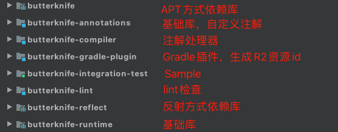
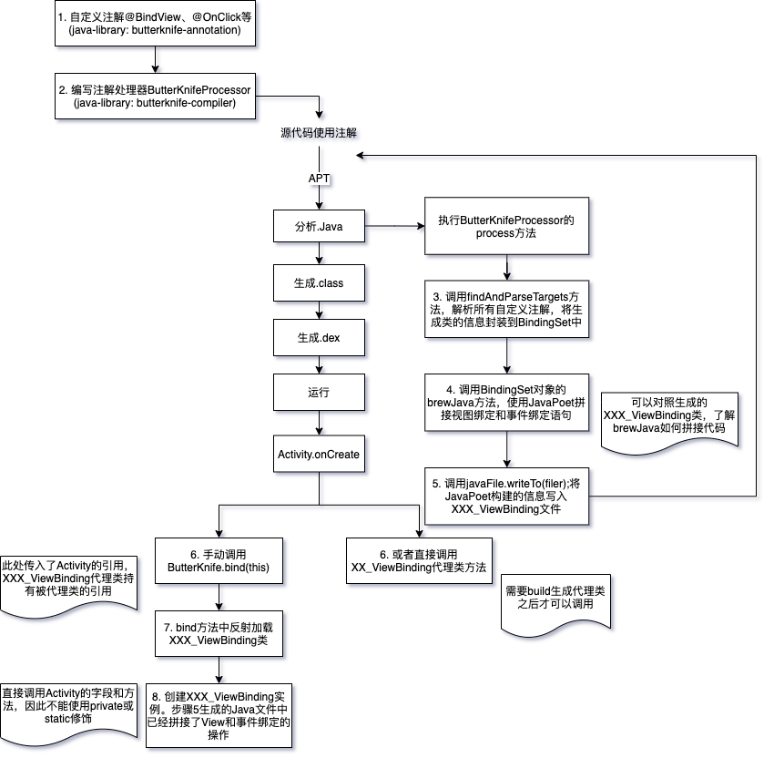

# ButterKnife介绍

## 功能说明

**已经废弃，建议切换至View Binding**

功能：使用源码注解+APT生成模版代码，进行Android视图变量和事件绑定。简化代码，提高可读性，编译时注解不会影响APP效率。

- 视图绑定：成员变量使用`@BindView`注解避免调用`findViewById`。
- 资源绑定：字段上使用`@BindString、@BindColor、@BindDrawable`等注解，避免资源查找。
- 事件绑定：方法使用`@OnClick、onTextChanged`等注解，避免绑定监听器、创建匿名内部类。
- 绑定视图数组或列表，批量执行Action行为。`ViewCollections.run`

> 运行时反射解析注解赋值，影响性能。（注解使用RUNTIME）
>
> 使用编译时注解+APT生成模版代码，运行时调用`ButterKnife.bind(...)`注入字段。（注解使用CLASS）
>
> 由于编译时处理注解较耗时，调试效率低。因此提供了两种实现，调试阶段可以使用反射，发布阶段使用编译时注解。（注解使用RUNTIME）

项目结构如下：



## 基本使用

```groovy
android {
  // Butterknife requires Java 8.
  compileOptions {
    sourceCompatibility JavaVersion.VERSION_1_8
    targetCompatibility JavaVersion.VERSION_1_8
  }
}

dependencies {
  implementation 'com.jakewharton:butterknife:10.2.3' //添加注解依赖
  annotationProcessor 'com.jakewharton:butterknife-compiler:10.2.3' //添加注解处理器
}
```

```java
public class ButterknifeActivity extends AppCompatActivity {
    //字段不能是private或者static。否则编译会报错: @BindView fields must not be private or static.
    @BindView(R.id.btn1)
    public Button button1;

    @Override
    protected void onCreate(Bundle savedInstanceState) {
        super.onCreate(savedInstanceState);
        setContentView(R.layout.activity_butterknife);
        //绑定activity
        ButterKnife.bind(this);
        button1.setText("I am a button ");
    }
}
```

## 注意事项

1. bind必须在setContentView之后
2. 父类bind后，子类不需要再bind
3. Fragment中使用需要传入rootView、onDestroyView中需要unbind
4. 高版本AGP需要使用R2引用资源id
5. View不能使用private或static修饰，否则编译会报错

## 工作流程



1. 自定义注解和注解处理器
2. 使用注解
3. 编译时`butterknife-gradle-plugin`根据R文件生成R2文件
4. 执行`butterknife-compile`APT，解析注解
5. 使用JavaPoet生成XXX_ViewBinding类
6. 运行时调用`ButterKnife.bind(...)`。**需要使用者手动调用代理类执行，或者通过门面对象，反射找到代理类并执行**
7. 反射实例化SimpleActivity_ViewBinding类
8. 在构造方法中完成对Activity的View的绑定。

# ButterKnife源码解析

只分析View绑定部分，以Activity为例。（只保留关键代码，先源码太长，可以直接看小结部分）。

## 注入原理

1. 首先看下我们使用ButterKnife的代码

```java
public class SimpleActivity extends Activity {
  //绑定视图
  @BindView(R.id.hello) Button hello;
  //绑定监听器
  @OnClick(R.id.hello) void sayHello() {
    Toast.makeText(this, "Hello, views!", LENGTH_SHORT).show();
  }

  @Override protected void onCreate(Bundle savedInstanceState) {
    super.onCreate(savedInstanceState);
    setContentView(R.layout.simple_activity);
    //进行绑定和字段注入
    ButterKnife.bind(this);
  }
}
```

2. 查看`ButterKnife.bind(this)`源码，此方法有很多重载方法，区分不同目标类，如Activity、Fragment等

```java
public final class ButterKnife {
  @NonNull @UiThread
  public static Unbinder bind(@NonNull Activity target) {
    View sourceView = target.getWindow().getDecorView();
    //构造并返回XXX_ViewBinding实例，用于主动调用unbind解除绑定
    return bind(target, sourceView);
  }
  
  @NonNull @UiThread
  public static Unbinder bind(@NonNull Object target, @NonNull View source) {
    Class<?> targetClass = target.getClass();
    //根据Activity查找对应的ViewBinding类构造方法
    Constructor<? extends Unbinder> constructor = findBindingConstructorForClass(targetClass);
 	  //实例化ViewBinding类，完成View绑定
    return constructor.newInstance(target, source);
    //省略异常处理...
  }
}
```

3. `findBindingConstructorForClass`：查找对应的`XXX_ViewBinding`类构造方法

```java
public final class ButterKnife { 
  @Nullable @CheckResult @UiThread
  private static Constructor<? extends Unbinder> findBindingConstructorForClass(Class<?> cls) {
    Constructor<? extends Unbinder> bindingCtor = BINDINGS.get(cls);
    //首先在缓存中查找，避免重复反射loadClass，查找构造方法
    if (bindingCtor != null || BINDINGS.containsKey(cls)) {
      return bindingCtor;
    }
    String clsName = cls.getName();
    //避免查找父类找到Android源码类
    if (clsName.startsWith("android.") || clsName.startsWith("java.") || clsName.startsWith("androidx.")) {
      return null;
    }
    try {
      //拼接类名，loadClass加载类对象
      Class<?> bindingClass = cls.getClassLoader().loadClass(clsName + "_ViewBinding");
      //反射获取到XXX_ViewBinding构造方法
      bindingCtor = (Constructor<? extends Unbinder>) bindingClass.getConstructor(cls, View.class);
    } catch (ClassNotFoundException e) {
      //查找父类
      bindingCtor = findBindingConstructorForClass(cls.getSuperclass());
    } 
    //省略异常处理...
    //缓存构造函数
    //此处不是缓存ViewBinding实例，而是缓存构造方法，下次进入需要重新创建实例。
    //由于ViewBinding会持有Activity对象，如果缓存实例，会导致无法释放
    BINDINGS.put(cls, bindingCtor);
    return bindingCtor;
  }
}
```

4. 查看`XXX_ViewBinding`源码，位于`build/generated/source/apt/`之下

```java
public class SimpleActivity_ViewBinding implements Unbinder {
  //持有目标类引用
  private SimpleActivity target;

  private View view7f08001e;
  //重载构造方法
  @UiThread
  public SimpleActivity_ViewBinding(SimpleActivity target) {
    this(target, target.getWindow().getDecorView());
  }
  //如果需要绑定监听器，target需要声明为final，供匿名内部类使用
  @UiThread
  public SimpleActivity_ViewBinding(final SimpleActivity target, View source) {
    this.target = target;

	  //findViewById并强制转换，注入Activity field，变量不能使用private或static，否则无法访问
    View view;
    view = Utils.findRequiredView(source, R.id.hello, "field 'hello' and method 'sayHello'");
    target.hello = Utils.castView(view, R.id.hello, "field 'hello'", Button.class);
    view7f08001e = view;
    //使用DebouncingOnClickListener，内部实现了防抖
    view.setOnClickListener(new DebouncingOnClickListener() {
      @Override
      public void doClick(View p0) {
        target.sayHello();
      }
    });
  }
  //外部主动调用，解除绑定，如fragment onDestroyView中调用
  @Override
  @CallSuper
  public void unbind() {
    SimpleActivity target = this.target;
    if (target == null) throw new IllegalStateException("Bindings already cleared.");
    this.target = null;
    target.hello = null;
    view7f08001e.setOnClickListener(null);
    view7f08001e = null;
  }
}
```

**小结一下：**

1. 调用`ButterKnife.bind`
2. 拼接类名，使用ClassLoader加载`XXX_ViewBinding`类并缓存构造方法。（**此处不是缓存ViewBinding实例，而是缓存构造方法，下次进入需要重新创建实例。由于ViewBinding会持有Activity对象，如果缓存实例，会导致无法释放**）
3. 反射创建实例
4. 在构造方法中访问rootView查找View，访问Activity对象给字段赋值，或者添加监听器。并对@OnClick事件绑定做了防抖
4. 返回Unbinder对象，供调用方主动解绑

## 注解解析步骤

上面解释了依赖注入原理，下面看看`XXX_ViewBinding`是如何生成的？

查看 `butterknife-compiler` 下的`ButterKnifeProcessor`类

1. 注解处理器均需要继承`AbstractProcessor`，`init`方法做初始化工作，`getSupportedAnnotationTypes`筛选需要处理的注解，`process`方法开始注解处理

```java
public final class ButterKnifeProcessor extends AbstractProcessor{
  @Override public synchronized void init(ProcessingEnvironment env) {
    //主要对辅助类进行初始化
  }
  //筛选需要处理的注解类型，也可通过@SupportedAnnotationTypes注解过滤
  @Override public Set<String> getSupportedAnnotationTypes() {
    Set<String> types = new LinkedHashSet<>();
    for (Class<? extends Annotation> annotation : getSupportedAnnotations()) {
      types.add(annotation.getCanonicalName());
    }
    return types;
  }
  //开始处理注解
  @Override public boolean process(Set<? extends TypeElement> elements, RoundEnvironment env) {
    //TypeElement表示一个类或接口，BindingSet包含需要生成的类的所有信息，用于生成java文件对象
    Map<TypeElement, BindingSet> bindingMap = findAndParseTargets(env);
    //遍历生成java文件 
    for (Map.Entry<TypeElement, BindingSet> entry : bindingMap.entrySet()) {
      TypeElement typeElement = entry.getKey();
      BindingSet binding = entry.getValue();
      //利用JavaPoet生成java文件对象，即XXX_ViewBinding.java
      JavaFile javaFile = binding.brewJava(sdk, debuggable);
      try {
        //写入文件
        javaFile.writeTo(filer);
      } catch (IOException e) {
        //使用processingEnv.getMessager()打印编译日志
        error(typeElement, "Unable to write binding for type %s: %s", typeElement, e.getMessage());
      }
    }
    return false;
  }
}
```

2. `findAndParseTargets`方法：查找并解析目标注解，构建需要生成的类信息，存入Map。

```java
public final class ButterKnifeProcessor extends AbstractProcessor {
  private Map<TypeElement, BindingSet> findAndParseTargets(RoundEnvironment env) {
    //key为类，值为需要绑定的成员变量或方法集合
    Map<TypeElement, BindingSet.Builder> builderMap = new LinkedHashMap<>();
    Set<TypeElement> erasedTargetNames = new LinkedHashSet<>();
    //省略其他注解处理...
    
    // 找到所有@BindView注解的元素
    for (Element element : env.getElementsAnnotatedWith(BindView.class)) {
      try {
        //解析注解和成员变量信息，加入到对应类的builder中
        parseBindView(element, builderMap, erasedTargetNames);
      } catch (Exception e) {
        logParsingError(element, BindView.class, e);
      }
    }
    //省略遍历查找父类binder...
    return bindingMap;
  }
}
```

3. `parseBindView`方法：解析`@BindView`注解的元素，存入对应类的`BindingSet.Builder`中

```java
public final class ButterKnifeProcessor extends AbstractProcessor {
  private void parseBindView(Element element, Map<TypeElement, BindingSet.Builder> builderMap,
      Set<TypeElement> erasedTargetNames) {
    //获取Field的父元素，即类，如Activity、Fragment、ViewHolder等
    TypeElement enclosingElement = (TypeElement) element.getEnclosingElement();

    //检查元素是否可达：
    //1. 字段不能为private或static，父元素为类、且类不能为private
    //2. 类不属于Android源码包
    boolean hasError = isInaccessibleViaGeneratedCode(BindView.class, "fields", element)
        || isBindingInWrongPackage(BindView.class, element);
    
    //省略检查元素是否继承自View...
    
    if (hasError) {
      return;
    }

    // 获取注解值，即View的id
    int id = element.getAnnotation(BindView.class).value();
    BindingSet.Builder builder = builderMap.get(enclosingElement);
    //解析为Id，通过Trees访问抽象语法树，保存id的值和对应的代码，如R.id.btn
    Id resourceId = elementToId(element, BindView.class, id);
    if (builder != null) {
      String existingBindingName = builder.findExistingBindingName(resourceId);
      //该资源id已经被绑定过了，直接返回
      if (existingBindingName != null) {
        error(element, "Attempt to use @%s for an already bound ID %d on '%s'. (%s.%s)",
            BindView.class.getSimpleName(), id, existingBindingName,
            enclosingElement.getQualifiedName(), element.getSimpleName());
        return;
      }
    } else {
      //如果已经有对应类的builder，则直接返回。没有的话就新建一个builder，加入到map中。
      builder = getOrCreateBindingBuilder(builderMap, enclosingElement);
    }
    //变量名称
    String name = simpleName.toString();
    //变量类型
    TypeName type = TypeName.get(elementType);
    //变量是否有@Nullable注解
    boolean required = isFieldRequired(element);
    //builder中添加需要绑定的field信息
    builder.addField(resourceId, new FieldViewBinding(name, type, required));
    // Add the type-erased version to the valid binding targets set.
    erasedTargetNames.add(enclosingElement);
  }
}
```

4. `BindingSet.newBuilder`方法：构建类基本信息

```java
final class BindingSet implements BindingInformationProvider {
  //...
  static Builder newBuilder(TypeElement enclosingElement) {
    TypeMirror typeMirror = enclosingElement.asType();

    boolean isView = isSubtypeOfType(typeMirror, VIEW_TYPE);
    boolean isActivity = isSubtypeOfType(typeMirror, ACTIVITY_TYPE);
    boolean isDialog = isSubtypeOfType(typeMirror, DIALOG_TYPE);

    TypeName targetType = TypeName.get(typeMirror);
    //如果是泛型，则使用真实类型
    if (targetType instanceof ParameterizedTypeName) {
      targetType = ((ParameterizedTypeName) targetType).rawType;
    }
    //生成JavaPoet类名对象
    ClassName bindingClassName = getBindingClassName(enclosingElement);
    
    boolean isFinal = enclosingElement.getModifiers().contains(Modifier.FINAL);
    return new Builder(targetType, bindingClassName, enclosingElement, isFinal, isView, isActivity,
        isDialog);
  }
  //得到XXX_ViewBinding类名
  static ClassName getBindingClassName(TypeElement typeElement) {
    String packageName = getPackage(typeElement).getQualifiedName().toString();
    //如果为内部类，如Adapter.ViewHolder，会返回Adapter$ViewHolder_ViewBinding
    String className = typeElement.getQualifiedName().toString().substring(
            packageName.length() + 1).replace('.', '$');
    return ClassName.get(packageName, className + "_ViewBinding");
  }
}
```

## JavaPoet生成Java文件对象

这一部分简单了解一下即可，挑一部分讲，具体API使用可以看[官方文档](https://github.com/square/javapoet)。

1. `binding.brewJava`方法：下面代码主要是使用`JavaPoet`生成Java文件对象

```java
final class BindingSet implements BindingInformationProvider {
  JavaFile brewJava(int sdk, boolean debuggable) {
    TypeSpec bindingConfiguration = createType(sdk, debuggable);
    //生成JavaPoet文件对象
    return JavaFile.builder(bindingClassName.packageName(), bindingConfiguration)
        .addFileComment("Generated code from Butter Knife. Do not modify!")
        .build();
  }
  //创建类型
  private TypeSpec createType(int sdk, boolean debuggable) {
    //TypeSpec用于生成类或接口。除此之外还有MethodSpec等
    TypeSpec.Builder result = TypeSpec.classBuilder(bindingClassName.simpleName())
        .addModifiers(PUBLIC)
        .addOriginatingElement(enclosingElement);
    if (isFinal) {
      //添加final修饰符
      result.addModifiers(FINAL);
    }

    if (parentBinding != null) {
      //extends父类
      result.superclass(parentBinding.getBindingClassName());
    } else {
      //implement UnBinder接口
      result.addSuperinterface(UNBINDER);
    }
    //添加target字段，即Activity对象，需要给target的成员变量赋值
    if (hasTargetField()) {
      result.addField(targetTypeName, "target", PRIVATE);
    }
    //根据类型生成不同的重载构造函数
    if (isView) {
      result.addMethod(createBindingConstructorForView());
    } else if (isActivity) {
      result.addMethod(createBindingConstructorForActivity());
    } else if (isDialog) {
      result.addMethod(createBindingConstructorForDialog());
    }
    if (!constructorNeedsView()) {
      // Add a delegating constructor with a target type + view signature for reflective use.
      result.addMethod(createBindingViewDelegateConstructor());
    }
    //添加构造函数
    result.addMethod(createBindingConstructor(sdk, debuggable));
    //重写unbind方法
    if (hasViewBindings() || parentBinding == null) {
      result.addMethod(createBindingUnbindMethod(result));
    }

    return result.build();
  }
}
```

2. `createBindingConstructor`方法：生成`XXX_ViewBinding`类的构造函数

```java
final class BindingSet implements BindingInformationProvider {
  private MethodSpec createBindingConstructor(int sdk, boolean debuggable) {
    //使用MethodSpec生成方法
    MethodSpec.Builder constructor = MethodSpec.constructorBuilder()
        .addAnnotation(UI_THREAD)
        .addModifiers(PUBLIC);
    //添加target参数
    if (hasMethodBindings()) {
      //需要绑定事件监听，则target要声明为final，因为匿名内部类会引用
      constructor.addParameter(targetTypeName, "target", FINAL);
    } else {
      constructor.addParameter(targetTypeName, "target");
    }
    //添加source参数
    if (constructorNeedsView()) {
      constructor.addParameter(VIEW, "source");
    } else {
      constructor.addParameter(CONTEXT, "context");
    }
    //省略添加SuppressWarnings注解代码...
    //如果有父类，需要调用父类构造方法
    if (parentBinding != null) {
      if (parentBinding.constructorNeedsView()) {
        constructor.addStatement("super(target, source)");
      } else if (constructorNeedsView()) {
        constructor.addStatement("super(target, source.getContext())");
      } else {
        constructor.addStatement("super(target, context)");
      }
      constructor.addCode("\n");
    }
    //给target字段赋值
    if (hasTargetField()) {
      constructor.addStatement("this.target = target");
      constructor.addCode("\n");
    }
    //绑定视图
    if (hasViewBindings()) {
      if (hasViewLocal()) {
        // Local variable in which all views will be temporarily stored.
        constructor.addStatement("$T view", VIEW);
      }
      //遍历添加视图绑定
      for (ViewBinding binding : viewBindings) {
        addViewBinding(constructor, binding, debuggable);
      }
      for (FieldCollectionViewBinding binding : collectionBindings) {
        constructor.addStatement("$L", binding.render(debuggable));
      }

      if (!resourceBindings.isEmpty()) {
        constructor.addCode("\n");
      }
    }
    //绑定资源
    if (!resourceBindings.isEmpty()) {
      if (constructorNeedsView()) {
        constructor.addStatement("$T context = source.getContext()", CONTEXT);
      }
      if (hasResourceBindingsNeedingResource(sdk)) {
        constructor.addStatement("$T res = context.getResources()", RESOURCES);
      }
      for (ResourceBinding binding : resourceBindings) {
        constructor.addStatement("$L", binding.render(sdk));
      }
    }
    return constructor.build();
  }
}
```

3. `addViewBinding`方法：添加视图绑定代码

```java
final class BindingSet implements BindingInformationProvider {
  private void addViewBinding(MethodSpec.Builder result, ViewBinding binding, boolean debuggable) {
    if (binding.isSingleFieldBinding()) {
      // 如果只需要绑定字段，则直接查找View，并给target的字段赋值
      //省略添加findViewById代码块...
      return;
    }
    //findViewById，并保存为局部变量
    List<MemberViewBinding> requiredBindings = binding.getRequiredBindings();
    if (!debuggable || requiredBindings.isEmpty()) {
      result.addStatement("view = source.findViewById($L)", binding.getId().code);
    } else if (!binding.isBoundToRoot()) {
      result.addStatement("view = $T.findRequiredView(source, $L, $S)", UTILS,
          binding.getId().code, asHumanDescription(requiredBindings));
    }
    //给target的字段赋值，并进行强制转换
    addFieldBinding(result, binding, debuggable);
    //绑定监听器，并调用target中注解的方法
    addMethodBindings(result, binding, debuggable);
  }
}
```

**小结一下：**

1. 通过继承`AbstractProcessor`定义注解处理器，重写`getSupportedAnnotationTypes()`方法筛选需要处理的注解，重写`process`方法处理注解。
2. 使用`javax.lang.model`包下的类来解析Java代码。自定义解析规则，如
   1. 找到所有注解过的元素
   2. 解析元素：变量类型、变量名，变量修饰符，注解类型，注解值等
   3. 检查元素合法性：如是否为private或static、是否继承自View、是否是成员变量等
   4. ...
3. 自定义`BindingSet`类保存需要生成的`ViewBinding`类的信息。
4. 使用`JavaPoet`库的API生成Java文件对象。
5. 最后使用`Filer`类写入文件。

## APT如何找到自定义注解处理器？

APT是如何找到自定义的`ButterKnifeProcessor`注解处理器并执行的呢？

> 使用了JavaSPI（Service Provider Interface，服务发现接口）机制。关于JavaSPI机制可以阅读[另一篇文章](/2021/12/06/architecture-2021-12-06-SPI/)

原理：APT运行的时候加载Processor接口，通过`ServiceLoader`读取services文件夹下的服务文件，找到Processor接口的实现类（可以有多个），遍历初始化和执行多个注解处理器。（类似于`AndroidManifest`注册组件）

具体介绍和配置可以参考[APT介绍和实践](/2021/12/08/tech-2021-12-08-APT/)

## 增量注解处理器

注意到`ButterKnife`中还依赖了一个`incap`的库，并且使用了它的注解`@IncrementalAnnotationProcessor(IncrementalAnnotationProcessorType.DYNAMIC)`。

> Gradle支持配置增量注解处理器，通过在`main`目录下新建`resources/META-INF/gradle/incremental.annotation.processors`文件进行配置
>
> 这个库实际上就是通过注解+APT自动帮我们生成了配置文件

具体介绍和可以参考[APT介绍和实践](/2021/12/08/tech-2021-12-08-APT/)

# Android视图绑定历程

## findViewById

原始方式，需要在Activity、Fragment中编写大量重复代码

## ButterKnife

**已经被宣布废弃**。

通过源码注解+APT方式生成XXX_ViewBinding类，并在onCreate调用`ButterKnife.bind(...)`注入字段。

ButterKnife存在问题：高版本AGP（Android Gradle Plugin）生成的R文件不再是常量（模块化中可能和三方库产生id冲突），而编译时注解要求在编译期就确定值。因此在Library模块中会编译失败。

可以添加ButterKnife提供的插件，生成R2资源id解决。

```groovy
//1. 根目录 build.gradle引入插件
buildscript {
  dependencies {
    classpath 'com.jakewharton:butterknife-gradle-plugin:10.2.3'
  }
}
//2. library模块build.gradle应用插件
apply plugin: 'com.android.library'
apply plugin: 'com.jakewharton.butterknife' //生成R2资源id
//3. 代码中使用R2替代R引用资源id
```

## KAE（Kotlin Android Extensions）

**已经被宣布废弃**。

使用方式：`build.gradle`添加插件即可`apply plugin: 'kotlin-android-extensions'`

原理：通过Gradle插件生成findViewById代码，并使用HashMap缓存控件。

反编译成java代码如下

```java
public final class MainActivity extends AppCompatActivity {
   private HashMap _$_findViewCache;

   protected void onCreate(@Nullable Bundle savedInstanceState) {
      super.onCreate(savedInstanceState);
      this.setContentView(1300023);
      TextView var10000 = (TextView)this._$_findCachedViewById(id.textView);
      var10000.setText((CharSequence)"Hello");
   }

   public View _$_findCachedViewById(int var1) {
      if (this._$_findViewCache == null) {
         this._$_findViewCache = new HashMap();
      }
      View var2 = (View)this._$_findViewCache.get(var1);
      if (var2 == null) {
         var2 = this.findViewById(var1);
         this._$_findViewCache.put(var1, var2);
      }
      return var2;
   }
}
```

存在问题：

- 类型安全：res下的任何id都可以被访问，有可能因访问了非当前Layout下的id而出错，难以利用lint等静态代码校验
- 空安全：运行时可能出现NPE
- 兼容性：只能在kotlin中使用，java不友好
- 局限性：不能跨module使用
- `RecyclerView.Adapter onBindiViewHolder`中直接使用，会生成findViewById代码，丧失ViewHolder复用优势

## ViewBinding

[官方文档](https://developer.android.com/topic/libraries/view-binding)。内置Gradle插件，根据layout布局文件生成XXXBinding类。

与findViewById相比：ViewBinding能保证**空安全、类型安全**。

与DataBinding相比：ViewBinding更轻量，但不支持布局变量和布局表达式，不支持数据绑定

使用方式如下：

1. 启动ViewBinding功能

```groovy
//Android Studio3.6以上，按模块启用build.gradle配置
android {
	viewBinding {
		enabled = true
	}
}
```

2. 编写layout布局文件，build生成Binding类。如果想忽略布局文件，可以添加属性`tools:viewBindingIgnore="true"`
3. 代码中使用

```kotlin
public class MainFragment extends Fragment {
    //需要build之后才能生成Binding类
    private ResultProfileBinding binding;
    @Override
    public View onCreateView(LayoutInflater inflater, ViewGroup container, Bundle savedInstanceState) {
        binding = ResultProfileBinding.inflate(inflater, container, false);
        View view = binding.getRoot();
        return view;
    }

    @Override
    public void onDestroyView() {
        super.onDestroyView();
      	//在Fragment中使用，onDestroyView的时候需要释放binding对象。
        binding = null;
    }
}
```

## 未来？

响应式布局。

最好的视图绑定就是不需要findViewById

