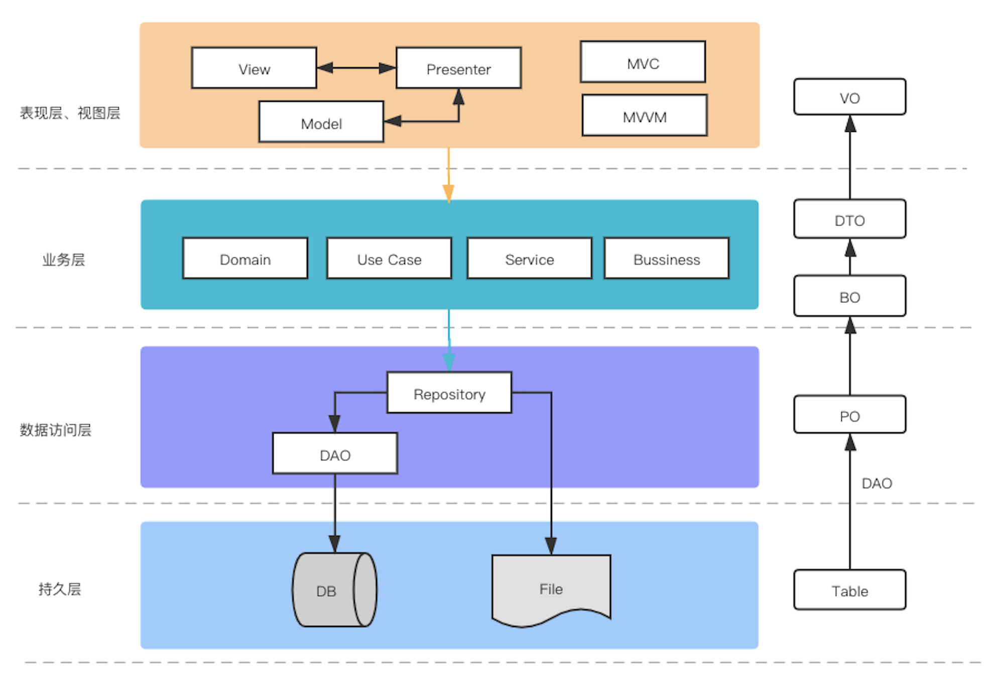

# 三层架构

## 表示层、业务层、数据访问层

1. 表示层（User Interface Layer，UI）：也叫视图层，视图层常用架构如MVC、MVP、MVVM等，可以有自己的数据对象
2. 业务层（Business Logic Layer，BLL）：包含业务逻辑，数据对象等，有不同的叫法如Domain、Use Case、Service、Bussiness
3. 数据访问层（Data Access Layer，DAL）：封装数据访问逻辑。
4. 持久层（Persistent Layer）：数据物理存储空间，有时候会指代数据访问层。实际不属于三层架构。

> Tips：从上往下表示代码调用顺序，从下往上表示数据传输顺序
>
> 理解为抽屉结构，框架不变，可以随时抽取替换某一层实现

三层架构中各层通信通过接口，不依赖具体实现，符合依赖倒置原则

> Tips：依赖倒置原则（DIP）：高层模块不应该依赖低层模块，两者都依赖于抽象，抽象不应该依赖细节，细节应该依赖抽象。——面向接口

依赖倒置的理解：

1. 倒置的是顺序，不是对象：正常情况下，业务层依赖数据层，我们要写业务层之前要先写数据层，数据层修改，业务层要跟着修改。倒置之后可以先写好业务层，再去实现数据层。
2. 依赖关系倒置：原先A直接依赖B，现在A依赖接口，B再实现接口。B不再被A依赖，B反过来依赖接口

## 概念解释

### PO、BO、DTO、VO、POJO、DAO

* PO（Persistent Object）：持久对象，数据库中的字段ORM映射，一个PO就是一条数据库记录。可能包含主键、时间戳等信息
* BO（Bussiness Object）：业务对象，某个领域内的实体，可以包含业务逻辑。可能由多个PO组成，通常需要把BO转换成PO才能进行数据的持久化
* DO（Domain Object）：领域对象，类似BO
* DTO（Data Transfer Object）：数据传输对象，BO抽取组装而成，一般用于跨进程或者网络数据传输。
* VO（View Object）：视图对象，对应页面上显示的数据。DTO抽取组装而成，例如接口返回通用数据，某个页面只需要特定字段，需要转换成视图对象，一般出现在使用三方接口的情况。
* DAO（Data Access Object）：数据访问对象，封装对数据库的访问
* Entity：接近原始数据
* Model：接近业务对象
* POJO（Plain Ordinary Java Object）：简单Java对象。上面的对象其实都是Java对象，是POJO在不同架构层级或者不同场景中的体现

**根据业务复杂度进行删减**，如客户端中一般直接使用后台返回DTO作为视图对象、持久对象

### 架构模式和设计模式

* 架构模式：软件架构设计中的模式，如分层架构模式、MVC架构模式、ORM映射等
* 设计模式：具体代码实现的模式

一般来说：框架 > 架构模式 > 设计模式 > 设计原则

参考《企业应用架构模式》

## 提问

### 三层架构与MVC

> 两者有一定联系，不完全相同。
>
> 三层架构符合依赖倒置原则，面向接口编程，上层调用下层接口，下层定义抽象接口，上层负责实现细节，下层业务逻辑执行完后回调抽象接口。
>
> MVC常用于表现层的的架构模式，MVC三个模块之间没有层级关系。
>
> 在业务较简单的情况下，Controller可以取代业务层逻辑，Model可以取代数据访问层功能，看起来MVC就是三层架构

### 持久层属不属于三层架构？

> 不属于。
>
> * 三层架构属于逻辑层面的分层，持久层是物理上的分层。
> * 三层架构是代码层面的，持久层不在代码逻辑中

### 为什么要有数据访问层，业务层直接获取数据？

> 当有多个数据源的时候，业务层直接获取看起来比较乱，因此抽一层专门获取数据

### 三层架构中每一层都定义Model对象（UserModel、User、UserEntity），并且提供对应的Mapper，是否有必要？

> 复杂的设计可以通过增加中间层来简化，反过来一样，如果设计很简单，那压根就不需要中间层。自己要掌握这个度。
>
> 每一层的数据传递都有对象的丰富和隐藏，用不同的Model对象指代更容易解耦。
>
> 更具体的说主要是因为手机端的use case基本上都是CRUD，Domain层没有发挥太大作用，因此可以删掉Model层，Presenter直接获取业务对象。没有破坏依赖规则。

### 什么是业务逻辑？

[细说业务逻辑](http://www.uml.org.cn/zjjs/201008021.asp)

> * 狭义：三层架构中的业务层（Domain），Clean架构中的Use Case层
> * 广义：软件产品=界面和交互+业务逻辑，非界面和交互部分，数据也属于业务。某些业务为数据操作集中型，因此抽取出数据访问层。
> * 从空间上讲，数据属于业务的一部分。
> * 从时间上讲，先有业务，再有数据对象。
> * 一个APP可以没有数据，如计算器等，但不能没有业务逻辑。

由于大部分业务只是简单的CRUD，因此业务逻辑层看起来只是简单的封装了一下数据访问层的操作，尤其在客户端业务层被无限弱化。

# 总结

**架构层次取决于业务复杂度**

在C/S、B/S软件中，表示层指的客户端（前端）、业务层和数据访问层在服务端，随着客户端功能的增多，客户端也可以抽取业务层和数据访问层。

传统Web应用中，使用动态网页技术，例如PHP、JSP等，表示层也在服务端，即View模版，后来做了前后端分离。

# 结语

参考文章：

* [Clean架构探讨](https://blog.csdn.net/u014644594/article/details/87858315)
* [细说业务逻辑](http://www.uml.org.cn/zjjs/201008021.asp)
* 《企业应用架构模式》-Martin Flower.

> Tips：Martin Flower.：敏捷开发提出者。著有《重构》和《企业应用架构模式》等书

