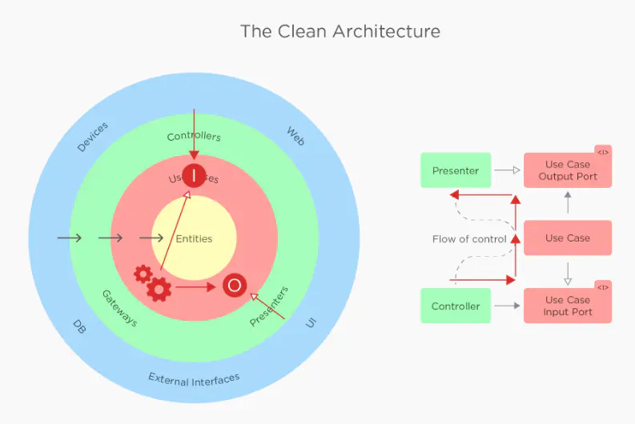
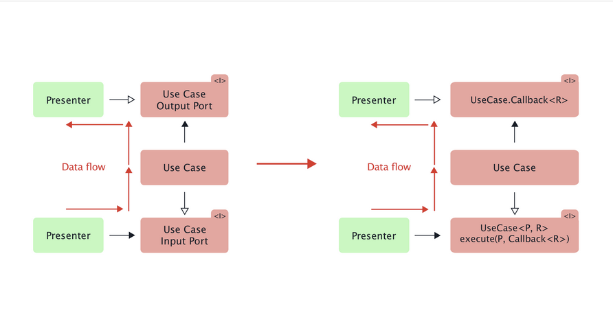
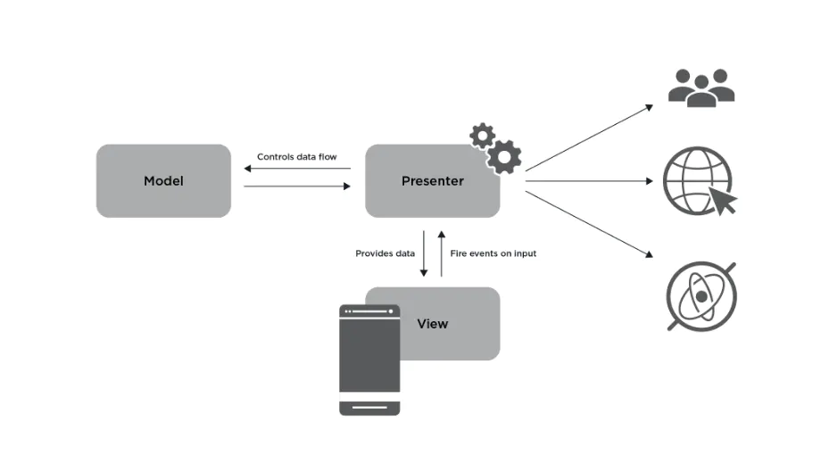
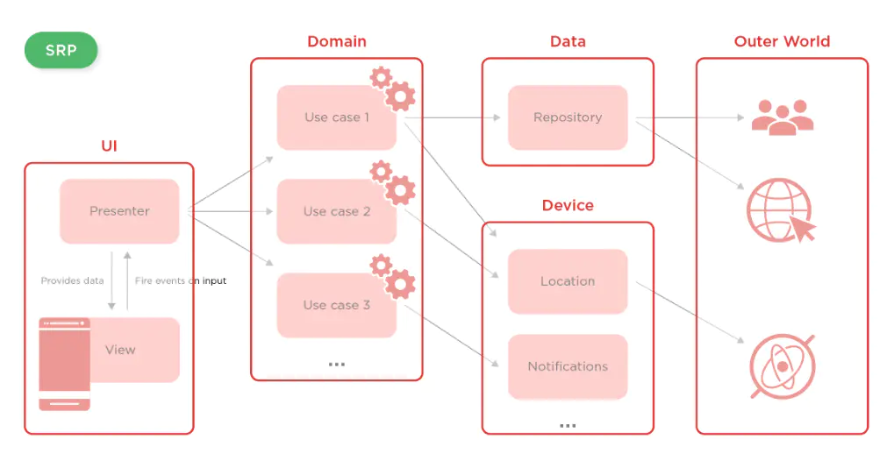

# Clean架构



## 层级解释

1. 框架和驱动层：一般由一些框架和工具组成，如UI、DB、Web、Device，包含具体实现，可以随时替换。
2. 接口适配层：如Presenter、Controller、ViewModel等，用于数据转换。
3. UseCase：用例、业务逻辑。纯Java，不依赖Android
4. Entity：业务对象

>  Tips：
>
> * Flow of control：数据流向
> * Gateways：架构模式中的入口模式，用于封装访问外部资源接口，方便替换测试资源。如数据源为DB、XML、JSON等

入口模式和外观模式区别？

> 设计思想是一样的，都是屏蔽细节，符合迪米特原则（最少知道）。
>
> 外观模式一般由服务内部提供，入口模式由调用方自行封装。
>
> Gateway、Repository主要针对数据访问，可以说是外观模式的一种应用。

入口模式和仓储模式（Repository）区别？

> 相同点：都是对业务逻辑屏蔽数据获取细节，方便替换测试数据。

## 依赖规则

外层依赖内层，内层不能依赖外层：指外层定义的函数、变量、类不能被内层引用。

抽象：外层是具体实现，可以随时替换，越往内抽象层次越高，内层不知道外层实现细节

## 层间通信



Presenter调用UseCase，传入Callback，UseCase调用Repository接口获取数据，通过Callback返回数据。伪代码：

```kotlin
class UserPresenter implements UseCase.Callback<User> {
    fun getUser() {
        mUserUseCase.getUser(userId, this);
    }
    override fun onCallback(result : User) {
        println(result);
    }
}
class UserUseCase {
    private val mRepository: IUserRepository
    fun getUser(userId : String, callback : UseCase.Callback<User>) {
        mRepository.getUser(userId, callback);
    }
}
interface IUserRepository {
	fun getUser(userId : String, callback : UseCase.Callback<User>);
}
class UserRepositoryImpl implements IUserRepository {
    fun getUser(userId : String, callback : UseCase.Callback<User>) {
        mService.getUser(userId, callback);
    }
}
```

**注：Callback可以通过异步框架替换，见[异步概念和常见实现](/2021/07/15/basic-2021-07-15-异步概念和常见实现/)**

## 提问

### UseCase调用外层获取数据是否破坏了依赖规则？

> 可以通过依赖倒置原则解决：内层定义接口，外层实现接口。内层业务逻辑制定抽象规则，不关心外层实现。

Presenter调用View刷新页面同理：Presenter层定义IView接口，View层实现。获取到数据之后Presenter层调用IView接口刷新数据

### Clean架构只需要四层吗？

> 可以根据实际情况增删，只要满足依赖规则

### 数据对象如何跨越边界？

> 各层可能有自己定义的数据对象：如DB的数据对象为数据库行，Presenter数据对象为Model
>
> 跨边界传递数据时，应该使用内层的数据对象，在外层进行数据Mapper。避免内层依赖外层数据对象，违背依赖规则。

### Clean和MVP

Clean比MVP多了一层Domain业务层，一般适用于大型项目，业务较复杂的情况。




### 什么是业务逻辑？

[细说业务逻辑](http://www.uml.org.cn/zjjs/201008021.asp)

> * 狭义：三层架构中的业务层（Domain），Clean架构中的Use Case层
> * 广义：软件产品=界面和交互+业务逻辑，非界面和交互部分，数据也属于业务。某些业务为数据操作集中型，因此抽取出数据访问层。
> * 从空间上讲，数据属于业务的一部分。
> * 从时间上讲，先有业务，再有数据对象。
> * 一个APP可以没有数据，如计算器等，但不能没有业务逻辑。

由于大部分业务只是简单的CRUD，因此业务逻辑层看起来只是简单的封装了一下数据访问层的操作，尤其在客户端业务层被无限弱化。

## 总结

### 架构设计目标

* 框架无关：不依赖于外层框架，如UseCase不需要模拟器、数据库也可以运行
* 外部类库无关：不依赖于三方库功能
* 可测试性：每个模块可以独立测试。
* UI无关：系统可以任意更换UI，不需要更改业务逻辑
* 数据源无关：可以修改任意数据来源，如Web、文件、不同数据库

### Clean架构优缺点

优点：

- 业务逻辑易于测试
- 漏洞更容易被隔离
- 易于功能扩展和添加
- 代码更易读和可维护
- 单向依赖、数据驱动编程

缺点

- 结构复杂
- 粒度太细
- Usecase 的复用率极低
- 急剧的增加类和重复代码

# 结语

参考文章：

* [Clean架构探讨](https://blog.csdn.net/u014644594/article/details/87858315)
* [细说业务逻辑](http://www.uml.org.cn/zjjs/201008021.asp)

> Tips: Robert C. Martin：被称为Uncle Bob，Clean架构提出者，著有《代码整洁之道》、《架构整洁之道》等书
