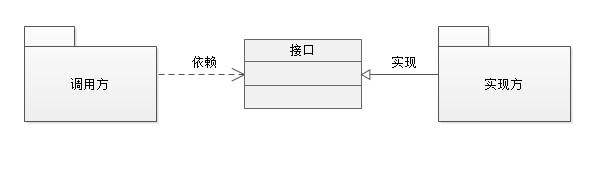
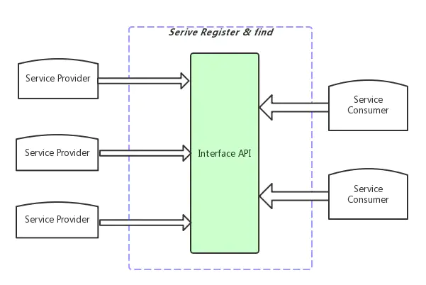
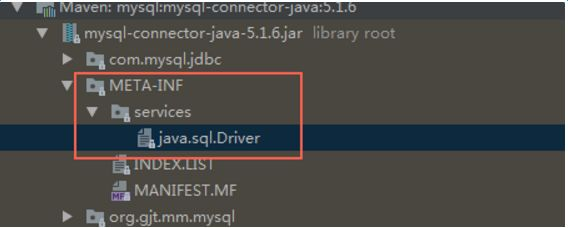

# SPI和API

## 问题1

面向的对象的设计里，提倡模块之间**基于接口编程**。调用方、接口、实现方关系如下



这个时候接口应该在哪定义呢？有三种情况：

1. 接口位于实现方所在的包中：称为API（Application Programming Interface，应用程序接口）。
   1. 调用方直接依赖三方库
   2. 从名字上理解，API是给客户端调用的接口
   3. 从时间上讲，先有实现方和接口，再有调用方，实现方较固定，调用方可变。
   4. 常用于SDK开发，接口由三方库开发者提供，并可能提供了多种实现，调用方只负责使用。（如果调用方能够自己实现功能，何必再使用三方库呢？）
   5. 当然有些框架也会提供SPI接口，调用方有需求的时候也可以自己实现，替换SDK中的实现，如自定义GlideModule。
2. 接口位于调用方所在的包中：称为SPI（Service Provider Interface，服务提供接口）
   1. 插件依赖调用方接口
   2. 从名字上理解，SPI服务接口是给服务端实现的接口
   3. 从时间上讲，先有调用方和接口，再有具体的实现方，实现方可变，调用方较固定
   4. 常用于插件开发，调用方先定义好接口，并写好调用逻辑，由插件实现接口。如自定义注解处理器、插件换肤。
3. 接口位于独立的包中：接口既可以作为API，也可以作为SPI
   1. 在Clean或DDD架构中，业务层对外层提供接口，被表现层或应用层调用（API），同时外层需要实现业务层提供的接口（SPI），被业务驱动。

**注：**

1. 不管是SPI或API，接口都可以组织到独立的包中，真正的区别是由调用方提供还是由实现方提供。
2. SPI和API本质上是一个谁迁就谁的问题：
   1. 使用API，对调用方来说，不同的实现方API接口可能不一致，代码中需要写条件分支判断。（例如代码中同时用了ImageLoader和Glide来加载图片）
   2. 使用SPI，就是由调用方来决定接口行为，不同的实现方都需要遵循这个接口定义。
3. 广义上讲API是**一种提供给外部调用自身的方式**，不单指Java语言中的接口，例如我们常说的Restful API，实际上是网络请求的url
4. 广义上讲SPI是**一种让外部能够按照自己定制的规则实现功能的方式**，不单指Java语言中的接口，也指设计规范

## 问题2

在SPI的情况下，插件需要依赖调用方，调用方也需要依赖插件具体实现（new实例对象）。是否会产生依赖冲突呢，三者的依赖关系应该是怎么样的？

> 从编码上讲会存在依赖冲突，当然这个时候调用方不一定是直接依赖插件，也可以通过动态注册、加载，如自定义ClassLoader、动态链接库等。

## 问题3

抛开依赖冲突的问题，如果接口定义在调用方的包中，插件依赖的时候会把调用方的逻辑也依赖进来，而插件只是负责实现接口而已，这是否有必要呢？

> 有一个原则可以回答这个问题
>
> 依赖倒置：高层模块不依赖底层模块，两者都应该依赖于抽象。抽象不应该依赖具体，具体应该依赖抽象
>
> 实际上就是说把接口（抽象层）抽出来，调用方和实现方都依赖接口，也就是上面的第3种情况。

## 服务发现机制

SPI中调用方提供接口，调用方直接实例化对象，存在问题：

1. 调用方先定义好接口，无法写逻辑，需要等到实现方实现接口之后再来添加逻辑。（当然也可以先定义一个默认的Fake实现类）
2. 如果要替换一种实现，需要修改调用方的代码，不符合可插拔的原则

为了解决上面的问题，让调用方不需要指定具体模块，需要一种服务注册和发现的机制：服务端注册了服务之后，客户端可以找到对应的服务。



服务发现是IoC（Inversion of Control，控制反转）思想的一种实现，将初始化实例的控制权移到了程序之外。

> Tips：IoC主要有两种实现：
>
> - 服务提供模式：从外部服务容器抓取依赖对象
> - 依赖注入：以参数的形式注入依赖对象

控制反转（或服务发现）有以下优势：

- 在外部注入或配置依赖项，因此我们可以重用这些组件。当我们需要修改依赖项的实现时，只需要修改配置文件；
- 可以配置依赖项的模拟实现（Fake），让代码测试更加容易。

# Java SPI机制

JDK6中引入了ServiceLoader，通过配置文件来装载指定的服务。也叫做Java SPI机制（**这里要和上文所说的SPI接口区分开来**）

`ServiceLoader`是Java提供的一种SPI机制，但服务发现机制不是Java特有的

类似地，在Android中，通过Manifest注册组件，让Launcher能够找到应用程序的入口，或者让AMS能够启动应用内的Activity、Service，发送广播等。

> Activity可以看作Android系统提供的SPI，Manifest是一种服务发现机制，应用程序需要按规范继承、注册，以便AMS能够对Activity进行管理。

## 使用方式

1. 客户端定义服务接口
2. 服务端实现该接口
3. 服务端在`META-INF/services`目录下新建一个以服务接口命名的文件，文件内填入该服务接口的具体实现类（完整类名，可以填多个）
4. 客户端使用`ServiceLoader`加载配置文件中的具体实现类并返回实例化对象。存在多个实现类，通过迭代器`iterator`访问

> Tips：这里客户端指接口调用方，服务端指接口实现方

第4步除了使用`ServiceLoader`去加载配置文件外，我们也可以自己读取文件，通过**反射创建实例**。实际上`ServiceLoader`正是帮我们做了这件事

第3步除了手动创建之外，还可以使用`AutoService`库帮我们自动生成文件：通过APT解析`@AutoSerivce`自动生成文件。

1. 添加依赖包和对应的注解处理器

```groovy
dependencies {
    compileOnly "com.google.auto.service:auto-service-annotations:1.0" //添加注解依赖包
    annotationProcessor "com.google.auto.service:auto-service:1.0" //添加注解处理器，使用compileOnly可以下载AutoService源码查看
}
```

2. 使用`@AutoService(Processor.class)`，即可自动生成SPI文件，如下

```java
//使用Google提供的@AutoService注解
//自动生成/META_INF/services/javax.annotation.processing.Processor文件，并打包进jar包中
@AutoService(Processor.class)
public final class AptProcessor extends AbstractProcessor {
}
```

## 原理

1. 首先看`Service.load`源码，返回`ServiceLoader`对象：可以看到这个时候还没加载实现类，一个服务接口对应一个`ServiceLoader`实例。

```java
//ServiceLoader类
//方法1：使用 SystemClassLoader 类加载器
public static <S> ServiceLoader<S> loadInstalled(Class<S> service) {
    ClassLoader cl = ClassLoader.getSystemClassLoader();
    ClassLoader prev = null;
    while (cl != null) {
        prev = cl;
        cl = cl.getParent();
    }
    return ServiceLoader.load(service, prev);
}
//方法2：使用线程上下文类加载器
public static <S> ServiceLoader<S> load(Class<S> service) {
    ClassLoader cl = Thread.currentThread().getContextClassLoader();
    return ServiceLoader.load(service, cl);
}
//方法3：自定义类加载器
public static <S> ServiceLoader<S> load(Class<S> service, ClassLoader loader){
    return new ServiceLoader<>(service, loader);
}
```

2. ServiceLoader构造函数：保存**服务接口的类对象**，并创建了一个`LazyIterator`对象，迭代器中暂时只是保存了`service`类对象和类加载器。

```java
private ServiceLoader(Class<S> var1, ClassLoader var2) {
    this.service = (Class)Objects.requireNonNull(var1, "Service interface cannot be null");
    this.loader = var2 == null ? ClassLoader.getSystemClassLoader() : var2;
    this.acc = System.getSecurityManager() != null ? AccessController.getContext() : null;
    this.reload();
}
public void reload() {
    //清空服务Providers
    this.providers.clear();
    //创建懒加载迭代器
    this.lookupIterator = new ServiceLoader.LazyIterator(this.service, this.loader);
}
```

3. 到这里还没开始加载具体的实现类，继续看迭代器中关键的`nextService`方法：可以看到使用`Class.fromName`反射加载了`nextName`类

```java
private S nextService() {
    if (!this.hasNextService()) {
        throw new NoSuchElementException();
    } else {
        String var1 = this.nextName;
        this.nextName = null;
        Class var2 = null;
        try {
            //反射加载nextName类
            var2 = Class.forName(var1, false, this.loader);
        } catch (ClassNotFoundException var5) {
            ServiceLoader.fail(this.service, "Provider " + var1 + " not found");
        }
        //检查注册的类是不是服务接口的实现类
        if (!this.service.isAssignableFrom(var2)) {
            ServiceLoader.fail(this.service, "Provider " + var1 + " not a subtype");
        }
        try {
            //实例化服务对象，并强制转换成服务接口。调用的是无参构造函数
            Object var3 = this.service.cast(var2.newInstance());
            //缓存接口实现类的实例
            ServiceLoader.this.providers.put(var1, var3);
            return var3;
        } catch (Throwable var4) {
            ServiceLoader.fail(this.service, "Provider " + var1 + " could not be instantiated", var4);
            throw new Error();
        }
    }
}
```

4. `nextName`从哪来的呢，继续看`hasNextService`方法：可以看到读取了`META-INF/services/`下的服务配置文件

```java
private boolean hasNextService() {
    if (this.nextName != null) {
        return true;
    } else {
        if (this.configs == null) {
            try {
                //读取META-INF/services/下的服务配置文件
                String var1 = "META-INF/services/" + this.service.getName();
                if (this.loader == null) {
                    this.configs = ClassLoader.getSystemResources(var1);
                } else {
                    this.configs = this.loader.getResources(var1);
                }
            } catch (IOException var2) {
                ServiceLoader.fail(this.service, "Error locating configuration files", var2);
            }
        }

        while(this.pending == null || !this.pending.hasNext()) {
            if (!this.configs.hasMoreElements()) {
                return false;
            }
            //parse中按行读取配置文件（utf-8编码），并排除已经加载过的服务，返回配置文件中的服务类型名列表
            this.pending = ServiceLoader.this.parse(this.service, (URL)this.configs.nextElement());
        }
        //给nextName赋值为下一个类的类名
        this.nextName = (String)this.pending.next();
        return true;
    }
}
```

5. 继续看`ServiceLoader`的`iterator`方法，对懒加载迭代器进行了包装，首先返回已经实例化过并缓存下来的服务对象。

```java
public Iterator<S> iterator() {
    return new Iterator<S>() {
        Iterator<Entry<String, S>> knownProviders;
        {
            //获取缓存的providers列表
            this.knownProviders = ServiceLoader.this.providers.entrySet().iterator();
        }

        public boolean hasNext() {
            return this.knownProviders.hasNext() ? true : ServiceLoader.this.lookupIterator.hasNext();
        }

        public S next() {
            //首先返回缓存的provider服务对象
            return this.knownProviders.hasNext() ? ((Entry)this.knownProviders.next()).getValue() : ServiceLoader.this.lookupIterator.next();
        }

        public void remove() {
            throw new UnsupportedOperationException();
        }
    };
}
```

总结一下：`ServiceLoader`本质就是实现了一个迭代器，读取`META-INF/services`下的文件，通过ClassLoader加载文件中的接口实现类，放到懒加载迭代器中，访问的时候才加载类并实例化对象。

有几个注意的点：

1. 使用了懒加载创建服务实例
2. 使用`LinkedHashMap`缓存创建过的provider实例
3. 服务实现类必须实现服务接口：`if (!service.isAssignableFrom(c))`；
4. 服务实现类需包含无参的构造器，LazyInterator 是反射创建服务对象的：`S p = service.cast(c.newInstance())`；
5. 配置文件需要使用 UTF-8 编码：`parse`方法中`new BufferedReader(new InputStreamReader(in, "utf-8"))`。
6. 存在多个实现类的时候，并不一定需要全部使用，只能迭代筛选合适的实现类，因此可以尽可能把常用的放到配置文件前面，避免加载不常用的类
7. 服务无法注销remove，只能当没有引用时被GC回收，`ServiceLoader`提供了`reload`方法清除自身的缓存

## 案例

1. JDBC加载不同的数据库驱动，服务接口为`java.sql.Driver`，由不同的数据库驱动要实现该服务接口。

```java
//MySQL实现JDBC服务驱动接口，即Driver类
package com.mysql.jdbc;
public class Driver extends NonRegisteringDriver implements java.sql.Driver {
  public Driver() throws SQLException {
  }
  static {
    try {
      //将自身存入DriverManager
      DriverManager.registerDriver(new Driver());
    } catch (SQLException var1) {
      throw new RuntimeException("Can't register driver!");
    }
  }
}
```

DriverManager源码如下

```java
public class DriverManager {
  //...
  static {
    //初始化所有数据库驱动
    loadInitialDrivers();
    println("JDBC DriverManager initialized");
  }
  private static void loadInitialDrivers() {
    //...
    //使用ServiceLoader加载驱动类
    ServiceLoader var1 = ServiceLoader.load(Driver.class);
    Iterator var2 = var1.iterator();
    //...
  }
  //参数：数据库连接url、账号、密码
  public static Connection getConnection(String var0, String var1, String var2) throws SQLException {
    //...
    //获取数据库Driver对象，调用connect连接并返回
    Iterator var5 = registeredDrivers.iterator();
    while(var5.hasNext()) {
      DriverInfo var6 = (DriverInfo)var5.next();
      if (isDriverAllowed(var6.driver, var3)) {
        try {
          println("    trying " + var6.driver.getClass().getName());
          Connection var7 = var6.driver.connect(var0, var1);
          if (var7 != null) {
            println("getConnection returning " + var6.driver.getClass().getName());
            //找到一个就返回
            return var7;
          }
        }
      }
    }
  }
}
```

可以看到mysql的jdbc驱动包中确实存在服务配置文件



**如果三方数据库驱动没有配置服务文件（例如Oracle数据库），就需要我们自己通过`Class.forName`去加载驱动类了**

2. APT加载不同的注解处理器。服务接口为`javax.annotation.processing.Processor`，由不同的注解处理器实现该服务接口

# 结语

本来是打算介绍JavaSPI机制，放到Java分类下的。但是研究之后发现更应该归属到架构分类。

了解SPI和API区别，有助于我们更好的理解IoC、依赖倒置原则、DDD（Domain Driven Design,领域驱动设计）等。

参考资料：

* [设计原则：小议SPI和API](https://www.cnblogs.com/happyframework/archive/2013/09/17/3325560.html)
* [「Java 路线」| 服务发现框架 ServiceLoader](https://www.jianshu.com/p/a18499b5df1c)
