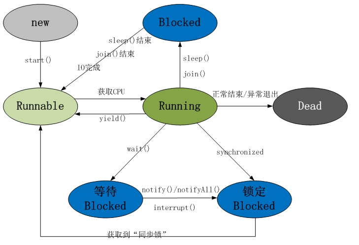

# 1. 进程和线程

进程：一个具有一定独立功能的程序关于某个数据集合的一次运行活动，是系统进行资源分配和调度运行的基本单位

* 正在运行的一个程序（动态的概念，程序是静态的概念）
* 每个进程拥有独立的地址空间
* 同一时刻cpu（单核）只运行一个进程

线程：进程的一个实体，进程的一条执行路径，轻量级的进程

* 一个进程可以拥有多个线程
* 每个线程由独立的栈空间
* 同一进程的多个线程共享内存区域（而进程无法访问其他进程的内存）

# 2. 并行和并发

* 并行是同一时刻做多件事情，并发是同一时间间隔内做多件事情
* 并行是同时做很多事情。并发是一次处理很多事情。
* 并行是同时执行（可能相关的）计算（依靠多核处理）。并发可以是虚拟的同时执行也可以是真的同时执行（有空闲的cpu，轮流占用CPU和各种资源）。

# 3. 进程间通信方式

进程间通信（IPC，Inter-Process Communication）,指多个进程之间相互通信，交换数据的方法。

进程的互斥（mutual exclusion ）是解决进程间竞争关系( **间接制约关系**) 的手段。 进程互斥指若干个进程要使用同一共享资源时，任何时刻最多允许一个进程去使用，其他要使用该资源的进程必须等待，直到占有资源的进程释放该资源。

进程同步指两个以上进程基于某个条件来协调它们的活动。一个进程的执行依赖于另一个协作进程的消息或信号，当一个进程没有得到来自于另一个进程的消息或信号时则需等待，直到消息或信号到达才被唤醒。

进程同步是一种进程通信。进程互斥是一种特殊的同步

## 3.1. 管道( pipe )

管道是一种半双工的通信方式，数据只能单向流动，而且只能在具有亲缘关系的进程间使用。进程的亲缘关系通常是指父子进程关系。

## 3.2. 有名管道 (namedpipe)

有名管道也是半双工的通信方式，但是它允许无亲缘关系进程间的通信。

## 3.3. 信号量(semophore )

信号量是一个计数器，可以用来控制多个进程对共享资源的访问。它常作为一种锁机制，防止某进程正在访问共享资源时，其他进程也访问该资源。因此，主要作为进程间以及同一进程内不同线程之间的同步手段。

**补充**

互斥锁（mutex）：是一种特殊的信号量，当n=1时。防止多个线程同时读写某一块内存区域

## 3.4. 消息队列( messagequeue )

 消息队列是由消息的链表，存放在内核中并由消息队列标识符标识。消息队列克服了信号传递信息少、管道只能承载无格式字节流以及缓冲区大小受限等缺点。

## 3.5. 信号 (sinal )

 信号是一种比较复杂的通信方式，用于通知接收进程某个事件已经发生。

## 3.6. 共享内存(shared memory )

共享内存就是映射一段能被其他进程所访问的内存，这段共享内存由一个进程创建，但多个进程都可以访问。共享内存是最快的 IPC 方式，它是针对其他进程间通信方式运行效率低而专门设计的。它往往与其他通信机制，如信号两，配合使用，来实现进程间的同步和通信。

## 3.7. 套接字(socket )

套接口也是一种进程间通信机制，与其他通信机制不同的是，它可用于不同机器间的进程通信。

# 4. 线程间的同步

各个线程可以访问同一进程中的公共变量，资源，所以使用多线程的过程中需要注意的问题是如何防止两个或两个以上的线程同时访问同一个数据，以免破坏数据的完整性。数据之间的相互制约包括 
1、直接制约关系，即一个线程的处理结果，为另一个线程的输入，因此线程之间直接制约着，这种关系可以称之为同步关系 
2、间接制约关系，即两个线程需要访问同一资源，该资源在同一时刻只能被一个线程访问，这种关系称之为线程间对资源的互斥访问，某种意义上说互斥是一种制约关系更小的同步

## 4.1. 锁机制：包括互斥锁、读写锁、条件变量

* 互斥锁提供了以排他方式防止数据结构被并发修改的方法。
* 读写锁允许多个线程同时读共享数据，而对写操作是互斥的。
* 条件变量可以以原子的方式阻塞进程，直到某个特定条件为真为止。对条件的测试是在互斥锁的保护下进行的。条件变量始终与互斥锁一起使用。

## 4.2. 信号量机制(Semaphore)：包括无名线程信号量和命名线程信号量

允许多个线程使用共享资源，规定访问共享资源线程的最大数目

## 4.3. 信号机制(Signal)：类似进程间的信号处理

## 4.4. 临界区

通过对多线程的串行化来访问公共资源或一段代码，速度快，适合控制数据访问。

# 5. java线程间的通信方式

## 5.1. 使用共享对象

同一进程中所有线程共享内存区域，因此定义全局变量可供其他线程访问。多线程访问全局变量时最好声明为volatile

volatile能够保证可见性，不能保证原子性，正常情况下内存会拷贝到cpu缓存中，当多个线程运行在不同cpu上的时候对一个变量修改会导致不同步，使用volatile声明之后会直接从内存中读取，不会进行cpu缓存。

synchronized同步能够保证可见性和原子性，同一时刻只允许一个线程访问资源。

synchronized修饰：实例方法、静态方法、代码块

synchronized可以同步方法和同步代码块

```java
//同步代码块，持有this对象的锁
synchronized(this){
    //doSomething……
}
//同步方法，默认传入this
 public synchronized void func() {
 }
```

**synchronized实际上锁住的是对象，而不是代码块**

新建一个实例其他线程仍然可以执行代码块。要想锁住代码块，可以使用下面的方式

```java
//持有class对象的锁
synchronized(Test.class){
    //doSomething……
}
```

### 区别

1. volatile本质是在告诉jvm当前变量在寄存器（工作内存）中的值是不确定的，需要从主存中读取； synchronized则是锁定当前变量，只有当前线程可以访问该变量，其他线程被阻塞住。
2. volatile仅能实现变量的修改可见性，不能保证原子性；而synchronized则可以保证变量的修改可见性和原子性
3. volatile不会造成线程的阻塞；synchronized可能会造成线程的阻塞。
4. volatile仅能使用在变量级别；synchronized则可以使用在变量、方法、和类级别的

## 5.2. while轮询：忙等状态，消耗cpu资源。可使用wait阻塞替代

## 5.3. 接口回调

### java提供的Callable，Future，ExecutorService。

```java
//ExecutorService提供的方法，传入Callable，submit会封装成FutureTask（继承RunnableFuture接口）然后执行
<T> Future<T> submit(Callable<T> task);
```

Future的get()方法用来获取执行结果，会阻塞线程，直到任务执行完毕。

## 5.4. IO管道流：PipedInputStream，PipedOutputStream

## 5.5. socket套接字

## 5.6. 消息队列

## 5.7. wait()，notify()，notifyAll()阻塞和唤醒线程

 这三个方法都是属于Object的本地final方法；无法被重写，所有类都可以调用这三方法； 

* wait()：使当前线程等待，并且释放锁，直到其他线程调用notify()或者notifyAll()方法唤醒。

* notify()：唤醒一个等待当前对象的锁的线程（随机）。

* notifyAll(）就是唤醒所有在等待当前对象的线程。


wait()和notify()方法要求在调用时线程持有对象的锁，因为线程只有在同步块中才会占用对象的锁，因此对这两个方法的调用需要放在synchronized方法或synchronized块中。

不持有锁的话可能会产生竞态问题，notify可能比wait先执行，导致一直wait

```java
//使用synchronized获取对象锁，在同步块中使用wait方法让当前线程进入等待状态，等待当前锁住的对象，
//同样的在另一个同步块中使用notify方法释放对象锁，唤醒等待该对象锁的线程。
synchronized(obj){
	obj.wait();
}
synchronized(obj){
	obj.notify();
}
```

**锁池和等待池**

锁池：线程A持有某个对象的锁，导致其他线程不能访问该对象的synchronized方法（代码块），这些线程就会进入锁池，等待对象的锁被释放，与其他线程竞争锁

等待池：线程A调用了某个对象的wait方法，线程A就会释放该对象的锁，进入到该对象的等待池。不会去竞争锁

notify会将等待池中的线程唤醒，被唤醒的线程从等待池进入锁池，与其他线程竞争锁

**synchronized是非公平锁，线程需要竞争锁**

**公平锁：可以使用FIFO（先进先出），维护一个队列，让先进的线程获得锁**

# 6. 线程状态

**[转自此处](https://www.cnblogs.com/happy-coder/p/6587092.html)**



## 6.1. 线程共包括以下5种状态。

1. 新建状态(New)         : 线程对象被创建后，就进入了新建状态。例如，Thread thread = new Thread()。
2. 就绪状态(Runnable): 也被称为“可执行状态”。线程对象被创建后，其它线程调用了该对象的start()方法，从而来启动该线程。例如，thread.start()。处于就绪状态的线程，随时可能被CPU调度执行。
3. 运行状态(Running) : 线程获取CPU权限进行执行。需要注意的是，线程只能从就绪状态进入到运行状态。
4. 阻塞状态(Blocked)  : 阻塞状态是线程因为某种原因放弃CPU使用权，暂时停止运行。直到线程进入就绪状态，才有机会转到运行状态。阻塞的情况分三种：
    * 等待阻塞 -- 通过调用线程的wait()方法，让线程等待某工作的完成。
    *  同步阻塞 -- 线程在获取synchronized同步锁失败(因为锁被其它线程所占用)，它会进入同步阻塞状态。
    *  其他阻塞 -- 通过调用线程的sleep()或join()或发出了I/O请求时，线程会进入到阻塞状态。当sleep()状态超时、join()等待线程终止或者超时、或者I/O处理完毕时，线程重新转入就绪状态。
5. 死亡状态(Dead)    : 线程执行完了或者因异常退出了run()方法，该线程结束生命周期。

## 6.2. yield，sleep，join都是Thread的方法

yield：让步，让当前线程由运行状态进入到就绪状态，从而让其他线程有机会获得cpu（一般是更高优先级的线程，也可能当前线程立马获得cpu）

sleep: 让线程休眠一段时间，进入阻塞状态。放弃cpu，给其他线程执行的机会，但是不释放对象锁，如果加了锁，其他线程还是不能使用资源

join：当前线程挂起，让指定的另一个线程执行。join（long）方法在内部使用的是 wait (long) 方法来实现的；所以join（long）方法具有释放锁的特点。（相当于在程序中间插入了一段代码）

```java
public class Main{
    public static void main(String[] args){
        Thread t = new Thread();
        //主线程会阻塞，直到t线程执行完毕。
        //join的意思是加入，即将线程排队，把t线程加入到队伍里面去
        //也可以传入时间参数，表示主线程只等待一段时间
        t.join();
    }
}
```

sleep是native方法，并且是静态的，一般使用`Thread.sleep(1000);`让当前线程休眠

# 7. 同步和异步、阻塞与非阻塞

“阻塞”与"非阻塞"与"同步"与“异步"不能简单的从字面理解，提供一个从分布式系统角度的回答。
## 7.1. 同步与异步

同步和异步关注的是消息通信机制 (synchronous communication/ asynchronous communication)
同步：就是在发出一个调用时，在没有得到结果之前，该调用就不返回。但是一旦调用返回，就得到返回值了。
换句话说，就是由调用者主动等待这个调用的结果。

异步：调用在发出之后，方法立即返回，但是结果还没返回。等待计算完结果后被调用者通过状态、消息通知来通知调用者，或通过回调函数处理这个调用。

注：这里的同步和java的线程同步不一样，线程同步是为了防止多个线程修改共有资源时导致的资源不同步的问题

## 7.2. 阻塞与非阻塞

阻塞和非阻塞关注的是程序在等待调用结果（消息，返回值）时的状态.

阻塞调用是指调用结果返回之前，当前线程会被挂起。调用线程只有在得到结果之后才会返回。
非阻塞调用指在不能立刻得到结果之前，该调用不会阻塞当前线程。

## 7.3. 区别

阻塞代码不继续往下执行，不占用cpu，同步的话代码会继续执行（进入方法里面执行），占用cpu

# 锁

## Lock和synchronized区别：

1. Lock是一个接口，而synchronized是Java中的关键字，synchronized是内置的语言实现；
2. synchronized在发生异常时，会自动释放线程占有的锁，因此不会导致死锁现象发生；而Lock在发生异常时，如果没有主动通过unLock()去释放锁，则很可能造成死锁现象，因此使用Lock时需要在finally块中释放锁；
3. Lock可以让等待锁的线程响应中断，而synchronized却不行，使用synchronized时，等待的线程会一直等待下去，不能够响应中断；（I/O和Synchronized都能相应中断，即不需要处理interruptionException异常）
4. 通过Lock可以知道有没有成功获取锁，而synchronized却无法办到。
5. Lock可以提高多个线程进行读操作的效率。
6. 在性能上来说，如果竞争资源不激烈，两者的性能是差不多的，而当竞争资源非常激烈时（即有大量线程同时竞争），此时Lock的性能要远远优于synchronized。所以说，在具体使用时要根据适当情况选择。

1 、在使用synchronized关键字的情形下，假如占有锁的线程由于要等待IO或者其他原因（比如调用sleep方法）被阻塞了，但是又没有释放锁，那么其他线程就只能一直等待，别无他法。这会极大影响程序执行效率。因此，就需要有一种机制可以不让等待的线程一直无期限地等待下去（比如只等待一定的时间 (解决方案：tryLock(long time, TimeUnit unit))或者能够响应中断(解决方案：lockInterruptibly())），这种情况可以通过 Lock 解决。

2、当多个线程读写文件时，读操作和写操作会发生冲突现象，写操作和写操作也会发生冲突现象，但是读操作和读操作不会发生冲突现象。但是如果采用synchronized关键字实现同步的话，就会导致一个问题，即当多个线程都只是进行读操作时，也只有一个线程在可以进行读操作，其他线程只能等待锁的释放而无法进行读操作。因此，需要一种机制来使得当多个线程都只是进行读操作时，线程之间不会发生冲突。同样地，Lock也可以解决这种情况 (解决方案：ReentrantReadWriteLock) 。

3、通过Lock得知线程有没有成功获取到锁 (解决方案：ReentrantLock) ，但这个是synchronized无法办到的。

上面提到的三种情形，我们都可以通过Lock来解决，但 synchronized 关键字却无能为力。事实上，Lock 是 java.util.concurrent.locks包 下的接口，Lock 实现提供了比 synchronized 关键字更广泛的锁操作，它能以更优雅的方式处理线程同步问题。也就是说，Lock提供了比synchronized更多的功能。