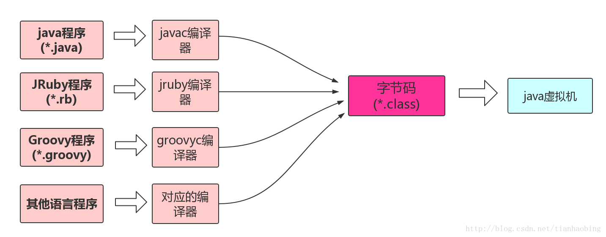
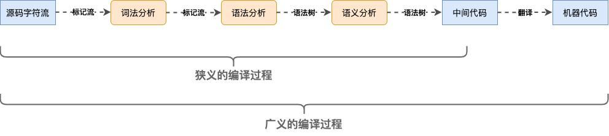

# 芯片架构、操作系统、应用之间的关系

操作系统：管理计算机硬件和软件资源的计算机程序，是多个程序的集合，一般可以分为几个部分

1. 控制程序，也叫内核（进程管理、存储管理、设备管理、文件管理、作业管理）
3. 实用程序（文本编辑器、dump程序、shell、桌面程序等）
3. 编译工具（汇编、编译、解析）

操作系统封装了硬件接口，应用是在操作系统之上运行的程序，通过调用系统API来运行，由于不同系统提供的API存在差异，因此高级语言编写的应用程序一般无法跨平台。就算不调用系统API，也需要依赖对应系统的编译程序。

应用程序对系统的依赖体现在哪方面？

> 1. 开发时应用依赖操作系统中的编译程序
> 2. 运行时应用依赖操作系统提供的程序库（如网络库、线程库等）

不管是操作系统程序还是应用程序，其实都是由CPU运行的。而CPU只认识对应的机器语言（指令集），同时提供了汇编语法便于记忆，汇编语言是对机器语言的一种映射，因此汇编写的程序只适用于一种或者一系列的CPU。

不同CPU指的是架构不同（指令集不同），和厂商没有关系，例如AMD和Intel都使用x86架构，可能不同厂商会有各自的增强指令，但是不影响x86程序的执行。

一支编译程序只生成一种机器代码。不同架构使用的编译器不同，并且生成不同的目标代码，例如x86，x64架构的GCC是不一样的。要在一种CPU架构上生成另一个平台的目标代码，需要使用**交叉编译**。

同一个CPU架构可以运行不同的操作系统，同一个操作系统可以在不同CPU架构上运行，但是需要针对目标平台分别进行编译，使用不同的编译工具链。例如Linux for x86，Linux for arm，WindowsNT for x86。

现代的操作系统一般都是使用高级语言编写，需要针对目标平台分别进行编译，例如ubuntu系统，有桌面版、Server版、以及各种嵌入式、IoT版（如树莓派）

> 之所以下载的windows系统可以运行在不同芯片上，主要是因为PC基本都是AMD和Intel的芯片，而两家都使用x86架构，指令集是通用的。

为什么应用一般以操作系统来分类，如windows版、linux版、mac版，不以CPU架构分类？

> 应用程序的运行需要CPU架构和操作系统都支持。例如x86_64位的目标程序无法在x86_32位机器上运行。
>
> 之所以Windows应用能够装在不同芯片的主机上，主要是因为PC基本都是AMD和Intel的芯片，两家都使用x86架构，指令集是通用的。如果应用编译的时候使用新的指令集，在老的机器还是无法运行。商业软件一般会先用基础指令集，再根据CPU判断是否使用扩展指令集

应用跨平台兼容不同CPU架构一般有几种做法：

> 1. 多套目标代码放到同一个执行文件中。
>2. 操作系统层面支持其他架构的目标代码。例如64位操作系统兼容32位CPU，并且可以运行32位的应用程序
> 3. CPU架构向下兼容，例如arm64-v8a兼容arm和armv7a指令集。应用目标平台为armv7a，可以运行到arm64-v8a的设备上，但是反过来不支持。
>4. 通过虚拟机运行，可执行程序不是目标平台代码，而是一种中间代码，通过虚拟机解释执行。例如Java、.Net等

为什么操作系统无法屏蔽CPU架构差异？

> 有两种思路：
>
> 1. 由操作系统来编译生成目标代码，在程序安装时进行编译
> 2. 由操作系统解释运行源代码或中间代码
>
> 之所以不这么做有以下原因：
>
> 1. 理论上操作系统拿到源码之后可以编译成当前架构的代码，但是软件开发商不愿意公开源代码，因此往往会编译成目标代码之后再进行发布。
> 2. 如果都交由操作系统来运行的话，程序运行会比较慢。例如Android系统，早期由虚拟机解释运行，后来改进通过应用安装时预编译成目标代码，提高了效率。
> 3. 如果操作系统需要为不同语言、不同CPU架构提供编译器，会使操作系统变得越来越大，如果CPU架构更新操作系统也要更新

Java程序为什么不需要根据CPU架构编译？

> Java之所以不需要根据CPU架构进行编译，是因为Java程序是通过虚拟机运行的，VM屏蔽了CPU架构的差异。

Android中的目标代码编译

> 由于VM功能不完备（如串口通讯需要依赖C写的库）或者性能问题，有时候需要使用C/C++开发，因此Android开放了NDK编译。
>
> 这意味着不同CPU架构需要生成不同的目标代码，如arm、x86、mips等。
>
> NDK开发者需要针对不同架构进行编译，生成不同的so文件，Android打包的时候将多份目标代码一起打包，安装的时候根据设备选择对应的so安装。

# 交叉编译

本地编译（native compile）：本机编译出来的程序在本机上运行

交叉编译（cross compile）：在一个平台上生成另一个平台的可执行代码，即编译环境和运行环境不一样。常用于嵌入式开发

编译用的机器叫宿主机，软件运行的机器叫目标机。宿主机和目标机通过串口或网络通讯。

为何需要交叉编译？

> 单片机或嵌入式设备功能较少，硬件资源和性能有限，只能供嵌入式系统运行，难以再提供编译资源。

嵌入式系统一般也比PC系统要轻量，CPU种类更多（如x86、arm、armv7、arm64、mips等），各家的指令集也存在差异，因此嵌入式操作系统一般要针对芯片分别进行编译。应用软件也需要分别编译。

> * Android使用Java，运行在虚拟机上，因此不需要分别编译，但是如果使用了so库，则需要分别编译
>* iPhone不同版本使用不同CPU架构，编译的时候可以选择目标版本系统和目标架构。

交叉编译工具链（交叉编译器）：交叉编译用到的一系列工具。如`arm-linux-gcc`、`arm-linux-ld`等

编译包括多个步骤，形成链条

1. 预处理（pre-compile）：删除#define并展开宏定义，处理#include等。`gcc -E file.c -o file.i`
2. 编译（compile）：语法分析、词法分析、语义分析等，生成汇编代码.s文件。`gcc -S file.i -o file.s`
3. 汇编（assembly）：汇编代码转为机器指令.o文件。`gcc -c file.s -o file.o`
4. 链接（link）：处理各个模块之间的引用和依赖，将目标文件链接到可执行文件或其他目标文件。
   1. 静态链接：目标文件直接进入可执行文件
      1. 编译静态库源码，生成.o文件：`gcc -c lib.c -o lib.o`
      2. 生成静态库文件，归档，生成.a文件：`ar -q lib.a lib.o`
      3. 使用静态库编译，生成.out可执行文件：`gcc main.c lib.a -o main.out`
   2. 动态链接：可执行程序运行时加载目标文件
      1. 编译动态库源码，生成.so文件：`gcc -shared dlib.c -o dlib.so`
      2. 使用动态库编译：`gcc main -ldl -o main.out`
      3. 代码调用
         1. `dlopen`打开动态库文件
         2. `dlsym`查找动态库中的函数并返回调用地址
         3. `dlclose`关闭动态库文件
5. 反汇编：使用`objdump`反汇编，输出机器码和对应的汇编代码

# 程序语言

## 机器语言、汇编语言、高级语言

1. 机器语言（本地机器码，native code）：
   1. 计算机执行的二进制命令，由0和1组成。
   2. 和CPU有关，不同计算机对应不同的机器语言指令集。
   3. 一条指令就是机器语言的一个语句，由操作码和操作数组成。
   4. 不便于阅读
2. 汇编语言（符号语言、伪机器语言）：
   1. 汇编语言和机器语言一一对应。
   2. 用助记符替代机器指令的操作码，用地址符号或标号替代操作数的地址。（如用“ADD”代表逻辑加）
   3. 本质是一套语法规则和助记符的集合。
   4. 不同CPU指令集不同，因此需要不同的汇编器（汇编语言翻译成机器语言），对应不同的汇编语言。但汇编语言语法规则本身可能通用，也可能不通用，由厂商定义
   5. 不便于书写
3. 高级语言：相对于低级语言（**机器语言和汇编语言都是低级语言**）。
   1. 和硬件结构及指令系统无关，可移植性更强。要操作硬件资源必须调用汇编程序的接口。
   2. 经过不同平台的编译器编译成目标平台的程序。高级语言和汇编语言不再是一一对应
   3. 高度封装的编程语言，更容易理解和修改

高级语言转为低级语言需要通过编译，编译器屏蔽了不同平台CPU架构的差异，开发者实际上是面向编译器编程。

为了提升效率，编译器会分为前端和后端。前端将源代码生成统一的中间代码，后端将中间代码编译为不同目标架构下的汇编代码。再交由这些架构下的汇编器汇编成机器码。

## 跨平台、程序可移植性

* write once, compile anywhere（一次编写，处处编译）：同样的代码在不同系统和开发环境中都可以编译运行，体现了代码的**可移植性**。
* write once , run anywhere（一次编写，处处运行）：Java特性。编译出来的`.class`，只要在装了jre环境（java运行环境）的机器上就可以执行。

> JVM是Java实现跨平台的核心，可以将Java编译的字节码解释成对应的机器码，不同系统有不同的JVM实现。
>
> 核心思想是定义了一层中间语言进行适配。

**JDK>JRE>JVM**

1. JDK（Java Development Kit）：Java 开发工具包，包含JRE和一些开发工具，如`javac、javap、jar`等
2. JRE（Java Runtime Environment）：Java 运行时环境，包含JVM和Java一些基本类库
3. JVM（Java Virtual Machine）：Java 虚拟机。将class字节码解释成机器码执行，是Java能够跨平台的核心

观点总结：

1. 高级语言和硬件结构及指令系统无关，从这个角度来说，高级语言都是跨平台的（平台无关性）。
2. 严格来说，高级语言只是语言规则，没有平台概念，语言本身也没法运行，运行的是编译后的本地代码。而本地代码是无法跨平台的。
3. 程序的可移植性指的是源代码，而不是本地代码。
3. 打包好的可执行程序要支持跨平台、移植，需要加一层中间代码，借助虚拟机或解释器将中间代码翻译成本地代码执行。

### C/C++是否跨平台？

结论：C/C++语言本身是跨平台的，但是应用程序本身是否跨平台取决于该平台上有没有适用的库及编译器。C语言提供了不同CPU架构的编译器

为什么说C/C++无法跨平台？

> C++标准库的东西太少了，没有多线程没有界面，内存管理很弱。这些都依赖于具体平台的API，而系统接口API不统一。比如在Windows下有WIN32、MFC，在Linux和Unix系列下，有pthread。
>
> 想要用c进行跨平台开发，需要封装各个平台实现，添加判断，通过编译参数选择对应的平台。

为什么说Java是跨平台的？

> 将Java源代码编译成中间代码（字节码），由JVM解释执行。
>
> Java虚拟机将不同平台的系统API统一封装了，并定义了一套规范，由JVM实现不同平台的调用。
>
> JVM本身就是一个平台，JVM的目标代码就是JVM规范定义的Class字节码。

### JVM语言无关性

**JVM只认识Class文件，并不关心Class文件从哪来，是否是Java语言编写的程序**。换句话说，Java虚拟机和Java语言没什么关系，其实更应该叫Class文件虚拟机。

> sun团队在设计之初就把Java规范分为了Java语言规范《The Java Language Specification》及Java虚拟机规范《The Java Virtual Machine Specification》。

其他语言只要有对应的编译器，能够输出Class文件，就能够在JVM上运行。如Groovy、JRuby、Jython、Scala等。

## 编译型语言 & 解释型语言

###  什么是编译？

编译就是高级语言转为低级语言的过程，将源代码转换为目标代码的过程。（目标代码可以是中间代码，也可以是本地代码）

**编译和解释都是翻译，区别在于翻译的时机不同：编译在程序执行之前，解释在程序执行过程中。**

* 编译型语言：程序执行之前，将源代码一次性转换成本地代码。C、C++、Delphi、Pascal、Fortran等
* 解释型语言：程序执行的时候。将代码逐条转换成本地代码运行。Java、Basic、JavaScript、Python、PHP等
* 脚本语言：也是解释型语言，不需要编译，代码即可执行文件，由解释器运行。

编译型语言和解释型语言实现的关键在于有没有生成中间代码，由于CPU只认识特定的机器代码，要想可执行程序能够跨平台，需要由虚拟机或解释器来执行程序，由虚拟机或解释器将中间代码翻译成机器代码执行。

|                   | 编译型程序                                                   | 解释型程序                                             |
| ----------------- | ------------------------------------------------------------ | ------------------------------------------------------ |
| 执行速度          | 快                                                           | 慢：运行时需要解释成机器码                             |
| 内存和CPU资源占用 | 少                                                           | 多：需要运行解释器，代码逐条解释运行，并且进行一些检查 |
| 目标代码大小      | 更大：编译后的程序多了很多东西。如C/C++的可执行文件比同样功能的字节码文件大很多 | 更小                                                   |
| 调试难度          | 困难：难以定位到异常的源码位置                               | 容易：JVM提供异常信息和堆栈跟踪                        |
| 平台依赖性        | 需要针对不同平台进行编译，只能在特定平台运行                 | 平台独立，只要机器支持jre即可                          |
| 安全性            | 安全性较低：可以直接访问内存区域，如外挂、病毒等             | 安全性更高                                             |
| 编写难度          | 编译器实现难度更高                                           | 解释器更容易实现                                       |
| 适用领域          | 适合开发操作系统、数据库系统、对速度和内存要求高的库         | 适用于开发Web应用、脚本等                              |

### 为什么说Java是解释型语言？

Java也有一个编译过程，但并不是将程序直接编译成本地机器语言，而是编译成**中间语言（字节码）**，运行的时候由JVM将字节码翻译成机器语言。

现在的JVM大部分使用了JIT、AOT技术，会在执行之前将字节码编译成本地代码缓存下来，直接运行。因此，也可以说Java是编译的。

> 有一个有趣的趋势：编译型语言在越来越解释（追求目标程序跨平台），解释型语言在越来越编译（使用AOT等技术，追求性能）

# Java编译器

在Java中，编译通常指Java文件转换为Class文件的过程，也被叫做**编译前端**，主要包括词法分析、语法分析、注解处理、语义分析等步骤。不依赖虚拟机。

除此之外编译也可以用来指即时编译（JIT）和提前编译（AOT），称为**编译后端**，主要用于生成更高效的机器码，提高运行效率。

java常见的编译器有以下类型：在JVM中一般是将几种方式结合，提高运行速度和效率。

- **前端编译器**：把`.java`文件转变成`.class`文件。比如Sun的Javac、Eclipse JDT中的增量式编译器（ECJ）。
- **JIT编译器（Just In Time，即时编译）**：运行时将**热点代码**编译成成本地代码。比如HotSpot VM的C1、C2编译器。
  - 将字节码编译成的机器码缓存下来，下次可以直接使用，提高运行效率。但是会牺牲一定的启动速度，占用更多的内存。
  - JIT会编译热点代码，而不是全部编译。非热点代码还是解释执行。监控收集热点代码会影响程序运行。
  - 除了缓存之外，JIT还会对代码进行**编译优化**，提高执行效率
- **AOT编译器（Ahead Of Time，提前编译）**：程序运行前，直接把java代码或字节码编译成本地机器代码，保存到磁盘中。 比如GNU Compiler for the Java（GCJ）、Excelsior JET、Android Runtime（ART）。
  - 提前预热，避免JIT运行时的消耗
  - 一些动态代码无法在运行前得知，因此编译质量不如JIT

## Java语法糖

**语法糖** 指的是高级语言中的某种语法，编译前端进行语义分析的时候会进行脱糖（解语法糖），转换为无糖语法。

常用的语法糖如下：

1. 泛型（ParamterizedType，参数化类型）：类型擦除
2. 自动拆装箱：基本数据类型与包装类互相转换
3. 条件编译：条件分支剪支优化
4. for-each循环：转换为迭代器
5. 枚举对象转换为普通对象
6. 内部类：非静态内部类持有外部类的引用
7. 可变长参数：转换为数组

## JIT如何检测热点代码？

1. 基于采样方式探测：周期性检查线程栈顶，如果某个方法经常在栈顶就认为是热点代码。
2. 基于计数器探测：为方法或代码块建立计数器，统计执行次数，超过一定阈值就会触发JIT编译
   1. 方法计数器：统计方法被调用次数
   2. 回边计数器：统计for或while循环的运行次数

# Android虚拟机优化历程

**Java之所以比C/C++慢（Android之所以比iOS慢），主要原因就在于前者是编译成字节码之后JVM解释执行，后者是编译成本地代码之后直接执行。**

## Android 1.0 Dalvik（DVM）+解释器

DVM中解释器边运行边解释，运行速度慢。

> DVM是Google为Android平台开发的虚拟机，而不使用Java提供的虚拟机。可读取`.dex`的字节码。

## Android 2.2 DVM+JIT编译

通过JIT缓存热点代码，提高运行速度。

缺点：启动速度慢，每次运行都要重新编译，非热点代码还是解释执行

## Android 5.0 ART+AOT

采用AOT技术，在应用安装的时候预编译成机器码（dex文件转为oat文件），避免每次运行进行JIT编译

缺点：应用安装APP时间变长。编译质量不如JIT，机器码需要的存储空间更大

## Android 7.0 ART+AOT+JIT混合编译

应用安装的时候不进行编译，快速启动，在执行的时候分析热点代码。在系统空闲的时候进行AOT，编译热点代码（不会编译所有代码）。

## Android 8.0 改进解释器

提高解释执行效率

## Android 9.0 改进编译模版

开发阶段可以配置编译模版，指定热点代码，ART优先编译这部分代码。

## Dalvik和ART对比

1. Dalvik采用JIT。ART采用了AOT，并且在Android7.0加入了JIT，提高运行效率
2. DVM针对32位CPU设计，ART支持64位
3. ART优化了垃圾回收机制，和运行时内存空间分配：新增`Image Space`和`Large Object Space`

# 结语

结构有点乱，基本是想到哪写到哪，不断延伸扩展出来相关的一些知识点

经典语录：**java和c++之间有一堵由动态内存分配和垃圾收集技术所围成的'高墙'，墙外的人想进去，墙内的人想出来**

参考资料：

* [C为什么不能跨平台](https://www.cnblogs.com/jmsjh/p/7808764.html)
* [Java | 编译过程（编译前端 & 编译后端）](https://www.jianshu.com/p/b1d2608848dd)
* [9102年了，还不知道Android为什么卡？](https://juejin.cn/post/6844903912206499853)