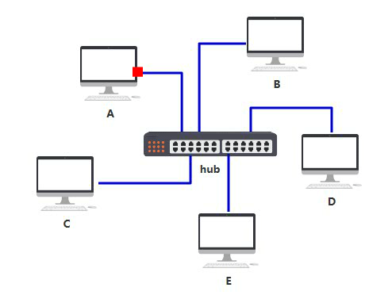
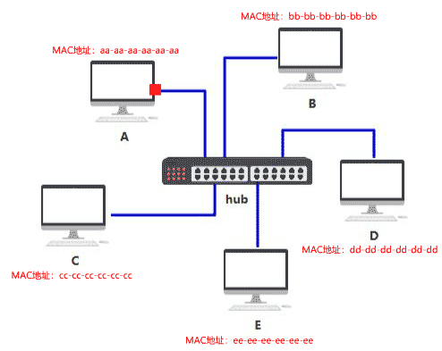
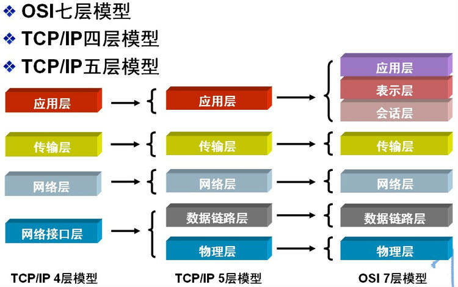

# 自底向上设计

一台主机：不需要通信，不需要连接网络

问题：无法和其他电脑连接，通信，只有基础的运算功能

## 网线直连

两台主机：主机添加网口，使用一根网线连接通信

三台主机：每台主机开两个网口，分别连接两台主机

N台主机：....

问题：随着越来越多的人加入，网口越来越多，网线密密麻麻。

## 集线器（Hub）

使用集线器做转发：只有简单的收发功能，将电信号**转发到所有出口**，相当于广播。如图

> 1. 对接收到的信号进行再生整形放大，以扩大网络的传输距离
> 2. 把所有节点集中在以它为中心的节点上。

我们把它定义在**物理层**

问题：由于转发到了所有出口，接收方不知道数据包是不是发给自己的。

## MAC地址

给每台设备起全局唯一的标识，使用6组8位数字表示，叫Mac地址。我们把它定义在**数据链路层**

> MAC（Media Access Control，介质访问控制协议）
>
> MAC地址可以重复，实际上只要不是同属一个数据链路就不会出现问题。

如A设备的mac地址为`aa-aa-aa-aa-aa-aa`，B设备的mac地址为`bb-bb-bb-bb-bb-bb`。A给B发送数据的时候，带上地址，如图：

设备收到数据包后，判断是自己的就收下，不是自己的就丢弃，如图：

问题：本来只需要发送给一台设备，现在发了多台设备，既不安全，又浪费网络资源

## 交换机

使用交换机，将数据包转发给特定Mac地址的电脑。我们把它定义在**数据链路层**

//rodo

# 自顶向下

ping过程发生了什么，输入网站url发生了什么

# 总结

## 网络层次划分

有不同的划分标准，一图以蔽之～

* 物理层（Physics Layer）
* 数据链路层（Data Link Layer）
* 网络层（Network Layer）
* 传输层（Transport Layer）
* 会话层（Session Layer）
* 表示层（Presentation Layer）
* 应用层（Application Layer）

我们有两种网：1.分组交换 ；2.电路交换（电话）

在很久很久以前，你记不记着，有个“**拨号连接**”，有个叫做“猫”的东西？？？
没错，就是那个，一上网就打不了座机的时代
此时，我们还是**电路交换**哟

这样太蠢了！！！
如果我只是想上网看下小电影的简介，那我打开介绍小电影的网站，就暂时不会再通信了
所以，没必要一直给我连接着啊！

于是，我们用起了**分组交换**
分组交换还有两种方式：
1.虚电路，如ATM（模拟电话线路）；2.**数据报**，如因特网

\>为啥因特网不用虚电路？
肯定是因为，大多数时候，虚电路没必要啊，而且麻烦不好用啊

\>为啥虚电路没必要&不好用？
因为大多数时候，互联网没有实时要求啊，&他的面向连接浪费资源啊

好嘞，现在我们知道了，因特网使用的是，数据报
我们先不管数据报是什么，我们**先考虑下如何传输数据报**

**-----------------------------------------**

我们的因特网，肯定是基于物理电路的，
因此，我们需要一个，将数据转化为物理信号的层，
于是，**物理层诞生啦**

**----------------------------------------**

有了处理物理信号的物理层，可我们还得知道，**信号发给谁啊
**你肯定知道，每个主机都有一个，全球唯一的MAC地址吧
所以，我们可以用MAC地址来寻址啊
恭喜你，**链路层诞生啦**

**----------------------------------------**

别急，你知道MAC地址，是扁平化的吧
也就是说，MAC地址的空间分布，是无规律的！！！
如果你有十万台主机，要通过MAC地址来寻址
**无F\**K可说**，
不管你设计什么样的算法，数据量都太大了！！！
所以，**我们需要IP地址啊
**<PS,IP里的有趣的东西太多啦，所以我补充在了最后>
有了IP地址，恭喜你，**网络层诞生啦**

**-----------------------------------------**

然而，一台主机不能只和一台服务器通信啊，
毕竟下小电影，也要同时货比三家啊
那如何实现**并行通信**呢？
嘿嘿，我们有端口号啊

再基于不同需求：
有人想要连得快，不介意数据丢失，比如你的小电影
有人必须要数据可靠，比如发一个电子邮件
于是产生了UDP&TCP
恭喜你，**运输层诞生啦**

**-----------------------------------------**

别急，你知道的吧，不同应用，有不同的传输需求
比如，请求网页，发送邮件，P2P...
而且，还有DHCP服务器啊
为了方便开发者，我们就对这些**常用需求**，进行了封装
恭喜你，**应用层诞生啦**

至此，自底向上，讲述了计网。
待我考完试，我可以写一部，**计算机网络·从下向顶方法**
（斜眼笑

====================

**<细节补充>**
\>来我们思考先一个问题：如果有四台电脑，要互相能通信，咋办？

\>每一台电脑都和另外三台连起来？
那我要是再来十台电脑，你在电脑上给我再加十个接口？

\>那，把他们连接到一个小盒子上，让小盒子帮着通信？
哎这个可以有啊，那如果我有一万台电脑，一个小盒子能够用？

\>嘿嘿，那让每一个小盒子连一百台，然后把一百台小盒子再连给一个小盒子

\-----------------------------------------------

我们可以用“电话线，宽带，和光纤”，把电脑接给小盒子，它们被称作“**接入网**”
而**ISP**就像小盒子，帮你在网络里做通信
而ISP的分层，无非就是，终端太多了，没办法不分层

好了，现在你已经明白了网络的**层次化**

你肯定是知道，
为了在辣么多计算机里，找到目标，我们采用了，有规律的IP地址
而路由器，又叫**分组交换机**，就是帮我们在公网里，做IP寻址的

最初，IP地址是**IPv4**
首先，IP地址是分成了五类（ABCDE）

奈何不够用啊，于是，我们是使用了**子网划分**
然鹅，手动分配子网IP，会死人的！
于是，**DHCP**来了（斜眼笑

md还是不好用啊，于是，诞生了无分类编址（**CIDR**）
奈何，还是不够用啊
于是，**NAT**出现啦，于是专用网的IP不再占用公网IP

\---------------------------------------

\>首先，啥是**专用网**啊
1.局域网，比如，公用一个路由器的宿舍啊，家啊
2.部分广域网，比如军队、铁路、交通、电力等部门，拥有自己专用的通信网和计算机网。然鹅，这些网络不对内部外的用户开放。这些网络覆盖的地理范围很广，因此，这些专用网都是广域网。

保密性质的广域网，通信要扯到VPN，宝宝没学到这里，先埋个坑

\---------------------------------------

来我们先谈谈**局域网内的通信**：
如果哈，我们是一个大局域网，比如我们公司有一百台电脑，
首先，路由器没一百个接口让我插！
其次，如果我不想和公网通信，那我就没必要用路由器！
所以，**链路交换机**来了！！！

链路交换机是基于MAC寻址的，因为局域网没大到必须用IP寻址的地步啊
但更准确的说话，链路交换机采用了，跨越链路层和网络层边界的协议——**ARP**
毕竟，ARP要做一个IP到MAC的映射，

\-----------------------------------------

\>你问我，为啥ARP要做IP到MAC的映射
因为，你在应用层和运输层里，目的地址都写得是IP,
不把IP转化为MAC，咋寻址啊？

\>你问我，局域网为啥不用路由器，为啥要用链路交换机
交换机功能少，接口多，比路由器划算啊

\>那，局域网和公网怎么通信呢?
所以，**NAT来了啊**！！！

分组交换机，也就是路由器，用自己的公网IP，帮你们局域网里的人们，给公网发信息
然后把接受到的信息，再转发给，那个找他帮忙的人
这就是NAT技术啊混蛋！！！

\-------------------------------------------

这时一群人说，NAT bulabula不好，我们要拒绝NAT,使用**IPv6**
那么就牵扯到了**IPv4和IPv6间**的通信（双栈||隧道）

还有啊，IP地址太丑啦，用户根本记不住 [http://xxx.xxx.xxx.xxx](https://link.zhihu.com/?target=http%3A//xxx.xxx.xxx.xxx)
于是乎，**域名**千呼万唤始出来
顺便带出来了DNS服务器

1.网络应该分为：电路交换网络和分组交换网络（虚电路本质上是分组交换网络，也就是你说的数据报）。

2.互联网有实时性需求（比如直播）。

3.面向连接的协议（如TCP）需要比非面向连接的协议（如UDP）更多的资源，但是这是为了提供可靠到达等一系列服务所必须的资源。花更多的资源换取更好的服务，不是浪费。

4.专用网与局域网不同（了解一下虚拟专用网络VPN）。

5.局域网即使小，按照应用程序采用的协议，局域网内也可以采用TCP或者UDP等协议通信，所以也需要网络层的支撑，就需要IP。

6.局域网向公网建立连接需要采用“NAT”，公网想向局域网内的设备发起连接，需要“NAT穿透”。

7.DHCP是为了自动分配IP、子网掩码等设置，让新加入局域网的设备自动获得自己的网络配置。（NAT之前，需要DHCP分配给设备IP。但是DHCP分配给设备IP，并不是仅用于下一步的NAT，可能该设备仅需要局域网内通信，不NAT。此时仍然需要DHCP。所以DHCP和NAT是两个独立的概念，不是为了NAT方便才有了DHCP）。

# 结语

了解每一个协议、每一层设计的背景以及要解决的问题，多问为什么。

"如果没有操作系统，我们的手机和电脑可以说是废铁了，如果没有计算机网络，我们的手机和电脑就是一座孤岛。"

参考文章：

* [低并发编程-如果让你来设计网络](https://mp.weixin.qq.com/s/jiPMUk6zUdOY6eKxAjNDbQ)
* [小林coding-图解网络](https://zhuanlan.zhihu.com/p/372288743)
* [知乎专栏-图解网络](https://www.zhihu.com/column/c_1367181480708345856)
