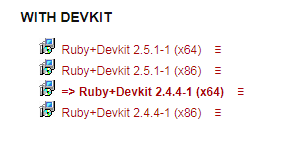
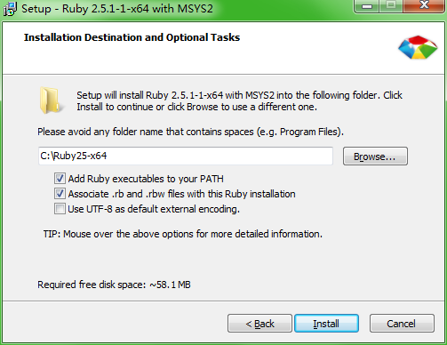
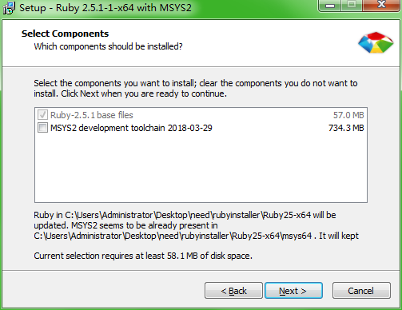
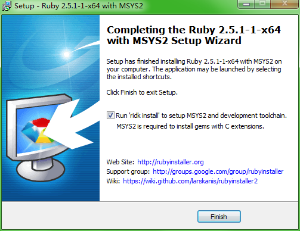
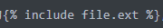

# 简介

Jekyll是一个静态网站生成器，基于Ruby+Liquid+Markdown+HTML+CSS。

## 目录结构

* `_config.yml`：配置文件。
* `_includes`：可以被其他的文件包含，复用。相当于网页的include，如header，footer等
* `_layout`：存放网页的模板文件
* `_posts`：存放具体的博客文章。
* `assets`：资源文件
* `_site`：这个文件夹存放的是最终生成的文件。 编译器生成，建议放到`.gitignore`里。

Jekyll运行会遍历所有的文件，进行预编译、解析生成文件。因此语法要符合规范，否则会编译失败。

一般参考主题中内置的示例文件改写即可，例如：

POST文章命名格式为：`year-month-date-title.markup`。后缀可以是md、markdown等。

文章开头需要带头信息，和正文间通过`---`分割，如下

```markdown
---
layout: post
title:  "Welcome to Jekyll!"
---
```

## Liquid

Liquid是一种模版语言，Jekyll会解析Markdown文件，将生成的内容填充到模版中。

Liquid使用``引用代码块，使用`{{ }}`引用变量。Jekyll内置了很多变量，掌握这些变量就能自行组织页面布局

例如：

引入footer页脚：``

引入文章标题：`{{ page.title }}`

## 主题切换

方式1：使用Gemfile安装主题，修改`_config.yml`配置文件。

> 这种方式切换不同主题可能会出现版本冲突，或者找不到文件等问题

方式2：直接clone主题仓库，使用Jekyll运行。

> 这种方式不便于切换主题，切换主题的时候需要将写过的`_post`文章迁移到新主题仓库中。

# 安装环境

由于GitHub基于Ruby，因此内置了Jekyll的支持，**只要将源工程文件通过Git上传到GitHub Pages**，GitHub在会自动在远程运行Jekyll编译生成静态站点文件，当然也可以本地编译生成静态站点文件，再上传到GitHub Pages。

> GitHub Pages相关单独抽出来介绍了，参考之后的文章

但是每次写好博客都需要提交并上传到GitHub Pages才能访问，会导致很多调试的提交，并且存在延迟，因此可以先在本地调试预览。

**本地调试需要先安装Ruby环境，再通过Ruby的包管理工具Gem来安装Jekyll**

## Mac安装

Mac内置了Ruby，位于`/usr/bin/ruby`，版本较旧，可能会出现无法运行Jekyll的情况，可以使用brew安装Ruby

```shell
# 使用brew安装ruby
$ brew install ruby
# 在.zshrc中配置环境变量
$ echo 'export PATH=/opt/homebrew/Cellar/ruby/3.1.2_1/bin:$PATH' >> ~/.zshrc
```

使用gem安装Jekyll，gem是ruby的包管理工具

```shell
# 安装Jekyll+Bundler
$ gem install bundler jekyll
# 创建Jekyll工程
$ jekyll new my-awesome-site
$ cd my-awesome-site
# 本地运行Jekyll服务
$ jekyll serve

# =>打开浏览器 http://localhost:4000
```

如果Jekyll没有在环境变量中，则需要使用完整路径访问，使用`gem list jekyll -d`查看Jekyll安装路径。

也可以通过bundler访问Jekyll

> Gem负责下载包，bundler用于具体项目的依赖管理，通过解析Gemfile配置文件，例如不同项目可能依赖同一个库的不同版本

```shell
# 配置bundler
$ bundle install
# 使用bundler运行Jekyll
$ bundle exec jekyll serve
# 查看项目依赖库的路径
$ bundle list --paths
```

如果提示没有`Gemfile`，则需要手动创建文件

```shell
source "https://rubygems.org"
# Hello! This is where you manage which Jekyll version is used to run.
# When you want to use a different version, change it below, save the
# file and run `bundle install`. Run Jekyll with `bundle exec`, like so:
#
#     bundle exec jekyll serve
#
# This will help ensure the proper Jekyll version is running.
# Happy Jekylling!
gem "jekyll", "~> 4.3.1"
```

## Windows安装

下载安装包不用配置环境变量。官方提供了ruby和devkit合成的安装包：[下载地址](https://rubyinstaller.org/downloads/)



1. 指定安装路径，勾选use UTF-8

2. 勾选MSYS2

4. 自动弹出命令行，输入1，等待安装成功

5. 安装Jekyll和bundler：`gem install jekyll bundler`
8. 切换到工程目录，执行`jekyll serve`即可运行，`jekyll build`编译
9. 浏览器中输入`localhost:4000`访问

# 问题记录

> 问题是18年写的，比较旧了，新版本不一定会遇到。

提示将`_config.yml`文件的`gem:`改成`plugins:`

提示缺少依赖，需要安装，根据具体情况安装，命令如下：

```shell
$ gem install jekyll-sitemap
$ gem install jekyll-seo-tag
$ gem install jekyll-feed
```

不允许出现中文名，可能出现下面的情况：

1. 运行起来之后访问不到文章：文章文件带中文名

`[2018-07-15 16:42:37] ERROR '/2018/07/15/ELK数据分析.html' not found.`

2. 也可能在编译时就出错无法运行：检查是否有文件包含中文名

```shell
Liquid Exception: Liquid error (line 13): invalid byte sequence in UTF-8 in sitemap.xml
             Error: Liquid error (line 13): invalid byte sequence in UTF-8
             Error: Run jekyll build --trace for more information.
```

如果博客文章中出现Liquid的语法，也会被解析，可能会导致报错：例如在文章中使用了这一句，Jekyll进行了解析，找不到`file.ext`文件



```shell
Liquid Exception: Could not locate the included file 'file.ext' in any of
["E:/GitPageBlog/moon-lights.github.io/includes"]. Ensure it exists in one of those directories 
and, if it is a symlink, does not point outside your site source. in E:/GitPageBlog/moon-
lights.github.io/posts/tool/2018-7-15-Jekyll.md
```

# 结语

参考资料：

* [Jekyll官网](jekyllrb.com)、[Jekyll中文网](https://www.jekyll.com.cn/docs/home/)
* [Jekyll主题](https://www.jekyll.com.cn/docs/themes/)：提供多个主题站点
* [使用Github pages+jekyll搭建自己的博客（windows版）](https://www.cnblogs.com/zjjDaily/p/8695978.html)