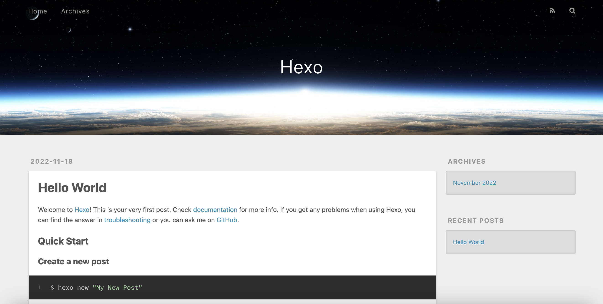
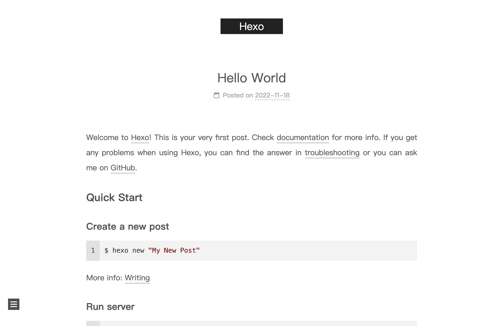
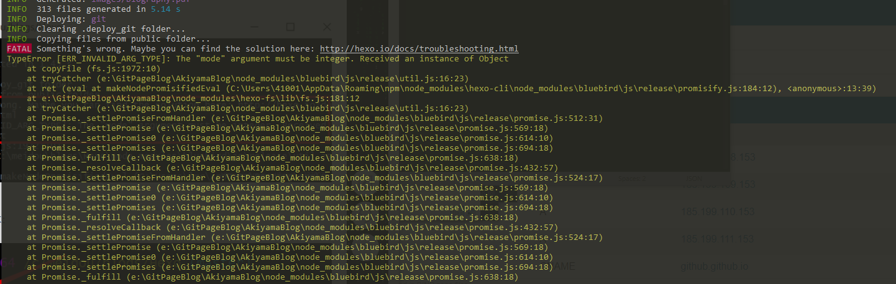
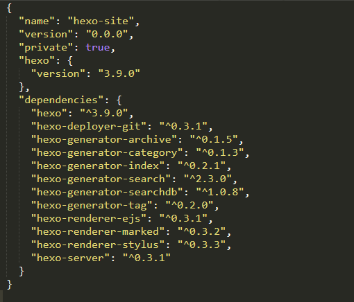
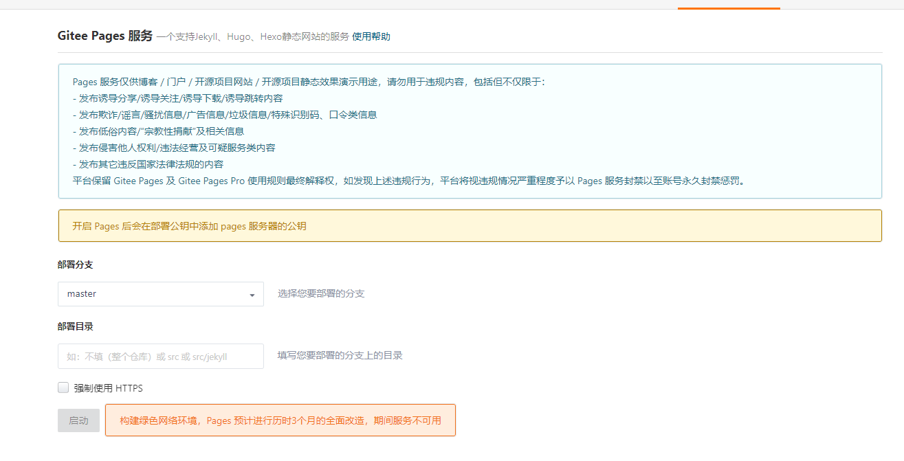

# Hexo简介

静态网页生成工具，可用于搭建博客。使用 Markdown（或其他渲染引擎）解析文章，有多种主题供选择。

[中文官方文档](https://hexo.io/zh-cn/docs/)

## 与Jekyll的区别？

在 Github Page 里用 Jekyll 其实是上传一个工程文件 ，Github 自动生成静态文件，而 Hexo 是先生成好文件再部署的。

此外，Jekyll基于Ruby，Hexo基于Node

在 Hexo 中有两个重要的配置文件：

1. **站点配置文件**：`站点根目录/_config.yml`。主要包含 Hexo 本身的配置。
2. **主题配置文件**：`站点根目录/themes/主题名称/_config.yml` ，主要用于配置主题相关的选项。

# Hexo使用

## 安装环境

[Node.js安装](https://nodejs.org/en/)

安装后打开cmd，输入`node -v`、`npm -v`检查是否安装成功（环境变量自动配置好了）

> 等于`node --version`、`npm --version`

[Git安装](https://git-scm.com/)

在电脑上右键出现Git Bash Here、Git GUI Here即表示安装成功。

若配置了环境变量，可输入`git --version`检查是否安装成功

注意：一般情况在Git Bash中才能进行Git的相关操作。如果需要在cmd命令行里调用Git，那么就要配置电脑的环境变量Path，或者在安装的时候选择【use Git from the Windows Command Prompt】。

安装和配置SSH

## 安装和运行

```shell
# 安装hexo命令行工具
$ npm install hexo-cli -g
# 检查是否安装成功：hexo -v或者hexo --version
$ hexo -v 
# 初始化hexo，或者创建空目录，执行hexo init
# blog为站点根目录
$ hexo init blog
$ cd blog
# 安装依赖包，即`package.json`中配置的库
$ npm install
# 本地运行hexo：hexo s或者hexo server，默认端口为4000，也可通过`hexo server -p 端口号`指定端口号
$ hexo server
```

访问 http://localhost:4000/ ，效果如下



# Hexo主题切换

Hexo提供了很多种[主题](https://hexo.io/themes/)，挑选自己喜欢、功能稳定的。以[NexT](https://theme-next.js.org/docs/getting-started/)为例：

1. 下载NexT主题，主题本质也是一个个Git工程，有两种安装方式。
   1. 下载到`themes`文件夹中：`git clone https://github.com/next-theme/hexo-theme-next themes/next`
   2. npm安装，下载到`node_modules`中：`npm install hexo-theme-next`
2. 启用NexT主题：打开**站点配置文件**，修改 theme 字段为 next。
3. 运行验证：输入`hexo s`启动服务，浏览器访问 http://localhost:4000 ，可以看到主题已经变更。



# 部署到Github Pages

GitHub Pages是免费的静态网页托管服务，使用Hexo可以生成静态站点文件，并上传到GitHub Pages上。默认使用`github.io`子域名。

## GitPage创建

登录GitHub，创建一个新的仓库，仓库名称要和用户名一样，例如：**Afauria.github.io**

创建完之后就可以通过 `https://afauria.github.io/` 来访问博客地址了

## 安装deploy插件

安装上传GitHub的插件，输入`npm install hexo-deployer-git`

配置GitHub仓库：打开根目录的 `_config.yml` 文件，找到deploy，修改如下
```yaml
deploy: 
    type: git
    repo: git@github.com:Afauria/Afauria.github.io.git
    branch: master
```
## 生成静态文件

使用`hexo generate`命令生成静态站点文件，简写为`hexo g`

此命令会在站点根目录生成public文件夹，即最终推到GitHub的文件。

> 与Jekyll不同，Jekyll是将工程推到Github，由GitPage生成静态文件，而这里是先生成静态文件再推到GitHub

## 将静态文件推到GitHub上

使用`hexo deploy`命令推到GitHub上，简写为`hexo d`

上面两个命令可以合并为`hexo generate --deploy`或`hexo deploy --generate`

当然也可以简写为`hexo g -d`或`hexo d -g`

## 访问博客地址

访问刚才的博客地址，可以看到博客页面已经换成了Hexo页面。

# 问题记录

## 两年后~，更新nodejs，hexo g -d发布失败

错误如下



解决方案：

1. 更新hexo命令行工具：`npm install -g hexo-cli`
2. 更新`package.json`中依赖组件的版本

   1. 使用`npm update`更新所有依赖组件的版本
   2. 发现hexo从`^3.7.0`版本变到了`^3.9.0`，试了一下发布还是不行
   3. `package.json`中，版本号使用了^，只会更新小版本，不会更新大版本，因此还是版本号还是`3.x.x`
   4. 从[hexo工程模板](https://github.com/hexojs/hexo-starter)中拷贝最新的`package.json`，替换原来的版本
   5. 再执行`npm install`和`npm update`更新版本到`^5.3.0`，其他依赖也更新
3. 再执行`hexo g -d`，成功发布



注：更新后的hexo需要新版本node，否则会提示`TypeError: Object.fromEntries is not a function`。

由于我还在使用了gitbook-cli，该工具已经不再维护，只能通过旧版本node运行，无法共存。

解决方案：使用n管理node版本，使用hexo时切换到`n node/14.17.6`，使用gitbook-cli时切换到`n node/10.24.0`

## 升级之后菜单跳转404，url带%20

next menu配置：旧版本`链接 ||`中间有空格，升级Hexo之后需要删除空格

```yml
menu:
  home: /|| home
  about: /about/|| user
  tags: /tags/|| tags
  categories: /categories/|| th
  archives: /archives/|| archive
  schedule: /schedule/|| calendar
  sitemap: /sitemap.xml|| sitemap
```

## GitPage 构建失败

2021-5-16照常`hexo g -d`发布博客，结果收到GitHub错误邮件。

```
The page build failed for the `master` branch with the following error:

Unable to build page. Please try again later.

For information on troubleshooting Jekyll see:

  https://docs.github.com/articles/troubleshooting-jekyll-builds

If you have any questions you can submit a request at https://support.github.com/contact?repo_id=367865705&page_build_id=253625473
```

整了足足半天没解决，收了几十封错误邮件。尝试了很多方法无效：

1. 删除新上传的文件

2. 排查错误字符

3. 回退版本

4. `hexo clean`、并删除`.deploy_git`文件夹

5. 使用本地Jekyll编译运行正常

6. 删除了远程Git仓库，新建GitPage

7. 最后甚至准备转战Gitee发布，结果创建GitPage服务的时候提示服务不可用……

   

本地构建运行`hexo serve`正常，使用jekyll编译也正常，说明文章格式没有错误。就是GitPage构建的时候失败了。

最后实在没办法，于是暂时放着，静下来整理博客，反正本地运行也可以看。

结果到晚上随手发布了一下，居然成功了、成功了……

只能说GitHub太坑，估计下午哪里瓦特了。
