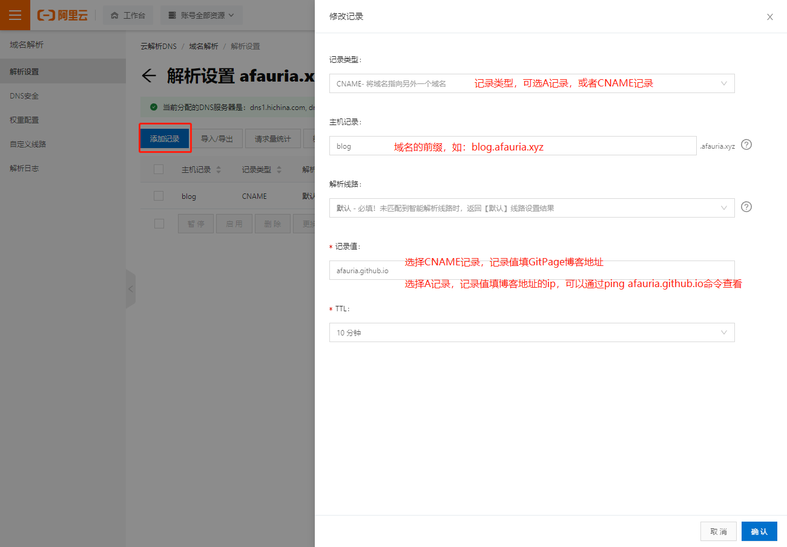
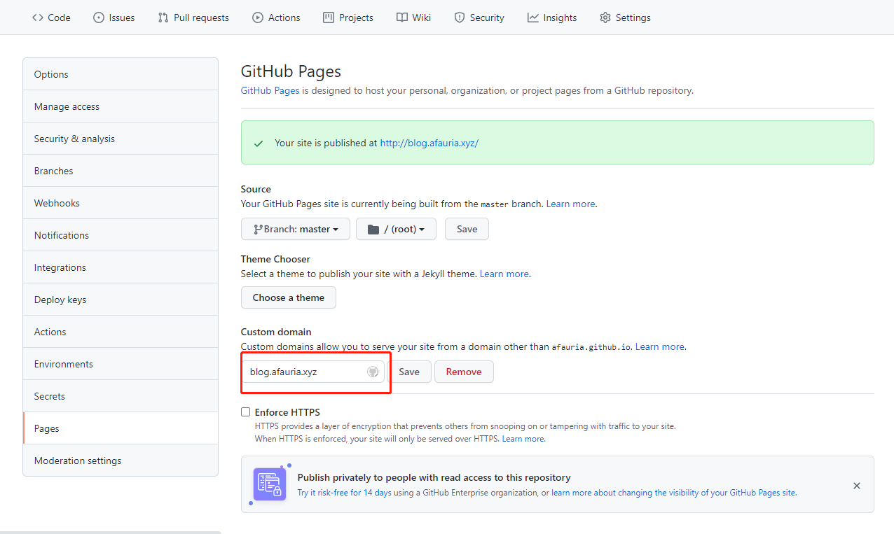

# GitHub Pages绑定自定义域名

## 域名注册

万网、阿里云、腾讯云都可以申请

## 配置DNS解析

以阿里云为例

## 添加CNAME文件

**注：方式二会在远程仓库生成CNAME文件和新的提交，会产生分支冲突，导致本地发布博客失败，建议使用方式一**

> 产生冲突的时候可以执行`hexo clean`再发布

方式一：博客站点`source`目录下添加`CNAME`文件，文件中填写域名地址。`hexo clean & hexo g -d`重新发布

方式二：GitPage中配置自定义域名，会生成CNAME文件并发布

# DNS记录类型

域名解析就是域名到IP地址的转换过程。域名的解析工作由DNS服务器完成。

DNS服务器会存储记录，记录类型有多种类型，起到不同的作用，这里简单介绍下A记录、CNAME记录和NS记录

## A记录

Address记录。存储域名到对应IP的记录，将域名解析成IP

## CNAME记录

别名记录，将一个域名解析成另一个域名。

### 将多个域名映射到同一个域名

当需要多个域名指向同一个IP时，如果使用A记录，如下，一旦IP变更，需要修改多条A记录。

> 1. `www.aaa.com-->1.1.1.1`
> 2. `www.bbb.com-->1.1.1.1`

如果使用CNAME记录，如下，只需要修改A记录即可

> 1. `www.aaa.com-->www.xxx.com-->1.1.1.1`
> 2. `www.bbb.com-->www.xxx.com-->1.1.1.1`

### CDN加速

使用CNAME将域名指向CDN服务器，由CDN服务器把最近的（或者负载较低的）服务器IP返回给本地DNS，让客户端能够快速访问

## NS记录

域名服务器记录。指定域名由哪个DNS服务器解析

## 补充

DNS解析流程：客户端-->本地hosts查询-->ISP本地运营商查询DNS缓存-->权威DNS服务器解析

本地hosts文件：保存常用的网址域名与其对应IP地址的映射。

> 当用户在浏览器中输入一个需要登录的网址域名时，系统会首先自动从hosts文件中寻找对应的IP地址，一旦找到，系统会立即打开对应网页，如果没有找到，则系统会将网址提交DNS服务器进行IP地址的解析，再进行访问。

可以使用`ipconfig /flushdns`命令清除DNS缓存

# 结语

参考资料：[简单的解释下什么是CNAME？](https://blog.csdn.net/DD_orz/article/details/100034049)
