# WordPress

全球使用最广泛、最成熟的建站平台之一

特点（列举部分）：

* 控制台管理：统计和看板、修改主题、设置等功能。
* 拥有众多特殊功能的插件，除了博客之外，还可以做电商、官网、社区等。
* 功能丰富，定制个性化页面：可以添加评论、视频、表单、付款等控件（区块）
* 网页在线编辑，所见即所得
* 基于PHP+MySQL，导出导入不是很方便，需要安装插件从其他博客迁移导入

常说的WordPress主要指两个产品

* **[WordPress.org](https://wordpress.org/)、[WordPress.org中文网](https://cn.wordpress.org/)**：**是一个开源软件**，自带几千个免费主题，需要自行购买主机、搭建PHP环境部署。
* **[WordPress.com](https://wordpress.com/)**：**是一个WordPress主机服务**（有免费版，功能受限），类似的还有Bluehost、DreamHost、SiteGround等（收费服务）。本质就是上面提到的第三方博客平台，只不过功能更丰富，可以安装主题、插件、绑定域名等。

# WordPress.com

1. 选择免费版，注册账号登录（后续有需要可以升级）
2. 选择wordpress子域名，例如`afauria.wordpress.com`
3. 进入网页端控制台（也可以下载控制台的客户端），直接编辑文章、发布即可。访问站点效果如下

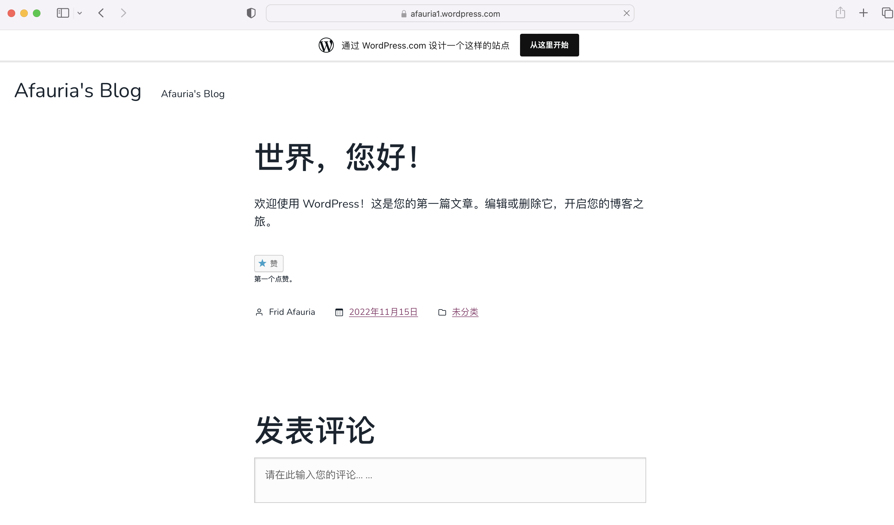

优点：不需要部署环境，直接登入账号即可

缺点：由于是国外的主机，国内访问可能受限，免费版只有几十个主题，1GB存储空间、还会带广告或者横幅。

价格如下：

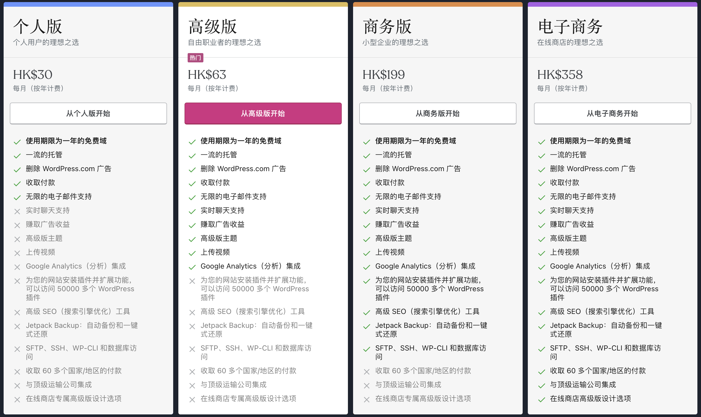

# WordPress.org

WordPress环境介绍：

* 主机：
  * 云主机：需购买云服务或者VPS
  * 本地的主机：自己的电脑、或者使用树莓派作为服务器，需要公网ip或者使用内网穿透供外部访问

* PHP（**H**ypertext **P**reprocessor，超文本预处理器）：WordPress使用PHP进行开发
* MySQL：WordPress所有信息都存储在数据库中，例如文章、站点配置等。
* Apache或者Nginx：Web服务器，用于部署PHP页面。
* phpMyAdmin（非必需）：PHP编写的数据库管理工具
* WordPress.org：php应用，下载之后解压即可，需要部署到Web容器中

> PHP是一种服务器端脚本语言，可以嵌入HTML、CSS、JS。PHP是一种解释性语言，不需要编译打包。
>
> 个人理解WordPress是一种前后端不分离的开发模式，PHP操作数据库，并且通过内嵌HTML显示动态网页，前后端一起部署到Apache上。
>
> 类似JSP应用，但是原理不同，JSP会被编译成Servlet执行，而PHP是解释执行。最终都需要部署到Web容器中运行。

## 云主机环境搭建

针对VPS或者云服务，最简单的就是使用**宝塔面板**（服务器管理软件）安装环境，可以一键安装LNMP或者LAMP环境

> * LNMP：Linux+Nginx+MySQL+PHP
> * LAMP：Linux+Apache+MySQL+PHP

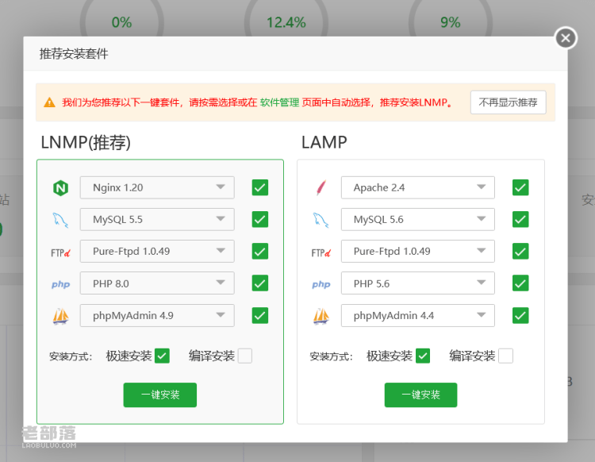

参考网上的教程即可：

* [WordPress搭建教程：手把手教你搭建WordPress博客](https://zhuanlan.zhihu.com/p/37896471)
* [WordPress建站步骤详细图文教程](https://zhuanlan.zhihu.com/p/534537871)

## 本地主机环境搭建

自行搭建环境。通常本地仅用于调试，真正部署还是要用专门的主机。

基本步骤相同，只不过每个环节都有多种方式实现。

1. 安装PHP+Apache+MySQL环境，phpMyAdmin选择性安装。
2. 下载[WordPress.org](https://cn.wordpress.org/download/#download-install)应用程序。
3. 将WordPress应用部署到服务器：Apache或者Nginx。
4. 访问`localhost`网址，打开WordPress首页，默认是80端口。如果新建了子目录，则访问对应的路径，例如`localhost/wordpress`。
5. 创建数据库，WordPress配置数据库连接信息。如果数据库和WordPress不在同一台主机，需要修改配置并授权其他host访问（下面会介绍）
6. 数据库连接成功后进入登录页面，注册账号后即可登录到控制台
7. 至此，WordPress本地已经部署成功，和`WordPress.com`一样在控制台编辑和发布文章，所有数据都保存在MySQL中。

**不同OS前面几个环节有些差异，进入WordPress首页之后的流程都是相同的**

推荐使用Docker部署，具有跨平台和隔离的特性。

# MacOS环境搭建

## 安装环境

安装Apache环境：Mac自带Apache，使用`sudo apachectl start`开启服务，访问`localhost`，如图表示Apache服务启动成功。


安装MySQL：`brew install mysql`。

安装PHP：`brew install php`，MacOS 12之前自带PHP，新版本移除了PHP。

根据提示修改apache配置文件`sudo vim /etc/apache2/httpd.conf`，支持php模块


修改完之后使用`apachectl -t`验证配置文件是否正确

## 下载WordPress应用并部署

下载[WordPress.org](https://cn.wordpress.org/download/#download-install)应用程序并解压（中文版）

将wordpress文件夹拷贝到到Apache的网站根目录：

* MacOS上的网站根目录`/Library/WebServer/Documents/`
* Windows上的网站根目录一般是`<phpStudy路径>/WWW`
* Linux上Apache的网站根目录为`/var/www/html/`

Apache网站根目录一般在`httpd.conf`中配置，例如

```shell
# MacOS上/etc/apache2/httpd.conf
DocumentRoot "/Library/WebServer/Documents"
```

访问`localhost/wordpress`打开WordPress首页

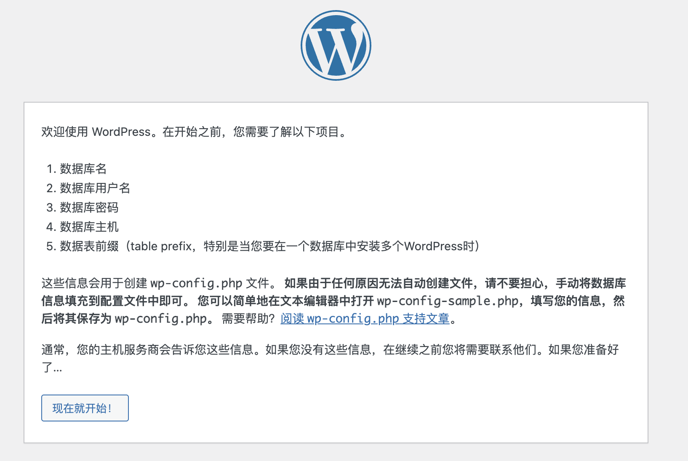

## WordPress配置

先创建数据库

```shell
# 登录数据库
mysql -uroot -p
# 创建数据库
mysql> create database db_word_press;
```

根据提示填写数据库连接信息，如图：

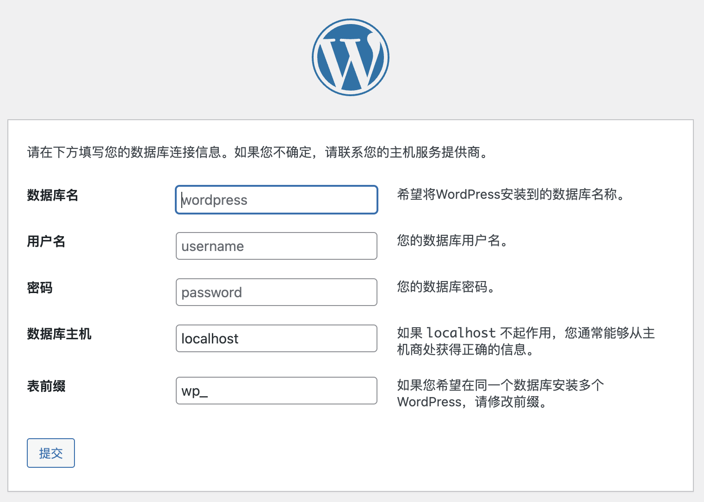

配置完成后会生成`wp-config.php`文件，也可以手动修改`wp-config-sample.php`，并另存为`wp-config.php`

接着注册账号并登录到控制台

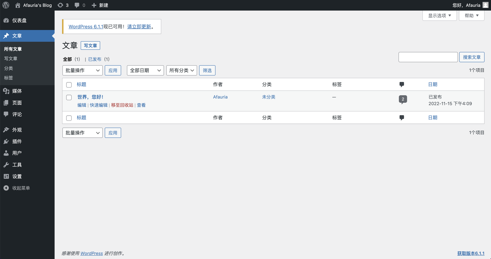

# Docker搭建

可以使用单纯的Linux镜像，自行安装PHP、Apache、MySQL、WordPress。这里直接使用wordpress镜像

1. 下载wordpress镜像，内置了PHP+Apache+WordPress：`docker pull wordpress`
2. 运行wordpress容器：`docker run --name my-wordpress -p 8080:80 -d wordpress`
3. WordPress已经下载并部署在了`/var/www/html/`
4. 访问网址`localhost:8080`，选择语言之后进入WordPress首页。

## Docker运行phpMyAdmin

phpMyAdmin用于数据库管理，可以根据需求安装。

参考：[phpMyAdmin官方文档](https://docs.phpmyadmin.net/zh_CN/latest/setup.html#installing-using-docker)

1. 下载phpmyadmin镜像：`docker pull phpmyadmin`
2. 运行phpmyadmin容器：`docker run --name phpmyadmin -d -e PMA_HOST=<本机IP地址> -p 8081:80 phpmyadmin`。
3. 进入容器环境：`docker exec -it phpmyadmin /bin/bash`

> `-e PMA_HOST`是配置环境变量，表示phpMyAdmin要连接的数据库Host。

# Windows搭建

推荐使用**phpStudy集成环境**，自带PHP+MySQL+Apache+phpMyAdmin。其他流程和MacOS类似

下载phpStudy并点击启动，如图

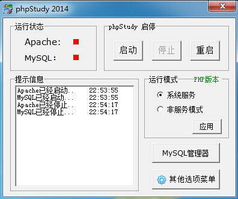

将WordPress文件夹拷贝到网站根目录，默认为`<phpStudy>/WWW`

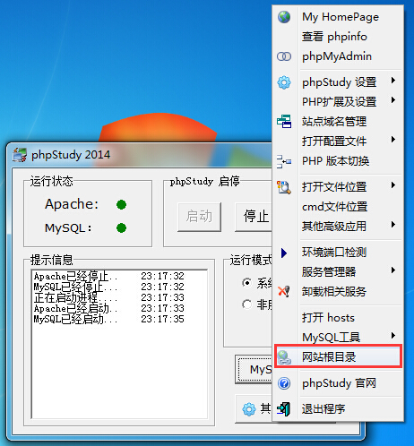

访问`localhost/wordpress`，打开WordPress首页。

# 问题记录

## 无法连接MySQL

使用Docker搭建环境，由于WordPress镜像不包含MySQL，因此需要连接宿主机或者其他容器的MySQL。

默认情况下，数据库只能在本地访问，远程或容器内无法访问，因此需要开启远程访问权限。

查看当前用户信息如下

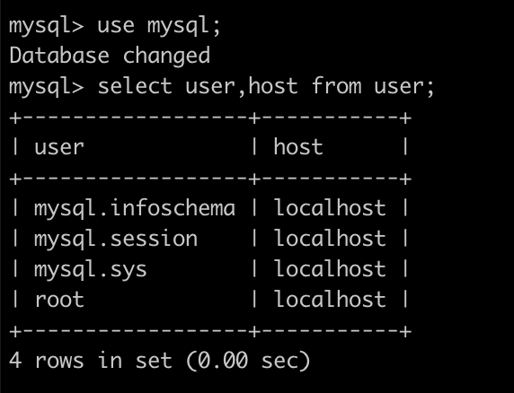

修改`/usr/local/etc/my.cnf`配置，注释掉绑定配置

```shell
# bind-address = 127.0.0.1
```

授予用户权限

```bash
# 创建新用户：CREATE USER 'username'@'host' IDENTIFIED BY 'password';
CREATE USER 'afauria'@'%' IDENTIFIED BY 'password';
# 更新host字段为%，如果已经是%则不需要
update user set host = '%' where user ='afauria';
# 授予权限：GRANT privileges ON databasename.tablename TO 'username'@'host';
GRANT ALL ON *.* TO 'afauria'@'%';
flush privileges;
# 重启mysql服务
brew services restart mysql
```

WordPress数据库主机需要填宿主机的IP地址。

## PHP模块签名问题

MacOS部署PHP到Apache，`apachectl -t`出现异常：`No code signing authority for module at xxx`

原因：macOS Monterey开始，强制要求应用程序签名，使用brew安装的PHP模块没有签名

解决方法：参考[How to sign homebrew PHP module in macOS](https://www.simplified.guide/macos/apache-php-homebrew-codesign)

1. 打开【钥匙串访问-证书助理】，先创建证书颁发机构`Afauria's CA`，再创建证书`Afauria`

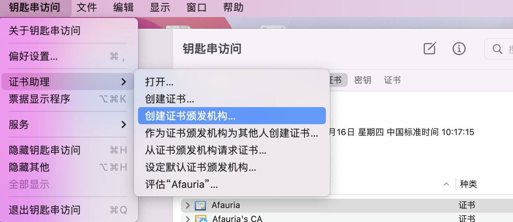

2. 创建证书颁发机构`Afauria's CA`，类型为**自签名根CA**

   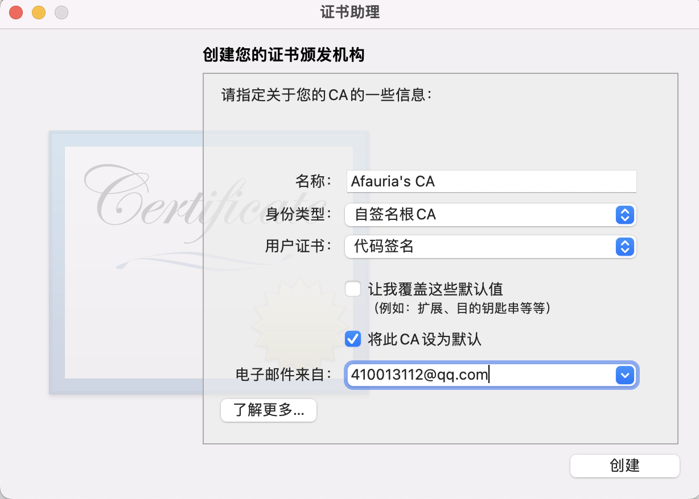

3. 信任证书机构

   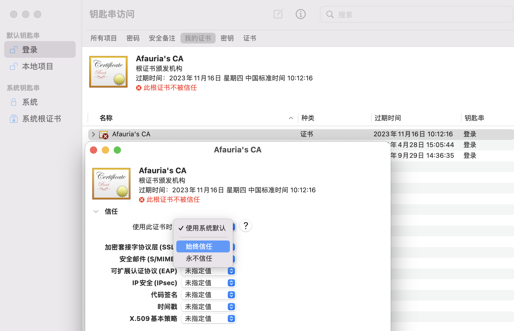

4. 创建证书Afauria，类型为**叶证书**

   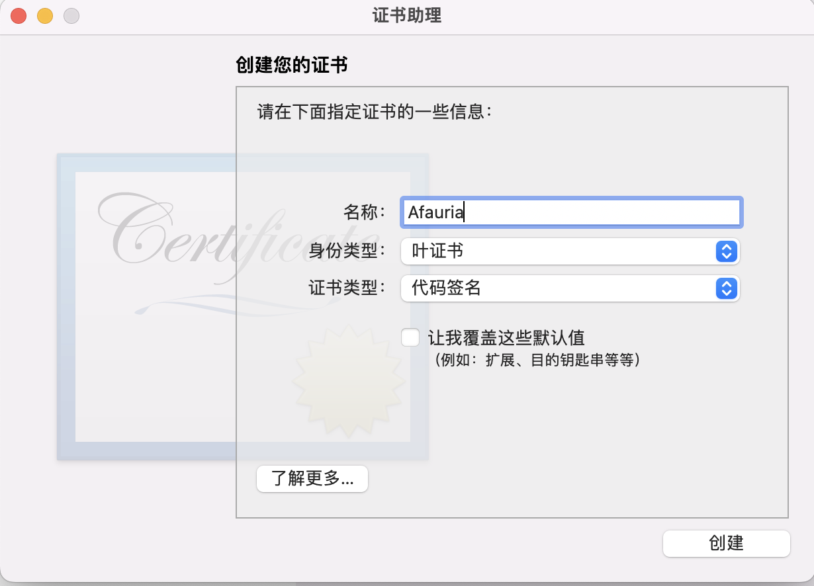

5. 证书签发者选择刚才创建的根证书机构

   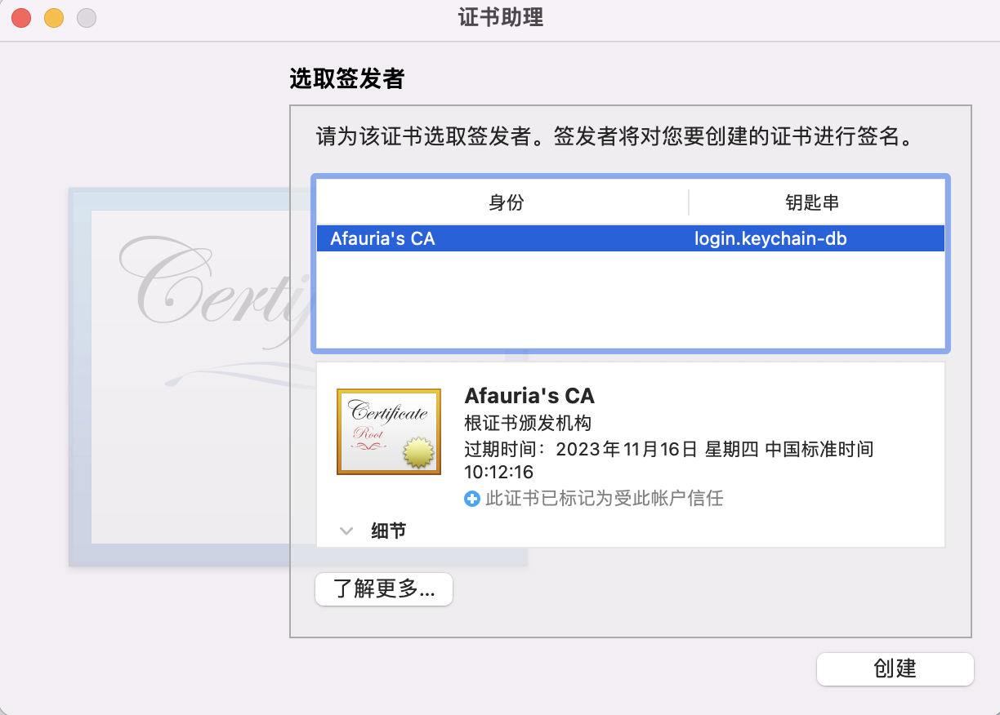

6. 对PHP模块签名：`codesign --sign "Afauria" --force --keychain ~/Library/Keychains/login.keychain-db /usr/local/opt/php/lib/httpd/modules/libphp.so`

7. 修改`httpd.conf`配置，添加证书名称：`LoadModule php_module /usr/local/opt/php/lib/httpd/modules/libphp.so "Afauria"`

8. 再次`apachectl -t`验证成功

## PHP架构问题

Mac部署PHP到apache，`apachectl -t`出现异常：`'xxx libphp.so' (mach-o file, but is an incompatible architecture (have (x86_64), need (arm64e))`

原因：下载的php是x86_64的，使用的Mac是M1芯片（arm64架构），无法兼容。

> M1芯片暂时无法通过brew下载php，`brew search php`找不到对应的软件