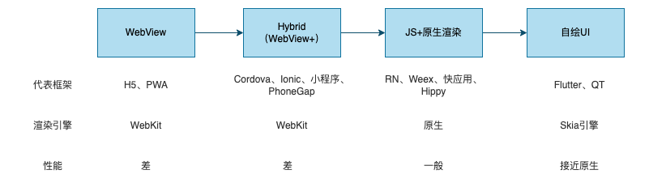
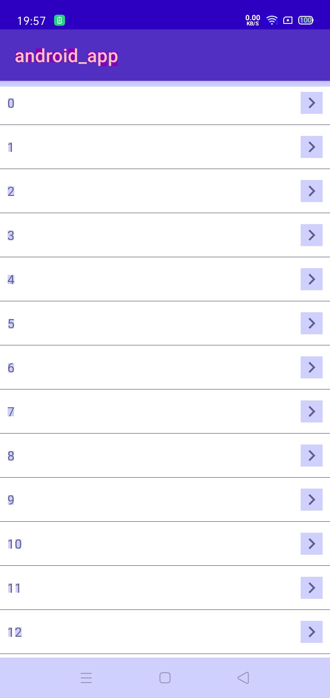
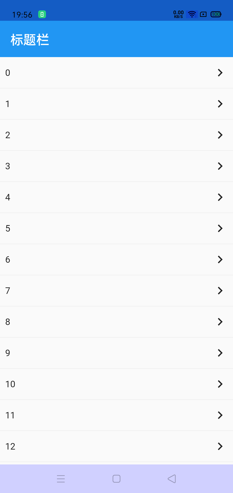
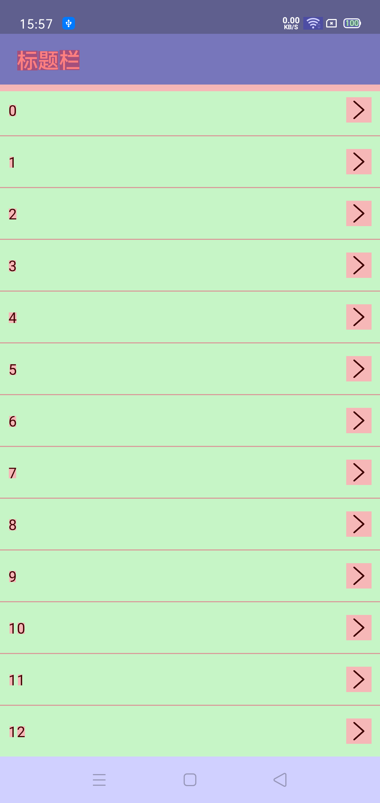

# 跨平台技术优势

原生开发不足：

1. Android、iOS分开维护，开发和测试成本大。对于小团队来说成本较大。
2. 动态化弱，更新需发版。

跨平台优势：

1. 增加代码复用，减少开发者对多个平台差异适配的工作量，降低开发成本。
3. UI和交互一致。
4. 动态化，热更新。
5. 热重载。

跨平台不足：

1. 接入成本
2. 不可避免要和原生通信
3. 性能弱于原生

# 跨端技术演进



|                  | WebView（Web App）                               | Hybrid（WebView+）                                    | JS+原生渲染                                       | 自绘UI                            |
| ---------------- | ------------------------------------------------ | ----------------------------------------------------- | ------------------------------------------------- | --------------------------------- |
| 介绍             | 使用原生Web容器，JS引擎解析，WebKit或者Blink渲染 | 混合开发，WebView增强。通过JSBridge进行原生通信和调用 | 类RN方案，生成虚拟Dom，JSCore映射成原生控件渲染。 | Dart编译，Flutter提供渲染引擎自绘 |
| 代表框架         | H5、PWA                                          | Cordova、Ionic、小程序、PhoneGap                      | RN、Weex、Hippy、快应用                           | Flutter、QT                       |
| 虚拟机（运行时） | JS引擎（V8、JSC）                                | JS引擎+JSBridge                                       | JS引擎                                            | Dart VM                           |
| 渲染引擎         | WebKit、Blink                                    | WebKit、Blink                                         | Native渲染                                        | 2D：Skia（SGL）<br>3D：OpenGL ES  |
| 性能             | 差                                               | 差                                                    | 原生渲染，运行时解析Dom树，和原生通信             | 接近原生                          |

* PWA（Progressive Web App，渐进式Web App）：离线缓存、无需安装、服务端首屏渲染。
* Weex：阿里巴巴出品，使用vue框架开发
* 快应用：国内手机厂商出品，使用JS开发，将引擎内置到ROM中，减少应用体积。
* Taro：可以使用TSX、JSX、React语法，编译成不同平台的代码（RN、微信/支付宝/京东小程序、快应用、H5等）

js调用Android方式：

1. `WebView.addJavaScriptInterface()`
2. `WebViewClient.shouldOverrideUrlLoading()`

Android调用JS方式：

1. `WebView.loadUrl()`
2. `WebView.evaluateJavaScript()`

# RN和Flutter对比

| 类型     | React Native                                             | Flutter                              |
| -------- | -------------------------------------------------------- | ------------------------------------ |
| 原理     | JSCore引擎解析React虚拟Dom，渲染成原生控件树。           | skia引擎自绘UI                       |
| 技术栈   | React                                                    | Dart                                 |
| 开发者   | FaceBook                                                 | Google                               |
| 支持版本 | Android 4.1（API level 16）以上                          | Android 4.1（API level 16）以上      |
| 支持平台 | Android、iOS                                             | Android、iOS、Web、桌面、Fuchisa     |
| 包体积   | iOS系统自带JS Core，Android系统不带                      | Android系统内置Skia引擎，iOS系统不带 |
| UI一致性 | 低：不同平台控件单独维护，复杂场景需要对原生控件进行扩展 | 高：一套代码，UI一致                 |
| 原生调用 | JS Bridge                                                | Platform Channel                     |
| 动态化   | 支持                                                     | 不支持                               |
| 热重载   | 支持                                                     | 支持                                 |

# 性能对比

只对比Android和RN、Flutter

启动速度、内存、CPU多次测试取平均值。通过脚本模拟滚动列表操作。

|               | Android                                                      | Flutter                                                      | RN                                                           |
| ------------- | ------------------------------------------------------------ | ------------------------------------------------------------ | ------------------------------------------------------------ |
| 运行效率      | 1.0：Dalvik+解释器。<br>2.2：Dalvik+JIT。<br />5.0：ART+AOT。<br />7.0：混合编译。<br />9.0：编译模版 | Debug是JIT，Release是AOT。                                   | Js运行时编译，渲染需要和原生通信。                           |
| Release包     | 3.5M                                                         | 未分包16M，分包5～6M                                         | 未分包30.1M，分包后10M左右                                   |
| 冷启动        | 329ms                                                        | 395ms                                                        | 341ms                                                        |
| 温启动        | 242ms                                                        | 288ms                                                        | 243ms                                                        |
| 热启动        | 89ms                                                         | 57ms                                                         | 53ms                                                         |
| 内存占用      | 61.768M                                                      | 75.747M                                                      | 105.117M                                                     |
| CPU占用       | 52.040%                                                      | 63.660%                                                      | 67.820%                                                      |
| FPS（帧/s）   | 93.989                                                       | 23.584、80.645                                               | 96.647                                                       |
| View数量      | 57                                                           | 9                                                            | 93                                                           |
| Display list  | 80.98KB                                                      | 12.53KB                                                      | 138KB                                                        |
| GPU           | 4.37MB                                                       | 48KB                                                         | 4.2MB                                                        |
| 进程总耗电量  | 0.306mAh                                                     | 0.332mAh                                                     | 0.520mAh                                                     |
| 进程CPU耗电量 | 0.0000800mAh                                                 | 0.000383mAh                                                  | 0.00154mAh                                                   |
| 过度绘制      |  |  |  |

温启动：进程没被杀，Activity被回收，例如双击返回退出，或者app内存不足被回收

Flutter打包：`flutter build apk --split-per-abi`

RN打包：`./gradlew assembleRelease`

```groovy
// app/build.gradle
android {
  splits {
        abi {
            reset()
            enable true
            universalApk false  // If true, also generate a universal APK
            include "armeabi-v7a", "x86", "arm64-v8a", "x86_64"
        }
    }
}
```

# 总结

* 性能：
  * 渲染性能：原生=Flutter>RN>H5
  * 运行效率：原生>Flutter>RN
  * 启动速度：原生>RN>Flutter
  * 包体积：RN>Flutter>原生
  * 耗电量：RN>Flutter>原生
  * 过度绘制：RN>原生>Flutter
* 使用成本：
  * 学习曲线、成熟度、普及度、社区生态、三方库、行业趋势：容易过时，不对比了。目前主流应该是Flutter。
  * 框架程度：Flutter>RN>H5
  * 接入成本：全新项目成本较低，原有项目接入成本较高
  * 维护成本：原生需要维护两套代码。RN需要封装原生控件、Flutter需要封装插件

* 开发效率：
  * 热重载：RN、Flutter支持热重载
  * 工具链（开发、编译、调试、测试、发布）：都挺完善的
* 平台一致性：Flutter>RN=原生

# 结语

Android性能分析请参考：[Android性能分析](/2021/12/12/android-2021-12-19-Android性能分析/)

Flutter性能分析参考[官方文档](https://flutter.cn/docs/perf)

Android性能分析脚本见[GitHub-PerformanceCheck](https://github.com/Afauria/PerformanceCheck)

Android、Flutter、RN测试Demo见[GitHub-HybridPerformance](https://github.com/Afauria/HybridPerformance)

