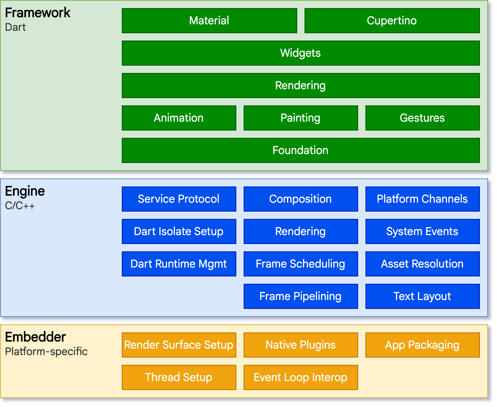

# Flutter简介

Flutter是一个跨平台的UI框架，设计初衷是在各种操作系统上复用UI代码，提供一致的交互体验，同时让应用程序能过与底层平台服务进行交互。

* 支持移动平台（Android、iOS），桌面平台（Windows、Linux、MacOS），Web平台（浏览器），其他嵌入式平台（如车载、IoT设备、树莓派等，需要自行扩展适配）
* 支持多屏幕设备、折叠设备等

Flutter SDK包含框架代码、脚手架、编译工具、调试工具和各种脚本等。

Flutter只是一个框架，不是一门语言，Flutter使用了Dart语言，Flutter引擎中的嵌入层（UI渲染、输入输出、以及PlatformChannel等）使用了平台原生语言（如C++，Java等）。

Flutter和Dart类比Android和Java的关系：

|              | Flutter           | Android                 |
| ------------ | ----------------- | ----------------------- |
| 编程语言     | Dart              | Java、Kotlin            |
| 编译器       | dart compile      | javac、dx               |
| 应用构建工具 | flutter命令       | gradle命令              |
| Framework    | Flutter Framework | Android Framwork        |
| 开发套件     | Flutter SDK       | Android SDK             |
| 底层源码     | Flutter引擎源码   | AOSP系统源码            |
| 源码管理工具 | gclient           | repo                    |
| 源码编译配置 | gn文件            | 低版本mk、高版本bp文件  |
| 源码编译工具 | ninja             | 低版本make，高版本ninja |

# Flutter架构

Flutter源码包含两部分：

1. [Flutter Engine](https://github.com/flutter/engine)：负责Flutter渲染和与宿主机的交互。包括图形渲染、网络I/O、插件通道、Dart运行时、平台嵌入层、编译工具链等
2. [Flutter Framework](https://github.com/flutter/flutter)：为开发者提供dart封装的API接口（布局、组件、函数）和开发调试工具。应用开发者只需要下载和使用SDK，一般不需要接触引擎层。

> Flutter SDK默认会缓存官方构建好的引擎artifact，打包到应用中

架构如下：

1. 嵌入层：源码包含在Engine中的`shell/platform`文件夹下。适配了多个平台，使用当前平台语言编写，提供应用程序入口，程序通过嵌入层与底层操作系统交互，例如访问surface渲染、辅助功能、输入设备、线程管理、窗口管理等。
2. 引擎层：提供Flutter核心API实现，包括图形（Skia）和动画，文本布局、文件、网络IO、插件通道、Dart运行环境以及编译环境的工具链。引擎将底层C++代码包装成Dart代码，即`dart:ui`，供上层使用。
3. 框架层：提供Flutter应用开发的框架，包括响应式框架、布局、组件、基础库等
   1. foundation：提供上层常用的抽象和函数
   2. 基本模块：如 [animation](https://api.flutter-io.cn/flutter/animation/animation-library.html)、 [painting](https://api.flutter-io.cn/flutter/painting/painting-library.html) 和 [gestures](https://api.flutter-io.cn/flutter/gestures/gestures-library.html)
   3. 渲染层：提供布局操作的抽象，构建可渲染对象的树
   4. widgets层：和渲染层中的渲染对象对应，并提供响应式编程模型
   5. Material和Cupertino：封装widgets，实现Material和iOS设计规范

4. 软件包：封装开发者常用的功能，分为普通包和插件包
   1. Packages：与平台无关。如http、路由导航、依赖管理、应用内支付、组件等
   2. Plugins：封装原生平台调用，如webview、camera等

5. 应用层：Flutter应用、模块、插件等

> Flutter界面构建、布局、合成、绘制都由自身完成，而不是转换为原生控件。Flutter引擎与平台无关，通过嵌入层ABI调用操作系统方法。
>
> 应用启动时，嵌入层初始化Flutter引擎，获取UI和栅格化线程，创建Surface供Flutter写入

## 平台嵌入层

嵌入层是Flutter实现跨平台的核心。Flutter官方提供了Android、iOS、Windows、macOS、Linux、Fuchsia等平台嵌入层。

对于其他嵌入式平台和系统，需要定制嵌入层。后面的文章会介绍。

## Web上的Flutter

Flutter引擎中的嵌入层是为了与底层操作系统进行交互，而Web是运行在浏览器上的，因此接入方式和其他平台有所不同。

将Flutter代码和框架一起编译成JavaScript。架构如下

# 使用方式

* 统一管理：将原生工程作为Flutter工程的子工程。
* 模块集成：Flutter工程作为原生工程的一个子模块，使用aar或者pod库的方式依赖。

# 结语

单纯学会写Flutter应用很简单，事实上我也是这么入门的：2021年5月份用了一周左右看了[Flutter实战](https://book.flutterchina.club/)，并且实战开发了WanAndroid的Demo。后续就直接上手开发项目，架构设计也不难，一套GetX框架用到底，大部分时候是在学GetX框架，然后自定义组件，写页面和业务等。

学习的过程中也粗略的看了Flutter渲染流程、加载和运行原理、源码架构等文章，感觉一知半解，缺少系统性的学习和总结。刚好有需求做Flutter嵌入式平台的定制开发，涉及到一些进阶的知识，因此做一些整理，虽然对应用开发可能没什么帮助，但是也会有其他的收获和感悟。

研究过程和思路如下：

1. Flutter介绍和跨平台方案对比。
2. Dart编译和执行原理，Dart源码编译：编译前端、编译后端。
3. Flutter应用构建流程、构建产物分析。
4. Flutter引擎源码分析和编译。
5. Flutter引擎和应用交叉编译编译环境搭建（使用Docker）。
6. Yocto系统编译，嵌入式平台调试。
7. Linux图形系统介绍。
8. Flutter嵌入层定制和适配。
9. Linux窗口管理器、桌面应用开发和运行。
10. 源代码管理、CI搭建和部署。
11. Flutter应用加载流程、渲染原理。
12. Flutter应用开发，架构设计、产物裁剪。
13. Flutter插件开发，Dart调C接口：跨进程、FFI接口

参考资料：

* [Flutter中文网](https://flutterchina.club/)
* [Flutter实战](https://book.flutterchina.club/)
* [Flutter架构概览](https://flutter.cn/docs/resources/architectural-overview)
* [Flutter桌面支持](https://flutter.cn/desktop)
