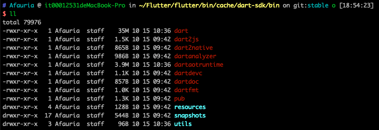
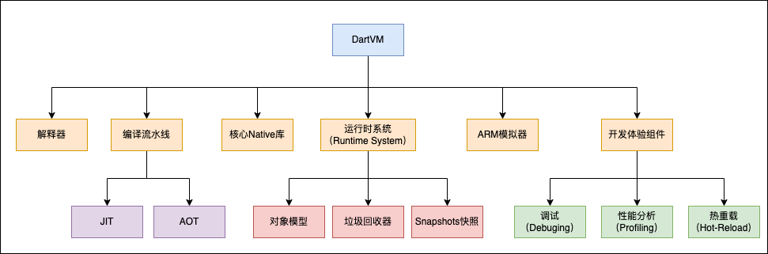
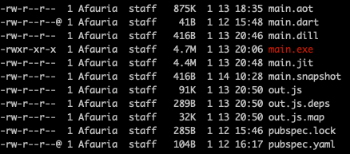

# Dart简介

[官方网站](https://dart.dev/overview)

目标是高效地开发多平台应用，提供灵活的运行时环境和编译工具。

> 理论上所有高级语言都可跨平台，关键在于语法、库好不好用，编译工具成不成熟。下面详细介绍下Dart的多平台支持

## Dart SDK安装

参考[Dart SDK安装](https://dart.dev/get-dart)。Dart SDK中包含了Dart基本类型、类库、编译器、命令行工具等

* Flutter SDK内置了Dart SDK工具，位于`{flutter_sdk}/bin/cache/dart-sdk`中（编译过的Dart SDK），不需要再单独下载。
* Flutter Engine中依赖了Dart SDK的源码，位于`{flutter_engine}/third_party/dart`中，通过ninja构建出Dart SDK可执行程序，供Flutter SDK使用。

## Dart语言

支持众多特性：类型安全（静态类型检查、dynamic运行时检查）、空安全、异步调用、流、箭头函数、getter函数等。基本语法参考[Dart语言](https://dart.dev/guides/language/language-tour)

## Dart库

[核心库](https://dart.dev/guides/libraries)和[三方库](https://dart.dev/guides/libraries/useful-libraries)

## Dart工具

Dart SDK中提供了一些工具，使用`-h`查看帮助或者参考[Dart命令行工具](https://dart.dev/tools/dart-tool)。源码入口位于`{dart_sdk}/pkg/dartdev/`中



* `dart`：用于创建、格式化、分析、测试、编译和运行dart代码
* `dartaotruntime`：用于执行aot预编译过机器码
* `dartdoc`：用于生成API文档

除了上面三个工具外，还有`dart2js`、`dart2native`、`dartanalyzer`、`dartdevc`、`dartfmt`、`pub`等工具。这些工具从2.10版本开始全部被封装到了`dart`中，通过`dart <subcommand>`的方式执行：

* `dart2native`, `dart2aot`,  `dart2js` 工具被 `dart compile` 替代
* `dartanalyzer`被`dart analyze`替代
* `dartfmt`被`dart format`替代
* `pub`被`dart pub`替代

`{flutter_sdk}/bin/dart`对`dart-sdk`的工具做了一层包装，执行的时候会调用`dart-sdk`中的工具。

> 由于配置Flutter SDK环境变量`{flutter_sdk}/bin`的时候没有配置`dart-sdk`的环境变量，如果要使用`dartaotruntime`工具，需要进入对应目录执行，或者给`dart-sdk`也配置环境变量

## Dart的编译和执行

### Dart虚拟机

Dart虚拟机源码位于`{dart_sdk}/runtime/vm`中，包含以下几个部分：



DartVM作为虚拟机为Dart高级语言提供执行环境，但这并不表示Dart一定运行在虚拟机中。Dart的运行主要有几种方式：

* 虚拟机执行：通过JIT即时编译+解释器，执行Dart源文件或者Kernel二进制文件，运行在Dart虚拟机中。对应`dart run`命令
* 目标代码执行：通过AOT预编译成目标代码，运行在预编译运行时环境（Precompiled Runtime）中。不包含编译器，因此无法动态加载Dart源码。对应`dartaotruntime`命令

> * 开发阶段：运行在Dart虚拟机中，通过Dart虚拟机提供的即时编译器（JIT）执行，支持增量编译，热重载和调试。
> * 发布阶段：通过Dart的AOT编译器编译成目标平台的代码，在Dart预编译运行时（Precompiled Runtime）中执行，提高启动速度和执行效率。
>
> Dart 2之后，Dart VM不支持直接执行源代码，只接收Kernel AST序列化成的Kernel二进制文件（即.dill文件）。通过Dart的[编译前端（CFE，common front-end）](https://github.com/dart-lang/sdk/tree/master/pkg/front_end)编译，并被其他工具所依赖使用，例如Dart VM、dart2js、Dart Dev Compiler。

Dart运行时会被打包到`Self-Contained`的目标可执行程序中，同时也是Dart虚拟机的一部分，包含以下功能

* 内存管理：提供对象分配和分代垃圾回收功能。
* 运行时类型检查和强制转换
* 管理`isolates`：包括主isolate和应用自行创建的isolate

### 虚拟机执行

使用`dart run`命令启动虚拟机执行程序，如下

1. 新建`main.dart`文件

   ```dart
   //main.dart
   void main() {
     print('Hello, World!');
   }
   ```

2. 执行`dart main.dart`，输出"Hello, World!"

> run子命令启动一个Dart虚拟机，执行未编译过的源码或者部分快照类型（JIT、Kernel快照），不支持执行aot快照。
>
> 可以省略，例如`dart main.dart`，`dart main.dill`

### Dart编译

* Dart编译前端（frontend，`{dart_sdk}/pkg/front_end`）：将Dart源码编译为Kernel二进制文件，是一种平台无关的中间代码。
* Dart编译后端（gen_snapshot，`{dart_sdk}/runtime/bin/gen_snapshot.cc`）：将Kernel二进制文件编译出目标代码
  * 将Kernel二进制代码生成一个控制流图（CFG，control flow graph），CFG由中间语言（IL，Intermediate Language）指令组成。
  * 对IL指令进行优化
  * CFG编译成机器码，每个IL指令对应多个机器指令

> IL指令类似于虚拟机指令，从堆栈中获取操作数，执行操作，将结果推送到堆栈中

使用`dart compile`命令进行编译，分为以下几种方式：

1. `exe`：生成`Self-Contained`可执行文件，**包含生成的目标代码和一个小型的Dart运行时**，可以直接运行
   1. 编译：`dart compile exe main.dart`，生成`main.exe`文件
   2. 运行：`./main.exe`，输出"Hello, World!"
2. `aot-snapshot`：生成AOT快照文件，**包含生成的目标代码，但不包含Dart运行时**，需要使用`dartaotruntime`执行
   1. 编译：`dart compile aot-snapshot main.dart`，生成`main.aot`文件
   2. 执行`dartaotruntime main.aot`，输出"Hello, World!"
3. `jit-snapshot`：生成JIT快照文件，**包含生成的目标代码，不同的是在训练运行期间已经加载和解析过代码**，使用`dart run`运行。由于在训练运行期间已经解析和编译过，Dart虚拟机不需要再进行解析和编译，因此可以更快的执行代码。（经过训练和优化，有可能比aot执行更快）
   1. 编译：`dart compile jit-snapshot main.dart`，生成`main.jit`文件，并且会执行一遍程序训练，输出"Hello, World!"
   2. 运行：`dart run main.jit`，输出"Hello, World!"
4. `kernel`：生成`.dill`二进制的kernel快照文件，**是一种中间代码，和平台无关，具有可移植性**。包含二进制格式的Dart抽象语法树（Kernel AST）
   1. 编译：`dart compile kernel main.dart`，生成`main.dill`文件
   2. 执行：`dart run main.dill`，输出"Hello, World!"
5. `js`：生成js文件
   1. 编译：`dart compile js main.dart`，生成`out.js`文件
   2. 可以使用`webdev serve`命令启动开发服务器运行js

`exe`和`aot-snapshot`存在一些限制：

1. 不支持交叉编译、只能本地编译本地运行：需要在macOS、Windows、Linux主机上分别编译出三个目标程序
2. 生成的可执行程序不支持签名
3. 不支持`dart:mirrors`（用于动态反射）和`dart:developer`（用于调试检查）库，参考[Dart核心库](https://dart.dev/guides/libraries)说明

对比下编译产物文件，如下：`exe > jit-snapshot > aot-snapshot > kernel > dart source code`，一般情况下执行效率刚好相反。



`.snapshot`文件？

在Flutter SDK中经常看到`.snapshot`后缀的文件，如`flutter_tools.snapshot`，查看Flutter命令脚本中源码使用了`dart --snapshot`命令，官网没有说明。使用`dart --snapshot`查看帮助如下：


`--snapshot`用于生成快照文件，`--snapshot-kind`指定生成JIT快照还是kernel快照。默认生成kernel快照。

`dart compile kernel/jit-snapshot`等价于`dart --snapshot-kind=kernel/app-jits`。只不过是新版本Dart工具统一封装到compile中而已。

例如`dart --snapshot=main.snapshot main.dart`生成`main.snapshot`，`dart compile kernel main.dart`生成`main.dill`。`main.dill`和`main.snapshot`实际上是一样的，都是Kernel快照文件。

查看`{dart_sdk}/pkg/dartdev/lib/src/commands/compile.dart`源码发现`dart compile kernel`和`dart compile jit-snapshot`命令实际会调用`dart --snapshot-kind=$formatName`执行。如下

```dart
//dart compile命令
class CompileCommand extends DartdevCommand {
  static const String cmdName = 'compile';
  CompileCommand({bool verbose = false})
      : super(cmdName, 'Compile Dart to various formats.', verbose) {
    addSubcommand(CompileJSCommand(verbose: verbose));
    addSubcommand(CompileSnapshotCommand( //dart compile jit-snapshot子命令
      commandName: CompileSnapshotCommand.jitSnapshotCmdName,
      help: 'to a JIT snapshot.\n'
          'To run the snapshot use: dart run <JIT file>',
      fileExt: 'jit',
      formatName: 'app-jit',
      verbose: verbose,
    ));
    addSubcommand(CompileSnapshotCommand( //dart compile kernel子命令
      commandName: CompileSnapshotCommand.kernelCmdName,
      help: 'to a kernel snapshot.\n'
          'To run the snapshot use: dart run <kernel file>',
      fileExt: 'dill',
      formatName: 'kernel',
      verbose: verbose,
    ));
    addSubcommand(CompileNativeCommand(
      commandName: CompileNativeCommand.exeCmdName,
      help: 'to a self-contained executable.',
      format: 'exe',
      verbose: verbose,
    ));
    addSubcommand(CompileNativeCommand(
      commandName: CompileNativeCommand.aotSnapshotCmdName,
      help: 'to an AOT snapshot.\n'
          'To run the snapshot use: dartaotruntime <AOT snapshot file>',
      format: 'aot',
      verbose: verbose,
    ));
  }
}

class CompileSnapshotCommand extends CompileSubcommandCommand {
  static const String jitSnapshotCmdName = 'jit-snapshot';
  static const String kernelCmdName = 'kernel';

  final String commandName;
  final String help;
  final String fileExt;
  final String formatName;

  @override
  FutureOr<int> run() async {
    //...
    List<String> args = [];
    args.add('--snapshot-kind=$formatName');
    args.add('--snapshot=${path.canonicalize(outputFile)}');
    final process = await startDartProcess(sdk, args);
    return process.exitCode;
  }
}
```

### Web平台

dart支持在Web平台上执行，既不是JIT也不是AOT：生成JavaScript代码，运行在浏览器中，而不是目标平台代码

1. 开发阶段使用`dartdevc`增量式编译器
2. 生产环境使用`dart2js`编译器，高版本替换为`dart compile js`命令

官方建议使用[webdev](https://dart.dev/tools/webdev)工具，而不是直接使用`dartdevc`和`dart2js`工具。

* `webdev serve`：编译并部署到开发服务器，使用`localhost:8080`访问。默认使用`dartdevc`编译。添加`--release`选项，替换为`dart2js`编译
* `webdev build`：默认使用`dart2js`，添加`--no-release`选项，替换为`dartdevc`编译

## Dart项目文件

Dart使用`pubspec.yaml`文件保存项目信息、发布信息、依赖包等。[pubspec说明](https://dart.dev/tools/pub/pubspec)

> 类似npm的`package.json`，本地会缓存依赖包，不同项目可以共用本地缓存的依赖包

可以使用`dart pub <subcommand>`命令管理项目，如add添加依赖，get获取依赖等。可以用`dart pub -h`查看帮助，也可以看[dart pub说明](https://dart.dev/tools/pub/cmd)

> **如果用dart开发Flutter程序，使用`flutter pub <subcommand>`命令替代，flutter对dart命令进行了一层包装**

新建`pubspec.yaml`文件

```yaml
name: myapp # 项目名称

environment: # dart版本
  sdk: ">=2.12.0 <3.0.0"

dependencies:  # 依赖包
  js: ^0.6.0
```

执行`dart pub get`获取依赖，会生成几个文件。不需要提交，加到`.gitignore`中

1. `pubspec.lock`：保存项目信息
2. `.packages`：已经弃用，替换为`package_config.json`文件
3. `.dart_tool/package_config.json`：将依赖包映射到系统缓存该包的路径

`main.dart`中可以导入包使用，运行时会从`package_config.json`中查找依赖包路径

```dart
import 'package:js/js.dart' as js;
```

`dart compile`和`dart --snapshot`可以使用`--packages=<path>`选项指定`.packages`文件或者`package_config.json`文件，用于编译时查找依赖包路径

# 结语

了解Dart编译方式和产物，以及执行原理，可以为动态化，分包等提供一些思路，甚至修改虚拟机、编译器等。

参考资料：

* [Dart官网](https://dart.dev/overview)
* [Introduction to Dart VM](https://mrale.ph/dartvm/)
* [Dart Wiki](https://github.com/dart-lang/sdk/wiki)
* [Dart VM介绍](https://www.jianshu.com/p/a5b1997a01ba)
