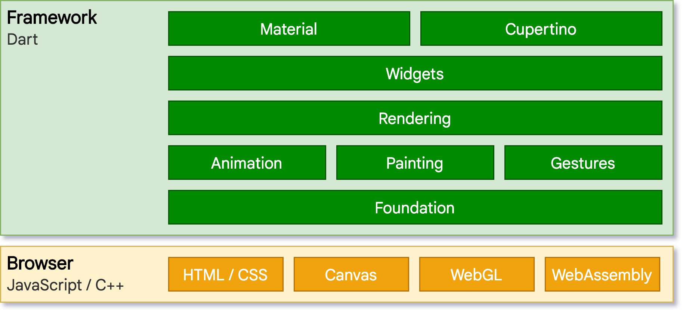
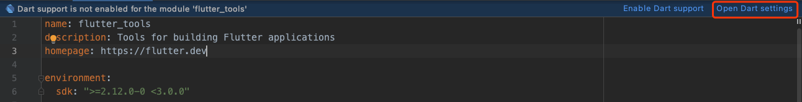
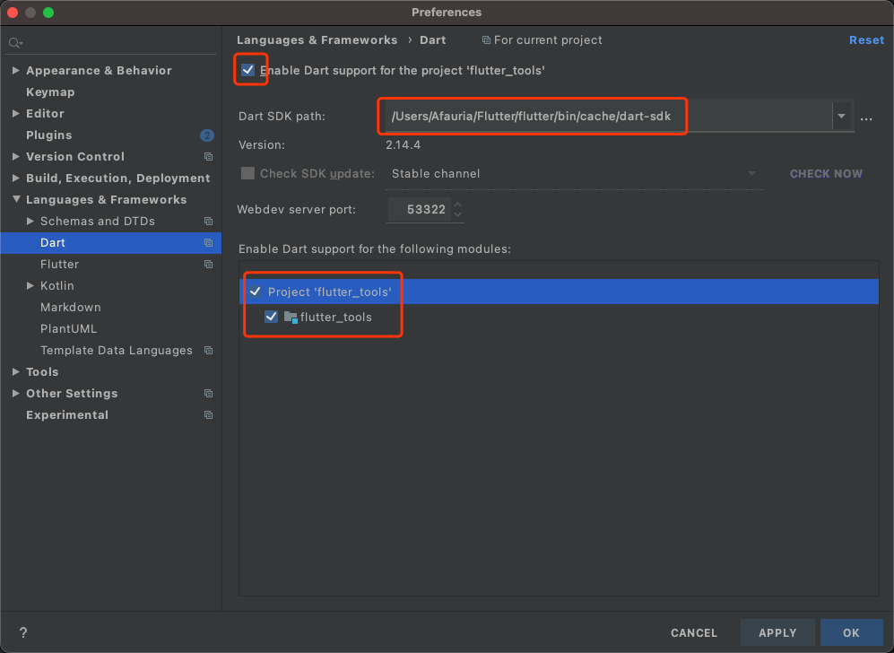
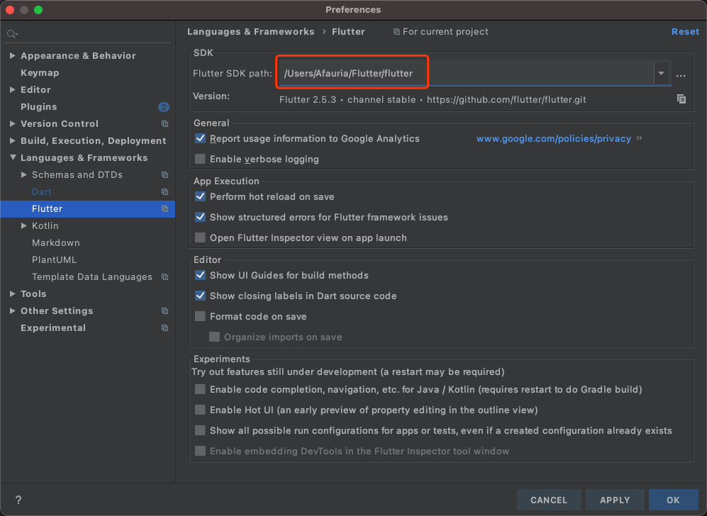

# Flutter架构

Flutter源码包含两部分：

1. [Flutter Engine](https://github.com/flutter/engine)：负责Flutter渲染和与宿主机的交互。包括图形渲染、网络IO、插件通道、Dart运行时、平台嵌入层等
2. [Flutter Framework](https://github.com/flutter/flutter)：为开发者提供dart封装的API接口和开发调试工具。类似Android SDK，应用开发者只需要下载和使用SDK，一般不需要接触底层系统代码。

> Flutter SDK默认会缓存官方构建好的engine artifact，打包到应用中

架构如下：


1. 嵌入层：源码包含在Engine中的`shell/platform`文件夹下。适配了多个平台，使用当前平台语言编写，提供营养程序入口，程序通过嵌入层与底层操作系统交互，例如访问surface渲染、辅助功能、输入设备、线程管理、窗口管理等。
2. 引擎层：提供Flutter核心API实现，包括图形（Skia）和动画，文本布局、文件、网络IO、插件通道、Dart运行环境以及编译环境的工具链。引擎将底层C++代码包装成Dart代码，即`dart:ui`，供上层使用。
3. 框架层：提供Flutter应用开发的框架，包括响应式框架、布局、组件、基础库等
   1. foundation：提供上层常用的抽象和函数
   2. 基本模块：如 [animation](https://api.flutter-io.cn/flutter/animation/animation-library.html)、 [painting](https://api.flutter-io.cn/flutter/painting/painting-library.html) 和 [gestures](https://api.flutter-io.cn/flutter/gestures/gestures-library.html)
   3. 渲染层：提供布局操作的抽象，构建可渲染对象的树
   4. widgets层：和渲染层中的渲染对象对应，并提供响应式编程模型
   5. Material和Cupertino：封装widgets，实现Material和iOS设计规范

4. 软件包：封装开发者常用的功能，分为普通包和插件包
   1. Packages：与平台无关。如http、路由导航、依赖管理、应用内支付、组件等
   2. Plugins：封装原生平台调用，如webview、camera等

5. 应用层：APP主体或以模块的方式集成到原生应用中

> Flutter界面构建、布局、合成、绘制都由自身完成，而不是转换为原生控件。Flutter引擎与平台无关，通过嵌入层ABI调用操作系统方法。
>
> 应用启动时，嵌入层初始化Flutter引擎，获取UI和栅格化线程，创建Surface供Flutter写入

## 平台嵌入层

嵌入层是Flutter实现跨平台的核心。Flutter官方提供了Android、iOS、Windows、macOS、Linux、Fuchsia等平台嵌入层。

**桌面应用需要在对应的平台上编译（见[Flutter桌面支持](https://flutter.cn/desktop)）**，暂不支持交叉编译，移动平台可以交叉编译，推荐使用macOS主机

* macOS支持Android和iOS的交叉编译
* Linux支持Android和Fuchsia的交叉编译，不支持iOS
* Windows不支持Android、Fuchsia或iOS交叉编译

> Linux x64主机交叉编译Linux arm64目标平台应用：参考[issue](https://github.com/flutter/flutter/issues/74929)和[说明](https://docs.google.com/document/d/19tzWySgtgtTA99XQsjx5Pg0SFJeZKXyUlYavR0EXv8c/edit#)

Flutter最早只支持Android、iOS跨平台、不支持桌面平台。为了移植到桌面，出现了一些自定义嵌入层的项目

* [go-flutter](https://github.com/go-flutter-desktop/go-flutter)：使用go语言和GLFW实现桌面平台支持。
* [Flutter Desktop Embedding](https://github.com/google/flutter-desktop-embedding)：已经合入到Flutter官方源码中
* [Flutter官方GLFW案例](https://github.com/flutter/engine/tree/master/examples/glfw)：使用GLFW渲染Flutter

> GLFW（Graphics Library Framework，图形库框架）：开源多平台的OpenGL框架，封装OpenGL调用API，用于创建窗口，渲染OpenGL、管理输入等。由C语言实现，GitHub上也有Go语言的实现等

对于嵌入式系统，开发者可以创建自定义的嵌入层。案例：

* VNC风格的远程Flutter会话[Flutter Cast](https://github.com/chinmaygarde/fluttercast)
* [树莓派嵌入层](https://github.com/ardera/flutter-pi)
* [Toyota嵌入层：ivi-homescreen](https://github.com/toyota-connected/ivi-homescreen)
* [Sony嵌入层：flutter-embedded-linux](https://github.com/sony/flutter-embedded-linux)、[Sony扩展Flutter SDK：flutter_eLinux](https://github.com/sony/flutter-elinux)
* [基于Yocto构建的Flutter](https://github.com/meta-flutter/meta-flutter)：支持树莓派、sony、toyota等嵌入式系统构建

## Web上的Flutter

Flutter引擎中的嵌入层是为了与底层操作系统进行交互，而Web是运行在浏览器上的，因此接入方式和其他平台有所不同。

将Flutter代码和框架一起编译成JavaScript。架构如下



# SDK下载和编译

目的：

1. 学习源码
2. 定制框架：如修改`flutter_tools`编译工具等

方法和搭建Flutter开发环境类似

1. 直接clone或先fork到本地：`git clone git@github.com:flutter/flutter.git`

2. 配置环境变量，或者直接进入bin目录执行flutter命令

3. 安装依赖包：`flutter update-packages`

4. 检查环境：`flutter doctor`

5. Android Studio打开`{flutter_framework}/packages/`下的项目，默认会当做Android工程，IDE提示`Dart SDK is not configured`或者`Dart support is not enabled for the module 'flutter_tools'`，如下

   

6. 配置Flutter工程：直接点击上图的`Open Dart Settings`或者打开`Prefereneces>Language>Dart/Flutter`。配置Dart SDK和Flutter SDK路径，对照下Flutter应用项目的配置即可。如下

   

   

7. 配置完之后即可在IDE查看和修改源码

8. 编译源码

   1. 删除`{flutter_framework}/bin/cache/flutter_tools.snapshot`（Dart快照文件）和`{flutter_framework}/bin/cache/flutter_tools.stamp`（当前SDK的commit id文件）
   2. 运行flutter命令的时候会自动编译源码，重新生成dart快照文件。

# Engine下载和编译

这里只演示了官方支持的平台编译，还不涉及嵌入层的定制和交叉编译（用于定制的嵌入式平台运行Engine）。

主要有几个目的

1. 学习源码
2. 定制引擎，使得Flutter能够在其他目标平台运行，例如树莓派，鸿蒙系统等
3. 通过压缩、裁剪引擎优化包体积

## 源码下载

[官方文档](https://github.com/flutter/flutter/wiki/Setting-up-the-Engine-development-environment)

`depot_tools`安装：参考[depot_tools介绍](/2022/01/04/工具-2022-01-04-depot_tools介绍/)

1. clone仓库：`git clone https://chromium.googlesource.com/chromium/tools/depot_tools.git`
2. 设置环境变量：`.bash_profile`文件中添加`export PATH=/{your_path}/depot_tools/:$PATH`

生成`.gclient`文件：`gclient config git@github.com:flutter/engine.git --unmanaged --name=src/flutter`

> 也可以手动创建文件填写。这里直接使用官方仓库地址，如果要修改提交源码，则需要fork到自己的仓库下载。

下载源码和依赖项目（大概10个G，不要中断下载）：`gclient sync --verbose`

> 依赖项目如glwf、skia、dart、android sdk等，一般不需要修改，只需要修改flutter engine项目

切换版本：默认获取master分支的版本，建议切换engine版本，与Flutter SDK保持一致，需要进入`src/flutter`目录执行以下命令

````shell
# commitId使用和当前Flutter SDK对应的版本：cat bin/internal/engine.version，如下图
git reset --hard <commiId>
# 再次同步代码：不同engine版本依赖的项目版本可能不同
gclient sync --with_branch_heads --with_tags --verbose
````


> 主机包含多个版本Dart SDK的时候。Dart编译前端、编译后端、以及Dart运行时的版本必须一致，否则会报错版本不匹配。建议切换engine版本，保持Dart SDK版本一致。否则需要进入对应路径下执行命令。
>
> 详情参考[Dart的编译和执行](/2022/01/05/flutter-2022-01-05-Dart的编译和执行/)

## 源码编译

[官方文档](https://github.com/flutter/flutter/wiki/Compiling-the-engine)

使用`gn`生成ninja构建文件（参数参考官方文档）：`{engine_path}/src/flutter/tools/gn --unoptimized --android --runtime-mode debug --android-cpu arm`

> 这里的gn只是一个shell脚本，内部调用`gn gen`命令执行
>
> 对应的构建产物会有多种组合：
>
> - 平台：iOS, Android, macOS, Linux, Windows
> - 构建模式：debug, release, profile
> - 是否优化：opt, unopt
> - cpu架构：arm、arm64、x86、x64
>
> 产物命名格式：`{android/ios/host}_{debug/profile/release}_{unoptimized/optimized}_{cpu架构}`
>
> 除此之外还可以根据图形后端进行编译：如OpenGL、Vulkan、software

构建完之后生成`out`目录，根据参数生成不同文件夹，如`android_debug_unopt`、`ios_debug_unopt`等。

内部包括ninja构建文件、`compile_commands.json`文件（Intellisense，用于编辑器索引）、xcode项目文件等

进入src目录，使用`ninja`编译：`ninja -C out/android_debug_unopt`

> 编译生成的文件在`out/android_debug_unopt`目录下。
>
> * Android引擎编译主要产物是`flutter.jar`，其中包含`libflutter.so`Flutter引擎层代码、`flutter_embedding_debug.jar`嵌入层代码。
> * iOS引擎编译主要产物是`Flutter.framework`，其中包含Flutter引擎层代码、`FlutterEmbedder.framework`嵌入层代码和`icudtl.dat`国际化数据文件。
>
> 上述产物是Flutter框架本身编译出的目标代码，除此之外，还包括Dart SDK产物，如front_end和gen_snapshot编译工具等

## 替换Engine

[官方文档](https://github.com/flutter/flutter/wiki/The-flutter-tool#using-a-locally-built-engine-with-the-flutter-tool)

**Flutter默认会下载和使用官方构建好的engine**，包括各种架构的版本，位于`{flutter_sdk}/bin/cache/artifacts/engine`下。要替换自己编译出来的引擎，有几种方式：

方式一：直接用引擎编译出来的`frontend_server.dart.snapshot`和`gen_snapshot`，手动进行前端编译和后端编译。

方式二：将引擎编译产物拷贝到Flutter SDK缓存路径下，替换官方默认引擎。

方式三：使用`local-engine-src-path`和`--local-engine`选项。如下

````bash
# 指定的引擎需要与构建模式对应：debug版的引擎编译debug版的应用
flutter run --local-engine-src-path {path}/engine/src --local-engine={path}/engine/src/out/host_debug_unopt
````

> flutter引擎和sdk在同级目录下或者`-local-engine`使用绝对路径，可以省略`--local-engine-src-path`参数。
>
> 下面会分析`flutter_tools`解析该参数过程

为Web应用构建，使用主机引擎即可：`flutter run --local-engine=host_debug_unopt -d chrome`

## 源码阅读

参考[官方文档](https://github.com/flutter/flutter/wiki/Setting-up-the-Engine-development-environment)

### Clion

将gn生成的`compile_commands.json`文件复制到`src/flutter`中，使用Clion打开，indexing之后就可以跟踪和跳转代码

> JetBrains系列，需要激活

### Xcode【Objective-C++】

Mac电脑上，对于Objective-C++项目，可以直接打开xcode工程文件`open out/host_debug_unopt/flutter_engine.xcodeproj`

### VSCode【C/C++】

1. 安装cmake：`brew install cmake`

2. 安装cquery或者ccls：`brew install cquery`，`brew install ccls`

   > [cquery](https://github.com/jacobdufault/cquery)已经不再维护，推荐[clangd](https://clangd.llvm.org/)和[ccls](https://github.com/MaskRay/ccls)
   >
   > 三者都是语言服务器，用于代码语义分析，通过插件与其他编辑器一起工作。可以给编辑器添加智能功能：代码提示和补全、格式化、代码跳转、编译错误提示等
   >
   > ccls源自cquery。clangd基于Clang C++编译器，属于LLVM项目

3. [构建cquery](https://github.com/jacobdufault/cquery/wiki/Building-cquery)或者[构建ccls](https://github.com/MaskRay/ccls/wiki/Build)

4. 安装VSCode插件，如`VSCode-cquery`或`vscode-ccls`，配置插件（参考上面cquery和ccls文档）

5. 配置Intellisense文件：

   1. 将gn生成的`compile_commands.json`文件拷贝到要打开的项目根目录，如`src/flutter`下，打开项目
   2. 或者在`c_cpp_properties.json`文件中配置`compile_commands.json`的绝对路径

### VSCode【Java】

对于Java项目，VSCode需要配置jar包依赖。

1. 安装VSCode插件`vscjava.vscode-java-pack`和`vscjava.vscode-java-dependency`
2. 添加文件夹路径，如`shell/platform/android`
3. 打开Java Dependencies资源管理器窗口，或者使用命令打开"Explorer: Focus on Java Dependencies View"
4. 刷新视图窗口
5. 配置`Referenced Libraries`，添加src/third_party/android_embedding_dependencies`文件夹。`

```json
//相当于配置settings.json如下
"java.project.referencedLibraries": [
  "{path to engine}/src/third_party/android_embedding_dependencies/lib/**/*.jar"
]
```

# 结语

参考资料：

* [Flutter架构概览](https://flutter.cn/docs/resources/architectural-overview)
* [Flutter Wiki官方文档](https://github.com/flutter/flutter/wiki/Setting-up-the-Engine-development-environment)
* [Flutter桌面支持](https://flutter.cn/desktop)

gclient使用可以参考[chromium开发工具--gclient](https://www.cnblogs.com/xl2432/p/11596695.html)、[gclient 介绍](https://keyou.github.io/blog/2017/11/02/gclient/)