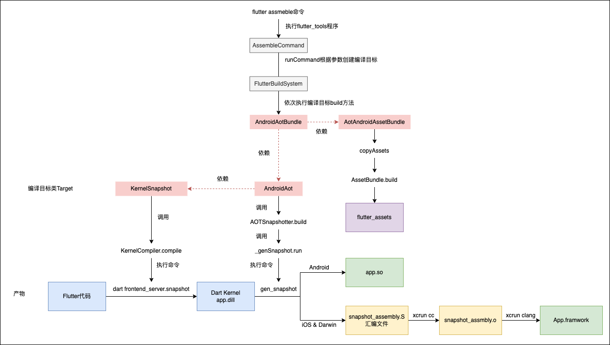
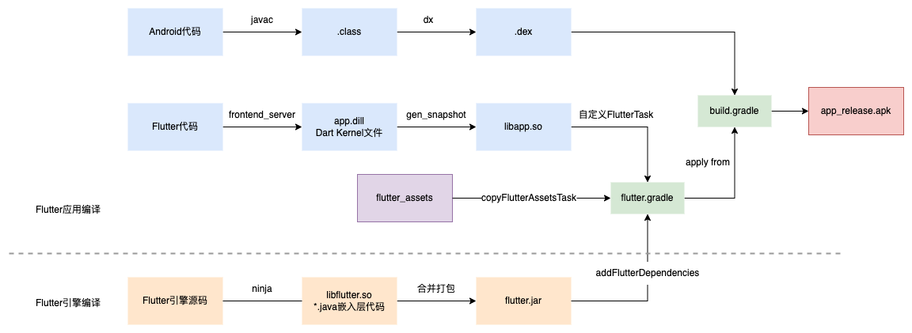
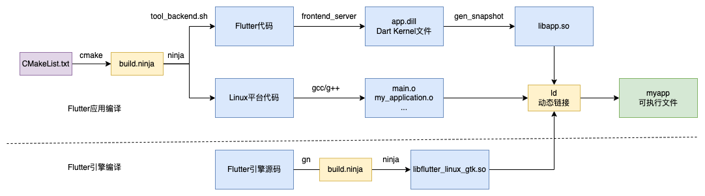
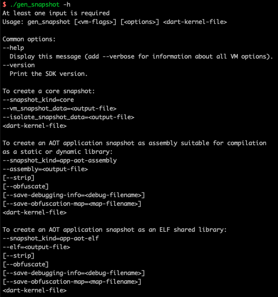
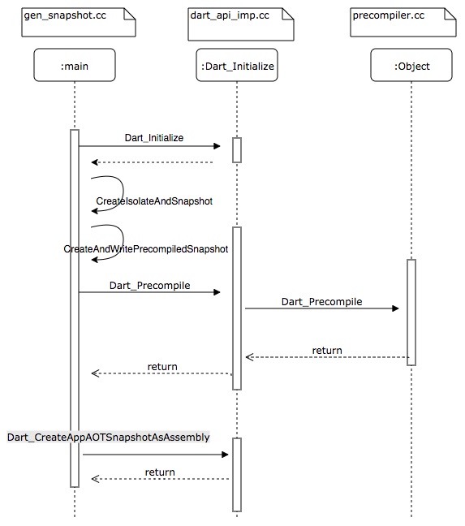

# Flutter命令执行原理

## Flutter命令脚本

查看`{flutter_sdk}/bin/flutter`脚本，内部会调用`shared.sh`脚本的execute方法

```shell
source "$BIN_DIR/internal/shared.sh"
shared::execute "$@"
```

查看`shared.sh`脚本，最终会执行dart命令：

```shell
"$DART" --disable-dart-dev --packages="$FLUTTER_TOOLS_DIR/.packages" $FLUTTER_TOOL_ARGS "$SNAPSHOT_PATH" "$@"
```

* $DART：Dart可执行文件，用于启动Dart虚拟机。对应`{flutter_sdk}/bin/cache/dart-sdk/bin/dart`
* $FLUTTER_TOOLS_DIR：`flutter_tools`项目路径，对应`{flutter_sdk}/packages/flutter_tools`
* $SNAPSHOT_PATH：`flutter_tools`项目的snapshot文件，包含编译过的kernel中间代码，可以被Dart虚拟机执行，对应`{flutter_sdk}/bin/cache/flutter_tools.snapshot`
* $FLUTTER_TOOL_ARGS：用于调试Flutter SDK，一般情况为空。可以开启断言和调试端口。
* $@：输入的参数

因此实际的命令即：`flutter/bin/cache/dart-sdk/bin/dart flutter/bin/cache/flutter_tools.snapshot build apk`

> 类似java执行jar文件：`java -jar main.jar`，jar运行在java环境，snapshot运行在dart环境。

## flutter_tools流程

在AS中打开`flutter/packages/flutter_tools/`源码，配置Dart SDK，支持代码跳转。

`flutter_tools.snapshot`类似jar文件，也有对应的main函数入口，如下：

```dart
//flutter_tools/bin/flutter_tools.dart
import 'package:flutter_tools/executable.dart' as executable;
void main(List<String> args) {
  executable.main(args);
}
```

查看`executable.dart`源码如下：创建了多个Command子类

```dart
//flutter_tools/lib/executable.dart
Future<void> main(List<String> args) async {
  //...
  await runner.run(
    args,
    () => generateCommands(
      verboseHelp: verboseHelp,
      verbose: verbose,
    ),
    //...
  );
}

List<FlutterCommand> generateCommands({
  @required bool verboseHelp,
  @required bool verbose,
}) => <FlutterCommand>[
  //省略其他命令...
  CreateCommand(verboseHelp: verboseHelp),
  BuildCommand(verboseHelp: verboseHelp),
  RunCommand(verboseHelp: verboseHelp),
  AssembleCommand(verboseHelp: verboseHelp, buildSystem: globals.buildSystem),
  //...
];

```

查看`runner.run`源码：根据参数找到对应的Command类

```dart
//flutter_tools/lib/runner.dart
Future<int> run(
  List<String> args,
  List<FlutterCommand> Function() commands) async {
	//....
  return runInContext<int>(() async {
    final FlutterCommandRunner runner = FlutterCommandRunner(verboseHelp: verboseHelp);
    commands().forEach(runner.addCommand); //将所有Flutter命令存入map中
    //...
    return runZoned<Future<int>>(() async {
        await runner.run(args); //FlutterCommandRunner根据参数找到对应的Command执行
  }, overrides: overrides);
}
```

`FlutterCommandRunner`会调用父类`CommandRunner`的run方法

```dart
//package:args/command_runner.dart
class CommandRunner<T> {
  Future<T?> run(Iterable<String> args) => Future.sync(() => runCommand(parse(args)));
  
  Future<T?> runCommand(ArgResults topLevelResults) async {
    var argResults = topLevelResults;
    var commands = _commands; //执行的Flutter命令，参数转换为列表
    Command? command;
    var commandString = executableName;

    while (commands.isNotEmpty) {
      //...
      // Step into the command.
      argResults = argResults.command!;
      command = commands[argResults.name]!; //遍历参数找到对应的命令类和子命令类，先找到BuildCommand类
      command._globalResults = topLevelResults;
      command._argResults = argResults;
      commands = command._subcommands as Map<String, Command<T>>; //找到BuildCommand支持的子命令，下一次循环根据参数匹配子命令
      commandString += ' ${argResults.name}';
    }
    //...
    return (await command.run()) as T?; //执行最终匹配到的Command类的run方法
  }
}
```

例如：`flutter build apk`先找到`BuildCommand`类，Build后面包含多个子命令（如下）。

最终会匹配到`BuildApkCommand`类，然后调用`BuildApkCommand`的run方法

```dart
class BuildCommand extends FlutterCommand {
  BuildCommand({ bool verboseHelp = false }) {
    _addSubcommand(BuildAarCommand(verboseHelp: verboseHelp));
    _addSubcommand(BuildApkCommand(verboseHelp: verboseHelp));
    _addSubcommand(BuildAppBundleCommand(verboseHelp: verboseHelp));
    _addSubcommand(BuildIOSCommand(verboseHelp: verboseHelp));
    _addSubcommand(BuildIOSFrameworkCommand(
      buildSystem: globals.buildSystem,
      verboseHelp: verboseHelp,
    ));
    _addSubcommand(BuildIOSArchiveCommand(verboseHelp: verboseHelp));
    _addSubcommand(BuildBundleCommand(verboseHelp: verboseHelp));
    _addSubcommand(BuildWebCommand(verboseHelp: verboseHelp));
    _addSubcommand(BuildMacosCommand(verboseHelp: verboseHelp));
    _addSubcommand(BuildLinuxCommand(
      operatingSystemUtils: globals.os,
      verboseHelp: verboseHelp
    ));
    _addSubcommand(BuildWindowsCommand(verboseHelp: verboseHelp));
    _addSubcommand(BuildWindowsUwpCommand(verboseHelp: verboseHelp));
    _addSubcommand(BuildFuchsiaCommand(verboseHelp: verboseHelp));
  }
}
```

XXCommand继承自FlutterCommand类，调用FlutterCommand父类的run方法，如下：`verifyThenRunCommand`验证命令并调用runCommand方法。注释中说明了让子类重写`runCommand`来执行命令。

```dart
abstract class FlutterCommand extends Command<void> {
  /// Rather than overriding this method, subclasses should override
  /// [verifyThenRunCommand] to perform any verification
  /// and [runCommand] to execute the command
  /// so that this method can record and report the overall time to analytics.
  @override
  Future<void> run() {
    return context.run<void>(
      name: 'command',
      overrides: <Type, Generator>{FlutterCommand: () => this},
      body: () async {
        //...
        try {
          //验证命令并调用runCommand方法
          commandResult = await verifyThenRunCommand(commandPath); 
        } finally {
          //...
        }
      },
    );
  }
```

## 替换flutter_tools原理

`flutter_tools.snapshot`对应的源码位于`{flutter_framework}/packages/flutter_tools/`中，可以直接修改。

修改了`flutter_tools`源码之后如何编译并替换呢？

查看`bin/internal/shared.sh`脚本的`upgrade_flutter`方法

```shell
function upgrade_flutter () (
  mkdir -p "$FLUTTER_ROOT/bin/cache"

  local revision="$(cd "$FLUTTER_ROOT"; git rev-parse HEAD)"

  # Invalidate cache if:
  #  * SNAPSHOT_PATH is not a file, or
  #  * STAMP_PATH is not a file with nonzero size, or
  #  * Contents of STAMP_PATH is not our local git HEAD revision, or
  #  * pubspec.yaml last modified after pubspec.lock
  if [[ ! -f "$SNAPSHOT_PATH" || ! -s "$STAMP_PATH" || "$(cat "$STAMP_PATH")" != "$revision" || "$FLUTTER_TOOLS_DIR/pubspec.yaml" -nt "$FLUTTER_TOOLS_DIR/pubspec.lock" ]]; then
    # 等待锁
    _wait_for_lock
    # 获取锁之后再次判断，防止并发
    # A different shell process might have updated the tool/SDK.
    if [[ -f "$SNAPSHOT_PATH" && -s "$STAMP_PATH" && "$(cat "$STAMP_PATH")" == "$revision" && "$FLUTTER_TOOLS_DIR/pubspec.yaml" -ot "$FLUTTER_TOOLS_DIR/pubspec.lock" ]]; then
      exit $?
    fi
    
    #...
    
    # 重新编译生成快照文件snapshot
    "$DART" --verbosity=error --disable-dart-dev $FLUTTER_TOOL_ARGS --snapshot="$SNAPSHOT_PATH" --packages="$FLUTTER_TOOLS_DIR/.packages" --no-enable-mirrors "$SCRIPT_PATH"
    echo "$revision" > "$STAMP_PATH"
  fi
  exit $?
)
```

  什么时候会重新编译`flutter_tools`？

> 注释已经写的很清楚了：
>
> 1. snapshot或者stamp文件不存在
> 2. stamp的commit id不是当前的HEAD id
> 3. pubspec.yaml文件被修改

## 替换本地引擎原理

根据[官方文档](https://github.com/flutter/flutter/wiki/The-flutter-tool#using-a-locally-built-engine-with-the-flutter-tool)，Flutter可以指定`local-engine`和`local-engine-src-path`选项来替换为本地编译引擎，这是如何生效的呢？

直接找到解析`local-engine-src-path`参数的地方：

```dart
//lib/src/runner/flutter_command_runner
class FlutterCommandRunner extends CommandRunner<void> {
  @override
  Future<void> runCommand(ArgResults topLevelResults) async {
    //传入参数，执行命令，根据local-engine参数获取本地构建的引擎
    // Set up the tooling configuration.
    final EngineBuildPaths engineBuildPaths = await globals.localEngineLocator.findEnginePath(
      topLevelResults['local-engine-src-path'] as String,
      topLevelResults['local-engine'] as String,
      topLevelResults['packages'] as String,
    );
  }
}
```

查看`findEnginePath`方法，如何获取引擎路径

```dart
//lib/src/runner/local_engine.dart
class LocalEngineLocator {
  /// Returns the engine build path of a local engine if one is located, otherwise `null`.
  Future<EngineBuildPaths?> findEnginePath(String? engineSourcePath, String? localEngine, String? packagePath) async {
    //如果没有指定参数，从系统环境变量$FLUTTER_ENGINE读取
    engineSourcePath ??= _platform.environment[kFlutterEngineEnvironmentVariableName];
    
    if (engineSourcePath == null && localEngine != null) {
      try {
        //如果local-engine参数是绝对路径，且父文件夹为src/out/，则使用src目录
        engineSourcePath = _findEngineSourceByLocalEngine(localEngine);
        //从配置中读取
        engineSourcePath ??= await _findEngineSourceByPackageConfig(packagePath);
      } on FileSystemException catch (e) {
        _logger.printTrace('Local engine auto-detection file exception: $e');
        engineSourcePath = null;
      }
      //判断如果engine源码和flutter sdk目录同级，则不需要该参数
      engineSourcePath ??= _tryEnginePath(
        _fileSystem.path.join(_fileSystem.directory(_flutterRoot).parent.path, 'engine', 'src'),
      );
    }
		//...
    return null;
  }
  String? _findEngineSourceByLocalEngine(String localEngine) {
    // When the local engine is an absolute path to a variant inside the
    // out directory, parse the engine source.
    // --local-engine /path/to/cache/builder/src/out/host_debug_unopt
    if (_fileSystem.path.isAbsolute(localEngine)) {
      final Directory localEngineDirectory = _fileSystem.directory(localEngine);
      final Directory outDirectory = localEngineDirectory.parent;
      final Directory srcDirectory = outDirectory.parent;
      if (localEngineDirectory.existsSync() && outDirectory.basename == 'out' && srcDirectory.basename == 'src') {
        _logger.printTrace('Parsed engine source from local engine as ${srcDirectory.path}.');
        return srcDirectory.path;
      }
    }
    return null;
  }
  Future<String?> _findEngineSourceByPackageConfig(String? packagePath) async {
		//...
  }
  //判断out文件夹是否存在
  String? _tryEnginePath(String enginePath) {
    if (_fileSystem.isDirectorySync(_fileSystem.path.join(enginePath, 'out'))) {
      return enginePath;
    }
    return null;
  }
}
```

如何获取Flutter编译引擎源码路径？`--local-engine-src-path`什么时候可以省略？

> 流程如下
>
> 1. 如果没有指定该参数，从系统环境变量`$FLUTTER_ENGINE`读取源码路径
> 2. 如果`--local-engine`参数是绝对路径，且父文件夹为src/out/，则使用src目录
> 3. 根据`--packages`参数加载`package_config.json`文件，读取`sky_engine`配置路径，例如`{flutter-engine-local-path}/src/out/host_debug_unopt/gen/dart-pkg/sky_engine/lib/`
> 4. 如果engine源码和flutter sdk目录同级，且存在`src/out`文件夹，则使用src目录

## 总结

1. Flutter命令脚本会启动一个dart虚拟机，执行`flutter_tools`的dart程序。
2. `flutter_tools`封装了不同的命令类，通过解析参数，执行对应的Command类，并调用run方法，例如`BuildApkCommand.runCommand()`
2. 替换`flutter_tools`：删除`{flutter_framework}/bin/cache/`下的`flutter_tools.snapshot`和`flutter_tools.stamp`文件，执行flutter命令的时候会重新构建`
2. 替换本地引擎：通过`local-engine`和`local-engine-src-path`选项指定本地引擎路径

# Flutter Android应用构建源码分析

以`flutter build apk`为例，分析apk构建执行过程（其他构建可以自行分析）。

> 上文已经介绍了flutter命令查找过程，这里直接找到`BuildApkCommand`命令

查看`BuildApkCommand`的`runCommand`方法：通过`androidBuilder.buildApk`执行构建，`AndroidBuilder`从`context.get<AndroidBuilder>()`中获取，使用箭头函数，在调用的时候才会创建对象，实现了懒加载。

```dart
//flutter_tools/lib/src/commands/build_apk.dart
class BuildApkCommand extends BuildSubCommand {
  @override
  Future<FlutterCommandResult> runCommand() async {
    if (globals.androidSdk == null) {
      exitWithNoSdkMessage();
    }
    final BuildInfo buildInfo = await getBuildInfo();
    //解析参数
    final AndroidBuildInfo androidBuildInfo = AndroidBuildInfo(
      buildInfo,
      splitPerAbi: boolArg('split-per-abi'),
      targetArchs: stringsArg('target-platform').map<AndroidArch>(getAndroidArchForName),
    );
    validateBuild(androidBuildInfo);
    displayNullSafetyMode(androidBuildInfo.buildInfo);
    await androidBuilder.buildApk(
      project: FlutterProject.current(),
      target: targetFile,
      androidBuildInfo: androidBuildInfo,
    );
    return FlutterCommandResult.success();
  }
}
```

最终会调用`AndroidGradleBuilder`的`buildGradleApp`方法，内部就是拼接`gradle`命令，指定不同的参数，然后执行。例如

```bash
{project_path}/gradlew -q -Ptarget=lib/main.dart -Ptrack-widget-creation=false -Ptarget-platform=android-arm  -Psplit-per-abi=true assembleRelease
```

## flutter.gradle

Android本身的代码构建基本没什么疑问，这里主要关心Flutter项目中的dart代码如何构建打包成so的。

查看`build.gradle`文件，主要是引入了`flutter.gradle`，源码位于`flutter_tools`中

```
apply from: "$flutterRoot/packages/flutter_tools/gradle/flutter.gradle"
```

`flutter.gradle`自定义了gradle插件，解析gradle命令参数，并添加自定义task完成flutter项目的构建和打包。

下面分析几段关键代码：

```groovy
//flutter_tools/gradle/flutter.gradle
class FlutterPlugin implements Plugin<Project> {
  @Override
  void apply(Project project) {
    //添加自定义task
    this.addFlutterTasks(project)
    
    //so分包构建，否则会将多个架构的so打包到一个apk中
    if (shouldSplitPerAbi()) {
      project.android {
        splits {
          abi {
            // Enables building multiple APKs per ABI.
            enable true
            // Resets the list of ABIs that Gradle should create APKs for to none.
            reset()
            // Specifies that we do not want to also generate a universal APK that includes all ABIs.
            universalApk false
          }
        }
      }
    }
    //解析target-platform参数，指定编译目标平台的so
    getTargetPlatforms().each { targetArch ->
      String abiValue = PLATFORM_ARCH_MAP[targetArch]
      project.android {
        if (shouldSplitPerAbi()) {
          splits {
            abi {
              include abiValue
            }
          }
        }
      }
    }
    //添加引擎库：io.flutter:xxx，即libflutter.so
    //添加嵌入层库：io.flutter:flutter_embedding_xxx，即FlutterActivity、FlutterView等
    project.android.buildTypes.all this.&addFlutterDependencies
  }
}
```

查看`addFlutterTask`方法：主要是添加compileTask用于编译Flutter，生成so库。再通过其他Task对产物进行重命名、移动、合并，最终打包出apk

```groovy
class FlutterPlugin implements Plugin<Project> {
  private void addFlutterTasks(Project project) {
    //...
    def targetPlatforms = getTargetPlatforms()
    def addFlutterDeps = { variant ->
      String taskName = toCammelCase(["compile", FLUTTER_BUILD_PREFIX, variant.name])
      FlutterTask compileTask = project.tasks.create(name: taskName, type: FlutterTask) {
        //创建Flutter编译Task：如compileFlutterRelease，编译Flutter代码
      }
      File libJar = project.file("${project.buildDir}/${AndroidProject.FD_INTERMEDIATES}/flutter/${variant.name}/libs.jar")
      //创建Flutter打包Task，并dependsOn等待编译Task执行完成
      Task packFlutterAppAotTask = project.tasks.create(name: "packLibs${FLUTTER_BUILD_PREFIX}${variant.name.capitalize()}", type: Jar) {
        destinationDir libJar.parentFile
        archiveName libJar.name //打包到/build/intermediates/flutter/debug/libs.jar中
        dependsOn compileTask
        targetPlatforms.each { targetPlatform ->
          String abi = PLATFORM_ARCH_MAP[targetPlatform]
          from("${compileTask.intermediateDir}/${abi}") {
            include "*.so"
            // Move `app.so` to `lib/<abi>/libapp.so`
            //Flutter项目代码最终会转换成目标平台的libapp.so文件，将so文件打包到libs.jar中
            rename { String filename ->
              return "lib/${abi}/lib${filename}"
            }
          }
        }
      }
      //将Flutter项目编译打包好的libs.jar包添加到项目依赖中
      addApiDependencies(project, variant.name, project.files {
        packFlutterAppAotTask
      })
      //...
      //这里定义了三个Task：packageAssets、cleanPackageAssets、copyFlutterAssets，将Flutter产物移到/build/app/intermediates/merged_assets/release/out目录下
      Task packageAssets = project.tasks.findByPath(":flutter:package${variant.name.capitalize()}Assets")
      Task cleanPackageAssets = project.tasks.findByPath(":flutter:cleanPackage${variant.name.capitalize()}Assets")
      Task copyFlutterAssetsTask = project.tasks.create(
        name: "copyFlutterAssets${variant.name.capitalize()}",
        type: Copy,
      ) {
        //...
      }
      return copyFlutterAssetsTask
    } // end def addFlutterDeps

    if (isFlutterAppProject()) {
      project.android.applicationVariants.all { variant ->
        Task assembleTask = getAssembleTask(variant)
        if (!shouldConfigureFlutterTask(assembleTask)) {
          return
        }
        Task copyFlutterAssetsTask = addFlutterDeps(variant)
        def variantOutput = variant.outputs.first()
        def processResources = variantOutput.hasProperty("processResourcesProvider") ?
          variantOutput.processResourcesProvider.get() : variantOutput.processResources
        //先编译生成Flutter产物，将Flutter任务加到Android构建流程中
        processResources.dependsOn(copyFlutterAssetsTask)

        variant.outputs.all { output ->
          assembleTask.doLast { //将生成的apk拷贝到对应路径，并重命名：app<-abi>?<-flavor-name>?-<build-mode>.apk
            //...
          }
        }
      }
      configurePlugins()
      return
    }
    //...其他模块编译类似
}
```

查看`FlutterTask`源码如何编译Flutter代码生成`libapp.so`：调用`flutter assemble`命令编译flutter产物

```groovy
class FlutterTask extends BaseFlutterTask {
  //...
  @TaskAction
  void build() {
    //调用父类方法
    buildBundle()
  }
}
abstract class BaseFlutterTask extends DefaultTask {
  void buildBundle() {
    if (!sourceDir.isDirectory()) {
      throw new GradleException("Invalid Flutter source directory: ${sourceDir}")
    }

    intermediateDir.mkdirs()

    // Compute the rule name for flutter assemble. To speed up builds that contain
    // multiple ABIs, the target name is used to communicate which ones are required
    // rather than the TargetPlatform. This allows multiple builds to share the same
    // cache.
    //根据ruleNames找到对应的编译目标
    String[] ruleNames;
    if (buildMode == "debug") {
      ruleNames = ["debug_android_application"]
    } else if (deferredComponents) {
      ruleNames = targetPlatformValues.collect { "android_aot_deferred_components_bundle_${buildMode}_$it" }
    } else {
      ruleNames = targetPlatformValues.collect { "android_aot_bundle_${buildMode}_$it" }
    }
    project.exec { //执行命令flutter assemble命令，加上各种参数，旧版本使用的可能是flutter build aot/bundle命令
      logging.captureStandardError LogLevel.ERROR
      executable flutterExecutable.absolutePath
      workingDir sourceDir
      if (localEngine != null) {
        args "--local-engine", localEngine
        args "--local-engine-src-path", localEngineSrcPath
      }
      if (verbose) {
        args "--verbose"
      } else {
        args "--quiet"
      }
      args "assemble"
      args "--no-version-check"
      args "--depfile", "${intermediateDir}/flutter_build.d"
      args "--output", "${intermediateDir}"
      //省略其他参数...
      args ruleNames
    }
  }
```

> Deferred Component延迟组件：可以在运行时下载Dart代码编译，减少包大小。目前只在Android上可用，利用Android和Google Play商店的动态功能模块实现延迟加载。
>
> 参考[Flutter延迟加载组件](https://flutter.cn/docs/perf/deferred-components)

## flutter assemble编译

直接找到`AssembleCommand`类的`runCommand`方法

```dart
class AssembleCommand extends FlutterCommand {
  @override
  Future<FlutterCommandResult> runCommand() async {
    final List<Target> targets = createTargets(); //根据ruleNames创建编译目标
    final List<Target> nonDeferredTargets = <Target>[];
    final List<Target> deferredTargets = <AndroidAotDeferredComponentsBundle>[]; //延迟组件
    Target target;
    //省略deferredComponents目标判断...
    //调用buildSystem.build方法对target进行编译
    final BuildResult result = await _buildSystem.build(
      target,
      environment,
      buildSystemConfig: BuildSystemConfig(
        resourcePoolSize: argResults.wasParsed('resource-pool-size')
          ? int.tryParse(stringArg('resource-pool-size'))
          : null,
        ),
      );
    //...
    return FlutterCommandResult.success();
  }
  //创建编译目标
  List<Target> createTargets() {
    if (argResults.rest.isEmpty) {
      throwToolExit('missing target name for flutter assemble.');
    }
    final String name = argResults.rest.first;
    final Map<String, Target> targetMap = <String, Target>{ 
      //_kDefaultTargets预定义了一堆默认编译目标，存到map中
      for (final Target target in _kDefaultTargets)
        target.name: target //目标名作为key
    };
    final List<Target> results = <Target>[
      for (final String targetName in argResults.rest)
        //根据rest参数（除了options和flags之外的参数），从map中获取编译目标对象
        //此处的rest即上文中的ruleNames，可以是一个数组，如：[android_aot_bundle_${buildMode}_$it]，$it指目标平台
        if (targetMap.containsKey(targetName))
          targetMap[targetName]
    ];
    if (results.isEmpty) {
      throwToolExit('No target named "$name" defined.');
    }
    return results;
  }
}
```

`FlutterBuildSystem`继承自`BuildSystem`，源码较长，简单来说就是将编译目标Target和其依赖的编译目标，组成一个个编译节点，依次调用Target的build方法。默认的编译目标如下

```dart
//编译目标之间可以有依赖关系
List<Target> _kDefaultTargets = <Target>[
  // Shared targets
  const CopyAssets(),
  const KernelSnapshot(), //生成kernel文件，即app.dill
  const AotElfProfile(TargetPlatform.android_arm),
  const AotElfRelease(TargetPlatform.android_arm), //将dart kernel生成elf文件
  const AotAssemblyProfile(), //将dart kernel生成汇编文件
  const AotAssemblyRelease(),
  // macOS targets
  const DebugMacOSFramework(),
  const DebugMacOSBundleFlutterAssets(),
  const ProfileMacOSBundleFlutterAssets(),
  const ReleaseMacOSBundleFlutterAssets(),
  // Linux targets
  const DebugBundleLinuxAssets(TargetPlatform.linux_x64),
  const DebugBundleLinuxAssets(TargetPlatform.linux_arm64),
  const ProfileBundleLinuxAssets(TargetPlatform.linux_x64),
  const ProfileBundleLinuxAssets(TargetPlatform.linux_arm64),
  const ReleaseBundleLinuxAssets(TargetPlatform.linux_x64),
  const ReleaseBundleLinuxAssets(TargetPlatform.linux_arm64),
  // Web targets
  const WebServiceWorker(),
  const ReleaseAndroidApplication(),
  // This is a one-off rule for bundle and aot compat.
  const CopyFlutterBundle(),
  // Android targets,
  const DebugAndroidApplication(),
  const ProfileAndroidApplication(),
  // Android ABI specific AOT rules.
  androidArmProfileBundle,
  androidArm64ProfileBundle,
  androidx64ProfileBundle,
  androidArmReleaseBundle,
  androidArm64ReleaseBundle,
  androidx64ReleaseBundle,
  // Deferred component enabled AOT rules
  androidArmProfileDeferredComponentsBundle,
  androidArm64ProfileDeferredComponentsBundle,
  androidx64ProfileDeferredComponentsBundle,
  androidArmReleaseDeferredComponentsBundle,
  androidArm64ReleaseDeferredComponentsBundle,
  androidx64ReleaseDeferredComponentsBundle,
  // iOS targets
  const DebugIosApplicationBundle(),
  const ProfileIosApplicationBundle(),
  const ReleaseIosApplicationBundle(),
  // Windows targets
  const UnpackWindows(),
  const DebugBundleWindowsAssets(),
  const ProfileBundleWindowsAssets(),
  const ReleaseBundleWindowsAssets(),
  // Windows UWP targets
  const DebugBundleWindowsAssetsUwp(),
  const ProfileBundleWindowsAssetsUwp(),
  const ReleaseBundleWindowsAssetsUwp(),
];
```

挑一个`androidArmReleaseBundle`编译目标的源码查看，如下：

1. `androidArmReleaseBundle`编译目标对应`AndroidAotBundle`类
2. 依赖`androidArmRelease`编译目标生成`app.so`文件，对应`AndroidAot`类
3. 依赖`AotAndroidAssetBundle`生成`flutter_assets`文件，继承自`AndroidAssetBundle`
4. `AndroidAot`和`AndroidAssetBundle`编译目标都依赖`KernelSnapshot`编译目标
5. 此外，Debug模式的编译目标`DebugAndroidApplication`也继承自`AndroidAssetBundle`，并且拷贝生成`kernel_blob.bin`、`vm_snapshot_data`、`isolate_snapshot_data`到`flutter_assets`下

```dart
//依赖androidArmRelease
const AndroidAotBundle androidArmReleaseBundle = AndroidAotBundle(androidArmRelease); 

class AndroidAotBundle extends Target {
  /// Create an [AndroidAotBundle] implementation for a given [targetPlatform] and [buildMode].
  const AndroidAotBundle(this.dependency);
  //ruleNames匹配的名称
  @override
  String get name => 'android_aot_bundle_${getNameForBuildMode(dependency.buildMode)}_'
    '${getNameForTargetPlatform(dependency.targetPlatform)}';
  
  @override
  List<Source> get inputs => <Source>[
    Source.pattern('{BUILD_DIR}/$_androidAbiName/app.so'),
  ];

  //可以看出AndroidAotBundle只是将app.so移动打包而已
  @override
  List<Source> get outputs => <Source>[
    Source.pattern('{OUTPUT_DIR}/$_androidAbiName/app.so'),
  ];
  
  //依赖androidArmRelease和AotAndroidAssetBundle编译目标
  @override
  List<Target> get dependencies => <Target>[
    dependency,
    const AotAndroidAssetBundle(),
  ];
}
```

首先`KernelSnapshot`目标调用`KernelCompiler.compile`方法，将Flutter代码编译为`app.dill`文件

```dart
class KernelSnapshot extends Target {
  @override
  String get name => 'kernel_snapshot';
  
  @override
  Future<void> build(Environment environment) async {
    final KernelCompiler compiler = KernelCompiler(
      fileSystem: environment.fileSystem,
      logger: environment.logger,
      processManager: environment.processManager,
      artifacts: environment.artifacts,
      fileSystemRoots: <String>[],
      fileSystemScheme: null,
    );
    //...
    //执行frontend_server.dart.snapshot程序
    final CompilerOutput output = await compiler.compile(
      sdkRoot: environment.artifacts.getArtifactPath(
        Artifact.flutterPatchedSdkPath,
        platform: targetPlatform,
        mode: buildMode,
      ),
      outputFilePath: environment.buildDir.childFile('app.dill').path,
      //....
    );
  }
}
```

compile内部实际是执行`frontend_server.dart.snapshot`程序，命令如下，省略部分参数（亲测：修改路径之后可以直接执行，生成app.dill文件）

```shell
dart {flutter_sdk}/bin/cache/artifacts/engine/darwin-x64/frontend_server.dart.snapshot 
--sdk-root {flutter_sdk}/bin/cache/artifacts/engine/common/flutter_patched_sdk/ 
--target=flutter 
--aot --tfa 
-Ddart.vm.profile=false 
-Ddart.vm.product=true 
--packages .packages 
--output-dill {build_dir}/app.dill 
--depfile {build_dir}/kernel_snapshot.d 
{project}/main.dart
```

再查看`AndroidAot`编译目标：可以将`app.dill`文件编译成`app.so`文件

```dart
const AndroidAot androidArmRelease = AndroidAot(TargetPlatform.android_arm,  BuildMode.release);

class AndroidAot extends AotElfBase {
  @override
  String get name => 'android_aot_${getNameForBuildMode(buildMode)}_'
    '${getNameForTargetPlatform(targetPlatform)}';

  //依赖KernelSnapshot编译目标
  @override
  List<Target> get dependencies => const <Target>[
    KernelSnapshot(),
  ];

  @override
  Future<void> build(Environment environment) async {
    final AOTSnapshotter snapshotter = AOTSnapshotter(
      //...
    );
    //...
    final int snapshotExitCode = await snapshotter.build(
      platform: targetPlatform,
      buildMode: buildMode,
      mainPath: environment.buildDir.childFile('app.dill').path,
      outputPath: output.path,
      bitcode: false,
      extraGenSnapshotOptions: extraGenSnapshotOptions,
      splitDebugInfo: splitDebugInfo,
      dartObfuscation: dartObfuscation,
    );
    //...
  }
}
```

`AOTSnapshotter`内部调用`_genSnapshot.run`方法，针对不同目标平台编译不同目标代码

```dart
class AOTSnapshotter {
  /// Builds an architecture-specific ahead-of-time compiled snapshot of the specified script.
  Future<int> build(
  //...
  ) async {
    //添加genSnapshot参数...
    //iOS编译出.S文件
    final String assembly = _fileSystem.path.join(outputDir.path, 'snapshot_assembly.S');
    if (platform == TargetPlatform.ios || platform == TargetPlatform.darwin) {
      genSnapshotArgs.addAll(<String>[
        '--snapshot_kind=app-aot-assembly',
        '--assembly=$assembly',
      ]);
    } else {
      //Android编译出elf文件，.so文件
      final String aotSharedLibrary = _fileSystem.path.join(outputDir.path, 'app.so');
      genSnapshotArgs.addAll(<String>[
        '--snapshot_kind=app-aot-elf',
        '--elf=$aotSharedLibrary',
      ]);
    }
    final SnapshotType snapshotType = SnapshotType(platform, buildMode);
    //执行gen_snapshot程序
    final int genSnapshotExitCode = await _genSnapshot.run(
      snapshotType: snapshotType,
      additionalArgs: genSnapshotArgs,
      darwinArch: darwinArch,
    );
    //iOS上将.S文件再通过XCode编译出.O文件
    return 0;
  }
}
```

`_genSnapshot.run`内部实际是调用对应CPU架构引擎的`gen_snapshot`程序，命令如下，省略部分参数（亲测：修改路径之后可以直接执行，将上步生成的`app.dill`文件生成`app.so`文件）

```bash
{flutter_sdk}/bin/cache/artifacts/engine/android-arm-release/darwin-x64/gen_snapshot 
--deterministic 
--snapshot_kind=app-aot-elf
--elf={output_path}/app.so
app.dill
```

查看`AotAndroidAssetBundle`目标：调用`copyAssets`生成Flutter静态资源文件（如图片、字体文件，配置文件等）并拷贝，如果是Debug模式，还会拷贝快照文件到`flutter_assets`中，而不是打包成`libapp.so`。Debug模式下产物如下：

* `kernel_blob.bin`：Dart编译前端Debug模式（不带`--aot --tfa`参数）生成的Kernel快照文件，即`app.dill`（aot编译的Kernel文件无法直接运行）
* `vm_snapshot_data`和`isolate_snapshot_data`：包含Flutter引擎的虚拟机和特定isolate的Dart堆的初始状态，用于快速启动Dart虚拟机。分别对应引擎产物`vm_isolate_snapshot.bin`、`isolate_snapshot.bin`。
  * 位于缓存引擎路径`{flutter_sdk}/bin/cache/artifacts/engine/darwin-x64`下
  * 或者本地编译引擎路径下`{flutter_engine}/src/out/host_debug_unopt/gen/flutter/lib/snapshot/`下

```dart
abstract class AndroidAssetBundle extends Target {
  @override
  Future<void> build(Environment environment) async {
    //...
    final Directory outputDirectory = environment.outputDir
      .childDirectory('flutter_assets')
      ..createSync(recursive: true);

    // Only copy the prebuilt runtimes and kernel blob in debug mode.
    if (buildMode == BuildMode.debug) {
      final String vmSnapshotData = environment.artifacts.getArtifactPath(Artifact.vmSnapshotData, mode: BuildMode.debug);
      final String isolateSnapshotData = environment.artifacts.getArtifactPath(Artifact.isolateSnapshotData, mode: BuildMode.debug);
      //Debug模式下app.dill复制为kernel_blob.bin，打包到flutter_assets中
      environment.buildDir.childFile('app.dill')
          .copySync(outputDirectory.childFile('kernel_blob.bin').path);
      //这两个文件不需要编译，直接拷贝engine中的产物，例如{flutter_sdk}/bin/cache/artifacts/engine/darwin-x64
      environment.fileSystem.file(vmSnapshotData)
          .copySync(outputDirectory.childFile('vm_snapshot_data').path);
      environment.fileSystem.file(isolateSnapshotData)
          .copySync(outputDirectory.childFile('isolate_snapshot_data').path);
    }
    //调用copyAssets
    final Depfile assetDepfile = await copyAssets(
      environment,
      outputDirectory,
      targetPlatform: TargetPlatform.android,
      buildMode: buildMode,
    );
  }
}
```

FlutterTask用于编译Flutter资源，实际是执行`flutter assemble`命令。编译流程如下：



> * `frontend_server.dart.snapshot`是一个dart程序，作为Dart编译前端，可以将dart源码编译成`.dill`中间代码文件。源码入口为`{flutter_engine}/flutter_frontend_server/bin/starter.dart`，内部会调用Dart SDK中的`frontend_server`，源码位于`{dart_sdk}/pkg/frontend_server`中
> * `gen_snapshot`是一个可执行程序，作为Dart编译后端，可以将`.dill`文件编译成目标代码，生成`.so`或者`App.framework`，源码入口为`{dart_sdk}/runtime/bin/gen_snapshot.cc`

## 总结

1. `BuildApkCommand`类中解析参数，调用gradle命令进行构建，例如`gradlew assembleRelease`
2. `flutter_tools`中自定义了一个gradle脚本`flutter.gradle`，将FlutterTask编译任务加到Android构建中，生成so库，合并打包生成最终的apk。
3. FlutterTask通过执行`flutter assemble`命令来编译Flutter代码和资源。依次构建多个编译目标，例如：
   1. `KernelSnapshot`目标：调用`KernelCompiler.compile()`方法，执行`dart frontend_server.dart.snapshot`命令，生成`.dill`文件
   2. `AndroidAot`目标：调用`AOTSnapshotter.build()`方法，执行`gen_snapshot`命令，生成`app.so`文件
   3. `AotAndroidAssetBundle`目标：调用`AssetBundle.build()`，生成`flutter_assets`资源

> 可以自行调用编译器前端和后端进行编译生成so库，不通过`flutter build`

Flutter构建源码分析整体流程如下：


Android中的Flutter Release产物编译总体流程如下：



# Flutter Linux应用构建源码分析

Linux桌面应用构建方式如下：

* 创建Linux工程：`flutter create --platforms=linux .`
* 开启Linux支持：`flutter config --enable-linux-desktop`
* 开始构建：`flutter build linux --release`

分析`flutter_tools`源码，`BuildLinuxCommand`会调用cmake和ninja命令，如下

```shell
# 执行cmake生成build.ninja文件
$ cmake -G Ninja -DCMAKE_BUILD_TYPE=Release -DFLUTTER_TARGET_PLATFORM=linux-x64 /Users/Afauria/AndroidStudioProjects/flutter_app/linux

# ninja编译
$ ninja -C build/linux/x64/release install
```

> `flutter_tools`内部通过`flutter_tools/lib/src/base/process.dart`的`ProcessUtil.stream()`方法执行命令行，可以在该方法中添加打印，查看执行的具体命令

查看`build.ninja`文件，ninja会调用`tool_backend.sh`脚本，内部会执行`flutter assmeble`命令，找到对应的`BuildTargets`，和Android类似，经过前后端编译生成`app.so`文件

```shell
linux/x64/release/build.ninja:240:  COMMAND = cd /Users/Afauria/AndroidStudioProjects/flutter_app/build/linux/x64/release/flutter && /usr/local/Cellar/cmake/3.19.5/bin/cmake -E env FLUTTER_ROOT=/Users/Afauria/Flutter/flutter PROJECT_DIR=/Users/Afauria/AndroidStudioProjects/flutter_app DART_OBFUSCATION=false TRACK_WIDGET_CREATION=true TREE_SHAKE_ICONS=true PACKAGE_CONFIG=/Users/Afauria/AndroidStudioProjects/flutter_app/.dart_tool/package_config.json FLUTTER_TARGET=lib/main.dart /Users/Afauria/Flutter/flutter/packages/flutter_tools/bin/tool_backend.sh linux-x64 Release
```

同时`build.ninja`中使用clang编译linux平台代码（`main.cc、my_application.cc`等）。

最终链接动态库生成可执行文件。



##  mac上交叉编译Linux（尝试）

Linux应用只能在Linux主机上进行编译，使用mac主机编译Linux会报各种错误。

1. 首先`flutter_tools`限制如下：

```dart
//flutter_tools/lib/src/commands/build_linux.dart
class BuildLinuxCommand extends BuildSubCommand {
  @override
  Future<FlutterCommandResult> runCommand() async {
    //...
    if (!featureFlags.isLinuxEnabled) {
      throwToolExit('"build linux" is not currently supported. To enable, run "flutter config --enable-linux-desktop".');
    }
    if (!globals.platform.isLinux) {
      throwToolExit('"build linux" only supported on Linux hosts.');
    }
    // Cross-building for x64 targets on arm64 hosts is not supported.
    if (_operatingSystemUtils.hostPlatform != HostPlatform.linux_x64 &&
        targetPlatform != TargetPlatform.linux_arm64) {
      throwToolExit('"cross-building" only supported on Linux x64 hosts.');
    }
    // TODO(fujino): https://github.com/flutter/flutter/issues/74929
    if (_operatingSystemUtils.hostPlatform == HostPlatform.linux_x64 &&
        targetPlatform == TargetPlatform.linux_arm64) {
      throwToolExit(
          'Cross-build from Linux x64 host to Linux arm64 target is not currently supported.');
    }
    //...
  }
}
```

注释掉上面的限制，替换sdk中的`flutter_tools`：删除`{flutter_sdk}/bin/cache/`下的`flutter_tools.snapshot`和`flutter_tools.stamp`文件，重新执行`build`命令

2. 执行cmake命令时会报错找不到GTK3+库，使用brew进行安装，再次执行`build`命令

```shell
# mac安装GTK+
$ brew install pkg-config
$ brew install gtk+3
```

3. ninja执行前端编译成功，可以生成`app.dill`文件（位于`.dart_tool/flutter_build`中），后端编译失败：找不到对应的`{flutter_sdk}/bin/cache/artifacts/engine/linux-x64-release/gen_snapshot`程序

注：`gen_snapshot`本身是个可执行程序，这个程序要在Mac主机上运行（Mac的目标代码），`gen_snapshot`同时是个编译器，我们希望在Mac上交叉编译出Linux的目标代码。

而Flutter SDK官方只提供了Android、iOS的交叉编译工具（gen_snapshot），以及桌面环境的本地编译工具，不支持交叉编译Linux。

由于`gen_snapshot`是由Flutter引擎源码编译生成的，可以尝试修改源码，生成能在Mac上运行的Linux交叉编译工具。这里简单尝试了一下，没成功：`./src/flutter/tools/gn --taget-os=linux --linux-cpu=x64 --release`。缺少llvm环境、sysroot等。

要想交叉编译Linux应用，可以利用Docker容器作为编译环境，参考[Flutter编译环境搭建探索](//todo)

# Flutter Run原理

上面分析了如何Flutter应用的构建，那么如何将构建好的产物运行起来，程序入口是哪？

直接从`RunCommand`开始分析。这里不具体分析了，简单介绍下流程：

1. `src/commands/run.dart`：`RunCommand`创建FlutterDevice，根据参数判断调用`ColdRunner`还是`HotRunner`
2. `src/resident_runner.dart`：最终会调用Device的startApp方法
3. `src/android/android_device.dart`：AndroidDevice中是通过`adb shell`安装apk，然后调用`am start`命令，并传参数给`FlutterActivity`
4. `src/desktop_device.dart`：DesktopDevice（桌面设备）中是直接找到可执行程序路径，通过命令启动。

# gen_snapshot产物

上面提到了gen_snapshot将`app.dill`编译为`app.so`，主要由4个文件组成：参考[Flutter-engine-operation-in-AOT-Mode](https://github.com/flutter/flutter/wiki/Flutter-engine-operation-in-AOT-Mode)

* Dart VM Snapshot：虚拟机快照，所有Isolate共享的Dart堆的初始状态，存放在数据段中
* Dart VM Instructions：虚拟机说明，所有Isolate共享的AOT指令，存放在文本段中
* Isolate Snapshot：Isolate快照，特定Isolate的Dart堆的初始状态，存放在数据段中
* Isolate Instructions：Isolate说明，特定Isolate执行的AOT指令，存放在文本段中

**注：这里的vm_snapshot_data和isolate_snapshot_data和上文Debug模式中拷贝的Flutter资源不一样。上文拷贝的是Flutter引擎编译出来的快照，这里是开发者写的Dart代码编译出来的快照。**

结合`gen_snapshot`帮助和源码分析：



```c++
//{dart_sdk}/runtime/bin/gen_snapshot.cc
// The ordering of this list must match the SnapshotKind enum above.
static const char* const kSnapshotKindNames[] = {
    // clang-format off
    "core",
    "core-jit",
    "app",
    "app-jit",
    "app-aot-assembly",
    "app-aot-elf",
    "vm-aot-assembly",
    NULL,
    // clang-format on
};
```

gen_snapshot支持多种编译方式：（亲测可编译）

1. core：输出Dart VM Snapshot、Isolate Snapshot
2. core-jit：输出Dart VM Snapshot、Isolate Snapshot、Dart VM Instructions、Isolate Instructions
3. app和app-jit：输出Dart VM Snapshot、Isolate Snapshot、Isolate Instructions
4. app-aot-elf：输出ELF共享库文件，如`.so`文件
5. app-aot-assembly和vm-aot-assembly：输出`.S`汇编文件

流程如下：



# 结语

了解编译和构建流程有几大作用：

1. 便于分析定位构建错误，一般报错之后可以在`flutter_tools`中搜索关键字，找到报错的地方，分析代码上下文。
2. 可以修改`flutter_tools`流程，定制构建命令，修改编译和打包流程
3. 了解Flutter代码的编译，如何生成产物，合并打包

Flutter SDK包含框架代码、脚手架、编译工具、调试工具和各种脚本等。

Flutter只是一个框架，不是一门语言，Flutter使用了Dart语言，Flutter引擎中的嵌入层（UI渲染、输入输出、以及PlatformChannel等）使用了平台原生语言（如C++，Java等）。

Flutter的编译和跨平台执行实际是Dart代码的编译和跨平台执行，可以看到`front_end`、`gen_snapshot`都是Dart SDK中的代码，Flutter只是对编译命令进行了一些封装，并且将Flutter框架代码也加入编译。

> 通过ninja实现Dart SDK的多平台编译，生成不同平台的gen_snapshot程序，使用不同平台的gen_snapshot程序，可以生成不同平台的目标代码。
>
> 要定制Flutter引擎，交叉编译到不同嵌入式平台运行，可以先研究理解纯Dart程序的交叉编译和运行。

关于Dart编译前端（生成Dart Kernel文件，即`.dill`）和编译后端（生成目标代码）过程可以参考：[Dart的编译和执行](/2022/01/03/flutter-2022-01-05-Dart的编译和执行/)

参考资料：

* [研读Flutter——打包编译流程详解](https://www.jianshu.com/p/4e8ccb02e92d)
