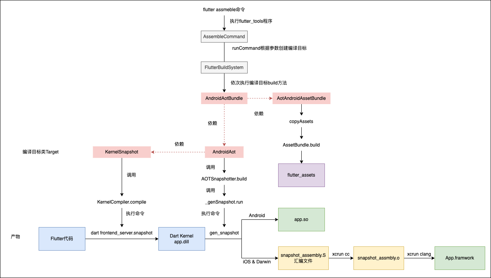
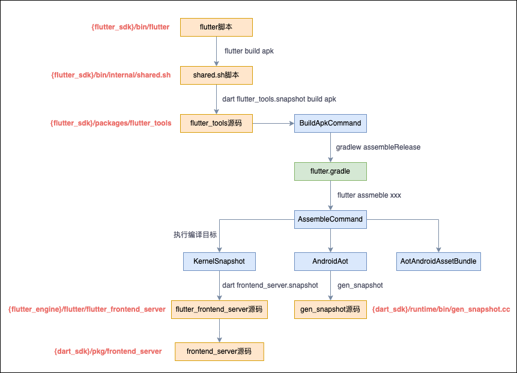
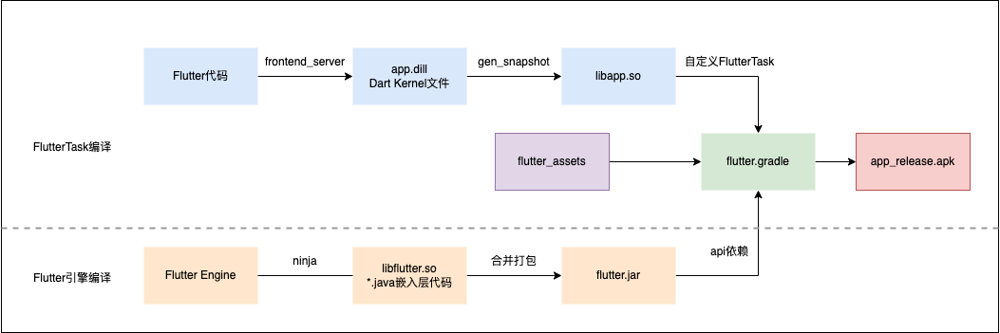

# Flutter构建流程

## 构建模式

* Debug模式下，Flutter应用在VM上运行，能够保存应用状态，提供热重载能力。支持断点，调试信息等。
* Release模式下，Flutter会使用`gen_snapshot`将应用代码预编译成目标平台的机器代码，针对web平台，会编译成JavaScript代码。进行了编译优化、压缩等。
* Profile模式下，与Release类似，会进行预编译，进行了一些优化，使性能更接近Release模式，同时也支持调试和跟踪。模拟器上无法使用该模式

> `flutter run`命令默认为debug模式，`flutter build`命令默认为release模式。构建时可以指定`--debug`、`--release`、`--profile`选项

## Flutter项目构建源码分析

以`flutter build apk`为例，分析apk构建执行过程。目的如下：

1. 便于分析定位构建错误，一般报错之后可以在`flutter_tools`中搜索关键字，找到报错的地方，分析代码上下文。
2. 可以修改`flutter_tools`流程，定制构建命令
3. 了解Flutter代码的编译，如何生成产物然后合并打包

### Flutter命令脚本

查看`{flutter_sdk}/bin/flutter`脚本，内部会调用`shared.sh`脚本的execute方法

```shell
source "$BIN_DIR/internal/shared.sh"
shared::execute "$@"
```

查看`shared.sh`脚本，最终会执行dart命令：

```shell
"$DART" --disable-dart-dev --packages="$FLUTTER_TOOLS_DIR/.packages" $FLUTTER_TOOL_ARGS "$SNAPSHOT_PATH" "$@"
```

* $DART：Dart可执行文件，用于启动Dart虚拟机。对应`{flutter_sdk}/bin/cache/dart-sdk/bin/dart`
* $FLUTTER_TOOLS_DIR：`flutter_tools`项目路径，对应`{flutter_sdk}/packages/flutter_tools`
* $SNAPSHOT_PATH：`flutter_tools`项目的snapshot文件，包含编译过的kernel中间代码，可以被Dart虚拟机执行，对应`{flutter_sdk}/bin/cache/flutter_tools.snapshot`
* $FLUTTER_TOOL_ARGS：用于调试Flutter SDK，一般情况为空。可以开启断言和调试端口。
* $@：输入的参数

因此实际的命令即：`flutter/bin/cache/dart-sdk/bin/dart flutter/bin/cache/flutter_tools.snapshot build apk`

> 类似java执行jar文件：`java -jar main.jar`，jar运行在java环境，snapshot运行在dart环境。

### flutter_tools流程

`flutter_tools.snapshot`类似jar文件，也有对应的main函数入口，位于`flutter/packages/flutter_tools/lib/executable.dart`中，代码如下：

```dart
import 'package:flutter_tools/executable.dart' as executable;
void main(List<String> args) {
  executable.main(args);
}
```

查看`executable.dart`源码：`runner.run`比较复杂，我们只需要知道`flutter build`命令会匹配到`BuildCommand`类即可

```dart
Future<void> main(List<String> args) async {
  //...
  await runner.run(
    args,
    () => generateCommands(
      verboseHelp: verboseHelp,
      verbose: verbose,
    ),
    //...
  );
}

List<FlutterCommand> generateCommands({
  @required bool verboseHelp,
  @required bool verbose,
}) => <FlutterCommand>[
  //省略其他命令...
  BuildCommand(verboseHelp: verboseHelp),
  //...
];

```

查看`runner.run`源码：

```dart
Future<int> run(
  List<String> args,
  List<FlutterCommand> Function() commands) async {
	//....
  return runInContext<int>(() async {
    final FlutterCommandRunner runner = FlutterCommandRunner(verboseHelp: verboseHelp);
    commands().forEach(runner.addCommand); //将所有Flutter命令存入map中
    //...
    return runZoned<Future<int>>(() async {
        await runner.run(args); //FlutterCommandRunner根据参数找到对应的Command执行
  }, overrides: overrides);
}
```

`FlutterCommandRunner`会调用父类`CommandRunner`的run方法

```dart
class CommandRunner<T> {
  Future<T?> run(Iterable<String> args) => Future.sync(() => runCommand(parse(args)));
  
  Future<T?> runCommand(ArgResults topLevelResults) async {
    var argResults = topLevelResults;
    var commands = _commands; //Flutter命令
    Command? command;
    var commandString = executableName;

    while (commands.isNotEmpty) {
      //...
      // Step into the command.
      argResults = argResults.command!;
      command = commands[argResults.name]!; //遍历参数找到对应的命令类和子命令类，先找到BuildCommand类
      command._globalResults = topLevelResults;
      command._argResults = argResults;
      commands = command._subcommands as Map<String, Command<T>>; //找到BuildCommand支持的子命令，下一次循环根据参数匹配子命令
      commandString += ' ${argResults.name}';
    }
    //...
    return (await command.run()) as T?; //执行最终匹配到的Command类的run方法
  }
}
```

先找到`BuildCommand类`：其中包含多个子命令，如下，`flutter build apk`命令最终会匹配到`BuildApkCommand`类，然后调用run方法

```dart
class BuildCommand extends FlutterCommand {
  BuildCommand({ bool verboseHelp = false }) {
    _addSubcommand(BuildAarCommand(verboseHelp: verboseHelp));
    _addSubcommand(BuildApkCommand(verboseHelp: verboseHelp));
    _addSubcommand(BuildAppBundleCommand(verboseHelp: verboseHelp));
    _addSubcommand(BuildIOSCommand(verboseHelp: verboseHelp));
    _addSubcommand(BuildIOSFrameworkCommand(
      buildSystem: globals.buildSystem,
      verboseHelp: verboseHelp,
    ));
    _addSubcommand(BuildIOSArchiveCommand(verboseHelp: verboseHelp));
    _addSubcommand(BuildBundleCommand(verboseHelp: verboseHelp));
    _addSubcommand(BuildWebCommand(verboseHelp: verboseHelp));
    _addSubcommand(BuildMacosCommand(verboseHelp: verboseHelp));
    _addSubcommand(BuildLinuxCommand(
      operatingSystemUtils: globals.os,
      verboseHelp: verboseHelp
    ));
    _addSubcommand(BuildWindowsCommand(verboseHelp: verboseHelp));
    _addSubcommand(BuildWindowsUwpCommand(verboseHelp: verboseHelp));
    _addSubcommand(BuildFuchsiaCommand(verboseHelp: verboseHelp));
  }
}
```

XXCommand继承自FlutterCommand类，调用FlutterCommand父类的run方法，如下：`verifyThenRunCommand`验证命令并调用runCommand方法。注释中说明了让子类重写`runCommand`来执行命令。

```dart
abstract class FlutterCommand extends Command<void> {
  /// Rather than overriding this method, subclasses should override
  /// [verifyThenRunCommand] to perform any verification
  /// and [runCommand] to execute the command
  /// so that this method can record and report the overall time to analytics.
  @override
  Future<void> run() {
    return context.run<void>(
      name: 'command',
      overrides: <Type, Generator>{FlutterCommand: () => this},
      body: () async {
        //...
        try {
          commandResult = await verifyThenRunCommand(commandPath); //验证命令并调用runCommand方法
        } finally {
          //...
        }
      },
    );
  }
```

查看`BuildApkCommand`的`runCommand`方法：通过`androidBuilder.buildApk`执行构建，`AndroidBuilder`从`context.get<AndroidBuilder>()`中获取，使用箭头函数，在调用的时候才会创建对象实现了懒加载。

```dart
class BuildApkCommand extends BuildSubCommand {
  @override
  Future<FlutterCommandResult> runCommand() async {
    if (globals.androidSdk == null) {
      exitWithNoSdkMessage();
    }
    final BuildInfo buildInfo = await getBuildInfo();
    //解析参数
    final AndroidBuildInfo androidBuildInfo = AndroidBuildInfo(
      buildInfo,
      splitPerAbi: boolArg('split-per-abi'),
      targetArchs: stringsArg('target-platform').map<AndroidArch>(getAndroidArchForName),
    );
    validateBuild(androidBuildInfo);
    displayNullSafetyMode(androidBuildInfo.buildInfo);
    await androidBuilder.buildApk(
      project: FlutterProject.current(),
      target: targetFile,
      androidBuildInfo: androidBuildInfo,
    );
    return FlutterCommandResult.success();
  }
}
```

最终会调用`AndroidGradleBuilder`的`buildGradleApp`方法，内部就是拼接`gradle`命令，指定不同的参数，然后执行。例如

```bash
{project_path}/gradlew -q -Ptarget=lib/main.dart -Ptrack-widget-creation=false -Ptarget-platform=android-arm  -Psplit-per-abi=true assembleRelease
```

### flutter.gradle

Android本身的代码构建基本没什么疑问，这里主要关心Flutter项目中的dart代码如何构建打包成so的。

查看`build.gradle`文件，主要是引入了`flutter.gradle`，位于`flutter_tools`中

```
apply from: "$flutterRoot/packages/flutter_tools/gradle/flutter.gradle"
```

`flutter.gradle`自定义了gradle插件，解析gradle命令参数，并添加自定义task完成flutter项目的构建和打包。分析几段关键代码

```groovy
class FlutterPlugin implements Plugin<Project> {
  @Override
  void apply(Project project) {
    //添加自定义task
    this.addFlutterTasks(project)
    
    //so分包构建，否则会将多个架构的so打包到一个apk中
    if (shouldSplitPerAbi()) {
      project.android {
        splits {
          abi {
            // Enables building multiple APKs per ABI.
            enable true
            // Resets the list of ABIs that Gradle should create APKs for to none.
            reset()
            // Specifies that we do not want to also generate a universal APK that includes all ABIs.
            universalApk false
          }
        }
      }
    }
    //解析target-platform参数，指定编译目标平台的so
    getTargetPlatforms().each { targetArch ->
      String abiValue = PLATFORM_ARCH_MAP[targetArch]
      project.android {
        if (shouldSplitPerAbi()) {
          splits {
            abi {
              include abiValue
            }
          }
        }
      }
    }
    //添加引擎库：io.flutter:xxx，即libflutter.so
    //添加嵌入层库：io.flutter:flutter_embedding_xxx，即FlutterActivity、FlutterView等
    project.android.buildTypes.all this.&addFlutterDependencies
  }
}
```

查看`addFlutterTask`方法：主要是添加compileTask用于编译Flutter，生成so库。再通过其他Task对产物进行重命名、移动、合并，最终打包出apk

```groovy
class FlutterPlugin implements Plugin<Project> {
  private void addFlutterTasks(Project project) {
    //...
    def targetPlatforms = getTargetPlatforms()
    def addFlutterDeps = { variant ->
      
      String taskName = toCammelCase(["compile", FLUTTER_BUILD_PREFIX, variant.name])
      FlutterTask compileTask = project.tasks.create(name: taskName, type: FlutterTask) {
        //创建Flutter编译Task：如compileFlutterRelease，编译Flutter代码
      }
      File libJar = project.file("${project.buildDir}/${AndroidProject.FD_INTERMEDIATES}/flutter/${variant.name}/libs.jar")
      //创建Flutter打包Task，并dependsOn等待编译Task执行完成
      Task packFlutterAppAotTask = project.tasks.create(name: "packLibs${FLUTTER_BUILD_PREFIX}${variant.name.capitalize()}", type: Jar) {
        destinationDir libJar.parentFile
        archiveName libJar.name //打包到/build/intermediates/flutter/debug/libs.jar中
        dependsOn compileTask
        targetPlatforms.each { targetPlatform ->
          String abi = PLATFORM_ARCH_MAP[targetPlatform]
          from("${compileTask.intermediateDir}/${abi}") {
            include "*.so"
            // Move `app.so` to `lib/<abi>/libapp.so`
            //Flutter项目代码最终会转换成目标平台的libapp.so文件，将so文件打包到libs.jar中
            rename { String filename ->
              return "lib/${abi}/lib${filename}"
            }
          }
        }
      }
      //将Flutter项目编译打包好的libs.jar包添加到项目依赖中
      addApiDependencies(project, variant.name, project.files {
        packFlutterAppAotTask
      })
      //...
      //这里定义了三个Task：packageAssets、cleanPackageAssets、copyFlutterAssets，将Flutter产物移到/build/app/intermediates/merged_assets/release/out目录下
      Task packageAssets = project.tasks.findByPath(":flutter:package${variant.name.capitalize()}Assets")
      Task cleanPackageAssets = project.tasks.findByPath(":flutter:cleanPackage${variant.name.capitalize()}Assets")
      Task copyFlutterAssetsTask = project.tasks.create(
        name: "copyFlutterAssets${variant.name.capitalize()}",
        type: Copy,
      ) {
        //...
      }
      return copyFlutterAssetsTask
    } // end def addFlutterDeps

    if (isFlutterAppProject()) {
      project.android.applicationVariants.all { variant ->
        Task assembleTask = getAssembleTask(variant)
        if (!shouldConfigureFlutterTask(assembleTask)) {
          return
        }
        Task copyFlutterAssetsTask = addFlutterDeps(variant)
        def variantOutput = variant.outputs.first()
        def processResources = variantOutput.hasProperty("processResourcesProvider") ?
          variantOutput.processResourcesProvider.get() : variantOutput.processResources
        //先编译生成Flutter产物，将Flutter任务加到Android构建流程中
        processResources.dependsOn(copyFlutterAssetsTask)

        variant.outputs.all { output ->
          assembleTask.doLast { //将生成的apk拷贝到对应路径，并重命名：app<-abi>?<-flavor-name>?-<build-mode>.apk
            //...
          }
        }
      }
      configurePlugins()
      return
    }
    //...其他模块编译类似
}
```

查看`FlutterTask`源码如何编译Flutter代码生成so：调用`flutter assemble`命令编译flutter资源

```groovy
class FlutterTask extends BaseFlutterTask {
  //...
  @TaskAction
  void build() {
    //调用父类方法
    buildBundle()
  }
}
abstract class BaseFlutterTask extends DefaultTask {
  void buildBundle() {
    if (!sourceDir.isDirectory()) {
      throw new GradleException("Invalid Flutter source directory: ${sourceDir}")
    }

    intermediateDir.mkdirs()

    // Compute the rule name for flutter assemble. To speed up builds that contain
    // multiple ABIs, the target name is used to communicate which ones are required
    // rather than the TargetPlatform. This allows multiple builds to share the same
    // cache.
    //根据ruleNames找到对应的编译目标
    String[] ruleNames;
    if (buildMode == "debug") {
      ruleNames = ["debug_android_application"]
    } else if (deferredComponents) {
      ruleNames = targetPlatformValues.collect { "android_aot_deferred_components_bundle_${buildMode}_$it" }
    } else {
      ruleNames = targetPlatformValues.collect { "android_aot_bundle_${buildMode}_$it" }
    }
    project.exec { //执行命令flutter assemble命令，加上各种参数，旧版本使用的可能是flutter build aot/bundle命令
      logging.captureStandardError LogLevel.ERROR
      executable flutterExecutable.absolutePath
      workingDir sourceDir
      if (localEngine != null) {
        args "--local-engine", localEngine
        args "--local-engine-src-path", localEngineSrcPath
      }
      if (verbose) {
        args "--verbose"
      } else {
        args "--quiet"
      }
      args "assemble"
      args "--no-version-check"
      args "--depfile", "${intermediateDir}/flutter_build.d"
      args "--output", "${intermediateDir}"
      //省略其他参数...
      args ruleNames
    }
  }
```

> Deferred Component延迟组件：可以在运行时下载Dart代码编译，减少包大小。目前只在Android上可用，利用Android和Google Play商店的动态功能模块实现延迟加载。
>
> 参考[Flutter延迟加载组件](https://flutter.cn/docs/perf/deferred-components)

### flutter assemble编译

有了上面flutter命令执行经验，直接找到`AssembleCommand`类的`runCommand`方法

```dart
class AssembleCommand extends FlutterCommand {
  @override
  Future<FlutterCommandResult> runCommand() async {
    final List<Target> targets = createTargets(); //根据ruleNames创建编译目标
    final List<Target> nonDeferredTargets = <Target>[];
    final List<Target> deferredTargets = <AndroidAotDeferredComponentsBundle>[]; //延迟组件
    Target target;
    //省略deferredComponents目标判断...
    //调用buildSystem.build方法对target进行编译
    final BuildResult result = await _buildSystem.build(
      target,
      environment,
      buildSystemConfig: BuildSystemConfig(
        resourcePoolSize: argResults.wasParsed('resource-pool-size')
          ? int.tryParse(stringArg('resource-pool-size'))
          : null,
        ),
      );
    //...
    return FlutterCommandResult.success();
  }
  //创建编译目标
  List<Target> createTargets() {
    if (argResults.rest.isEmpty) {
      throwToolExit('missing target name for flutter assemble.');
    }
    final String name = argResults.rest.first;
    final Map<String, Target> targetMap = <String, Target>{ //_kDefaultTargets预定义了一堆默认编译目标，存到map中
      for (final Target target in _kDefaultTargets)
        target.name: target //目标名作为key
    };
    final List<Target> results = <Target>[
      for (final String targetName in argResults.rest)
        //根据rest参数（除了options和flags之外的参数），从map中获取编译目标对象
        //此处的rest即上文中的ruleNames，可以是一个数组，如：[android_aot_bundle_${buildMode}_$it]，$it指目标平台
        if (targetMap.containsKey(targetName))
          targetMap[targetName]
    ];
    if (results.isEmpty) {
      throwToolExit('No target named "$name" defined.');
    }
    return results;
  }
}
```

`FlutterBuildSystem`继承自`BuildSystem`，源码较长，简单来说就是将编译目标Target和其依赖的编译目标，组成一个个编译节点，依次调用Target的build方法。默认的编译目标如下

```dart
//编译目标之间可以有依赖关系
List<Target> _kDefaultTargets = <Target>[
  // Shared targets
  const CopyAssets(),
  const KernelSnapshot(), //生成kernel文件，即app.dill
  const AotElfProfile(TargetPlatform.android_arm),
  const AotElfRelease(TargetPlatform.android_arm), //将dart kernel生成elf文件
  const AotAssemblyProfile(), //将dart kernel生成汇编文件
  const AotAssemblyRelease(),
  // macOS targets
  const DebugMacOSFramework(),
  const DebugMacOSBundleFlutterAssets(),
  const ProfileMacOSBundleFlutterAssets(),
  const ReleaseMacOSBundleFlutterAssets(),
  // Linux targets
  const DebugBundleLinuxAssets(TargetPlatform.linux_x64),
  const DebugBundleLinuxAssets(TargetPlatform.linux_arm64),
  const ProfileBundleLinuxAssets(TargetPlatform.linux_x64),
  const ProfileBundleLinuxAssets(TargetPlatform.linux_arm64),
  const ReleaseBundleLinuxAssets(TargetPlatform.linux_x64),
  const ReleaseBundleLinuxAssets(TargetPlatform.linux_arm64),
  // Web targets
  const WebServiceWorker(),
  const ReleaseAndroidApplication(),
  // This is a one-off rule for bundle and aot compat.
  const CopyFlutterBundle(),
  // Android targets,
  const DebugAndroidApplication(),
  const ProfileAndroidApplication(),
  // Android ABI specific AOT rules.
  androidArmProfileBundle,
  androidArm64ProfileBundle,
  androidx64ProfileBundle,
  androidArmReleaseBundle,
  androidArm64ReleaseBundle,
  androidx64ReleaseBundle,
  // Deferred component enabled AOT rules
  androidArmProfileDeferredComponentsBundle,
  androidArm64ProfileDeferredComponentsBundle,
  androidx64ProfileDeferredComponentsBundle,
  androidArmReleaseDeferredComponentsBundle,
  androidArm64ReleaseDeferredComponentsBundle,
  androidx64ReleaseDeferredComponentsBundle,
  // iOS targets
  const DebugIosApplicationBundle(),
  const ProfileIosApplicationBundle(),
  const ReleaseIosApplicationBundle(),
  // Windows targets
  const UnpackWindows(),
  const DebugBundleWindowsAssets(),
  const ProfileBundleWindowsAssets(),
  const ReleaseBundleWindowsAssets(),
  // Windows UWP targets
  const DebugBundleWindowsAssetsUwp(),
  const ProfileBundleWindowsAssetsUwp(),
  const ReleaseBundleWindowsAssetsUwp(),
];
```

挑一个`androidArmReleaseBundle`编译目标的源码：依赖`androidArmRelease`编译目标生成`.so`文件，依赖`AotAndroidAssetBundle`生成`flutter_assets`文件

```dart
const AndroidAotBundle androidArmReleaseBundle = AndroidAotBundle(androidArmRelease); //依赖androidArmRelease

class AndroidAotBundle extends Target {
  /// Create an [AndroidAotBundle] implementation for a given [targetPlatform] and [buildMode].
  const AndroidAotBundle(this.dependency);
  //ruleNames匹配的名称
  @override
  String get name => 'android_aot_bundle_${getNameForBuildMode(dependency.buildMode)}_'
    '${getNameForTargetPlatform(dependency.targetPlatform)}';
  
  @override
  List<Source> get inputs => <Source>[
    Source.pattern('{BUILD_DIR}/$_androidAbiName/app.so'),
  ];

  //可以看出AndroidAotBundle只是将app.so移动打包而已
  @override
  List<Source> get outputs => <Source>[
    Source.pattern('{OUTPUT_DIR}/$_androidAbiName/app.so'),
  ];
  
  //依赖androidArmRelease和AotAndroidAssetBundle编译目标
  @override
  List<Target> get dependencies => <Target>[
    dependency,
    const AotAndroidAssetBundle(),
  ];
}
```

查看`AotAndroidAssetBundle`目标：`copyAssets`中生成Flutter静态资源并拷贝，如果是Debug模式，还会拷贝JIT快照文件

```dart
abstract class AndroidAssetBundle extends Target {
  @override
  Future<void> build(Environment environment) async {
    //...
    final Directory outputDirectory = environment.outputDir
      .childDirectory('flutter_assets')
      ..createSync(recursive: true);

    // Only copy the prebuilt runtimes and kernel blob in debug mode.
    if (buildMode == BuildMode.debug) {
      final String vmSnapshotData = environment.artifacts.getArtifactPath(Artifact.vmSnapshotData, mode: BuildMode.debug);
      final String isolateSnapshotData = environment.artifacts.getArtifactPath(Artifact.isolateSnapshotData, mode: BuildMode.debug);
      environment.buildDir.childFile('app.dill')
          .copySync(outputDirectory.childFile('kernel_blob.bin').path);
      environment.fileSystem.file(vmSnapshotData)
          .copySync(outputDirectory.childFile('vm_snapshot_data').path);
      environment.fileSystem.file(isolateSnapshotData)
          .copySync(outputDirectory.childFile('isolate_snapshot_data').path);
    }
    //调用copyAssets
    final Depfile assetDepfile = await copyAssets(
      environment,
      outputDirectory,
      targetPlatform: TargetPlatform.android,
      buildMode: buildMode,
    );
  }
}
```

查看`androidArmRelease`编译目标：依赖`KernelSnapshot`编译目标生成`.dill`文件，可以将`.dill`文件编译成`.so`文件

```dart
const AndroidAot androidArmRelease = AndroidAot(TargetPlatform.android_arm,  BuildMode.release);

class AndroidAot extends AotElfBase {
  @override
  String get name => 'android_aot_${getNameForBuildMode(buildMode)}_'
    '${getNameForTargetPlatform(targetPlatform)}';

  //依赖KernelSnapshot编译目标
  @override
  List<Target> get dependencies => const <Target>[
    KernelSnapshot(),
  ];

  @override
  Future<void> build(Environment environment) async {
    //...
    final int snapshotExitCode = await snapshotter.build(
      platform: targetPlatform,
      buildMode: buildMode,
      mainPath: environment.buildDir.childFile('app.dill').path,
      outputPath: output.path,
      bitcode: false,
      extraGenSnapshotOptions: extraGenSnapshotOptions,
      splitDebugInfo: splitDebugInfo,
      dartObfuscation: dartObfuscation,
    );
    //...
  }
}
```

`AOTSnapshotter`内部调用`_genSnapshot.run`方法，将`.dill`文件生成`.so`文件

```dart
class AOTSnapshotter {
  /// Builds an architecture-specific ahead-of-time compiled snapshot of the specified script.
  Future<int> build(
  //...
  ) async {
    //添加genSnapshot参数...
    //iOS编译出.S文件
    final String assembly = _fileSystem.path.join(outputDir.path, 'snapshot_assembly.S');
    if (platform == TargetPlatform.ios || platform == TargetPlatform.darwin) {
      genSnapshotArgs.addAll(<String>[
        '--snapshot_kind=app-aot-assembly',
        '--assembly=$assembly',
      ]);
    } else {
      //Android编译出elf文件，.so文件
      final String aotSharedLibrary = _fileSystem.path.join(outputDir.path, 'app.so');
      genSnapshotArgs.addAll(<String>[
        '--snapshot_kind=app-aot-elf',
        '--elf=$aotSharedLibrary',
      ]);
    }
    final SnapshotType snapshotType = SnapshotType(platform, buildMode);
    //执行gen_snapshot程序
    final int genSnapshotExitCode = await _genSnapshot.run(
      snapshotType: snapshotType,
      additionalArgs: genSnapshotArgs,
      darwinArch: darwinArch,
    );
    //iOS上将.S文件再通过XCode编译出.O文件
    return 0;
  }
}
```

最终是调用对应架构引擎的`gen_snapshot`程序，命令如下，省略部分参数

```bash
flutter/bin/cache/artifacts/engine/android-arm-release/darwin-x64/gen_snapshot 
--snapshot_kind=app-aot-elf
--elf={output_path}/app.so
```

`KernelSnapshot`目标调用`KernelCompiler.compile`方法，将Flutter代码编译为`app.dill`文件

```dart
class KernelSnapshot extends Target {
  @override
  String get name => 'kernel_snapshot';
  
  @override
  Future<void> build(Environment environment) async {
    final KernelCompiler compiler = KernelCompiler(
      fileSystem: environment.fileSystem,
      logger: environment.logger,
      processManager: environment.processManager,
      artifacts: environment.artifacts,
      fileSystemRoots: <String>[],
      fileSystemScheme: null,
    );
    //...
    //执行frontend_server.dart.snapshot程序
    final CompilerOutput output = await compiler.compile(
      sdkRoot: environment.artifacts.getArtifactPath(
        Artifact.flutterPatchedSdkPath,
        platform: targetPlatform,
        mode: buildMode,
      ),
      outputFilePath: environment.buildDir.childFile('app.dill').path,
      //....
    );
  }
}
```

最终是执行`frontend_server.dart.snapshot`程序，命令如下，省略部分参数

```shell
flutter/bin/cache/dart-sdk/bin/dart /path-to-flutter-sdk/flutter/bin/cache/artifacts/engine/darwin-x64/frontend_server.dart.snapshot 
--sdk-root flutter/bin/cache/artifacts/engine/common/flutter_patched_sdk/ 
--target=flutter 
--aot --tfa 
--packages .packages 
--output-dill {build_dir}/app.dill 
--depfile {build_dir}/kernel_snapshot.d 
mainUri
```

FlutterTask用于编译Flutter资源，实际是执行`flutter assemble`命令。编译流程如下：



> `frontend_server.dart.snapshot`是一个dart程序，作为Dart编译前端，可以将dart源码编译成`.dill`中间代码文件。源码入口为`{flutter_engine}/flutter_frontend_server/bin/starter.dart`，内部会调用Dart SDK中的`frontend_server`，源码位于`{dart_sdk}/pkg/frontend_server`中
>
> `gen_snapshot`是一个可执行程序，可以将`.dill`文件编译成目标代码，生成`.so`或者`App.framework`，源码入口为`{dart_sdk}/runtime/bin/gen_snapshot.cc`

## 总结

1. Flutter命令脚本会启动一个dart虚拟机，执行`flutter_tools`的dart程序。
2. `flutter_tools`封装了不同的命令类，通过解析参数，执行对应的Command类，例如`BuildApkCommand.runCommand()`
3. Command类中解析参数，最终调用相应平台的构建工具进行构建，例如`gradlew assembleRelease`
4. `flutter_tools`中自定义了一个gradle脚本`flutter.gradle`，将FlutterTask编译任务加到Android构建中，生成so库，合并打包生成最终的apk
5. FlutterTask执行`flutter assemble`命令编译Flutter代码和资源。依次构建多个编译目标，关键的编译目标如下：
   1. `KernelSnapshot`目标：调用`KernelCompiler.compile()`方法，执行`dart frontend_server.dart.snapshot`命令，生成`.dill`文件
   2. `AndroidAot`目标：调用`AOTSnapshotter.build()`方法，执行`gen_snapshot`命令，生成`app.so`文件
   3. `AotAndroidAssetBundle`目标：调用`AssetBundle.build()`，生成`flutter_assets`资源

Flutter构建源码分析流程如下：



Android中的Flutter Release产物编译总体流程如下：



# 结语

关于Dart前端编译（生成Dart Kernel文件，即`.dill`）和AOT编译（生成目标代码）可以参考：[Dart简介](/2022/01/03/Dart简介/)

参考资料：

* [研读Flutter——打包编译流程详解](https://www.jianshu.com/p/4e8ccb02e92d)
