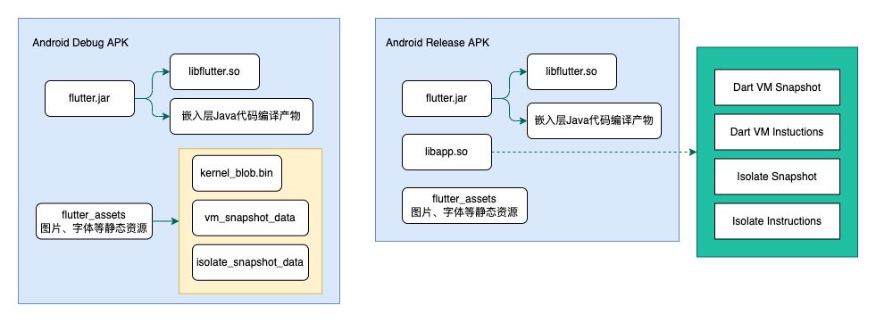
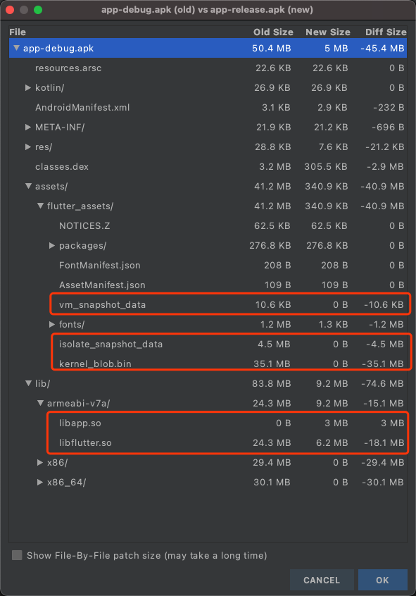
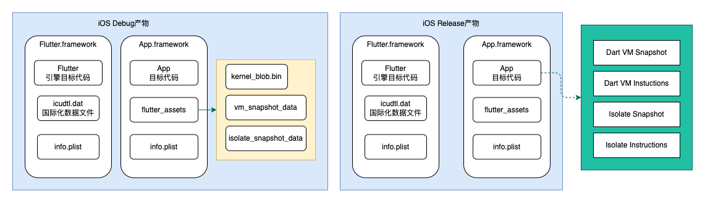

# Flutter支持平台

Flutter支持不同平台应用构建：

* Android：aar、apk、appbundle
* iOS：iOS应用、iOSFramework库、ipa归档文件
* Fuchsia应用
* 桌面应用：MacOS、Linux、Windows
* Web应用
* 自定义嵌入式平台，需要定制引擎构建

`flutter build -h`查看帮助：

```shell
Available subcommands:
  aar             Build a repository containing an AAR and a POM file.
  apk             Build an Android APK file from your app.
  appbundle       Build an Android App Bundle file from your app.
  bundle          Build the Flutter assets directory from your app.
  ios             Build an iOS application bundle (Mac OS X host only).
  ios-framework   Produces .xcframeworks for a Flutter project and its plugins for integration into existing, plain Xcode projects.
  ipa             Build an iOS archive bundle (Mac OS X host only).
  macos           Build a macOS desktop application.
  web             Build a web application bundle.
```

只可以看到移动应用、web应用macOS桌面应用构建，其他桌面应用被隐藏。

查看`flutter_tools`源码如下，需要使用`flutter config --enable-linux/windows/macos-desktop`启用，并且在对应的主机平台上才能进行构建。

```dart
class BuildMacosCommand extends BuildSubCommand {
  @override
  bool get hidden => !featureFlags.isMacOSEnabled || !globals.platform.isMacOS;
}
class BuildLinuxCommand extends BuildSubCommand {
  @override
  bool get hidden => !featureFlags.isLinuxEnabled || !globals.platform.isLinux;
}
class BuildWindowsCommand extends BuildSubCommand {
  @override
  bool get hidden => !featureFlags.isWindowsEnabled || !globals.platform.isWindows;
}
class BuildFuchsiaCommand extends BuildSubCommand {
  @override
  bool hidden = true;
}
```

# Flutter构建模式

* Debug模式下，Flutter应用在VM上运行，能够保存应用状态，提供热重载能力。支持断点，调试信息等。
* Release模式下，Flutter会使用`gen_snapshot`将应用代码预编译成目标平台的机器代码，针对web平台，会编译成JavaScript代码。进行了编译优化、压缩等。
* Profile模式下，与Release类似，会进行预编译，进行了一些优化，使性能更接近Release模式，同时也支持调试和跟踪。模拟器上无法使用该模式

> `flutter run`命令默认为debug模式，`flutter build`命令默认为release模式。构建时可以指定`--debug`、`--release`、`--profile`选项

# 产物分析

不指定`--target-platform`的话，编译出来的目标代码默认包含多个cpu架构。这里控制变量，只对比arm架构的产物。

Flutter支持多个平台，并且Debug和Release产物可能不一样，这里我们以Android和iOS为例，使用默认的Demo项目。这里不关心产物大小的具体数值。

添加`--analyze-size`选项，构建时会记录和输出包信息，生成`*-code-size-analysis_*.json`文件，可以使用DevTools工具进行分析。参考[Flutter官方文档](https://flutter.cn/docs/perf/app-size)

## Android Debug和Release产物对比

分别编译arm架构的Debug和Release包

````shell
flutter build apk --debug --target-platform android-arm
flutter build apk --release --target-platform android-arm
````



使用AS的apkanalyzer工具分析对比apk，如下



* libflutter.so：Flutter引擎编译出的目标代码
* 嵌入层Java代码编译产物：Flutter引擎中嵌入层的Java部分编译出的字节码，最终编译为dex字节码包含在apk中
* libapp.so：Release模式下Dart业务代码编译成的目标代码。由四部分组成：Dart VM Snapshot、Isolate Snapshot、Dart VM Instructions、Isolate Instructions
* flutter_assets：Flutter静态资源文件
  * kernel_blob：Debug模式下Dart业务代码编译成的Kernel代码，是一种中间代码，和平台无关。由`app.dill`拷贝而成。存放在flutter_assets中
  * vm_snapshot_data和isolate_snaphost_data：Debug模式下生成的是**Flutter引擎编译出来**的虚拟机和isolate快照，用于快速启动虚拟机。一般情况下拷贝自`{flutter_sdk}/bin/cache/artifacts/engine/darwin-x64/`下的`vm_isolate_snapshot.bin`和`isolate_snapshot.bin`。存放在flutter_assets中

## iOS Debug和Release产物对比

分别编译iOS Debug和Release包

```shell
flutter build ios
flutter build ios --debug
```




* Flutter.framework：包含引擎编译的目标代码
* App.framework：包含Dart业务代码编译的目标代码
* flutter_assets：Flutter静态资源文件，同Android

## 总结

Flutter产物主要包含几个部分：

* Flutter引擎：包括引擎相关代码、嵌入层Java代码、国际化数据文件，一般是SDK下载和缓存官方构建的引擎，位于`{flutter_sdk}/bin/cache/artifacts/engine`中。也可以下载引擎源码到本地自行编译，使用`--local-engine`选项指定本地引擎路径
  * 安卓中作为`flutter.jar`被项目依赖，打包到apk中之后分为`lib/<abi>/libflutter.so`和java字节码
  * iOS中打包为`Flutter.Framework`
* Dart代码：开发者编写的Dart代码，Debug模式编译成Kernel快照（平台无关）运行，存放在`flutter_assets`中，Release模式编译成目标平台代码。
  * Android打包为目标代码：`lib/<abi>/libapp.so`，主要包括四个部分：Dart VM Snapshot、Isolate Snapshot、Dart VM Instructions、Isolate Instructions
  * iOS中打包为`App.Framework`
  * Debug模式打包为平台无关的中间代码：`flutter_assets/kernel_blob.bin`，存放在flutter_assets中
* Flutter资源文件：如字体、图片、动画文件等，以及`pubspec.yaml`中对应的assets、fonts配置。Debug模式下还会包括Kernel代码文件和快照文件。
  * 安卓存放在`assets/flutter_assets`中
  * iOS存放在`App.Framework/flutter_assets`中

1. Android和iOS的flutter_assets一致
2. Debug模式下Dart代码会被编译成中间代码`kernel_blob.bin`，存放在flutter_assets中，Release模式下编译成目标代码`libapp.so`和`App.framework`
3. Debug模式包含调试和热重载功能，不能用于衡量应用体积大小。Release模式经过压缩优化，整体更小
4. 初始引入Flutter会显著增加应用大小，随着Flutter业务越多，收益会越来越高

# 减包方案

## --split-debug-info

编译时使用`--split-debug-info`选项，可以减少代码量

## 压缩

图片资源压缩：根据业务场景降低分辨率，使用网络图片等

## 引擎产物删减

Flutter引擎中用到了多个模块，对于不需要的模块可以定制和删减，自行编译引擎。

难度较高，收益较低

## ABI分包

`--target-platform`指定目标平台，只编译目标平台代码。也可以使用`--split-per-abi`分别对每个abi编译。

> 部分应用商店支持根据设备类型，自动分包下发，例如Google Play。因此也可以多个abi打包到一起。

| ABI         | 适用设备                                   | 市场占有率     | 时间     |
| ----------- | ------------------------------------------ | -------------- | -------- |
| arm64-v8a   | 第8代、64位ARM处理器                       | 目前主流版本   | 2014年起 |
| armeabi-v7a | 第7代及以上的 ARM 处理器，使用硬件浮点运算 | 一些老旧的手机 | 2010年起 |
| armeabi     | 第5代、第6代的ARM处理器，通用性强，速度慢  | 较少           | 最早     |
| x86         | Intel 32位，一般用于平板、模拟器           | 很少           | 2011年起 |
| x86_64      | Intel 64位，一般用于平板、模拟器           | 很少           | 2014年起 |
| MIPS        |                                            | 较少           |          |
| MIPS64      |                                            | 较少           | 2014年起 |

高版本的CPU架构会兼容低版本的ABI，但是可能会损失性能或者出错，为了减少apk包大小，同时兼顾性能，一般使用armeabi-v7a或者arm64-v8a。

具体支持类型如下：

* ARMv5(CPU)：armeabi(ABI)
* ARMv7：armeabi、armeabi-v7a
* ARMv8：armeabi、armeabi-v7a、arm64-v8a
* MIPS：mips
* MIPS64：mips、mips64
* x86：x86、armeabi-v7a、armeabi
* x86_64：armeabi、armeabi-v7a、x86、x86_64

> 设备优先选择合适的ABI，性能更好，更加稳定。如果不存在对应的ABI，才选择兼容的库
>
> 64位设备可以运行32位ABI，但是以32位模式运行。

## 动态下发和加载

动态下发是减包的主要手段。

### Android

1. 定制gradle脚本在打包阶段移除Flutter产物（so库和Flutter资源等）
2. 上传Flutter产物到动态发布系统托管
3. 运行阶段对Flutter产物全部进行动态下发，添加loading，确保进入Flutter页面之前，产物下发完成
4. 自定义引擎加载：初始化Flutter引擎，需要修改so库路径，包括`libflutter.so`和`libapp.so`，结合Flutter加载流程源码修改
   1. 修改引擎源码，自行编译引擎
   2. 通过继承+反射修改加载流程
5. 自定义资源加载：原来是通过MethodChannel调用AssetManager，从APK的assets中加载，需要修改assets路径。可以自定义并替换AssetBundle

### iOS

iOS限制较多，较复杂。没有实际操作过，这里暂时不做介绍。

思路是将flutter_assets、icudtl.dat静态资源、以及kDartIsolateSnapshotData、kDartVmSnapshotData数据段文件动态下发和加载。

# 结语

了解Flutte构建产物有助于我们理解Flutter运行原理，并且可以对产物进行裁剪，动态下发产物。

关于Dart前端编译（生成Dart Kernel文件，即`.dill`）和AOT编译（生成目标代码）可以参考[Dart的编译和执行](/2022/01/03/flutter-2022-01-05-Dart的编译和执行/)

关于Flutter构建流程，可以参考[Flutter应用构建流程分析](/2022/01/12/flutter-2022-01-12-Flutter应用构建流程分析/)

此外，Android还支持延迟组件加载（`DeferredComponent`），通过Google Play商店的动态模块功能进行下发，可以参考[延迟加载组件](https://flutter.cn/docs/perf/deferred-components)

参考资料：

* [美团-Flutter包大小治理上的探索与实践](https://tech.meituan.com/2020/09/18/flutter-in-meituan.html)
* [Flutter 产物分析与减包方案](https://me.ursb.me/archives/flutter-reduce.html)
* [Flutter Wiki](https://github.com/flutter/flutter/wiki/Flutter-engine-operation-in-AOT-Mode)