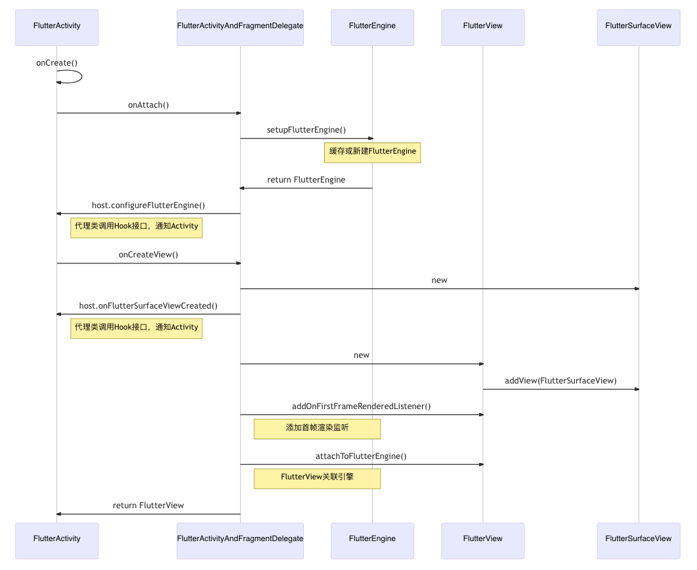
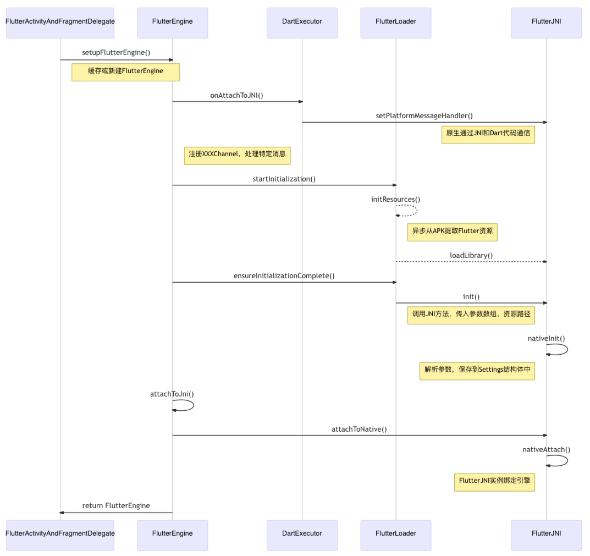
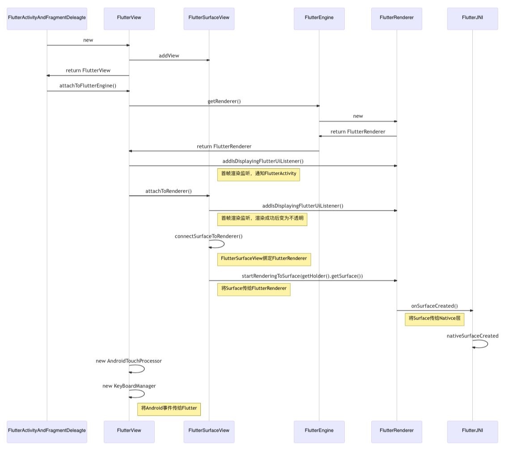
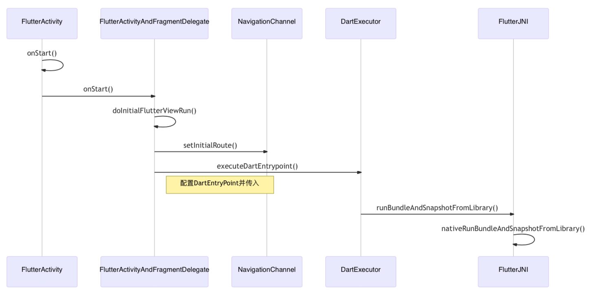
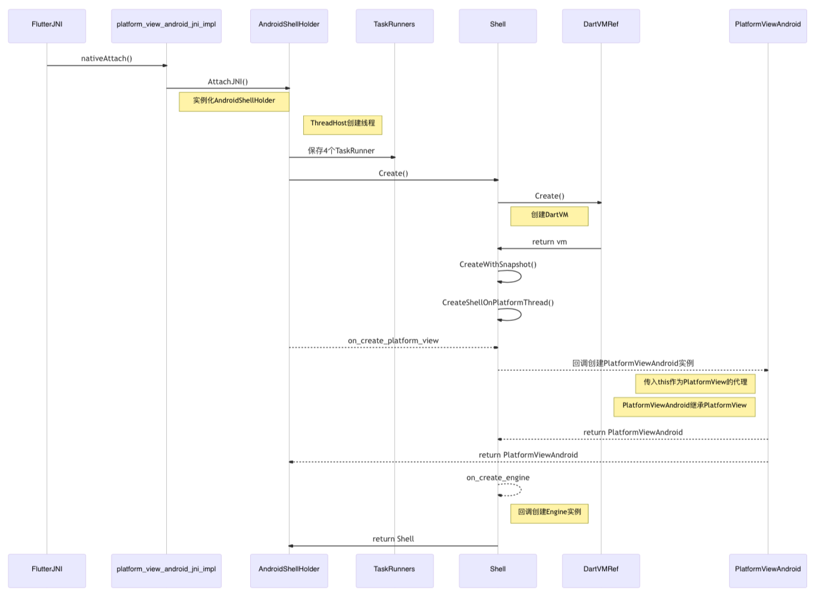
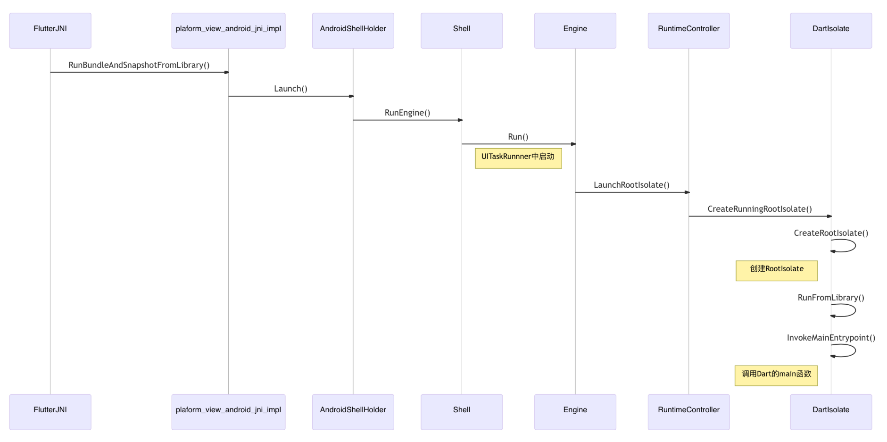
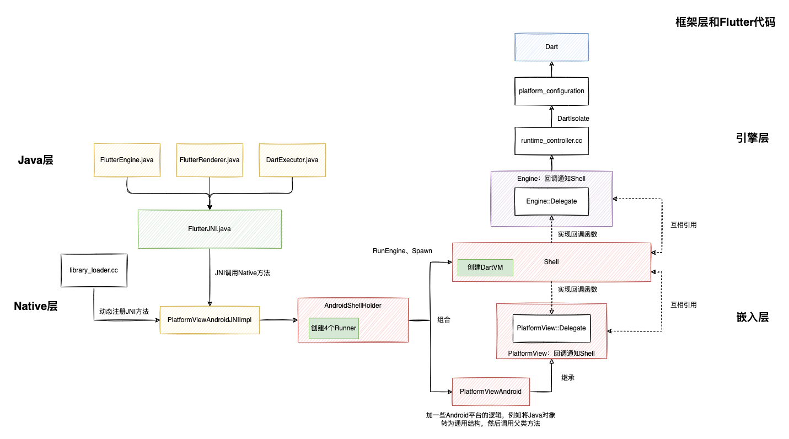

# Flutter启动流程-Java层

## 程序入口

### FlutterActivity#onCreate

1. 创建代理类，并传入this。Host接口提供子类Hook，代理类中会在特定时机回调接口通知宿主，例如配置`FlutterEngine`
2. `delegate.onAttach`：创建`FlutterEngine`
3. `delegate.onCreateView`：创建`FlutterView`，设置为ContentView
3. `getFlutterShellArgs()`：从Intent中获取Flutter参数

> 通过代理的方式，使`FlutterActivity`和`FlutterFragment`共用代理类逻辑，避免重复编码

```java
//./shell/platform/android/io/flutter/embedding/android/FlutterActivity.java
public class FlutterActivity extends Activity 
  implements FlutterActivityAndFragmentDelegate.Host, LifecycleOwner {
  @Override
  protected void onCreate(@Nullable Bundle savedInstanceState) {
    // Activity和Fragment继承Host接口，可以实现不同Hook方法逻辑
    delegate = new FlutterActivityAndFragmentDelegate(this);
    delegate.onAttach(this);
    delegate.onRestoreInstanceState(savedInstanceState);
    // 通过代理类创建FlutterView，添加到界面上
    setContentView(createFlutterView());
  }
  @NonNull
  private View createFlutterView() {
    return delegate.onCreateView(...);
  }
  //从Intent中解析Flutter参数
  public FlutterShellArgs getFlutterShellArgs() {
    return FlutterShellArgs.fromIntent(getIntent());
  }
}
```

### FlutterActivityAndFragmentDelegate

1. `setupFlutterEngine`：**创建`FlutterEngine`**
2. 配置PlatformPlugin（平台插件）：用于接收Flutter消息，调用系统方法，例如播放声音，状态栏、导航栏、剪贴板等
3. 配置引擎：例如注册FlutterPlugin（Flutter插件）
4. **创建`FlutterSurfaceView`或者`FlutterTextureView`**：默认使用SurfaceView，无法像普通View一样使用动画和z-index
5. **实例化FlutterView**：addView添加`FlutterSurfaceView`，并添加首帧渲染监听（最终会注册到FlutterJNI中，由Native层回调通知）
6. `flutterView.attachToFlutterEngine`：**FlutterView绑定引擎**
7. 如果配置了闪屏页，还会启动闪屏页，在Flutter引擎初始化、到首帧渲染完成之间显示。

```java
// ./shell/platform/android/io/flutter/embedding/android/FlutterActivityAndFragmentDelegate.java
class FlutterActivityAndFragmentDelegate {
  FlutterActivityAndFragmentDelegate(@NonNull Host host) {
    this.host = host; // 保存FlutterActivity对象
  }
  void onAttach(@NonNull Context context) {
    // 创建Flutter引擎
    setupFlutterEngine();
    // 创建PlatformPlugin，和Activity绑定
    // Fragment每次绑定Activity的时候都会重新创建
    platformPlugin = host.providePlatformPlugin(host.getActivity(), flutterEngine);
    // 配置Flutter引擎
    host.configureFlutterEngine(flutterEngine);
  }
  @NonNull
  View onCreateView(LayoutInflater inflater, @Nullable ViewGroup container, @Nullable Bundle savedInstanceState) {
    // 创建FlutterSurfaceView，用于提供绘制Flutter UI的Surface。也可以是FlutterTextureView
    FlutterSurfaceView flutterSurfaceView = new FlutterSurfaceView(host.getContext(), host.getTransparencyMode() == TransparencyMode.transparent);
    // 通知子类Hook
    host.onFlutterSurfaceViewCreated(flutterSurfaceView);
    // 创建FlutterView
    flutterView = new FlutterView(host.getContext(), flutterSurfaceView);
    // 添加首帧渲染监听，通知子类Hook，最终会注册到FlutterJNI中，由Native层调用
    flutterView.addOnFirstFrameRenderedListener(flutterUiDisplayListener);
    // 绑定Flutter引擎
    flutterView.attachToFlutterEngine(flutterEngine);
    // 显示闪屏页，从Manifest中读取
    SplashScreen splashScreen = host.provideSplashScreen();
    if (splashScreen != null) {
      FlutterSplashView flutterSplashView = new FlutterSplashView(host.getContext());
      flutterSplashView.setId(ViewUtils.generateViewId(FLUTTER_SPLASH_VIEW_FALLBACK_ID));
      flutterSplashView.displayFlutterViewWithSplash(flutterView, splashScreen);
      return flutterSplashView;
    }
    return flutterView;
  }
  ...
  return flutterSplashView;
}
```

### 小结

这里包含两个关键步骤：由于流程比较长，拆开来介绍

1. 创建`FlutterEngine`：
   1. 加载Flutter资源
   2. 解析Intent参数
   3. 绑定`FlutterJNI`实例

2. `FlutterView`绑定Flutter引擎
   1. 创建`FlutterView`和`FlutterSurfaceView`
   2. 创建`FlutterRenderer`
   3. 将Surface和`FlutterRenderer`关联，并传给Flutter引擎
   4. 创建触摸、按键等监听器，将Android View事件发给Flutter引擎




## 创建FlutterEngine

### setupFlutterEngine

首先看下`setupFlutterEngine()`方法如何获取FlutterEngine：

1. 从`FlutterEngineCache`缓存中获取预热的引擎，重写`getCachedEngineId()`
2. 子类自行创建引擎，重写`provideFlutterEngine`方法
3. 创建默认引擎

```java
class FlutterActivityAndFragmentDelegate { 
  void setupFlutterEngine() {
    // First, check if the host wants to use a cached FlutterEngine.
    String cachedEngineId = host.getCachedEngineId();
    if (cachedEngineId != null) {
      flutterEngine = FlutterEngineCache.getInstance().get(cachedEngineId);
      isFlutterEngineFromHost = true;
      return;
    }
    // Second, defer to subclasses for a custom FlutterEngine.
    flutterEngine = host.provideFlutterEngine(host.getContext());
    if (flutterEngine != null) {
      isFlutterEngineFromHost = true;
      return;
    }
    //接收Activity解析Intent的参数
    flutterEngine = new FlutterEngine(host.getContext(), host.getFlutterShellArgs().toArray(),
            /*automaticallyRegisterPlugins=*/ false,
            /*willProvideRestorationData=*/ host.shouldRestoreAndSaveState());
    isFlutterEngineFromHost = false;
  }
}
```

继续看FlutterEngine实例化：

1. `FlutterJNI`：沟通Android和Flutter引擎Native代码
2. `FlutterLoader`：加载Flutter资源、Kernel或者AOT Library路径。通过FlutterJNI初始化Native引擎
3. `DartExecutor`：用于配置、启动、执行Dart代码。**原生通过JNI和Dart通信**。
   1. Java层调用`FlutterJNI.dispatchPlatformMessage`将消息发到Native层
   2. Native层调用`FlutterJNI.handlePlatformMessage`通知Java层
4. `XXXChannel`：创建不同的消息通道，监听和处理固定的事件，需要通过`DartMessenger`来传递消息
   1. `PlatformChannel`：内部使用`MethodChannel`，通知Dart层SystemUI变化，接收Dart层消息修改SystemUI、设置剪贴板等
   2. `LifecycleChannel`：内部使用`BasicMessageChannel`，生命周期变化时通知Dart层
   3. ...


> Channel只是封装了不同类型的消息，以及响应和处理特定消息。最终都是通过`DartExecutor`调用JNI方法将消息发给Native层。

```java
public class FlutterEngine {
  public FlutterEngine(...) {
    FlutterInjector injector = FlutterInjector.instance();
    if (flutterJNI == null) {
      flutterJNI = injector.getFlutterJNIFactory().provideFlutterJNI();
    }
    this.flutterJNI = flutterJNI;

    //通过AssetManager获取Assets资源
    this.dartExecutor = new DartExecutor(flutterJNI, assetManager);
    //注册PlatformMessageHandler，FlutterJNI收到Dart调用后转发给DartExecutor，再分发给特定的处理者
    this.dartExecutor.onAttachedToJNI();

    //创建各个消息通道（例如触摸、按键、生命周期、导航跳转等），将消息发送给Dart，并且接收Dart的onMethodCall
    xxxChannel = new XXXChannel(dartExecutor, flutterJNI);
    
    if (flutterLoader == null) {
      flutterLoader = injector.flutterLoader();
    }
    //加载Flutter资源、Kernel或者AOT Library路径
    if (!flutterJNI.isAttached()) {
      //异步加载Flutter资源
      flutterLoader.startInitialization(context.getApplicationContext());
      //获取Activity中的Intent参数，通过FlutterJNI传给Flutter引擎
      flutterLoader.ensureInitializationComplete(context, dartVmArgs);
    }
    //对于spawn生成的引擎，Native已经绑定过JNI实例，因此FlutterJNI由Native Shell创建，不需要再attach
    // It should typically be a fresh, unattached JNI. But on a spawned engine, the JNI instance
    // is already attached to a native shell. In that case, the Java FlutterEngine is created around
    // an existing shell.
    if (!flutterJNI.isAttached()) {
      attachToJni();
    }
    this.renderer = new FlutterRenderer(flutterJNI);
  }
}
```

> Spawn方法用于创建多个Flutter引擎，通过`FlutterEngineGroup`类进行管理，spawn引擎都由第一个引擎生成，避免重复绑定JNI对象

### 加载Flutter资源，解析Intent参数

1. `ApplicationInfoLoader.load`从`meta-data`配置中读取Flutter资源名称，不配置的话默认值如下

   ```java
   public final class FlutterApplicationInfo {
     private static final String DEFAULT_AOT_SHARED_LIBRARY_NAME = "libapp.so";
     private static final String DEFAULT_VM_SNAPSHOT_DATA = "vm_snapshot_data";
     private static final String DEFAULT_ISOLATE_SNAPSHOT_DATA = "isolate_snapshot_data";
     private static final String DEFAULT_FLUTTER_ASSETS_DIR = "flutter_assets";
     ...
   }
   ```

2. 异步从Apk中提取Flutter资源，加载Flutter引擎so库

3. `ensureInitializationComplete`：获取Activity中的Intent参数，通过`FlutterJNI`传给Flutter引擎：

```java
//FlutterLoader.java
public class FlutterLoader {
  //异步加载Flutter资源
  public void startInitialization(@NonNull Context applicationContext, @NonNull Settings settings) {
    //只会初始化一次
    // Do not run startInitialization more than once.
    if (this.settings != null) {
      return;
    }
    this.settings = settings;
    ...
    //检查是否在主线程调用
    if (Looper.myLooper() != Looper.getMainLooper()) {
      throw new IllegalStateException("startInitialization must be called on the main thread");
    }
    //从配置的meta-data中读取so库、snapshot、assets目录等名称
    flutterApplicationInfo = ApplicationInfoLoader.load(appContext);
    Callable<InitResult> initTask = new Callable<InitResult>() {
          @Override
          public InitResult call() {
            //从Apk中提取资源：snapshot、kernel中间代码等
            ResourceExtractor resourceExtractor = initResources(appContext);
            //加载Native库
            flutterJNI.loadLibrary();
            ...
            if (resourceExtractor != null) {
              resourceExtractor.waitForCompletion();
            }
            return new InitResult(
                PathUtils.getFilesDir(appContext),
                PathUtils.getCacheDirectory(appContext),
                PathUtils.getDataDirectory(appContext));
          }
        };
    //子线程执行
    initResultFuture = Executors.newSingleThreadExecutor().submit(initTask);
  }
  //获取Activity中的Intent参数，通过`FlutterJNI`传给Flutter引擎
  public void ensureInitializationComplete(
      @NonNull Context applicationContext, @Nullable String[] args) {
    if (initialized) {
      return;
    }
    ...
    try {
      //等待资源初始化完毕
      InitResult result = initResultFuture.get();
      List<String> shellArgs = new ArrayList<>();
      ...
      //初始化FlutterJNI，以shell参数的形式传给Native
      flutterJNI.init(
          applicationContext,
          shellArgs.toArray(new String[0]),
          kernelPath,
          result.appStoragePath,
          result.engineCachesPath,
          initTimeMillis);
      initialized = true;
    } catch (Exception e) {
      Log.e(TAG, "Flutter initialization failed.", e);
      throw new RuntimeException(e);
    }
  }
}
```

### FlutterJNI实例和引擎绑定

`FlutterEngine.attachToJni();`中调用`FlutterJNI.attachToNative`

```java
//FlutterJNI.java
public class FlutterJNI {
  @UiThread
  public void attachToNative(boolean isBackgroundView) {
    ensureRunningOnMainThread();
    ensureNotAttachedToNative();
    nativeShellHolderId = performNativeAttach(this, isBackgroundView);
  }

  @VisibleForTesting
  public long performNativeAttach(@NonNull FlutterJNI flutterJNI, boolean isBackgroundView) {
    return nativeAttach(flutterJNI, isBackgroundView);
  }

  private native long nativeAttach(@NonNull FlutterJNI flutterJNI, boolean isBackgroundView);
}
```

### 小结

创建和绑定Flutter引擎

1. `DartExecutor`：注册平台通信通道，直接和`FlutterJNI`通信
2. `XXXChannel`：注册监听和响应特定的Dart消息，通过`DartExecutor`分发消息，不直接和`FlutterJNI`交互
3. `FlutterLoader`：
   1. `startInitialization()`：异步从APK中提取资源
   2. `ensureInitializationComplete()`：调用`FlutterJNI.nativeInit()`方法法，解析和保存Intent参数
4. `FlutterJNI.nativeAttach()`：创建和绑定Flutter引擎

> 这里涉及到两个JNI方法`nativeInit和nativeAttach`，后面会分析到



## FlutterView关联引擎

查看`FlutterView.attachToFlutterEngine`源码

1. `FlutterRenderer`：Flutter渲染在Java层的代言人，封装渲染相关的操作，通过`FlutterJNI`和Native交互
1. `FlutterSurfaceView`：创建Android Surface，通过`FlutterRenderer`传给Native操作
2. 通过`KeyBoardManager`和`AndroidTouchProcessor`等将Android事件传递给引擎

```java
public class FlutterView extends FrameLayout implements MouseCursorPlugin.MouseCursorViewDelegate {  
  public void attachToFlutterEngine(@NonNull FlutterEngine flutterEngine) {
    this.flutterEngine = flutterEngine;
    FlutterRenderer flutterRenderer = this.flutterEngine.getRenderer();
    //FlutterSurfaceView的Surface提供给引擎的Renderer，将Flutter UI绘制到FlutterSurfaceView
    renderSurface.attachToRenderer(flutterRenderer);
    
    //创建KeyBoardManager和AndroidTouchProcessor等，将Android事件传给Dart和Native层
    keyboardManager = new KeyboardManager(this, textInputPlugin, new KeyChannelResponder[] {
      new KeyChannelResponder(flutterEngine.getKeyEventChannel())
    });
    androidTouchProcessor =
        new AndroidTouchProcessor(this.flutterEngine.getRenderer(), /*trackMotionEvents=*/ false);
    
    // 将安卓系统配置发给Flutter，例如字体缩放、日期格式、夜间模式、Locale等
    sendUserSettingsToFlutter();
    localizationPlugin.sendLocalesToFlutter(getResources().getConfiguration());
    sendViewportMetricsToFlutter();
    
    flutterEngine.getPlatformViewsController().attachToView(this);
  }
  //设置ViewPort
  private void sendViewportMetricsToFlutter() {
    ...
    flutterEngine.getRenderer().setViewportMetrics(viewportMetrics);
  }
}
```

`attachToRenderer`：调用`nativeSurfaceCreated()`将`Surface`传到Native层

```java
public class FlutterRenderer implements TextureRegistry {
  public void attachToRenderer(@NonNull FlutterRenderer flutterRenderer) {
    ...
    //如果已经连接一个Renderer，则移除，重新连接新的Renderer 
    //onSurfaceCreated之后可以连接Renderer
    if (isSurfaceAvailableForRendering) {
      connectSurfaceToRenderer();
    }
  }
  private void connectSurfaceToRenderer() {
    //Renderer、getHolder不为空
    flutterRenderer.startRenderingToSurface(getHolder().getSurface());
  }
  public void startRenderingToSurface(@NonNull Surface surface) {
    if (this.surface != null) {
      stopRenderingToSurface();
    }
    this.surface = surface;
    //将surface传给Native层
    flutterJNI.onSurfaceCreated(surface);
  }
}
```



## Flutter代码执行入口

上面几步完成了Flutter引擎、FlutterView、FlutterJNI等创建和绑定。但是还没执行开发者写的Flutter代码。

### FlutterActivity#onStart

还是从`FlutterActivity`开始分析

```java
public class FlutterActivity extends Activity 
  implements FlutterActivityAndFragmentDelegate.Host, LifecycleOwner {
  @Override
  protected void onStart() {
    super.onStart();
    lifecycle.handleLifecycleEvent(Lifecycle.Event.ON_START);
    if (stillAttachedForEvent("onStart")) {
      //调用代理类的onStart方法
      delegate.onStart();
    }
  }
}
```

### FlutterActivityAndFragmentDelegate

1. 检查Dart代码是否已经执行
2. 从Intent中获取Flutter初始页面路由
3. 找到Dart程序入口，执行Dart代码

```java
class FlutterActivityAndFragmentDelegate implements ExclusiveAppComponent<Activity> {
  void onStart() {
    Log.v(TAG, "onStart()");
    ensureAlive();
    doInitialFlutterViewRun();
  }
  private void doInitialFlutterViewRun() {
    // Don't attempt to start a FlutterEngine if we're using a cached FlutterEngine.
    if (host.getCachedEngineId() != null) {
      return;
    }
    //onStart每次页面切换都会调用，只需要执行一次
    if (flutterEngine.getDartExecutor().isExecutingDart()) {
      return;
    }
    //从Activity或者Intent中获取Flutter初始页面路由
    String initialRoute = host.getInitialRoute();
    if (initialRoute == null) {
      initialRoute = maybeGetInitialRouteFromIntent(host.getActivity().getIntent());
      if (initialRoute == null) {
        initialRoute = DEFAULT_INITIAL_ROUTE;
      }
    }
    ...
    //设置初始路由
    flutterEngine.getNavigationChannel().setInitialRoute(initialRoute);
    String appBundlePathOverride = host.getAppBundlePath();
    if (appBundlePathOverride == null || appBundlePathOverride.isEmpty()) {
      appBundlePathOverride = FlutterInjector.instance().flutterLoader().findAppBundlePath();
    }
    //配置Dart代码执行入口，一般是main函数
    DartExecutor.DartEntrypoint entrypoint =
        new DartExecutor.DartEntrypoint(appBundlePathOverride, host.getDartEntrypointFunctionName());
    //执行Dart代码
    flutterEngine.getDartExecutor().executeDartEntrypoint(entrypoint);
  }
}
```

最终会调用`FlutterJNI`的`nativeRunBundleAndSnapshotFromLibrary`

### 小结



# FlutterJNI动态注册Native方法

Flutter引擎和Flutter代码最终会被打包成Native动态库`libengine.so`、`libapp.so`。

而JNI是Java和Native通信的桥梁，因此这里先介绍下Flutter注册的方法，后面分析源码时可以直接找到对应的Native方法。

Flutter在Java层提供了唯一的入口`FlutterJNI`，在Native层对应多个类，核心接口是`PlatformViewAndroid`

1. `FlutterMain`：主要负责解析Java层参数
2. `PlatformViewAndroid`：实现`PlatformView`**平台通用接口**，负责Surface创建，事件分发，PlatformMessage通知等
3. `VsyncWaiterAndroid`：实现`VsyncWaiter`**平台通用接口**，监听Vsync信号，通知引擎进行绘制。
4. `AndroidImageGenerator`：备用的图片解码方法，引擎根据需要调用Android方法进行解码，解码完成之后通知Native层

```c++
//library_loader.cc
// 首次加载so库时，由虚拟机调用
// This is called by the VM when the shared library is first loaded.
JNIEXPORT jint JNI_OnLoad(JavaVM* vm, void* reserved) {
  // Initialize the Java VM.
  fml::jni::InitJavaVM(vm);
  JNIEnv* env = fml::jni::AttachCurrentThread();
  bool result = false;
  // 初始化Native代码，解析参数
  // Register FlutterMain.
  result = flutter::FlutterMain::Register(env);
  FML_CHECK(result);
  
  // Register PlatformView
  result = flutter::PlatformViewAndroid::Register(env);
  FML_CHECK(result);

  // Register VSyncWaiter.
  result = flutter::VsyncWaiterAndroid::Register(env);
  FML_CHECK(result);

  // Register AndroidImageDecoder.
  result = flutter::AndroidImageGenerator::Register(env);
  FML_CHECK(result);
  
  return JNI_VERSION_1_4;
}
```

以`FlutterMain`为例，JNI方法`FlutterJNI.nativeInit`对应`FlutterMain.Init`方法

```c++
//flutter_main.cc
//动态注册FlutterJNI方法
bool FlutterMain::Register(JNIEnv* env) {
  static const JNINativeMethod methods[] = {
      {
          .name = "nativeInit",
          .signature = "(Landroid/content/Context;[Ljava/lang/String;Ljava/"
                       "lang/String;Ljava/lang/String;Ljava/lang/String;J)V",
          .fnPtr = reinterpret_cast<void*>(&Init),
      },
      {
          .name = "nativePrefetchDefaultFontManager",
          .signature = "()V",
          .fnPtr = reinterpret_cast<void*>(&PrefetchDefaultFontManager),
      },
  };
  jclass clazz = env->FindClass("io/flutter/embedding/engine/FlutterJNI");
  if (clazz == nullptr) {
    return false;
  }
  return env->RegisterNatives(clazz, methods, fml::size(methods)) == 0;
}
```

# Flutter启动流程-Native层

上文分析过Java层的调用流程，涉及几个JNI方法，下面分析下Native层做了哪些事情

1. `nativeInit`：对应`flutter_main.cc`的`Init()`方法，解析Intent参数，保存到Settings结构体中
2. `nativeAttach`：对应`platform_view_android_jni_impl.cc`的`AttachJNI()`方法
   1. 创建`AndroidShellHolder`
   2. 创建4个`TaskRunner`并指定线程，保存到`TaskRunners`中
   3. 在指定线程创建Shell、DartVM、Engine、PlatformView、Rasterizer、ShellIOManager等实例
3. `nativeSurfaceCreated`：`FlutterView`将Surface传给引擎
3. `nativeRunBundleAndSnapshotFromLibrary`：执行Flutter代码

> 主要分析nativeAttach方法，其他方法分析流程类似

## nativeInit

1. 调用`shell/common/switches.cc`的`SettingsFromCommandLine`解析参数，保存到`Settings`结构体中。
2. 注意这里`switches`和`settings`都属于common包，所有平台通用

```c++
//flutter_main.cc
#include "flutter/shell/platform/android/flutter_main.h"
namespace flutter {
FlutterMain::FlutterMain(flutter::Settings settings)
    //这种写法是给成员变量settings_赋值，引用settings变量
    : settings_(std::move(settings)), observatory_uri_callback_() {}
  ...
const flutter::Settings& FlutterMain::GetSettings() const {
  return settings_;
}
//FlutterJNI.nativeInit
void FlutterMain::Init(JNIEnv* env,
                       jclass clazz,
                       jobject context,
                       jobjectArray jargs,
                       jstring kernelPath,
                       jstring appStoragePath,
                       jstring engineCachesPath,
                       jlong initTimeMillis) {
  std::vector<std::string> args;
  args.push_back("flutter");
  for (auto& arg : fml::jni::StringArrayToVector(env, jargs)) {
    args.push_back(std::move(arg));
  }
  auto command_line = fml::CommandLineFromIterators(args.begin(), args.end());
  //shell/common/switches.cc
  //解析参数，保存到Settings架构体中
  auto settings = SettingsFromCommandLine(command_line);
  ...
  g_flutter_main.reset(new FlutterMain(std::move(settings)));
}
}  // namespace flutter
```

## nativeAttach

### AttachJNI

实例化`AndroidShellHolder`

```c++
//platform_view_android_jni_impl.cc
// Called By Java
static jlong AttachJNI(JNIEnv* env,
                       jclass clazz,
                       jobject flutterJNI,
                       jboolean is_background_view) {
  fml::jni::JavaObjectWeakGlobalRef java_object(env, flutterJNI);
  std::shared_ptr<PlatformViewAndroidJNI> jni_facade =
      std::make_shared<PlatformViewAndroidJNIImpl>(java_object);
  //实例化AndroidShellHolder
  //Settings在前面`FlutterLoader`初始化的时候调用`nativeInit`解析过了
  auto shell_holder = std::make_unique<AndroidShellHolder>(
      FlutterMain::Get().GetSettings(), jni_facade, is_background_view);
  if (shell_holder->IsValid()) {
    return reinterpret_cast<jlong>(shell_holder.release());
  } else {
    return 0;
  }
}
```

### AndroidShellHolder

`AndroidShellHolder`是`FlutterEngine`在C++端的顶级类，将`Shell`和`PlatformViewAndroid`等组合在一起。每个FlutterEngine对应一个`AndroidShellHolder`和一个`PlatformViewAndroid`。

1. 创建4个`TaskRunner`，通过`ThreadHost`指定线程，设置优先级，放到`TaskRunners`中统一管理
2. 通过`Shell::Create`创建Shell对象，创建成功后回调将shell设置为`PlatformViewAndroid`的委托
3. `GetPlatformView`函数返回`PlatformViewAndroid`对象，JNI几乎所有的调用都是通过`AndroidShellHolder`转发给`PlatformViewAndroid`处理
4. Launch函数用于启动引擎执行Dart代码

```c++
//android_shell_holder.cc
AndroidShellHolder::AndroidShellHolder(
    flutter::Settings settings,
    std::shared_ptr<PlatformViewAndroidJNI> jni_facade,
    bool is_background_view)
    : settings_(std::move(settings)), jni_facade_(jni_facade) {
  static size_t thread_host_count = 1;
  auto thread_label = std::to_string(thread_host_count++);
  //4个Runner：Platform、UI、IO、GPU，可以运行在不同线程，也可以运行在相同线程
  thread_host_ = std::make_shared<ThreadHost>();
  if (is_background_view) {
    //Runner共用一个线程
    *thread_host_ = {thread_label, ThreadHost::Type::UI};
  } else {
    //每个Runner独立线程
    *thread_host_ = {thread_label, ThreadHost::Type::UI |
                                       ThreadHost::Type::RASTER |
                                       ThreadHost::Type::IO};
  }
  ...
  fml::WeakPtr<PlatformViewAndroid> weak_platform_view;
  //Shell创建时回调
  Shell::CreateCallback<PlatformView> on_create_platform_view =
      [is_background_view, &jni_facade, &weak_platform_view](Shell& shell) {
        std::unique_ptr<PlatformViewAndroid> platform_view_android;
        //创建PlatformViewAndroid，委托类是shell对象
        platform_view_android = std::make_unique<PlatformViewAndroid>(
            shell,                   // delegate
            shell.GetTaskRunners(),  // task runners
            jni_facade,              // JNI interop
            shell.GetSettings().enable_software_rendering,  // use software rendering
            !is_background_view              // create onscreen surface
        );
        weak_platform_view = platform_view_android->GetWeakPtr();
        auto display = Display(jni_facade->GetDisplayRefreshRate());
        shell.OnDisplayUpdates(DisplayUpdateType::kStartup, {display});
        return platform_view_android;
      };
  //Shell创建时回调
  Shell::CreateCallback<Rasterizer> on_create_rasterizer = [](Shell& shell) {
    return std::make_unique<Rasterizer>(shell);
  };

  // The current thread will be used as the platform thread. Ensure that the
  // message loop is initialized.
  fml::MessageLoop::EnsureInitializedForCurrentThread();
  fml::RefPtr<fml::TaskRunner> raster_runner;
  fml::RefPtr<fml::TaskRunner> ui_runner;
  fml::RefPtr<fml::TaskRunner> io_runner;
  //PlatformRunner引擎共享，其他三个Runner引擎独立
  fml::RefPtr<fml::TaskRunner> platform_runner = fml::MessageLoop::GetCurrent().GetTaskRunner();
  if (is_background_view) {
    //Runner运行在同一线程
    auto single_task_runner = thread_host_->ui_thread->GetTaskRunner();
    raster_runner = single_task_runner;
    ui_runner = single_task_runner;
    io_runner = single_task_runner;
  } else {
    //Runner运行在不同线程
    raster_runner = thread_host_->raster_thread->GetTaskRunner();
    ui_runner = thread_host_->ui_thread->GetTaskRunner();
    io_runner = thread_host_->io_thread->GetTaskRunner();
  }
  // 将四个Runner放到TaskRunners中统一管理
  flutter::TaskRunners task_runners(thread_label,     // label
                                    platform_runner,  // platform
                                    raster_runner,    // raster
                                    ui_runner,        // ui
                                    io_runner         // io
  );
  //设置线程优先级，越小优先级越高
  //Raster优先级为-5
  //UI优先级为-1
  //IO优先级为1
  ...
  //创建Shell对象，回调创建PlatformView和Rasterizer
  shell_ = Shell::Create(GetDefaultPlatformData(),  // window data
                         task_runners,              // task runners
                         settings_,                 // settings
                         on_create_platform_view,   // platform view create callback
                         on_create_rasterizer       // rasterizer create callback
                        );
  ...
  platform_view_ = weak_platform_view;
  FML_DCHECK(platform_view_);
  is_valid_ = shell_ != nullptr;
}

void AndroidShellHolder::Launch(std::shared_ptr<AssetManager> asset_manager,
                                const std::string& entrypoint,
                                const std::string& libraryUrl) {
  if (!IsValid()) {
    return;
  }

  asset_manager_ = asset_manager;
  auto config = BuildRunConfiguration(asset_manager, entrypoint, libraryUrl);
  if (!config) {
    return;
  }
  //启动引擎
  shell_->RunEngine(std::move(config.value()));
}
...

fml::WeakPtr<PlatformViewAndroid> AndroidShellHolder::GetPlatformView() {
  FML_DCHECK(platform_view_);
  return platform_view_;
}
```

### PlatformViewAndroid

1. `Register`静态方法，用于动态注册JNI方法
2. 继承自`PlatformView`，并且构造函数包含`PlatformView::Delegate`委托对象和`PlatformViewAndroidJNI`对象

```c++
//shell/android/platform_view_android.h
class PlatformViewAndroid final : public PlatformView {
 public:
  //动态注册JNI方法
  static bool Register(JNIEnv* env);

  PlatformViewAndroid(PlatformView::Delegate& delegate,
                      flutter::TaskRunners task_runners,
                      std::shared_ptr<PlatformViewAndroidJNI> jni_facade,
                      bool use_software_rendering,
                      bool create_onscreen_surface);
  ...
  //摘取两个方法分析
  //将平台消息分发给Flutter代码处理
  void DispatchPlatformMessage(JNIEnv* env,
                               std::string name,
                               jobject message_data,
                               jint message_position,
                               jint response_id);
  //将Flutter代码发出的消息交给Android层处理
  void HandlePlatformMessage(std::unique_ptr<flutter::PlatformMessage> message) override;
}
```

看一下具体的实现：

1. `DispatchPlatformMessage`：将JNI传过来的数据转换成`PlatformMessage`并**转发给父类**的`DispatchPlatformMessage`方法
2. `HandlePlatformMessage`：通过JNI由Native调用Java方法

```c++
//shell/android/platform_view_android.cc
void PlatformViewAndroid::DispatchPlatformMessage(JNIEnv* env,
                                                  std::string name,
                                                  jobject java_message_data,
                                                  jint java_message_position,
                                                  jint response_id) {
  //封装PlatformMessage
  uint8_t* message_data = static_cast<uint8_t*>(env->GetDirectBufferAddress(java_message_data));
  fml::MallocMapping message = fml::MallocMapping::Copy(message_data, java_message_position);

  fml::RefPtr<flutter::PlatformMessageResponse> response;
  if (response_id) {
    response = fml::MakeRefCounted<PlatformMessageResponseAndroid>(
        response_id, jni_facade_, task_runners_.GetPlatformTaskRunner());
  }
  //交给PlatformVIew处理
  PlatformView::DispatchPlatformMessage(std::make_unique<flutter::PlatformMessage>(
          std::move(name), std::move(message), std::move(response)));
}
void PlatformViewAndroid::HandlePlatformMessage(
    std::unique_ptr<flutter::PlatformMessage> message) {
  int response_id = 0;
  if (auto response = message->response()) {
    response_id = next_response_id_++;
    pending_responses_[response_id] = response;
  }
  //Native调用Java方法
  // This call can re-enter in InvokePlatformMessageXxxResponseCallback.
  jni_facade_->FlutterViewHandlePlatformMessage(std::move(message),
                                                response_id);
  message = nullptr;
}
```

### PlatformView

`PlatformView`是平台通用实现，不同平台的Embedder可以继承该类，定制一些自己的方法（一般是将数据格式转换为通用结构），再通过`PlatformView`交给引擎处理。

摘取PlatformView部分声明函数

1. 构造时传入委托对象，上文已经分析过，`PlatformViewAndroid`创建用的委托对象就是`shell/common/shell.cc`类
2. `PlatformView`声明函数：创建`RenderingSurface`，将输入事件、平台消息等发给Flutter处理等
3. **委托类**的函数：基本和`PlatformView`的函数对应
4. 比较特殊的是`HandlePlatformMessage`，这个函数是由`Flutter引擎->委托Shell调用->PlatformView`，交给Android层处理的，因此没有委托方法

```c++
//flutter/shell/common/platform_view.h
namespace flutter {
class Shell;
class PlatformView {
 public:
  //代理类，相当于Callback，PlatformView将行为转发给外部，外部实现监听器
  class Delegate {
   public:
    ...
    //基本和PlatformView类的方法对应
    virtual void OnPlatformViewCreated(std::unique_ptr<Surface> surface) = 0;
    virtual void OnPlatformViewDestroyed() = 0;
    virtual void OnPlatformViewSetViewportMetrics(
        const ViewportMetrics& metrics) = 0;
    virtual void OnPlatformViewDispatchPlatformMessage(
        std::unique_ptr<PlatformMessage> message) = 0;
    virtual void OnPlatformViewDispatchPointerDataPacket(
        std::unique_ptr<PointerDataPacket> packet) = 0;
    virtual void OnPlatformViewDispatchKeyDataPacket(
        std::unique_ptr<KeyDataPacket> packet,
        std::function<void(bool /* handled */)> callback) = 0;
  };
  ...
  //构造的时候传入Delegate
  explicit PlatformView(Delegate& delegate, TaskRunners task_runners);
  //通知引擎PlatformView创建和销毁，可以开始创建Rendering Surface
  void NotifyCreated();
  virtual void NotifyDestroyed();
  //设置视图区域
  void SetViewportMetrics(const ViewportMetrics& metrics);
  //Embedder往Flutter发消息，发到root isolate中处理
  void DispatchPlatformMessage(std::unique_ptr<PlatformMessage> message);
  //Embedder处理Flutter发过来的消息
  virtual void HandlePlatformMessage(std::unique_ptr<PlatformMessage> message);
  
  //Embedder分发点击事件和按键事件给Flutter Framework
  void DispatchPointerDataPacket(std::unique_ptr<PointerDataPacket> packet);
  void DispatchKeyDataPacket(std::unique_ptr<KeyDataPacket> packet, Delegate::KeyDataResponse callback);
  //指定Texture，用于光栅合成Flutter视图
  void RegisterTexture(std::shared_ptr<flutter::Texture> texture);
  void UnregisterTexture(int64_t texture_id);
  ...

 protected:
  PlatformView::Delegate& delegate_;
  const TaskRunners task_runners_;

  PointerDataPacketConverter pointer_data_packet_converter_;
  SkISize size_;
  fml::WeakPtrFactory<PlatformView> weak_factory_;

  // 在GPU Runner中创建RenderingSurface
  // This is the only method called on the raster task runner.
  virtual std::unique_ptr<Surface> CreateRenderingSurface();

 private:
  FML_DISALLOW_COPY_AND_ASSIGN(PlatformView);
};

}  // namespace flutter

#endif  // COMMON_PLATFORM_VIEW_H_
```

`PlatformView`自身也不干活，而是交给委托对象处理，这个委托对象实际上就是Shell

```c++
//shell/common/platform_view.cc
PlatformView::PlatformView(Delegate& delegate, TaskRunners task_runners)
    : delegate_(delegate),
      task_runners_(std::move(task_runners)),
      size_(SkISize::Make(0, 0)),
      weak_factory_(this) {}

void PlatformView::DispatchPlatformMessage(
    std::unique_ptr<PlatformMessage> message) {
  //交给委托对象处理
  delegate_.OnPlatformViewDispatchPlatformMessage(std::move(message));
}
```

### Shell

Shell是嵌入层的壳，超出shell基本就到了引擎层，实现了多个组件`Delegate`类，通过委托的方式将嵌入层的请求转发到引擎层，并且将引擎层的事件发到嵌入层。

```c++
//shell/common/shell.h
class Shell final : public PlatformView::Delegate,
                    public Animator::Delegate,
                    public Engine::Delegate,
                    public Rasterizer::Delegate,
                    public ServiceProtocol::Handler {
  ...
  //创建Shell
  static std::unique_ptr<Shell> Create(
      const PlatformData& platform_data,
      TaskRunners task_runners,
      Settings settings,
      const CreateCallback<PlatformView>& on_create_platform_view,
      const CreateCallback<Rasterizer>& on_create_rasterizer,
      bool is_gpu_disabled = false);
  // 启动isolate
  void RunEngine(RunConfiguration run_configuration);
  bool Setup(std::unique_ptr<PlatformView> platform_view,
             std::unique_ptr<Engine> engine,
             std::unique_ptr<Rasterizer> rasterizer,
             std::unique_ptr<ShellIOManager> io_manager);
  ...
  // 持有对象
  std::unique_ptr<PlatformView> platform_view_;  // on platform task runner
  std::unique_ptr<Engine> engine_;               // on UI task runner
  std::unique_ptr<Rasterizer> rasterizer_;       // on raster task runner
  std::unique_ptr<ShellIOManager> io_manager_;   // on IO task runner
}
```

Shell对象创建：`Create-->CreateWithSnapshot-->CreateShellOnPlatformThread`

1. 创建DartVM
2. 创建Shell对象
3. 在GPU Runner中创建`Rasterizer`：回调`on_create_rasterizer`，传入shell委托对象
   1. 负责绘制Engine提交的LayerTree到Surface上
   2. 持有Surface和合成器上下文
4. 在Platform Runner中创建`PlatformView`：回调`on_create_platform_view`，传入shell委托对象
5. 在IO Runner中创建`ShellIOManager`
6. 在UI Runner中创建`Engine`：回调`on_create_engine`，传入shell委托对象
7. 调用`Shell::Setup`将上面创建的几个对象保存到Shell中

```c++
std::unique_ptr<Shell> Shell::Create(...) {
  ...
  // Always use the `vm_snapshot` and `isolate_snapshot` provided by the
  // settings to launch the VM.  If the VM is already running, the snapshot
  // arguments are ignored.
  //从Settings中读取快照文件
  auto vm_snapshot = DartSnapshot::VMSnapshotFromSettings(settings);
  auto isolate_snapshot = DartSnapshot::IsolateSnapshotFromSettings(settings);
  //创建虚拟机
  auto vm = DartVMRef::Create(settings, vm_snapshot, isolate_snapshot);
  FML_CHECK(vm) << "Must be able to initialize the VM.";
  ...
  return CreateWithSnapshot(...);
}
std::unique_ptr<Shell> Shell::CreateWithSnapshot(...) {
  ...
  fml::AutoResetWaitableEvent latch;
  std::unique_ptr<Shell> shell;
  //在PlatformRunner中创建Shell，并Wait直到创建完成
  fml::TaskRunner::RunNowOrPostTask(
      task_runners.GetPlatformTaskRunner(),
      fml::MakeCopyable(
            ...
            shell = CreateShellOnPlatformThread(...);
            latch.Signal();
          }));
  latch.Wait();
  return shell;
}

std::unique_ptr<Shell> Shell::CreateShellOnPlatformThread(
    DartVMRef vm,
    TaskRunners task_runners,
    const PlatformData& platform_data,
    Settings settings,
    fml::RefPtr<const DartSnapshot> isolate_snapshot,
    const Shell::CreateCallback<PlatformView>& on_create_platform_view, //回调创建PlatformView
    const Shell::CreateCallback<Rasterizer>& on_create_rasterizer, //回调创建Rrasterizer
    const Shell::EngineCreateCallback& on_create_engine, //回调创建Engine
    bool is_gpu_disabled) {
  if (!task_runners.IsValid()) {
    FML_LOG(ERROR) << "Task runners to run the shell were invalid.";
    return nullptr;
  }
  // 创建Shell对象
  auto shell = std::unique_ptr<Shell>(new Shell(std::move(vm), task_runners, settings, std::make_shared<VolatilePathTracker>(task_runners.GetUITaskRunner(), !settings.skia_deterministic_rendering_on_cpu), is_gpu_disabled));

  // Create the rasterizer on the raster thread.
  ...

  // Create the platform view on the platform thread (this thread).
  auto platform_view = on_create_platform_view(*shell.get());
  if (!platform_view || !platform_view->GetWeakPtr()) {
    return nullptr;
  }
  // Ask the platform view for the vsync waiter. This will be used by the engine
  // to create the animator.
  auto vsync_waiter = platform_view->CreateVSyncWaiter();
  if (!vsync_waiter) {
    return nullptr;
  }
  // Create the IO manager on the IO thread.
  ...
  // Create the engine on the UI thread.
  std::promise<std::unique_ptr<Engine>> engine_promise;
  auto engine_future = engine_promise.get_future();
  fml::TaskRunner::RunNowOrPostTask(
      shell->GetTaskRunners().GetUITaskRunner(),
      fml::MakeCopyable([...]() mutable {
        TRACE_EVENT0("flutter", "ShellSetupUISubsystem");
        const auto& task_runners = shell->GetTaskRunners();

        // The animator is owned by the UI thread but it gets its vsync pulses
        // from the platform.
        auto animator = std::make_unique<Animator>(*shell, task_runners,
                                                   std::move(vsync_waiter));

        engine_promise.set_value(on_create_engine(*shell,...));
      }));
  // 等待四个Runner创建好对应的对象，调用Setup保存这四个对象
  if (!shell->Setup(std::move(platform_view),  //
                    engine_future.get(),       //
                    rasterizer_future.get(),   //
                    io_manager_future.get())   //
  ) {
    return nullptr;
  }
  return shell;
}
```

### 小结



## nativeRunBundleAndSnapshotFromLibrary

和上文一样查看Native调用流程，这里顺着搜索代码即可，就不贴源码了



## 关系梳理

嵌入层涉及到很多类，这里梳理一下它们之间引用和调用的关系，如下：

1. `FlutterJNI`：Java和Native通信的统一入口
2. `PlatformViewAndroidJNIImpl`：Native方法的核心实现
3. `AndroidShellHolder`：作为C++层的主要入口，并且负责创建4个Runner线程
4. `PlatformViewAndroid`：继承自PlatformView，加一些原生平台的特殊处理和转换后，交给父类执行，对父类功能进行扩充
5. `PlatformView`：平台通用接口，负责沟通平台和Shell，没有具体的行为，基本都是委托给Shell处理
6. `Shell`：平台通用实现，负责与引擎层交互
7. `Engine`：引擎层主要入口，管理`RootIsolate`，接收Layer渲染请求等
8. `TaskRunners`：保存4个`TaskRunner`
9. `ThreadHost`：创建线程

思考：Shell为什么不和PlatformView合并，而要通过`PlatformView`委托调用Shell？

> 1. PlatformView接口是用来约束原生平台的实现
> 2. Shell是嵌入层和引擎层之间的门户，同时作为平台嵌入层和引擎层等的委托对象
> 3. 组合优于继承：Shell是平台通用的，如果要添加平台特殊处理，`PlatformViewAndroid`需要继承Shell，而Shell除了平台接口之外，还实现了引擎的委托接口，这一部分是不应该被继承的。



# 其他

## FlutterInjector

`FlutterInjector`使用Builder创建`FlutterLoader`和`FlutterJNI`工厂对象，方便单元测试注入

```java
//FlutterInjector.java
public final class FlutterInjector {
  public static final class Builder {
    private void fillDefaults() {
      if (flutterJniFactory == null) {
        //创建FlutterJNI工厂
        flutterJniFactory = new FlutterJNI.Factory();
      }
      if (flutterLoader == null) {
        //创建FlutterLoader实例
        flutterLoader = new FlutterLoader(flutterJniFactory.provideFlutterJNI());
      }
    }
  }
}
```

## FlutterApplication

这里单独把`FlutterApplication`拎出来介绍是因为这一步可有可无，在Application中加载是为了**加快`FlutterEngine`启动速度**。

**注：由于应用可能不使用`FlutterApplication`，因此`FlutterEngine`初始化的时候还会再尝试加载资源**

调用`FlutterLoader`的`startInitialization`方法进行初始化，异步加载Flutter资源。

```java
//FlutterApplication.java
public class FlutterApplication extends Application {
  @Override
  @CallSuper
  public void onCreate() {
    super.onCreate();
    FlutterInjector.instance().flutterLoader().startInitialization(this);
  }
}
```

# Flutter多线程

Flutter嵌入层中包含4个Runner：

1. Platform Runner：处理平台消息，调用Flutter Engine接口
2. UI Runner：执行Flutter Engine的Root Isolate代码，处理Widgets生成Layer Tree
3. GPU Runner（Raster Runner）：负责GPU相关的管理和调度，UI Runner将构建的Layer Tree交给GPU Runner，GPU Runner中调用Skia引擎进行渲染
4. IO Runner：处理耗时操作，例如图片读取、压缩、渲染，可以向GPU Runner提交渲染请求

> Platform Runner多个FlutterEngine共享，其他3个Runner引擎独立。
>
> Runner不等同于线程，可以运行在同一线程，也可以运行在不同线程

# Dart单线程

Dart默认是单线程处理任务，主线程有一个事件循环，包含两个事件队列：

1. microtask queue：自定义Task，优先执行，不应该执行耗时操作，否则会阻塞event队列事件，导致延迟
2. event queue：负责处理I/O、UI绘制、触摸事件等


## async、await

协程语法糖，标记await方法，保存async方法上下文环境，事件循环的时候进行检查，如果执行完，则沿着离开的指针继续执行下面的代码。

async没有真正切换线程，因此无法执行耗时操作，会造成UI延迟

## Isolate

切换线程需要创建Isolate，和Java线程区别在于线程间内存独立，需要通过Port和其他Isolate通信和交换数据（sendPort、receivePort）

# 结语

以Flutter工程方式为例，模块集成方式类似。源码分析比较枯燥，可以关注每个部分的小结和图片。

改了很多次，发现源码很深、结构比较乱，最终决定将Java层和Native层分开介绍，可能更利于阅读。

第一次分析C++的代码，style不是很习惯，很难像Java一样梳理类图关系。

参考资料：

* [深入理解Flutter引擎架构](https://xiaozhuanlan.com/gityuan_flutter?sort_by=asc)
* [Flutter-Android-Embedder启动流程](https://my.oschina.net/u/3698453/blog/4810854)
* [Flutter源码阅读分析：引擎初始化与启动](https://zhuanlan.zhihu.com/p/394560540)
* [Flutter Engine层核心逻辑梳理](https://zhuanlan.zhihu.com/p/340729824)
