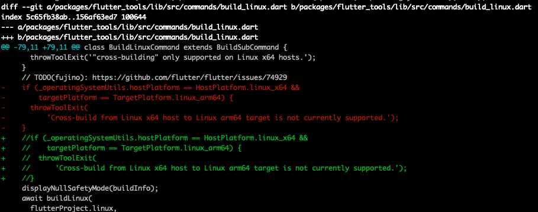

# 探索过程总结

环境配置较复杂，遇到的问题、涉及到的技术栈较多，导致文章内容比较零散。

> 探索过程中最麻烦的是编译问题的实验和记录，不确定缺少了哪些库，遇到一个问题就去网上搜索解决，做了很多尝试，有时候误打误撞成功了，但是无法确定真正起作用的是哪一步操作。因此需要不断回退，重置环境。
>
> 有时候为了分析错误原因，验证自己的猜想，明知道有坑还得去踩上一遍。

## 背景和目标

目标：解决Flutter交叉编译Linux arm平台应用，在TV嵌入式设备上运行。

任务：使用Flutter开发Linux TV应用，研究Flutter应用和引擎编译，搭建编译环境，Flutter嵌入层定制和适配。

**注：Flutter官方的Linux嵌入层使用GTK图形库，因此上面编译出的Linux应用只适用于GTK环境。嵌入式平台如果使用其他图形系统（例如DRM、Wayland），需要定制嵌入层，修改编译工具链和sysroot**

Flutter桌面应用编译只能在对应的平台上（Linux应用只能在Linux平台上编译），由于没有Linux电脑，无法编译和运行Linux程序（x86_64、arm、arm64）。参考[Flutter桌面支持](https://flutter.cn/desktop)

> 解决思路：利用Docker Ubuntu容器环境。
>
> 1. 容器内本地编译Flutter Linux桌面应用，并尝试在容器内运行显示界面。
> 2. 容器内交叉编译arm/arm64平台应用，并安装到嵌入式Linux设备运行。
>
> 使用Docker有几个明显的好处：
>
> * 尝试过程中需要装各种乱七八糟的环境，很容易破坏主机环境，且不知道真正缺少的是哪些环境，使用Docker可以随时删除容器重新验证。
> * 准备好环境之后可以方便的进行打包和移植

## 环境介绍

环境：（下文不再赘述）

* 主机（Host）：
  * 远程服务器：Linux CentOS，没有root权限（无法安装编译环境），但是可以使用Docker（容器中可以root）。
  * 本地机器/主机：MacOS
* 目标平台：Linux嵌入式平台（arm架构）、Android嵌入式平台（arm、armv8架构）、Linux桌面平台（x64、arm64架构）
* 实验镜像：[ubuntu（x64架构）](https://hub.docker.com/_/ubuntu)：作为Flutter交叉编译主机，默认不带图形界面，无法运行Flutter GUI界面
* 容器：本地机器和远程服务器都可以运行Docker容器。
  * 本地Docker容器：通过QEMU可以运行Ubuntu arm镜像和arm64镜像
  * 远程Docker容器：没有QEMU，只能运行x86_64 Ubuntu镜像

分别对比主机和容器系统版本差异，如下：


本地和远程Docker容器使用相同的Ubuntu官方镜像，但是查看版本有一定差异。本地Docker容器应该是QEMU模拟器运行Linux环境。

**注意这里有个坑，下文会提到**：同一个gen_snapshot程序，在本地Linux容器可以运行，在远程Linux容器无法运行，都是x86_64架构

结论：**不同系统的主机上即使使用相同的镜像，容器环境也存在差异**

## 大纲

1. 编译Linux x86_64桌面应用：问题不大，根据Flutter官方文档构建即可。
2. 编译Linux arm64引擎：问题不大
3. 编译Linux arm64应用：
   1. 修改`flutter_tools`源码
   2. 指定`--target-sysroot`参数
4. 编译Linux arm引擎：
   1. 修改`src/build/toolchain/custom/BUILD.gn`，`${custom_target_triple}`改为`llvm`
   2. 修改`srf/flutter/BUILD.gn`，将`_build_engine_artifacts`改为false，跳过Dart SDK编译
   3. `--target-sysroot=$PWD/build/linux/debian_sid_arm-sysroot/`：使用`install-sysroot.py`脚本下载
   4. `--target-toolchain=$PWD/buildtools/linux-x64/clang`：引擎自带路径
   5. `--target-triple=armv7-unknown-linux-gnueabihf`
5. 编译Linux arm应用：需要修改`flutter_tools`
   1. 手动进行Dart前后端编译
   2. 手动编译Linux平台代码，链接引擎和应用so库，生成可执行程序
6. 运行应用：下载的Ubuntu镜像没有界面，无法运行GUI程序。

> * x64和arm64应用使用VNC容器运行：[Linux容器运行GUI程序](/2022/02/13/tool-2022-02-13-DockerGUI/)
> * arm应用装入嵌入式平台运行：[Yocto嵌入式平台运行Flutter应用](/2022/03/04/flutter-2022-03-04-Yocto嵌入式平台运行Flutter应用/)

引擎编译和应用编译有各自的sysroot和toolchain

* sysroot是编译需要的一些目标平台库和头文件等。
* toolchain是交叉编译工具链。

引擎获取方式：主要产物是`libflutter_engine.so`库和gen_snapshot编译后端程序

1. 手动下载[Flutter官方预构建引擎](https://storage.googleapis.com/flutter_infra_release)：缺少arm平台
2. 手动编译引擎

sysroot和toolchain获取方式：

1. 手动下载[Flutter官方预构建引擎sysroot](https://commondatastorage.googleapis.com/chrome-linux-sysroot)，使用引擎`src/buildtools`
2. 自行制作：参考[交叉编译](/2022/01/20/tool-2022-01-20-交叉编译)

应用编译方式：

1. 使用`flutter build`命令：需要修改flutter_tools源码
2. 手动调用前后端编译

## 其他思路

在arm64容器中直接本地编译arm64的Flutter应用。

# 通用问题

进入容器后首次使用`apt-get`安装软件报错：`"E: Unable to locate package"`

> Linux的发行版维护了一个软件仓库，存储常用的软件，仓库地址存储在`/etc/apt/sources.list`文件中，使用`apt-get`工具会从该文件中读取仓库地址，下载并安装软件。
>
> 解决：执行下`apt update`，更新软件源地址列表
>
> `apt`命令是对`apt-get`、`apt-cache`等命令的封装，提供了统一的入口。

使用apt安装的交叉编译工具链可能有多个版本，可以搜索，例如：`apt-cache search gcc | grep -E "arm|aarch64"`

查看IP地址：`ifconfig en0 | grep inet | awk '$1=="inet" {print $2}`

Git clone仓库提示Permission denied：生成SSH Key，并在GitHub上配置Git SSH Key。或者将本地配置好的key拷贝到容器中使用。

## Docker操作

关于Docker介绍和使用可以参考我的其他文章，这里简单介绍下涉及到的操作

```shell
# 获取Ubuntu镜像
$ docker pull ubuntu
# 后台运行容器
$ docker run -itd --name ubuntu-env ubuntu /bin/bash
# 进入容器环境
$ docker exec -it ubuntu-env /bin/bash
# Flutter编译环境搭建好之后生成镜像，方便移植
$ docker commit ubuntu-env ubuntu-flutter-image
# 打包镜像，使用scp拷贝到其他服务器上
$ docker save -o image.tar ubuntu-flutter-image:latest
# 其他服务器加载镜像
$ docker load < image.tar
```

容器中下载Flutter引擎和SDK源码会导致生成镜像很大，可以让用户自己在主机下载好源码，运行的时候再挂载到容器中。

Docker容器中配置`.bash_profile`环境变量，退出容器再进入失效。

> 可以通过DockerFile配置镜像环境变量，或者执行`docker run`和`docker exec`时使用-e参数。

查看Docker镜像和容器大小：`docker system df -v`

主机和Docker容器间文件拷贝：`docker cp 主机路径 容器名:容器内路径`

# 本地编译Linux桌面应用

容器内安装Flutter SDK，根据[官方文档](https://flutter.cn/docs/get-started/install/linux)配置环境即可，问题不大。国内网络下载不了的话参考[Using Flutter in China](https://docs.flutter.dev/community/china)

1. 下载Flutter SDK：`git clone https://github.com/flutter/flutter.git`
2. 配置环境变量
3. 安装Linux编译环境：`apt install unzip git curl clang cmake ninja-build pkg-config libgtk-3-dev liblzma-dev`
4. 启用Linux编译：`flutter config --enable-linux-desktop`
5. 检查Flutter编译工具链：`flutter doctor`

编译Flutter应用：生成myapp可执行文件

```shell
# 创建Flutter模版工程
$ flutter create myapp
$ cd myapp
# 如果是已有的项目，则需要创建Linux壳工程
# flutter create --platforms=linux

# 编译Flutter Linux桌面应用
$ flutter build linux
```

通过[Linux容器运行GUI程序](/2022/02/13/tool-2022-02-13-DockerGUI/)，可以成功运行myapp应用。

# 交叉编译Linux arm64平台应用

Linux x64主机交叉编译Linux arm64目标平台应用：参考[issue](https://github.com/flutter/flutter/issues/74929)和[说明](https://docs.google.com/document/d/19tzWySgtgtTA99XQsjx5Pg0SFJeZKXyUlYavR0EXv8c/edit#)

## 修改flutter_tools

Flutter SDK命令默认不支持交叉编译arm64和arm应用，需要修改`flutter_tools`源码：

1. 修改`flutter_tools/lib/src/commands/build_linux.dart`代码，注释掉交叉编译报错：

   

2. 修改`flutter_tools/lib/src/artifacts.dart`代码：

   

   ```dart
   //flutter_tools/lib/src/artifacts.dart
   class CachedArtifacts implements Artifacts {
     ...
     String _getDesktopArtifactPath(Artifact artifact, TargetPlatform? platform, BuildMode? mode) {
       // When platform is null, a generic host platform artifact is being requested
       // and not the gen_snapshot for darwin as a target platform.
       if (platform != null && artifact == Artifact.genSnapshot) {
         final String engineDir = _getEngineArtifactsPath(platform, mode)!;
   // 添加代码块
         if (getNameForHostPlatformArch(getCurrentHostPlatform())
            != getNameForTargetPlatformArch(platform)) {
           final String hostPlatform = getNameForHostPlatform(getCurrentHostPlatform());
           return _fileSystem.path.join(engineDir, hostPlatform, _artifactToFileName(artifact));
         }
         return _fileSystem.path.join(engineDir, _artifactToFileName(artifact));
       }
       return _getHostArtifactPath(artifact, platform ?? _currentHostPlatform(_platform, _operatingSystemUtils), mode);
     }
   }
   ```

3. 修改`flutter_tools/lib/src/flutter_cache.dart`代码（注意代码行数）：用于下载Flutter官方arm64引擎

   

   ```dart
   //flutter_tools/lib/src/flutter_cache.dart
   class FlutterSdk extends EngineCachedArtifact {
   ...
     @override
     List<List<String>> getBinaryDirs() {
       // Currently only Linux supports both arm64 and x64.
       return <List<String>>[
         <String>['common', 'flutter_patched_sdk.zip'],
         <String>['common', 'flutter_patched_sdk_product.zip'],
         if (cache.includeAllPlatforms) ...<List<String>>[
           <String>['windows-x64', 'windows-x64/artifacts.zip'],
   // 修改代码：Modified to download the artifacts of both linux-x64 and linux-arm64
           <String>['linux-x64', 'linux-x64/artifacts.zip'],
           <String>['linux-arm64', 'linux-arm64/artifacts.zip'],
           <String>['darwin-x64', 'darwin-x64/artifacts.zip'],
         ]
         else if (_platform.isWindows)
           <String>['windows-x64', 'windows-x64/artifacts.zip']
         else if (_platform.isMacOS)
           <String>['darwin-x64', 'darwin-x64/artifacts.zip']
         else if (_platform.isLinux) ...<List<String>>[
   // 修改代码：Modified to download the artifacts of both linux-x64 and linux-arm64
           <String>['linux-x64', 'linux-x64/artifacts.zip'],
           <String>['linux-arm64', 'linux-arm64/artifacts.zip'],
         ],
       ];
     }
   }
   class LinuxEngineArtifacts extends EngineCachedArtifact {
     @override
     List<List<String>> getBinaryDirs() {
       if (_platform.isLinux || ignorePlatformFiltering) {
         // 修改代码：Modified to download the artifacts of both linux-x64 and linux-arm64
         return <List<String>>[
           <String>['linux-x64', 'linux-x64/linux-x64-flutter-gtk.zip'],
           <String>['linux-x64-profile', 'linux-x64-profile/linux-x64-flutter-gtk.zip'],
           <String>['linux-x64-release', 'linux-x64-release/linux-x64-flutter-gtk.zip'],
           <String>['linux-arm64', 'linux-arm64/linux-arm64-flutter-gtk.zip'],
           <String>['linux-arm64-profile', 'linux-arm64-profile/linux-arm64-flutter-gtk.zip'],
           <String>['linux-arm64-release', 'linux-arm64-release/linux-arm64-flutter-gtk.zip'],
         ];
       }
       return const <List<String>>[];
     }
   }
   ```

4. 删除`flutter_tools`重新构建：`rm flutter/bin/cache/flutter_tools*`

5. 执行编译命令：`flutter build linux --target-platform linux-arm64 -v`

> -v查看编译具体信息

这里build失败是正常的，但是已经成功下载Flutter官方提供的Linux arm64引擎的构件，放到了SDK对应路径下，例如：`flutter/bin/cache/artifacts/engine/linux-arm64-release/`。

踩坑：下载的Flutter引擎gen_snapshot程序可以在本地Docker容器中执行，但是无法在远程Docker容器中执行。提示`cannot execute binary file: Exec format error`（二进制可执行程序格式不正确），导致编译失败。

> 前面介绍环境的时候提到不同主机上即使使用相同镜像，容器环境也存在差异。
>
> 编译器本身也是一个可执行程序，只能在目标平台运行。

既然官方提供的引擎构件无法使用，那只能自己下载引擎源码编译生成gen_snapshot了。

## 交叉编译Flutter arm64引擎

源码下载和Host编译参考[Flutter架构和源码编译](/2022/01/06/flutter-2022-01-06-Flutter架构和源码编译/)

注：Flutter SDK中内置了引擎的`artifact`，如果自己编译引擎，需要确保Engine源码和Framework源码版本对应。本文使用2.8.1版本

```shell
$ flutter --version
Flutter 2.8.1 • channel stable • https://github.com/flutter/flutter.git
Framework • revision 77d935af4d (10 weeks ago) • 2021-12-16 08:37:33 -0800
Engine • revision 890a5fca2e
Tools • Dart 2.15.1
```

在远程容器中下载好源码之后，开始交叉编译：

```shell
$ apt install python3 git pkg-config vim curl unzip ninja-build
$ ./flutter/tools/gn --target-os linux --linux-cpu arm64 --runtime-mode release
$ ninja -C out/linux_release_arm64
```

> 源码如果已经下载，可以不用安装depot_tools，使用apt安装ninja即可

arm 64位引擎编译问题不大，比较顺利。

## 交叉编译Linux arm64应用

按照上文修改`flutter_tools`，将引擎编译生成的关键产物拷贝到Flutter SDK路径下，替代官方Artifact。

```shell
# 拷贝gen_snapshot，目录不存在则创建
$ cp src/out/linux_release_arm64/clang_x64/gen_snapshot <artifact_path>/linux-arm64-release/linux-x64/gen_snapshot
# 拷贝引擎so
$ cp src/out/linux_release_arm64/libflutter_linux_gtk.so <artifact_path>/linux-arm64-release/libflutter_linux_gtk.so
# 拷贝头文件
$ cp src/flutter/shell/platform/linux/public/flutter_linux <artifact_path>/linux-arm64-release/flutter_linux
# 最终路径如下
~/flutter/flutter/bin/cache/artifacts/engine/linux-arm64-release $ tree
├── flutter_linux # 位于src/flutter/engine/src/flutter/shell/platform/linux/public/flutter_linux 
├── libflutter_linux_gtk.so # 位于src/out/linux_release_arm64/libflutter_linux_gtk.so
└── linux-x64
    └── gen_snapshot # 位于src/out/linux_release_arm64/clang_x64/gen_snapshot

# 安装gcc和g++交叉编译工具，注意这里安装的是gcc版本是9
$ apt install gcc-aarch64-linux-gnu g++-aarch64-linux-gnu

# 拷贝头文件，由于上一步安装的gcc版本是9，而Flutter官方的debian_sid_arm64-sysroot中的gcc为7。编译的时候从sysroot中找不到头文件，因此需要手动拷贝到头文件搜索路径。
$ cp -r /usr/aarch64-linux-gnu/include/c++/9/aarch64-linux-gnu/bits/ /lib/gcc-cross/aarch64-linux-gnu/9/../../../../include/c++/9/

# 编译Linux arm64应用，指定target-sysroot
$ flutter build linux --target-platform linux-arm64 --target-sysroot /root/flutter/engine/src/build/linux/debian_sid_arm64-sysroot -v 
```

**注：最关键的步骤是指定`--target-sysroot`，否则会遇到很多错误。**

> 这里使用Flutter引擎构建时用的sysroot，也可以自行制作sysroot

## 踩坑记录

一开始`flutter build`没有指定`--target-sysroot`一直报错。根据网上的办法解了一个又出现另一个，没完没了。都是弯路，其实问题原因就是缺少目标平台库sysroot，**不应该聚焦单个问题，而是当作整体来看**。

> 此时Dart代码可以正常编译，`app.so`位于`.dart_tool`中。
>
> 主要是编译Linux壳工程（main.cc等）失败，依赖GTK、X11等目标平台库和头文件。
>
> 如果是定制嵌入层，需要自己创建`main.cc`入口文件，进行交叉编译。

**这里记录下单个问题的踩坑过程，用来参考：无法真正解决，正确的做法参考上面的步骤（Don't Do It！）**

### 问题1

```shell
/usr/bin/ld: unrecognised emulation mode: aarch64linux
Supported emulations: elf_x86_64 elf32_x86_64 elf_i386 elf_iamcu elf_l1om elf_k1om i386pep i386pe
```

> 原因：缺少GNU交叉编译工具链
>
> 解决：`apt install gcc-aarch64-linux-gnu g++-aarch64-linux-gnu`

### 问题2

```shell
Target aot_elf_release failed: ProcessException: Failed to find "/root/flutter/flutter/bin/cache/artifacts/engine/linux-arm64-release/linux-x64/gen_snapshot" in the search path
```

> 原因：官方下载的引擎Artifact解压文件夹不对
>
> 解决：手动将gen_snapshot放到`linux-x64`目录下

### 问题3

```shell
/root/flutter/flutter/bin/cache/artifacts/engine/linux-arm64-release/linux-x64/gen_snapshot: 1: Syntax error: "(" unexpected
```

> 原因：官方下载的引擎Artifact的gen_snapshot可执行程序目标格式不正确，可以在
>
> 解决：将自己编译的引擎Artifact拷贝到对应目录下

### 问题4（X）

```shell
//usr/include/limits.h:26:10: fatal error: 'bits/libc-header-start.h' file not found
```

> 原因：缺少头文件
>
> 解决：`apt install gcc-multilib g++-multilib`
>
> **备注：无用的步骤，下面会拷贝整个头文件目录。**

### 问题5

```shell
//lib/gcc-cross/aarch64-linux-gnu/9/../../../../include/c++/9/cstdlib:41:10: fatal error: 'bits/c++config.h' file not found
```

> 原因：系统安装的gcc工具链版本是9，Flutter引擎中的`debian_sid_arm64-sysroot`中gcc版本是7，导致在`--target-sysroot`路径中找不到头文件。
>
> 解决：拷贝整个文件夹到头文件搜索路径。
>
> ```shell
> $ cp -r /usr/aarch64-linux-gnu/include/c++/9/aarch64-linux-gnu/bits/ /lib/gcc-cross/aarch64-linux-gnu/9/../../../../include/c++/9/
> ```

### 问题6

```shell
[        ] FAILED: intermediates_do_not_run/myapp
[        ] : && /usr/bin/clang++ --target=aarch64-linux-gnu --sysroot=/ubuntu-arm64  -O3 -DNDEBUG   CMakeFiles/myapp.dir/main.cc.o CMakeFiles/myapp.dir/my_application.cc.o
CMakeFiles/myapp.dir/flutter/generated_plugin_registrant.cc.o  -o intermediates_do_not_run/myapp -L/root/Desktop/myapp/linux/flutter/ephemeral
-Wl,-rpath,/root/Desktop/myapp/linux/flutter/ephemeral:/usr/lib/aarch64-linux-gnu:  -lflutter_linux_gtk  -lgtk-3  -lgdk-3  -lpangocairo-1.0  -lpango-1.0  -lharfbuzz  -latk-1.0  -lcairo-gobject
-lcairo  -lgdk_pixbuf-2.0  /ubuntu-arm64/usr/lib/aarch64-linux-gnu/libgio-2.0.so  /ubuntu-arm64/usr/lib/aarch64-linux-gnu/libgobject-2.0.so  /ubuntu-arm64/usr/lib/aarch64-linux-gnu/libglib-2.0.so && :
[        ] /usr/bin/aarch64-linux-gnu-ld: cannot find -lgtk-3
[        ] /usr/bin/aarch64-linux-gnu-ld: cannot find -lgdk-3
[        ] /usr/bin/aarch64-linux-gnu-ld: cannot find -lpangocairo-1.0
[        ] /usr/bin/aarch64-linux-gnu-ld: cannot find -lpango-1.0
[        ] /usr/bin/aarch64-linux-gnu-ld: cannot find -lharfbuzz
[        ] /usr/bin/aarch64-linux-gnu-ld: cannot find -latk-1.0
[   +4 ms] /usr/bin/aarch64-linux-gnu-ld: cannot find -lcairo-gobject
[        ] /usr/bin/aarch64-linux-gnu-ld: cannot find -lcairo
[        ] /usr/bin/aarch64-linux-gnu-ld: cannot find -lgdk_pixbuf-2.0
[        ] clang: error: linker command failed with exit code 1 (use -v to see invocation)
```

> 原因：缺少GTK、Cairo等**目标平台**的链接库
>
> 解决思路：apt没有提供arm64的GTK平台库，需要自行下载，或者在arm64机器上使用apt下载，再拷贝出来。（sysroot其实就是这样制作的）

备注：踩坑到这里解不动了。最后跳出单个问题看，其实就是缺了`--target-sysroot`。学习了下sysroot制作，验证成功，再后来发现其实用Flutter官方的sysroot也可以编译成功。

## 其他问题

下面的问题也是探索过程中遇到的，但是后面复现不到了，还是保留下踩坑过程。（看看就好，没有参考价值）

```shell
/usr/bin/aarch64-linux-gnu-ld: cannot find -lstdc++
```

> 原因：找不到链接库
>
> 解决：`apt install libstdc++-9-dev-arm64-cross`

```shell
ERROR: qemu-aarch64: Could not open '/lib/ld-linux-aarch64.so.1': No such file or directory
```

> 原因：找不到链接库
>
> 解决；`cp /usr/aarch64-linux-gnu/lib/ld-linux-aarch64.so.1 /lib/ld-linux-aarch64.so.1`

```shell
ERROR: /root/flutter/bin/cache/artifacts/engine/linux-arm64-release/gen_snapshot: error while loading shared libraries: libdl.so.2: cannot open shared object file: No such file or directory
ERROR: Dart snapshot generator failed with exit code 127
```

> 原因：找不到链接库
>
> 解决：export LD_LIBRARY_PATH=/usr/aarch64-linux-gnu/lib`：添加程序加载运行时查找链接库的路径
>
> `LIBRARY_PATH`：添加gcc编译时查找链接库的路径。

```shell
Target unpack_linux failed: FileSystemException: Cannot open file, path = '/root/flutter/bin/cache/artifacts/engine/linux-arm64/icudtl.dat' (OS Error: No such file or directory,
errno = 2)
```

> 解决：从Flutter官方仓库下载引擎Artifact，或者自行编译引擎，拷贝到对应目录

# 交叉编译Linux arm应用

## 交叉编译Flutter arm引擎

1. 修改`src/flutter/BUILD.gn`文件，将`_build_engine_artifacts`改为false，跳过Dart SDK编译

2. 修改`build/toolchain/custom/BUILD.gn`，将`${custom_target_triple}`改为`llvm`

   ```shell
   # build/toolchain/custom/BUILD.gn
   ar = "${toolchain_bin}/${custom_target_triple}-ar"
   readelf = "${toolchain_bin}/${custom_target_triple}-readelf"
   nm = "${toolchain_bin}/${custom_target_triple}-nm"
   strip = "${toolchain_bin}/${custom_target_triple}-strip"
   ```

3. 执行命令

   ```shell
   # 安装基础环境
   $ apt install python3 git pkg-config vim curl unzip ninja-build clang
   
   # 手动下载arm平台的sysroot
   $ build/linux/sysroot_scripts/install-sysroot.py --arch=arm
   
   # gn生成构建配置
   $ ./flutter/tools/gn --target-os linux --linux-cpu arm --runtime-mode release \
   --target-toolchain=$PWD/buildtools/linux-x64/clang \
   --target-sysroot=$PWD/build/linux/debian_sid_arm-sysroot/ \
   --target-triple=armv7-unknown-linux-gnueabihf \
   --arm-float-abi=hard
   
   # ninja编译
   $ ninja -C out/linux_release_arm
   ```

## 交叉编译Linux arm应用

由于Flutter官方还不支持Linux arm应用的编译，因此需要修改`flutter_tools`源码：

1. 让`flutter build`命令支持`--target-platform=linux-arm`参数
2. 编译时查找对应路径下的引擎产物，例如：`{flutter_sdk}/bin/cache/artifacts/engine/linux-arm-release/`）

可以参考[Flutter应用构建流程分析](/2022/01/12/flutter-2022-01-12-Flutter应用构建流程分析/)，能读懂源码自然就会修改了。

这里直接调用前后端编译，不使用`flutter build`命令（省略文件路径）

```shell
# 前端编译生成app.dill
$ dart frontend_server.dart.snapshot \
--target=flutter \
--aot --tfa \
-Ddart.vm.profile=false -Ddart.vm.product=true \
--sdk-root flutter_patched_sdk \
--output-dill app.dill \
demo/lib/main.dart

# 后端编译生成libapp.so
$ ./clang_x64/gen_snapshot \
--snapshot_kind=app-aot-elf \
--elf=libapp.so \
app.dill
```

linux平台代码使用cmake和ninja编译，并链接`libapp.so`、`libflutter_engine.so`，需要修改`CMakeList.txt`，这里暂时不做介绍。

## 踩坑记录

### 找不到交叉编译工具链

`./flutter/tools/gn --target-os linux --linux-cpu arm --runtime-mode release --verbose`

```shell
Generating GN files in: out/linux_release_arm
ERROR Unresolved dependencies.
//:default(//build/toolchain/linux:clang_arm)
  needs //build/toolchain/linux:clang_arm()
```

> 原因：找不到交叉编译工具链
>
> 分析：参考[Flutter issue](https://github.com/flutter/flutter/issues/55574)，需要添加`--target-toolchain`参数
>
> 解决：添加`--target-toolchain`参数，同时需要添加`--target-sysroot`和`--target-triple`。否则断言会出错
>
> ```makefile
> #build/config/BUILDCONFIG.gn
> if (custom_toolchain != "") {
>   assert(custom_sysroot != "") # 496
>   assert(custom_target_triple != "") # 497
>   host_toolchain = "//build/toolchain/linux:clang_$host_cpu"
>   set_default_toolchain("//build/toolchain/custom")
> }
> ```

问题点在于这三个参数应该填什么？试验了很多次，ninja编译会出现各种各样的错。最终是参考`meta-flutter`项目的Yocto编译配方才解决的。

错误试验：

* `--target-toolchain`使用`/`或者`/usr/lib/llvm-10/ `
* ``--target-triple`使用`arm-linux-gnueabihf`或者`llvm`。

### 不带`--arm-float-abi=hard`选项

```shell
ninja: Entering directory `out/linux_release_arm'
/root/flutter/engine/src/build/linux/debian_sid_arm-sysroot//usr/include/arm-linux-gnueabihf/gnu/stubs.h:7:11: fatal error: 'gnu/stubs-soft.h' file not found
```

> gn命令添加`--arm-float-abi=hard`。或者修改`build/config/compiler/BUILD.gn`文件，如下
>
> ```makefile
> # build/config/compiler/BUILD.gn
> # ...
> "-mfloat-abi=$arm_float_abi",  # 默认值为softfp，可以改为hard
> ```

### `--target-triple`使用`arm-linux-gnueabihf`

```shell
ninja: Entering directory `out/linux_release_arm/'
[552/6691] AR obj/third_party/dart/runtime/bin/libcrashpad.a
FAILED: obj/third_party/dart/runtime/bin/libcrashpad.a
rm -f obj/third_party/dart/runtime/bin/libcrashpad.a && /usr/lib/llvm-10//bin/arm-linux-gnueabihf-ar rcs obj/third_party/dart/runtime/bin/libcrashpad.a @obj/third_party/dart/runtime/bin/libcrashpad.a.rsp
/bin/sh: 1: /usr/lib/llvm-10//bin/arm-linux-gnueabihf-ar: not found
```

> 原因：找不到`arm-linux-gnueabihf-ar`工具。
>
> 解决：修改`build/toolchain/custom/BUILD.gn`文件，将`${custom_target_triple}`替换为`llvm`

```shell
FAILED: exe.unstripped/gen_snapshot gen_snapshot
# Clang生成./exe.unstripped/gen_snapshot，再通过llvm-strip生成./gen_snapshot
# ...
ld.lld: error: unable to find library -lc++
ld.lld: error: cannot open /root/flutter/engine/src/buildtools/linux-x64/clang/lib/clang/14.0.0/lib/linux/libclang_rt.builtins-armhf.a: No such file or directory

# 搜索该文件
~/flutter/engine/src# find buildtools/ -name "libclang_rt.builtins*"
buildtools/linux-x64/clang/lib/clang/14.0.0/lib/aarch64-unknown-fuchsia/libclang_rt.builtins.a
buildtools/linux-x64/clang/lib/clang/14.0.0/lib/aarch64-unknown-linux-gnu/libclang_rt.builtins.a
buildtools/linux-x64/clang/lib/clang/14.0.0/lib/armv7-unknown-linux-gnueabihf/libclang_rt.builtins.a
buildtools/linux-x64/clang/lib/clang/14.0.0/lib/i386-unknown-fuchsia/libclang_rt.builtins.a
buildtools/linux-x64/clang/lib/clang/14.0.0/lib/i386-unknown-linux-gnu/libclang_rt.builtins.a
buildtools/linux-x64/clang/lib/clang/14.0.0/lib/riscv64-unknown-fuchsia/libclang_rt.builtins.a
buildtools/linux-x64/clang/lib/clang/14.0.0/lib/x86_64-unknown-fuchsia/libclang_rt.builtins.a
buildtools/linux-x64/clang/lib/clang/14.0.0/lib/x86_64-unknown-linux-gnu/libclang_rt.builtins.a
```

> 解决：修改`--target-triple`为`armv7-unknown-linux-gnueabihf`

### Dart SDK编译报错

```shell
Command failed: /home/code/build/tmp/work/armv7at2hf-neon-pokymllib32-linux-gnueabi/lib32-flutter-engine-release/git-r0/src/out/linux_release_arm/clang_x64/dart 
--disable-dart-dev --deterministic 
--packages=/home/code/build/tmp/work/armv7at2hf-neon-pokymllib32-linux-gnueabi/lib32-flutter-engine-release/git-r0/src/flutter/flutter_frontend_server/.dart_tool/package_config.json 
--snapshot=/home/code/build/tmp/work/armv7at2hf-neon-pokymllib32-linux-gnueabi/lib32-flutter-engine-release/git-r0/src/out/linux_release_arm/gen/frontend_server.dart.snapshot 
--snapshot-depfile=/home/code/build/tmp/work/armv7at2hf-neon-pokymllib32-linux-gnueabi/lib32-flutter-engine-release/git-r0/src/out/linux_release_arm/gen/frontend_server.dart.snapshot.d 
--depfile-output-filename=gen/frontend_server.dart.snapshot 
--snapshot-kind=kernel /home/code/build/tmp/work/armv7at2hf-neon-pokymllib32-linux-gnueabi/lib32-flutter-engine-release/git-r0/src/flutter/flutter_frontend_server/bin/starter.dart 
--train 
--sdk-root=/home/code/build/tmp/work/armv7at2hf-neon-pokymllib32-linux-gnueabi/lib32-flutter-engine-release/git-r0/src/out/linux_release_arm/flutter_patched_sdk 
/home/code/build/tmp/work/armv7at2hf-neon-pokymllib32-linux-gnueabi/lib32-flutter-engine-release/git-r0/src/flutter/flutter_frontend_server/bin/starter.dart
output:
===== CRASH =====
si_signo=Segmentation fault(11), si_code=1, si_addr=0x7f3b9f7dd1fc
```

> 原因：编译的arm架构的`out/linux_release_arm/clang_x64/dart`程序无法执行。导致生成Kernel快照失败，例如`frontend_server.dart.snapshot`、`analysis_server.dart.snapshot`、`dartdoc.dart.snapshot`等
>
> 分析：这个时候`gen_snapshot`和`libflutter_engine.so`已经编译完了，不需要编译Dart SDK，所以也可以不处理该问题。
>
> 解决：只要跳过Dart SDK编译即可，修改`src/flutter/BUILD.gn`文件，将`_build_engine_artifacts`改为false

## 其他问题

```shell
[   +1 ms] /usr/bin/aarch64-linux-gnu-ld: CMakeFiles/myapp.dir/my_application.cc.o: in function `my_application_activate(_GApplication*)':
[        ] my_application.cc:(.text+0x36c): undefined reference to `fl_dart_project_new'
[        ] /usr/bin/aarch64-linux-gnu-ld: my_application.cc:(.text+0x378): undefined reference to `fl_dart_project_set_dart_entrypoint_arguments'
[        ] /usr/bin/aarch64-linux-gnu-ld: my_application.cc:(.text+0x380): undefined reference to `fl_view_new'
[        ] /usr/bin/aarch64-linux-gnu-ld: my_application.cc:(.text+0x3c0): undefined reference to `fl_plugin_registry_get_type'
[        ] clang: error: linker command failed with exit code 1 (use -v to see invocation)
```

ninja编译arm报错：缺少glibc库，需要编译libcxx和libcxxabi

```shell
Using 'dlopen' in statically linked applications requires at runtime the shared libraries from the glibc version used for linking
```

# 结语

相关文章链接：

* [Flutter架构和源码编译](/2022/01/06/flutter-2022-01-06-Flutter架构和源码编译/)
* [Linux容器运行GUI程序](/2022/02/13/tool-2022-02-13-DockerGUI/)
* [Yocto嵌入式平台运行Flutter应用](/2022/03/04/flutter-2022-03-04-Yocto嵌入式平台运行Flutter应用/)
* [交叉编译](/2022/01/20/tool-2022-01-20-交叉编译)
* [Flutter引擎源码](/2022/03/01/flutter-2022-03-01-Flutter引擎源码/)

资源下载链接：

* [Flutter官方预构建引擎](https://storage.googleapis.com/flutter_infra_release)：缺少arm平台
* [预构建ARM引擎](https://github.com/ardera/flutter-engine-binaries-for-arm)：开发者预构建的arm引擎，需要注意版本对应，否则可能无法使用
* [Flutter官方预构建引擎sysroot](https://commondatastorage.googleapis.com/chrome-linux-sysroot)
* [Flutter官方预构建Dart SDK](https://storage.googleapis.com/dart-archive)

参考资料：

* [Build Flutter engine for linux-arm/arm64](https://wiki.loliot.net/docs/lang/flutter/engine/flutter-engine-for-linux-arm64/)、[Flutter on Raspberry Pi (mostly) from scratch](https://medium.com/flutter/flutter-on-raspberry-pi-mostly-from-scratch-2824c5e7dcb1)：自行制作toolchain，编译引擎
* [Flutter Issue](https://github.com/flutter/flutter/issues/55574)：编译arm引擎

## Linux发行版说明

搭建环境过程中见到很多库的名词不认识，因此查了一下

* RHEL（Red Hat Enterprise Linux）：Red Hat企业版，更稳定，需要付费，能获得相应的服务和技术支持
* CentOS（Community ENTerprise Operating System）：源于RHEL，不需要付费
* Fedora：相当于RHEL的实验版本，迭代速度快，实验稳定之后可能会应用到RHEL中。
  * Red Hat早期分为普通版（Red Hat Linux）和企业版（RHEL），2003年普通版不再发布，改为Fedora项目，
* Ubuntu源于Debian：[Debian 和 Ubuntu：有什么不同？应该选择哪一个？](https://linux.cn/article-13746-1.html)
* Ubuntu和Debian版本对应关系如下：5是debian、6是squeeze、7是wheezy、8是jessie、9是stretch、10是buster。sid代表开发版本

```
  Ubuntu      |       Debian  
18.04  bionic     buster  / sid   - 10
17.10  artful     stretch / sid   - 9
17.04  zesty      stretch / sid
16.10  yakkety    stretch / sid
16.04  xenial     stretch / sid
15.10  wily       jessie  / sid   - 8
15.04  vivid      jessie  / sid
14.10  utopic     jessie  / sid
14.04  trusty     jessie  / sid
13.10  saucy      wheezy  / sid   - 7
13.04  raring     wheezy  / sid
12.10  quantal    wheezy  / sid
12.04  precise    wheezy  / sid
11.10  oneiric    wheezy  / sid
11.04  natty      squeeze / sid   - 6
10.10  maverick   squeeze / sid
10.04  lucid      squeeze / sid
```