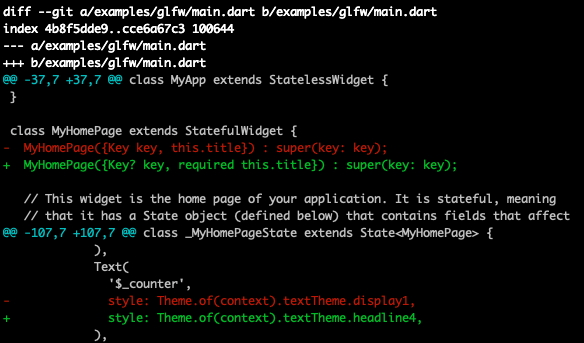

Linux入口main.cc、Android入口FlutterActivity

homescreen main.cc

# target-sysroot

查看Flutter引擎编译配置，`gclinet sync`的时候会通过`install-sysroot.py`脚本去下载对应的sysroot用于构建，例如`debian_sid_arm64-sysroot`。没有下载arm的sysroot

```json
 //src/flutter/DEPS
 {
    'name': 'linux_sysroot_x64',
    'pattern': '.',
    'condition': 'download_linux_deps',
    'action': [
      'python3',
      'src/build/linux/sysroot_scripts/install-sysroot.py',
      '--arch=x64'],
  },
  {
    'name': 'linux_sysroot_arm64',
    'pattern': '.',
    'condition': 'download_linux_deps',
    'action': [
      'python3',
      'src/build/linux/sysroot_scripts/install-sysroot.py',
      '--arch=arm64'],
  },
```

分析`install-sysroot.py`脚本，会从[Flutter官方预构建引擎sysroot](https://commondatastorage.googleapis.com/chrome-linux-sysroot)手动下载sysroot并使用`tar -xf`命令解压。源码如下：

```python
# src/build/linux/sysroot_scripts/install-sysroot.py
URL_PREFIX = 'https://commondatastorage.googleapis.com'
URL_PATH = 'chrome-linux-sysroot/toolchain'

VALID_ARCHS = ('arm', 'arm64', 'i386', 'amd64')

# 解析sysroots.json文件，获取文件名和Sha1校验码
def GetSysrootDict(target_platform, target_arch):
  if target_arch not in VALID_ARCHS:
    raise Error('Unknown architecture: %s' % target_arch)

  sysroots_file = os.path.join(SCRIPT_DIR, 'sysroots.json')
  sysroots = json.load(open(sysroots_file))
  sysroot_key = '%s_%s' % (target_platform, target_arch)
  if sysroot_key not in sysroots:
    raise Error('No sysroot for: %s %s' % (target_platform, target_arch))
  return sysroots[sysroot_key]

# 拼接URL，下载并解压sysroot
def InstallSysroot(target_platform, target_arch):
  sysroot_dict = GetSysrootDict(target_platform, target_arch)
  tarball_filename = sysroot_dict['Tarball']
  tarball_sha1sum = sysroot_dict['Sha1Sum']
  # TODO(thestig) Consider putting this elsewhere to avoid having to recreate
  # it on every build.
  linux_dir = os.path.dirname(SCRIPT_DIR)
  sysroot = os.path.join(linux_dir, sysroot_dict['SysrootDir'])

  # 例如：https://commondatastorage.googleapis.com/chrome-linux-sysroot/toolchain/013a1c4e9a58f34c5daaaf342247d5ce262b8470/debian_sid_arm64_sysroot.tar.xz
  url = '%s/%s/%s/%s' % (URL_PREFIX, URL_PATH, tarball_sha1sum,
                         tarball_filename)
```

分析编译配置，没有指定`--target-sysroot`的话，默认会用`debian_sid_arm64-sysroot`，缺少arm的sysroot

```makefile
# src/build/config/sysroot.gni
# 添加调试日志
print("current_toolchain", current_toolchain)
print("default_toolchain", default_toolchain)
print("target_sysroot", target_sysroot)

if (current_toolchain == default_toolchain && target_sysroot != "") {
  sysroot = target_sysroot
} else if (is_android) {
  import("//build/config/android/config.gni")
  sysroot = rebase_path("$llvm_android_toolchain_root/sysroot")
} else if (is_linux && !is_chromeos) {
  if (use_default_linux_sysroot && !is_fuchsia) {
    if (current_cpu == "x64") {
      sysroot = rebase_path("//build/linux/debian_sid_amd64-sysroot")
    } else {
      # 默认使用ARM64 sysroot
      sysroot = rebase_path("//build/linux/debian_sid_arm64-sysroot")
    }
    assert(
        exec_script("//build/dir_exists.py", [ sysroot ], "string") == "True",
        "Missing sysroot ($sysroot). To fix, run: build/linux/sysroot_scripts/install-sysroot.py --arch=$current_cpu")
  } else {
    sysroot = ""
  }
} else if (is_mac) {
  import("//build/config/mac/mac_sdk.gni")
  sysroot = mac_sdk_path
} else if (is_ios) {
  import("//build/config/ios/ios_sdk.gni")
  sysroot = ios_sdk_path
} else {
  sysroot = ""
}
# 添加调试日志
print("sysroot", sysroot)
```

## 总结

1. Flutter引擎默认只下载x64和arm64的sysroot，不会自动下载arm的sysroot。需要手动下载或者自行制作
2. Flutter官方sysroot下载方式：
   1. 手动执行`install-sysroot.py`脚本
   2. 修改DEPS文件，执行`gclient sync`
   3. 从[Flutter引擎预构建sysroot下载地址](https://commondatastorage.googleapis.com/chrome-linux-sysroot)手动下载。
3. 自行制作sysroot，参考[交叉编译](/2021/11/07/tool-2021-11-07-交叉编译)
4. 编译Linux arm目标的时候需要指定`--target-sysroot`，或者修改`sysroot.gni`配置

# target-triple

源码中搜索了下`--target-triple`，发现会拼接编译工具名，并且在执行gcc和binutils相关的命令时会指定`--target`

```shell
build/toolchain/custom/BUILD.gn:15:  ar = "${toolchain_bin}/${custom_target_triple}-ar"
build/toolchain/custom/BUILD.gn:17:  readelf = "${toolchain_bin}/${custom_target_triple}-readelf"
build/toolchain/custom/BUILD.gn:18:  nm = "${toolchain_bin}/${custom_target_triple}-nm"
build/toolchain/custom/BUILD.gn:19:  strip = "${toolchain_bin}/${custom_target_triple}-strip"
build/toolchain/custom/BUILD.gn:21:  target_triple_flags = "--target=${custom_target_triple}"
```

如果使用Clang/LLVM编译，需要修改`BUILD.gn`文件，如下

```shell
# build/toolchain/custom/BUILD.gn
ar = "${toolchain_bin}/llvm-ar"
readelf = "${toolchain_bin}/llvm-readelf"
nm = "${toolchain_bin}/llvm-nm"
strip = "${toolchain_bin}/llvm-strip"
```

# prebuilt-dart-sdk

查看Flutter引擎编译配置，`gclinet sync`的时候会通过`download_dart_sdk.py`脚本去下载预构建的DartSDK。

```json
//src/flutter/DEPS
hooks = [
  //...
  {
    'name': 'Download prebuilt Dart SDK',
    'pattern': '.',
    'action': [
      'python3',
      'src/flutter/tools/download_dart_sdk.py',
    ]
  },
]
```

分析`download_dart_sdk.py`脚本，会从[Flutter官方预构建Dart SDK仓库](https://storage.googleapis.com/dart-archive)中下载并解压。默认会下载x64和arm64的Dart SDK。源码如下：

```python
# 下载
# Downloads a Dart SDK to //flutter/prebuilts.
def DownloadDartSDK(channel, version, os_name, arch, verbose):
  file = 'dartsdk-{}-{}-release.zip'.format(os_name, arch)
  # 例如：https://storage.googleapis.com/dart-archive/channels/stable/raw/2.14.4/sdk/dartsdk-macos-x64-release.zip
  url = 'https://storage.googleapis.com/dart-archive/channels/{}/raw/{}/sdk/{}'.format(
    channel, version, file,
  )
  dest = os.path.join(FLUTTER_PREBUILTS_DIR, file)

# 解压
# Extracts a Dart SDK in //fluter/prebuilts
def ExtractDartSDK(archive, os_name, arch, verbose):
  os_arch = '{}-{}'.format(os_name, arch)
  dart_sdk = os.path.join(FLUTTER_PREBUILTS_DIR, os_arch, 'dart-sdk')
  
# 只会下载x64和arm64的Dart SDK，Windows没有arm64架构
# For os `os_name` return a list of architectures for which prebuilts are
# supported. Kepp in sync with `can_use_prebuilt_dart` in //flutter/tools/gn.
def ArchitecturesForOS(os_name):
  if os_name == 'linux':
    return ['x64', 'arm64']
  elif os_name == 'macos':
    return ['x64', 'arm64']
  elif os_name =='windows':
    return ['x64']
  eprint('Could not determine architectures for os "%s"' % os_name)
  return None
```

分析gn命令脚本：

```shell
# src/flutter/tools/gn
def to_gn_args(args):
    if args.prebuilt_dart_sdk: # 使用了--prebuilt-dart-sdk选项
      if can_use_prebuilt_dart(args): # x64或者arm64的话可以使用预构建的Dart SDK
        gn_args['flutter_prebuilt_dart_sdk'] = True
        gn_args['dart_sdk_output'] = 'built-dart-sdk'
      else:
        print('--prebuilt-dart-sdk was specified, but an appropriate prebuilt '
              'could not be found! Try running '
              'flutter/tools/download_dart_sdk.py manually.')
    elif args.target_os is None or args.target_os == 'linux':
      # dart_platform_sdk is only defined for host builds, linux arm host builds
      # specify target_os=linux.
      # dart_platform_sdk=True means exclude web-related files, e.g. dart2js,
      # dartdevc, web SDK kernel and source files.
      # 非Web平台，full_dart_sdk为false
      gn_args['dart_platform_sdk'] = not args.full_dart_sdk
    # 包含Web平台
    gn_args['full_dart_sdk'] = args.full_dart_sdk

# Determines whether a prebuilt Dart SDK can be used instead of building one.
# We can use a prebuilt Dart SDK when:
# 1. It is a host build, or a build targeting desktop
# 2. The prebuilt SDK exists under //flutter/prebuilts/$OS-$ARCH.
def can_use_prebuilt_dart(args):
  prebuilt = None
  if args.target_os == None: # 本地编译
    if sys.platform.startswith(('cygwin', 'win')):
      prebuilt = 'windows-x64'
    elif sys.platform == 'darwin':
      prebuilt = 'macos-x64'
    else:
      prebuilt = 'linux-x64'
  elif args.target_os == 'linux' and args.linux_cpu in ['x64', 'arm64']: # x64、arm64目标平台编译
    prebuilt = 'linux-%s' % args.linux_cpu
  elif args.target_os == 'mac' and args.mac_cpu in ['x64', 'arm64']:
    prebuilt = 'macos-%s' % args.mac_cpu
  elif args.target_os in ['win', 'winuwp'] and args.windows_cpu == 'x64':
    prebuilt = 'windows-%s' % args.windows_cpu

  prebuilts_dir = None
  if prebuilt != None:
    prebuilts_dir = os.path.join(SRC_ROOT, 'flutter', 'prebuilts', prebuilt)
  return prebuilts_dir != None and os.path.isdir(prebuilts_dir)
```

> * `--prebuilt-dart-sdk`选项：是否下载编译好的Dart SDK，而不是重新编译Dart源码。旧版本引擎默认为false，新版本默认为true。
> * `--full-dart-sdk`：是否包含dart2js和dartdevc快照，用于Web平台，默认为false，对应`--no-full-dart-sdk`

```shell
# src/flutter/BUILD.gn
# Flutter SDK artifacts should only be built when either doing host builds, or for cross-compiled desktop targets.
_build_engine_artifacts = current_toolchain == host_toolchain || (is_linux && !is_chromeos) || is_mac

group("dart_sdk") {
  if (_build_engine_artifacts) {
    if (flutter_prebuilt_dart_sdk) { # x64或者arm64桌面系统
      public_deps = [ ":copy_dart_sdk" ]
    } else { # 构建其他目标时会编译Dart SDK
      public_deps = [ "//third_party/dart:create_sdk" ]
    }
  }
}
```

## 总结

1. 只有Linux、MacOS、Windows的x64和arm64架构才会下载Flutter官方预构建的Dart SDK。（Windows没有arm64架构）
2. 对于Linux ARM，或者Android、iOS目标平台，引擎编译时会编译Dart SDK，用于生成Flutter SDK。
3. 默认使用预构建的Dart SDK，预构建的Dart SDK会下载到`src/flutter/prebuilts/`目录下。
4. 需要自行编译Dart源码的时候使用`--no-prebuilt-dart-sdk`选项。
5. 既不想使用预编译Dart SDK，也不想自己编译，可以修改`BUILD.gn`文件，将`_build_engine_artifacts`改为false

编译ARM目标平台时，Dart SDK会执行失败，因此需要跳过Flutter SDK编译，高版本引擎已经修复该问题，如下：

```shell
# Flutter SDK artifacts should only be built when either doing host builds, or
# for cross-compiled desktop targets.
# TODO: We can't build the engine artifacts for arm (32-bit) right now;
# see https://github.com/flutter/flutter/issues/74322
_build_engine_artifacts =
    current_toolchain == host_toolchain ||
    (is_linux && !is_chromeos && current_cpu != "arm") || is_mac
```

# 其他

gn脚本选项：

* `--clang`：使用clang编译，默认为true，对应`--no-clang`
* `--stripped`：删除调试符号，默认为true，对应`--no-stripped`

# GLFW Example

Flutter引擎源码中包含一个[GLFW](https://github.com/flutter/engine/tree/master/examples/glfw)的运行案例（`flutter/examples/glfw`），演示了如何定制嵌入层，使用GLFW图形库框架渲染Flutter。

## 嵌入层定制原理

1. `FlutterEmbedderGLFW.cc`引用`shell/platform/embedder/embedder.h`头文件：Flutter提供了一套平台无关的嵌入层ABI（`shell/platform/embedder/`），包括初始化和启动引擎，发送事件，发送PlatformMessage等函数和功能。
2. main函数中初始化并启动Flutter引擎，执行Flutter程序（本例是Kernel文件`myapp/build/flutter_assets/kernel_blob.bin`）
3. 对接不同平台的图形库框架（本例是glfw）：用于创建窗口和OpenGL上下文，接收设备输入事件。
4. 调用embedder中对应的函数，将窗口、事件等发送给引擎层。
4. 引擎通过Skia将画面渲染到窗口。

## Demo运行步骤

以macOS为例：

1. 安装glfw：`brew install glfw`
2. 安装cmake：`brew install cmake`
3. 编译debug版本的引擎：`./flutter/tools/gn --unoptimized`、`ninja -C out/host_debug_unopt`
4. 运行脚本：`./run.sh`，主要做了几件事情
   1. 创建debug文件夹
   2. 执行cmake生成makefile编译配置文件：链接glfw和flutter嵌入层函数库
   3. 执行make将`FlutterEmbedderGLFW.cc`源文件编译为可执行程序`flutter_glfw`
   4. 创建Flutter模版项目，替换`main.dart`：`flutter create myapp`
   5. Flutter应用构建，生成`flutter_assets`，包含Flutter代码的Kernel快照：`flutter build bundle`
   6. 运行Flutter应用程序：`./flutter_glfw ./myapp ../../../../third_party/icu/common/icudtl.dat`

高版本源码example中包含`BUILD.gn`文件，ninja编译的时候会生成`embedder_example`可执行程序，不需要手动运行脚本。

> 可以通过`--build-embedder-examples`、`--no--build-embedder-examples`决定是否编译。默认开启

## 踩坑解决

cmake编译失败：`CMake Error in CMakeList.txt: "GLFW_INCLUDE_PATH-NOTFOUND"`

> 原因：找不到glfw路径。下载的glfw版本是3.3.2的，CMakeList.txt中配置的是3.3的版本`/usr/local/Cellar/glfw/3.3/include/GLFW/`
>
> 解决：改成对应版本即可

cmake编译失败：`CMake Error: The following variables are used in this project, but they are set to NOTFOUND. FLUTTER_LIB`

> 原因：`FLUTTER_LIB`变量找不到`host_debug_unopt`路径，查看CMakeList.txt：`find_library(FLUTTER_LIB flutter_engine PATHS ${CMAKE_SOURCE_DIR}/../../../out/host_debug_unopt)`
>
> 解决：编译一下debug版本的引擎即可
>
> ```shell
> # 生成ninja配置文件
> $ ./flutter/tools/gn --unoptimized
> # ninja编译
> $ ninja -C out/host_debug_unopt
> ```

Flutter项目编译失败，报错如下


> 原因：Flutter SDK和源码的版本问题，替换的`main.dart`没有使用空安全写法。并且该SDK版本找不到`display1`属性
>
> 解决：修改`main.dart`文件如下



# 结语

参考资料：

* [Custom Flutter Engine Embedders](https://github.com/flutter/flutter/wiki/Custom-Flutter-Engine-Embedders)
* [Custom Flutter Engine Embedding in AOT Mode](https://github.com/flutter/flutter/wiki/Custom-Flutter-Engine-Embedding-in-AOT-Mode)
* [Embedded support for Flutter](https://flutter.cn/embedded)

嵌入层定制案例：

* [Flutter-Pi](https://github.com/ardera/flutter-pi)：Flutter适配树莓派
* 索尼的[flutter-embedded-linux](https://github.com/sony/flutter-embedded-linux)：Flutter嵌入层适配Linux嵌入式平台，支持x11、Wayland、DRM等
* [toyota-homescreen](https://github.com/toyota-connected/ivi-homescreen)：支持Wayland
* [meta-flutter](https://github.com/meta-flutter/meta-flutter)：基于Yocto构建，包含上面的三个案例
