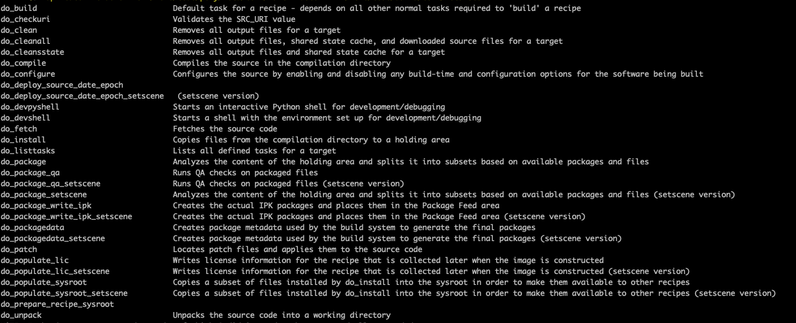

# 前言

1. 使用Yocto编译嵌入式Linux系统，原厂提供系统代码，内置支持Wayland协议

2. 使用[westeros](https://github.com/rdkcmf/westeros)作为Wayland Compositor，由[RDK（Reference Design Kit）](https://rdkcentral.com/)提供

3. 使用丰田开发的[ivi-homescreen](https://github.com/toyota-connected/ivi-homescreen)作为Flutter嵌入层，基于Waylannd+EGL

   > RDK（Reference Design Kit）是管理嵌入式应用参考设计套件的开源联盟

# Yocto介绍

Yocto是一个开源项目，用于构建嵌入式Linux系统。类似于[BuildRoot](https://buildroot.org/)（基于Makefile和Kconfig配置）

关键概念：

* Poky：指整个构建系统，包括BitBake工具、编译工具链、BSP，以及诸多程序包和层
* Metadata：元数据集
  * Recipes：`.bb/.bbappend`配方文件，配置源码下载路径、如何编译等。一个配方（Recipe）可以包含多个软件包（Package）
  * Class：`.bbclass`文件，抽象的公共代码，给各个package使用
  * Configuration：`.conf`配置文件，构建配置
* Layers：即各种`meta-xxx`目录，包含Metadata的存储库，可以单独发布、下载，便于项目维护，例如`meta-flutter`、`meta-clang`等。[官方支持的层级包和配方文件](https://layers.openembedded.org/layerindex/branch/krogoth/layers/)
* BitBake：任务执行引擎，解析Metadata，执行软件包的Task


在Yocto环境中构建Flutter：依赖[meta-flutter](https://github.com/meta-flutter/meta-flutter)项目，包含devtools工具项目、Flutter引擎项目、Flutter应用案例项目，以及各种定制嵌入层（sony、toyota、树莓派等）项目等，通过BitBake统一构建

对于Yocto，个人理解是类似于AOSP项目：

* Yocto使用Bitbake工具执行构建任务，AOSP使用make或者ninja构建
* Yocto的`.bb/.bbappend`配方文件和`.conf`配置文件，类似于AOSP的`.mk/.bp`配置文件
* Yocto项目只包含构建Metadata，代码从网上下载，AOSP需要下载所有代码进行编译。

Yocto的发行版：zeus（3.0）、dunfell（3.1）、gatesgarth（3.2）、hardknott（3.3）、honister（3.4）

## Yocto目录结构说明

```shell
.
├── build
│   ├── buildhistory
│   ├── cache
│   ├── conf
│   │   ├── local.conf # 定制化配置文件，变量定义
│   │   ├── bblayers.conf # bblayers决定哪些模块被编译
│   └── tmp # 构建的输出目录
├── downloads # build/downloads：构建过程中下载的所有源码，放到公共目录下，提高每次的编译效率
├── sstate-cache # build/sstate-cache：构建状态缓存，放到公共目录下，提高每次的编译效率
├── meta-clang
├── meta-flutter # 自己添加的Metadata项目
│   ├── conf
│   ├── recipes-devtools
│   ├── recipes-graphics
│   └── recipes-support
├── meta-meson
├── meta-openembedded
├── meta-python2
├── meta-thunder
└── poky # Poky工程通用目录结构，顶级目录${TOPDIR}
    ├── bitbake # bitbake工具目录，解析Metadata、recipes、config，执行task
    ├── contrib
    ├── documentation
    ├── meta # OE Core（Open Embedded）的Metadata，包括recipes、common、classes等
    ├── meta-poky # poky发行版配置数据
    ├── meta-selftest # OE自测的recipes和append文件
    ├── meta-skeleton # BSP和Kernel开发用的临时recipes
    ├── meta-yocto-bsp # 参考的BSP配置，厂商可以增加自己的bsp目录
    ├── scripts # 脚本文件
    └── oe-init-build-env  # 脚本文件，构建OE环境
```

`build/tmp`目录说明：构建的输出目录

```shell
└── build
    └── tmp # 构建的输出目录
        ├── deploy # 最终部署需要的文件
        │   ├── deb # deb类型的安装包
        │   ├── ipk # ipk类型的安装包
        │   ├── rpm # rpm类型的安装包
        │   ├── licenses # 各种软件的许可信息
        │   ├── images # image、rootfs（根文件系统）、boot等文件
        │   ├── sdk # 工具链安装脚本
        ├── work # 包含所有软件包的工作目录，根据CPU架构、厂商等分为多个子目录
        ├── work-share # 工作信息缓存，提高效率
        ├── sysroots-component # 制作sysroots前需要添加的组件
        ├── sysroots # 构建出的sysroots
        ├── log # 日志信息
        ├── cache # Bitbake缓存解析结果，提高后续编译效率
        ├── buildstats # 构建信息统计，每次构建都会生成一个日期目录
        └── stamps # 记录Bitbake跟踪task执行时间信息
```

`poky/meta/`目录说明：OE Core构建配置

```shell
└── poky # Poky工程通用目录结构
    └── meta # OE Core（Open Embedded）的Metadata，包括recipes、common、classes等
        ├── classes # 包含所有的.bbclass
        ├── conf # 配置文件
        ├── files # 包含license文件和系统构建的一些文件
        ├── lib # 构建需要的python库文件
        ├── recipes-bsp # uboot等硬件相关的配方
        ├── recipes-connectivity # 和其他设备通信相关的库和应用，例如ssh
        ├── recipes-core # 构建基本的Linux image所需的依赖
        ├── recipes-devtools # 构建时需要的开发工具，在目标平台也能使用
        ├── recipes-extended # 扩展的应用，例如wget、tar、zip、grep、which等
        ├── recipes-gnome # GTK+框架相关的应用
        ├── recipes-graphics # 绘图相关的库，例如vulkan、cairo、wayland、xorg、drm等
        ├── recipes-kernel # Kernel以及内核依赖的库
        ├── recipes-lsb # LSB（Linux Standard Base）需要的
        ├── recipes-multimedia # 多媒体（图片、声音、视频）支持，例如ffmpeg、webp、libpng等
        ├── recipes-support # 通用的recipes
        ├── recipes-rt # PREEMPT_RT需要的包和recipes
        ├── recipes-sato # Sato Demo
        ├── recipes.txt # recpies目录说明文件
        └── site  # 不同架构下的缓存结果
```

## local.conf配置

保存通用配置、全局变量等。

* 配置downloads目录：`DL_DIR ?= "${TOPDIR}/../downloads"`
* 配置使用的包管理器：`PACKAGE_CLASSES ?= "package_ipk/package_rpm/package_deb"`
* 镜像中安装软件：IMAGE_INSTALL_append = " openjdk-8"
* 排除软件：PACKAGE_EXCLUDE = " openjdk-8"

## Bitbake笔记

`bitbake [options] [recipename/target recipe:do_task ...]`

`bitbake -s`：列出可用的recipes。

> 原理：解析`bblayers.conf`中配置的Layer路径，从Layer中找到bb文件，解析出需要编译的recipe。
>
> 可以修改`bblayers.conf`文件，添加或移除模块。也可以使用以下命令
>
> `bitbake-layers show-layers/add-layer/remove-layer`：查看/添加/移除可用的Layers

`bitbake -g lib32-amlogic-yocto && cat pn-buildlist | grep -ve "native" | sort | uniq`：查看镜像包依赖信息。

> `-g`保存依赖信息到`pn-buildlist`文件中

`bitbake -e <recipe> | grep ^S=`：查看Package编译工作目录

`bitbake -e lib32-flutter-sdk |grep ^SRC_URI=`：查看软件源码下载路径

```shell
# 32位工作目录
$ bitbake -e lib32-flutter-sdk | grep ^S=
S="/home/code/build/tmp/work/armv7at2hf-neon-pokymllib32-linux-gnueabi/lib32-flutter-sdk/git-r0/git"
# 64位工作目录
$ bitbake -e flutter-sdk | grep ^S=
S="/home/code/build/tmp/work/aarch64-poky-linux/flutter-sdk/git-r0/git"
# 软件源码下载路径
$ bitbake -e lib32-flutter-sdk |grep ^SRC_URI=
SRC_URI="git://github.com/flutter/flutter.git;protocol=https;nobranch=1"
```

> bitbake下载软件源码失败：可以手动下载到本地，切到期望的分支和commit，修改对应的`.bb`文件，将远程Git仓库改为本地路径。

每个软件包都有自己的工作目录，包括源码、编译配置、编译输出、交叉编译需要的目标平台sysroot等。

其中temp临时目录中包含软件的Task脚本（例如`run.do_compile`、`run.do_fetch`等），Task执行log（例如`log.do_fetch`、`log.do_compile`）等。

> **注：可以在temp目录下查看和修改Task脚本，分析软件编译过程，手动执行编译命令。**

不同的Package有不同的Task，Yocto有一些通用的Task，例如fetch、clean、build、listtasks等。

* `bitbake <recipe> -c <CMD>`：执行特定Task。默认执行build任务。例如`bitbake lib32-flutter-engine-release -c clean`
* `bitbake <recipe> -c listtasks`：查看软件包可执行的Task。



## 分析flutter-engine构建过程

查看软件工作目录`temp`文件夹，分析Task脚本大致过程

1. `do_fetch`：根据`meta-flutter`中的配方文件下载Flutter引擎源代码
2. `do_unpack`：将源码解包到工作目录
3. `do_patch`：打补丁，修改Flutter引擎源代码，主要是修改引擎编译配置，`meta-flutter/recipes-graphics/flutter-engine/files`
4. `do_prepare_recipe_sysroo`t：在workdir目录下创建两个sysroot(recipe-sysroot和recipe-sysroot-native)
5. `do_configure`：执行gn命令生成构建配置
6. `do_compile`：执行ninja编译
7. `do_install`：将Flutter引擎产物拷贝到等候区，一般位于`${WORKDIR}/image`目录下，使用`${D}`表示
8. `do_package`：根据需要打包生成package
9. `do_package_write_ipk`：打包ipk
10. ...

> * `${WORKDIR}`：软件构建工作目录
> * `${D}`：`${WORKDIR}/image`
> * `${PN}`表示PackageName，例如`lib32-flutter-engine-release`

do_package相关：

```shell
# pkgdata只存放了包路径信息
# 一般包括$PN-src、$PN-dbg、$PN-dev、$PN-staticdev、$PN-doc、$PN-locale、$PN
lib32-flutter-engine-release/git-r0/$cat pkgdata/lib32-flutter-engine-release
PACKAGES: lib32-flutter-engine-release-src lib32-flutter-engine-release-dbg lib32-flutter-engine-release-sdk-dev lib32-flutter-engine-release-staticdev lib32-flutter-engine-release-dev lib32-flutter-engine-release-doc lib32-flutter-engine-release-locale lib32-flutter-engine-release

# 实际对应packages-split中的目录
lib32-flutter-engine-release/git-r0/$ls -l packages-split
drwxr-xr-x 3 builder builder 4096 Mar  9 19:47 lib32-flutter-engine-release
drwxr-xr-x 3 builder builder 4096 Mar  9 19:47 lib32-flutter-engine-release-dbg
drwxr-xr-x 3 builder builder 4096 Mar  9 19:47 lib32-flutter-engine-release-dev
drwxr-xr-x 2 builder builder 4096 Mar  9 19:47 lib32-flutter-engine-release-doc
drwxr-xr-x 2 builder builder 4096 Mar  9 19:47 lib32-flutter-engine-release-locale
drwxr-xr-x 3 builder builder 4096 Mar  9 19:47 lib32-flutter-engine-release-sdk-dev
-rw-r--r-- 1 builder builder   38 Mar  9 19:47 lib32-flutter-engine-release.shlibdeps
drwxr-xr-x 3 builder builder 4096 Mar  9 19:47 lib32-flutter-engine-release-src
drwxr-xr-x 2 builder builder 4096 Mar  9 19:47 lib32-flutter-engine-release-staticdev

# 最后会合并到package中
lib32-flutter-engine-release/git-r0/$ls -l package
drwxr-xr-x 6 builder builder 4096 Mar  9 19:47 usr
```

# Yocto编译Linux系统

## 原始系统

公司服务器已经搭建好了编译的Docker环境，并且提供了编译的脚本。

```shell
# ssh登录服务器
# 获取系统源码
$ repo init -u "ssh://$USER@tvgit.gz.xxx.cn:29418/AMLT950D4_Linux/source/repo_manifest" -b dev
$ repo sync
$ cd <代码根目录>
# 进入Docker容器
$ docker_aml_u16_build
$ export OPENLINUX_BUILD=1
# 通过脚本设置编译目标，重复设置会导致local.conf增加很多重复的变量
$ source meta-meson/aml-setenv.sh mesont5d-lib32-am301
# 整包编译
$ bitbake lib32-amlogic-yocto
# 生成的镜像位置：code/build/tmp/deploy/images/mesont5d-lib32-am301/aml_upgrade_package.img
```

## 加入meta-flutter

[meta-flutter](https://github.com/meta-flutter/meta-flutter)是Yocto Layer，用于Yocto编译。recipes包括：

* [flutter-sdk](https://github.com/flutter/flutter)：默认使用最新版，通过`FLUTTER_SDK_TAG`变量设置版本
* [flutter-engine](https://github.com/flutter/engine)：默认使用和Flutter SDK对应的版本
* [flutter-gallery](https://github.com/flutter/gallery)：Sample应用
* [ivi-homescreen](https://github.com/toyota-connected/ivi-homescreen)：Toyota/AGL - Wayland嵌入层
* [flutter-pi](https://github.com/ardera/flutter-pi)：树莓派DRM嵌入层
* [sony](https://github.com/sony/flutter-embedded-linux)：Sony嵌入层flutter-eLinux
* [flutter-wayland](https://github.com/jwinarske/flutter_wayland)、[waylandpp](https://github.com/NilsBrause/waylandpp)：基于Wayland的嵌入层，类似ivi-homescreen。最新的meta-flutter已经去除

步骤如下：

1. 下载`meta-flutter`到源码根目录：`git clone https://github.com/meta-flutter/meta-flutter.git`
1. 下载`meta-clang`到源码根目录：`git clone https://github.com/kraj/meta-clang.git`
3. `meta-clang`切换分支：`git checkout -b dunfell origin/dunfell`
2. `bblayers.conf`中配置Layer路径，或者执行`bitbake-layers add-layer /home/code/meta-flutter`
3. 设置Flutter SDK版本：`local.conf`中添加变量`FLUTTER_SDK_TAG = "2.8.1"`

### 整包编译

1. 整包编译时安装软件包：`local.conf`中添加变量`IMAGE_INSTALL_append = " lib32-flutter-engine-release lib32-ivi-homescreen-release lib32-flutter-gallery-release"`（注意开头有空格）
2. 整包编译：`bitbake lib32-amlogic-yocto`

### 局部编译

局部编译`ivi-homescreen`和`flutter-engine`，再将生成的库手动push到系统中。

```shell
$ bitbake lib32-ivi-homescreen-release
$ bitbake lib32-flutter-engine-release
```

`ivi-homescreen`运行只需要几个关键的库，这里收集起来放到一起，避免去构建目录中查找

```shell
aml_armv7at2hf_yocto$ tree
├── aml_upgrade_package.img # 系统软件包
├── sdk # Flutter引擎编译生成，由engine_sdk.zip解压而来
│   ├── clang_x64
│   │   └── gen_snapshot # Flutter引擎编译生成的后端编译器
│   ├── engine.version
│   ├── platform_strong.dill
│   ├── platform_strong.dill.d
│   └── vm_outline_strong.dill
└── usr
    ├── bin
    │   └── homescreen # ivi-homescreen嵌入层程序入口
    ├── lib # ivi-homescreen需要的链接库
    │   ├── libc++.so.1 # llvm编译生成
    │   ├── libc++abi.so.1 # llvm编译生成
    │   └── libflutter_engine.so # Flutter引擎编译生成
    └── share
        ├── flutter
        │   ├── engine_sdk.zip
        │   └── icudtl.dat # Flutter运行需要的国际化数据文件
        └── homescreen # Flutter Samples编译产物，包括flutter_assets和libapp.so
            ├── image_list
            ├── particle_background
            ├── platform_view
            └── testing_app
```

## 踩坑记录

### gn不支持`--no-build-embedder-examples`参数

`bitbake lib32-flutter-engine-release -v`构建失败，提示gn不支持`--no-build-embedder-examples`参数

> 原因：Flutter引擎版本问题
>
> 分析：默认的PACKAGECONFIG包含`disable-embedder-examples`，导致gn命令会添加`--no-build-embedder-examples`选项。
>
> ```shell
> # meta-flutter/recipes-graphics/flutter-engine/flutter-engine.inc
> PACKAGECONFIG ??= "disable-desktop-embeddings \
>                    disable-embedder-examples \
>                    embedder-for-target \
>                    fontconfig \
>                    ${FLUTTER_RUNTIME} \
>                   "
> PACKAGECONFIG[disable-desktop-embeddings] = "--disable-desktop-embeddings"
> PACKAGECONFIG[disable-embedder-examples] = "--no-build-embedder-examples"
> ```
>
> 解决：`local.conf`中添加如下变量，去掉`disable-embedder-examples`，覆盖默认的PACKAGECONFIG
>
> ```shell
> PACKAGECONFIG_pn-flutter-engine-release = "disable-desktop-embeddings embedder-for-target fontconfig release"
> PACKAGECONFIG_pn-flutter-engine-debug = "disable-desktop-embeddings embedder-for-target fontconfig debug"
> PACKAGECONFIG_pn-flutter-engine-profile = "disable-desktop-embeddings embedder-for-target fontconfig profile"
> ```

### 无法编译Dart SDK

`bitbake lib32-flutter-engine-release -v`构建失败，报错如下

```shell
Command failed: /home/code/build/tmp/work/armv7at2hf-neon-pokymllib32-linux-gnueabi/lib32-flutter-engine-release/git-r0/src/out/linux_release_arm/clang_x64/dart 
--disable-dart-dev --deterministic 
--packages=/home/code/build/tmp/work/armv7at2hf-neon-pokymllib32-linux-gnueabi/lib32-flutter-engine-release/git-r0/src/flutter/flutter_frontend_server/.dart_tool/package_config.json 
--snapshot=/home/code/build/tmp/work/armv7at2hf-neon-pokymllib32-linux-gnueabi/lib32-flutter-engine-release/git-r0/src/out/linux_release_arm/gen/frontend_server.dart.snapshot 
--snapshot-depfile=/home/code/build/tmp/work/armv7at2hf-neon-pokymllib32-linux-gnueabi/lib32-flutter-engine-release/git-r0/src/out/linux_release_arm/gen/frontend_server.dart.snapshot.d 
--depfile-output-filename=gen/frontend_server.dart.snapshot 
--snapshot-kind=kernel /home/code/build/tmp/work/armv7at2hf-neon-pokymllib32-linux-gnueabi/lib32-flutter-engine-release/git-r0/src/flutter/flutter_frontend_server/bin/starter.dart 
--train 
--sdk-root=/home/code/build/tmp/work/armv7at2hf-neon-pokymllib32-linux-gnueabi/lib32-flutter-engine-release/git-r0/src/out/linux_release_arm/flutter_patched_sdk 
/home/code/build/tmp/work/armv7at2hf-neon-pokymllib32-linux-gnueabi/lib32-flutter-engine-release/git-r0/src/flutter/flutter_frontend_server/bin/starter.dart
output:
===== CRASH =====
si_signo=Segmentation fault(11), si_code=1, si_addr=0x7f3b9f7dd1fc
```

> 原因：编译的ARM架构的`out/linux_release_arm/clang_x64/dart`程序无法执行。导致生成Kernel快照失败，例如`frontend_server.dart.snapshot`、`analysis_server.dart.snapshot`、`dartdoc.dart.snapshot`等
>
> `bitbake flutter-engine-release`编译正常：ARM64架构的dart程序可以正常执行。
>
> 分析：其实引擎编译的关键产物只有`gen_snapshot、libflutter_engine.so`。生成的Dart程序是平台无关的，直接用Flutter SDK中现成的即可，没必要编译Dart SDK。
>
> 解决：只要跳过Dart SDK编译即可，**修改`src/flutter/BUILD.gn`文件，将`_build_engine_artifacts`改为false**
>
> 旧版本`meta-flutter`还需要修改`flutter-engine.bb`文件：
>
> ```shell
> # meta-flutter/recipes-graphics/flutter-engine/flutter-engine.bb
> # 删掉full-dart-sdk
> PACKAGECONFIG ?= "disable-desktop-embeddings \
>                    embedder-for-target \
>                    fontconfig \
>                    full-dart-sdk \
>                    mode-release \
>                   "
> # ...
> # 删掉下面一行：将编译好的dart前端安装到image中。
> install -m 644 ${S}/${OUT_DIR_REL}/dart-sdk/bin/snapshots/frontend_server.dart.snapshot  ${D}/${datadir}/flutter/sdk/
> ```
>
> 新版本`meta-flutter`配置改为了`flutter-engine.inc`文件：
>
> 1. 去除掉了上面的两个配置：高版本Dart虚拟机不再接收Dart源文件，只接收Kernel代码，将编译前后端分离。因此直接在主机编译Kernel即可，没必要安装编译前端。
> 2. gn命令默认加了`--no-stripped`选项，可以去掉
>
> ```shell
> # meta-flutter/recipes-graphics/flutter-engine/flutter-engine.inc
> GN_ARGS = "${PACKAGECONFIG_CONFARGS} --clang --lto --no-goma --no-stripped "
> ```

### 整包编译空间不足

根据文档预装软件到系统中：`IMAGE_INSTALL_append = " lib32-flutter-engine-release lib32-ivi-homescreen-release lib32-flutter-gallery-release"`

```shell
# 整包编译报错
$ bitbake lib32-amlogic-yocto
The initramfs size xxx exceeds INITRAMFS_MAXSIZE: 131072
You can set INITRAMFS_MAXSIZE a larger value. Usually, it should
be less than 1/2 of ram size, or you may fail to boot it.

# 全局搜索，默认值是128M
/home/code/poky$grep -inR "INITRAMFS_MAXSIZE" *
meta/conf/bitbake.conf:789:INITRAMFS_MAXSIZE ??= "131072"
```

> 解决：只保留homescreen编译成功，`IMAGE_INSTALL_append = " lib32-ivi-homescreen-release"`
>
> homescreen依赖flutter-engine，因此引擎也会被打包进去。升级软件之后可以直接运行homescreen

# Flutter Linux ARM应用编译

```shell
# 前端编译生成app.dill
$ dart frontend_server.dart.snapshot \
--target=flutter \
--aot --tfa \
-Ddart.vm.profile=false -Ddart.vm.product=true \
--sdk-root flutter_patched_sdk \
--output-dill app.dill \
demo/lib/main.dart

# 后端编译生成libapp.so
$ sdk/clang_x64/gen_snapshot \
--snapshot_kind=app-aot-elf \
--elf=libapp.so \
app.dill
```

文件和路径说明：

* `dart`：使用Flutter SDK自带的Dart。**Flutter SDK版本要和Flutter引擎版本对应**
  * `flutter/bin/dart`
* `frontend_server.dart.snapshot`：使用Flutter SDK缓存的前端编译器，或者引擎编译生成的前端编译器
  * `flutter/bin/cache/artifacts/engine/linux-x64/frontend_server.dart.snapshot`
  * `out/linux_release_arm/frontend_server.dart.snapshot`
* `flutter_patched_sdk`：使用Flutter SDK缓存的文件，或者引擎编译生成的文件
  * `flutter/bin/cache/artifacts/engine/common/flutter_patched_sdk`
  * `out/linux_release_arm/flutter_patched_sdk`
* `gen_snapshot`：引擎编译生成的后端编译器，用于在Linux x86_64平台上交叉编译出ARM平台目标代码。
  * `out/linux_release_arm/clang_x64/gen_snapshot`

# Flutter应用启动


1. 升级软件开机
2. 杀掉WPExxx的进程（有两个进程）
3. `su`进入root，或者`export XDG_RUNTIME_DIR=/run`
4. `westeros-init &`：启动westeros服务端
5. `westeros_test`：启动westeros示例客户端，运行成功显示UI
6. 将`aml_armv7at2hf_yocto`下的文件夹push到板卡对应路径下（整包编译不需要再push引擎和homescreen，只需要装入应用即可）
7. `homescreen --a=/usr/share/homescreen/image_list/flutter_assets`：运行Flutter程序，提前编了4个sample

> `--a`指定应用路径，不指定的话默认会找`/usr/share/homescreen/bundle`目录。可以将应用路径链接到bundle目录，如下
>
> ```shell
> $ cd /usr/share/homescreen
> # 将程序链接到bundle
> $ ln -sf particle_background/ bundle
> # homescreen查找默认目录
> $ homescreen
> ```

默认系统环境：AML 950D4 Linux平台，版本如下

```shell
sh-5.0# uname -a
Linux mesont5d-lib32-am301 5.4.125-amlogic #1 SMP PREEMPT Fri Mar 4 18:02:24 CST 2022 aarch64
sh-5.0# cat /proc/version
Linux version 5.4.125-amlogic (oe-user@oe-host) (aarch64-poky-linux-gcc (GCC) 9.3.0, GNU ld (GNU Binutils) 2.34.0.20200220) #1 SMP PREEMPT Fri Mar 4 18:02:24 CST 2022
```

系统默认使用WPEFramework运行应用。[WPEFramework](https://webkit.org/wpe/)是嵌入式设备的WebKit引擎，能够运行Web应用。执行以下命令可以打开WPE Launcher应用

```shell
# 启动WPEFramework引擎，开启了一个网络端口
$ wpeframework.sh &
# 通过curl请求端口，传入参数启动Launcher应用
$ launcher.sh &
```
