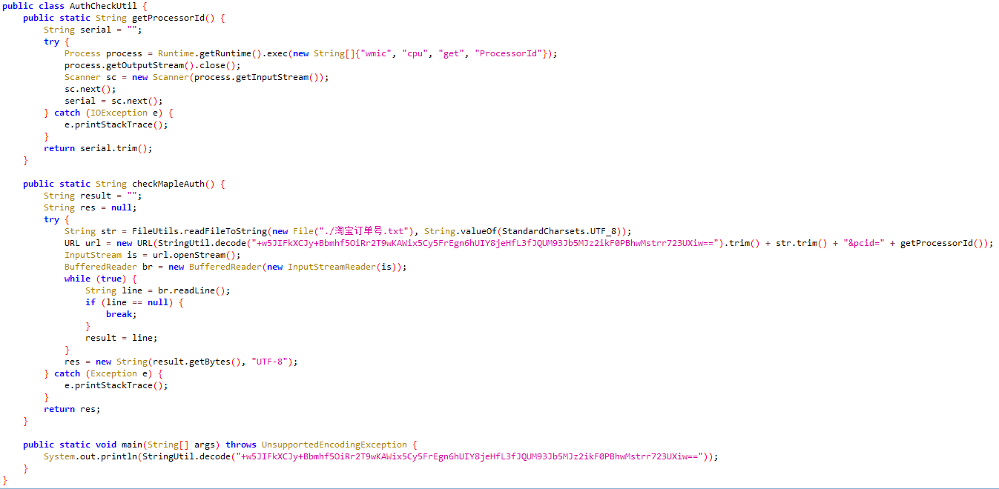
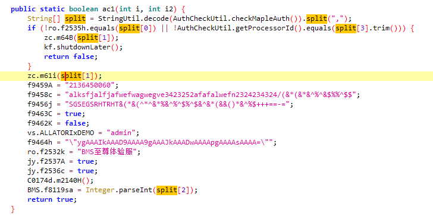
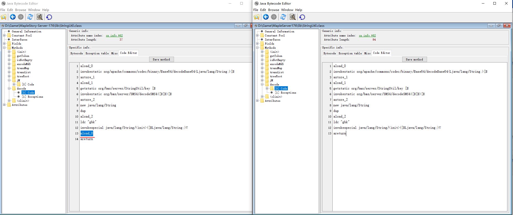
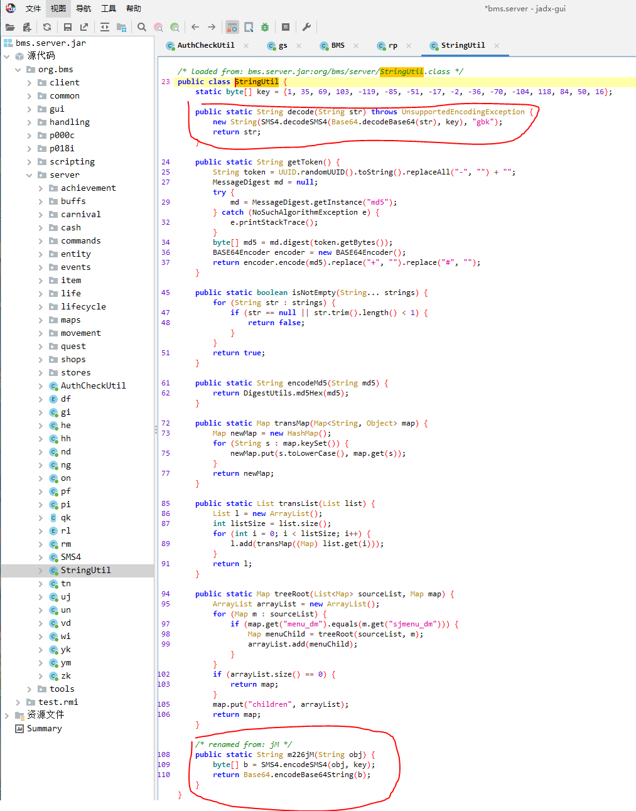
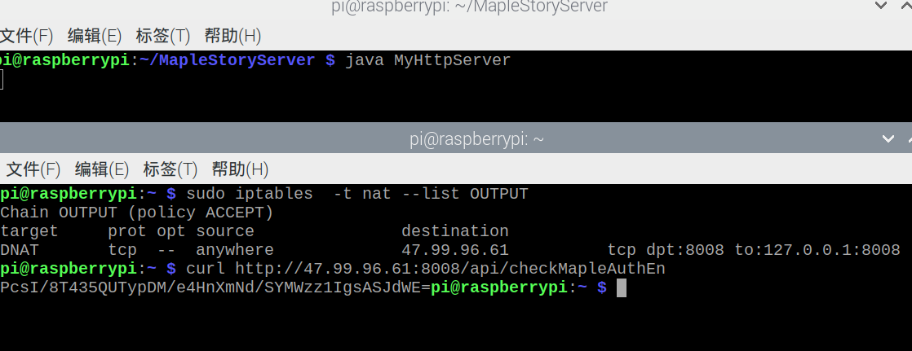
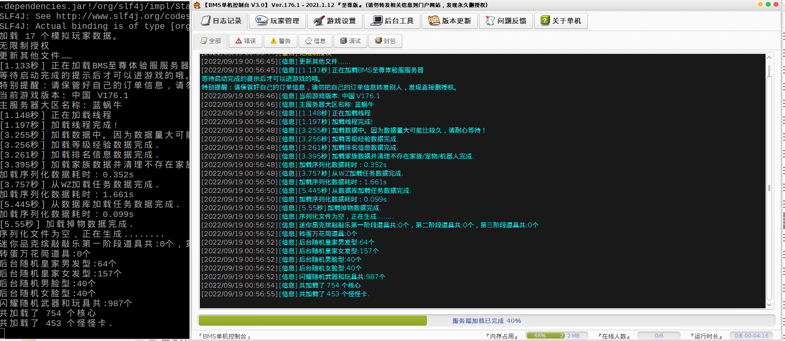

# 前言

私服不用玩太多版本，只要一个079的旧版本，一个来高版本体验新职业新剧情。

高版本的端不太好找，都是付费的，还不一定能跑。而且都是打包混淆过的，没有源码，反编译查看也比较吃力。

- [搬运，2021冒险岛176至尊版 ](https://www.fengyewuyu.com/thread-4801-1-1.html)：需要淘宝订单号，服务端验证
- [某宝买的冒险岛单机版V175一键端，简单操作 ](http://www.rexuexia.com/forum.php?mod=viewthread&tid=35265&page=1&authorid=93572)：基于上面的端改的，又加了一层验证码验证
- [冒险岛176第二版来自冒险岛单机交流群 ](http://www.rexuexia.com/forum.php?mod=viewthread&tid=36921&page=3&authorid=107404)：也是基于上面的端改的，不过跳过了授权校验的步骤，需要付30金币的下载费

# 教程

用上面的第三个资源，帮我们绕过了服务端验证，使用比较简单

1. 使用phpStudy启动数据库
2. 使用一键启动器来启动服务端和客户端

也可以命令行启动服务端：`java -cp ;lib/*;jre8x64/lib/ext/log4j-core-2.14.0.jar;jre8x64/lib/ext/* org.bms.gui.BMS`


高版本的客户端好像没法用原来的命令行指定端口号启动，需要用它带的登录器，点击上图的"游戏启动"

运行成功截图


# 服务端破解

这里介绍下怎么绕过第一个资源的淘宝订单号验证。主要用于学习，第三个资源已经帮我们跳过了，可以直接使用

暂时能想到的一些破解思路：

1. 反编译修改Java源码，重新编译打包
2. 修改字节码，再打包
3. 拦截服务端验证请求，模拟返回成功结果

使用jadx反编译工具查看jar包

## AuthCheckUtil请求服务端

首先全局搜索"淘宝订单号"，定位到`AuthCheckUtil`类，代码逻辑比较简单，拼接淘宝订单号和`ProcessorId`，请求服务端验证。



`org.bms.server.AuthCheckUtil`的main函数中输出了验证端url。因此可以运行AuthCheckUtil：`java -cp ;lib/*;jre8x64/lib/ext/log4j-core-2.14.0.jar;jre8x64/lib/ext/* org.bms.server.AuthCheckUtil`。

输出`http://47.99.96.61:8008/api/checkMapleAuthEn?ddhmid=`，即url地址

`getProcessorId`方法使用wmic获取PC的`ProcessorId`，服务端加密之后返回

> wmic：Windows Management Instrumentation Command-line，Windows管理工具

## 校验返回值

查询`checkMapleAuth`使用的地方

下面的代码拿到服务端返回的加密字符串，调用`StringUtil.decode`方法进行解密，使用逗号分割。

* `split[0]`就是个常量1，这里做了校验
* `split[1]`没什么意义，就是打印了一下字符串
* `split[2]`可以知道是一个Int值
* `split[3]`是ProcessorId，这里做了校验



# 方式一：修改字节码

根据上面的代码，可以尝试修改字节码，跳过服务端验证。

使用7-zip打开jar包，将`AuthCheckUtil.class`、`StringUtils.class`文件提取出来，使用jbe打开，修改完之后再拖进压缩包中。

> **找到合适的切入点，尽可能小的改动，防止引起其他异常。**

首先修改checkMapleAuth返回值，`ldc`表示加载常量到方法栈中。

> 这里直接反编译了上面的第二和第三个资源，也是修改了checkMapleAuth方法的返回值，返回字符串`1,无限制授权,10`，还去掉了解密的过程。


这里为了不修改校验的逻辑，我们再修改下`getProcessorId`的返回值


修改decode方法的返回值，`aload0`表示将传入的参数原封不动的返回。

> 全局搜了一下这个方法只用到了一次，因此不会影响到其他地方。如果被用到了就要换个地方修改，例如修改切割字符串的地方。



修改之后使用`java -cp  ;lib/*;jre8x64/lib/ext/log4j-core-2.14.0.jar;jre8x64/lib/ext/* org.bms.gui.BMS`成功运行。

# 方式二：拦截请求模拟服务端响应

由于URL是IP地址，想着有没有类似host配置（将域名映射成IP）一样的东西，将目标IP映射到自己的服务器IP和端口上，然后模拟服务端返回成功的结果。

这里要拦截的是从自己电脑出口的请求。

## 反编译查看加密方法

根据上面反编译的结果，可以知道服务端返回的字符串做了加密，反编译StringUtil查看加密和解密的方法，尝试逆推。

可以看到`JM`方法用于加密，decode方法用于解密。



## 获取服务端返回的加密字符串

### 修改main方法字节码

上面知道`AuthCheckUtil`的main方法打印了服务端的url，这里简单修改下main方法，改为调用加密方法加密字符串


执行结果如下，`PcsI/8T435QUTypDM/e4HnXmNd/SYMWzz1IgsASJdWE=`即加密过的字符串

```shell
$ java -cp  ;lib/*;jre8x64/lib/ext/log4j-core-2.14.0.jar;jre8x64/lib/ext/* org.bms.server.AuthCheckUtil
PcsI/8T435QUTypDM/e4HnXmNd/SYMWzz1IgsASJdWE=
```

### 调用加密方法

另一种方式，自己编写main文件，调用加密方法

```java
public class Main{
	public static void main(String[] args) {
		System.out.println(org.bms.server.StringUtil.jM("1,无限制授权,10,123"));
	}
}
```

使用javac命令编译，由于使用了jar包中的方法，因此需要指定`classPath`，否则会找不到方法

`javac -cp ;bms.server.jar Main.java -encoding utf8`

使用java命令运行，由于`StringUtil`依赖了apache的codec库，因此也要包含到`classPath`中

`java -cp ;bms.server.jar;commons-codec-1.7.jar Main`

同样输出`PcsI/8T435QUTypDM/e4HnXmNd/SYMWzz1IgsASJdWE=`

## 出口请求拦截

查了一下可以通过**IP地址重定向**的方式拦截请求：

### Windows

Windows：使用netsh，貌似只能将外部进入本机的请求进行转发，无法对本机的出口进行转发（失败）

```shell
# 查看所有监听的端口
netsh interface portproxy show all
# 添加规则
netsh interface portproxy add v4tov4 listenaddress=47.99.96.61 listenport=8008 connectaddress=192.168.1.104 connectport=80 protocol=tcp
# 删除规则
netsh interface portproxy delete v4tov4 listenaddress=47.99.96.61 listenport=8008
```

另外的思路：使用虚拟网卡+netsh命令，参考[Windows 下的 IP 重定向，非改 host](https://blog.csdn.net/qq_34083079/article/details/110141360)

> 没有实际尝试过，这种时候还是Linux方便

### Linux

Linux：使用iptables，可以成功转发，参考[iptables](https://blog.csdn.net/weixin_45186298/article/details/122910466)

将`http://47.99.96.61:8008/api/checkMapleAuthEn?ddhmid=`转发到本机的80端口

```shell
# 查看规则
sudo iptables  -t nat --list OUTPUT
# -A添加规则
sudo iptables -t nat -A OUTPUT -d 47.99.96.61 -p tcp --dport 8008 -j DNAT --to-destination 127.0.0.1:80
# -D删除规则
sudo iptables -t nat -D OUTPUT -d 47.99.96.61 -p tcp --dport 8008 -j DNAT --to-destination 127.0.0.1:80
```

通过curl命令可以成功访问本地的80端口的结果`curl http://47.99.96.61:8008`

## 启动Web服务

将IP转发到自己的机器上后，需要开启Web服务，监听对应端口，模拟返回成功的结果

1. 使用Apache自带Web服务，监听80端口：将html网页放到这个目录下`/var/www/html/`，url带路径则新建文件夹
2. 使用Java简易服务器：代码如下，使用`javac -encoding "utf8" MyHttpServer.java`编译，再使用java命令运行class文件。（这里监听的是8008端口，因此需要将上一步的IP转发到8008端口）

```java
import com.sun.net.httpserver.HttpServer;
import java.io.IOException;
import java.io.OutputStream;
import java.net.InetSocketAddress;
import java.util.concurrent.Executors;

public class MyHttpServer {
    public static void main(String[] args) {
        try {
            HttpServer server = HttpServer.create(new InetSocketAddress(8008), 0);
            server.createContext("/api/checkMapleAuthEn", httpExchange -> {
                String response = "PcsI/8T435QUTypDM/e4HnXmNd/SYMWzz1IgsASJdWE=";
                httpExchange.sendResponseHeaders(200, response.getBytes().length);
                try (OutputStream os = httpExchange.getResponseBody()) {
                    os.write(response.getBytes());
                }
            });
            server.setExecutor(Executors.newCachedThreadPool());
            server.start();
        } catch (IOException e) {
            e.printStackTrace();
        }
    }
}
```

运行MyHttpServer，再使用curl请求地址，成功拦截了请求。（正常访问由于没有淘宝订单号，请求会超时或者错误）



## Linux模拟wmic结果

由于wmic是Windows上的程序，因此`getProcessorId`方法会出错，这里直接写一个脚本模拟。

创建一个wmic文件，把他放到`/usr/bin`目录（默认的环境变量）下即可执行。


## 运行服务端

由于是Linux环境，无法运行一键启动器，因此使用java命令启动`java -cp  :lib/*:jre8x64/lib/ext/log4j-core-2.14.0.jar:jre8x64/lib/ext/* org.bms.gui.BMS`

> Linux使用冒号分割ClassPath

可以看到**成功跳过了服务端验证**，不过会卡在加载怪怪卡的地方。



使用上面的第三个资源也有一样的问题，因为下载的服务端没有针对Linux做过适配。暂时还未找到原因，后面可以尝试分析下。