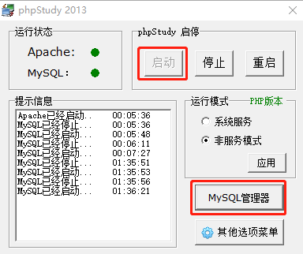
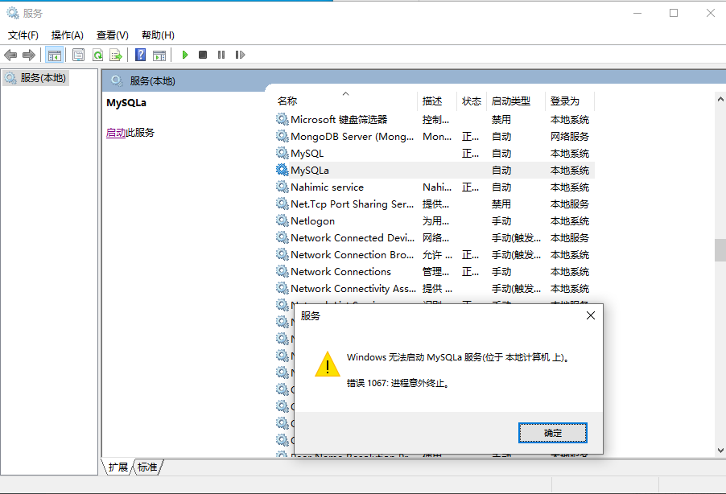

# 前言

之前有几次想玩树莓派，但是由于芯片涨价，价格翻了几倍，买了感觉很亏。于是收藏了一些教程，想等降价了再买，后来瘾头就慢慢淡了。最近又看到一些树莓派的教程，想法又源源不断的冒出来，FC游戏机、私服等，不过查了一下价格又贵了。。。

想到游戏和私服就联想到自己最喜欢玩的冒险岛：从05年开始接触，那时候和老哥玩一台电脑，都是一人操作键盘控制，一人操作鼠标点NPC；那时候疯狂拣地上的金币道具，跟大佬讨装备；那时候大家还是组队过副本，废都、通天塔，新出的休.彼得曼嘉年华；那时候升级很慢，几个月都升不到3转，跳格子任务都要花好长时间，真惊讶当时为什么这么有耐心。后来就开始过图、飞天、稳如泰山、吸怪，外挂满天飞了。

大巨变之后没有一直玩，不过兴之所至就要上线体验下新职业，一般刷到4转就没什么动力了，辗转回归了10几次，差不多几十个职业都玩过。

老实说大巨变之后除了玩家少了，由于升级快组队任务没人过之外，也没什么让我不喜欢的，职业、技能变酷炫了、地图、音乐变多了、剧情铺开来了。就算纯粹逛逛风景、听听音乐、看看剧情也不错。

纯粹是越长大越来越不闲了，游戏没变，变的是人。

> 每次看到冒险岛相关的文章和视频就忍不住点进去看。
>
> 这篇不错，理科生就写不出这样的文笔，收藏为敬：[为什么《冒险岛》玩家都想回到“大巨变”之前？](http://news.sohu.com/a/566460939_628730)

想法起来后就挥之不去，也一直很好奇私服是怎么搭建的，外挂是怎么来的。迫不及待的查了下资料，确认了可行性，而且还可以学习源码，体验下改库的快乐。

所以，在等树莓派之前就先折腾冒险岛私服吧！

收集了好几个教程，打算一一尝试，看看哪个最好用，记录一下踩的坑。

# 总结

看了多个教程，做些总结。

搭建私服需要的文件：了解这些文件的作用，可以随意组合，不用完全按照教程来。例如**服务端可以部署到Linux服务器上**。

1. 冒险岛客户端
2. 客户端登录器：作用是指定服务器IP地址、端口号。
3. 冒险岛服务端：一般是Java程序，有的带源码，有的不带源码。需要Java+MySQL+Apache环境
4. 冒险岛MySQL数据库文件：一般带在服务端中，也可以单独下载、自行导入。一般是SQL文件或者PSC文件
5. MySQL数据库管理：非必须，可以使用Navicat、phpMyAdmin，也可以纯命令行
6. WZ文件：从客户端提取的资源，一般带在服务端中，也可以自行提取，放到服务端目录下。wz版本不对应可能会出问题，后台认为资源被修改，会进行拦截封号。
7. HShield：客户端反外挂程序，需要覆盖掉客户端目录中的文件。原因未知。

客户端登录器也可以使用脚本启动：输入下面命令，或者新建bat脚本运行

```bash
taskkill /im MapleStory.exe /f
maplestory.exe 127.0.0.1 9555
```

WZ文件是Wizet公司用来压缩和加密游戏资源的文件，冒险岛所有游戏资源都打包在WZ文件中，例如角色、技能、地图、怪物、NPC等。

可以通过一些工具提取：例如HaRepacker，[wz](https://github.com/xsoameix/wz)，[WzComparerR2](https://github.com/Kagamia/WzComparerR2)

> 先插个眼，以后想自己开发一款冒险岛可以尝试逆向破解

# 教程1

[冒险岛079完整全套架设教程](https://zhuanlan.zhihu.com/p/392762992)：教程比较简单，这里就不贴太多图了，简单记录下步骤和踩的坑

## 资源准备

暂时没上传网盘，从上面链接下载即可

1. 079客户端+补丁1.5m：安装客户端，将补丁复制到客户端安装目录，双击安装即可。
2. Win10专用HShield：Hack Shield反外挂程序，解压后覆盖掉客户端安装目录中的HShield文件夹，修改ehsvc.ini文件中的`GamePath`为客户端安装路径。
3. 登录器：豆豆冒险岛登录器，解压之后放到客户端安装目录下
4. 服务端：Windows环境的服务端，使用phpStudy集成环境，部署简单，直接解压即可。

> phpStudy集成了Apache+PHP+MySQL+phpMyAdmin+ZendOptimizer等PHP开发环境

## 启动服务端

打开`mSer->MySQL`目录，启动phpStudy程序，点击启动Apache和MySQL服务。两个灯一直绿色表示成功（有可能起了之后过一会又挂了）。



MySQL管理器中可以打开phpMyAdmin，是一个基于Web的MySQL GUI管理程序，如下，后续可以在这里修改数据库。

> 服务端中的Navicat无法使用，直接用phpMyAdmin就行
>
> MySQL初始用户名和密码是root


回到`mSer`目录，启动服务端，如下图表示启动成功

> GUI控制台有些GM命令，例如给金币、给物品等，可以自己实验下。
>
> 在这里[mxdweb](https://mxdweb.com/)可以查到对应的物品ID


## 打开客户端

使用豆豆冒险岛登录器打开客户端（**以管理员身份运行，否则会无响应**，服务端启动遇到问题也可以尝试以管理员身份运行），即可进入游戏。

随便输入账号密码，点击连接会自动创建账号


## 踩坑

电脑上已经装了一个MySQL 5.7.22了，再启动phpStudy中的MySQL 5.5.34失败（后面简称5.7、5.5），这个时候启动冒险岛服务端没反应。

手动启动MySQL服务报错误1067



先普及一些命令：

1. 卸载Windows服务：`sc delete <服务名称>`，例如`sc delete mysql`，需要管理员权限运行
2. 安装MySQL服务：进入MySQL的bin目录，`.\mysqld.exe -install [服务名称]`，不指定的话默认服务名称为MySQL。为了服务不重名，可以指定一下。
3. 启动MySQL服务：`net start mysql`，或者在【Windows服务】中手动启动
4. 查看端口号占用情况：`netstat -ano | grep 3306`
5. 登录mysql：`mysql -u root -p`，默认登录端口为3306，如果修改了端口号，可以使用`--port=<端口号>`或者`-P 端口号`指定

试了网上好多种解决方法都不行，这里也记录一下，以后遇到了类似的问题可以尝试下

方法一：检查`my.ini`文件中的baseDir和dataDir

方法二：修改MySQL 5.7的端口为3307，避免冲突

方法三：将5.5的data目录中冒险岛的数据库文件复制到5.7中，再手动启动5.7的服务。

> phpStudy的灯倒是绿了，但是冒险岛的数据库有些问题，可能是不同版本数据库格式兼容的问题？

方法四：修改环境变量Path中的MySQL为5.5的路径

方法五：

1. `sc delete mysql`卸载MySQL 5.7服务

> 只是卸载Windows服务而已，MySQL程序和数据库不会丢失。
>
> 如何恢复：进入5.7的bin目录，执行`.\mysqld.exe -install`即可重新安装服务。

2. 再安装phpStudy中的MySQL服务

> 可以在phpStudy的其他选项菜单中操作安装，默认服务名称叫"MySQLa"。也可以用命令安装。

## 解决

Get到了Windows上查看日志的方式，如图：这里启动失败的MySQL是5.5的，但是报错提示读不到的却是MySQL 5.7的路径。


最后发现是环境变量的问题，只修改`Path`没用，**要把`MYSQL_HOME`环境变量改成5.5的路径**，应该是MySQL服务读取了该变量。

如下图，我把两个版本的MySQL路径都存了下来，需要用到哪个就改一下。

> 两个服务可以都安装，只要指定不同的服务名，但是不能同时运行，因为`MYSQL_HOME`变量只有一个，即使改了端口号也不行。


# 教程2

[冒险岛v83](https://forum.ragezone.com/f428/how-to-make-a-maplestory-741739/)：好像是美国的客户端，不知道为什么安装不了，并且登录器提示有病毒没法运行。做个存档

- Java SE Development Kit (JDK) [[32bit\]](http://www.mediafire.com/download.php?3ik2ax7srinpt23) || [[64bit\]](http://www.mediafire.com/download.php?3qrxipqpmxsnbrd)：JDK
- MySQL Query Browser [[Link\]](http://www.brothersoft.com/mysql-query-browser-for-windows-download-71868.html)：数据库管理器，没用上，用命令行或者phpMyAdmin、Navicat代替也行
- JCE Unlimited Strength Files [[Link\]](http://www.mediafire.com/download.php?0g6t7xpcrbu4u8p)：Java Cryptography Extension，加密扩展包，好像没用上
- WampServer [[Link\]](http://www.wampserver.com/en/download.php)：Apache服务器
- LocalHost v83 [[Link\]](http://www.mediafire.com/?99ecxofh1436129)：客户端登录器
- ZenthosDev v83 [[Link\]](http://www.mediafire.com/download.php?j43req4bj7l6nzk)：服务端
- MapleStory v83 [[Link\]](https://mega.nz/#!098x2RII!m6aWPfTxcycUczGiaKxyuqHdKae391mwmNQfDWOCubY)：v83客户端
- WZ Files [[Link\]](http://www.mediafire.com/?95sypygu1la3aeo)：冒险岛资源文件

服务端倒是成功跑起来了：

1. 安装Java+Apache+MySQL数据库，电脑都有，没有用到上面提供的
2. 导入冒险岛数据库文件：登录mysql，输入`source <路径>`即可
3. 解压WZ文件到服务端目录
4. 运行`[ZenthosDev] OneW.bat`程序，如果出错连不上mysql的话，需要修改`server.properties`中的配置，我遇到的是需要将Mysql密码改为root

# 其他资源

* [冒险岛私服教程](https://www.jiaosf.com/ym-131.html)：论坛，很多东西要登录和付费，懒得搞，以后找不到了再尝试
* [冒险岛079单机版](http://www.xfdown.com/soft/131142.html)：将所有环境装了VMWare虚拟机中，由于我的系统里已经开了HyperV虚拟机，没法共存，这里只做个存档
* [Linux服务端搭建：](https://hostloc.com/thread-878810-1-1.html)客户端很多资源都过期了，不过应该可以用教程1里面的079客户端，服务端其实就是GitHub上的[MapleStory](https://github.com/aoaostar/MapleStory)。等树莓派到了之后试下能不能在linux下运行服务端
* [架设自己的冒险岛服务端](https://www.fengyewuyu.com/thread-1573-1-1.html)：同教程1，都使用phpStudy，不过资源比较全，包含服务端源码。做个存档