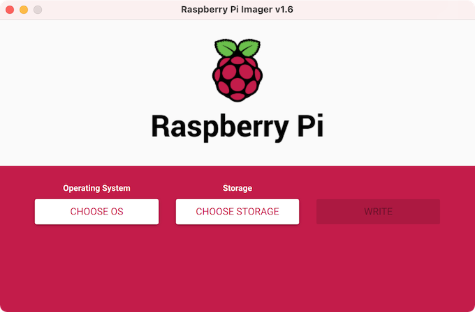
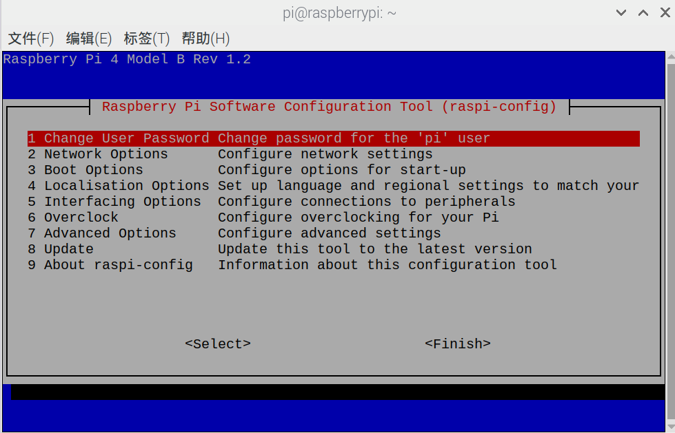
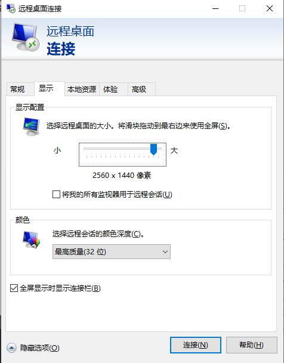
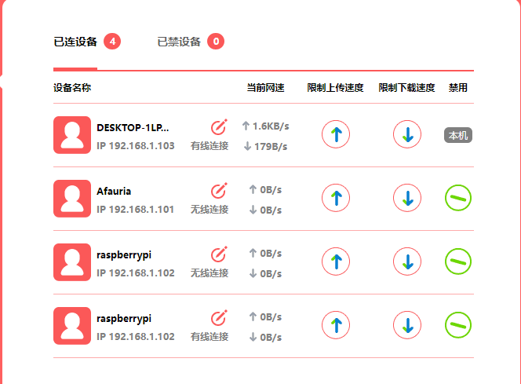
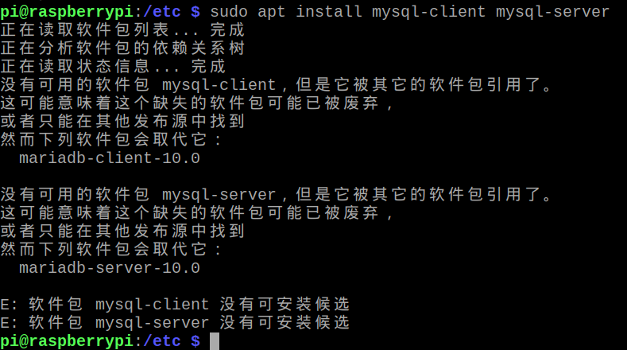
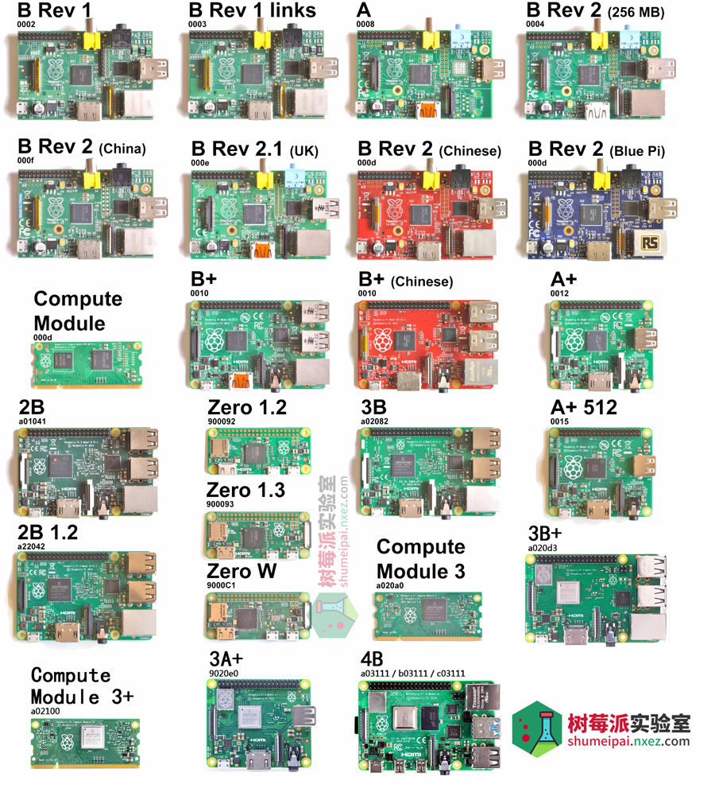
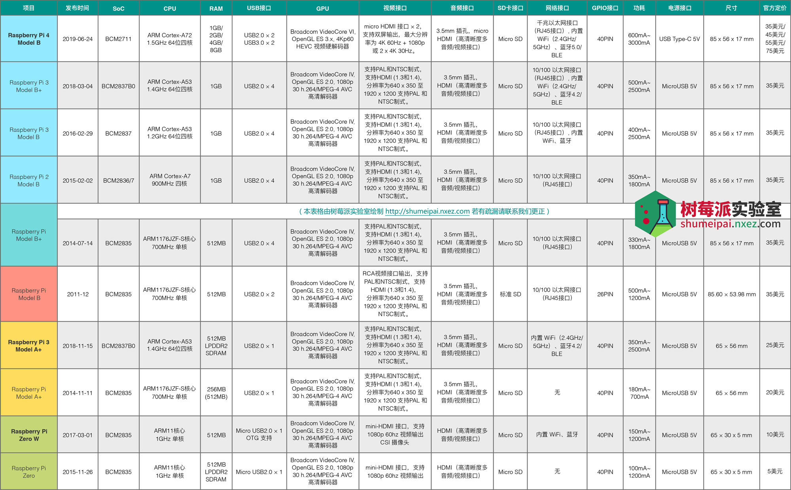

# 前言

闲鱼600淘了个树莓派4B 4G，带风扇、32G TF卡、7寸非触摸显示器、面包板等。可能还需要一套mini的键鼠、手柄、音响、一个读卡器。

> 只做服务器的话，用远程桌面登录，可以不要键鼠
>
> 手柄主要是用于retropie玩游戏用的

主要是想当服务器和FC游戏机使用。后面可能还会做NAS。

# Raspbian系统烧录

由于手上没有读卡器，所以直接用卖家留下来的Raspbian系统。这里查了下网上的教程，没有亲自实践

1. 下载烧录工具：[Raspberry Pi Imager（Windows版）](https://downloads.raspberrypi.org/imager/imager_latest.exe)
2. 下载OS镜像：[32 位 Lite 版（无桌面）](https://downloads.raspberrypi.org/raspios_lite_armhf_latest) 、[32 位桌面版（推荐使用）](https://downloads.raspberrypi.org/raspios_armhf_latest) 、 [32 位桌面版（含常用软件）](https://downloads.raspberrypi.org/raspios_full_armhf_latest) 
3. 使用读卡器插入TF卡，打开烧录工具，选择操作系统、选择TF卡，烧录即可
4. 将TF卡插入树莓派通电即可，听说首次启动还要设置下地区和时区



**注意操作系统是amrv7的，下载软件、JDK等需要注意，否则提示无法执行二进制文件**

```shell
pi@raspberrypi:~ $ uname -a
Linux raspberrypi 4.19.97-v7l+ #1294 SMP Thu Jan 30 13:21:14 GMT 2020 armv7l GNU/Linux
```

# 开始使用

HDMI需要先接线再开机，否则不会显示画面

打开终端：

1. 有鼠标：点击顶部任务栏的终端图标。
2. 没有鼠标：用`ctrl+alt+T`打开终端

其他快捷键和命令：

1. 终端翻页滚动：`shift+pageDown/pageUp`
2. 查看树莓派温度：`cat /sys/class/thermal/thermal_zone0/temp`
3. 关机：`sudo halt && sudo shutdown && sudo poweroff`

## 卸载软件

由于装的是带常用软件的Raspbian版本，装了一堆乱七八糟的软件，需要卸载掉。

```shell
# 连上网线，更新apt
sudo apt update
# 移除无用依赖
sudo apt autoremove --purge
# 移除Java IDE：BlueJ、Greenfoot，轻量型IDE：Geany
sudo apt remove --purge --auto-remove bluej greenfoot geany
# 移除IBM的编程套件：Node-RED、Mathematica、Scratch、Sonic Pi
sudo apt remove --purge --auto-remove nodered wolfram-engine scratch scratch2 scratch3 sonic-pi
# 移除Libre Office
sudo apt remove --purge --auto-remove libreoffice*
# Sense HAT Emulator暂时保留，用来控制树莓派外设的
# sudo apt remove --purge --auto-remove python-sense-emu python3-sense-emu python-sense-emu-doc sense-emu-tools
# 自带的游戏，选择性移除
sudo apt remove minecraft-pi
```

自带的vi使用比较复杂，重新安装vim

```shell
sudo apt remove vim-common
sudo apt install vim
# 有了vim，也可以不用nano，看个人习惯
sudo apt remove nano
```

vim打开中文乱码：新建或者修改`~/.vimrc`

```shell
set termencoding=utf-8
set encoding=utf8
set fileencodings=utf8,ucs-bom,gbk,cp936,gb2312,gb18030
```

## 更新密码

方式1：`sudo raspi-config`打开配置，回车修改密码



方式2：`passwd`命令修改当前用户密码，`passwd root`修改root用户密码

## Windows远程桌面登录

1. 树莓派安装xrdp：`sudo apt install xrdp`
2. 树莓派连接网线或者Wifi、查看IP地址：`ifconfig`
3. Windows打开远程桌面：`alt+Q`或者`alt+R`，然后输入`mstsc`
4. 输入树莓派IP地址进入远程桌面，输入用户名和密码登录
5. 如果不想远程桌面占满整个屏幕，可以修改显示配置，如图



没有显示器，如何查看IP地址？

连上网线，登录路由器，查看已连接设备。



## 安装JDK

1. 下载`jdk-8u251-linux-arm32-vfp-hflt.tar.gz`
2. 解压：`tar -zvxf jdk-8u251-linux-arm32-vfp-hflt.tar.gz`
3. 设置环境变量：修改`~/.bashrc`文件，添加下面代码

```shell
export JAVA_HOME=/usr/java/jdk1.8.0_251
export PATH=$JAVA_HOME/bin:$PATH
export CLASSPATH=.:$JAVA_HOME/lib/dt.jar:$JAVA_HOME/lib/tools.jar
```

4. `source ~/.bashrc`使环境变量生效
5. `java -version`测试

或者

```shell
# 下载默认版本的JDK，当前默认是jdk11
sudo apt-get install default-jdk
sudo apt-get install default-jre
# 也可以下载jdk8
apt install openjdk-8-jdk
```

[Java7 armv7下载](https://www.oracle.com/java/technologies/javase/javase7-archive-downloads.html)

## 安装MySQL

```shell
# 停止MySQL服务
sudo service mysql stop
# 卸载MySQL
sudo apt remove --purge --auto-remove mysql-server mysql-client mysql-common
# 清理残余文件
sudo apt autoremove
sudo apt autoclean
# 安装MySQL，会提示找不到库，建议使用mariadb
# sudo apt install mysql-client mysql-server
sudo apt install mariadb-client mariadb-server
# 启动mysql服务
service mysql start
# 登录mysql
sudo mysql
# 修改root密码，并刷新
update mysql.user set authentication_string=PASSWORD('xxx'), plugin='mysql_native_password' where user='root';
flush privileges;
# 重启服务
service mysql restart
# 再次登录mysql，输入密码
mysql -u root -p
# 配置mysql远程连接
GRANT ALL PRIVILEGES ON *.* TO 'root'@'%' IDENTIFIED BY 'password' WITH GRANT OPTION;
flush privileges;
# 配置mysql监听所有IP地址，注释掉bind-address = 127.0.0.1
sudo vi /etc/mysql/mariadb.conf.d/50-server.cnf
# 重启服务
service mysql restart
```

MariaDB是MySQL的一个分支，采用GPL开源协议。原因是MySQL被甲骨文收购后，存在闭源的风险，因此使用开源分支替代。



## 安装Apache

根据需要安装即可

```shell
sudo apt-get install apache2
```

## 安装Docker

有需要再装，主要还是为了搭建和移植环境方便。不过树莓派用SD卡也相当于保存了环境。

# 树莓派介绍

## 操作系统介绍

树莓派的操作系统Raspbian是基于Debian改造的，例如Debian8（Jessie）、Debian9（Streatch）、Debian10（Buster）、目前最新版是Debian11（Bullseye）。

> 除了烧录Raspbian系统外，也可以烧录其他的操作系统，只要CPU支持即可

此外树莓派还提供了Raspberry Pi Desktop操作系统，可以装在PC和Mac上

## 版本说明

树莓派每一代分为三个系列

1. B系列（标准版）
2. A系列（低配版）：砍掉了多余的接口，只有一个USB、无网口
3. Zero（低配版）：小尺寸、低功耗，保留无线和蓝牙连接功能





# 结语

参考资料

* [树莓派各类操作系统大全](https://shumeipai.nxez.com/raspberry-pi-os-collection)