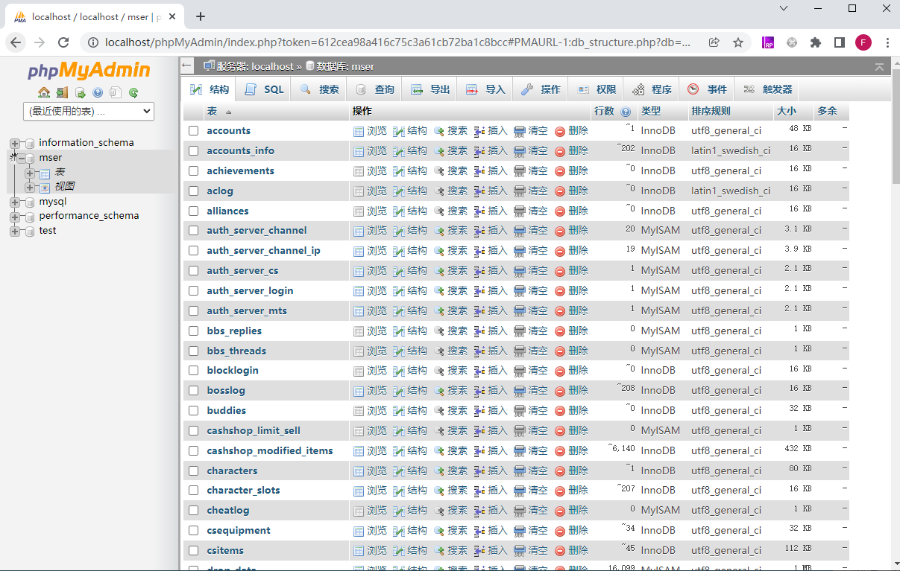
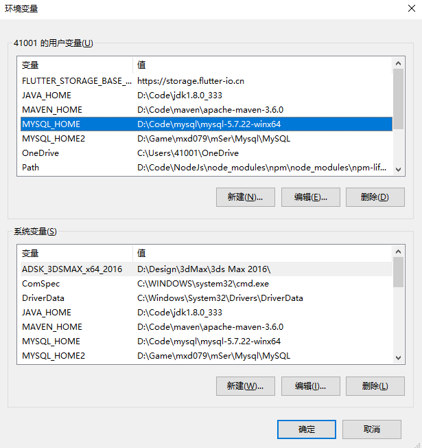
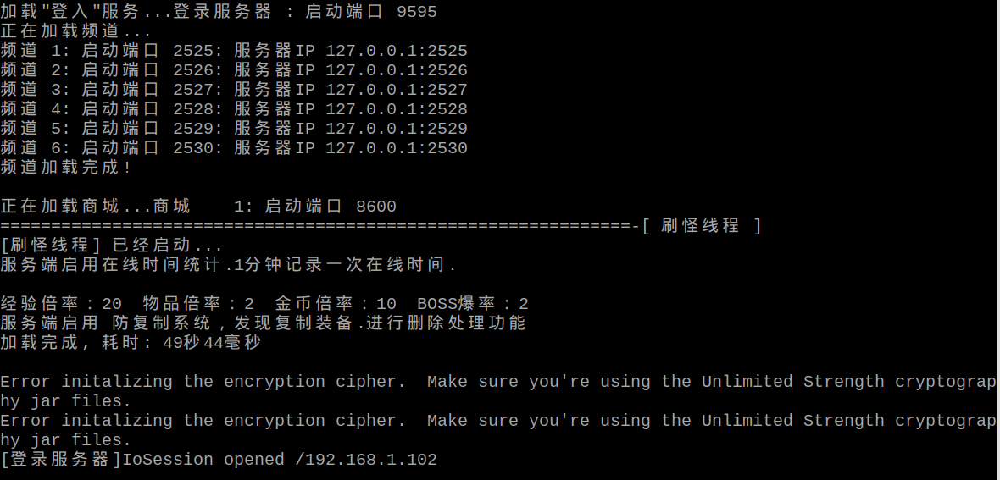

# 前言

之前有几次想玩树莓派，但是由于芯片涨价，价格翻了几倍，买了感觉很亏。于是收藏了一些教程，想等降价了再买，后来瘾头就慢慢淡了。最近又看到一些树莓派的教程，想法又源源不断的冒出来，FC游戏机、私服等，不过查了一下价格又贵了。。。

想到游戏和私服就联想到自己最喜欢玩的冒险岛：从05年开始接触，那时候和老哥玩一台电脑，都是一人操作键盘控制，一人操作鼠标点NPC；那时候疯狂拣地上的金币道具，跟大佬讨装备；那时候大家还是组队过副本，废都、通天塔，新出的休.彼得曼嘉年华；那时候升级很慢，几个月都升不到3转，跳格子任务都要花好长时间，真惊讶当时为什么这么有耐心。后来就开始过图、飞天、稳如泰山、吸怪，外挂满天飞了。

大巨变之后没有一直玩，不过兴之所至就要上线体验下新职业，一般刷到4转就没什么动力了，辗转回归了10几次，差不多几十个职业都玩过。

老实说大巨变之后除了玩家少了，升级快、组队任务没人过之外，也没什么不好的，职业、技能变酷炫了、地图、音乐变多了、剧情铺开来了。就算纯粹逛逛风景、听听音乐、看看剧情也不错。

> [为什么《冒险岛》玩家都想回到“大巨变”之前？](http://news.sohu.com/a/566460939_628730)

想法起来后就挥之不去，也一直很好奇私服是怎么搭建的，外挂是怎么来的。迫不及待的查了下资料，确认了可行性，而且还可以学习源码，体验下改库的快乐。

收集了好几个教程亲测，看看哪个最好用，记录一下踩的坑。

# 基础

先普及一些命令，后面不再解释：

1. 卸载Windows服务：`sc delete <服务名称>`，例如`sc delete mysql`，需要管理员权限运行。卸载服务并不会删除数据库，可以放心。
2. 安装MySQL服务：进入MySQL的bin目录，`.\mysqld.exe -install [服务名称]`，不指定的话默认服务名称为MySQL。为了服务不重名，可以指定一下。例如phpStudy安装的MySQL服务名称为`MySQLa`
3. Windows启动MySQL服务：`net start mysql`，或者在【Windows服务】中手动启动
4. Linux启动MySQL服务：`service mysql start/stop/restart`
5. 查看端口号占用情况：`netstat -ano | grep 3306`
6. 登录mysql：`mysql -u root -p`，默认登录端口为3306，如果修改了端口号，可以使用`--port=<端口号>`或者`-P 端口号`指定。MySQL初始用户名和密码是root
7. 进入数据库：登录之后输入`use databasename;`
8. 导入sql数据库文件：进入数据库之后输入`source <path>/xxx.sql`
9. **导出数据库文件**：
   1. `mysqldump -u username -p database_name > data-dump.sql`
   2. 也可以使用phpStudy和Navicat的备份功能导出

导出数据库报错，提示：`Incorrect file format 'combine_medal' when using LOCK TABLES`

```shell
# 查看报错信息
mysql> desc combine_medal;
ERROR 130 (HY000): Incorrect file format 'combine_medal'
mysql> check table combine_medal;
+-------------------+-------+----------+---------------------------------------+
| Table             | Op    | Msg_type | Msg_text                              |
+-------------------+-------+----------+---------------------------------------+
| bms.combine_medal | check | Error    | Incorrect file format 'combine_medal' |
| bms.combine_medal | check | error    | Corrupt                               |
+-------------------+-------+----------+---------------------------------------+
2 rows in set (0.00 sec)

# 修复
mysql> REPAIR table combine_medal use_frm;
+-------------------+--------+----------+----------+
| Table             | Op     | Msg_type | Msg_text |
+-------------------+--------+----------+----------+
| bms.combine_medal | repair | status   | OK       |
+-------------------+--------+----------+----------+
1 row in set (0.01 sec)
```

导出sql失败，提示表不存在时，直接把对应表删除，或者删除对应表的frm文件。

# 总结

亲测了多个教程和不同版本，总的来说大同小异。后面会简单介绍每个教程的操作，记录下过程，遇到问题可以作为参考。

## 文件介绍

搭建私服需要的文件：了解这些文件的作用，可以随意组合，不用完全按照教程来。

### 客户端

客户端比较简单，不同教程安装方式都一样，注意启动的时候指定服务器IP地址和端口号即可。

1. 冒险岛客户端
2. 客户端补丁：将补丁复制到客户端安装目录，双击安装即可。
3. HShield：Hack Shield反外挂程序，需要覆盖掉安装目录中的HShield文件夹。并且修改ehsvc.ini文件中的`GamePath`为客户端安装路径。
4. 客户端登录器：作用是指定服务器IP地址、端口号。
   1. 可以使用豆豆冒险岛登录器，需要"以管理员方式运行"，否则会无响应
   2. 也可以使用命令启动：`maplestory.exe 127.0.0.1 9555`

### 服务端

可能有不同版本的资源，但使用方式都大同小异，主要分为几种方式：

1. 傻瓜式集成环境：自带JRE和MySQL，有的还带Navicat、phpMyAdmin、phpStudy等（适用于Windows系统）
2. 不带集成环境：需要自己装JDK和MySQL，导入数据库，改配置（适用于有一定基础的人，可以在Windows、Linux上运行）
3. 虚拟机：将整个虚拟机系统打包，直接在虚拟机上运行服务端和客户端

关键文件：

1. 服务端程序：一般是Jar，有的带源码，有的不带源码。
   1. 有的教程提供启动程序或者脚本启动
   2. 也可以自己使用java命令启动，不同教程的服务端稍微有一些差异
2. 冒险岛MySQL数据库文件：
   1. 集成环境是把整个MySQL拷过来了
   2. 也可以自行导入导出，一般是SQL文件或者PSC文件（psc是Navicat的备份文件，可以还原为SQL文件）。
3. 配置文件：数据库配置、服务端配置等
4. scripts脚本文件
5. WZ资源文件：
   1. 从客户端提取的资源，一般下载服务端的时候已经包含
   2. 也可以自行提取，放到服务端目录下

WZ文件是Wizet公司用来压缩和加密游戏资源的文件，冒险岛所有游戏资源都打包在WZ文件中，例如角色、技能、地图、怪物、NPC等。

> 客户端和服务端wz版本不对应可能会出问题，后台认为资源被修改，会进行拦截封号。

可以通过一些工具提取和修改：例如HaRepacker，[wz](https://github.com/xsoameix/wz)，[WzComparerR2](https://github.com/Kagamia/WzComparerR2)

> 先插个眼，以后想自己开发一款冒险岛可以尝试逆向破解

### 其他资源

* MySQL数据库管理：非必须，可以使用Navicat、phpMyAdmin，也可以纯命令行
* GM工具：便于修改指令，赠送物品
* 外挂：飞天、过图、吸怪

> phpStudy集成了Apache+PHP+MySQL+phpMyAdmin+ZendOptimizer等PHP开发环境
>
> phpMyAdmin是一个基于Web的MySQL GUI管理程序，也可以使用Navicat管理

# 服务端使用方式

主要步骤：

1. 启动MySQL数据

   1. phpStudy方式：自带MySQL环境和数据库，不需要安装MySQL和导入数据库，适合新手。只适用于Windows环境

      如果电脑中已经有MySQL的就要卸载、或者修改配置、或者导入数据库。

   2. 命令行方式：需要自行安装MySQL环境，获取冒险岛数据库文件，再导入。Windows和Linux均适用。

2. 修改配置：数据库配置、IP地址配置等，不同教程配置文件名字和属性不太一样，看着改就行。

3. 安装JDK：

   1. 使用集成环境的话已经自带了JRE。
   2. 自行安装JDK，最好是JDK1.7，JDK1.8会提示`importPackage`异常，不过暂时也没发现什么问题。

4. 运行服务端Java程序（一定要先成功启动数据库）

   1. 有的教程提供启动程序或者脚本启动。
   2. 也可以自己使用java命令启动，不同教程的服务端稍微有一些差异。

启动命令例如：`java -cp dist\* -Dnet.sf.odinms.wzpath=wz server.Start`，

1. `-cp`等价于`-classpath`：多个路径Windows使用`;`分割，Linux使用`:`分割，也可以指定临时环境变量`SET CLASSPATH=xxx`
2. `-Dxxx`：环境变量，不同服务端不一样，一般是`-Dwzpath=wz`
3. `server.Start`是主类，函数入口

> v94以上版本，需要使用虚拟网卡运行，IP地址为：221.231.130.70

## 启动MySQL

### phpStudy方式

打开`MySQL`目录，启动phpStudy程序，点击启动Apache和MySQL服务。两个灯一直绿色表示成功（有可能起了之后过一会又挂了）。


MySQL管理器中可以打开phpMyAdmin，如下，后续可以在这里修改数据库。



### 命令行方式

自行安装MySQL

1. Windows上下载zip包解压、配置环境变量、初始化数据库
2. Linux下适用apt即可

获取sql备份文件：

1. 有的教程资源自带了
2. 没有的话可以运行phpStudy集成环境，再导出数据库。

# 通用问题

## 数据库冲突问题

电脑上已经装了一个MySQL 5.7.22了，再启动phpStudy中的MySQL 5.5.34失败（后面简称5.7、5.5）

或者手动启动MySQL服务报错误1067


试了网上好多种解决方法都不行，这里也记录一下，以后遇到了类似的问题可以尝试下

方法一：检查`my.ini`文件中的baseDir和dataDir

方法二：修改MySQL 5.7的端口为3307，避免冲突

方法三：将5.5的data目录中冒险岛的数据库文件复制到5.7中，再手动启动5.7的服务。

> phpStudy的灯倒是绿了，但是冒险岛的数据库有些问题，可能是不同版本数据库格式兼容的问题？

方法四：修改环境变量Path中的MySQL为5.5的路径

方法五：`sc delete mysql`卸载MySQL 5.7服务，再使用phpStudy中的MySQL服务

解决方法：

Get到了Windows上查看日志的方式，如图：这里启动失败的MySQL是5.5的，但是报错提示读不到的却是MySQL 5.7的路径。


最后发现是环境变量的问题，只修改`Path`没用，**要把`MYSQL_HOME`环境变量改成5.5的路径**，应该是MySQL服务读取了该变量。

如下图，我把两个版本的MySQL路径都存了下来，需要用到哪个就改一下。

> 两个服务可以都安装，只要指定不同的服务名，但是不能同时运行，因为`MYSQL_HOME`变量只有一个，即使改了端口号也不行。



**运行成功后可以把数据库导出，再导入自己5.7的MySQL上，这样就不需要装多个MySQL了**

## JDK无法执行

教程资源中的jdk是Windows或者Linux amd64架构的，我用的树莓派4B是armv7的，`jdk/bin/java -version`无法执行。

```shell
MapleStory/jdk $ cat release 
JAVA_VERSION="1.7.0"
OS_NAME="Linux"
OS_VERSION="2.6"
OS_ARCH="amd64"
```

解决：自行安装JDK

## importPackage异常

使用JDK1.8运行服务端提示`importPackage`异常

```shell
Error executing script. Path: ./scripts/scripts/event/Subway.js
Exception javax.script.ScriptException: ReferenceError: "importPackage" is not defined in <eval> at line number 1
```

> `importPackage`是JDK1.6的语法，JDK1.8不支持。`importPackage`可以在js中引入java的包

使用JDK1.8运行暂时也没发现问题，为了避免异常也可以安装JDK1.7运行。[Java7 armv7下载](https://www.oracle.com/java/technologies/javase/javase7-archive-downloads.html)

```shell
jdk1.7.0_75 $ cat release 
JAVA_VERSION="1.7.0"
OS_NAME="Linux"
OS_VERSION="2.6"
OS_ARCH="arm"
```

## 加密算法异常

使用JDK 1.7运行提示加密算法异常，如下。



解决：解压`jce_policy-7.zip`，替换掉`jdk1.7.0_75/jre/lib/security`中的文件。

> 集成环境自带的JRE可能已经替换完了，如果是自己装的JDK1.7就会出现这个问题

## 无法连接服务器

搭完之后能够登录，并且创建角色，但是点击角色无法进入游戏，返回登录页面，提示无法连接服务器。

解决：修改`server.properties`配置，将`RoyMS.IP = 172.0.0.1`改为局域网IP地址，例如`192.168.1.104`

> 客户端和服务器不在同一台机器上就会出现，不同服务端配置文件不太一样，不过原因是一样的。

## 数据库异常

登录成功之后服务端打印数据库异常，游戏键位清空，商城无法使用

```shell
# 登录之后提示数据库异常
java.sql.SQLException: Cannot convert value '0000-00-00 00:00:00' from column 24 to TIMESTAMP.
# 点击商城出现空指针
java.lang.NullPointerException
	at handling.world.CharacterTransfer.<init>(CharacterTransfer.java:294)
```

解决：修改`db.properties`，在url末尾添加`zeroDateTimeBehavior=convertToNull `，将0转化为null，如下

```properties
url = jdbc:mysql://127.0.0.1:3306/maple_067?autoReconnect=true&characterEncoding=UTF-8&zeroDateTimeBehavior=convertToNull
```

# 资源存档

**这些资源都下载备份了，找不到资源的可以私信我：评论、提issue、加联系方式均可**

> KMS（Korea Maple Story）：韩服
>
> CMS：国服
>
> GMS：国际服
>
> NEO：新版的意思

## V079

* [架设自己的冒险岛服务端](https://www.fengyewuyu.com/thread-1573-1-1.html)：使用phpStudy集成环境，资源比较全，包含服务端源码、辅助工具、GM工具等。
  * 原资源：`架设自己的冒险岛服务端（完整资源）.zip`
* [冒险岛079完整全套架设教程](https://zhuanlan.zhihu.com/p/392762992)：使用phpStudy集成环境，其实就是上面的教程精简过的。
  * 原资源：`mxd079资源（亲测可行）.zip`
* [Linux服务端搭建](https://hostloc.com/thread-878810-1-1.html)：客户端和GM工具过期了，用上面的079客户端即可，服务端其实 是GitHub上的[MapleStory](https://github.com/aoaostar/MapleStory)。自行安装Java和MySQL环境。
  * 原资源：`MapleStoryServer（亲测可行）.zip`
* [冒险岛079单机版](http://www.xfdown.com/soft/131142.html)：将所有环境装了VMWare虚拟机中，由于我的系统里已经开了HyperV虚拟机，没法共存。

## V176

* [2021冒险岛176至尊版](https://www.fengyewuyu.com/thread-4801-1-1.html)：176整合版，需要淘宝订单号，服务端验证
* [某宝买的冒险岛单机版V175一键端，简单操作 ](http://www.rexuexia.com/forum.php?mod=viewthread&tid=35265&page=1&authorid=93572)：基于上面的端改的，又加了一层验证码验证
* [冒险岛176第二版来自冒险岛单机交流群 ](http://www.rexuexia.com/forum.php?mod=viewthread&tid=36921&page=3&authorid=107404)：也是基于上面的端改的，不过跳过了授权校验的步骤，需要付30金币的下载费

## 其他版本

- [冒险岛v83](https://forum.ragezone.com/f428/how-to-make-a-maplestory-741739/)：美国的客户端，无法安装客户端。服务端需要自行安装Java和MySQL环境。
  - 原资源：`how-to-make-a-maplestory（客户端无法安装）.zip`
- [KMS362怀旧岛整合版](https://www.jiaosf.com/sf-51564-1.html)：韩服362版，约等于国服191版。服务端是phpStudy环境，使用方式同教程1。亲测可用，不能包含中文路径。不过都是韩语看不懂
  - 原资源：`KMS362怀旧岛整合版（韩服亲测可行）.zip`。
- [HeavenMS](https://github.com/ronancpl/HeavenMS)和[HeavenClient](https://github.com/HeavenClient/HeavenClient)：从头实现的开源客户端和服务端代码
- [彩虹冒险岛143商业端](https://www.fengyewuyu.com/forum.php?mod=viewthread&tid=824&highlight=%E5%86%92%E9%99%A9%E5%B2%9B)：可以运行，但极其不稳定，技能点不了，怪物不动，传送口无法传送等。
  - 命令行运行：`java -cp ,;config\Server.jar;config\lib\* -Dwzpath=wz\ server.console.Start`
- [鲸鱼冒险岛](https://www.maplestorycms456.com/download/)
- [冒险岛私服教程](https://www.jiaosf.com/ym-131.html)：论坛，很多东西要登录和付费，不能白嫖就不香了，以后再来这找
- [冒险岛单机论坛](http://w5cm.com/forum.php)

# 冒险岛v083测试失败

[冒险岛v83](https://forum.ragezone.com/f428/how-to-make-a-maplestory-741739/)：美国的客户端，不知道为什么安装不了，做个存档

- Java SE Development Kit (JDK) [[32bit\]](http://www.mediafire.com/download.php?3ik2ax7srinpt23) || [[64bit\]](http://www.mediafire.com/download.php?3qrxipqpmxsnbrd)：JDK，用不上
- MySQL Query Browser [[Link\]](http://www.brothersoft.com/mysql-query-browser-for-windows-download-71868.html)：数据库管理器，用不上
- WampServer [[Link\]](http://www.wampserver.com/en/download.php)：Apache服务器，用不上
- JCE Unlimited Strength Files [[Link\]](http://www.mediafire.com/download.php?0g6t7xpcrbu4u8p)：Java Cryptography Extension，加密扩展包
- LocalHost v83 [[Link\]](http://www.mediafire.com/?99ecxofh1436129)：客户端登录器
- ZenthosDev v83 [[Link\]](http://www.mediafire.com/download.php?j43req4bj7l6nzk)：服务端
- MapleStory v83 [[Link\]](https://mega.nz/#!098x2RII!m6aWPfTxcycUczGiaKxyuqHdKae391mwmNQfDWOCubY)：v83客户端
- WZ Files [[Link\]](http://www.mediafire.com/?95sypygu1la3aeo)：冒险岛资源文件

服务端倒是成功跑起来了：

1. Java+MySQL环境已经装过了，就没有用到上面提供的
2. 导入冒险岛数据库文件
3. 解压WZ文件到服务端目录
4. 修改`server.properties`配置：数据库用户名和密码
5. 运行`[ZenthosDev] OneW.bat`程序