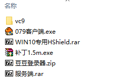
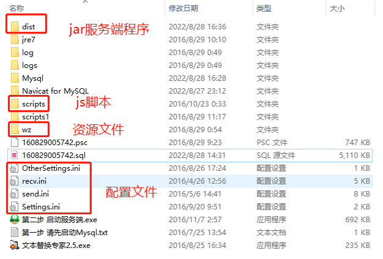

# 前言

私服不用玩太多版本，只要一个079的旧版本，一个来高版本体验新职业新剧情。

下面三个079版本都亲测可行，并且可以迁移到Linux上运行

- [架设自己的冒险岛服务端](https://www.fengyewuyu.com/thread-1573-1-1.html)：使用phpStudy集成环境，资源比较全，包含服务端源码、辅助工具、GM工具等。
- [冒险岛079完整全套架设教程](https://zhuanlan.zhihu.com/p/392762992)：使用phpStudy集成环境，其实就是上面的教程精简过的。
- [Linux服务端搭建](https://hostloc.com/thread-878810-1-1.html)：客户端和GM工具过期了，用上面的079客户端即可，服务端其实 是GitHub上的[MapleStory](https://github.com/aoaostar/MapleStory)。自行安装Java和MySQL环境。

先放一张运行成功的图，熟悉的侧分、新手剑


# 教程1

[冒险岛079完整全套架设教程](https://zhuanlan.zhihu.com/p/392762992)：使用phpStudy集成环境，比较简单。



1. 安装客户端、升级补丁、替换HShield
2. 启动MySQL：打开`mSer/Mysql/phpStudy.exe`，启动
3. 启动服务端，端口为9555，如下图


> GUI控制台有些GM命令，例如给金币、给物品等，可以自己实验下。
>
> 在这里[mxd4](https://mxd4.com/)可以查到对应的物品ID

也可以使用Java命令启动：`java -cp dist\* -Dnet.sf.odinms.wzpath=wz server.Start`

# 教程2

[Linux服务端搭建](https://hostloc.com/thread-878810-1-1.html)：客户端和GM工具过期了，直接用教程1里面的079客户端。服务端是GitHub上的[MapleStory](https://github.com/aoaostar/MapleStory)。

本教程在树莓派4B Linux armv7上运行成功

1. 安装mysql，导入仓库中的sql文件
2. 修改`config/db.propeties`配置，数据库名称、用户名和密码
3. `./start.sh`运行服务端，端口为9595

# 迁移到Linux上运行

phpStudy集成环境只能在Windows上运行，因此只能运行在自己电脑或者租个Windows的服务器，这里介绍下如何在Linux上部署该服务端。缺点就是不能用GM工具修改数据库了。

这里以教程1的资源为例（使用树莓派4B armv7作为服务器）

## 资源文件

首先自行安装MySQL和JDK

将以下几个资源文件拷贝到Linux服务器上



## 导出数据库文件

数据库文件包含在`MySQL/data`目录下，为了移植到Linux上，需要导出数据库。

先按照上面的教程在Windows上启动MySQL，然后使用`mysqldump`命令导出数据库sql文件。

由于树莓派使用MariaDB，底层引擎不是InnoDB，直接将sql文件导入会出现一些不兼容问题。

```shell
Can't create table , (errno: 140 "Wrong create options")
```

将sql文件中的`ROW_FORMAT = DYNAMIC `和`ROW_FORMAT = FIXED`等批量删除掉即可。

## 修改配置

修改`Settings.ini`配置：

1. 数据库名称、用户名和密码
2. 将`tmps.Port = 127.0.0.1`改成本机的IP地址，否则点击角色之后会退回登陆页面，提示无法连接服务器

## 运行服务端

`java -cp :dist/* -Dnet.sf.odinms.wzpath=wz server.Start`

> Linux上-cp前面需要加冒号，Windows上不用
>
> 反编译发现这个服务端使用的环境变量是`-Dnet.sf.odinms.wzpath`
