# 前言

私服不用玩太多版本，只要一个079的旧版本，一个高版本体验新职业新剧情。

高版本的端不太好找，都是付费的，还不一定能跑。而且都是打包混淆过的，没有源码，反编译查看也比较吃力。

- [搬运，2021冒险岛176至尊版 ](https://www.fengyewuyu.com/thread-4801-1-1.html)：需要淘宝订单号，服务端验证
- [某宝买的冒险岛单机版V175一键端，简单操作 ](http://www.rexuexia.com/forum.php?mod=viewthread&tid=35265&page=1&authorid=93572)：基于上面的端改的，又加了一层验证码验证
- [冒险岛176第二版来自冒险岛单机交流群 ](http://www.rexuexia.com/forum.php?mod=viewthread&tid=36921&page=3&authorid=107404)：也是基于上面的端改的，不过跳过了授权校验的步骤，需要付30金币的下载费
- [【搬运】冒险岛【元旦大礼】怀旧岛V175至尊版 ](https://www.iopq.net/thread-17105612-1-1.html)：没试过，不过人家说了是免费的。上面的资源应该都是从群里搬运的，被无良商家拿来卖钱。

# 教程

## 启动服务端

用上面的第三个资源，帮我们绕过了服务端验证，使用比较简单

1. 使用phpStudy启动数据库，数据库名称默认为bms，用户名和密码为root
2. 使用一键启动器来启动服务端和客户端

也可以命令行启动服务端：`java -cp ;lib/*;jre8x64/lib/ext/log4j-core-2.14.0.jar;jre8x64/lib/ext/* org.bms.gui.BMS`


## 启动客户端

使用一键登录器，点击上图的"游戏启动"，或者直接打开客户端

> v94以上版本，需要使用虚拟网卡运行，**IP地址为：221.231.130.70**

有一点需要注意，在默认的登录界面输入账号密码会检查盛大账号。有三种方式解决

1. 使用自己的真正的盛大账号登录
2. 单机登录方式

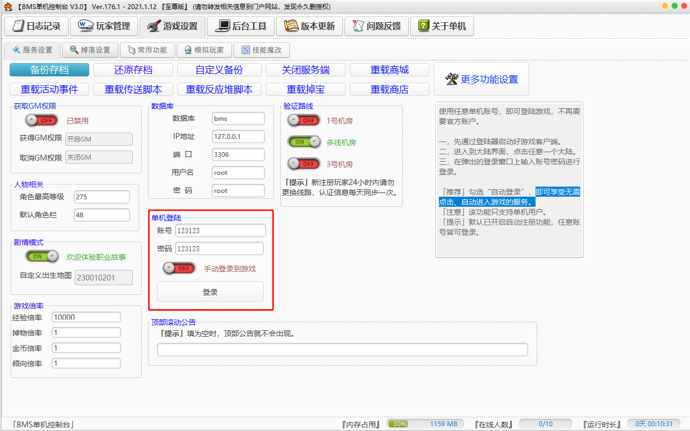

3. BMS个性账号登陆界面，随便输入账号密码，会自动注册

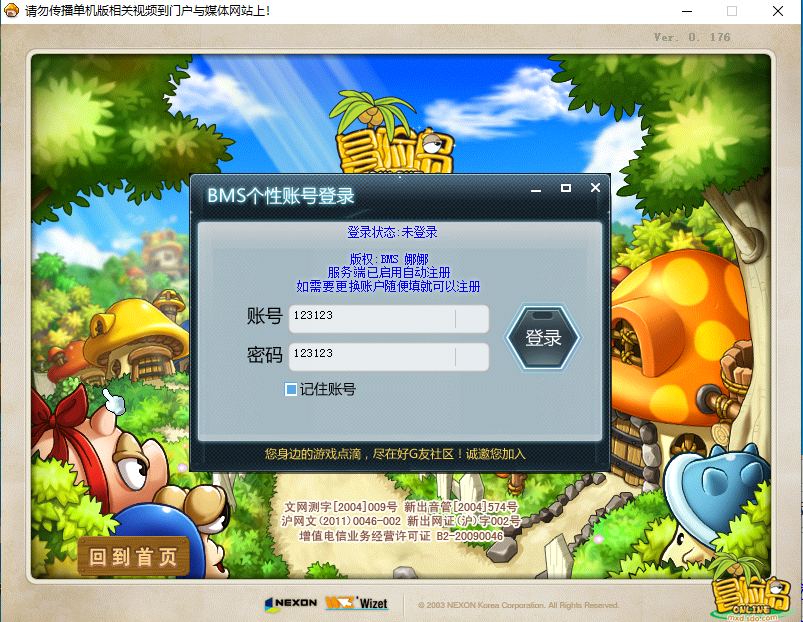

运行成功截图


# 服务端破解

这里介绍下怎么绕过第一个资源的淘宝订单号验证。主要用于学习，第三个资源已经帮我们跳过了，可以直接使用

暂时能想到的一些破解思路：

1. 反编译修改Java源码，重新编译打包
2. 修改字节码，再打包
3. 拦截服务端验证请求，模拟返回成功结果

使用jadx反编译工具查看jar包

## AuthCheckUtil请求服务端

首先全局搜索"淘宝订单号"，定位到`AuthCheckUtil`类，代码逻辑比较简单，拼接淘宝订单号和`ProcessorId`，请求服务端验证。


`org.bms.server.AuthCheckUtil`的main函数中输出了验证端url。因此可以运行AuthCheckUtil：`java -cp ;lib/*;jre8x64/lib/ext/log4j-core-2.14.0.jar;jre8x64/lib/ext/* org.bms.server.AuthCheckUtil`。

输出`http://47.99.96.61:8008/api/checkMapleAuthEn?ddhmid=`，即url地址

`getProcessorId`方法使用wmic获取PC的`ProcessorId`，服务端加密之后返回

> wmic：Windows Management Instrumentation Command-line，Windows管理工具

## 校验返回值

查询`checkMapleAuth`使用的地方

下面的代码拿到服务端返回的加密字符串，调用`StringUtil.decode`方法进行解密，使用逗号分割。

* `split[0]`就是个常量1，这里做了校验
* `split[1]`没什么意义，就是打印了一下字符串，因此可以随便填
* `split[2]`可以知道是一个Int值，这里我们填10
* `split[3]`是ProcessorId，这里做了校验

因此解密后的字符串格式如：`1,无限制授权,10,ProcessorId`


## 反编译查看加密方法

根据上面反编译的结果，可以知道服务端返回的字符串做了加密，反编译StringUtil查看加密和解密的方法，尝试逆推。

可以看到`JM`方法用于加密，decode方法用于解密。


## 获取服务端返回的加密字符串

被加密的字符串如：`1,无限制授权,10,123`

### 修改main方法字节码

上面知道`AuthCheckUtil`的main方法打印了服务端的url，这里简单修改下main方法，改为调用加密方法加密字符串

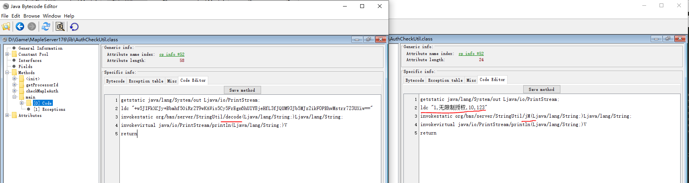

执行结果如下，`PcsI/8T435QUTypDM/e4HnXmNd/SYMWzz1IgsASJdWE=`即加密过的字符串

```shell
$ java -cp  ;lib/*;jre8x64/lib/ext/log4j-core-2.14.0.jar;jre8x64/lib/ext/* org.bms.server.AuthCheckUtil
PcsI/8T435QUTypDM/e4HnXmNd/SYMWzz1IgsASJdWE=
```

### 调用加密方法

另一种方式，自己编写main文件，调用加密方法

```java
public class Main{
	public static void main(String[] args) {
		System.out.println(org.bms.server.StringUtil.jM("1,无限制授权,10,123"));
	}
}
```

使用javac命令编译，由于使用了jar包中的方法，因此需要指定`classPath`，否则会找不到方法

`javac -cp ;bms.server.jar Main.java -encoding utf8`

使用java命令运行，由于`StringUtil`依赖了apache的codec库，因此也要包含到`classPath`中

`java -cp ;bms.server.jar;commons-codec-1.7.jar Main`

同样输出`PcsI/8T435QUTypDM/e4HnXmNd/SYMWzz1IgsASJdWE=`

# 方式一：修改字节码

根据上面的代码，可以尝试修改字节码，跳过服务端验证。

使用7-zip打开jar包，将`AuthCheckUtil.class`、`StringUtils.class`文件提取出来，使用jbe打开，修改完之后再拖进压缩包中。

> **找到合适的切入点，尽可能小的改动，防止引起其他异常。**

## 修改checkMapleAuth方法返回值

修改checkMapleAuth返回值为`1,无限制授权,10,123`，`ldc`表示加载常量到方法栈中。

> 这里反编译参考上面的第二和第三个资源，也是修改了checkMapleAuth方法的返回值，返回字符串`1,无限制授权,10`，并且去掉了解密的过程。
>
> 也可以直接返回加密后的字符串，这样可以跳过第三步decode方法的修改

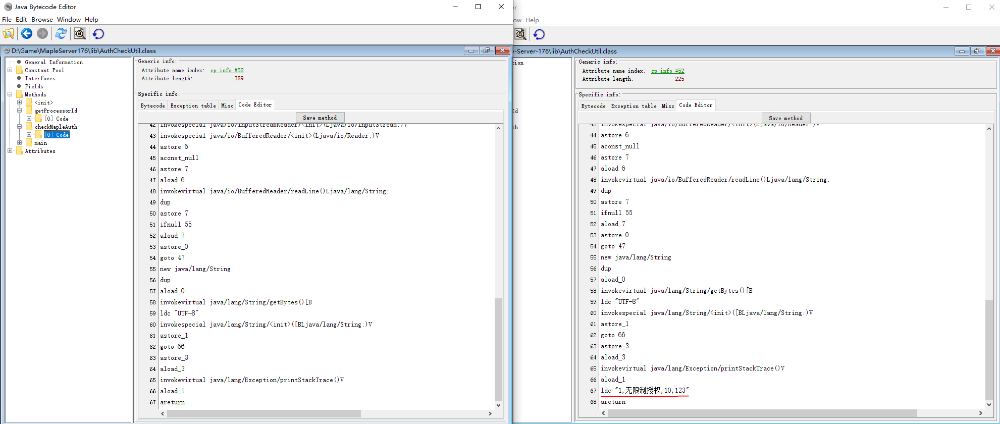

## 修改getProcessorId方法返回值

这里为了不修改校验的逻辑，我们再修改下`getProcessorId`的返回值为123

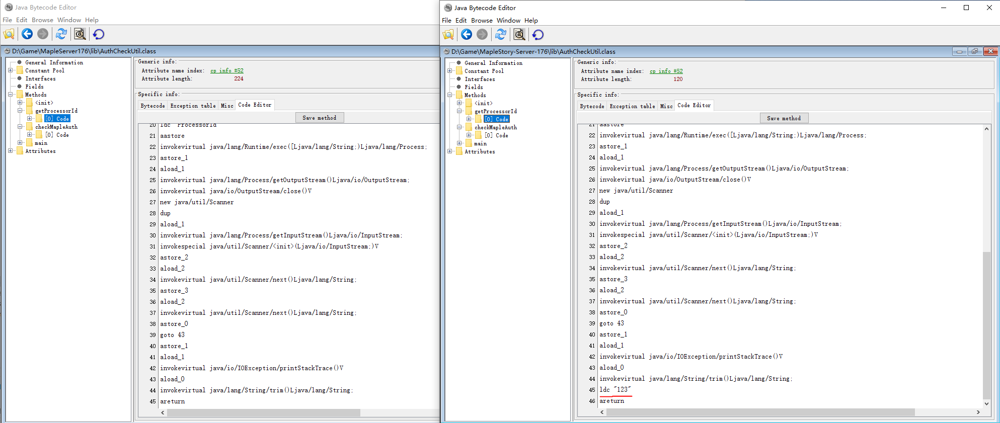

## 修改decode方法返回值

修改decode方法的返回值，去掉解密逻辑，`aload0`表示将传入的参数原封不动的返回。

> 全局搜了一下这个方法只用到了一次，因此不会影响到其他地方。如果有其他地方使用的话最好换个地方修改，避免影响其他逻辑。


修改之后使用`java -cp ;lib/*;jre8x64/lib/ext/log4j-core-2.14.0.jar;jre8x64/lib/ext/* org.bms.gui.BMS`成功运行。

# 方式二：拦截请求模拟服务端响应

由于URL是IP地址，想着有没有类似host配置（将域名映射成IP）一样的东西，将目标IP映射到自己的服务器IP和端口上，然后模拟服务端返回成功的结果。

这里要拦截的是从自己电脑出口的请求。查了一下可以通过**IP地址重定向**的方式拦截请求

**以Linux为例**，Windows IP重定向较复杂。

## 迁移资源到Linux上

和079一样，将一些关键文件拷贝到Linux上，手动导入SQL文件。

> 这里因为有一些jar库放到了jre8x64里面，因此需要把这个目录也拷贝进去


## Linux模拟wmic结果

由于wmic是Windows上的程序，因此`getProcessorId`方法会出错，这里直接写一个脚本模拟。

创建一个wmic文件，把他放到`/usr/bin`目录（默认的环境变量）下即可执行。

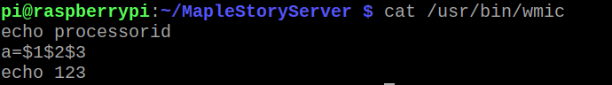

## IP地址重定向

Linux：使用iptables，可以成功转发出口请求，参考[iptables](https://blog.csdn.net/weixin_45186298/article/details/122910466)

将`http://47.99.96.61:8008/api/checkMapleAuthEn?ddhmid=`转发到本机的8008端口

```shell
# 查看规则
sudo iptables  -t nat --list OUTPUT
# -A添加规则
sudo iptables -t nat -A OUTPUT -d 47.99.96.61 -p tcp --dport 8008 -j DNAT --to-destination 127.0.0.1:8008
# -D删除规则
sudo iptables -t nat -D OUTPUT -d 47.99.96.61 -p tcp --dport 8008 -j DNAT --to-destination 127.0.0.1:8008
```

通过curl命令可以成功访问本地的8008端口的结果`curl http://47.99.96.61:8008`

## 启动Web服务

将IP转发到自己的机器上后，需要开启Web服务，监听对应端口，模拟返回成功的结果

1. 使用Apache自带Web服务，监听80端口：将html网页放到这个目录下`/var/www/html/`，url带路径则新建文件夹
2. 使用Java简易服务器：代码如下，使用`javac -encoding "utf8" MyHttpServer.java`编译，再使用java命令运行class文件。（这里监听的是8008端口，因此需要将上一步的IP转发到8008端口）

```java
import com.sun.net.httpserver.HttpServer;
import java.io.IOException;
import java.io.OutputStream;
import java.net.InetSocketAddress;
import java.util.concurrent.Executors;

public class MyHttpServer {
    public static void main(String[] args) {
        try {
            HttpServer server = HttpServer.create(new InetSocketAddress(8008), 0);
            server.createContext("/api/checkMapleAuthEn", httpExchange -> {
                String response = "PcsI/8T435QUTypDM/e4HnXmNd/SYMWzz1IgsASJdWE=";
                httpExchange.sendResponseHeaders(200, response.getBytes().length);
                try (OutputStream os = httpExchange.getResponseBody()) {
                    os.write(response.getBytes());
                }
            });
            server.setExecutor(Executors.newCachedThreadPool());
            server.start();
        } catch (IOException e) {
            e.printStackTrace();
        }
    }
}
```

运行MyHttpServer，再使用curl请求地址，成功拦截了请求。（正常访问由于没有淘宝订单号，请求会超时或者错误）


## 运行服务端

由于是Linux环境，无法运行一键启动器的exe文件，因此使用java命令启动`java -cp :lib/*:jre8x64/lib/ext/log4j-core-2.14.0.jar:jre8x64/lib/ext/* org.bms.gui.BMS`

> Linux使用冒号分割ClassPath

可以看到**成功跳过了服务端验证**，不过会卡在加载怪怪卡的地方。


这个主要是因为服务端没有针对Linux做过适配，使用开篇提到的第三个资源也有一样的问题。

~~暂时还未找到原因，后面可以尝试分析下。~~

## 服务端启动卡住问题解决

**先说结论：将`wz/String.wz`改为`wz/string.wz`，小写字母**

分析了一下服务端启动的过程，**主要是对比启动日志**，跟踪到`StartServer`类。

这里看到一堆中文乱码对应服务端启动的信息

> 我们可以将解码方法拷贝出来，例如`MapleGuildSkill.ALLATORIxDEMO()`，通过main方法运行
>
> 例如`MapleGuildSkill.ALLATORIxDEMO("勚轓拺胓攊捀寶戾T")`打印出来实际上是"加载技能数据完成"

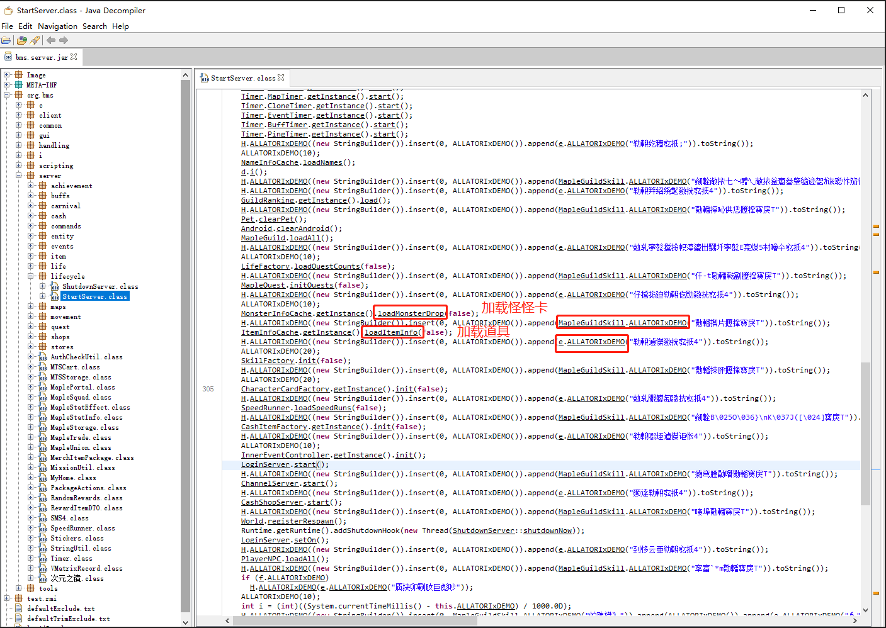

对比正常的日志，加载完怪怪卡之后就会打印"加载道具"的日志。

因此怪怪卡已经加载完成了，实际上是卡在加载道具的地方，因此查看`ItemInfoCache`逻辑。

这里比较难阅读，大概能够看出是启动了一个子线程去加载道具信息。

一开始有`ser/Item.ser`这个文件，运行服务端之后就没了。猜测是存放加载过的道具信息，由于出了问题所以文件自动被删除。

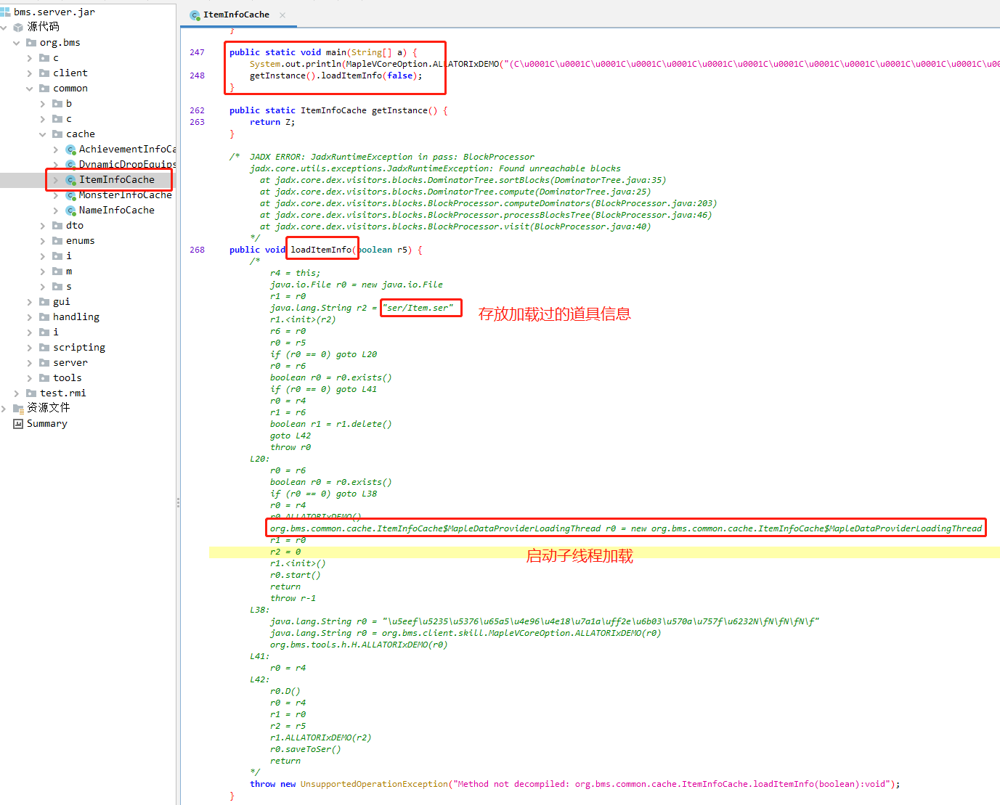

幸运的是这里刚好有个main方法，可以直接运行"加载道具信息"，针对性的分析，避免每次都跑整个启动流程。

`java -cp :lib/*:jre8x64/lib/ext/log4j-core-2.14.0.jar:jre8x64/lib/ext/* org.bms.common.cache.ItemInfoCache`

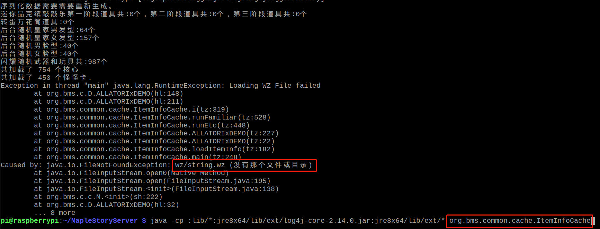

看到这里答案就出来了，**找不到`wz/string.wz`文件**，由于是主线程崩溃，所以有日志打印。

wz目录实际上是有`String.wz`文件的，可能是大小写没有被正确解析，复制一个`string.wz`出来，再运行正常。

> Windows上可以正常解析，并且其他的wz也没问题，就只有`String.wz`有问题

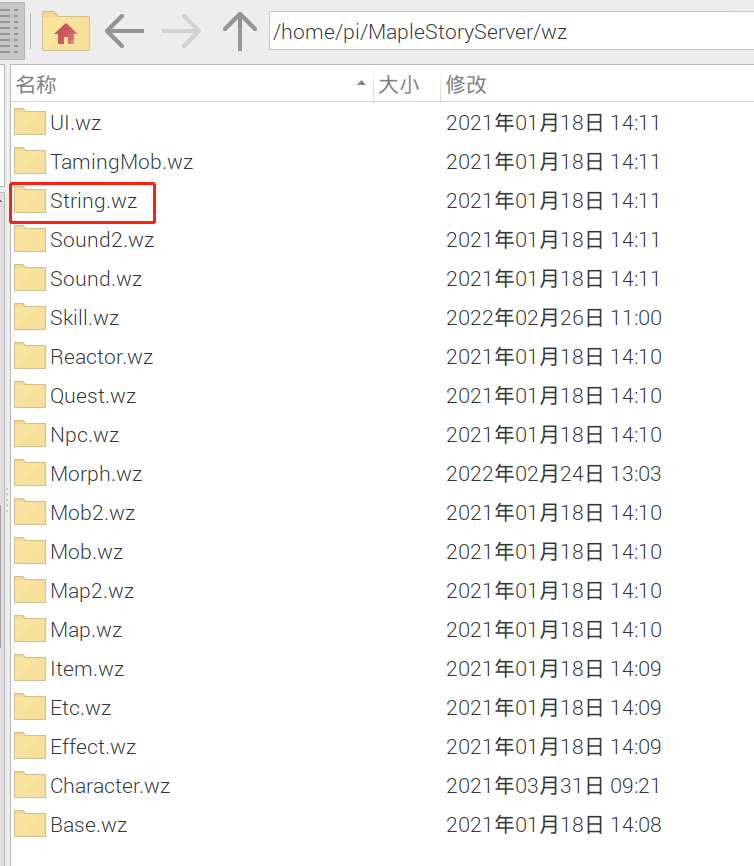

## 客户端启动

由于新版本客户端不支持v79的命令行指定服务器IP地址和端口，因此从网上找了个联机登录器，指定IP地址，运行成功。

> 用登录器总感觉不太安全，不过暂时没找到高版本的登录方式。

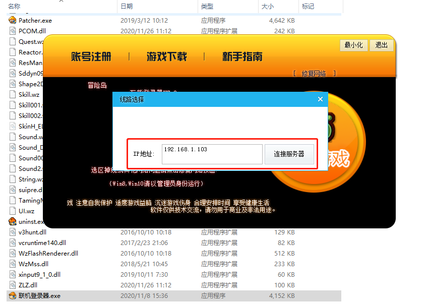

## 修改数据库配置

该版本私服的数据库名称默认为bms，数据库用户名和密码默认为root。和服务器上数据库配置不同

找到`配置文件/ServerConfig.ini`，发现如下三个字段：

```properties
数据库_库名=bms
SQL_USER=root
SQL_PASSWORD=root
```

直接修改上述字段运行，发现连不上数据库

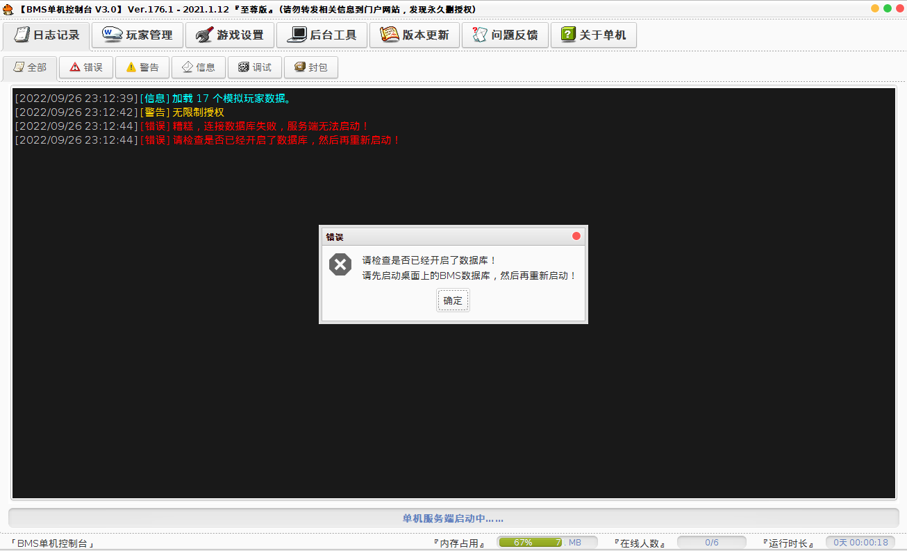

反编译分析源码，如下图

> 吐槽一下一堆中文和乱码

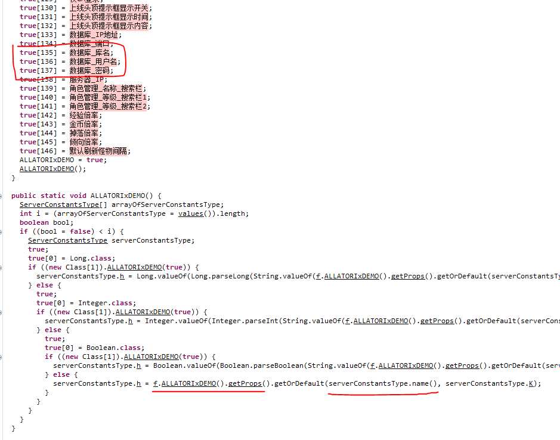

可以看到`getProps()`方法返回解析的Properties对象，通过枚举的名称查找配置，这里使用的名称和配置文件中定义的不同。

因此修改配置如下，再次运行正常

```properties
数据库_库名=maplestory_176
数据库_用户名=root
数据库_密码=afauria
```

## 数据库报错

如下图，Linux上运行服务端，客户端登录之后会提示表不存在。

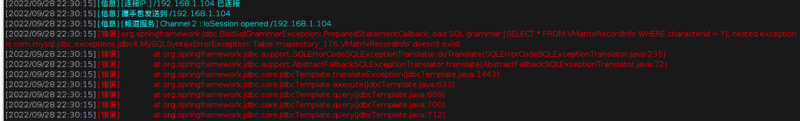

原因：Linux上MariaDB默认区分大小写，如下图

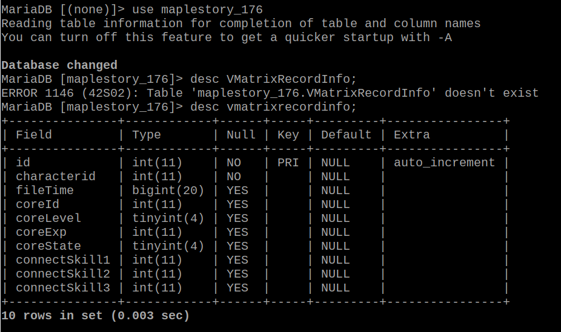

解决：配置数据库大小写不敏感

修改`/etc/mysql/my.cnf`文件，添加如下配置。

```properties
[mysqld]
# 0表示区分大小写
# 1表示存储时小写，比较时不区分大小写
# 2表示存储时区分大小写，比较时是小写
# Linux默认为0，Windows默认是1，MacOS默认是2
lower_case_table_name=1
```

修改之后重启数据库

```shell
systemctl restart mariadb 
```

查看大小写配置如下

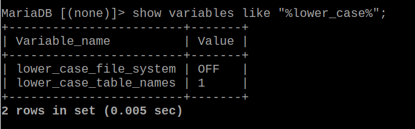

# 结语

至此可以在树莓派上运行冒险岛私服，079、176的教程都有了。

> 建议使用修改字节码的方式运行服务端。不然每次启动都要配置下iptables、启动8008端口服务。

自己玩的话最简单还是直接在Windows上一键运行服务端和客户端。如果是要部署和别人玩就要用云服务器了，怕麻烦的话也可以买Windows的服务器部署。这里只提供下迁移到Linux运行的一些思路，**坑还很多**。

老实说对冒险岛私服不太了解，平常也不太喜欢逛社区论坛、QQ群之类的。不过挺佩服那些大佬的。

这也是自己第一次尝试搭建私服，自己找资源去破解。中间踩了很多坑，没有加过群请教大佬，不然应该能少走很多弯路。

- netsh（Network Shell）是Windows的命令行工具。参考[Windows netsh命令](https://docs.microsoft.com/zh-cn/windows-server/networking/technologies/netsh/netsh-interface-portproxy)
- Linux上常用的防火墙软件，很强大的功能，可以进行入口、出口请求的转发、拦截等。参考[iptables](https://blog.csdn.net/weixin_45186298/article/details/122910466)
- Wireshark：网络抓包工具，使用比较简单，难点在于分析数据包
- 反编译工具：jadx、jbe、jd-gui。（有的时候会反编译不出来，可以尝试其他工具，或者阅读字节码）

## 修改jar包字节码

注意：重编译的jdk版本要和jar的jdk版本一致，否则可能合不回去

方式一：修改Java源代码

1. 使用jd-gui或jadx将class反编译成java源代码
2. 修改源代码
3. 使用javac编译，由于会依赖到其他的类，因此编译时需要指定classpath依赖库
4. 将编译出来的class文件拖入jar压缩包中

缺点：当jar包被混淆时，可能会编译失败，或者jar包出错

方式二：修改字节码

1. 拷贝出要修改的class文件
2. 使用jbe直接修改class字节码
3. 将修改后的class文件拖入jar压缩保重

缺点：需要学习理解字节码，也没法做大的改动，否则会导致编译失败，符号没对齐之类的。

## Windows请求转发

Windows：使用`netsh interface portproxy`代理IP地址和端口，貌似只能将外部进入本机的请求进行转发，无法对本机出口的请求进行转发（失败）

```shell
# 查看所有监听的端口
netsh interface portproxy show all
# 添加规则
netsh interface portproxy add v4tov4 listenaddress=47.99.96.61 listenport=8008 connectaddress=192.168.1.104 connectport=80 protocol=tcp
# 删除规则
netsh interface portproxy delete v4tov4 listenaddress=47.99.96.61 listenport=8008
```

另外的思路：使用虚拟网卡+netsh命令，参考[Windows 下的 IP 重定向，非改 host](https://blog.csdn.net/qq_34083079/article/details/110141360)

> 没有实际尝试过，这种时候还是Linux方便

