# RetroPie使用

RetroPie是一个复古的游戏机操作系统，包含各种街机、家用游戏机、掌机的模拟器。

有两种安装方式

1. 运行在现有的Raspbian系统上：暂不支持Bullseye版本的系统
2. 烧录完整的操作系统镜像

由于我装的是Bullseye版本的系统，而且只有32G，怕不够用，所以另外买了张TF卡专门运行RetroPie。

> 除了树莓派之外，RetroPie也可以运行在PC上

## 系统烧录

1. 下载烧录工具：[Raspberry Pi Imager（Windows版）](https://downloads.raspberrypi.org/imager/imager_latest.exe)
2. 下载[Retropie系统镜像](https://retropie.org.uk/download/)
3. 使用Imager打开RetroPie系统镜像，选择存储卡，点击烧录，耐心等待即可。
4. 烧录完成后将TF卡插入树莓派，通电启动

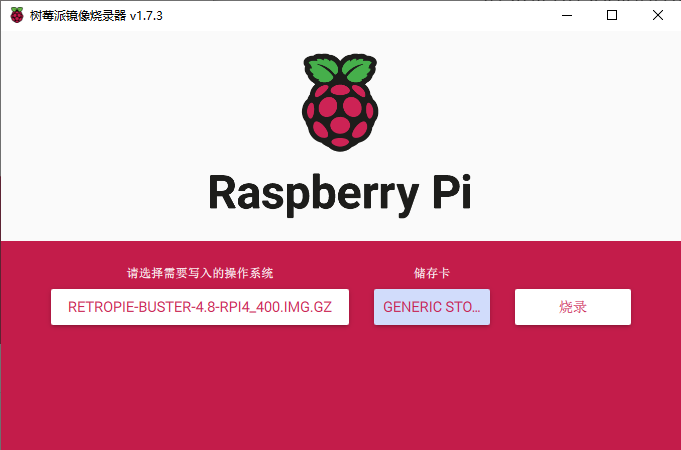

## 按键配置

参考[官方文档](https://retropie.org.uk/docs/Controller-Configuration/)

首次启动需要配置按键，长按任意键进入按键配置页面

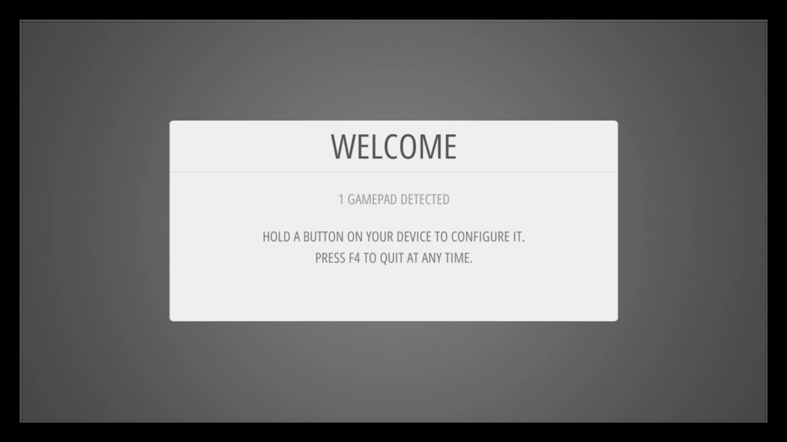

如果手柄的按钮不够用，则长按任意键跳过该键的设置

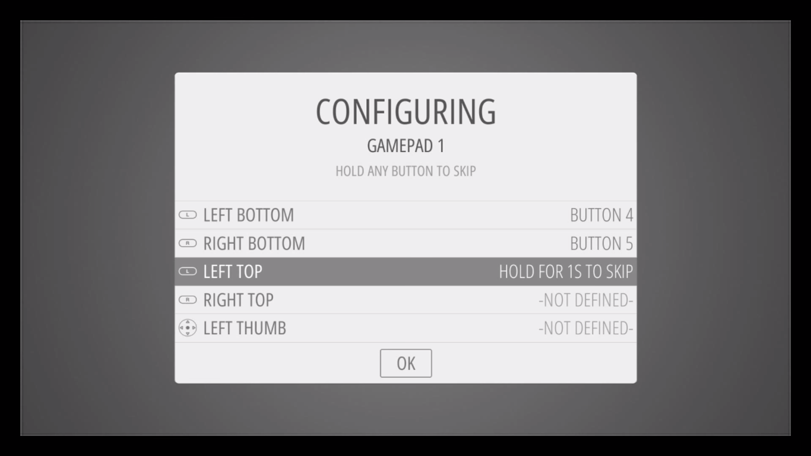

我买的是最便宜的NES手柄，小时候经常用的，按键说明如下。

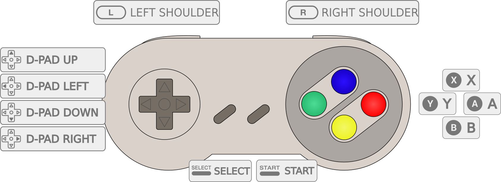

最后一个按键是热键，可以和其他键组合，一般使用select按钮作为热键

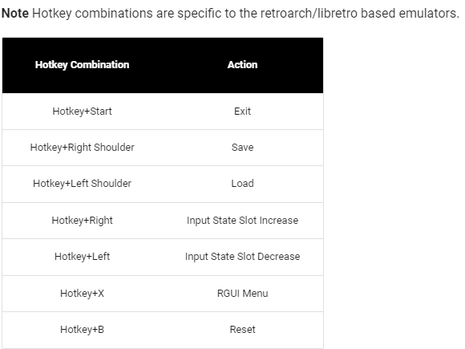

配置成功后进入RetroPie主界面（EmulationStation）

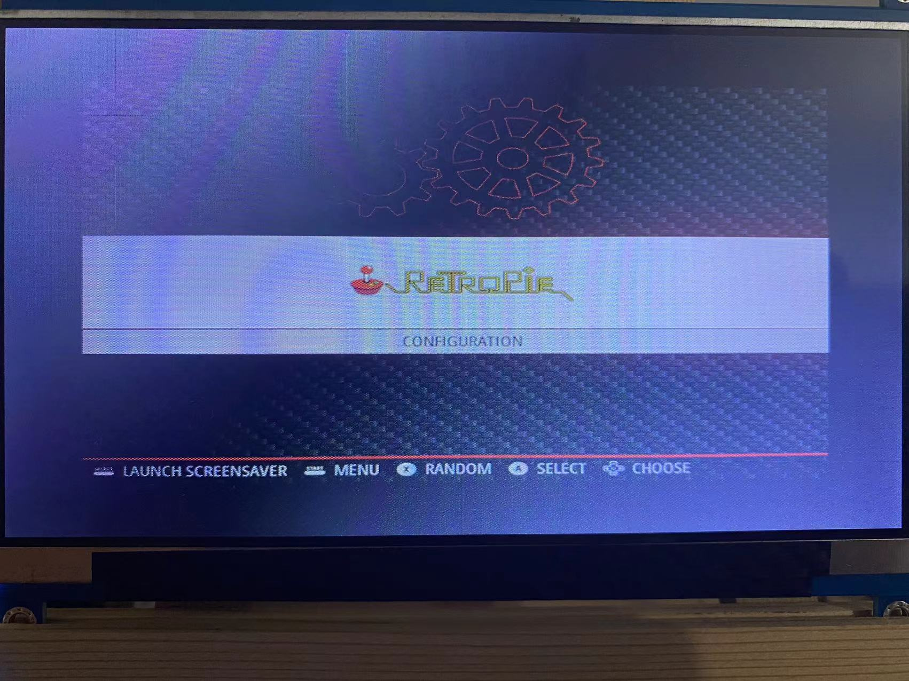

## SSH登录

启用SSH：打开RetroPi菜单，【raspi-config>Interface Options>SSH】

登录SSH：用户名为pi，`ssh pi@IP地址`，输入密码`raspberry`

## 传输ROM文件

所有ROM文件存放在`~/RetroPie/roms/$CONSOLE`下，`$CONSOLE`表示不同的模拟器目录。

* 使用U盘传输：将ROM文件拷贝到U盘`retropie/roms`中对应的模拟器目录下，插入树莓派，等待自行拷贝，指示灯完成闪烁。
* SFTP：使用ssh，通过scp命令拷贝
* Samba：连接同一局域网，Windows上，在计算机中输入`\\RETROPIE`或者`\\IP地址`访问文件系统

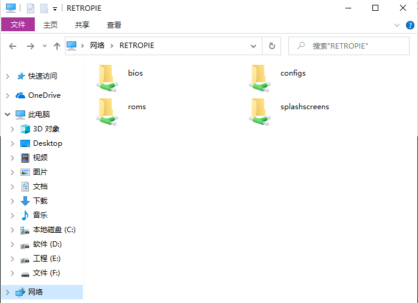

拷贝完成后按F4刷新列表，或者重启Emulation Station。

拷贝了GBA和NES的ROMs之后，主界面会出现模拟器图标，下方会显示有多少个游戏

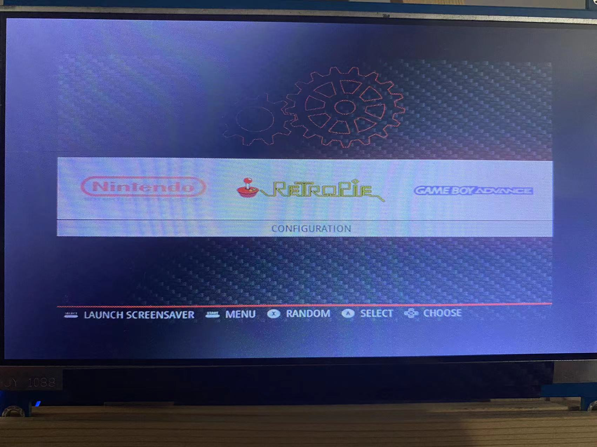

FC游戏：《影子传说》

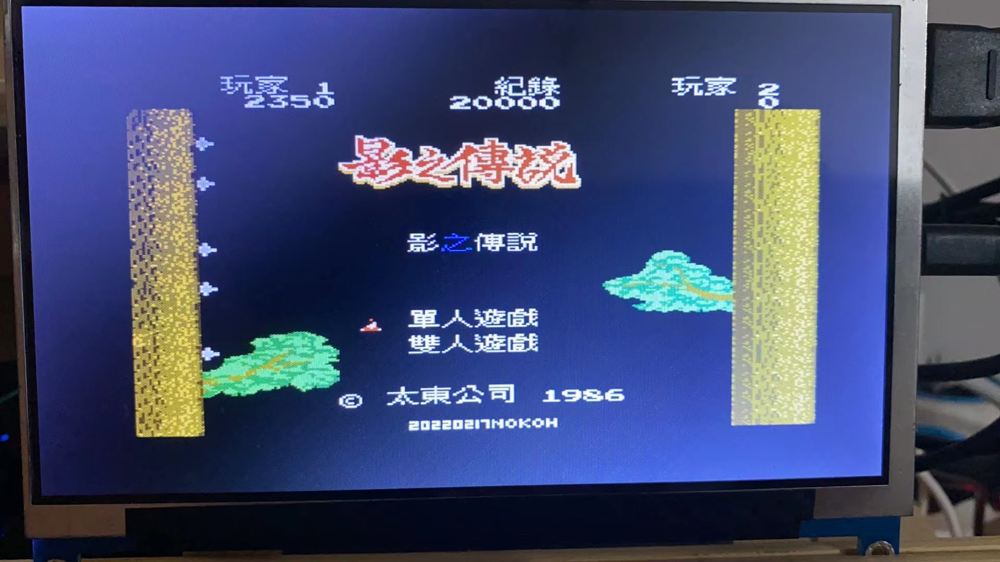

GBA游戏：《宝可梦绿宝石》

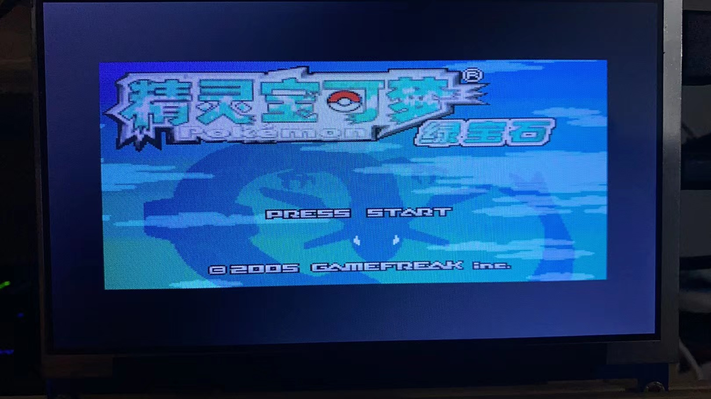

## Runcommand

负责启动模拟器和游戏的脚本，打开游戏的时候会显示下图页面

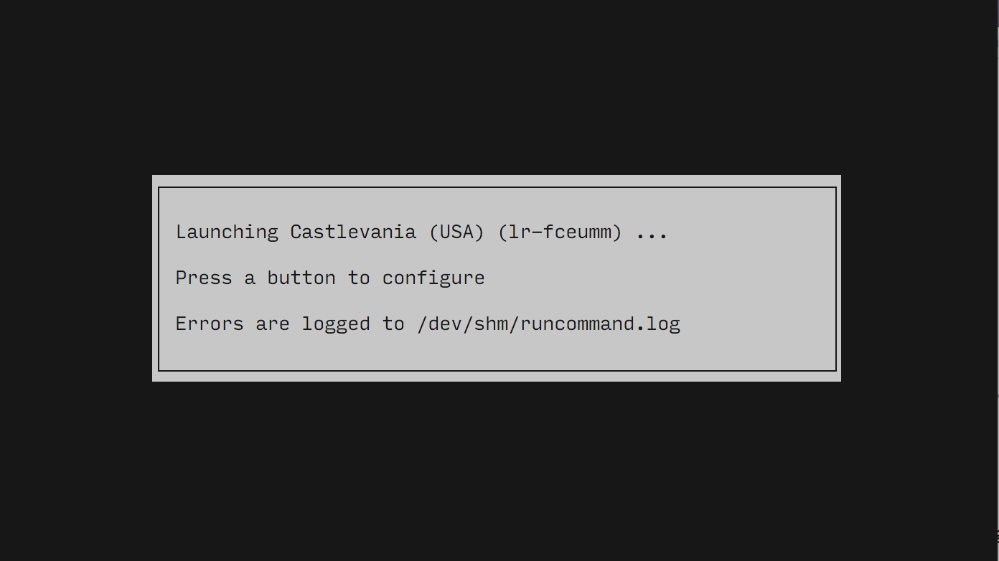

在上图中按任意键打开Runcommand菜单，可以为ROM配置启动的模拟器，选择输出详细日志等。

> 同一个ROM在不同模拟器上表现可能会不一样，因此有时候需要手动为ROM配置特定的模拟器运行。

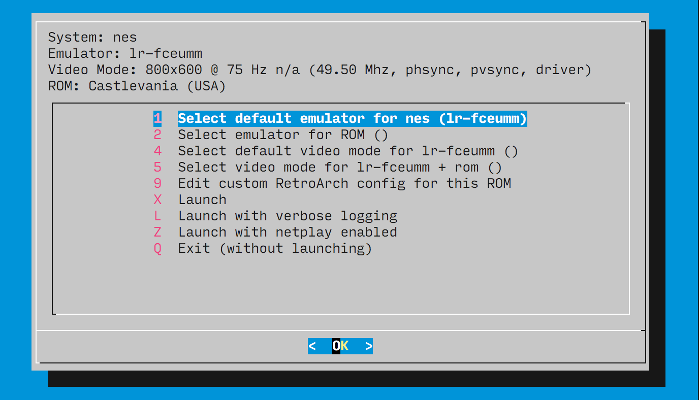

## TIPS

游戏中文乱码：`sudo apt-get -y install fonts-droid-fallback `

游戏无法运行可能有两个原因：

1. **模拟器版本和ROM版本不匹配**
2. **缺少相关的BIOS文件**：例如neogeo和ngp（Neo Geo Pocket）的游戏需要BIOS

# RetroPie介绍

RetroPie基于多个项目，例如RetroArch、Emulation Station、MAME等。

- **Emulator（模拟器）**：RetroPie中预装了部分模拟器，也可以在**【RetroPie-Setup>Manage Packages】**中下载安装其他模拟器
- **ROM**：游戏卡带的数字版本，由于版权保护，不包含在RetroPie中，**需要自行下载，拷贝到系统中**
- BIOS（Basic Input Output System，基本输入输出系统）：模拟器运行需要的程序（软件），可以直接控制硬件。大部分模拟器会模拟其系统的BIOS，不过有些游戏需要使用特定的BIOS，模拟器不支持，需要手动导入。由于版权保护，不在RetroPie中。

> 电脑的BIOS可以设置硬件、引导操作系统启动等
>
> 街机的BIOS还可以用来设置投币数、对局数等

个人理解模拟器（虚拟机）就是在一台计算机上模拟另一台计算机的指令运行，并且会模拟CPU运行频率。例如将GBA模拟器的指令转成Windows的指令，进行渲染、绘制、控制等。

## RetroArch

Libretro是模拟器、游戏、媒体程序的开发库，RetroArch是其官方提供的一个参考前端实现。

RetroArch和libretro可以将现有的模拟器作为库或者核心加载进来，RetroArch处理输入（控制）和输出（图形和音频），核心模拟原始系统。

RetroArch为模拟器提供只配置一次手柄的功能，不需要单独配置每个模拟器。

RetroPie中，libretro的模拟器核心名称前标有`lr-`，例如`lr-mame2003`、`lr-fabneo`、`lr-mgba`

RetroPie文档中会说明ROM、配置等文件放置的路径

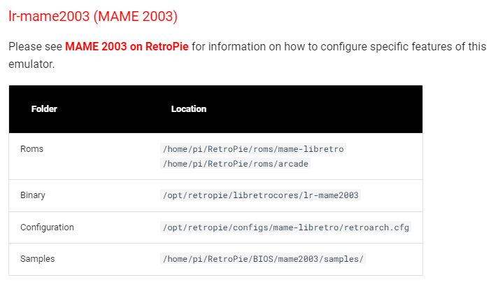

## 街机（arcade）说明

街机模拟器主要有两种：

1. MAME（Multiple Arcade Machine Emulator）：最知名的开源街机模拟器，可以模拟多种街机，运行数千种游戏，推荐使用`lr-mame2003+`
2. FinalBurn：旧版本是FinalBurn Alpha（fba），新版本是FinalBurn Neo（fbneo）

> MESS（Multi Emulator Super System）：多街机模拟器，后合入MAME中

RetroPie支持MAME和FinalBurn的多个版本

为避免不同街机有不同菜单，**所有街机的ROM都可以放到arcade中，无需解压**，但是需要在Runcommend菜单中指定每个Romset运行的模拟器。

> ROMSet：Rom集，可以指多个游戏ROM的集合，也可以指一个游戏需要多个ROM

## BIOS

**特定游戏ROM运行需要导入BIOS文件**，RetroPie文档中会说明。

BIOS文件可以放在BIOS目录，也可以放在ROMS对应的模拟器目录。

以NeoGeo和NeoGeo Pocket为例

ROM运行依赖BIOS，不同厂商ROM需要的BIOS不一样，放在同一个目录下，模拟器运行的时候会同时加载BIOS和ROM。

MAME模拟器必备36个BIOS：

* Acclaim PSX——>acpsx.zip
* American Laser Games BIOS——>alg_bios.zip
* Aleck64 PIF BIOS——>aleck64.zip
* Amiga CD32 Bios——>cd32.zip
* Arcadia System BIOS——>ar_bios.zip
* Atari PSX——>atpsx.zip
* Atlus PSX——>atluspsx.zip
* Crystal System BIOS——>crysbios.zip
* Atomiswave Bios——>awbios.zip
* CVS Bios——>cvs.zip
* Cassette System——>decocass.zip 
* Galaxy Games BIOS——>galgbios.zip
* System GX——>konamigx.zip
* Baby Phoenix/GV System——>konamigv.zip
* Konami Viper BIOS——>kviper.zip
* Max-A-Flex——>maxaflex.zip
* MPU4 Video Firmware——>bctvidbs.zip
* Neo-Geo——>neogeo.zip
* Nintendo Super System BIOS——>nss.zip
* PlayChoice-10 BIOS——>playch10.zip
* Mega Play BIOS——>megaplay.zip
* Sega MegaTech——>megatech.zip
* Naomi Bios——>naomi.zip
* Naomi 2 Bios——>naomi2.zip
* ST-V Bios——>stvbios.zip
* Super Kaneko Nova System BIOS——>skns.zip
* System 573 BIOS——>sys573.zip
* Taito FX1——>taitofx1.zip
* PGM (Polygame Master) System BIOS——>pgm.zip
* TPS——>tps.zip
* PS Arcade 95——>psarc95.zip
* Multi Amenity Cassette System BIOS——>macsbios.zip
* Hyper NeoGeo 64 Bios——>hng64.zip
* ZN1——>cpzn1.zip
* ZN2——>cpzn2.zip
* Taito GNET——>taitogn.zip

# 资源下载

- [Arcade Punks](https://www.arcadepunks.com/)：街机朋克，包含大量游戏合集
- [ROMS Games](https://www.romsgames.net/roms/)：需要VPN，根据游戏平台进行了分类
- [掌机迷](http://www.gbarom.cn/)：提供了中文版的ROM，主要包含FC、NES、GBA、NDS等，没有街机
- [街机中文网](https://www.mamecn.com/)：ROM、模拟器、BIOS下载