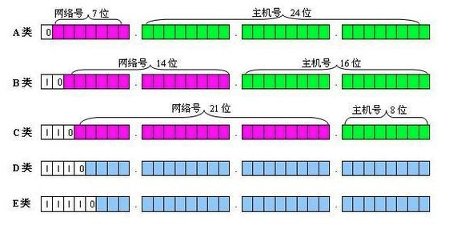
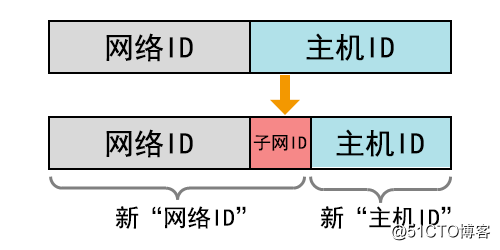
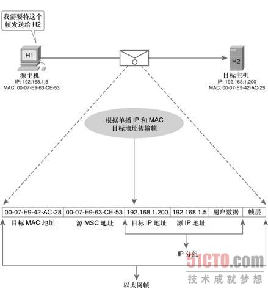
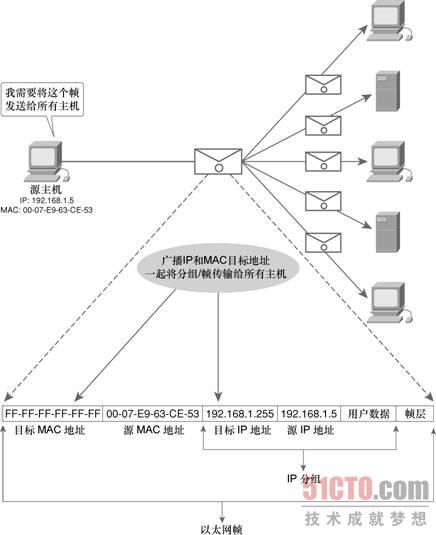
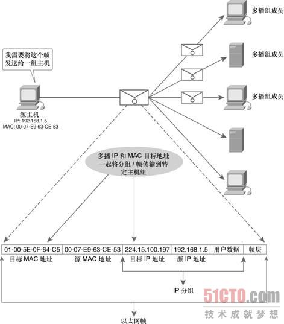

# IP地址

## IPv4

IPv4：使用32位（4字节）表示IP地址。

> 可以用十六进制、十进制、八进制表示。也可以用点分格式表示，将IP地址分为4段，每段一个字节，中间用点分隔，包括点分十进制、点分十六进制、点分八进制
>
> 为了便于阅读和分析，通常写作点分十进制格式：将IP地址分为4段，每段1个字节，每段用十进制表示，中间用点分隔。
>
> 点分格式中每一段可以用不同的进制表示，合法但是不常用，如：192.0x00（16进制）.0002（八进制）.235（十进制）

## 私有地址和公有地址

公有地址：向InterNIC注册申请，可以直接访问互联网。

私有地址（专用地址）：非注册地址，供组织机构内部使用，自行分配和管理，无法被其他网络发现，因此可以重复。和互联网通信需要通过网关。

> IP地址类似家庭住址，一台主机向另一台主机发送数据，类似于寄信。
>
> 公有地址由组织统一分配注册，不可重复，如解放路44号。邮递员可以直接把信送到该地址。
>
> 私有地址相当于小区内的门牌号，如1栋101，其他小区也可以叫1栋101。邮递员只能找到注册的地址，因此只能送到小区门口的保卫处（网关），由保卫处送到具体的门牌号。同样的，发信也要经过保卫处。

私有地址如果要连到Internet，需要将私有地址转换为公有地址，这个过程称为NAT（Network Address Translation，网络地址转换）。

## 网关和路由

网关：将一个网络连接到另一个网络的关口。

设备会配置网关，如果两台主机不在同一个网络下，会将数据包发到网关，再转发给另一台主机。网关也有自己的IP地址，一般是本地网络下的第一个主机号。

一台主机可以有多个网关，如果找不到可用的网关，会将数据包发给默认网关

在windows上叫网关，在mac上叫路由器。路由器是网关的一种。

## 子网掩码

将IP地址划分为网络地址和主机地址两部分。转换为2进制，为1的部分对应网络段，为0的部分对应主机段

如C类网络：子网掩码是255.255.255.0，也就是说前三段为网络号，最后一段为主机号。

用途：可以用于判断不同主机是否在同一个子网内：将两个IP分别与子网掩码进行与运算，如果相等则表示在同一个子网内。

表示方法：IP地址（子网掩码）、IP地址/子网掩码位数。如192.168.0.0（255.255.255.0）=192.168.0.0/24

## 分类网络（有类网络）

对IP进行分类便于更好的路由，判断第一位为0则是A类地址，判断第二位为0则是B类地址.......

| 分类 | 定义                                            | 默认子网掩码  | IP地址范围                 | 私有IP地址范围              | 最大网络数        | 单个网段最大主机数 | 用途                                                         |
| ---- | ----------------------------------------------- | ------------- | -------------------------- | --------------------------- | ----------------- | ------------------ | ------------------------------------------------------------ |
| A    | 第1段为网络号，最高位固定为0，即1~127           | 255.0.0.0     | 0.0.0.0到127.255.255.255   | 10.0.0.0-10.255.255.255     | 126（减去0和127） | 16777214           | 大型网络                                                     |
| B    | 前2段为网络号，最高位固定为10，即128~191        | 255.255.0.0   | 128.0.0.0到191.255.255.255 | 172.16.0.0-172.31.255.255   | 16384             | 65534              | 中型网络，一般用于大公司和政府机构                           |
| C    | 前3段为网络号，最高位固定为110，即192~223       | 255.255.255.0 | 192.0.0.0到223.255.255.255 | 192.168.0.0-192.168.255.255 | 2097152           | 254                | 小型网络，分配给任何有需要的人或组织，如校园网，小型办公网络 |
| D    | 不分网络号和主机号，最高位固定为1110，即224~239 |               | 224.0.0.0到239.255.255.255 |                             |                   |                    | 用于组播                                                     |
| E    | 不区分网络号和主机号，最高位为1111，即240~255   |               | 240.0.0.0到255.255.255.255 |                             |                   |                    | 科研保留地址段                                               |

注：

1. 其中D、E类为特殊地址，不能用于分配。**D类用作组播地址，E类为科研保留地址段**。
2. 每个分类下还存在一些特殊用途的地址，不能用于主机分配，如环回地址（127开头，如127.0.0.1表示本机地址，一般用于测试），受限广播地址（255.255.255.255），本机地址（0.0.0.0）等
2. 最大网络数：
   1. 由于A类地址最高位固定为0，且用一个字节表示网络号，由于0和127不能使用，因此需要减去2，因此最大网络数=2^7-2，
   2. 由于B类地址最高位固定为10，且用两个字节表示网络号，因此最大网络数=2^14
   3. 由于C类地址最高位固定为110，且用三个字节表示网络号，因此最大网络数=2^21
3. 单个网段最大主机数=2^主机号位数-2，（减去头和尾，规定第一个主机号表示网络地址，最后一个主机号表示广播地址，已经被分配，无法再分配给主机）
5. **在分类网络中，子网掩码只有三种（A类：255.0.0.0、B类：255.255.0.0、C类：255.255.255.0）。在CIDR中使用可变长子网掩码（VLSM）**
6. 以0或255结尾的地址不能分配给主机：**只在子网掩码至少为24位（即C类地址或者CIDR中24-32位子网掩码）的前提下才成立**。
   1. **以255结尾的地址不一定是广播地址**（主机段全为1）：如B类地址172.16.0.0/255.255.0.0，后8位都是主机位，广播地址为172.16.255.255。172.16.1.255、172.16.2.255等不是广播地址，可以分配给主机
   2. **广播地址不一定以255结尾**：如192.168.1.0-63/26，子网掩码为26位，主机号为6位，192.168.1.63、192.168.127、192.168.1.191、192.168.1.255（即每个子网下最后一台主机号）主机位都为1，因此都是广播地址。

### 分类网络面临的问题

> 1. 对于企业来说，C类地址只有254个偏少（不够用），而B类地址包含65534个偏多（浪费）。--->CIDR划分子网
> 2. B类地址很快将要分配完毕：最大网络数为16384。--->CIDR划分子网
> 2. 同一网络下没有地址层次：如一个公司用了B类地址，但是需要划分开发环境、测试环境、生产环境IP。--->CIDR划分子网
> 3. 路由表需要维护大量的表项：C类网络分散在不同地域，难以聚合。--->CIDR将前缀相同的网络聚合成超网，分配给企业，此外还可以按世界地区进行分配
> 4. 整个IPv4地址最终将会全部耗尽：总数为2^32个地址，去掉私有地址、多播地址、以及一些特殊保留地址，可分配的IP地址不多。--->通过新版本IP协议（IPv6）解决

## 子网划分与聚合

意义：如上述，分类网络只有三种分配方式：C类2^8台主机、B类2^16台主机、A类2^24台主机。会造成大量浪费和不够用。因此在分类网络基础上，采用子网划分技术（**VLSM和CIDR**）得到更多类型大小的网络，提高IP地址利用率。

> * 等长子网划分：将分类网络等分成多个网络，所有子网的子网掩码相同
> * 变长子网划分：将分类网络分成多个网络，不同子网使用不同的子网掩码

### 相关概念

1. 主机：互联网中的一个设备
2. 网络：多台机器组成一个网络，网络号相同则在一个网络下
3. 网络地址：一般是该网络的第一个IP地址，不可分配给主机，**主机号全为0**。用于标识该网络。
4. 广播地址：一般是该网络的最后一个IP地址，不可分配给主机，**主机号全为1**。用于向本地网络的所有机器发送广播。
5. 可用主机地址：网络下所有IP地址减去第一个和最后一个IP地址，可用分配给主机的IP地址。用于标识主机
6. 子网：将分类网络划分成更小后的网络，称为子网。其中第一个子网称为全0子网，最后一个子网为全1子网。
   1. 全0子网对应子网号全为0，全1子网对应子网号全为1
   2. 旧标准（RFC950）里面全0和全1子网不可分配：为了避免全0子网网络地址（192.168.1.0）和全1子网的广播地址（192.168.1.255）分别与没有划分子网前的网络地址和广播地址冲突。
   3. 新标准（RFC1878）废弃，全0子网和全1子网也可用于分配
7. 超网：把多个小网络组成一个大网络。
8. 分类网络：将IP地址分为A、B、C、D、E类，使用标准的默认子网掩码。只有三种（A类：255.0.0.0、B类：255.255.0.0、C类：255.255.255.0）
9. 无类网络（CIDR）：基于VLSM可变长子网掩码，可以进行任意长度前缀分配，并且将多个前缀相同的地址块（CIDR地址块）组合到一个路由表项中，分配给企业使用，减少路由表项。

> VLSM（Variable Length Subnet Mask，可变长子网掩码）：通过增加掩码位数，可以划分更多的子网。
>
> CIDR（Classless Inter-Domain Routing，无类别域间路由）：基于VLSM，聚合超网。取代分类网络划分IP地址。

### 子网划分原理

从主机位取出部分位用作子网位（借位），和原网络号合并为新的网络号，这样就可以将标准的IP网络划分成几个小的网络。

如将C类地址192.168.1.0/24，划分为2个子网：

1. 需要向主机位借1位作为子网位
2. 子网掩码由255.255.255.0（/24）变为255.255.255.128（/25）
2. 主机位数从8变为7
2. 每个子网IP地址数从256变为128=2^7
2. 每个子网可用主机数从254变为126=2^7-2
3. 第一个子网段为192.168.1.0-127/25，其中192.168.1.0/25为网络地址，192.168.1.127/25为广播地址。
4. 第二个子网段为192.168.1.128-255/25，其中192.168.1.128/25为网络地址，192.168.1.255/25为广播地址。

**借1位可以划分两个子网0、1，借2位可以划分4个子网00、01、10、11....（可以看出第一个子网为全0子网、最后一个子网为全1子网）**

## 各种概念换算

以下全部转换为2进制计算，判断是否属于同一个网段，主要看他们的网络标识是否一样

* 网络标识（网络号）：**主机段全为0的IP地址**，子网掩码和IP地址进行"与"操作。用于区分不同的网段
* 主机标识（主机号）：子网掩码取反和IP地址进行“与”操作，用于区分同一网段下的不同主机
* 广播地址：**主机段全为1的IP地址**，广播地址不一定是255结尾，以255结尾的也不一定是广播地址，需要结合子网掩码判断。
* 子网数量：2^子网段位数。
  * C类网络下：主机段位数+子网段位数=8，即IP地址数量*子网数量=2^8
  * B类网络下，主机段位数+子网段位数=16，即IP地址数量*子网数量=2^16

* IP地址数量：2^主机段位数
* 可用主机数量（可分配IP地址数）：IP地址数量-2（减去头和尾，规定第一个主机号表示网络地址，最后一个主机号表示广播地址，已经被分配，无法再分配给主机）
* 该子网可用IP地址段：将网络地址下的所有主机分段，段数为子网数量，去掉头和尾，即为该子网可用IP地址段

### 示例

如IP地址192.168.1.53

> * C类地址默认子网掩码为255.255.255.0
> * 网络标识为192.168.1.0
> * 主机标识为53
> * 子网数量为1
> * 广播地址为192.168.1.255，主机号全为1，即255
> * IP地址数量为256
> * 可用主机数位254
> * 该子网可用IP地址段为192.168.1.1-192.168.1.254

如IP地址192.168.1.53/27

> 1. 27表示子网掩码有27个1，即：11111111 11111111 11111111 11100000。即子网掩码为255.255.255.224。
> 2. 网络段有27位，主机段有5位，得一个子网IP地址数量为32，可用主机数为30，子网数量为8。
> 3. IP地址转换为二进制：11000000 10101000 00000001 00110101
> 4. 和子网掩码进行与操作，得：11000000 10101000 00000001 00100000，即网络地址192.168.1.32。
> 5. 和子网掩码取反后进行与操作，得：00000000 00000000 00000000 00010101，即主机标识为21，表示这个子网下的第21台主机
> 6. 主机段全部置为1，得：11000000 10101000 00000001 00111111，即广播地址192.168.1.63
> 7. 将网络分为8段：
>    1. 第一个子网：192.168.1.0-192.168.1.31
>    2. 第二个子网：192.168.1.32-192.168.1.63
>    3. 第三个子网：192.168.1.64-192.168.1.95
>    4. 第四个子网：192.168.1.96-192.168.1.127
>    5. ……
> 8. 53位于第二个子网，该子网的广播地址为192.168.1.63
> 9. 该子网可用IP段为：192.168.1.33-192.168.1.62

将B类地址168.195.0.0划分为27个子网，求子网掩码和每个子网下IP地址数量？

> 1. 27=11011，需要向主机位借5位。
> 2. 借的是高位，即255.255.11111000.0
> 3. 换算成10进制为255.255.248.0
> 4. 主机号占11位，IP地址数量=2^11

将B类地址168.195.0.0划分成若干子网后，每个子网内有700台主机，求子网掩码和可划分子网数？

> 1. 700=1010111100，主机号占10位，网络号占22位。
> 2. 即向主机号借了6位。255.255.11111100.0
> 3. 换算成10进制为255.255.252.0
> 4. 借了6位，可划分2^6个子网

# 单播、广播、组播（多播）

这里的单播、广播、组播是针对网络层的说法，传输层TCP、UDP是对网络层的封装

## 单播（一对一）

单播地址是IP网络中最常见的。包含单播目标地址的分组发送给特定主机。源地址->目标地址

* 以太网帧报头中必须有目标IP地址和目标MAC地址。（目标IP地址+目标MAC地址）
* 如果目标地址属于另一个网络，则目标MAC地址为源地址所在网络的路由器的MAC地址。（目标IP地址+源地址的路由器MAC地址）

缺点：服务器压力大，服务器流量＝客户机数量×客户机流量

优点：针对不同客户做出不同响应，容易实现个性化的服务

## 广播（一对所有）

广播分组的目标IP地址的主机部分全为1，这意味着本地网络（广播域）中的所有主机都将接收并查看该分组。

* 以太网帧报头中必须有目标IP地址和广播MAC地址。（目标IP地址+广播MAC地址）
* 在以太网中，广播MAC地址长48位，其十六进制表示为FF-FF-FF-FF-FF-FF。

优点：网络设备简单，维护简单，布网成本低

缺点：无法针对不同客户做出不同响应。

### 受限广播

不会被路由器转发，但会被送到相同物理网络段上的所有主机，只能用于本地网络。

IP地址的网络字段和主机字段全为1，即地址：**255.255.255.255**

### 直接广播

通过路由发送到该网络下的每台主机

IP地址的网络字段定义这个网络，**主机字段**通常全为1，如：

* C类网络192.168.1.0的默认子网掩码为255.255.255.0，其广播地址为192.168.1.255。
* B类网络172.16.0.0的默认子网掩码为255.255.0.0，其广播地址为172.16.255.255。
* A类网络10.0.0.0的默认子网掩码为255.0.0.0，其广播地址为10.255.255.255。

## 多播（一对多）

让源设备能够将分组发送给一组设备。属于多播组的设备将被分配一个多播组IP地址，多播地址范围为224.0.0.0～239.255.255.255。由于多播地址表示一组设备（有时被称为主机组），因此只能用作分组的目标地址。源地址总是为单播地址。

1. 224.0.0.0 ~ 224.0.0.255 为预留的组播地址，只能在局域⽹中，路由器是不会进⾏转发的。
2. 224.0.1.0 ~ 238.255.255.255 为⽤户可⽤的组播地址，可以⽤于 Internet 上。
3. 239.0.0.0 ~ 239.255.255.255 为本地管理组播地址，可供内部⽹在内部使⽤，仅在特定的本地范围内有效。

* 以太网帧报头中必须有目标IP地址和多播MAC地址。
* 多播MAC地址以十六进制值01-00-5E打头，余下的6个十六进制位是根据IP多播组地址的最后23位转换得到的。

优点：多个客户端加入同一个组，共享一条数据流，节省服务器负载

缺点：丢包错包之后难以弥补

# 结语

Tips：

* DHCP：动态分配IP
* HOST：
  * Internet主机指互联网中的一台设备，有自己的IP地址，每台主机在互联网上的地位是平等的
  * 指电脑主机
* PC：个人计算机
* SERVER：服务器，指运行服务程序的计算机
* InterNIC（Internet Network Information Center，因特网信息中心）：提供IP分配、域名管理等服务。此外还有ENIC（欧洲）、APNIC（亚太）等负责不同地区IP分配。在中国是由 CNNIC 的机构进⾏管理。
* ISP（Internet Service Provider，互联网服务提供商）：如中国电信、中国移动等。

参考文章：

* [IP地址和子网划分学习笔记之《子网划分详解》](https://blog.51cto.com/u_6930123/2113151)
* [单播、广播和多播IP地址](https://www.cnblogs.com/therock/articles/2798653.html)
