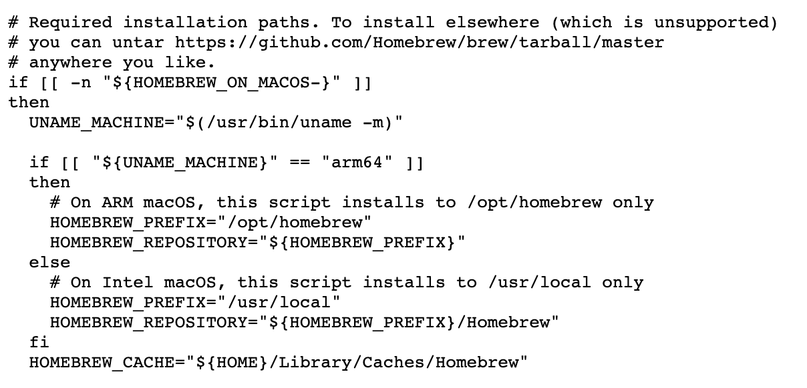
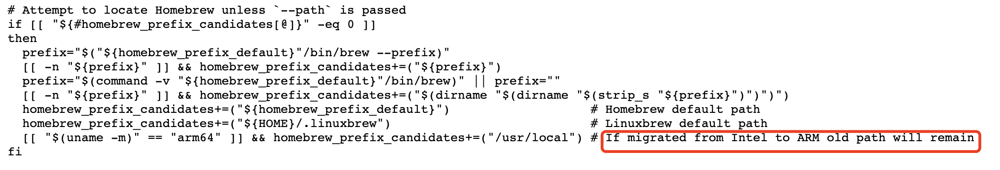
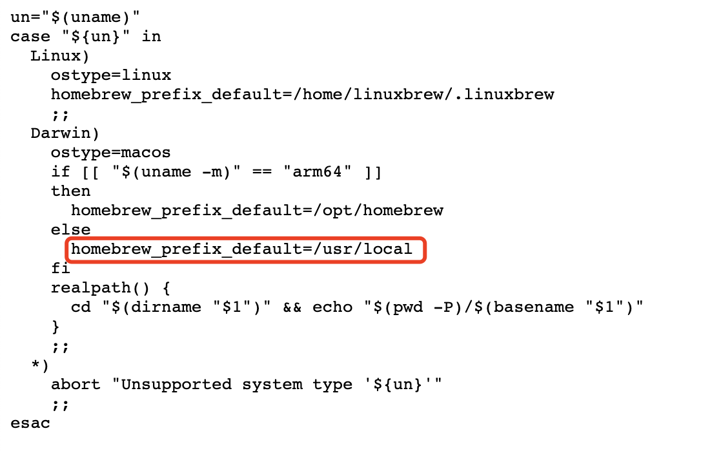

# macOS 软件下载

- [马可菠萝](https://www.macbl.com/)
- [未来 Mac 下载](https://mac.orsoon.com/)
- [玩机手册](https://www.rjsos.com/mac)
- [麦氪派](https://www.waitsun.com/topics/os)
- [潘多拉盒子](https://www.inpandora.com/)
- [MacApp分享频道](https://macapp.org.cn/)

# 命令行

```shell
# 查看系统架构
$ arch
# 查看应用架构
$ lipo -archs `which vim`
# 查看系统信息
$ uname -a
```

# brew安装和卸载

```shell
# brew安装
$ /bin/bash -c "$(curl -fsSL https://raw.githubusercontent.com/Homebrew/install/master/install.sh)"
# brew卸载
$ /bin/bash -c "$(curl -fsSL https://raw.githubusercontent.com/Homebrew/install/master/uninstall.sh)"
```

从安装脚本可以看出，Intel芯片（x86_64架构）安装在`/usr/local/`，M1芯片（arm64架构）安装在`/opt/homebrew`



卸载脚本：如果是M1芯片，会同时卸载新旧路径的brew



M1芯片如果只想卸载旧路径的brew，可以下载`uninstall.sh`脚本，去掉条件判断，再执行脚本，只卸载`/usr/local`下的brew。



# ruby卸载和安装

1. Mac内置了一个Ruby，位于`/usr/bin/ruby`，版本较老，不可卸载
2. 通过`brew install ruby`安装的ruby，位于`/opt/homebrew/Cellar/ruby`

默认使用内置的Ruby，如果想使用brew安装的Ruby，需要在`.zshrc`中配置环境变量

# 问题记录

## 环境变量不生效

在`~/.bash_profile`中配好环境变量后每次重启终端需要执行`source ~/.bash_profile`才生效

原因：使用zsh插件，加载的是`~/.zshrc`文件，`~/.zshrc`中没有定义环境变量

> 在`~/.zshrc`文件后加上`source ~/.bash_profile`

## Mac空间不足，升级系统失败

Mac电脑空间不足，导致升级系统失败，且无法用U盘升回旧版本。没有用`Time Machine`备份系统

（搞了半天，差点以为回不来了，公司的IT都说要抹盘了。）

> 1. 开机按住`Option`或`Command+R`进入恢复模式
> 2. 打开终端（发现可以打开终端，一般来说已经可以为所欲为）
> 3. 进入磁盘路径：输入`cd /Volume/xxx`（一般是`/Volume/Machine HD-数据/User`，如果有空格需要转义）
> 4. 用`rm`命令删除不需要的文件，再进行升级
> 5. 如果需要拷贝重要文件出来
>    1. 可以插上U盘，`cp 电脑路径 /Volume/U盘名称/路径`
>    2. 可以将电脑和另一个电脑连上同一个局域网，用`scp`命令拷贝文件。

## 迁移数据到新电脑

### vim异常

使用vim提示如下异常

```shell
Error detected while processing /Users/Afauria/.vim/bundle/tlib_vim/plugin/02tlib.vim:
line   77: E1208: -complete used without allowing argumentsPress ENTER or type command to continue
# 原因：旧版本vim问题，在高版本系统上出错
# 解决方法：更新vim插件
cd /Users/Afauria/.vim/bundle/tlib_vim/plugin/
git pull
```

### python脚本异常

使用cd命令进入路径提示

```shell
env: python: No such file or directory
# 原因：新版本系统上内置python3，去掉了python2
# 解决方法：将python链接到python3的路径
ln -s /opt/homebrew/bin/python3 /opt/homebrew/bin/python
```

### 存储空间显示异常

迁移数据后【关于本机->储存空间管理】中【文稿】和【应用程序】不显示内容，但是空间占用是正常的。

> 更新了一下系统版本之后自动修复了

### mysql数据库异常

连接数据库提示`ERROR 2002 (HY000): Can't connect to local MySQL server through socket '/tmp/mysql.sock'`

解决：重启mysql服务`brew services restart mysql`

### brew架构不正确

数据从Intel架构迁移到M1架构，使用brew提示：`Error: Cannot install in Homebrew on ARM processor in Intel default prefix (/usr/local)!`

原因：Intel芯片brew位于`/usr/local/`，M1芯片brew位于`/opt/homebrew`

解决方法：执行`echo 'eval $(/opt/homebrew/bin/brew shellenv)' >> /Users/Afauria/.zprofile`，重新配置环境变量。
