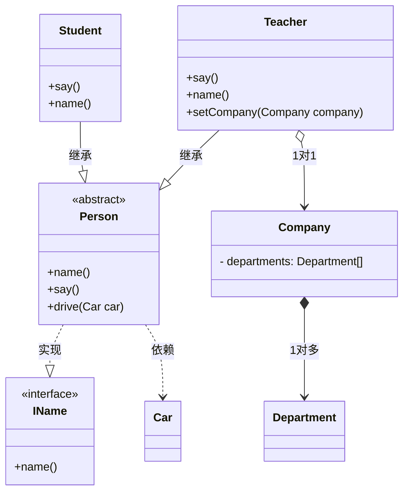
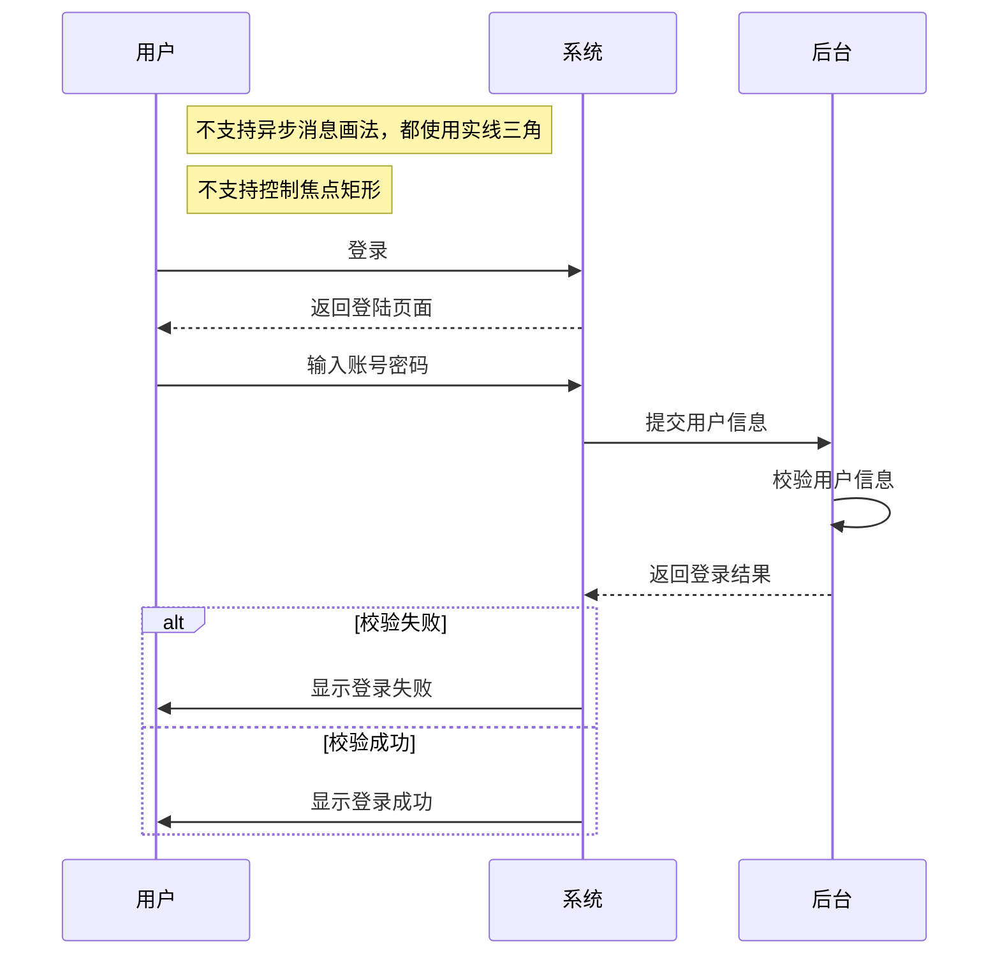

# UML(Unified Modeling Language， 统一建模语言)

## 模型分类

1. 功能模型：从用户的角度展示系统的功能，包含用例图；
2. 对象模型： 采用对象，属性，操作，关联等概念展示系统的结构，包括类图、对象图。
3. 动态模型： 展现系统的内部行为，包括时序图，活动图，状态图。

## 用途

- 需求分析： 用例图，对外部的参与者以及其需要的系统功能建模，表示客户需求；
- 概要设计： 类图、状态图、协作图、活动图，描述系统的静态结构、动态特征；
- 详细设计：状态图、协作图、活动图、序列图，产生技术解决方案；
- 测试：类图、构件图、部署图，单元测试使用类图，集成测试使用构件图、部署图。

# 用例图（Use Case Diagram）

1. 静态图
2. 表现了系统角色划分，角色和用例间的关系，用例和用例间的关系
3. 用于**描述软件功能和需求**

## 元素

1. 角色（Actor）：与应用程序或系统进行交互的用户、组织或外部系统。用一个小人表示。
2. 用例（Use Case）：用例就是外部可见的系统功能，对系统提供的服务进行描述。用椭圆表示。
3. 子系统（Sub System）：用来展示系统的一部分功能，这部分功能联系紧密。

## 关系

1. 关联(Association)：对象和用例之间的联系。
2. 泛化(Inheritance)：对象和对象间、用例和用例间的继承关系。
3. 包含(Include)：基础用例的子用例
4. 扩展(Extend)：对基础用例的扩展，子用例是一个可选的过程

## 示例

1. 导游继承游客
2. 导游可以办理团队手续
3. 游客可以办理个人手续
4. 团队手续包含个人手续
5. 办理个人手续的时候可以选择是否需要行李托运


 游客;
(团队手续办理) as A;
(个人手续办理) as B;
(行李托运) as C;
导游--A;
A -.-> B: [《include》];
C -.-> B: [《extend》];
游客 -- B;
@enduml
'>

# 活动图（Activity Diagram）

1. 动态图
2. 可以用**泳道**区分用例归属的角色，体现角色间的交互关系
3. 用于**描述软件功能和需求**

## 元素

1. 初始节点：只有一个。实心圆表示。
2. 活动终点：**可以有多个**。圆圈内加一个实心圆表示。
3. 转换：转换到下一个活动，箭头表示
4. 决策：根据条件判断转换到不同活动。菱形表示
5. 分叉和汇合：分叉用于将动作分为多个并行的分支，汇合用于同步这些分支。使用圆角矩形表示
6. 泳道：将活动划分到不同对象进行

## 示例


# 类图

1. 描述的是系统的静态结构，表达期望的软件实现方案
2. 描述系统中类、接口级别的设计，描述每个类的功能和关系

## 元素

- `+` public
- `-` private
- `#` protected
- `~` package/internal
- `*` abstract: `someAbstractMethod()*`，抽象方法，斜体
- `$` static: `someStaticMethod()$`，静态方法，下划线

## 关系

1. 泛化：继承关系，空心三角实线表示
2. 实现：接口实现，空心三角虚线表示
3. 依赖：弱一点的关联，一般是局部变量、参数，虚线箭头表示
4. 关联（单向关联、双向关联、自关联）：持有关系，一般是成员变量，自关联如链表节点，实线箭头表示。
5. 组合：关联关系的一种，A组合B，B不可以脱离A单独存在，实心菱形直线表示
6. 聚合：关联关系的一种，A聚合B，B可以脱离A单独存在，空心菱形直线表示

关系强弱：泛化>= 实现> 组合> 聚合> 关联> 依赖

关联、组合、聚合在代码中的体现都是成员变量，需要结合语义上下文才能判断是什么关系。

## 示例



# 时序图

1. 动态图
2. 描述对象之间的消息类型和交互顺序

## 元素

1. 角色
2. 对象：时序图顶部，矩形表示
3. 生命线：表示对象的生命周期，垂直虚线表示
4. 控制焦点：对象在某个时间段内执行的操作，控制焦点两端不要超过矩形
5. 消息
   1. 同步消息：消息发送者把控制传递给消息接受者，然后停止活动，等待接收者放弃或者返回控制，实心三角箭头实线表示
   2. 异步消息：消息发送者把控制传递给消息接受者，然后继续自己的活动，不等待接收者返回，实线箭头表示
   3. 返回消息：虚线箭头表示
   4. 自关联消息：对象调用自身方法，指向自身
6. 组合片段：指定条件或者子进程应用区域
   1. 抉择（Alt）：片段包含多个备用消息序列，只发生一个消息序列，相当于if...else
   2. 选项（Opt）：片段包含一个可能发生或者不发生的消息序列，相当于if...
   3. 循环（Loop）：片段重复一定次数，可以指定片段重复条件，相当于for...
   4. 中断（Break）：如果执行此片段，则放弃序列中其余部分
   5. 并行（Par）：片段中的事件可以并行交错执行，相当于多线程
   6. ....

注：同步消息和返回消息不一定是成对的，返回为void时可省略

## 示例



# 结语

只介绍了一部分常用的图和用法，其余的不展开介绍了

注：

`mermaid`不支持用例图、活动图，可以使用`gravizo`生成`plantuml`图，不能空行，结尾要加分号

```

```

**参考文章**：

* [gravizo](https://g.gravizo.com/)
* [plantuml](https://plantuml.com/zh/)

