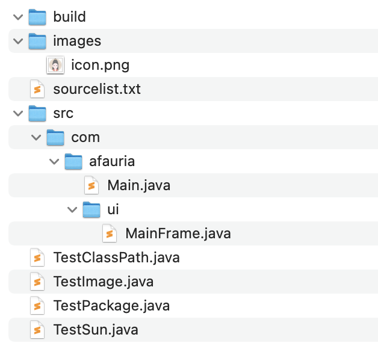
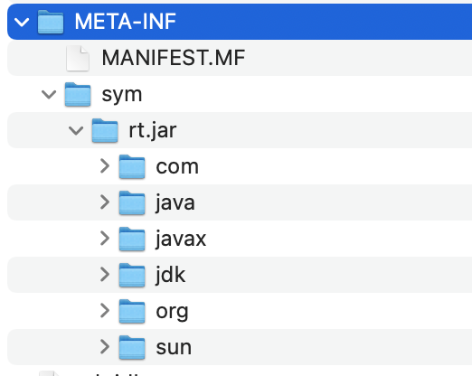
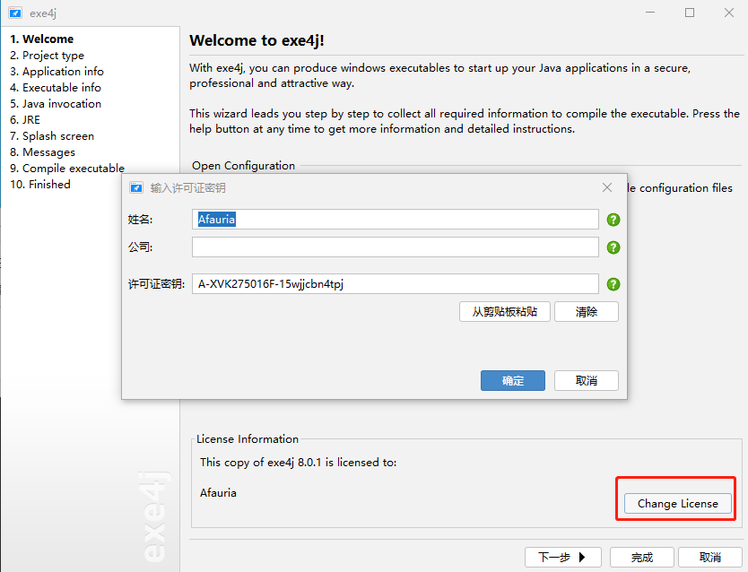
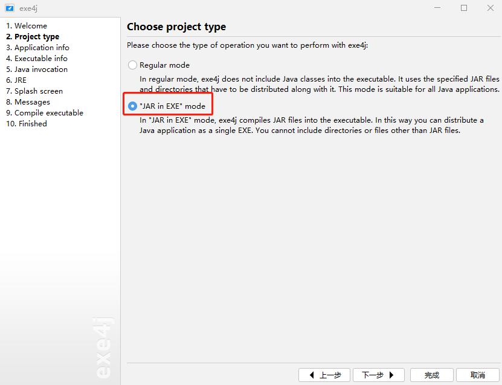
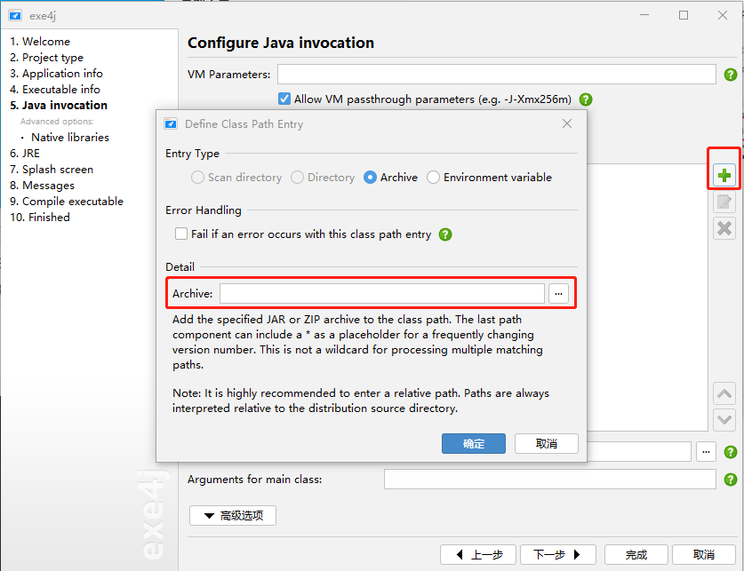

# 前言

Java程序编译和运行主要分为以下过程

1. 使用`javac`编译，将java文件编译成class字节码文件
2. 使用`jar`打包
3. 使用`java`启动虚拟机执行，Windows下可以打包成exe运行

本文用到的演示示例如下：[GitHub地址](https://github.com/Afauria/TestJavac)



# javac编译

常用选项：

* `-encoding UTF8`：指定UTF8编码，有中文字符时需要用到
* `-d build`：指定class输出路径，默认和源文件同一路径。不同IDE输出路径不同，例如eclipse输出到bin目录
* `-verbose`：输出详细的编译信息

示例：

```shell
# 编译少量文件，使用空格分割
javac -d build First.java Second.java
# 编译多个文件，将java文件列在一个文件，使用@引用该文件
javac -d build @sourcelist.txt
# 编译同一目录下的java文件，使用通配符
javac -d build src/*.java
# 编译多级子目录下的java文件，使用路径通配符
javac -d build src/**/*.java
```

其他选项：

* `-source <JDK版本>`：指定编译版本，如果使用了高版本的特性，会编译失败
* `-target <VM版本>`：指定运行的目标版本，实际运行的JVM版本需要高于该版本
* `-processor <class>`：指定注解处理器的class文件

## 编译时搜索路径

java编译源文件时，**会按照下面的顺序搜索类文件**：

1. Bootstrap classes：JDK自带的类，主要是`jre/lib`下的jar文件，可以通过`-bootclasspath`设置
2. Extension classes：扩展类，主要是`jre/lib/ext`下的jar文件，可以通过`-extdirs`设置
3. User classes：用户类，可以通过`-cp`或者`-classpath`设置。搜索顺序为当前目录、CLASSPATH环境变量、`-classpath`下的类文件，
4. Source：源文件，通过`-sourcepath`设置

> 如果有多个路径，Linux上使用`:`分割，Windows使用`;`分隔（类似于环境变量）
>
> `-bootclasspath`和`-extdirs`几乎不会用到

`-sourcepath`和`-classpath`注意事项

* `-sourcepath`：只会搜索源码（.java文件）
* `-classpath`：可以是java文件、class文件、jar包等
  * 如果不指定sourcepath，classpath会搜索java文件和class文件
  * 如果指定了sourcepath，则classpath只搜索class文件

> javac既认识java文件也认识class文件，java（虚拟机）只认识class文件。

# jar打包

常用选项：

* `-c`：创建新档案文件。
* `-f`：指定档案文件名
* `-m`：指定清单文件。
* `-e`：指定主类，程序入口。

> 档案文件名、清单文件、主类的顺序，与f、m、e选项顺序相同

**需要进入class输出目录，否则打包的时候会把`build`文件夹也打包进去，导致主类路径不正确**

示例：

```shell
# 编译src目录下的java文件
javac -d build src/**/*.java
# 进入build目录
cd build
# 自动生成`MANIFEST.MF`清单文件，但是不会指定主类。使用`java -jar`执行的时候会提示“没有主清单属性”
jar cvf out.jar **/*.class
# 自动生成`MANIFEST.MF`清单文件，并指定主类。
jar cvfe out.jar com.afauria.Main **/*.class
# 使用指定的清单文件。
jar cvfm out.jar ../src/META-INF/MANIFEST.MF **/*.class
```

**如果代码中使用了资源文件，也要打包到jar包中。**

示例：

```shell
# TestImage中引用了`images/icon.png`资源
javac TestImage.java
# 打包资源到jar包中
jar cvfe testImage.jar TestImage TestImage*.class images/icon.png
# 运行jar包
java -jar testImage.jar
```

# java运行

使用java命令启动虚拟机，执行class文件，分为两种方式：

1. 执行class文件：`java class`，class为主类名称
2. 执行jar文件：`java -jar jarfile`，jar是归档文件，将多个class打包到一起，本质还是运行class。

> 主类不一定为Main，但是一定有main方法：`public static void main(String[] args)`

**如果定义了包名，需要输出到对应的路径下，否则执行class会找不到主类。**

示例：

```java
//定义包名
package com.afauria;
public class TestPackage {
	public static void main(String[] args) {
		System.out.println("Hello World");
	}
}
```

```shell
# 编译Java文件，输出class文件到当前目录
javac TestPackage.java
# 运行提示"找不到或无法加载主类"
java TestPackage

# 自动生成包名路径：com/afauria/TestPackage.class
javac -d ./ TestPackage.java
# 运行正常
java com.afauria.TestPackage
java com/afauria/TestPackage
```

**如果Java类依赖了其他class文件或者jar包，运行的时候需要指定`-classpath`或者`-cp`，否则会提示找不到类。**

示例：

```shell
# TestClassPath引用了out.jar中的类
# 编译TestClassPath文件，指定classpath搜索路径
javac -cp build/out.jar TestClassPath.java
# 运行TestClassPath类
java -cp .:build/out.jar TestClassPath
```

# 找不到sun包

如果代码中使用了`sun.*`或者`com.sun.*`的包，使用javac编译时会提示找不到类（JDK7及以上），并且IDE编译不报错

```java
import sun.net.sdp.SdpSupport;
public class TestSun {
}
```

使用-verbose查看编译过程

```shell
$ javac -verbose TestSun.java
[解析开始时间 RegularFileObject[TestSun.java]]
[解析已完成, 用时 13 毫秒]
[源文件的搜索路径: .]
[类文件的搜索路径: $JAVA_HOME/jre/lib/resources.jar,$JAVA_HOME/jre/lib/rt.jar,$JAVA_HOME/jre/lib/sunrsasign.jar,$JAVA_HOME/jre/lib/jsse.jar,$JAVA_HOME/jre/lib/jce.jar,$JAVA_HOME/jre/lib/charsets.jar,$JAVA_HOME/jre/lib/jfr.jar,$JAVA_HOME/jre/classes,$JAVA_HOME/jre/lib/ext/sunec.jar,$JAVA_HOME/jre/lib/ext/nashorn.jar,$JAVA_HOME/jre/lib/ext/cldrdata.jar,$JAVA_HOME/jre/lib/ext/dnsns.jar,$JAVA_HOME/jre/lib/ext/localedata.jar,$JAVA_HOME/jre/lib/ext/sunjce_provider.jar,$JAVA_HOME/jre/lib/ext/sunpkcs11.jar,$JAVA_HOME/jre/lib/ext/jaccess.jar,$JAVA_HOME/jre/lib/ext/zipfs.jar,.]
TestSun.java:1: 错误: 程序包sun.net.sdp不存在
import sun.net.sdp.SdpSupport;
                  ^
[正在加载ZipFileIndexFileObject[$JAVA_HOME/lib/ct.sym(META-INF/sym/rt.jar/java/lang/Object.class)]]
[正在检查TestSun]
[正在加载ZipFileIndexFileObject[$JAVA_HOME/lib/ct.sym(META-INF/sym/rt.jar/java/io/Serializable.class)]]
[正在加载ZipFileIndexFileObject[$JAVA_HOME/lib/ct.sym(META-INF/sym/rt.jar/java/lang/AutoCloseable.class)]]
[共 203 毫秒]
1 个错误
```

原因：在Java6之后，JDK新增了一个链接文件`ct.sym`，使用javac命令进行编译代码时，默认使用该文件进行编译时class类的检查和链接，而不是使用rt.jar。

该文件约束了JDK的建议使用的类信息，包含了`rt.jar`中**一部分类**，其余的类是JDK内部私有的类，可能在之后的版本变动，因此没有开放出来。



解决方式：

1. 指定`-bootclasspath $JAVA_HOME/jre/lib/rt.jar`
2. 添加参数`-XDignore.symbol.file`忽略`ct.sym`文件

```shell
$ javac -verbose -bootclasspath "$JAVA_HOME/jre/lib/rt.jar" TestSun.java
$ javac -verbose -XDignore.symbol.file TestSun.java
[解析开始时间 RegularFileObject[TestSun.java]]
[解析已完成, 用时 14 毫秒]
[源文件的搜索路径: .]
[类文件的搜索路径: $JAVA_HOME/jre/lib/resources.jar,$JAVA_HOME/jre/lib/rt.jar,$JAVA_HOME/jre/lib/sunrsasign.jar,$JAVA_HOME/jre/lib/jsse.jar,$JAVA_HOME/jre/lib/jce.jar,$JAVA_HOME/jre/lib/charsets.jar,$JAVA_HOME/jre/lib/jfr.jar,$JAVA_HOME/jre/classes,$JAVA_HOME/jre/lib/ext/sunec.jar,$JAVA_HOME/jre/lib/ext/nashorn.jar,$JAVA_HOME/jre/lib/ext/cldrdata.jar,$JAVA_HOME/jre/lib/ext/dnsns.jar,$JAVA_HOME/jre/lib/ext/localedata.jar,$JAVA_HOME/jre/lib/ext/sunjce_provider.jar,$JAVA_HOME/jre/lib/ext/sunpkcs11.jar,$JAVA_HOME/jre/lib/ext/jaccess.jar,$JAVA_HOME/jre/lib/ext/zipfs.jar,.]
[正在加载ZipFileIndexFileObject[$JAVA_HOME/jre/lib/rt.jar(sun/net/sdp/SdpSupport.class)]]
[正在加载ZipFileIndexFileObject[$JAVA_HOME/jre/lib/rt.jar(java/lang/Object.class)]]
[正在检查TestSun]
[正在加载ZipFileIndexFileObject[$JAVA_HOME/jre/lib/rt.jar(java/io/Serializable.class)]]
[正在加载ZipFileIndexFileObject[$JAVA_HOME/jre/lib/rt.jar(java/lang/AutoCloseable.class)]]
[已写入RegularFileObject[TestSun.class]]
[共 228 毫秒]
```

# exe打包

[exe4j](https://www.ej-technologies.com/download/exe4j/files)：将jar打包成exe可执行程序

简单介绍几个关键步骤，其余步骤按照提示配置即可。

首先输入License，否则执行exe文件会提示警告



选择jar模式



添加jar文件



# 其他工具

* javap：类文件解析器，`javap -c -v Test`
  * `-c`：对代码进行反汇编，查看汇编格式的代码
  * `-v`：可以查看附加信息，例如常量池等
  * `-s`：输出方法内部类型签名
* javadoc：Java API文档生成器
* [jd-gui](http://java-decompiler.github.io/)：反编译jar包或class文件查看源码
* [jbe](http://set.ee/jbe/)：字节码编辑器，用于查看和修改class字节码文件
* [jadx](https://github.com/skylot/jadx)：反编译jar、dex、aar、aab、apk、资源等，可视化操作界面。
